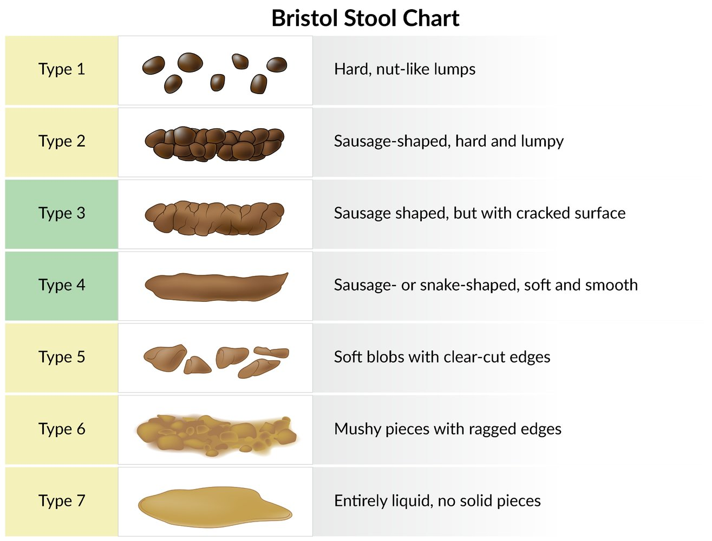
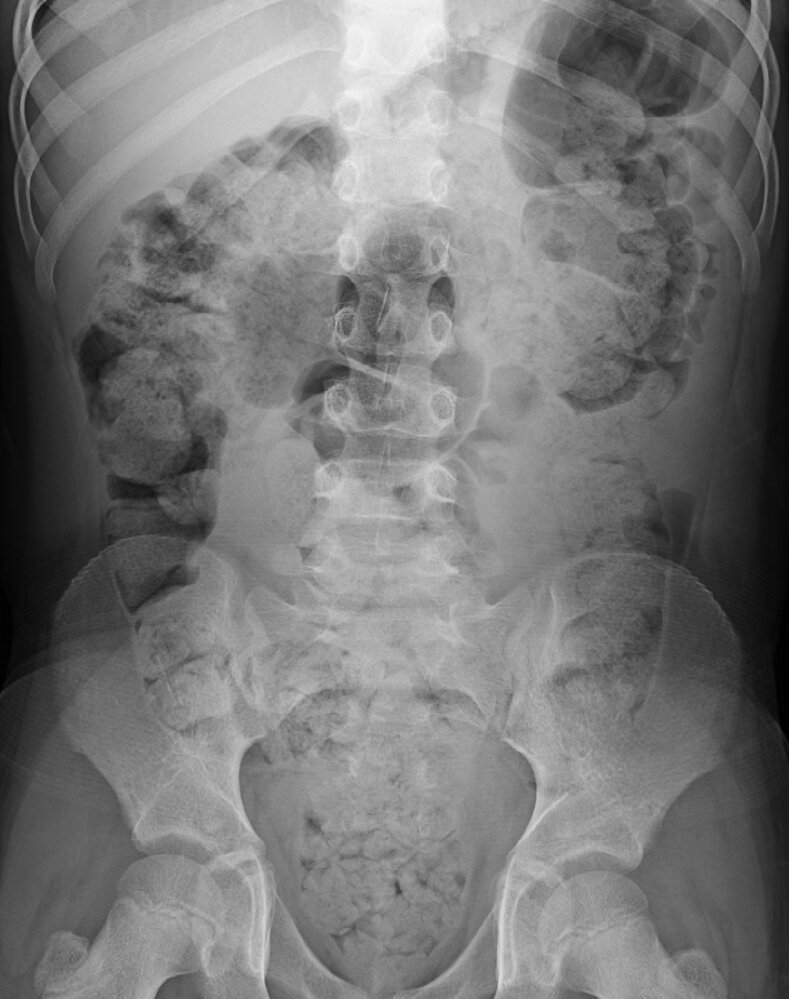

# Constipation

*Categories: Clinical knowledge > Internal medicine > Gastroenterology > Clinical problems > Constipation*

[Original Article Link](https://coursology-qbank.com/amboss/article/CM0qIg)

---

## Summary

Constipation has been defined as < 3 bowel movements per week, but this is not a required criterion, and symptoms may include straining to defecate, the passage of hard stools, a sensation of incomplete evacuation, and/or the need for self-digitation to evacuate stool. Associated features include <u>nausea</u>, abdominal <u>bloating</u>, <u>anorexia</u>, and, in patients with <u>fecal impaction</u>, <u>paradoxical diarrhea</u>. Constipation is categorized as <u>primary constipation</u> (i.e., <u>functional constipation</u>) when no underlying medical cause or offending medication is identified. <u>Primary constipation</u> is further categorized as <u>normal transit constipation</u> (most common), <u>slow transit constipation</u>, and <u>defecatory disorders</u> (i.e., <u>outlet obstruction</u>, <u>pelvic dyssynergia</u>). <u>Secondary constipation</u> is due to an identified cause (e.g., metabolic disorders, neurological disorders, mechanical obstruction, medication use). Evaluation of constipation in adults begins with identifying <u>red flag features</u> for colorectal <u>malignancy</u> and signs of <u>secondary constipation</u> that may warrant specific diagnostic studies and/or immediate referral to a specialist. In the absence of such signs, a <u>clinical diagnosis</u> of <u>primary constipation</u> can be established based on the <u>Rome IV criteria for primary constipation in adults</u>. Empiric management for <u>primary constipation</u> begins with nonpharmacological measures (e.g., increased fiber and fluid intake, education on avoiding stool-withholding behaviors) and <u>bulk-forming laxatives</u>. If symptoms persist, <u>osmotic laxatives</u> are recommended, followed by <u>stimulant laxatives</u> or <u>intestinal secretagogues</u> if necessary. Refractory symptoms after an appropriate trial of empiric therapy should prompt referral to gastroenterology to evaluate for <u>disorders of defecation</u> or <u>colon</u> transit. <u>Secondary constipation</u> is managed by treating the identified cause.

<u>Constipation in infants, children, and adolescents</u> is detailed separately.

---

## Etiology

Constipation can be chronic or acute. Chronic constipation is typically classified as primary or secondary depending on the etiology. Acute constipation may be caused by lifestyle changes , hospitalization, immobility, or the acute onset of <u>secondary causes of constipation</u>.  [[4]](https://coursology-qbank.com/amboss/article/E9c86e0)

### Primary constipation (<u>functional constipation</u>)  [[5]](https://coursology-qbank.com/amboss/article/jY1_K20)[[6]](https://coursology-qbank.com/amboss/article/RrYlSq)[[7]](https://coursology-qbank.com/amboss/article/dD0oWR)

Constipation with no identifiable secondary cause

#### Subtypes

* Normal transit constipation (most common): symptoms of constipation despite normal <u>colonic transit time</u>

* Defecatory disorders (also known as <u>outlet obstruction</u> or <u>pelvic floor dyssynergia</u>): difficulty evacuating stool once it reaches the <u>rectum</u>

* Can manifest with prolonged straining, rectal discomfort, and trouble passing even soft stools

* May be caused by inadequate rectal propulsion, increased resistance to evacuation , or other factors

* <u>Slow-transit constipation</u>

#### Risk factors for primary constipation [[6]](https://coursology-qbank.com/amboss/article/RrYlSq)

* Lifestyle: poor diet, insufficient physical activity, <u>obesity</u>

* Genetic predisposition

* Psychological and behavioral disorders

* Alterations in <u>normal gut flora</u>, <u>colonic</u> dysmotility [[5]](https://coursology-qbank.com/amboss/article/jY1_K20)

> [!TIP]
> A predominance of abdominal <u>bloating</u>, cramping, and <u>pain</u> associated with constipation should increase the suspicion for <u>IBS-C</u>. [[8]](https://coursology-qbank.com/amboss/article/EtY82I)

### Secondary constipation [[5]](https://coursology-qbank.com/amboss/article/jY1_K20)[[6]](https://coursology-qbank.com/amboss/article/RrYlSq)[[7]](https://coursology-qbank.com/amboss/article/dD0oWR)

Constipation due to a medical disorder or medication

|  Etiology of secondary constipation [[5]](https://coursology-qbank.com/amboss/article/jY1_K20)[[6]](https://coursology-qbank.com/amboss/article/RrYlSq)[[7]](https://coursology-qbank.com/amboss/article/dD0oWR)  |  |
| --- | --- |
| Gastrointestinal causes |   * <u>Mechanical bowel obstruction</u> resulting from, e.g.:  * <u>Volvulus</u>  * <u>Obstructed hernia</u>  * <u>Diverticulosis</u> → <u>diverticulitis</u>  * <u>Anal cancer</u>  * <u>Colorectal carcinoma</u>  * <u>Colonic</u> or <u>rectal strictures</u>  * Thrombosed <u>hemorrhoids</u>  * <u>Ileus</u>  * <u>IBS-C</u>  * <u>Celiac disease</u>    |
| Neurological causes |   * Neuropathy (e.g., due to <u>vitamin B12 deficiency</u>, <u>diabetic neuropathy</u>)  * <u>Stroke</u>  * <u>Hirschsprung disease</u>  * <u>Parkinson disease</u>  * <u>Chagas disease</u> (<u>megacolon</u>)  * <u>Botulism</u>  * <u>Multiple sclerosis</u>  * <u>Spinal cord injury</u>    |
| Metabolic causes |   * <u>Electrolyte</u> imbalance (especially <u>hypokalemia</u>, <u>hypercalcemia</u>)  * <u>Hypothyroidism</u>  * <u>Diabetes</u> mellitus  * <u>Hyperparathyroidism</u>  * <u>Heavy metal poisoning</u> (e.g., <u>lead toxicity</u>) [[5]](https://coursology-qbank.com/amboss/article/jY1_K20)    |
| <u>Connective tissue disorders</u> |   * <u>Scleroderma</u>  * <u>Systemic lupus erythematosus</u>  * <u>Dermatomyositis</u>  * <u>Amyloidosis</u>    |
| Constipation-inducing medications |   * <u>Analgesics</u>: <u>opioids</u>, <u>NSAIDs</u>  * <u>Cation</u>-containing medications: <u>iron supplements</u>, <u>calcium</u> supplements, <u>antacids</u> (e.g., <u>calcium</u>, aluminum)  * <u>Antihypertensives</u>: <u>calcium channel blockers</u>, <u>beta blockers</u>  * <u>Bile acid resins</u>  * <u>Neurotransmitter</u>-altering medications  * <u>Antipsychotics</u>  * Antiparkinsonian medications  * <u>5-HT3 receptor antagonists</u>  * <u>Anticholinergics</u>  * <u>Antidepressants</u> (e.g., <u>tricyclic antidepressants</u>)  * <u>Anticonvulsants</u>    |

---

## Pathophysiology

Both primary and <u>secondary constipation</u> can cause changes in stool consistency and defecation habits.

* Mechanism of altered stool consistency
* External factors such as lack of exercise or inadequate fluid and fiber intake (<u>primary constipation</u>)/internal factors such as changes within the <u>colon</u> or <u>rectum</u> (<u>secondary constipation</u>) → slow passage of stool → prolonged absorption of water by the bowel → dry, hard stool → painful defecation → sensation of incomplete and irregular bowel emptying → constipation

* Mechanism of altered bowel motility

* Effective <u>peristalsis</u> of the bowel is controlled by intrinsic (e.g., <u>myenteric plexus</u>) and extrinsic (e.g., <u>sympathetic</u> and <u>parasympathetic</u>) innervation.

* Any alteration in bowel innervation may lead to ineffective <u>peristalsis</u>.

* Drugs (e.g., <u>calcium channel blockers</u>, <u>opiates</u>, <u>antispasmodics</u>, <u>antidepressants</u>) [[9]](https://coursology-qbank.com/amboss/article/2D0TdR) → altered autonomic outflow and bowel muscle contraction [[10]](https://coursology-qbank.com/amboss/article/dYaoLQ)

* Endocrine pathology (e.g., <u>hypothyroidism</u>) → downregulated bowel motility

* Neurological pathology (e.g., spinal injury, <u>enteric</u> neuropathy) → disease or trauma of bowel innervation

* Ineffective <u>peristalsis</u> → difficult passage of stool regardless of stool consistency → sensation of incomplete and irregular bowel emptying

References:[[10]](https://coursology-qbank.com/amboss/article/dYaoLQ)[[11]](https://coursology-qbank.com/amboss/article/U30b3f)

---

## Approach to management

* Manage complications

* Identify and treat <u>fecal impaction</u>.

* Suspected acute complication (e.g., <u>bowel obstruction</u>, <u>bowel perforation</u>) [[13]](https://coursology-qbank.com/amboss/article/fIYkXq)

* Urgent general <u>surgery</u> and/or gastroenterology consult

* Obtain urgent abdominal imaging (CT or <u>x-ray abdomen</u>).

* Perform a clinical evaluation for constipation, including identification of:

* <u>Red flags in adults with constipation</u>

* <u>Rome IV diagnostic criteria for primary constipation in adults</u>

* <u>Risk factors for primary constipation</u>

* Clinical features or history (including medication history) suggestive of a <u>secondary cause of constipation</u>

* No abnormal findings, no <u>red flags</u>

* Obtain a <u>CBC</u> to evaluate for <u>anemia</u>; other laboratory tests and imaging are not routinely recommended. [[5]](https://coursology-qbank.com/amboss/article/jY1_K20)[[6]](https://coursology-qbank.com/amboss/article/RrYlSq)[[14]](https://coursology-qbank.com/amboss/article/tY1XI20)

* Diagnose <u>functional constipation</u> if <u>Rome IV diagnostic criteria for primary constipation in adults</u> are met.

* Initiate treatment.

* Abnormal findings or <u>red flags</u>

* <u>Red flags in constipation</u>: Refer to gastroenterology for <u>colonoscopy</u> to evaluate for colorectal <u>malignancy</u>. [[7]](https://coursology-qbank.com/amboss/article/dD0oWR)

* Suspected <u>secondary constipation</u>: Identify and treat the underlying cause.

* Obtain <u>laboratory studies</u> as needed.

* Discontinue <u>constipation-inducing medications</u> when possible.

* Suspected <u>defecatory disorder</u>: Refer to gastroenterology or urogynecology for anorectal function testing.

> [!WARNING]
> Acute-onset constipation associated with abdominal <u>pain</u> should raise suspicion for possible <u>bowel obstruction</u>. <u>Complete bowel obstruction</u> is a <u>medical emergency</u>.

---

## Clinical evaluation

A comprehensive history, <u>physical examination</u>, and assessment of <u>red flag features</u> should be conducted in all patients.

### Red flags in constipation [[6]](https://coursology-qbank.com/amboss/article/RrYlSq)[[13]](https://coursology-qbank.com/amboss/article/fIYkXq)[[14]](https://coursology-qbank.com/amboss/article/tY1XI20)[[15]](https://coursology-qbank.com/amboss/article/sY1tq20)

These features in a patient with constipation should prompt evaluation, e.g., with a diagnostic <u>colonoscopy</u>, for an underlying colorectal <u>malignancy</u>.

* Blood in stool

* <u>Rectal bleeding</u>

* Rectal <u>tenesmus</u>

* <u>Clinically significant unintentional weight loss</u>

* Unexplained <u>iron deficiency anemia</u>

* <u>Jaundice</u>

* Obstructive symptoms

* Patients > 50 years of age without previous <u>screening for colorectal cancer</u>; recent guidelines suggest 45 years as the cut-off to start screening  [[4]](https://coursology-qbank.com/amboss/article/E9c86e0)[[6]](https://coursology-qbank.com/amboss/article/RrYlSq)[[12]](https://coursology-qbank.com/amboss/article/HCcKte0)[[16]](https://coursology-qbank.com/amboss/article/LwXwjZ0)

* Abdominal or rectal mass

* Sudden change in bowel habits (e.g., onset of constipation without clear cause, change in stool caliber)

* <u>Family history</u>;  of pertinent GI conditions (e.g., <u>colorectal carcinoma</u>, <u>IBD</u>)

> [!WARNING]
> A change in bowel habits (e.g., pencil-thin stool caliber) and/or <u>rectal bleeding</u>, especially in patients > 50 years of age, may indicate <u>colorectal cancer</u> and must be evaluated. [[6]](https://coursology-qbank.com/amboss/article/RrYlSq)

### Rome IV diagnostic criteria (adults) [[8]](https://coursology-qbank.com/amboss/article/EtY82I)

The Rome IV diagnostic criteria for primary constipation in adults are only applied if there is no suspected or identified <u>cause of secondary constipation</u>. All criteria must be present to establish a diagnosis.  [[7]](https://coursology-qbank.com/amboss/article/dD0oWR)

* Symptom onset ≥ 6 months prior

* The presence of ≥ 2 of the following symptoms in at least 25% of bowel movements over the last 3 months:

* Passage of spontaneous stool < 3 times/week

* Passage of hard or lumpy stool

* Sensation of anorectal obstruction

* Sensation of incomplete evacuation (rectal <u>tenesmus</u>)

* Straining during attempts to defecate

* Manual aid to evacuate stool

* Loose stools are rarely present except when <u>laxatives</u> are used.

* <u>Rome IV criteria for irritable bowel syndrome</u> are not met

> [!TIP]
> Infrequent, hard stools (e.g., Bristol stool types 1 and 2) may suggest <u>slow transit constipation</u>. Straining and a sensation of incomplete evacuation may suggest a <u>defecatory disorder</u>. [[8]](https://coursology-qbank.com/amboss/article/EtY82I)[[13]](https://coursology-qbank.com/amboss/article/fIYkXq)

Bristol stool chart

### <u>Physical examination</u> [[6]](https://coursology-qbank.com/amboss/article/RrYlSq)[[7]](https://coursology-qbank.com/amboss/article/dD0oWR)[[8]](https://coursology-qbank.com/amboss/article/EtY82I)

A thorough <u>physical examination</u> should be performed, including the following:

* <u>Abdominal examination</u> to assess for GI pathology

* Inspection of <u>perineum</u> and <u>anus</u>

* Evaluate for <u>anal fissures</u> and <u>hemorrhoids</u>.

* Test the <u>anal wink</u> reflex: An absent <u>anal wink</u> reflex suggests a neurological pathology (e.g., sacral nerve injury). [[17]](https://coursology-qbank.com/amboss/article/eD0xWR)

* <u>Digital rectal examination</u>

* Check for masses (e.g., <u>rectal carcinoma</u>, <u>fecal impaction</u>, <u>rectocele</u>).

* Assess <u>anal sphincter tone</u> and function for signs of <u>pelvic floor dyssynergia</u>.  [[4]](https://coursology-qbank.com/amboss/article/E9c86e0)[[18]](https://coursology-qbank.com/amboss/article/Kf1UMT0)

---

## Diagnostics

Diagnostics are not routinely required for <u>primary constipation</u> (i.e., if the <u>Rome IV criteria for primary constipation in adults</u> are met).

### <u>Laboratory studies</u> [[4]](https://coursology-qbank.com/amboss/article/E9c86e0)[[5]](https://coursology-qbank.com/amboss/article/jY1_K20)[[12]](https://coursology-qbank.com/amboss/article/HCcKte0)

Consider the following to evaluate for <u>secondary causes of constipation</u> as clinically indicated.

* <u>CBC</u>: Unexplained <u>iron deficiency anemia</u> in a patient with chronic constipation should prompt evaluation for <u>colorectal cancer</u>.

* <u>BMP</u>: <u>Hypokalemia</u> (e.g., due to <u>loop diuretics</u>) and <u>uremia</u> can cause constipation.

* Blood <u>glucose</u> levels, <u>HbA1c</u>: Patients with <u>diabetes</u> can develop constipation secondary to <u>autonomic neuropathy</u>.

* <u>Thyroid function tests</u>: <u>Hypothyroidism</u> can cause constipation.

* Serum <u>PTH</u> levels and <u>ionized calcium</u>: <u>Hyperparathyroidism</u> can cause <u>hypercalcemia</u>, which can lead to constipation.

* Serum <u>magnesium</u>: <u>Hypomagnesemia</u> can cause constipation.

### <u>Colonoscopy</u> [[4]](https://coursology-qbank.com/amboss/article/E9c86e0)[[12]](https://coursology-qbank.com/amboss/article/HCcKte0)[[13]](https://coursology-qbank.com/amboss/article/fIYkXq)

* Indications

* <u>Red flags in constipation</u>

* Age > 50 years if age-appropriate <u>colorectal cancer screening</u> has not been performed; recent guidelines suggest starting screening at 45 years of age  [[4]](https://coursology-qbank.com/amboss/article/E9c86e0)[[12]](https://coursology-qbank.com/amboss/article/HCcKte0)[[16]](https://coursology-qbank.com/amboss/article/LwXwjZ0)

* Findings [[15]](https://coursology-qbank.com/amboss/article/sY1tq20)[[19]](https://coursology-qbank.com/amboss/article/vi1Atg0)

* May be normal; <u>colonoscopy</u> has a low diagnostic yield for isolated constipation

* May detect features of an underlying etiology: e.g., <u>colorectal cancer</u>, features of <u>IBD</u>, <u>colonic stricture</u>

> [!TIP]
> In the absence of <u>red flags in constipation</u>, it is unlikely that <u>colonoscopy</u> will detect an underlying etiology. [[15]](https://coursology-qbank.com/amboss/article/sY1tq20)[[19]](https://coursology-qbank.com/amboss/article/vi1Atg0)

### Imaging

* Indications: suspected complications

* Modalities: CT abdomen and <u>pelvis</u> with IV contrast, <u>x-ray abdomen</u>, <u>POCUS</u> [[20]](https://coursology-qbank.com/amboss/article/p8XLn-)[[21]](https://coursology-qbank.com/amboss/article/GKYB3J)

* Findings

* Uncomplicated constipation: may be normal; fecal loading with/without <u>colonic</u> dilation may be seen  [[13]](https://coursology-qbank.com/amboss/article/fIYkXq)

* Features of complications: e.g., pneumoperitoenum , <u>radiological signs of mechanical bowel obstruction</u>

Constipation

Pneumoperitoneum

Mechanical small bowel obstruction

Small bowel obstruction

### Advanced studies [[4]](https://coursology-qbank.com/amboss/article/E9c86e0)[[7]](https://coursology-qbank.com/amboss/article/dD0oWR)[[12]](https://coursology-qbank.com/amboss/article/HCcKte0)[[13]](https://coursology-qbank.com/amboss/article/fIYkXq)

Patients with chronic <u>primary constipation</u> refractory to lifestyle modifications and empiric therapy should be referred to a specialist for additional workup, to identify the subtype and tailor management.

* Anorectal function testing: to evaluate for <u>defecatory disorders</u>

* <u>Balloon expulsion test</u>

* <u>Anorectal manometry</u>

* <u>Defecography</u> (barium or <u>MRI</u>)

* <u>Colon transit studies</u>: to differentiate between <u>normal transit constipation</u> and <u>slow transit constipation</u>

---

## Treatment

### Approach

This section details the management of patients with acute constipation (with no <u>red flag features</u>) and chronic <u>primary constipation</u>.

* First-line: nonpharmacological measures (e.g., <u>high-fiber diet</u>, increased fluid intake, and exercise) and/or trial of fiber supplementation (i.e., <u>bulk-forming laxatives</u>)   [[5]](https://coursology-qbank.com/amboss/article/jY1_K20)[[22]](https://coursology-qbank.com/amboss/article/JCdsGH0)

* Second-line: step-wise pharmacotherapy with <u>laxatives</u> from other classes [[6]](https://coursology-qbank.com/amboss/article/RrYlSq)[[13]](https://coursology-qbank.com/amboss/article/fIYkXq)[[22]](https://coursology-qbank.com/amboss/article/JCdsGH0)

* Begin with an <u>osmotic laxative</u>.

* If symptoms persist, add a short course of a <u>stimulant laxative</u>.

* Constipation refractory to initial pharmacological treatment after ∼ 4 weeks [[5]](https://coursology-qbank.com/amboss/article/jY1_K20)

* Patients using <u>opioids</u> [[23]](https://coursology-qbank.com/amboss/article/3IYScq)[[24]](https://coursology-qbank.com/amboss/article/8IYOeq)

* Initiate a <u>peripherally acting μ-opioid receptor antagonist</u>.

* See “<u>Opioid-induced constipation</u>” for details.

* Patients not using <u>opioids</u>: Refer to gastroenterology for further evaluation and management.  [[22]](https://coursology-qbank.com/amboss/article/JCdsGH0)

### Nonpharmacological management of constipation [[4]](https://coursology-qbank.com/amboss/article/E9c86e0)[[6]](https://coursology-qbank.com/amboss/article/RrYlSq)[[7]](https://coursology-qbank.com/amboss/article/dD0oWR)[[8]](https://coursology-qbank.com/amboss/article/EtY82I)[[22]](https://coursology-qbank.com/amboss/article/JCdsGH0)

* <u>High-fiber diet</u>: Recommend 20–35 g of <u>dietary fiber</u> daily, from <u>high fiber-containing foods</u> and/or <u>bulk-forming laxatives</u> (e.g., <u>psyllium</u>).  [[23]](https://coursology-qbank.com/amboss/article/3IYScq)

* Hydration: Encourage recommended daily fluid intake.  [[25]](https://coursology-qbank.com/amboss/article/vf1ALT0)

* Physical activity: Encourage regular physical exercise.   [[5]](https://coursology-qbank.com/amboss/article/jY1_K20)[[26]](https://coursology-qbank.com/amboss/article/Df11oT0)

* Healthy bowel habits

* Schedule toileting for 10–15 minutes in the morning and ∼ 30 minutes after each meal to coincide with the <u>gastrocolic reflex</u>.

* Use a step stool while on the toilet to raise the legs and straighten the <u>colon</u>.

* Recognize and respond to urges to defecate. [[27]](https://coursology-qbank.com/amboss/article/u9cp6e0)

* <u>Biofeedback</u>: Recommend in patients with <u>defecatory disorders</u> who are able to actively participate. [[12]](https://coursology-qbank.com/amboss/article/HCcKte0)

> [!TIP]
> Introduce fiber slowly (over several weeks) and ensure adequate fluid intake simultaneously to prevent cramping and <u>bloating</u>. [[23]](https://coursology-qbank.com/amboss/article/3IYScq)

> [!TIP]
> Constipation that worsens with fiber supplementation may suggest <u>slow transit constipation</u> or a <u>defecatory disorder</u>. [[28]](https://coursology-qbank.com/amboss/article/wf1hoT0)

### <u>Laxatives</u> [[4]](https://coursology-qbank.com/amboss/article/E9c86e0)[[5]](https://coursology-qbank.com/amboss/article/jY1_K20)[[14]](https://coursology-qbank.com/amboss/article/tY1XI20)[[22]](https://coursology-qbank.com/amboss/article/JCdsGH0)

#### Important considerations

* Patients taking <u>bulk-forming laxatives</u> and <u>osmotic laxatives</u> should be instructed to ensure adequate water consumption.

* Chronic;  osmotic or stimulant <u>laxative</u> use may lead to <u>hypokalemia</u> (which can further reduce bowel motility)  and <u>metabolic alkalosis</u>. [[29]](https://coursology-qbank.com/amboss/article/fT1kJT0)

* <u>Stimulant laxatives</u> should be:

* Prescribed for short-term use only; chronic <u>stimulant laxative</u> use may lead to dependency.  [[13]](https://coursology-qbank.com/amboss/article/fIYkXq)[[25]](https://coursology-qbank.com/amboss/article/vf1ALT0)

* Taken approximately 30 minutes after meals to coincide with the <u>gastrocolic reflex</u> [[12]](https://coursology-qbank.com/amboss/article/HCcKte0)

* <u>Stool softeners</u> (e.g., <u>docusate</u>) should not be used for initial pharmacological treatment because their benefit has not been proven. [[30]](https://coursology-qbank.com/amboss/article/Hb1KE20)

> [!WARNING]
> Avoid <u>bulk-forming laxatives</u> if <u>fecal impaction</u> is suspected. [[23]](https://coursology-qbank.com/amboss/article/3IYScq)

> [!TIP]
> <u>Polyethylene glycol</u> is the preferred <u>osmotic laxative</u>, with <u>lactulose</u> preferred in those who fail to improve. <u>Bisacodyl</u> and <u>sodium picosulfate</u> are preferred <u>stimulant laxatives</u>. [[22]](https://coursology-qbank.com/amboss/article/JCdsGH0)

|  Overview of laxatives [[4]](https://coursology-qbank.com/amboss/article/E9c86e0)[[5]](https://coursology-qbank.com/amboss/article/jY1_K20)[[14]](https://coursology-qbank.com/amboss/article/tY1XI20)[[27]](https://coursology-qbank.com/amboss/article/u9cp6e0)[[31]](https://coursology-qbank.com/amboss/article/TT16JT0)  |  |  |  |
| --- | --- | --- | --- |
| Class | Agents | Mechanism of action | Adverse effects |
| Bulk-forming laxatives(fiber) |   * Methylcellulose DOSAGE: chemical compound derived from <u>cellulose</u>  * Psyllium husks DOSAGE: outer coating of the seed of the Plantago ovata plant  * Polycarbophil DOSAGE    |   * <u>Bulk-forming laxatives</u> are indigestible, not systemically absorbed.  * Soluble fibers increase water absorption in the intestinal lumen → stretching of the bowel wall → stimulation of <u>peristalsis</u>    |   * <u>Bloating</u>  * <u>Diarrhea</u>  [[5]](https://coursology-qbank.com/amboss/article/jY1_K20)[[23]](https://coursology-qbank.com/amboss/article/3IYScq)  * Worsening constipation  [[28]](https://coursology-qbank.com/amboss/article/wf1hoT0)    |
| Osmotic laxatives |   * Polyethylene glycol (<u>PEG</u>): very effective and well tolerated (best initial treatment) DOSAGE [[5]](https://coursology-qbank.com/amboss/article/jY1_K20)[[23]](https://coursology-qbank.com/amboss/article/3IYScq)  * Lactulose DOSAGE [[5]](https://coursology-qbank.com/amboss/article/jY1_K20)  * <u>Sorbitol</u> DOSAGE  * <u>Magnesium</u> salts  * Magnesium hydroxide DOSAGE [[14]](https://coursology-qbank.com/amboss/article/tY1XI20)  * Magnesium citrate DOSAGE [[23]](https://coursology-qbank.com/amboss/article/3IYScq)  * Glycerin suppository DOSAGE    |  * Increase of <u>osmotic pressure</u> draws water into the intestinal lumen → stimulation of intestinal motility (<u>peristalsis</u>)   |   * <u>Diarrhea</u>  [[14]](https://coursology-qbank.com/amboss/article/tY1XI20)[[23]](https://coursology-qbank.com/amboss/article/3IYScq)  * <u>Dehydration</u>  * <u>Magnesium</u> salts: <u>electrolyte</u> abnormalities  [[23]](https://coursology-qbank.com/amboss/article/3IYScq)  * Flatulence, <u>bloating</u>    |
| Stimulant laxatives (<u>secretory laxatives</u>) |   * Bisacodyl DOSAGE [[5]](https://coursology-qbank.com/amboss/article/jY1_K20)  * Sodium picosulfate DOSAGE  * Senna DOSAGE [[5]](https://coursology-qbank.com/amboss/article/jY1_K20)    |  * Stimulation of <u>epithelial</u> cell secretion of <u>electrolytes</u> into the <u>colonic</u> lumen →  * ↑ Secretion of fluid into the <u>colon</u> (with <u>bisacodyl</u>, this secretory activity is <u>nitric oxide</u>-mediated)  * Myenteric neuronal <u>depolarization</u> → <u>colon</u> contractions (<u>peristalsis</u>)   |   * <u>Diarrhea</u>, which may result in severe water and <u>potassium</u> loss  * <u>Melanosis coli</u> (<u>senna</u>)    |
| Emollient stool softener |  * Docusate (not recommended)  [[30]](https://coursology-qbank.com/amboss/article/Hb1KE20)   |  * Theoretically, emulsification (i.e., integration of water and fat) of stool → softening of stool → easier passage through the intestinal tract   |  * Abdominal <u>pain</u>, cramping   |

> [!WARNING]
> Avoid the use of <u>magnesium</u> salts in patients with <u>renal failure</u> (<u>magnesium</u> is renally excreted) or cardiac dysfunction because of the risks of <u>magnesium toxicity</u>, other <u>electrolyte</u> abnormalities, and fluid shifts that could lead to <u>volume overload</u>. [[23]](https://coursology-qbank.com/amboss/article/3IYScq)[[32]](https://coursology-qbank.com/amboss/article/hT1cqT0)

### Intestinal secretagogues [[4]](https://coursology-qbank.com/amboss/article/E9c86e0)[[13]](https://coursology-qbank.com/amboss/article/fIYkXq)[[22]](https://coursology-qbank.com/amboss/article/JCdsGH0)

A group of drugs that improve <u>colonic transit time</u> by increasing intestinal secretion of water, <u>bicarbonate</u>, and <u>chloride</u>. These may be used to manage constipation refractory to other therapies.

* Agents

* Linaclotide DOSAGE [[5]](https://coursology-qbank.com/amboss/article/jY1_K20)

* <u>Peptide</u> <u>agonist</u> of <u>guanylate cyclase</u>-C

* Increases intestinal secretion of <u>bicarbonate</u>, <u>chloride</u>, and fluid, which improves fecal transit

* Lubiprostone DOSAGE [[5]](https://coursology-qbank.com/amboss/article/jY1_K20)

* <u>Prostaglandin</u> derivative that activates <u>chloride</u> channels on the apical surfaces of <u>enterocytes</u>

* Increases intestinal fluid secretion and improves fecal transit

* <u>Plecanatide</u> [[22]](https://coursology-qbank.com/amboss/article/JCdsGH0)

* A <u>guanylate cyclase</u>-C <u>agonist</u>

* Increases intestinal secretion of <u>bicarbonate</u>, <u>chloride</u>, and fluid, which improves fecal transit

* Adverse effects

* <u>Diarrhea</u>

* <u>Nausea</u> (<u>lubiprostone</u>)

---

## Special patient groups

<u>Constipation in infants, children, and adolescents</u> is detailed separately.

### Constipation in older adults [[7]](https://coursology-qbank.com/amboss/article/dD0oWR)[[23]](https://coursology-qbank.com/amboss/article/3IYScq)[[27]](https://coursology-qbank.com/amboss/article/u9cp6e0)

#### <u>Epidemiology</u>

* Constipation is common in older adults.

* Peak <u>prevalence</u>: 8–40% of individuals > 70 years of age [[33]](https://coursology-qbank.com/amboss/article/bW1HPf0)

* More common in older adults living in institutions (e.g., long-term <u>health care facilities</u>) than those living independently [[6]](https://coursology-qbank.com/amboss/article/RrYlSq)

#### Etiology

* <u>Primary constipation</u>, related to <u>risk factors</u> that include:

* Cognitive impairment

* Prolonged immobility (e.g., patients who are bedridden and/or in a long-term care facility)

* Stressors, social isolation [[14]](https://coursology-qbank.com/amboss/article/tY1XI20)

* Impaired urge to defecate

* <u>Secondary constipation</u>, due to, e.g.:

* Colorectal <u>malignancy</u>

* <u>Polypharmacy</u> (see “<u>Constipation-inducing medications</u>”)

* <u>Autonomic neuropathies</u>, e.g., <u>diabetes</u>, <u>Parkinson disease</u>

#### Diagnostics

Similar to the <u>approach to constipation in adults</u>, with some special considerations

* Assess for <u>fecal impaction</u>.  [[7]](https://coursology-qbank.com/amboss/article/dD0oWR)

* Consider obtaining a <u>BMP</u> in patients with <u>polypharmacy</u>.

> [!TIP]
> <u>Fecal impaction</u> is common in older adults and can manifest atypically with <u>paradoxical diarrhea</u> (due to decreased rectal sensation) and nonspecific symptoms (e.g., functional decline, <u>delirium</u>) [[7]](https://coursology-qbank.com/amboss/article/dD0oWR)

#### Treatment [[23]](https://coursology-qbank.com/amboss/article/3IYScq)[[27]](https://coursology-qbank.com/amboss/article/u9cp6e0)

* Manage <u>fecal impaction</u> if present.

* Lifestyle modifications: similar to management in all adults (see “<u>Nonpharmacological management of constipation</u>” above), with some special considerations

* Fiber supplementation: Older adults are more likely to need fiber supplements to reach their daily fiber goals.

* Fluid intake

* Consider fluid-sensitive comorbidities (e.g., <u>CHF</u>, <u>CKD</u>), which are more common in older adults.

* Assess and optimize the patient's ability to communicate and/or access their fluid needs.

* Bowel habits: Discourage defecation in bedpans.

* Physical activity: Increased exercise does not decrease constipation in older patients diagnosed with constipation. [[23]](https://coursology-qbank.com/amboss/article/3IYScq)

* <u>Laxatives</u> [[23]](https://coursology-qbank.com/amboss/article/3IYScq)

* Required in most older adults with chronic constipation

* Therapy should be individualized; see “<u>Overview of laxatives</u>” for dosages.

* Preferred first-line agent: <u>polyethylene glycol</u> [[23]](https://coursology-qbank.com/amboss/article/3IYScq)

* Persistent constipation: Consider a short course of <u>stimulant laxatives</u>.

* Constipation refractory to the above measures: Refer to gastroenterology; consider <u>intestinal secretagogues</u>.

* <u>Magnesium</u> salts: Use with caution and avoid long-term use. [[23]](https://coursology-qbank.com/amboss/article/3IYScq)

* Enemas [[23]](https://coursology-qbank.com/amboss/article/3IYScq)

* Consider in patients who cannot tolerate oral <u>laxatives</u> or those with <u>fecal impaction</u>.

* Enemas with mineral oil or plain warm water (without soap) are preferable. [[27]](https://coursology-qbank.com/amboss/article/u9cp6e0)

* Avoid <u>phosphate</u> enemas because of adverse effects and toxicity. [[8]](https://coursology-qbank.com/amboss/article/EtY82I)[[27]](https://coursology-qbank.com/amboss/article/u9cp6e0)

* Consider glycerin suppositories as an alternative to enemas. [[23]](https://coursology-qbank.com/amboss/article/3IYScq)

> [!TIP]
> <u>Polyethylene glycol</u> is preferred over <u>lactulose</u> and <u>sorbitol</u> because of the lower risk of <u>electrolyte</u> imbalances. [[23]](https://coursology-qbank.com/amboss/article/3IYScq)

> [!WARNING]
> Older patients are susceptible to severe <u>laxative</u>-associated <u>adverse events</u>, e.g., <u>dehydration</u>, <u>electrolyte</u> abnormalities, and <u>hepatotoxicity</u>. [[27]](https://coursology-qbank.com/amboss/article/u9cp6e0)

---

## Complications

* <u>Fecal incontinence</u>

* <u>Fecal impaction</u>, which may lead to <u>bowel obstruction</u>, or rarely, <u>bowel perforation</u>

* <u>Anal fissures</u>

* <u>Hemorrhoids</u>

* <u>Megacolon</u>

* <u>Urinary retention</u>

* <u>Pelvic floor</u> damage in women

* <u>Rectal prolapse</u>

References:[[3]](https://coursology-qbank.com/amboss/article/UD0bdR)

We list the most important complications. The selection is not exhaustive.

---