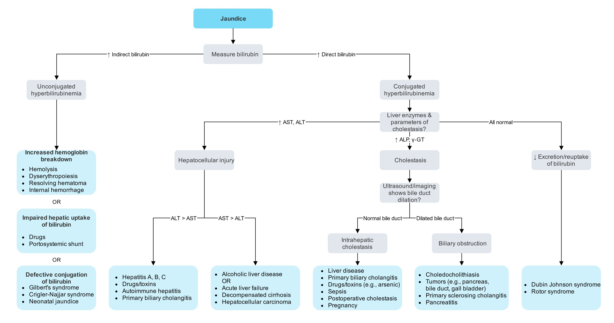
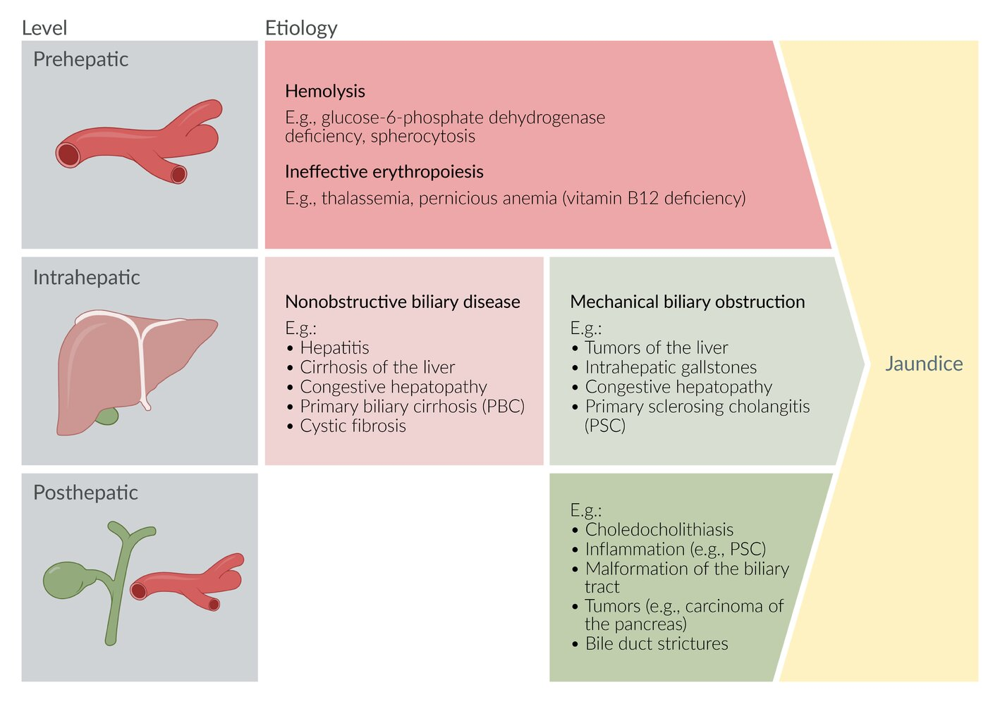
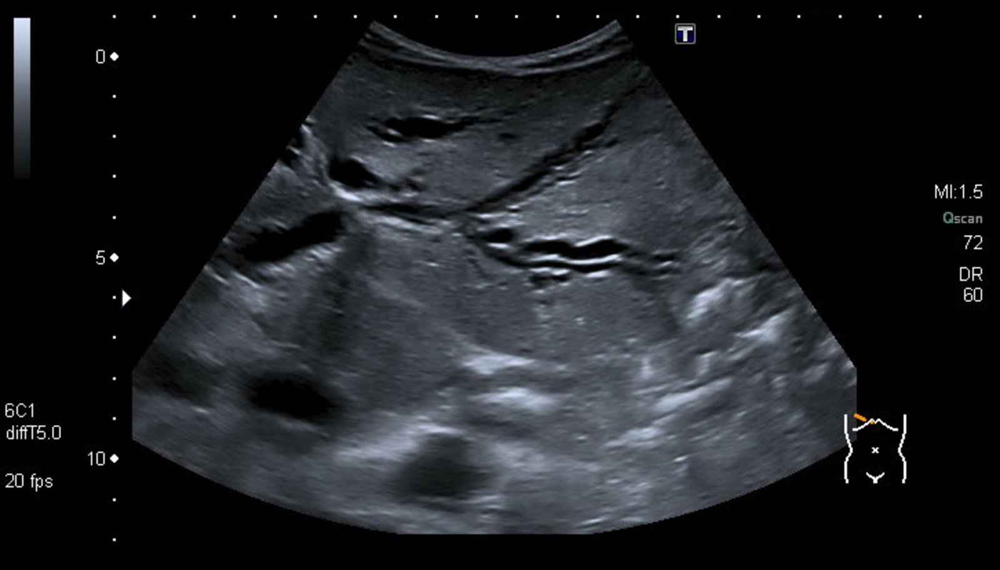
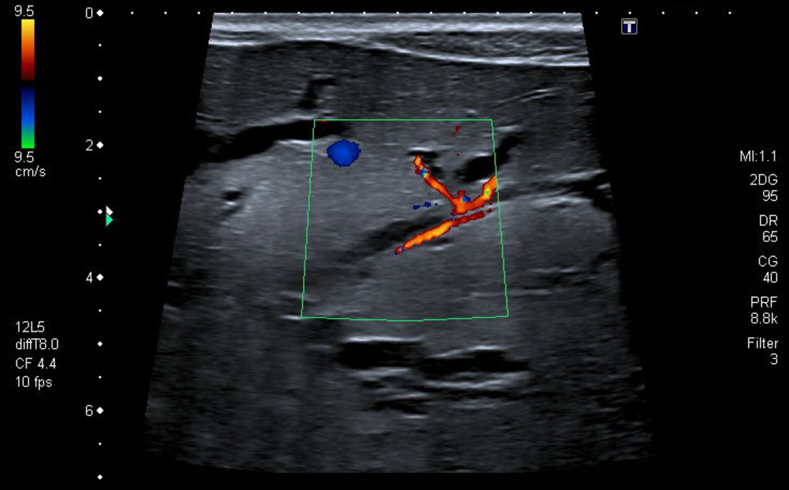
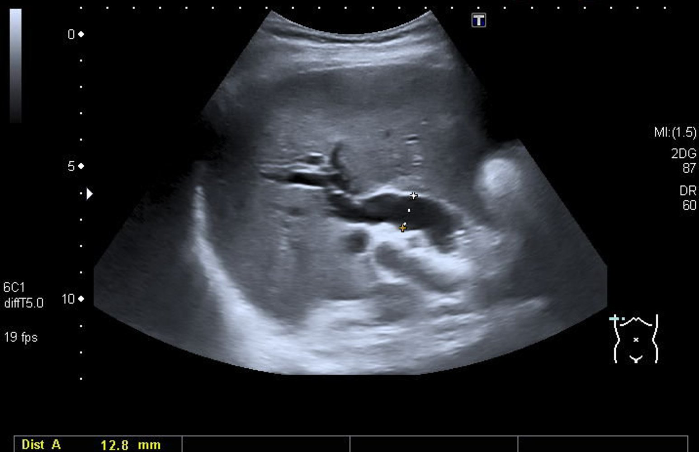
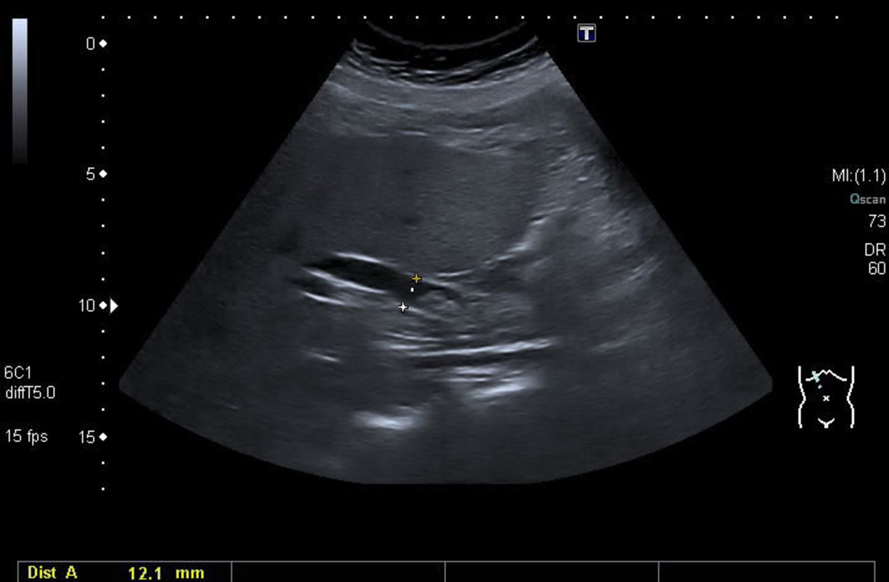
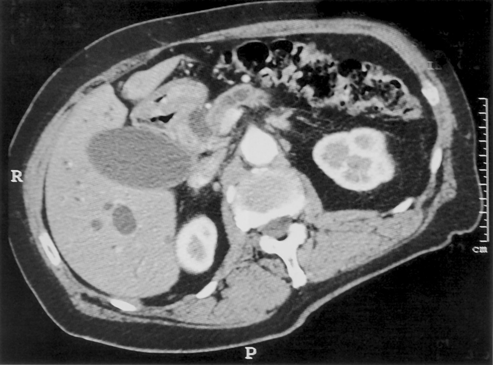

# Jaundice and cholestasis

*Categories: Clinical knowledge > Internal medicine > Gastroenterology > Clinical problems > Jaundice and cholestasis*

[Original Article Link](https://coursology-qbank.com/amboss/article/jS0_z2)

---

## Summary

<u>Jaundice</u>, or <u>icterus</u>, is a yellowish discoloration of tissue caused by the accumulation of <u>bilirubin</u> deposits. <u>Bilirubin</u> deposition most commonly occurs in the <u>skin</u> and the sclerae and becomes apparent when <u>bilirubin</u> levels reach > 2 mg/dL. <u>Jaundice</u> can be divided into prehepatic, intrahepatic, and posthepatic etiologies. <u>Prehepatic jaundice</u> is caused by the accumulation of <u>unconjugated bilirubin</u>, which is due to either increased <u>hemoglobin breakdown</u> or impaired hepatic uptake. <u>Intrahepatic jaundice</u> may be caused by intrahepatic <u>cholestasis</u>, impaired <u>bilirubin</u> conjugation, or impaired excretion of <u>bilirubin</u> by the <u>liver</u>. <u>Posthepatic jaundice</u> is caused by the accumulation of <u>conjugated hyperbilirubinemia</u> usually due to extrahepatic <u>cholestasis</u> from <u>biliary obstruction</u>. In <u>jaundice</u> that arises from <u>cholestasis</u>, patients may present with <u>pruritus</u>, dark urine, and pale stools. Diagnosis is based on <u>laboratory studies</u> (e.g., <u>liver function</u> tests) and, in most cases, a transabdominal <u>right upper quadrant</u> (<u>RUQ</u>) <u>ultrasound</u>. The treatment of <u>jaundice</u> is determined by the underlying disease process and can often be complemented with symptomatic treatment (e.g., for <u>pruritus</u>) or <u>ursodeoxycholic acid</u>.

See also “<u>Neonatal jaundice</u>.”

Jaundice: Differential Diagnosis

Bilirubin - Part 1: Metabolism & Excretion

Bilirubin - Part 2: Laboratory Measurement

---

## Definitions

* Jaundice: yellowish discoloration of the <u>skin</u>, sclerae, and <u>mucous membranes</u> due to the deposition of <u>bilirubin</u>

* <u>Cholestasis</u>: impaired production, secretion, or outflow of <u>bile</u>

* Hyperbilirubinemia: an increased serum concentration of <u>bilirubin</u> (See “<u>Unconjugated hyperbilirubinemia</u>” and “<u>Conjugated hyperbilirubinemia</u>” for details.)

---

## Etiology

Adult <u>jaundice</u> can be divided into prehepatic, intrahepatic, and posthepatic etiologies.  See “<u>Overview of mechanisms of neonatal jaundice</u>” for etiologies of <u>jaundice</u> and <u>kernicterus</u> in <u>neonates</u>, e.g., <u>hemolytic disease of the newborn</u>, <u>congenital hypothyroidism</u>, <u>biliary atresia</u>.

> [!NOTE]
> The most common causes of adult <u>hyperbilirubinemia</u> can be remembered with the mnemonic “HOT <u>Liver</u>”: Hemolysis, Obstruction, Tumor, and <u>Liver</u> disease.

Differential diagnosis of jaundice

Classification of jaundice according to underlying disease and localization

### Prehepatic jaundice

<u>Prehepatic jaundice</u> is characterized by <u>unconjugated hyperbilirubinemia</u> most commonly caused by increased <u>hemoglobin breakdown</u>.

|  Causes of <u>prehepatic jaundice</u> [[1]](https://coursology-qbank.com/amboss/article/kIYm1q)[[2]](https://coursology-qbank.com/amboss/article/oTX07x)  |  |
| --- | --- |
| Mechanism | Etiologies |
| <u>Hemolysis</u> |   * <u>G6PD deficiency</u>  * <u>RBC</u> structural defects: e.g., <u>sickle cell anemia</u>, <u>hereditary spherocytosis</u>  * <u>Autoimmune hemolytic anemia</u>  * <u>Hemolytic transfusion reaction</u>    |
| Ineffective <u>erythropoiesis</u> |   * <u>Thalassemia</u>  * <u>Pernicious anemia</u>  * <u>Sideroblastic anemia</u>    |
| Increased <u>bilirubin</u> production |   * Massive <u>blood transfusions</u>  [[3]](https://coursology-qbank.com/amboss/article/g-0F9i)  * <u>Superficial</u> and internal <u>hematoma</u> resorption    |
| Medication side effect (e.g., impaired hepatic uptake of <u>bilirubin</u>) |   * <u>Rifampin</u>  * <u>Probenecid</u>  * <u>Ribavirin</u>  * <u>Protease inhibitors</u>: e.g., <u>atazanavir</u>, <u>indinavir</u>    |

> [!TIP]
> Consider <u>choledocholithiasis</u> as an alternative explanation for <u>jaundice</u> in patients with chronic <u>hemolysis</u>, since they have a high <u>incidence</u> of <u>pigmented gallstones</u> (see “<u>Posthepatic jaundice</u>”). [[1]](https://coursology-qbank.com/amboss/article/kIYm1q)

### Intrahepatic jaundice

<u>Intrahepatic jaundice</u> can vary from <u>unconjugated hyperbilirubinemia</u> to <u>conjugated hyperbilirubinemia</u> to a combination based on the etiology. See also “<u>Acute liver failure</u>.”

|  Causes of <u>intrahepatic jaundice</u> [[1]](https://coursology-qbank.com/amboss/article/kIYm1q)[[2]](https://coursology-qbank.com/amboss/article/oTX07x)  |  |  |
| --- | --- | --- |
| Mechanism | Type of <u>hyperbilirubinemia</u> | Conditions |
| Impaired <u>bilirubin</u> conjugation | <u>Unconjugated hyperbilirubinemia</u> |   * <u>Gilbert syndrome</u>  * <u>Crigler-Najjar syndrome</u>    |
| Hepatocellular injury | Mixed unconjugated and <u>conjugated hyperbilirubinemia</u> |   * Viral <u>hepatitis</u>: e.g., <u>hepatitis A</u>–E, <u>EBV</u>, <u>CMV</u>, <u>yellow fever</u>  * <u>Liver</u> disease e.g., <u>alcohol-associated hepatitis</u>, <u>MASH</u>, <u>cirrhosis</u>, <u>congestive hepatopathy</u>, <u>Wilson disease</u>, <u>autoimmune hepatitis</u>  * Drug toxicity: e.g., <u>acetaminophen</u>, <u>estrogens</u>, <u>macrolides</u>, <u>arsenic</u> [[4]](https://coursology-qbank.com/amboss/article/99bNpD)[[5]](https://coursology-qbank.com/amboss/article/f-0k9i)    |
| Impaired hepatic excretion of <u>bilirubin</u> | <u>Conjugated hyperbilirubinemia</u> |   * <u>Dubin-Johnson syndrome</u>  * <u>Rotor syndrome</u>    |
| Intrahepatic <u>cholestasis</u> |   * Intrahepatic <u>biliary tract</u> disorders: e.g., <u>primary biliary cholangitis</u>, <u>primary sclerosing cholangitis</u> , <u>vanishing bile duct syndrome</u>, postoperative <u>cholestasis</u>  * Infiltrative disease: e.g., <u>tuberculosis</u>, <u>sarcoidosis</u>, <u>amyloidosis</u>, <u>lymphoma</u>  * Progressive familial intrahepatic <u>cholestasis</u>  * <u>Intrahepatic cholestasis of pregnancy</u>  * <u>Total parenteral nutrition</u>  * Nonhepatobiliary <u>sepsis</u>  * Infectious diseases: e.g., <u>malaria</u>, <u>icteric leptospirosis</u>    |  |

> [!TIP]
> <u>Hepatitis</u> and <u>cirrhosis</u> can cause both conjugated and <u>unconjugated hyperbilirubinemia</u>.

### Posthepatic jaundice

<u>Posthepatic jaundice</u> is characterized by <u>conjugated hyperbilirubinemia</u> caused by extrahepatic <u>cholestasis</u> from <u>biliary obstruction</u>.

|  Causes of <u>posthepatic jaundice</u> [[1]](https://coursology-qbank.com/amboss/article/kIYm1q)[[2]](https://coursology-qbank.com/amboss/article/oTX07x)  |  |
| --- | --- |
| Mechanism | Conditions |
| <u>Malignancy</u> |   * <u>Cholangiocarcinoma</u>  * <u>Pancreatic cancer</u>  * <u>Liver cancer</u>  * <u>Gallbladder cancer</u>  * <u>Ampullary cancer</u>  * <u>Liver metastases</u>    |
| <u>Gallbladder</u> and <u>gallstone disease</u> |   * <u>Cholelithiasis</u>  * <u>Choledocholithiasis</u>  * <u>Cholangitis</u>  * Postoperative <u>bile</u> leaks or <u>biliary strictures</u>  * <u>Mirizzi syndrome</u>    |
| Inflammatory processes |   * <u>Primary sclerosing cholangitis</u>  * <u>Pancreatitis</u> (acute and chronic)    |
| Infection |   * <u>AIDS cholangiopathy</u>  * <u>Liver</u> <u>flukes</u>  * <u>Ascariasis</u>    |

---

## Pathophysiology

* <u>Jaundice</u> is due to an <u>elevated level of serum bilirubin</u>, which may be caused by prehepatic, intrahepatic, or posthepatic defects.

* Serum <u>bilirubin</u> concentration depends on the rate of formation and hepatobiliary elimination of <u>bilirubin</u>.

* Any pathology that impairs the process could increase serum <u>bilirubin</u> level: See “<u>Unconjugated hyperbilirubinemia</u>” and “<u>Conjugated hyperbilirubinemia</u>” for details.  [[6]](https://coursology-qbank.com/amboss/article/6TXj7x)

---

## Clinical features

* <u>Jaundice</u>

* Scleral icterus (yellow discoloration of the sclerae) develops at serum <u>bilirubin</u> levels 2–3 mg/dL.

* <u>Skin</u> discoloration becomes apparent at serum <u>bilirubin</u> levels 4–5 mg/dL.

* Accompanying features: vary depending on the underlying etiology

* Features associated with cholestasis [[7]](https://coursology-qbank.com/amboss/article/Q-0uCi)

* Pale, clay-colored (acholic) stool

* Darkening of urine

* <u>Pruritus</u>  [[8]](https://coursology-qbank.com/amboss/article/i-0JCi)

* Fat <u>malabsorption</u> (<u>steatorrhea</u>, weight loss)

* <u>RUQ</u> abdominal <u>pain</u>

* Chronic <u>biliary obstruction</u> leading to backflow of <u>bile</u> may result in inflammation and <u>hepatomegaly</u>. [[6]](https://coursology-qbank.com/amboss/article/6TXj7x)

* Features associated with <u>hemolysis</u>: <u>pallor</u>, fatigue, <u>exertional dyspnea</u> (see “<u>Clinical features of hemolytic anemia</u>”)

* Features associated with <u>acute liver failure</u>: <u>anorexia</u>, fatigue, <u>nausea</u>, abdominal <u>pain</u> (see “<u>Clinical features of acute liver failure</u>”)

> [!TIP]
> <u>Cholestasis</u> may be seen in the absence of <u>jaundice</u>, particularly during the early stages of <u>cholestasis</u>. Depending on the clinical scenario, <u>jaundice</u> and <u>cholestasis</u> may occur separately or concurrently.

---

## Diagnosis

### Approach    [[1]](https://coursology-qbank.com/amboss/article/kIYm1q)

* All patients

* Perform a detailed clinical evaluation (including medication history) to identify features of <u>cholestasis</u>, <u>hemolysis</u>, or <u>liver</u> disease.

* Assess for <u>hepatomegaly</u> and identify <u>RUQ</u> <u>pain</u>.

* Obtain <u>liver chemistries</u> (including total, direct and <u>indirect bilirubin</u>) along with other routine <u>laboratory studies</u> (e.g., <u>CBC</u>, <u>BMP</u>, <u>urinalysis</u>).

* Predominant elevation of <u>indirect bilirubin</u>: See “<u>Unconjugated hyperbilirubinemia</u>” for details.

* Obtain a <u>hemolysis workup</u>

* Consider specialized testing for hereditary conditions in select cases

* Predominant elevation of <u>direct bilirubin</u>: See “<u>Conjugated hyperbilirubinemia</u>” for details.

* Distinguish between hepatocellular injury and <u>cholestasis</u>.

* Obtain additional <u>laboratory studies</u> and imaging based on the suspected etiology, e.g., <u>RUQ</u> <u>ultrasound</u> for <u>cholestasis</u>.

Differential diagnosis of jaundice

|  Overview of <u>laboratory studies</u> for <u>jaundice</u> [[6]](https://coursology-qbank.com/amboss/article/6TXj7x)  |  |  |  |  |
| --- | --- | --- | --- | --- |
|  |  | <u>Prehepatic jaundice</u> | <u>Intrahepatic jaundice</u> | <u>Extrahepatic jaundice</u> |
| <u>Indirect bilirubin</u> |  |  * ↑↑   |  * ↑   |  * Normal   |
| <u>Direct bilirubin</u> |  |  * Normal   |  * ↑   |  * ↑↑   |
|  <u>Transaminases</u> (<u>AST</u>, <u>ALT</u>) |  |  * Normal   |  * ↑   |  * Normal   |
|  <u>Cholestatic enzymes</u> (<u>ALP</u>, <u>GGT</u>) |  |  * Normal   |  * ↑   |  * ↑↑   |
| <u>Urinalysis</u> | Urine color |   * Normal  * Dark urine in <u>hemoglobinuria</u>    |  * Dark urine   |  * Very dark urine   |
| Urinary <u>bilirubin</u> |  * Normal   |  * ↑   |  * ↑↑   |  |
| Urinary <u>urobilinogen</u> |  * ↑↑   |  * Normal or ↑   |  * ↓  [[9]](https://coursology-qbank.com/amboss/article/47b3NE)   |  |
| Stool color |  |  * Dark   |  * Variable: dark, pale, clay-colored   |  * Pale, clay-colored   |

### <u>Ultrasound</u> abdomen [[10]](https://coursology-qbank.com/amboss/article/9IYNUq)[[11]](https://coursology-qbank.com/amboss/article/03beSt)

* Commonly obtained for initial evaluation of all patients with <u>jaundice</u>

* Preferred initial image for suspected <u>cholestasis</u>

|  Examples of findings in abdominal <u>ultrasound</u> [[11]](https://coursology-qbank.com/amboss/article/03beSt)[[12]](https://coursology-qbank.com/amboss/article/GKcB3W0)  |  |
| --- | --- |
| <u>Prehepatic jaundice</u> |   * <u>Bile</u> ducts with a normal appearance  * Possible <u>hepatomegaly</u> in conditions causing <u>hemolysis</u> (e.g., <u>malaria</u>, <u>thalassemia</u>)    |
| <u>Intrahepatic jaundice</u> |   * Hepatocellular etiologies  * <u>Cirrhosis</u>: surface nodularity, <u>portal hypertension</u>, <u>ascites</u>  * Viral <u>hepatitis</u>: <u>hepatomegaly</u>  * Intrahepatic <u>cholestasis</u>: dilated intrahepatic <u>bile</u> ducts, double-barrel shotgun sign    |
| <u>Extrahepatic jaundice</u> |   * Dilated <u>common bile duct</u>  * <u>Double-duct sign</u>  * Visualization of cause of obstruction (e.g., <u>gallstones</u>, <u>malignancy</u>, or cysts)  [[1]](https://coursology-qbank.com/amboss/article/kIYm1q)    |

Dilated intrahepatic bile ducts (double-barrel shotgun sign)

Intrahepatic bile ductal dilatation

Biliary ductal dilatation

Tumefactive biliary sludge

### Additional imaging [[10]](https://coursology-qbank.com/amboss/article/9IYNUq)[[11]](https://coursology-qbank.com/amboss/article/03beSt)[[13]](https://coursology-qbank.com/amboss/article/8KcORW0)

* Modalities: CT abdomen with IV contrast, <u>MRCP</u>

* Common indications

* Second-line imaging if <u>ultrasound</u> is inconclusive

* Often requested for better assessment of <u>cholestasis</u>

* To guide diagnostic or therapeutic interventions and procedures

* Findings: depend on the etiology

* Hepatocellular injury: <u>fibrotic</u> changes, <u>cirrhosis</u> (e.g., nodular surface), general hepatic inflammation

* <u>Cholestasis</u>

* Dilated <u>bile</u> ducts

* Cause of obstruction, e.g., stones , masses

Double duct sign

### Diagnostic procedures [[10]](https://coursology-qbank.com/amboss/article/9IYNUq)[[11]](https://coursology-qbank.com/amboss/article/03beSt)

Depending on clinical suspicion, and in consultation with a specialist, additional diagnostic procedures may be necessary, including:

* <u>ERCP</u>

* <u>Endoscopic ultrasound</u>

* Percutaneous <u>liver biopsy</u>

---

## Differential diagnoses

* See “Etiology” for a list of underlying causes of adult <u>jaundice</u>.

* Pseudojaundice [[14]](https://coursology-qbank.com/amboss/article/KTXU7x)

* Carotenoderma

* Deposition of <u>carotene</u> in the <u>skin</u> can also cause yellow-orange discoloration of the <u>skin</u>.

* Due to excessive consumption of multivitamin supplements or foods that are rich in <u>beta carotene</u> (e.g., carrots, sweet potatoes, kale, oranges)

* <u>Addison disease</u>: <u>hyperpigmentation</u> of the <u>skin</u> caused by increased <u>melanin synthesis</u>

> [!TIP]
> In contrast to <u>jaundice</u>, <u>pseudojaundice</u> does not result in <u>scleral icterus</u>.

The differential diagnoses listed here are not exhaustive.

---

## Unconjugated hyperbilirubinemia

### Background

* Definition: elevated total <u>bilirubin</u> with < 15% <u>direct bilirubin</u> (normal serum total <u>bilirubin</u>: 0.1–1.0 mg/dL)

* Pathophysiology

* Prehepatic

* ↑ <u>Hemoglobin</u> breakdown

* ↓ Hepatic uptake of <u>bilirubin</u>

* Intrahepatic: ↓ Conjugation of <u>bilirubin</u>

> [!NOTE]
> <u>Gilbert syndrome</u> is a cause of intrahepatic <u>jaundice</u> that causes unconjugated <u>hyperbilirubinemia</u>

### Diagnostics

* Perform <u>hemolysis workup</u>

* <u>Laboratory studies</u> suggestive of <u>hemolysis</u> present: Manage according to the underlying cause and consult <u>hematology</u>.

* Normal results in <u>hemolysis workup</u>: Consider specialized testing for hereditary <u>hyperbilirubinemia</u>, e.g., <u>Crigler-Najjar syndrome</u>, <u>Gilbert syndrome</u>. [[15]](https://coursology-qbank.com/amboss/article/VLcG910)

* See also “<u>Diagnostics for hemolytic anemia</u>.”

> [!NOTE]
> Common laboratory findings for <u>hemolysis</u>: ↑ <u>indirect bilirubin</u>, ↑ <u>LDH</u>, and ↓ <u>haptoglobin</u>

### Management

Identify and treat the underlying <u>cause of unconjugated hyperbilirubinemia</u>.

> [!TIP]
> Conditions associated with unconjugated <u>hyperbilirubinemia</u> can manifest with varying degrees of <u>jaundice</u> and abnormally elevated indirect <u>bilirubin</u>. Those that cause <u>prehepatic jaundice</u> can have low elevations (< 15%) of direct <u>bilirubin</u>. Most conditions that cause <u>intrahepatic jaundice</u> (with the exception of <u>Gilbert syndrome</u>) can also have some degree of <u>unconjugated hyperbilirubinemia</u>, but typically exhibit significantly elevated direct <u>bilirubin</u> (see “<u>Conjugated hyperbilirubinemia</u>”).

|  Common causes of unconjugated hyperbilirubinemia  |  |  |  |
| --- | --- | --- | --- |
|  | Distinguishing clinical features | Distinguishing diagnostic findings | Management |
|  <u>Autoimmune hemolytic anemia</u> [[16]](https://coursology-qbank.com/amboss/article/uqbpZE) |   * <u>Pallor</u>, fatigue, <u>exertional dyspnea</u>  * <u>Splenomegaly</u>    |   * ↓ <u>Hb</u>, ↓ <u>Hct</u>, and ↓ <u>RBC count</u>  * ↓ <u>Haptoglobin</u>  * ↑ <u>LDH</u>  * Positive <u>Coombs test</u>    |  * May include:  * <u>Corticosteroids</u>  * <u>Splenectomy</u>   |
|  <u>Microangiopathic hemolytic anemia</u> [[17]](https://coursology-qbank.com/amboss/article/eJcxGW0) |   * <u>Pallor</u>, fatigue  * <u>Petechiae</u>    |   * <u>Schistocytes</u> on <u>blood smear</u>  * ↓ <u>Hb</u>, ↓ <u>Hct</u>, and ↓ <u>RBC count</u>  * ↓ <u>Haptoglobin</u>  * ↑ <u>Reticulocytes</u>  * ↑ <u>LDH</u>    |   * Supportive treatment  * Pharmacotherapy, depending on etiology  * See “<u>Hemolytic uremic syndrome</u>.”  * See “<u>Thrombotic thrombocytopenic purpura</u>.”    |
|  <u>Hemolytic transfusion reaction</u> [[18]](https://coursology-qbank.com/amboss/article/r5XflA) |   * <u>Fever</u>  * <u>Dyspnea</u>, <u>tachypnea</u>    |   * ↓ <u>Hb</u>, ↓ <u>Hct</u>, and ↓ <u>RBC count</u>  * ↓ <u>Haptoglobin</u>  * ↑ <u>LDH</u>    |   * <u>Delayed hemolytic transfusion reaction</u>: usually <u>self-limited</u>  * <u>Acute hemolytic transfusion reaction</u>  * Discontinue <u>transfusion</u> and stabilize the patient.  * Consult critical care.    |
|  <u>Gilbert syndrome</u> [[19]](https://coursology-qbank.com/amboss/article/hJccFW0) |  * <u>Jaundice</u> is intermittent and mild   |   * Slightly ↑ <u>indirect bilirubin</u> but < 3 mg/dL  * Otherwise normal <u>liver function</u>  * No <u>evidence of hemolysis</u>  * Detection of mutation using <u>PCR</u> (not routinely performed)    |  * Treatment typically not required   |

---

## Conjugated hyperbilirubinemia

### Background

* Definition: elevated <u>direct bilirubin</u> (normal serum <u>direct bilirubin</u>: ≤ 0.3 mg/dL)  [[20]](https://coursology-qbank.com/amboss/article/OwcIQe0)

* Pathogenesis: associated with intrahepatic and/or posthepatic conditions

* ↓ Drainage of <u>bilirubin</u> via <u>biliary tract</u>

* ↑ Reuptake of <u>bilirubin</u>

### Diagnostics

Determine whether the <u>liver chemistries</u> suggest a hepatocellular or <u>cholestatic</u> etiology. Consult gastroenterology for further guidance if the cause is unclear.

* <u>AST</u> and <u>ALT</u> elevated out of <u>proportion</u> to <u>ALP</u>: suggestive of hepatocellular injury

* Obtain <u>laboratory studies</u> according to clinical suspicion; usually includes:

* Viral <u>serologies</u>: <u>acute viral hepatitis panel</u>, <u>EBV</u>, <u>CMV</u>

* Serum <u>ceruloplasmin</u>

* Autoimmune <u>antibodies</u>: <u>antinuclear antibody</u>, <u>smooth muscle</u> <u>antibody</u>

* Obtain a transabdominal <u>RUQ</u> <u>ultrasound</u>. [[11]](https://coursology-qbank.com/amboss/article/03beSt)

* <u>ALP</u> elevated out of <u>proportion</u> to <u>AST</u> and <u>ALT</u>: suggestive of <u>cholestasis</u>  [[21]](https://coursology-qbank.com/amboss/article/35YSPp)

* Obtain a transabdominal <u>RUQ</u> <u>ultrasound</u> to differentiate between intrahepatic or extrahepatic <u>cholestasis</u>.

* Consider advanced diagnostics, e.g., CT, <u>MRCP</u>, or <u>ERCP</u>, depending on <u>ultrasound</u> findings.

* Isolated <u>conjugated hyperbilirubinemia</u>: Consider testing for <u>inherited hyperbilirubinemia</u> (e.g., <u>Dubin-Johnson syndrome</u>, <u>Rotor syndrome</u>) in consultation with a specialist. [[15]](https://coursology-qbank.com/amboss/article/VLcG910)

> [!NOTE]
> Common laboratory findings for <u>cholestasis</u>: ↑ <u>alkaline phosphatase</u> (<u>ALP</u>), ↑ <u>gamma-glutamyltransferase</u> (<u>GGT</u>), and ↑ <u>direct bilirubin</u>

### Hepatocellular injury

Provide <u>supportive care</u> and identify and treat the underlying condition in all patients. See also “<u>Acute liver failure</u>.”

> [!TIP]
> Elevated <u>hepatocellular enzymes</u> (e.g., <u>AST</u>, <u>ALT</u>) and varying degrees of <u>jaundice</u> are commonly seen in conditions that cause <u>hyperbilirubinemia</u> due to hepatocellular injury. Although elevations of both direct and <u>indirect bilirubin</u> are possible, a predominantly high direct <u>bilirubin</u> is most common, leading to mostly conjugated <u>hyperbilirubinemia</u>.

| Common causes of hyperbilirubinemia due to hepatocellular injury |  |  |  |
| --- | --- | --- | --- |
|  | Distinguishing clinical features | Distinguishing diagnostic findings | Management |
|  <u>Hepatitis A</u> [[1]](https://coursology-qbank.com/amboss/article/kIYm1q)  |   * <u>Fever</u>  * Fatigue  * <u>Nausea</u>, <u>vomiting</u>  * <u>RUQ</u> <u>pain</u>    |  * ↑ <u>Anti-HAV IgM antibodies</u>   |   * Provide <u>supportive care</u>.  * See “Treatment” in “<u>Hepatitis A</u>” for details.    |
|  <u>Cirrhosis</u> [[1]](https://coursology-qbank.com/amboss/article/kIYm1q)  |   * Fatigue  * <u>Nausea</u>, <u>vomiting</u>  * <u>Hepatosplenomegaly</u>  * <u>Ascites</u>  * <u>Peripheral edema</u>    |   * ↓ Total protein (↓ <u>albumin</u>)  * ↓ <u>Platelets</u>  * ↑ <u>INR</u>  * ↑ <u>Ammonia</u>  * <u>RUQ</u> <u>ultrasound</u>: nodular <u>liver</u> surface    |   * Identify and treat the underlying etiology.  * Provide <u>supportive care</u>.  * Optimize fluid status.  * Prevent complications.  * See “<u>Treatment of cirrhosis</u>” for details.    |
|  <u>Alcohol-associated hepatitis</u> [[22]](https://coursology-qbank.com/amboss/article/Rlbl9F)[[23]](https://coursology-qbank.com/amboss/article/-nXDDA)[[24]](https://coursology-qbank.com/amboss/article/QtcuWV0)  |   * Heavy and/or active <u>alcohol</u> use  * <u>RUQ</u> <u>pain</u>  * <u>Hepatomegaly</u>  * <u>Ascites</u>  * Other features of <u>alcohol-associated liver disease</u>, <u>alcohol withdrawal</u>, <u>SIRS</u>, <u>constitutional symptoms</u>, or <u>malnutrition</u>    |   * <u>AST</u>:<u>ALT</u> > 1.5  * ↓ Total protein (↓ <u>albumin</u>)  * ↑ <u>INR</u>  * <u>RUQ</u> <u>ultrasound</u>: <u>hepatomegaly</u> and <u>increased echogenicity</u>    |   * <u>Alcohol</u> cessation  * <u>Nutritional support</u>  * Consider <u>steroids</u> and <u>liver transplant</u>    |
|  Late-stage severe <u>acetaminophen toxicity</u> [[25]](https://coursology-qbank.com/amboss/article/lwcvQe0)  |   * History of <u>acetaminophen overdose</u>  * <u>Nausea</u>, <u>vomiting</u>  * <u>RUQ</u> <u>pain</u>  * <u>Hepatomegaly</u>  * <u>Hepatic encephalopathy</u>    |   * Persistently detectable <u>acetaminophen level</u>  * Variable changes in <u>liver chemistries</u> and <u>coagulation panel</u> depending on the time of ingestion    |   * <u>N-acetylcysteine</u>  * <u>Liver transplant</u> referral  * See “<u>Management of acute liver failure</u>.”    |
|  <u>Wilson disease</u> [[1]](https://coursology-qbank.com/amboss/article/kIYm1q)[[26]](https://coursology-qbank.com/amboss/article/3JcSFW0)  |   * <u>Dystonia</u>, <u>dysarthria</u>  * <u>Parkinsonism</u>, <u>tremor</u>  * <u>Hepatosplenomegaly</u>  * <u>Kayser-Fleischer rings</u>    |   * ↓ Serum <u>ceruloplasmin</u>  * ↑ Urine <u>copper</u> excretion (over 24 hours)    |   * <u>Chelating agents</u>  * Low-<u>copper</u> diet  * See “Treatment” in “<u>Wilson disease</u>.”    |

> [!NOTE]
> An <u>AST:ALT ratio</u> > 1.5 suggests <u>alcohol-associated hepatitis</u>.

### Cholestasis

#### Definitions

* <u>Cholestasis</u>: impaired production, secretion, or outflow of <u>bile</u>

* Nonobstructive intrahepatic <u>cholestasis</u>: impaired <u>bile</u> formation or secretion

* Obstructive intrahepatic <u>cholestasis</u>: <u>biliary obstruction</u> within the <u>liver</u>

* Obstructive extrahepatic or posthepatic <u>cholestasis</u>: obstruction of the biliary ducts between the <u>liver</u> and the <u>duodenum</u>

#### Management

* Identify and treat the underlying <u>cholestatic causes of conjugated hyperbilirubinemia</u>.

* Consider invasive intervention (e.g., <u>cholecystectomy</u>, <u>ERCP</u>) for select patients with symptomatic <u>gallstones</u>, <u>biliary strictures</u>, or other obstructing masses.

* Management of cholestasis-associated pruritus [[8]](https://coursology-qbank.com/amboss/article/i-0JCi)[[27]](https://coursology-qbank.com/amboss/article/BBcz1U0)[[28]](https://coursology-qbank.com/amboss/article/Bl1z_S0)

* Mild: <u>emollient</u> solutions for <u>skin</u> hydration

* Moderate to severe

* <u>Cholestyramine</u> (first-line) DOSAGE

* <u>Rifampin</u> (<u>off-label</u>) DOSAGE [[27]](https://coursology-qbank.com/amboss/article/BBcz1U0)[[28]](https://coursology-qbank.com/amboss/article/Bl1z_S0)

* <u>Opioid</u> <u>antagonists</u>: e.g., <u>naltrexone</u> (<u>off-label</u>) DOSAGE [[27]](https://coursology-qbank.com/amboss/article/BBcz1U0)[[28]](https://coursology-qbank.com/amboss/article/Bl1z_S0)

> [!TIP]
> Varying degrees of <u>jaundice</u> and elevations of <u>cholestatic enzymes</u> (including <u>ALP</u>, <u>GGT</u>, and direct <u>bilirubin</u>) are seen in conditions that cause conjugated <u>hyperbilirubinemia</u> due to <u>cholestasis</u>.

| Common cholestatic causes of conjugated hyperbilirubinemia |  |  |  |
| --- | --- | --- | --- |
| Diagnosis | Distinguishing clinical features | Distinguishing diagnostic findings | Management |
|  <u>Primary biliary cholangitis</u> [[29]](https://coursology-qbank.com/amboss/article/vbXAv9)  |   * Fatigue  * <u>RUQ</u> <u>pain</u>  * <u>Hepatosplenomegaly</u>  * Generalized <u>pruritus</u>  * <u>Features associated with cholestasis</u>    |  * ↑ <u>Antimitochondrial antibodies</u>   |   * <u>Ursodeoxycholic acid</u>  * <u>Management of pruritus</u>  * See “Treatment” in “<u>Primary biliary cholangitis</u>.”    |
|  <u>Primary sclerosing cholangitis</u> [[1]](https://coursology-qbank.com/amboss/article/kIYm1q)  |   * Fatigue  * <u>Hepatosplenomegaly</u>  * <u>Pruritus</u>  * <u>Features associated with cholestasis</u>    |   * Positive <u>perinuclear antineutrophil cytoplasmic antibodies</u> (<u>pANCA</u>)  * <u>RUQ</u> <u>ultrasound</u>: irregular <u>bile</u> duct caliber    |   * Endoscopic dilation of strictures  * <u>Liver transplant</u>  * See “Treatment” in “<u>Primary sclerosing cholangitis</u>.”    |
| Obstructive <u>biliary tract</u> <u>malignancy</u> |   * <u>Features associated with cholestasis</u>  * Other clinical features depend on the type, location, and stage of the <u>malignancy</u> (e.g., weight loss, palpable abdominal mass).    |  * Other diagnostic features depend on the type, location, and stage of the <u>malignancy</u> (e.g., <u>tumor</u>-specific markers).   |  * See “Treatment” sections in, e.g., “<u>Cholangiocarcinoma</u>,” “<u>Pancreatic cancer</u>.”   |
|  <u>Choledocholithiasis</u> [[30]](https://coursology-qbank.com/amboss/article/BKcziW0)  |   * <u>RUQ</u> <u>pain</u>  * <u>Nausea</u>, <u>vomiting</u>  * <u>Features associated with cholestasis</u>    |  * <u>RUQ</u> <u>ultrasound</u>: dilated <u>common bile duct</u>, <u>gallstones</u>   |   * Removal of <u>CBD stones</u> (e.g., surgically or via <u>ERCP</u>)  * See “<u>Acute management checklist for choledocholithiasis</u>.”    |
|  <u>Acute cholangitis</u> [[31]](https://coursology-qbank.com/amboss/article/jgc_Eb0)  |   * <u>Fever</u>  * <u>RUQ</u> <u>pain</u>  * <u>Features associated with cholestasis</u>    |   * ↑ <u>WBC count</u>  * <u>RUQ</u> <u>ultrasound</u>: <u>bile</u> duct dilation, visualization of cause of obstruction (e.g., <u>choledocholithiasis</u>, <u>biliary stricture</u>, <u>tumor</u>)    |   * <u>Antibiotic therapy</u>  * Urgent biliary drainage  * See “<u>Acute management checklist for acute cholangitis</u>.”    |
|  <u>Biliary cyst</u> [[32]](https://coursology-qbank.com/amboss/article/AKcRQW0)  |   * <u>RUQ</u> <u>pain</u>  * Palpable abdominal mass    |   * Diagnostic features vary based on the location and size of the <u>biliary cyst</u>.  * <u>RUQ</u> <u>ultrasound</u>: cystic or fusiform dilation of the <u>common bile duct</u>    |  * Surgical excision of <u>biliary cysts</u>   |

---