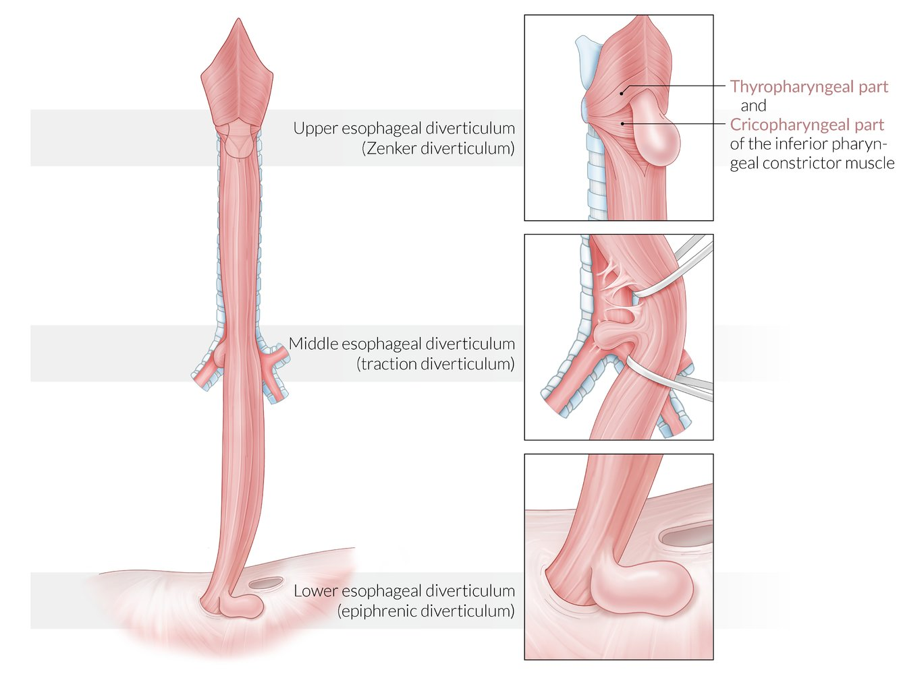
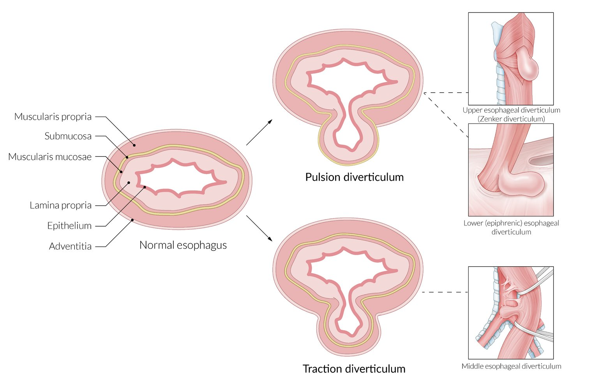
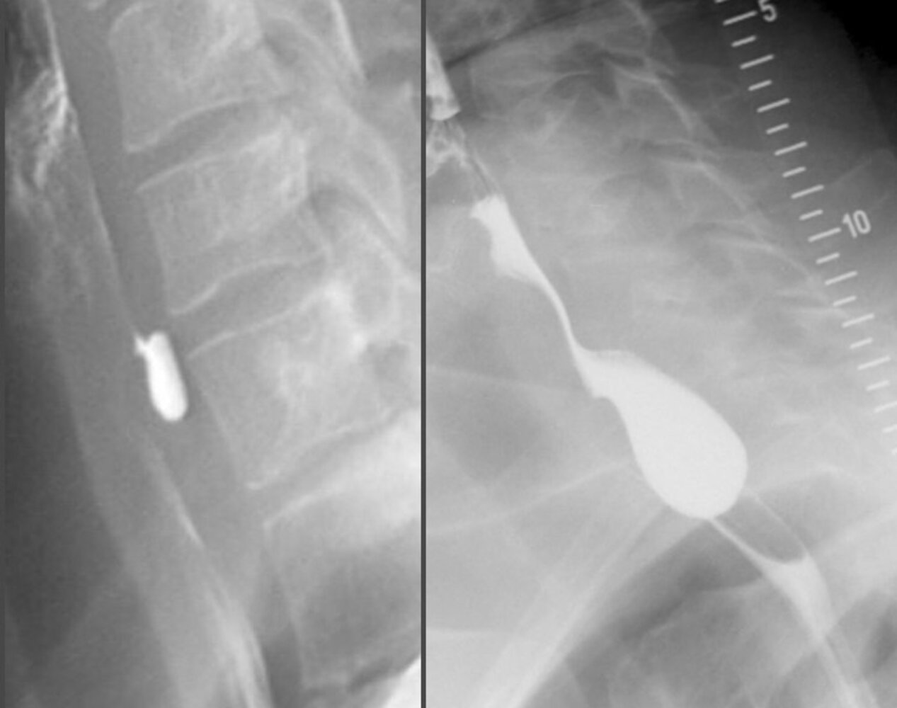

# Esophageal diverticula

*Categories: Clinical knowledge > Internal medicine > Gastroenterology > Diseases of the esophagus > Esophageal diverticula*

[Original Article Link](https://coursology-qbank.com/amboss/article/Eg08C2)

---

## Summary

Esophageal <u>diverticula</u> are abnormal pouches that arise from the wall of the <u>esophagus</u>. They most commonly occur in older men and are classified based on localization, pathophysiology, and histological findings. The most common type of esophageal diverticulum is a <u>posterior</u> outpouching of the <u>hypopharynx</u>, commonly referred to as a <u>Zenker diverticulum</u>. Esophageal <u>diverticula</u> are caused by either an underlying motility disorder that exerts high intraluminal pressure on a weak esophageal wall or forces pulling on the outside of the <u>esophagus</u>. The clinical presentation varies with pouch size and localization, with the most common symptoms being <u>dysphagia</u>, <u>regurgitation</u>, retrosternal <u>pain</u>, and pulmonary symptoms secondary to <u>aspiration</u>. The diagnosis is confirmed by <u>barium swallow</u>. Surgical treatment is rarely required and only recommended in symptomatic patients (primarily those with <u>Zenker diverticulum</u>).

---

## Epidemiology

* Rare <u>diverticula</u> compared to other gastrointestinal sites  [[1]](https://coursology-qbank.com/amboss/article/FQ0gBf)

* Peak <u>incidence</u>: older male individuals  [[2]](https://coursology-qbank.com/amboss/article/uz0pui)

* <u>Zenker diverticulum</u> is the most common type. [[3]](https://coursology-qbank.com/amboss/article/TQW6vO0)

Epidemiological data refers to the US, unless otherwise specified.

---

## Classification

Esophageal <u>diverticula</u> are classified according to their localization, <u>histology</u>, and pathophysiology. [[1]](https://coursology-qbank.com/amboss/article/FQ0gBf)

### Localization

* Upper esophageal diverticulum

* Pharyngoesophageal diverticulum

* Most common type: Zenker diverticulum at the Killian triangle (a triangular weak point in the <u>dorsal</u> muscular wall of the <u>hypopharynx</u>, between the thyropharyngeal and cricopharyngeal parts of the <u>inferior pharyngeal constrictor muscle</u>)  [[4]](https://coursology-qbank.com/amboss/article/gQWFvO0)

* Middle esophageal diverticulum: diverticulum at the <u>tracheal</u> bifurcation

* Lower esophageal diverticulum: <u>epiphrenic diverticulum</u>

> [!NOTE]
> <u>Zenker diverticulum</u> arises from the <u>hypopharynx</u> but is classified as an esophageal diverticulum.

Location of esophageal diverticula

### <u>Histology</u> [[2]](https://coursology-qbank.com/amboss/article/uz0pui)

* <u>True diverticula</u>: All layers of the esophageal wall protrude.

* <u>False diverticula</u>: Increased intraluminal pressure causes only the <u>mucosa</u> and <u>submucosa</u> to bulge through weak points in the muscularis (e.g., in <u>Zenker diverticulum</u>).

### Pathophysiology

* <u>Pulsion diverticula</u>

* <u>Traction diverticula</u>

---

## Pathophysiology

* Inadequate relaxation of the esophageal sphincter (e.g., caused by <u>achalasia</u> or <u>spastic</u> motility) and increased intraluminal pressure → outpouching of the esophageal wall → pulsion diverticulum

* Usually a <u>false diverticulum</u> [[5]](https://coursology-qbank.com/amboss/article/9cXNeC)

* Common sites

* Upper esophageal sphincter (UES) → pharyngoesophageal <u>pulsion diverticulum</u> (e.g., <u>Zenker diverticulum</u>)

* <u>Lower esophageal sphincter</u> (<u>LES</u>) → epiphrenic pulsion diverticulum [[1]](https://coursology-qbank.com/amboss/article/FQ0gBf)

* Inflammation of the <u>mediastinum</u> with scarring and <u>retraction</u> (e.g., secondary to <u>tuberculosis</u> or fungal infection) → traction diverticulum [[5]](https://coursology-qbank.com/amboss/article/9cXNeC)

* Usually <u>true diverticulum</u>

* Common site: the middle <u>esophagus</u>

Mechanism of esophageal diverticula formation

---

## Clinical features

Symptoms arise if a diverticulum becomes large enough to retain food and/or saliva.

* Upper esophageal <u>diverticula</u> (e.g., <u>Zenker diverticulum</u>)

* Most patients report some degree of <u>dysphagia</u>.

* Additional symptoms can include:

* <u>Regurgitation</u> of undigested food

* <u>Halitosis</u>

* <u>Aspiration pneumonia</u>

* <u>Dysphonia</u>

* <u>Coughing</u> after ingesting food

* Retrosternal pressure sensation and <u>pain</u>

* Weight loss

* Neck mass (only with large upper esophageal <u>diverticula</u>)

* Middle esophageal and <u>epiphrenic diverticula</u>

* Patients usually remain asymptomatic.  [[1]](https://coursology-qbank.com/amboss/article/FQ0gBf)[[5]](https://coursology-qbank.com/amboss/article/9cXNeC)

* Associated symptoms are often attributable to the underlying disorder (e.g., <u>achalasia</u> causing <u>chest pain</u> and/or <u>dysphagia</u>). [[2]](https://coursology-qbank.com/amboss/article/uz0pui)

> [!NOTE]
> Older MIKE has <u>bad breath</u>: Older, Male individuals, Inferior pharyngeal constrictor, Killian triangle, Esophageal dysmotility, <u>halitosis</u>.

---

## Diagnosis

Obtain imaging studies to diagnose esophageal <u>diverticula</u> in patients with supportive clinical features. Based on initial findings, consider endoscopy and <u>esophageal manometry</u> to identify concomitant esophageal disorders.

### Imaging studies [[2]](https://coursology-qbank.com/amboss/article/uz0pui)

* <u>Barium swallow</u> with <u>videofluoroscopy</u> (best initial test)  

* Diagnostic finding: a contrast-filled pouch protruding from the esophageal wall

* Additional findings may include:

* Tumors

* <u>Esophageal motility disorder</u>

* Transcutaneous <u>ultrasound</u>: Consider for patients who struggle to swallow contrast or those with a palpable neck mass.  [[6]](https://coursology-qbank.com/amboss/article/z-1r-j0)

Zenker diverticulum

> [!TIP]
> <u>Barium swallow</u> with <u>videofluoroscopy</u> is the first-line test for diagnosing esophageal <u>diverticula</u>, and it may also show any associated <u>aspiration</u> and/or <u>regurgitation</u>. [[7]](https://coursology-qbank.com/amboss/article/fZWkaP0)

### Endoscopy [[2]](https://coursology-qbank.com/amboss/article/uz0pui)

* Indications: all patients with middle or lower esophageal <u>diverticula</u>  [[1]](https://coursology-qbank.com/amboss/article/FQ0gBf)

* Findings

* <u>Esophageal cancer</u> (which may be hidden in the pouch)

* <u>Esophagitis</u>, <u>Barrett esophagus</u>

### <u>Esophageal manometry</u> [[2]](https://coursology-qbank.com/amboss/article/uz0pui)

* Indications: all patients with middle or lower esophageal <u>diverticula</u>, even if asymptomatic

* Findings: evidence of an underlying motility disorder

---

## Treatment

Surgical treatment is indicated for patients with symptomatic esophageal <u>diverticula</u> and can be considered for asymptomatic <u>diverticula</u> ≥ 2 cm. [[2]](https://coursology-qbank.com/amboss/article/uz0pui)

### <u>Zenker diverticulum</u> [[8]](https://coursology-qbank.com/amboss/article/abWQHP0)

* Approaches

* Open <u>surgery</u>: suitable for all patients who can tolerate <u>general anesthesia</u>

* <u>Flexible endoscopy</u>: Consider for medium-sized <u>diverticula</u> (e.g., 2–5 cm). [[2]](https://coursology-qbank.com/amboss/article/uz0pui)

* <u>Rigid endoscopy</u>: may not be possible in older patients with restricted neck mobility

* Procedures: based on diverticulum size and the chosen approach (i.e., endoscopy or open <u>surgery</u>)

* Cricopharyngeal myotomy: <u>incision</u> of the cricopharyngeal muscle (the main component of the upper esophageal sphincter) to relieve esophageal obstruction; indicated for most patients  [[2]](https://coursology-qbank.com/amboss/article/uz0pui)

* Diverticulotomy: division of the septum that separates a diverticulum from the physiological esophageal lumen

* Diverticulectomy: resection of a diverticulum  [[2]](https://coursology-qbank.com/amboss/article/uz0pui)

* Diverticulopexy: suspension of a diverticulum onto the hypopharyngeal wall

* Diverticular inversion

* Other options include stapling, electrocautery, or CO2 laser treatment.

* Goal: to reduce pressure in the upper esophageal sphincter by removing or isolating the diverticulum

### Other <u>diverticula</u>  [[2]](https://coursology-qbank.com/amboss/article/uz0pui)

* Symptomatic or diverticulum ≥ 2 cm: Consider surgical intervention (e.g., <u>diverticulopexy</u>).

* Asymptomatic

* Treat any presumed underlying cause (e.g., <u>esophageal motility disorders</u>).

* Employ <u>expectant management</u>.

> [!TIP]
> Middle and <u>distal</u> esophageal <u>diverticula</u> are usually small and asymptomatic. Focus treatment on associated underlying conditions. [[2]](https://coursology-qbank.com/amboss/article/uz0pui)

---

## Complications

* <u>Aspiration pneumonia</u> [[6]](https://coursology-qbank.com/amboss/article/z-1r-j0)

* Perforation with <u>mediastinitis</u> and <u>fistula</u> formation (rare)

* <u>Esophageal cancer</u> [[9]](https://coursology-qbank.com/amboss/article/xcXEeC)

We list the most important complications. The selection is not exhaustive.

---