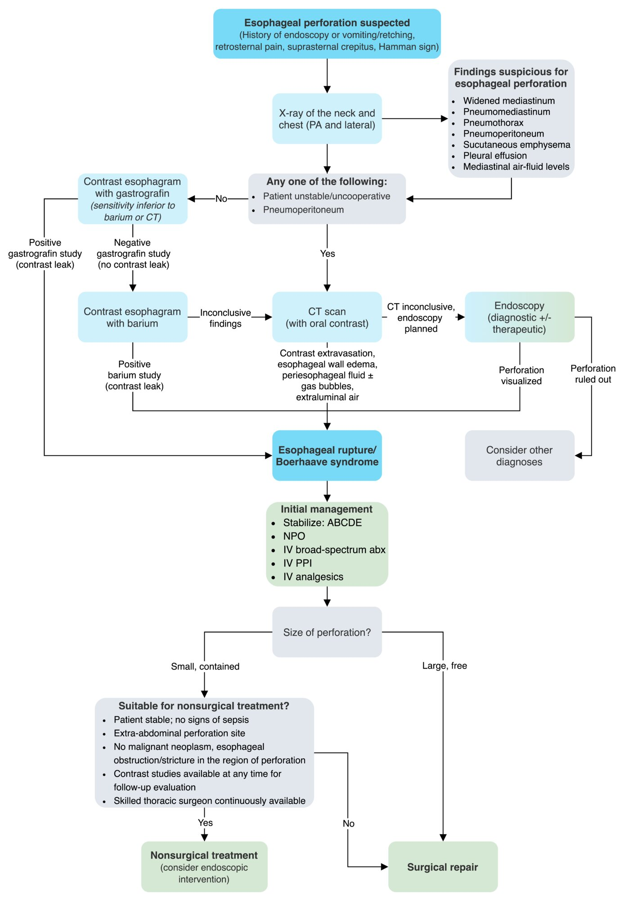
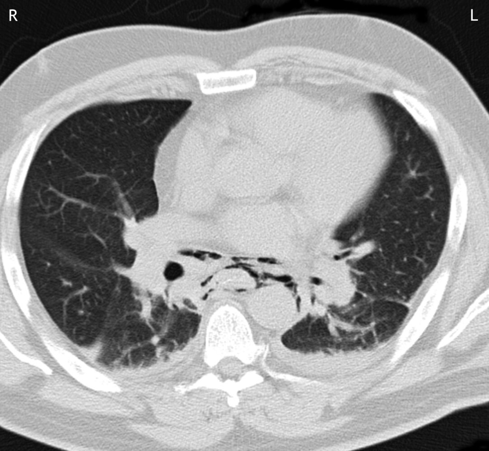
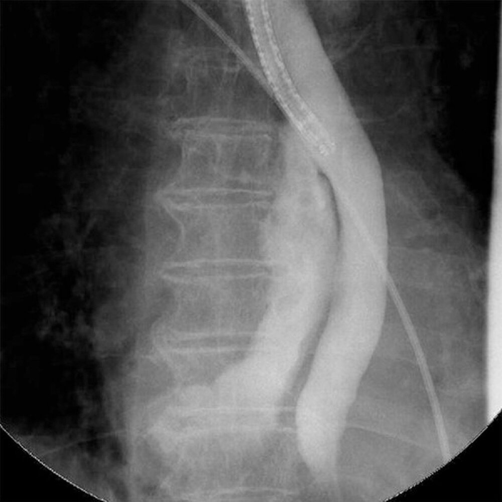
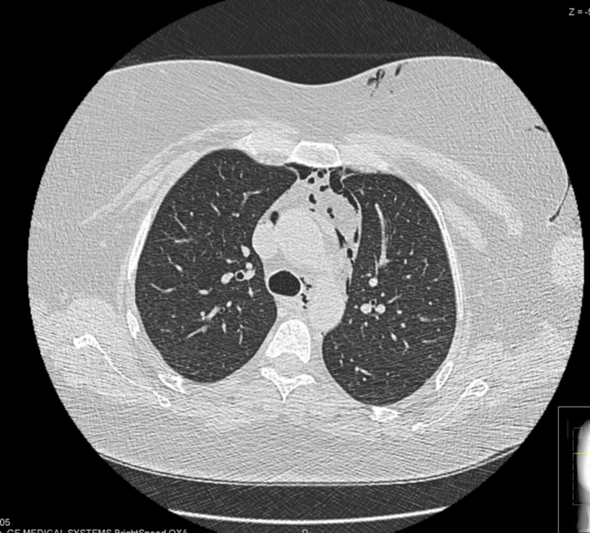
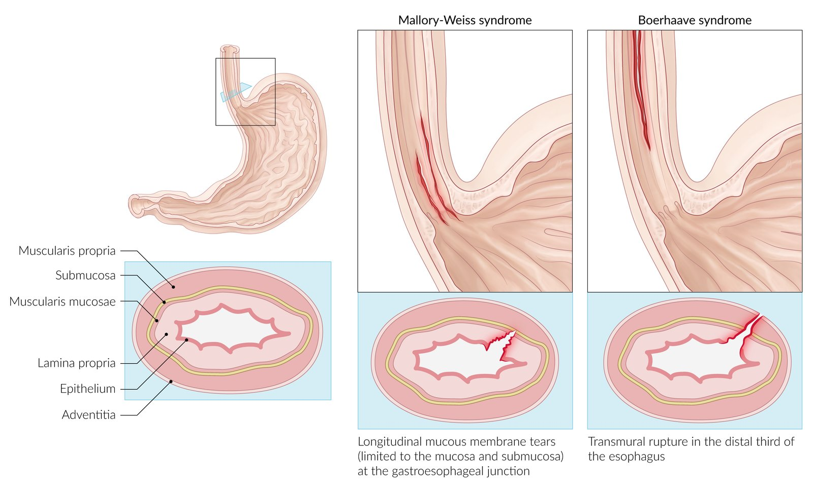

# Esophageal perforation

*Categories: Clinical knowledge > Internal medicine > Gastroenterology > Diseases of the esophagus > Esophageal perforation*

[Original Article Link](https://coursology-qbank.com/amboss/article/wg0hx2)

---

## Summary

Perforation of the <u>esophagus</u> is most commonly caused by <u>upper endoscopy</u> (<u>iatrogenic</u>), <u>foreign body ingestion</u>, or trauma. It can be located at any point along the <u>esophagus</u>, in the cervical, thoracic, or abdominal region. <u>Boerhaave syndrome</u> is a spontaneous subtype of esophageal perforation characterized by <u>transmural</u> rupture of the <u>esophagus</u> following an episode of forceful <u>vomiting</u>/retching or increased intrathoracic pressure. The condition is associated with recent consumption of large amounts of <u>alcohol</u> or food, repeated episodes of <u>vomiting</u>, and other causes of elevated intrathoracic pressure (e.g., <u>childbirth</u>, <u>seizure</u>, prolonged <u>coughing</u>). The classic symptom is severe retrosternal <u>pain</u>, which is due to the development of <u>mediastinal emphysema</u> after massive emesis. Evidence of esophageal perforation may be seen on neck, chest, and/or <u>abdominal x-ray</u> and the diagnosis is confirmed with <u>esophagram</u> and/or CT <u>esophagography</u>. Surgical repair of the esophageal rupture is often necessary, although <u>conservative treatment</u> alone may be considered in select cases (e.g., if the perforation is very small and the patient is stable).

---

## Etiology

### Esophageal perforation (general) [[1]](https://coursology-qbank.com/amboss/article/apYQLJ)[[2]](https://coursology-qbank.com/amboss/article/YpYnLJ)

* Iatrogenic esophageal perforation

* Most common cause of esophageal perforation

* Most often injury during <u>upper endoscopy</u>

* Injury related to <u>surgery</u>

* Ingestion of a foreign body or caustic material

* Bone, dentures

* Alkali or acidic agents (e.g., batteries)

* Trauma (blunt or penetrating)

* <u>Malignancy</u>

* Infection 

* <u>Candida</u> spp.

* <u>Herpes simplex</u>

* <u>Tuberculosis</u>

* <u>Syphilis</u>

* Spontaneous rupture

### Boerhaave syndrome

* <u>Risk factors</u>

* Intake of large amounts of <u>alcohol</u> or food in the recent past

* Repeated episodes of <u>vomiting</u>

* Prolonged <u>coughing</u>

* <u>Childbirth</u>

* <u>Seizures</u>

* Weightlifting

* Pathophysiology

* Severe <u>vomiting</u>/increased intrathoracic pressure → rupture of all layers of the esophageal wall (<u>transmural</u> perforation)

* In > 90% of cases, the rupture occurs in the <u>distal</u> third of the <u>esophagus</u> on the left dorsolateral wall surface.

---

## Clinical features

* Mackler triad (esp. in <u>Boerhaave syndrome</u>)

* <u>Vomiting</u> and/or retching

* Severe retrosternal <u>pain</u> that often radiates to the back

* Subcutaneous or <u>mediastinal emphysema</u>: <u>crepitus</u> in the <u>suprasternal notch</u> and neck region or crunching/crackling sound on chest <u>auscultation</u> (<u>Hamman sign</u>)

* <u>Dyspnea</u>, <u>tachypnea</u>, <u>tachycardia</u>

* <u>Dysphagia</u>

* <u>Signs of sepsis</u>

* History of recent endoscopy: Symptoms usually occur within 24 hours of endoscopy.

* Delayed presentations: critically ill with <u>sepsis</u> and <u>multiorgan dysfunction</u>

> [!WARNING]
> Symptoms are often nonspecific; maintain a high index of suspicion in patients with recent retching, <u>vomiting</u>, <u>upper endoscopy</u>, trauma, or known esophageal or <u>mediastinal</u> <u>malignancy</u>.

---

## Diagnosis

In suspected esophageal perforation or <u>Boerhaave syndrome</u>, <u>x-ray</u> of the chest, abdomen, and/or neck is first conducted, followed by <u>contrast esophagography</u>. If inconclusive, or the patient is unstable or unable to cooperate, a <u>CT scan</u> is conducted to confirm the diagnosis.  [[1]](https://coursology-qbank.com/amboss/article/apYQLJ)[[2]](https://coursology-qbank.com/amboss/article/YpYnLJ)

Management of Esophageal rupture/Boerhaave syndrome

### Imaging

#### Initial diagnostic studies

* <u>Chest x-ray</u> posteroanterior and <u>lateral</u>, upright AXR 

* <u>Widened mediastinum</u>

* <u>Pneumomediastinum</u>, <u>pneumothorax</u>, <u>pneumoperitoneum</u>, <u>subcutaneous emphysema</u>

* <u>Pleural effusion</u>

* <u>Mediastinal</u> <u>air-fluid levels</u>

* Neck <u>x-ray</u> <u>lateral</u> : <u>subcutaneous emphysema</u>

> [!WARNING]
> As radiographic abnormalities may not be immediately apparent after injury, negative results on early plain <u>x-rays</u> do not rule out acute perforation. [[3]](https://coursology-qbank.com/amboss/article/AN1Rdh0)

#### <u>Confirmatory tests</u>

* <u>Contrast esophagography</u> (<u>gold standard</u>): Contrast leak reveals the location and size of the rupture.   [[4]](https://coursology-qbank.com/amboss/article/mFbViv)[[5]](https://coursology-qbank.com/amboss/article/xFYE4I)

* CT chest and CT <u>esophagography</u> (with oral contrast) ;  [[6]](https://coursology-qbank.com/amboss/article/9R1N6g0)[[7]](https://coursology-qbank.com/amboss/article/CR1q6g0)

* Indications

* The patient is unstable/uncooperative.

* <u>Pneumoperitoneum</u> is detected on <u>x-ray</u>.

* <u>X-rays</u> and <u>contrast esophagography</u> are inconclusive.

* Findings 

* <u>Widened mediastinum</u>

* Esophageal wall thickening, inflammation, and/or <u>hematoma</u>

* Extraluminal air: <u>pneumomediastinum</u>, <u>pneumoperitoneum</u>, <u>pneumothorax</u>, and/or <u>subcutaneous emphysema</u>

* Extraluminal contrast and/or periesophageal fluid collection(s)

* <u>Pleural effusion</u>

* <u>Flexible endoscopy</u>: direct visualization of the perforation [[1]](https://coursology-qbank.com/amboss/article/apYQLJ)[[3]](https://coursology-qbank.com/amboss/article/AN1Rdh0)

* Typically reserved for patients with penetrating external esophageal injury

* Avoided in nonpenetrating injury unless there is a specific therapeutic indication

* <u>Caustic ingestion</u>: urgent endoscopy recommended; oral <u>contrast radiography</u> typically not recommended

Pneumomediastinum (mediastinal emphysema)

Pneumomediastinum

Esophageal perforation

Pneumomediastinum

---

## Differential diagnoses

* <u>Mallory-Weiss syndrome</u>

* See “<u>Differential diagnosis of chest pain</u>”.

Mallory-Weiss syndrome and Boerhaave syndrome

The differential diagnoses listed here are not exhaustive.

---

## Treatment

### Initial management [[1]](https://coursology-qbank.com/amboss/article/apYQLJ)[[3]](https://coursology-qbank.com/amboss/article/AN1Rdh0)[[8]](https://coursology-qbank.com/amboss/article/xwYEOr)

* <u>ABCDE survey</u>

* <u>Airway management</u> for patients with <u>signs of airway compromise</u>

* <u>Supplemental oxygen</u> as needed

* <u>IV fluid resuscitation</u>

* <u>Nothing by mouth</u> (<u>NPO</u>)   [[2]](https://coursology-qbank.com/amboss/article/YpYnLJ)

* IV <u>proton pump inhibitor</u> (e.g., <u>pantoprazole</u> DOSAGE)

* Broad-spectrum IV <u>antibiotics</u>: Initiate early in all patients.  

* <u>Piperacillin/tazobactam</u> DOSAGE OR <u>meropenem</u> DOSAGE  [[3]](https://coursology-qbank.com/amboss/article/AN1Rdh0)[[9]](https://coursology-qbank.com/amboss/article/zt1rTi0)

* PLUS <u>vancomycin</u> DOSAGE  [[9]](https://coursology-qbank.com/amboss/article/zt1rTi0)[[10]](https://coursology-qbank.com/amboss/article/MRbMnt)

* Consider adding <u>fluconazole</u> DOSAGE in patients at risk of fungal <u>colonization</u>.  [[3]](https://coursology-qbank.com/amboss/article/AN1Rdh0)[[9]](https://coursology-qbank.com/amboss/article/zt1rTi0)

* <u>Chest tube placement</u>: Consider for <u>pneumothorax</u> or <u>pleural effusions</u>.

* <u>Parenteral analgesia</u> and <u>antiemetics</u> as needed

* Urgent thoracic <u>surgery</u> and GI consult

* Management of <u>caustic ingestion</u>, if present

> [!WARNING]
> Do not attempt blind <u>nasogastric tube placement</u> to avoid further damage to the <u>esophagus</u>. [[9]](https://coursology-qbank.com/amboss/article/zt1rTi0)[[11]](https://coursology-qbank.com/amboss/article/Yt1nXi0)

> [!TIP]
> Patients with esophageal perforation can deteriorate rapidly and benefit from close monitoring in the <u>ICU</u> and early surgical consultation. [[3]](https://coursology-qbank.com/amboss/article/AN1Rdh0)

### Nonsurgical treatment [[1]](https://coursology-qbank.com/amboss/article/apYQLJ)[[2]](https://coursology-qbank.com/amboss/article/YpYnLJ)[[8]](https://coursology-qbank.com/amboss/article/xwYEOr)

* Indications

* Small, contained perforation, demonstrated by:

* Either a contained leak with the neck, within the <u>mediastinum</u>, or between the <u>mediastinum</u> and <u>visceral</u> <u>lung</u> <u>pleura</u>

* Contrast can flow back into the <u>esophagus</u> from the cavity surrounding the perforation.

* The perforation site is benign, outside of the abdomen, and <u>distal</u> to an obstruction.

* The patient is stable with no evidence of <u>sepsis</u>.

* Contrast studies are available at any time for follow-up evaluation.

* A skilled thoracic <u>surgeon</u> is continuously available.

* Consider endoscopic intervention

* Esophageal <u>stent</u> placement

* Endoclip

* <u>Fibrin</u> glue application

### Surgical treatment [[1]](https://coursology-qbank.com/amboss/article/apYQLJ)[[2]](https://coursology-qbank.com/amboss/article/YpYnLJ)[[8]](https://coursology-qbank.com/amboss/article/xwYEOr)

* Indications

* <u>Hemodynamic instability</u>

* Patients who do not fulfill the criteria for <u>conservative management</u>

* Clinical deterioration during <u>conservative management</u>

* Procedures

* Closure of the ruptured esophageal segment

* <u>Esophagostomy</u>: creation of an artificial opening into the <u>esophagus</u>, typically brought out through the neck (i.e., creation of a <u>cervical stoma</u>), to allow drainage of oral secretions and prevent <u>aspiration</u> [[12]](https://coursology-qbank.com/amboss/article/03VeS80)

* Last resort: <u>esophagectomy</u>

---

## Complications

### Mediastinitis

* Definition: inflammation of the tissues in the <u>mediastinum</u>

* Classification [[13]](https://coursology-qbank.com/amboss/article/Neb-_s)[[14]](https://coursology-qbank.com/amboss/article/mebVzs)

* Acute <u>mediastinitis</u>: acute infection of the <u>mediastinum</u>

* Chronic mediastinitis (<u>fibrosing mediastinitis</u>): <u>proliferation</u> of fibrous and collagenous tissue in the <u>mediastinum</u>

* Etiology [[13]](https://coursology-qbank.com/amboss/article/Neb-_s)[[14]](https://coursology-qbank.com/amboss/article/mebVzs)

* Acute <u>mediastinitis</u>

* <u>Postoperative acute mediastinitis</u> after cardiothoracic procedures (most common cause): <u>Mediastinitis</u> typically occurs within 14 days of the procedure. [[15]](https://coursology-qbank.com/amboss/article/5ebizs)

* Perforation of <u>mediastinal</u> structures (e.g., <u>esophagus</u>, <u>trachea</u>)

* Descending spread of infection from oropharyngeal foci

* <u>Chronic mediastinitis</u>

* Etiology remains unclear.

* Several studies report that <u>Histoplasma capsulatum</u> is causative.

* IgG4-related <u>fibrosing mediastinitis</u>

* Clinical features

* Retrosternal and/or <u>back pain</u>

* <u>Subcutaneous emphysema</u> in the neck and face

* <u>Fever</u>, <u>tachycardia</u>, <u>tachypnea</u>

* Sternal wound drainage

* <u>Superior vena cava syndrome</u>

* Obstruction of the upper <u>airways</u>

* <u>Pleuritis</u> and <u>pericarditis</u>

* <u>Bacteremia</u> leading to <u>sepsis</u> and <u>signs of shock</u>

* Diagnostics [[16]](https://coursology-qbank.com/amboss/article/ct1aci0)

* Chest <u>x-ray</u> (posteroanterior and <u>lateral</u> views) shows a <u>widened mediastinum</u> and <u>mediastinal emphysema</u>.

* CT neck and chest (<u>confirmatory test</u>) shows attenuation of <u>mediastinal</u> fat, as well as <u>mediastinal</u> fluid collections and gas. [[17]](https://coursology-qbank.com/amboss/article/jlX_9y)

* <u>CBC</u> may show <u>leukocytosis</u>.

* Blood, tissue, and/or fluid (<u>mediastinal</u>, pleural, or bronchoalveolar) cultures can help determine the causative organism.

* Management [[16]](https://coursology-qbank.com/amboss/article/ct1aci0)

* Resuscitation using the <u>ABCDE approach</u>

* <u>Difficult airway management</u> for patients with <u>soft tissue</u> swelling or <u>trismus</u>

* <u>Immediate hemodynamic support</u> for patients with <u>septic shock</u>

* <u>Broad spectrum IV antibiotics</u> depending on the underlying etiology; see: [[16]](https://coursology-qbank.com/amboss/article/ct1aci0)

* <u>Treatment of esophageal perforation</u>

* <u>Empiric antibiotic therapy for deep neck infections</u>

* Urgent surgical consultation for <u>debridement</u> and drainage [[18]](https://coursology-qbank.com/amboss/article/QlXu9y)

* Disposition: Patients often require <u>ICU</u> admission.

> [!TIP]
> Consider acute <u>mediastinitis</u> in any patient with recent cardiothoracic <u>surgery</u>, <u>deep neck infection</u>, or potential esophageal injury who presents with <u>chest pain</u> and/or <u>sepsis</u>. [[14]](https://coursology-qbank.com/amboss/article/mebVzs)[[19]](https://coursology-qbank.com/amboss/article/bt1HXi0)

> [!WARNING]
> Early diagnosis and treatment are essential to prevent significant <u>morbidity</u> and mortality associated with acute <u>mediastinitis</u>. [[16]](https://coursology-qbank.com/amboss/article/ct1aci0)

### Others

* <u>Peritonitis</u> in intra-abdominal perforations

* <u>Empyema</u>

* Severe <u>sepsis</u> or <u>shock</u>

* <u>Multiorgan dysfunction</u>

* <u>Esophagostomy</u>-specific [[12]](https://coursology-qbank.com/amboss/article/03VeS80)

* Stomal stenosis requiring dilation

* <u>Electrolyte</u> abnormalities

* Weight loss

* Decreased quality of life

We list the most important complications. The selection is not exhaustive.

---