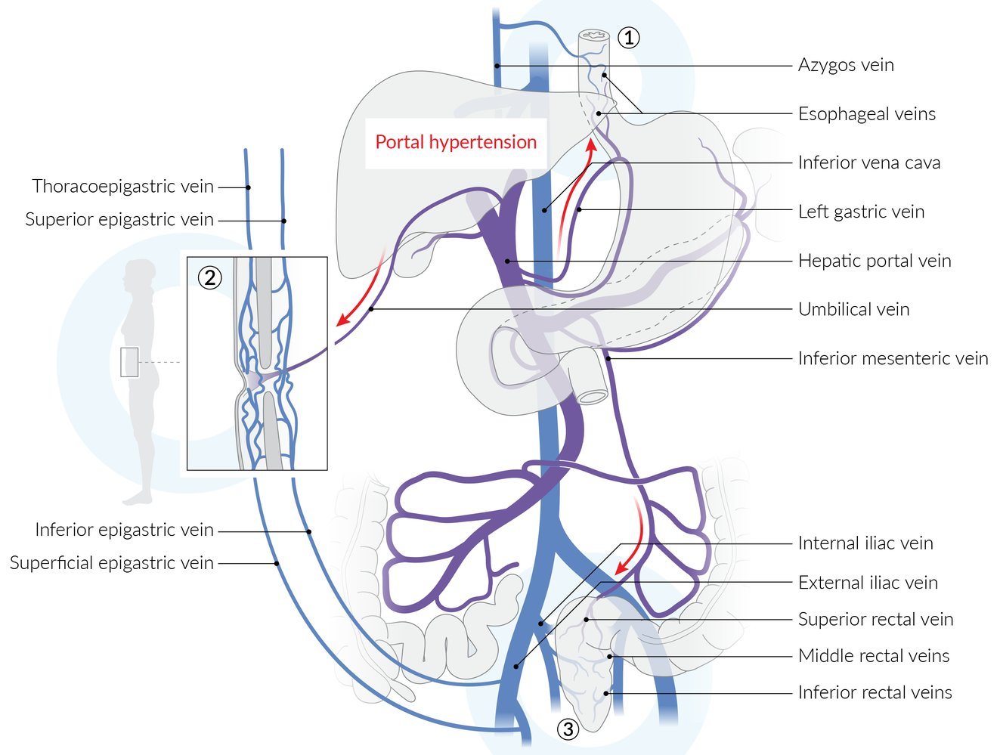

# Esophageal varices

*Categories: Clinical knowledge > Internal medicine > Gastroenterology > Diseases of the esophagus > Esophageal varices*

[Original Article Link](https://coursology-qbank.com/amboss/article/Zs0Zth)

---

## Summary

Esophageal <u>varices</u> are dilated collateral <u>veins</u> resulting from increased blood flow due to <u>portal hypertension</u>, often caused by <u>cirrhosis</u>. Nonbleeding <u>varices</u> are typically asymptomatic. Screening for <u>varices</u> with <u>esophagogastroduodenoscopy</u> (<u>EGD</u>) is recommended at the time of <u>cirrhosis</u> diagnosis. Management of nonbleeding esophageal <u>varices</u> focuses on the prevention of bleeding and involves regular surveillance and, in some cases, primary prophylaxis of bleeding using <u>nonselective beta blockers</u> or eradication of <u>varices</u> using <u>endoscopic variceal ligation</u> (<u>EVL</u>).

Acute <u>variceal hemorrhage</u> is a potentially life-threatening condition. Patients present with <u>clinical features of gastrointestinal bleeding</u>, e.g., sudden <u>hematemesis</u> and <u>melena</u>, and, in some cases, <u>hypovolemic shock</u>. In addition to stabilizing the patient, management involves administration of <u>vasoactive medication</u> and <u>antibiotic prophylaxis</u> in combination with endoscopic treatment. If the hemorrhage persists, <u>balloon tamponade</u> of the bleeding and/or an emergent <u>transjugular intrahepatic portosystemic shunt</u> (<u>TIPS</u>) may be necessary. Secondary prophylaxis of <u>variceal bleeding</u> involves <u>nonselective beta blockers</u>, <u>EVL</u>, and/or <u>TIPS</u> placement.

---

## Etiology

* <u>Cirrhosis</u> → <u>portal hypertension</u> → dilated sub-<u>mucosal</u> <u>veins</u> (<u>varices</u>) of the <u>distal</u> <u>esophagus</u>

* See “Etiology” in “<u>Portal hypertension</u>.”

Sites of portocaval anastomosis

---

## Clinical features

* Nonbleeding <u>varices</u>: typically asymptomatic
* Patients may have other <u>clinical features of portal hypertension</u>.

* Bleeding <u>varices</u>: sudden onset of severe <u>symptoms of gastrointestinal bleeding</u>

* Signs of <u>hemorrhagic shock</u>

* <u>Hematochezia</u>

* <u>Melena</u>

* <u>Hematemesis</u>

> [!TIP]
> Consider also a diagnosis of <u>Mallory-Weiss syndrome</u> if bleeding occurs following retching or <u>vomiting</u>.

---

## Diagnostics

### <u>Esophagogastroduodenoscopy</u> (<u>EGD</u>)

Diagnosis and surveillance of esophageal <u>varices</u> requires <u>esophagogastroduodenoscopy</u> (<u>EGD</u>), with the goal of establishing: [[2]](https://coursology-qbank.com/amboss/article/kCcmHe0)

* Presence of <u>varices</u>

* Size of <u>varices</u>

* Stigmata of recent or impending bleeding (i.e., high-risk endoscopic findings): [[4]](https://coursology-qbank.com/amboss/article/is1JuR0)[[7]](https://coursology-qbank.com/amboss/article/Qs1uuR0)

* Red wale marks: longitudinal red streaks on the surface of a varix

* Cherry-red spots

* Hematocystic spots: raised spots that appear as <u>blisters</u>

Esophageal varices

Esophageal varices

### Additional studies

* Imaging is not routinely indicated but <u>large esophageal varices</u> may be incidentally identified.

* <u>Transient elastography</u> and <u>CBC</u> may be used to rule out <u>high-risk esophageal varices</u> but are not routinely used for confirming the diagnosis.

Esophageal varices

---

## Management of nonbleeding esophageal varices

### Approach [[2]](https://coursology-qbank.com/amboss/article/kCcmHe0)[[3]](https://coursology-qbank.com/amboss/article/wZ1hd20)[[6]](https://coursology-qbank.com/amboss/article/lybv2w)

* Obtain <u>EGD</u> to screen for esophageal <u>varices</u> at the time of <u>cirrhosis</u> or <u>portal hypertension</u> diagnosis.  [[2]](https://coursology-qbank.com/amboss/article/kCcmHe0)

* Assess for <u>high-risk features for esophageal variceal hemorrhage</u> (see “Risk <u>stratification</u>”). 

* Low-risk <u>varices</u>: Monitor for development to <u>high-risk varices</u>.

* <u>High-risk varices</u>: Start pharmacologic prophylaxis.

* Identify and treat the underlying <u>cause of portal hypertension</u>.

### Risk <u>stratification</u> [[5]](https://coursology-qbank.com/amboss/article/ad1Qof0)

* High-risk features for esophageal variceal hemorrhage

* <u>Large esophageal varices</u>

* <u>Small esophageal varices</u> with:

* High-risk endoscopic findings , e.g., <u>red wale marks</u>, cherry-red spots, hematocystic spots

* And/or presence of <u>decompensated cirrhosis</u>

* Low-risk features for <u>esophageal variceal bleeding</u>: <u>small esophageal varices</u> without high-risk endoscopic findings

### Monitoring of low-risk varices [[2]](https://coursology-qbank.com/amboss/article/kCcmHe0)[[6]](https://coursology-qbank.com/amboss/article/lybv2w)

<u>EGD</u> surveillance is indicated every 1–3 years for patients with low-risk features for <u>esophageal variceal bleeding</u> to screen for the development of <u>high-risk varices</u>.

|  <u>EGD</u> monitoring for the development of <u>high-risk esophageal varices</u> in patients with <u>compensated cirrhosis</u> [[2]](https://coursology-qbank.com/amboss/article/kCcmHe0)  |  |  |
| --- | --- | --- |
| Clinical features |  | Frequency |
|  <u>Small esophageal varices</u>  [[6]](https://coursology-qbank.com/amboss/article/lybv2w)  |  Ongoing <u>liver</u> injury   | Annual |
| No ongoing <u>liver</u> injury | Every 2 years  |  |
| No <u>varices</u> | Ongoing <u>liver</u> injury |  |
| No ongoing <u>liver</u> injury | Every 3 years  |  |

> [!TIP]
> Patients with esophageal <u>varices</u> have a 10–15% annual risk of <u>variceal hemorrhage</u>; the risk increases with the severity of <u>liver</u> disease, size of <u>varices</u>, and presence of variceal wall thinning. [[2]](https://coursology-qbank.com/amboss/article/kCcmHe0)[[6]](https://coursology-qbank.com/amboss/article/lybv2w)

### Prevention of first episode of variceal bleeding [[2]](https://coursology-qbank.com/amboss/article/kCcmHe0)[[5]](https://coursology-qbank.com/amboss/article/ad1Qof0)[[6]](https://coursology-qbank.com/amboss/article/lybv2w)

* <u>Medium or large esophageal varices</u>: Provide either pharmacological prophylaxis or <u>EVL</u>.  [[2]](https://coursology-qbank.com/amboss/article/kCcmHe0)

* <u>Small esophageal varices</u> with <u>high-risk features for esophageal variceal hemorrhage</u>: Provide pharmacological prophylaxis as indicated.

#### Pharmacological prophylaxis [[8]](https://coursology-qbank.com/amboss/article/0tWeXM0)

* <u>Nonselective beta blockers</u> ;  [[2]](https://coursology-qbank.com/amboss/article/kCcmHe0)

* Preferred: <u>Carvedilol</u> (<u>off-label</u>) DOSAGE  [[8]](https://coursology-qbank.com/amboss/article/0tWeXM0)

* Alternatives: <u>Propranolol</u>;  (<u>off-label</u>) DOSAGE OR <u>nadolol</u> (<u>off-label</u>) DOSAGE  [[8]](https://coursology-qbank.com/amboss/article/0tWeXM0)

* Can be continued indefinitely if tolerated

* No <u>EGD</u> surveillance is necessary

> [!WARNING]
> Reduce the dose or discontinue <u>beta blockers</u> if <u>ascites</u> or <u>hepatorenal syndrome</u> develop or systolic blood pressure is < 90 mm Hg. [[5]](https://coursology-qbank.com/amboss/article/ad1Qof0)

> [!TIP]
> In patients without <u>varices</u>, there is no evidence to support the use of <u>beta blockers</u> to prevent the development of gastroesophageal <u>varices</u>; however, <u>beta blockers</u> may be used for other indications in patients with <u>clinically significant portal hypertension</u>. [[2]](https://coursology-qbank.com/amboss/article/kCcmHe0)

#### <u>Endoscopic variceal ligation</u> (<u>EVL</u>) [[2]](https://coursology-qbank.com/amboss/article/kCcmHe0)[[6]](https://coursology-qbank.com/amboss/article/lybv2w)

* Repeat every 1–8 weeks until <u>varices</u> are eradicated.

* Obtain surveillance <u>EGD</u> within 1–6 months of eradication and every 6–12 months thereafter.  [[2]](https://coursology-qbank.com/amboss/article/kCcmHe0)[[6]](https://coursology-qbank.com/amboss/article/lybv2w)

> [!TIP]
> Combination therapy with <u>EVL</u> and pharmacotherapy is not recommended for <u>primary prophylaxis of esophageal variceal hemorrhage</u>.

---

## Management of esophageal variceal hemorrhage

### Approach  [[2]](https://coursology-qbank.com/amboss/article/kCcmHe0)[[5]](https://coursology-qbank.com/amboss/article/ad1Qof0)[[6]](https://coursology-qbank.com/amboss/article/lybv2w)

* Stabilize the patient: See “<u>Initial management of overt gastrointestinal bleeding</u>.”

* Initiate <u>IV fluid resuscitation</u>.

* Transfuse <u>packed red blood cells</u> to maintain <u>hemoglobin</u> > 7 g/dL.

* Consider initiating <u>massive transfusion protocol</u>.

* Intubate patients who have <u>altered mental status</u> and/or severe, ongoing <u>hematemesis</u>.

* Consult gastroenterology for <u>EGD</u> and further management immediately.

* Start <u>vasoactive medication</u>: <u>octreotide</u> OR <u>vasopressin infusion</u>

* Administer <u>antibiotic prophylaxis</u>.

* Begin prophylaxis to prevent recurrence.

> [!WARNING]
> <u>Esophageal variceal hemorrhage</u> is a <u>medical emergency</u>.

Management of esophageal variceal hemorrhage

### <u>Airway management</u> [[9]](https://coursology-qbank.com/amboss/article/su1tsi0)[[10]](https://coursology-qbank.com/amboss/article/TZ16a20)

* Indications for <u>tracheal intubation</u> [[5]](https://coursology-qbank.com/amboss/article/ad1Qof0)[[11]](https://coursology-qbank.com/amboss/article/3wYSir)

* <u>Altered mental status</u> or active <u>hematemesis</u>

* Emergent <u>balloon tamponade</u> procedure

* Interventions to reduce the risk of pulmonary <u>aspiration</u> 

* Consider <u>rapid sequence intubation</u>.

* Have adequate suction immediately available.

* Consider <u>gastric decompression</u> prior to induction.

* Interventions to mitigate <u>hemodynamic instability</u>

* Administer IV fluid bolus or blood before induction.

* Consider <u>etomidate</u> or <u>ketamine</u> as the <u>intubation</u> induction agent.

* For details, see “<u>Intubation of hemodynamically unstable patients</u>.”

> [!WARNING]
> Anticipate <u>difficult airway management</u> in patients with ongoing bleeding and consider using a <u>video laryngoscope</u> for the first attempt.

### Pharmacological treatment

<u>Vasoactive medication</u> and <u>antibiotic prophylaxis</u> are indicated for all patients. [[2]](https://coursology-qbank.com/amboss/article/kCcmHe0)[[5]](https://coursology-qbank.com/amboss/article/ad1Qof0)

* <u>Vasoactive medication</u>

* Reduces mortality and the need for <u>blood transfusions</u> by reducing <u>splanchnic</u> blood flow

* Preferred agents

* <u>Octreotide</u> DOSAGE for 2–5 days

* OR <u>vasopressin</u> DOSAGE for 24 hours  [[2]](https://coursology-qbank.com/amboss/article/kCcmHe0)[[5]](https://coursology-qbank.com/amboss/article/ad1Qof0)

* <u>Antibiotic prophylaxis</u>  [[2]](https://coursology-qbank.com/amboss/article/kCcmHe0)

* Associated with decreased rates of infection, recurrent hemorrhage, and <u>death</u>

* Preferred agent: <u>ceftriaxone</u> DOSAGE for a maximum of 7 days

* <u>Hepatic encephalopathy</u> prevention: Consider <u>lactulose</u> (PO or PR). [[5]](https://coursology-qbank.com/amboss/article/ad1Qof0)

> [!TIP]
> <u>Esophageal variceal bleeding</u> is a consequence of <u>portal hypertension</u>, and therefore treatment focuses on reducing <u>portal hypertension</u> rather than the correction of coagulation abnormalities. [[5]](https://coursology-qbank.com/amboss/article/ad1Qof0)

### Endoscopic treatment [[2]](https://coursology-qbank.com/amboss/article/kCcmHe0)[[6]](https://coursology-qbank.com/amboss/article/lybv2w)

<u>EGD</u> should be performed as soon as possible in unstable patients and within 12 hours in all other patients.

* <u>Variceal ligation</u>

* Preferred intervention

* Consider <u>prokinetic</u> treatment with <u>erythromycin</u>;  DOSAGE (<u>off-label</u>) prior to <u>EGD</u>. [[12]](https://coursology-qbank.com/amboss/article/6Z1jc20)

* Variceal sclerotherapy

* Injection of a sclerosant into, or adjacent to, the varix

* Used when <u>variceal ligation</u> is technically difficult

* Self-expanding metal <u>stents</u>: <u>bridge therapy</u> to <u>TIPS</u> in refractory bleeding [[5]](https://coursology-qbank.com/amboss/article/ad1Qof0)

### Other interventional treatments

#### <u>Balloon tamponade</u> [[2]](https://coursology-qbank.com/amboss/article/kCcmHe0)[[11]](https://coursology-qbank.com/amboss/article/3wYSir)

* Definition: orogastric tubes with esophageal and gastric balloons that tamponade bleeding when inflated

* Sengstaken-Blakemore tube: <u>orogastric tube</u> with an esophageal balloon, gastric balloon, and gastric <u>aspiration</u> port

* Minnesota tube: modification of <u>Sengstaken-Blakemore tube</u> with an additional <u>aspiration</u> port above the esophageal balloon and larger gastric balloon

* Indication: bridge to definitive treatment if   [[11]](https://coursology-qbank.com/amboss/article/3wYSir)

* Endoscopy is unavailable and <u>vasoactive medications</u> are ineffective

* Endoscopic treatment is unsuccessful

* Complications

* <u>Airway obstruction</u>

* Pressure-induced tissue <u>necrosis</u>

* <u>Esophageal rupture</u>

* <u>Aspiration pneumonitis</u>

#### <u>TIPS</u>

* Consider if pharmacological and endoscopic treatment are unsuccessful. [[6]](https://coursology-qbank.com/amboss/article/lybv2w)

* Consider early <u>TIPS</u> (within 72 hours of <u>EVL</u>) in patients at high risk of rebleeding.

### Prevention of recurrent <u>variceal bleeding</u> [[2]](https://coursology-qbank.com/amboss/article/kCcmHe0)[[6]](https://coursology-qbank.com/amboss/article/lybv2w)

* Patients without <u>TIPS</u>: combination therapy with <u>nonselective beta blockers</u> and <u>EVL</u>

* See “<u>Prevention of first variceal bleed</u>” for information on dosing and frequency.

* Refer for <u>TIPS</u> if combination therapy is unsuccessful or not tolerated.

* Patients with <u>TIPS</u>: No additional treatment is indicated.

* Evaluate <u>TIPS</u> patency using <u>Doppler ultrasound</u> every 6 months.

* Consider referral for <u>liver transplantation</u> evaluation.

> [!TIP]
> The combination of <u>EVL</u> and <u>nonselective beta blockers</u> for the prevention of recurrent <u>esophageal variceal hemorrhage</u> is more effective than either therapy alone.

---