# Gastroesophageal reflux disease

*Categories: Clinical knowledge > Internal medicine > Gastroenterology > Diseases of the esophagus > Gastroesophageal reflux disease*

[Original Article Link](https://coursology-qbank.com/amboss/article/vg0AC2)

---

## Summary

<u>Gastroesophageal reflux</u> disease (GERD) is a chronic condition in which <u>stomach</u> contents flow back into the <u>esophagus</u>, causing irritation to the <u>mucosa</u>. Reflux is primarily caused by an inappropriate, transient relaxation of the <u>lower esophageal sphincter</u> (<u>LES</u>). <u>Risk factors</u> include <u>obesity</u>, <u>stress</u>, certain eating habits (e.g., heavy meals or lying down shortly after eating), and changes in the anatomy of the <u>esophagogastric junction</u> (e.g., <u>hiatal hernia</u>). Typical symptoms are retrosternal burning <u>pain</u> (<u>heartburn</u>) and <u>regurgitation</u>, but the presentation is variable and may also include symptoms like <u>chest pain</u> and <u>dysphagia</u>. Most patients with suspected GERD should receive empirical treatment with <u>proton pump inhibitors</u> (<u>PPIs</u>). Diagnostic studies, e.g., <u>esophagogastroduodenoscopy</u> (<u>EGD</u>) and/or 24-hour <u>pH</u> test, may be indicated to confirm the diagnosis or to rule out other causes of symptoms. Management involves lifestyle modifications, medication, and, in some cases, <u>surgery</u>. Treating <u>esophagitis</u> is especially important because chronic <u>mucosal</u> damage can cause <u>Barrett esophagus</u>, a premalignant condition that can progress to <u>adenocarcinoma</u>.

<u>Gastroesophageal reflux disease in children</u> is detailed in a separate article.

---

## Definitions

* Gastroesophageal reflux: <u>regurgitation</u> of <u>stomach</u> contents into the <u>esophagus</u> (can also occur in healthy individuals, e.g., after consuming greasy foods or wine)

* <u>Gastroesophageal reflux</u> disease (GERD)

* A condition in which reflux causes troublesome symptoms (typically including <u>heartburn</u> or <u>regurgitation</u>) and/or <u>esophageal injury</u>/complications

* The most common endoscopic finding associated with esophageal <u>mucosal</u> injury is <u>reflux esophagitis</u>. [[1]](https://coursology-qbank.com/amboss/article/OO0IsT)

* NERD (non-erosive reflux disease): characteristic <u>symptoms of gastroesophageal reflux disease</u> in the absence of <u>esophageal injury</u>, such as <u>reflux esophagitis</u>, on endoscopy (50–70% of GERD patients) [[2]](https://coursology-qbank.com/amboss/article/lO0vsT)

* ERD (erosive reflux disease): <u>gastroesophageal reflux</u> with evidence of <u>esophageal injury</u>, such as <u>reflux esophagitis</u>, on endoscopy (30–50% of GERD patients) [[2]](https://coursology-qbank.com/amboss/article/lO0vsT)

---

## Etiology

GERD develops when reflux-promoting factors, such as corrosiveness of the gastric juice, overcome protective mechanisms, such as the <u>gastroesophageal junction</u> and esophageal acid clearance.

### Mechanisms

* <u>Gastroesophageal junction</u> dysfunction can occur because of the following factors:

* Increased frequency of transient lower esophageal sphincter relaxations (<u>TLESRs</u>) [[4]](https://coursology-qbank.com/amboss/article/CzYqE7)

* <u>TLESRs</u> allow venting of accumulated gases to prevent distention of the <u>stomach</u>.

* In individuals with GERD [[5]](https://coursology-qbank.com/amboss/article/QSXuzx)

* About two-thirds of <u>TLESRs</u> are also accompanied by reflux of gastric content.

* The frequency of <u>TLESRs</u> increases.

* Imbalance between intragastric and <u>lower esophageal sphincter</u> (<u>LES</u>) pressures [[5]](https://coursology-qbank.com/amboss/article/QSXuzx)

* Reflux occurs when the intragastric pressure is higher than that created by the <u>LES</u>.

* <u>LES</u> tone can be decreased by substances such as <u>caffeine</u> and <u>nitroglycerin</u>, as well as by conditions that cause <u>denervation</u> of the muscle layer, such as <u>scleroderma</u> (see “<u>Risk factors</u>/associations” below).

* Intragastric pressure is increased in <u>pregnancy</u>, <u>delayed gastric emptying</u>, and <u>obesity</u>, among other conditions.

* Anatomic abnormalities of <u>gastroesophageal junction</u> (e.g., <u>hiatal hernia</u>, tumors)

* Impaired esophageal acid clearance [[6]](https://coursology-qbank.com/amboss/article/NO0-sT)

* Normally, acid reflux is neutralized by salivary <u>bicarbonate</u> and evacuated back to <u>stomach</u> via esophageal <u>peristalsis</u>.

* Clearance can be disrupted by reduced salivation (e.g., due to smoking) and/or decreased <u>peristalsis</u> (e.g., due to inflammation).

### Risk factors for GERD

* Smoking, <u>caffeine</u> and <u>alcohol</u> consumption  [[6]](https://coursology-qbank.com/amboss/article/NO0-sT)[[7]](https://coursology-qbank.com/amboss/article/mO0VGT)[[8]](https://coursology-qbank.com/amboss/article/FAYgl7)

* <u>Stress</u> [[2]](https://coursology-qbank.com/amboss/article/lO0vsT)

* <u>Obesity</u> [[9]](https://coursology-qbank.com/amboss/article/qO0CtT)

* <u>Pregnancy</u>  [[6]](https://coursology-qbank.com/amboss/article/NO0-sT)

* Angle of His enlargement (> 60°)  [[10]](https://coursology-qbank.com/amboss/article/MO0MGT)

* <u>Iatrogenic</u> (e.g., after <u>gastrectomy</u>)

* Inadequate esophageal protective factors (i.e., saliva, <u>peristalsis</u>) [[6]](https://coursology-qbank.com/amboss/article/NO0-sT)

* Gastrointestinal <u>malformations</u> and tumors: <u>gastric outlet obstruction</u>, gastric cardiac <u>carcinoma</u>

* <u>Scleroderma</u> [[6]](https://coursology-qbank.com/amboss/article/NO0-sT)

* <u>Sliding hiatal hernia</u>: ≥ 90% of patients with severe GERD [[6]](https://coursology-qbank.com/amboss/article/NO0-sT)

* <u>Asthma</u>

---

## Pathology

The histopathological findings include the following (may vary depending on the severity of <u>mucosal</u> damage): [[11]](https://coursology-qbank.com/amboss/article/xgXExx)

* <u>Superficial</u> <u>coagulative necrosis</u> in the <u>nonkeratinized squamous epithelium</u>

* Thickening of the <u>basal cell</u> layer

* Elongation of the <u>papillae</u> in the <u>lamina propria</u> and dilation of the vascular channels at the tip of the <u>papillae</u> (leading to <u>hyperemia</u>)

* Inflammatory cells (<u>granulocytes</u>, <u>lymphocytes</u>, <u>macrophages</u>)

* Transformation of squamous into <u>columnar epithelium</u> leads to <u>Barrett metaplasia</u> [[12]](https://coursology-qbank.com/amboss/article/vgXACx)

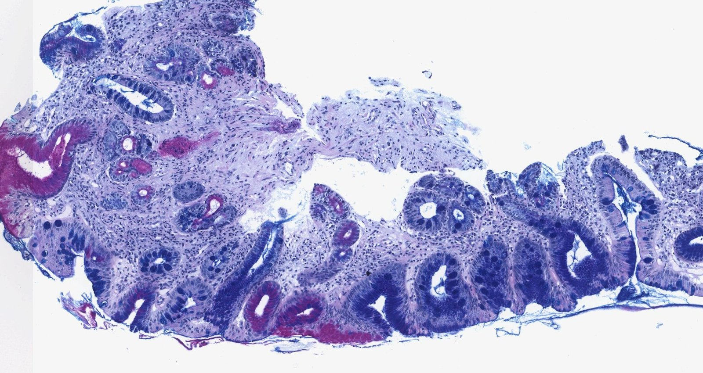

Barrett esophagus

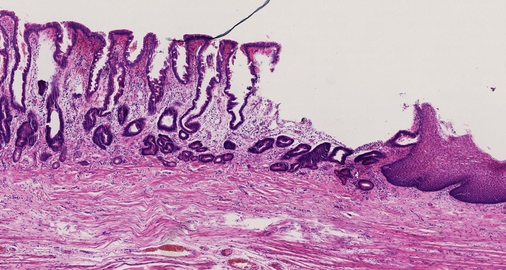

Barrett esophagus

Barrett esophagus with adenocarcinoma

---

## Clinical features

### Typical symptoms

* Retrosternal burning <u>pain</u> (heartburn)

* <u>Regurgitation</u>

* <u>Dysphagia</u>, <u>odynophagia</u>  [[13]](https://coursology-qbank.com/amboss/article/35YSPp)[[14]](https://coursology-qbank.com/amboss/article/8f1OLT0)

* Water brash: a symptom of excessive salivation triggered by refluxing of <u>stomach acid</u>

### Atypical symptoms

* Pressure sensation in the chest/noncardiac <u>chest pain</u>

* Belching, <u>bloating</u>

* <u>Dyspepsia</u>, epigastric <u>pain</u>

* <u>Nausea</u>

* <u>Halitosis</u>

* Features of;  <u>GERD complications</u>, e.g., <u>aspiration pneumonia</u> or <u>aspiration pneumonitis</u>

### Extraesophageal symptoms  [[15]](https://coursology-qbank.com/amboss/article/QY1uK20)

* Chronic nonproductive <u>cough</u> and nighttime <u>cough</u>

* <u>Hoarseness</u>

* <u>Bronchospasm</u>

* Dental <u>erosion</u>

### Aggravating factors

* Lying down shortly after meals

* Certain foods/beverages

### Red flags in GERD [[15]](https://coursology-qbank.com/amboss/article/QY1uK20)

* <u>Dysphagia</u>, <u>odynophagia</u>  [[13]](https://coursology-qbank.com/amboss/article/35YSPp)[[14]](https://coursology-qbank.com/amboss/article/8f1OLT0)

* <u>Anemia</u> and/or <u>signs of GI bleeding</u> (e.g., <u>hematemesis</u>, <u>hematochezia</u>)

* <u>Unintentional weight loss</u>

* <u>Vomiting</u>

* Presence of > 1 <u>risk factors for Barrett esophagus</u>

> [!TIP]
> Consider investigating epigastric <u>pain</u> or burning lasting > 1 month (see “<u>Approach to dyspepsia</u>”). [[15]](https://coursology-qbank.com/amboss/article/QY1uK20)[[16]](https://coursology-qbank.com/amboss/article/MuYM7I)

---

## Differential diagnoses

* Other causes of <u>pain</u> and discomfort

* See “<u>Differential diagnoses of dyspepsia</u>.”

* See “<u>Differential diagnoses of chest pain</u>.”

* See “<u>Differential diagnoses of abdominal pain</u>.”

* <u>Esophagitis</u>

* <u>Infectious esophagitis</u> (typically seen in <u>immunocompromised</u> patients)

* <u>Esophageal candidiasis</u>: Endoscopy shows white or yellow adherent <u>plaques</u> (pseudomembranes).

* <u>Herpes esophagitis</u> (mainly <u>HSV-1</u>): Endoscopy shows <u>superficial</u>, punched-out <u>ulcers</u> in the <u>distal</u> <u>esophagus</u> in the absence of <u>plaques</u>.

* <u>CMV esophagitis</u>: Endoscopy shows <u>mucosal</u> <u>erosions</u> and linear <u>ulcers</u> in the middle or lower <u>esophagus</u>, and viral <u>inclusion bodies</u> in <u>cell nuclei</u> on <u>biopsy</u>.

* <u>Drug-induced esophagitis</u>: Some medications may cause esophageal <u>mucosal</u> irritation, leading to <u>erosions</u> and <u>ulcers</u>. [[17]](https://coursology-qbank.com/amboss/article/KO0UtT)

* <u>Eosinophilic esophagitis</u>

> [!WARNING]
> Rule out <u>acute coronary syndrome</u> in patients with <u>atherosclerotic risk factors</u> before making a clinical <u>diagnosis of GERD</u>.

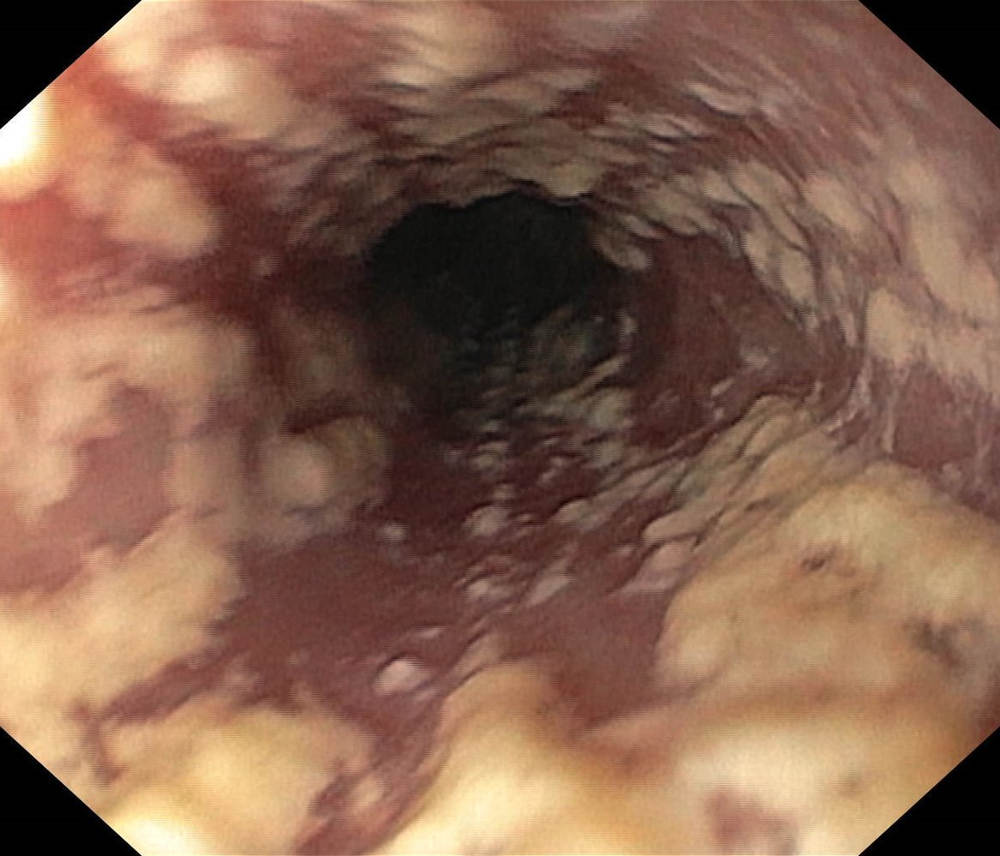

Candida esophagitis

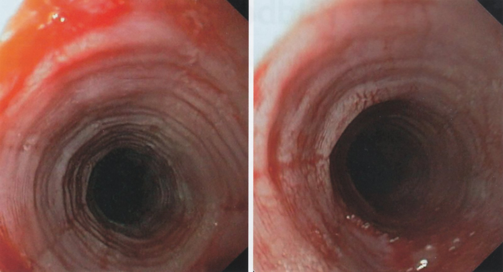

Eosinophilic esophagitis

Eosinophilic esophagitis

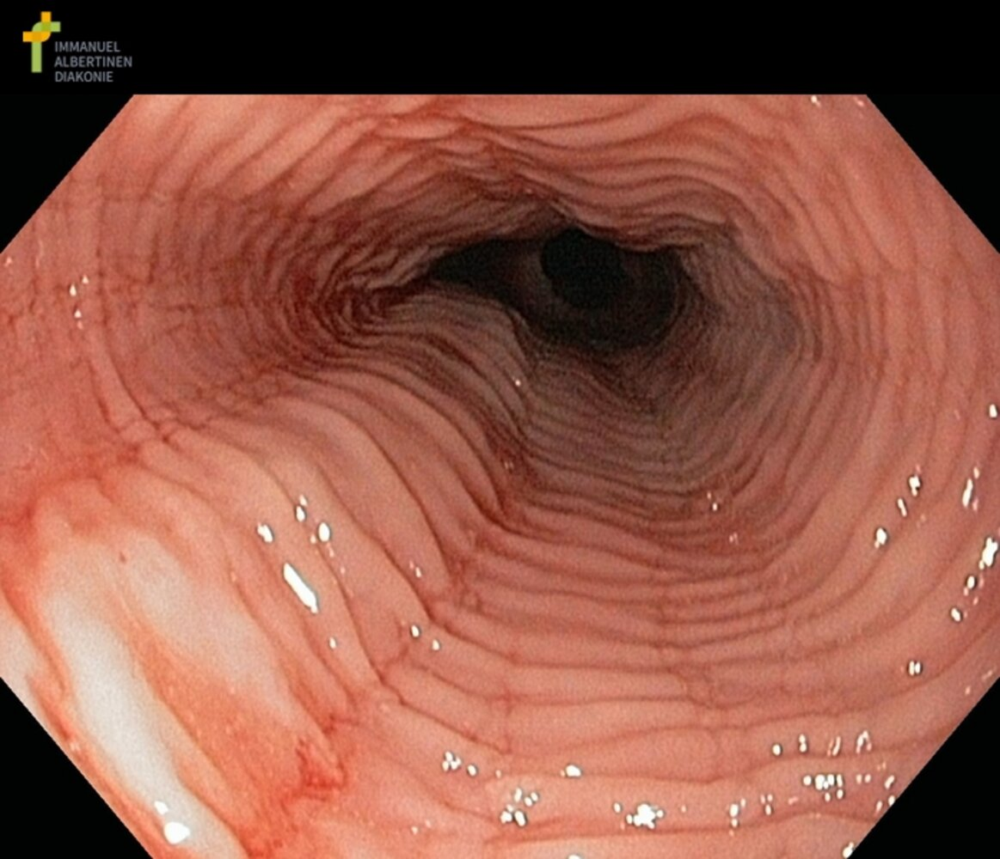

Eosinophilic esophagitis

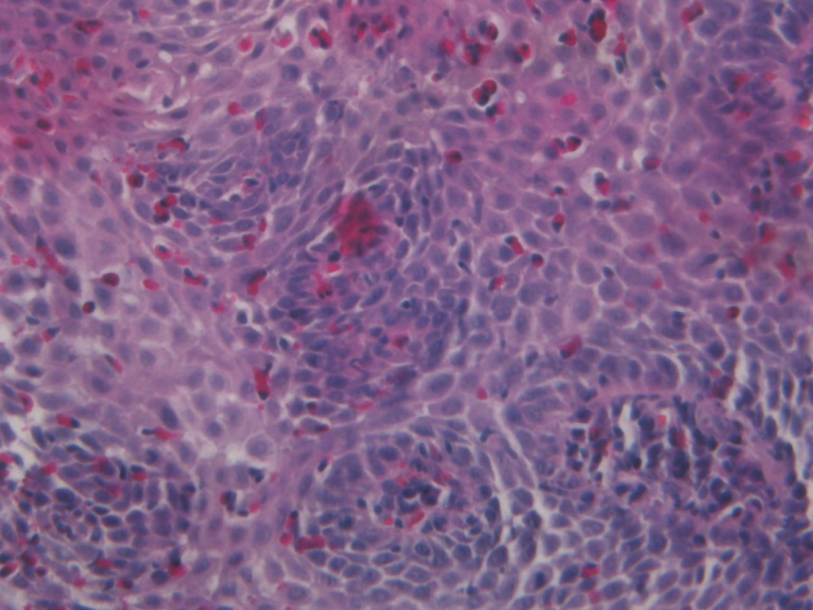

Eosinophilic esophagitis

The differential diagnoses listed here are not exhaustive.

---

## Diagnosis

There is no <u>gold standard test</u> for the <u>diagnosis of GERD</u>. The diagnosis is based on clinical presentation, endoscopic evaluation, reflux assessment, and therapeutic response. [[15]](https://coursology-qbank.com/amboss/article/QY1uK20)

### Approach [[13]](https://coursology-qbank.com/amboss/article/35YSPp)[[15]](https://coursology-qbank.com/amboss/article/QY1uK20)

* All patients

* Perform a clinical evaluation, focusing on <u>red flags in GERD</u> and evaluating <u>dyspepsia</u> if present (see “<u>Approach to dyspepsia</u>”).

* Rule out life-threatening <u>differential diagnoses of GERD</u> and <u>chest pain</u> (e.g., <u>acute coronary syndrome</u>)

* Typical symptoms without <u>red flags in GERD</u>: Initiate treatment for GERD; start an empiric once-daily <u>PPI</u> trial. 

* If there is relief after 8 weeks of <u>PPI</u>: GERD is likely; <u>PPI</u> can be discontinued.

* If symptoms persist on <u>PPI</u> or recur after discontinuing <u>PPI</u>: Refer to gastroenterology for <u>EGD</u>.  [[15]](https://coursology-qbank.com/amboss/article/QY1uK20)

* <u>Red flags in GERD</u>: Refer to gastroenterology for <u>EGD</u> before initiating treatment.

* Extraesophageal symptoms: Rule out other diagnoses prior to initiating treatment for GERD.

* Refractory symptoms: Optimize <u>PPI</u> therapy.

* If symptoms are relieved: Continue <u>PPI</u>.

* If symptoms persist: Refer to gastroenterology.

> [!WARNING]
> Resolution of <u>chest pain</u> with <u>antacids</u> is not diagnostic for GERD and does not rule out life-threatening <u>causes of chest pain</u>. [[18]](https://coursology-qbank.com/amboss/article/KnbU88)

> [!TIP]
> GERD is common during <u>pregnancy</u> and usually subsides after delivery; diagnostic workup is rarely necessary.

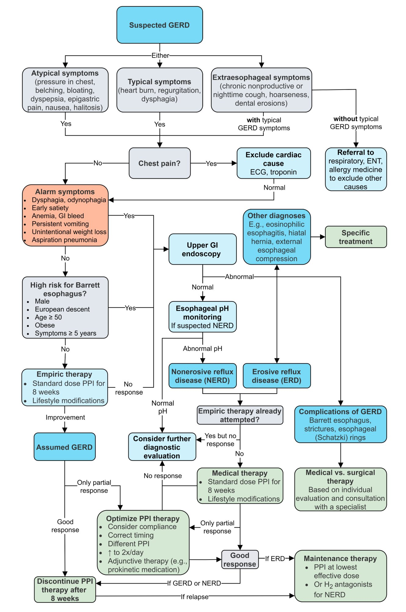

Management of GERD

### <u>EGD</u> [[15]](https://coursology-qbank.com/amboss/article/QY1uK20)[[19]](https://coursology-qbank.com/amboss/article/nO07GT)[[20]](https://coursology-qbank.com/amboss/article/4xY39r)[[21]](https://coursology-qbank.com/amboss/article/maXVO9)

* Indications

* <u>Red flags in GERD</u>

* <u>Risk factors for Barrett esophagus</u>

* No symptomatic improvement after <u>PPI</u> trial

* <u>Red flags of dyspepsia</u>

* Supportive findings (typically in the lowest third of the <u>esophagus</u>)  [[22]](https://coursology-qbank.com/amboss/article/m-YVB7)

* <u>Erythema</u>, <u>edema</u>, <u>friability</u>

* <u>Erosions</u>, <u>mucosal</u> breaks, <u>ulcerations</u>

* Peptic strictures and rings

* Salmon pink <u>mucosa</u> (suggestive of <u>Barrett esophagus</u>)

* <u>Proximal</u> migration of the <u>gastroesophageal junction</u> (<u>Z line</u>), e.g., in <u>Barrett esophagus</u> or <u>hiatal hernia</u> [[23]](https://coursology-qbank.com/amboss/article/I-YYA7)

* <u>Biopsies</u>

* Esophageal <u>biopsies</u> have little value as a diagnostic test for GERD. [[15]](https://coursology-qbank.com/amboss/article/QY1uK20)

* Consider for exclusion of other diagnoses or complications (e.g., <u>eosinophilic esophagitis</u>, <u>Barrett esophagus</u>).

* See “Pathology” for histological findings.

> [!TIP]
> > 50% of patients with GERD present with nonerosive reflux and normal endoscopic findings. [[24]](https://coursology-qbank.com/amboss/article/hxYcwr)

> [!TIP]
> Despite the limited value of esophageal <u>biopsies</u> in diagnosing GERD, they are necessary for establishing a diagnosis of <u>eosinophilic esophagitis</u>. [[15]](https://coursology-qbank.com/amboss/article/QY1uK20)

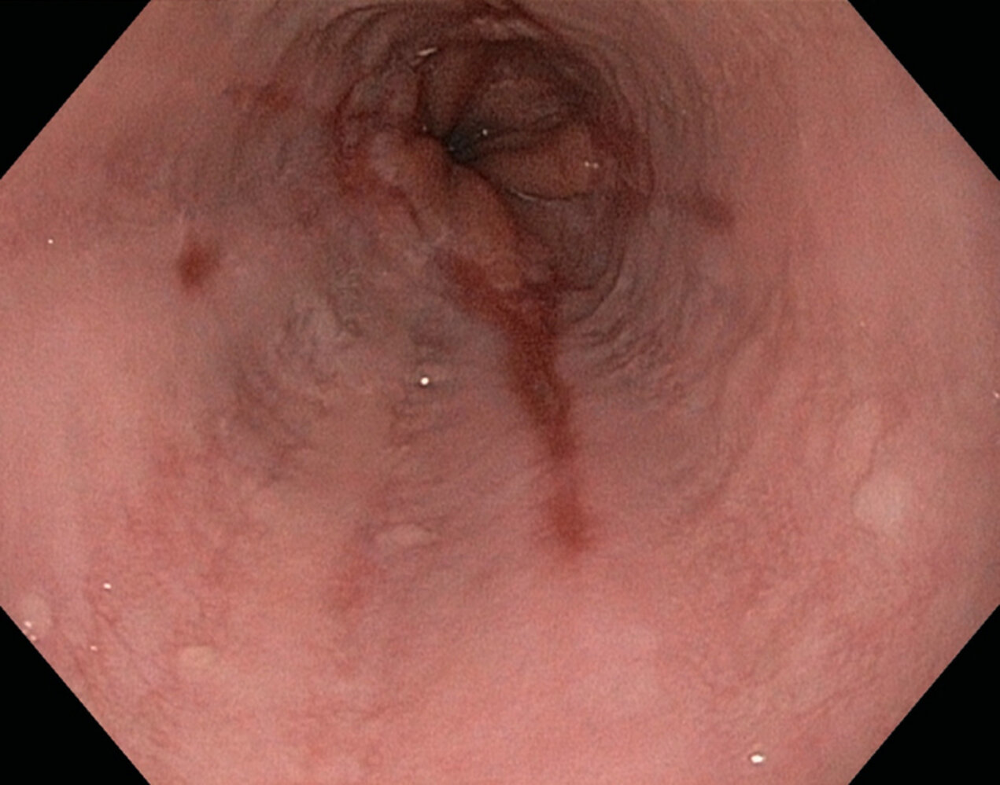

Erosive esophagitis

### Esophageal pH monitoring [[15]](https://coursology-qbank.com/amboss/article/QY1uK20)[[22]](https://coursology-qbank.com/amboss/article/m-YVB7)

<u>Esophageal pH monitoring</u> can be used to objectively identify abnormal reflux of gastric content into the <u>esophagus</u>; however, it is not a routine diagnostic test. [[15]](https://coursology-qbank.com/amboss/article/QY1uK20)

* Indications

* Refractory <u>GERD symptoms</u> despite <u>PPI</u> therapy

* Confirmation of suspected <u>NERD</u>

* Evaluation before surgical or endoscopic antireflux procedure

* Procedure

* Measurement of esophageal <u>pH</u> over 24–48 hours using a <u>telemetry</u> capsule or a transnasal catheter

* Documentation of relevant events by the patient

* Supportive finding: Drops in esophageal <u>pH</u> to 4 or less that correlate with symptoms of acid reflux and precipitating activities.  [[25]](https://coursology-qbank.com/amboss/article/r-YfA7)

### Further diagnostic studies [[15]](https://coursology-qbank.com/amboss/article/QY1uK20)[[22]](https://coursology-qbank.com/amboss/article/m-YVB7)

Not routinely indicated, as they play a limited role in the <u>diagnosis of GERD</u>; useful if endoscopy is inconclusive.

* <u>Esophageal barium swallow</u>

* Consider if the main symptom is <u>dysphagia</u> or if there is suspicion of structural abnormalities (e.g., <u>esophageal rings</u> or webs) or motility disorders (e.g., <u>achalasia</u>, <u>distal esophageal spasm</u>)

* See “Diagnostics” in “<u>Dysphagia</u>”.

* <u>Esophageal manometry</u>: Consider if <u>achalasia</u> or <u>esophageal hypermotility disorders</u> are suspected.  [[26]](https://coursology-qbank.com/amboss/article/oO00tT)

---

## Treatment

The initial <u>management of GERD</u> consists of implementing lifestyle changes and initiating <u>acid suppression therapy</u>, preferably with <u>PPIs</u>. Surgical therapy is not routinely indicated and should only be considered in select cases, e.g., patients who develop complications despite receiving optimal medical therapy.

Management of GERD

### Pharmacological therapy [[15]](https://coursology-qbank.com/amboss/article/QY1uK20)[[20]](https://coursology-qbank.com/amboss/article/4xY39r)

See “<u>Antacids and acid suppression medications</u>” for agents, detailed dosages, and pharmacological considerations.

* <u>PPIs</u>: standard dose of <u>PPI</u> for 8 weeks 

* Indications

* Empiric <u>PPI</u> trial in patients with typical symptoms

* After <u>EGD</u>: ERD or presumed <u>NERD</u>

* Continuous management (based on the clinical response after 8 weeks) [[27]](https://coursology-qbank.com/amboss/article/oRX0LB)

* Good response and no complications: Discontinue <u>PPI</u>.

* Good response in patients with complications : Continue <u>PPI</u> at <u>maintenance dose</u>.  [[15]](https://coursology-qbank.com/amboss/article/QY1uK20)

* Partial response: Increase dose (to twice-daily therapy), adjust timing, or switch to a different <u>PPI</u>.

* Recurrence of symptoms after discontinuation of <u>PPI</u> or during <u>weaning</u>: Consider confirming the diagnosis (e.g., with ambulatory <u>esophageal pH monitoring</u>) prior to continuing <u>maintenance therapy</u>.

* No response: further diagnostic evaluation

* There is controversy surrounding the risks of long-term <u>PPI</u> therapy  [[28]](https://coursology-qbank.com/amboss/article/JRXsLB)[[29]](https://coursology-qbank.com/amboss/article/qRXCLB)[[30]](https://coursology-qbank.com/amboss/article/IRXYoB)[[31]](https://coursology-qbank.com/amboss/article/rRXfoB)

* <u>H2receptor antagonists</u>: Consider as alternate <u>maintenance therapy</u> for <u>NERD</u>, or in addition to <u>PPIs</u> to control nighttime symptoms

* <u>Maintenance therapy</u>: lowest effective dose of <u>acid suppression medication</u>

* Adjunctive therapy: Consider adding in patients with partial response to <u>PPIs</u>; Not recommended without confirmatory diagnostic studies 

* <u>Prokinetic</u> medication for patients with <u>gastroparesis</u>: e.g., <u>metoclopramide</u> DOSAGE

* <u>Baclofen</u> (<u>off-label</u>) DOSAGE for refractory symptoms

> [!TIP]
> A negative response to a <u>PPI</u> trial does not exclude GERD.

### Lifestyle changes [[15]](https://coursology-qbank.com/amboss/article/QY1uK20)[[20]](https://coursology-qbank.com/amboss/article/4xY39r)[[32]](https://coursology-qbank.com/amboss/article/_aX5M9)[[33]](https://coursology-qbank.com/amboss/article/zaXrM9)[[34]](https://coursology-qbank.com/amboss/article/-aXDM9)

There is conflicting evidence as to which lifestyle modifications confer a significant benefit. The following recommendations are commonly mentioned in the literature but should be approached on a case-by-case basis, as they may offer relief only for some patients.

* Dietary recommendations

* Small portions

* Avoid eating at least 2–3 hours before bedtime.

* Avoid foods and beverages that appear to trigger symptoms.  [[35]](https://coursology-qbank.com/amboss/article/pO0LtT)

* Physical recommendations

* Weight loss in patients with <u>obesity</u>

* Elevate the head of the bed (10–20 cm) for patients with nighttime symptoms.

* Reduce or avoid triggering substances

* Tobacco, <u>alcohol</u>, and/or <u>caffeine</u> if the patient experiences <u>correlation</u> with symptoms

* Medications that may worsen symptoms (e.g., <u>CCBs</u>, <u>diazepam</u>)  [[7]](https://coursology-qbank.com/amboss/article/mO0VGT)

### Surgical therapy [[9]](https://coursology-qbank.com/amboss/article/qO0CtT)[[15]](https://coursology-qbank.com/amboss/article/QY1uK20)[[20]](https://coursology-qbank.com/amboss/article/4xY39r)[[36]](https://coursology-qbank.com/amboss/article/7O04FT)

<u>Antireflux surgery</u> may be considered for select patients after careful evaluation. Predictors of successful outcomes include: [[37]](https://coursology-qbank.com/amboss/article/DyY1h7)[[38]](https://coursology-qbank.com/amboss/article/IO0YFT)

* Symptoms that correlate objectively with reflux episodes using ambulatory <u>esophageal pH monitoring</u>

* Prior good response to <u>PPIs</u>

#### Indications

* Discontinuation of medical therapy (e.g., due to nonadherence or side effects)

* Symptoms refractory to medical therapy

* Complications despite optimal medical therapy, e.g., severe <u>esophagitis</u>, strictures, recurrent <u>aspiration</u>

* Large <u>hiatal hernia</u>

#### Fundoplication

* Definition: an antireflux procedure in which the <u>gastric fundus</u> is wrapped around the lower <u>esophagus</u> and secured with stitches to form a cuff; results in a narrowing of the <u>distal</u> <u>esophagus</u> and the <u>gastroesophageal junction</u> (<u>GEJ</u>), preventing reflux

* Approach: <u>Laparoscopic</u> and open <u>fundoplication</u> are possible.

* Techniques  [[37]](https://coursology-qbank.com/amboss/article/DyY1h7)

* Partial <u>fundoplication</u> (fewer complications)

* 180° (Dor <u>fundoplication</u>)

* 270° (Toupet <u>fundoplication</u>)

* <u>Complete fundoplication</u> (Nissen fundoplication): 360°

* Complications [[37]](https://coursology-qbank.com/amboss/article/DyY1h7)

* Gas bloat syndrome: inability to belch, leading to <u>bloating</u> and an increase in flatulence

* <u>Dysphagia</u>

* Recurrence of <u>reflux esophagitis</u>

* Considerations for patients with comorbidities

* Patients with <u>obesity</u> and reflux undergoing <u>bariatric surgery</u>: Consider <u>Roux-en-Y</u>.

* <u>Hiatal hernias</u>: Combine <u>fundoplication</u> with <u>hiatoplasty</u> and, in some cases, <u>gastropexy</u>.

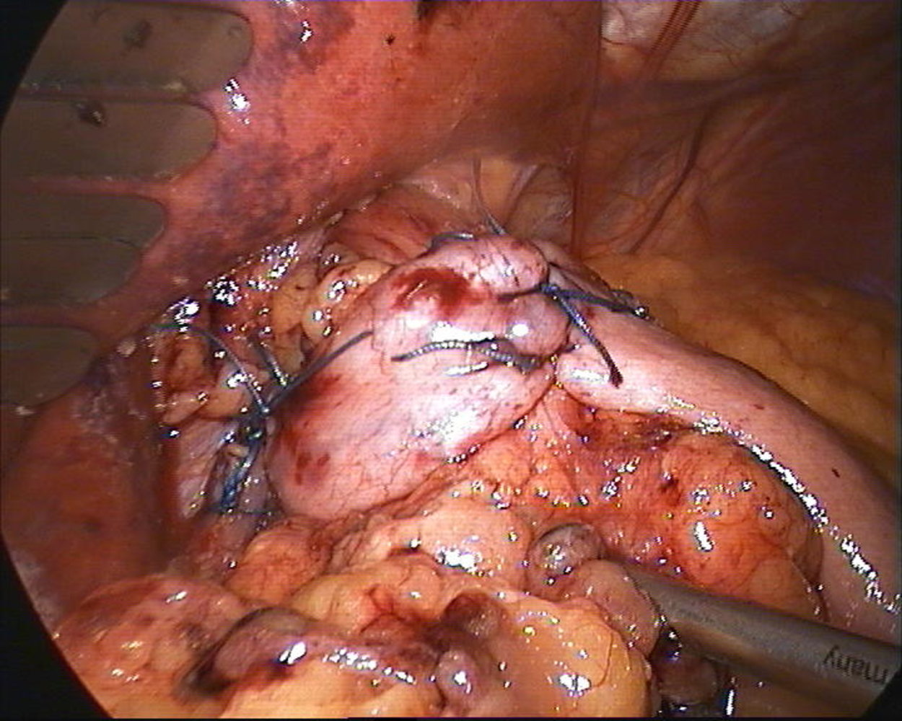

Nissen fundoplication

---

## Complications

### Barrett esophagus [[20]](https://coursology-qbank.com/amboss/article/4xY39r)[[39]](https://coursology-qbank.com/amboss/article/7lY4y6)[[40]](https://coursology-qbank.com/amboss/article/E-Y8_7)[[41]](https://coursology-qbank.com/amboss/article/oe10-f0)

* Definition: <u>intestinal metaplasia</u> of the esophageal <u>mucosa</u> due to chronic <u>reflux esophagitis</u>

* <u>Columnar epithelium</u> and <u>goblet cells</u> rather than esophageal <u>squamous epithelium</u> on histopathological examination

* A precancerous condition that requires close surveillance

* <u>Incidence</u>: up to 12% of patients with GERD [[41]](https://coursology-qbank.com/amboss/article/oe10-f0)

* Risk factors for Barrett esophagus [[41]](https://coursology-qbank.com/amboss/article/oe10-f0)

* Chronic <u>GERD symptoms</u> (weekly symptoms for ≥ 5 years)

* Male sex

* Age > 50 years

* White race

* Smoking

* <u>Obesity</u>

* <u>Family history</u> of <u>Barrett esophagus</u> or <u>esophageal adenocarcinoma</u> in a <u>first-degree relative</u>

* Pathophysiology

* <u>Reflux esophagitis</u> → <u>stomach acid</u> damages <u>mucosa</u> of <u>distal</u> <u>esophagus</u> → <u>stratified</u> <u>squamous epithelium</u> is replaced by nonciliated <u>columnar epithelium</u> and <u>goblet cells</u> (<u>intestinal metaplasia</u>, <u>Barrett metaplasia</u>)  [[12]](https://coursology-qbank.com/amboss/article/vgXACx)

* The physiological transformation zone (<u>Z line</u>) between squamous and <u>columnar epithelium</u> is shifted upwards.

* Diagnosis [[41]](https://coursology-qbank.com/amboss/article/oe10-f0)
* Endoscopy

* <u>Z line</u> displacement < 1 cm and no visible lesions: no diagnosis of <u>Barrett esophagus</u>, <u>biopsy</u> not recommended

* <u>Z line</u> displacement ≥ 1 cm and/or visible lesions: diagnosis of <u>Barrett esophagus</u>, obtain ≥ 8 endoscopic <u>biopsies</u>

* Management and surveillance [[41]](https://coursology-qbank.com/amboss/article/oe10-f0)

* <u>PPI</u> therapy

* Endoscopic surveillance

* If no <u>dysplasia</u>

* <u>Barrett esophagus</u> segment < 3 cm: Repeat endoscopy in 5 years.

* <u>Barrett esophagus</u> segment ≥ 3 cm: Repeat endoscopy in 3 years.

* If indefinite for <u>dysplasia</u>: Repeat endoscopy with <u>biopsies</u> after 3–6 months of optimized <u>PPI</u> therapy.

* If low-grade <u>dysplasia</u>

* Endoscopic therapy of <u>mucosal</u> irregularities (usually including <u>endoscopic mucosal resection</u> and <u>radiofrequency ablation</u>) and follow-up endoscopy with <u>biopsies</u> after 1 year and every 2 years thereafter

* Alternatively: surveillance at 6 months and 1 year and annually thereafter with four-quadrant <u>biopsies</u> every 1 cm

* If high-grade <u>dysplasia</u>: endoscopic resection of all visible lesions and <u>ablation</u> of all remaining areas of Barrett <u>epithelium</u> (e.g., with <u>radiofrequency ablation</u>), and follow-up endoscopy with <u>biopsies</u> after 3, 6, and 12 months and annually thereafter

* <u>Antireflux surgery</u> to prevent progression to <u>neoplasia</u> is not routinely recommended.

* Complications: <u>esophageal adenocarcinoma</u> (see “<u>Esophageal cancer</u>”) [[42]](https://coursology-qbank.com/amboss/article/8yWOSL0)

> [!TIP]
> Endoscopic examination of the <u>esophagus</u> is indicated to screen for <u>Barrett esophagus</u> in patients with chronic <u>GERD symptoms</u> (weekly for ≥ 5 years) and ≥ 3 additional <u>risk factors</u>: male sex, age > 50 years, White race, <u>obesity</u>, smoking, <u>family history</u> of <u>Barrett esophagus</u> or <u>esophageal adenocarcinoma</u> in a <u>first-degree relative</u>. [[41]](https://coursology-qbank.com/amboss/article/oe10-f0)

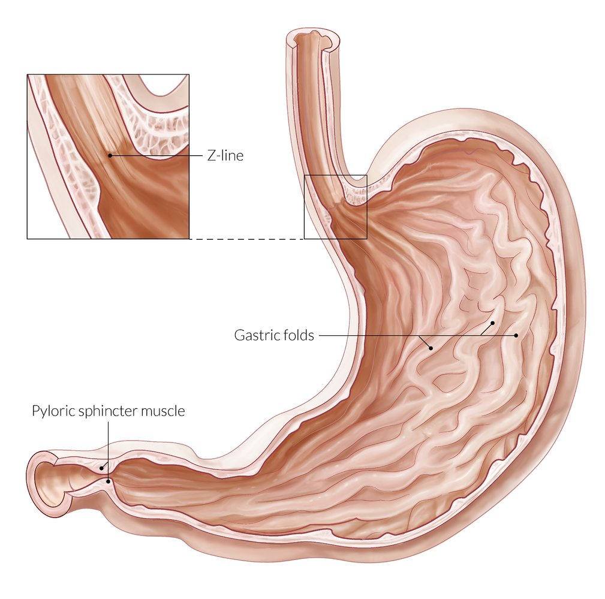

Anatomy of the stomach

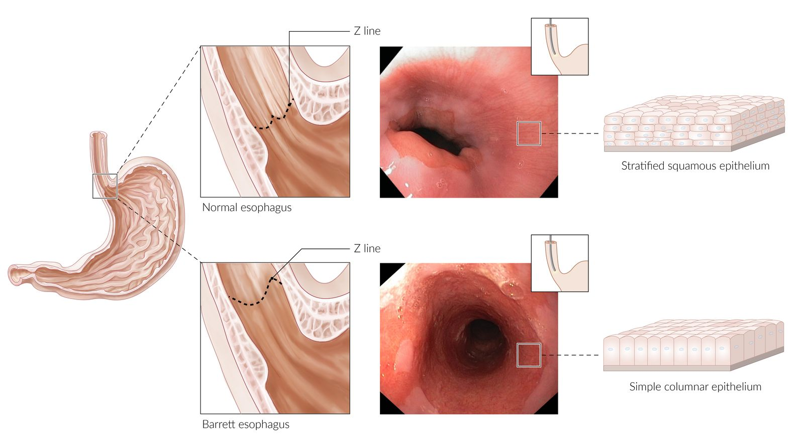

Barrett esophagus

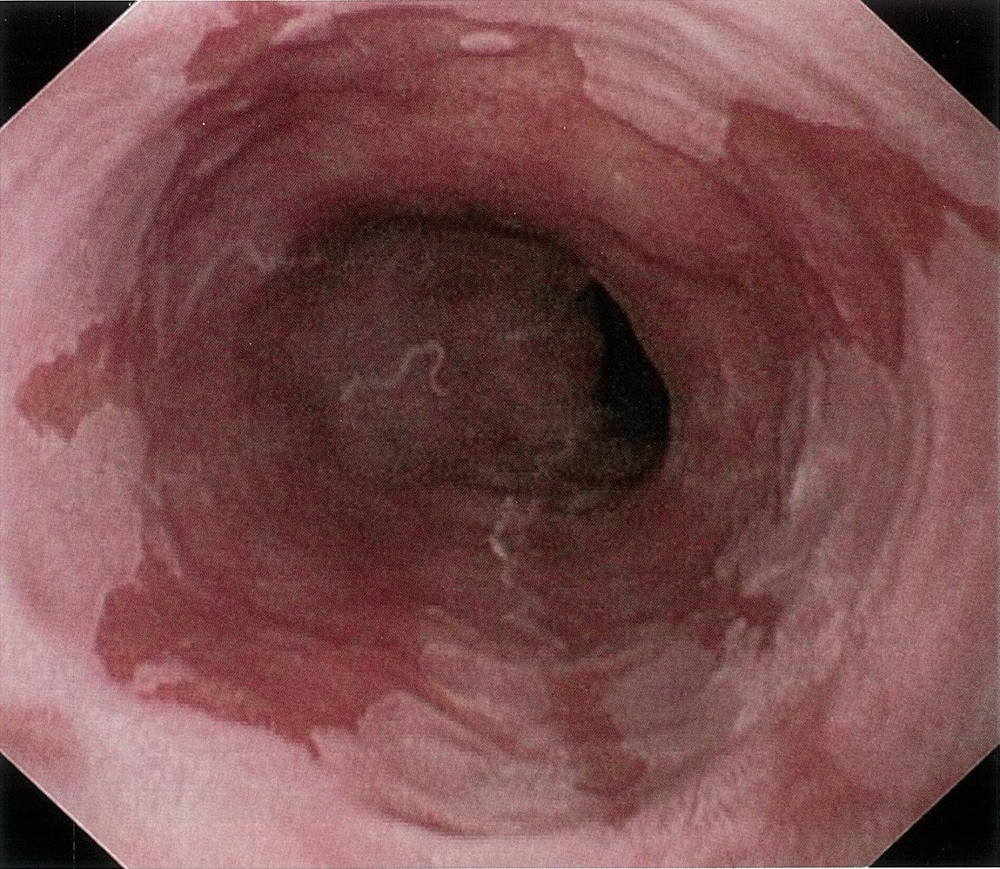

Barrett esophagus

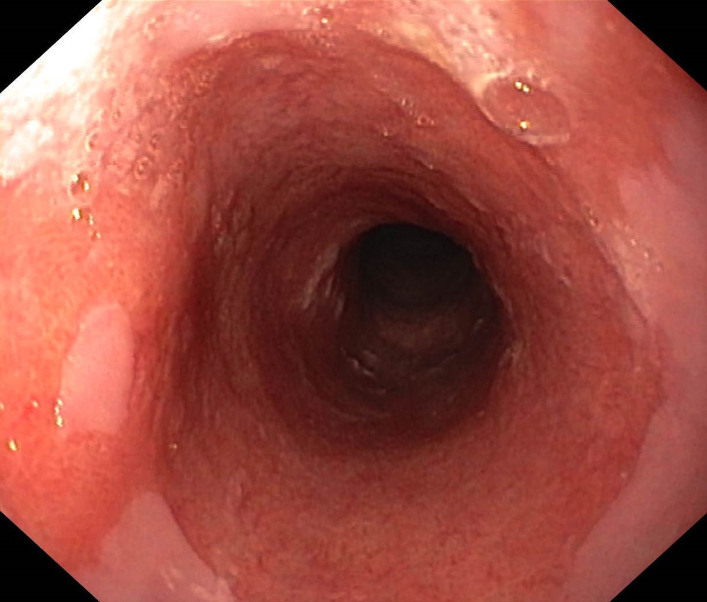

Long-segment Barrett esophagus

### Additional complications

* <u>Reflux esophagitis</u>: most common <u>complication of GERD</u> [[43]](https://coursology-qbank.com/amboss/article/5OYiG6)

* Erosive <u>esophagitis</u>

* <u>Iron deficiency anemia</u>: <u>mucosal</u> <u>erosions</u> and <u>ulcerations</u> → chronic bleeding → <u>anemia</u>

* Esophageal stricture

* Etiology

* Most common sequela of <u>reflux esophagitis</u>;   or ingestion of <u>caustic substances</u> [[43]](https://coursology-qbank.com/amboss/article/5OYiG6)

* Radiation

* <u>Systemic sclerosis</u>

* Clinical features: solid food <u>dysphagia</u>

* Diagnostics

* <u>Barium esophagram</u> (best initial test): narrowing of the <u>esophagus</u> at the <u>gastroesophageal junction</u>

* Endoscopy with <u>biopsies</u>: to rule out <u>malignancy</u> and <u>eosinophilic esophagitis</u>

* Treatment

* First-line treatment: dilation with <u>bougie dilator</u>/balloon dilator and <u>PPIs</u> in patients with reflux

* In refractory cases (multiple recurrences): <u>steroid</u> injection prior to dilation; endoscopic <u>electrosurgical</u> <u>incision</u>

* Recurrence occurs in the majority of patients; multiple treatment attempts are often necessary.

* <u>Esophageal rings</u>: e.g., <u>Schatzki rings</u>

* Complications due to <u>aspiration</u> of gastric contents

* <u>Aspiration pneumonia</u> and/or <u>aspiration pneumonitis</u>

* <u>Chronic bronchitis</u>

* <u>Asthma</u> (exacerbation)

* Reflux <u>laryngitis</u>: <u>hoarseness</u> (due to <u>laryngopharyngeal reflux</u>)

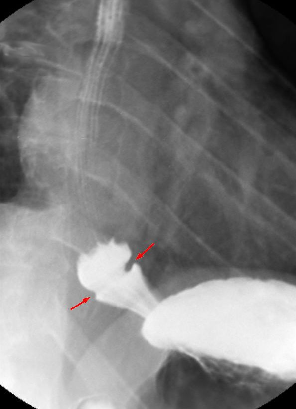

Esophageal B-ring (Schatzki ring)

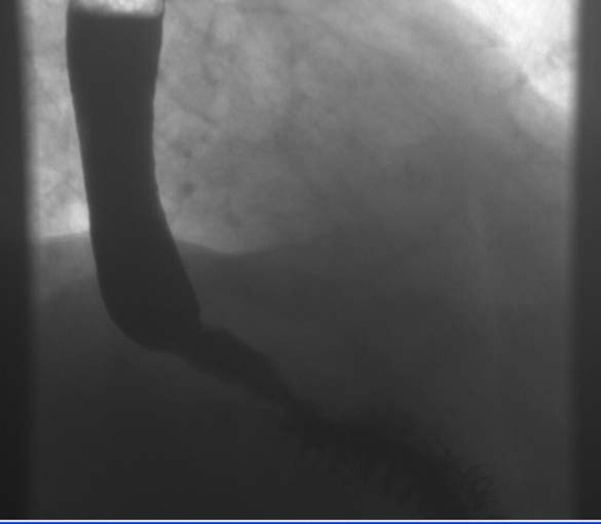

 

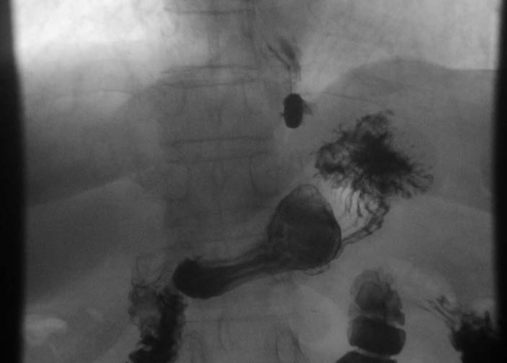

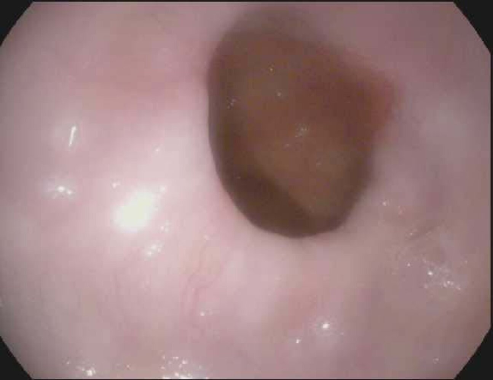

Schatzki ring

We list the most important complications. The selection is not exhaustive.

---