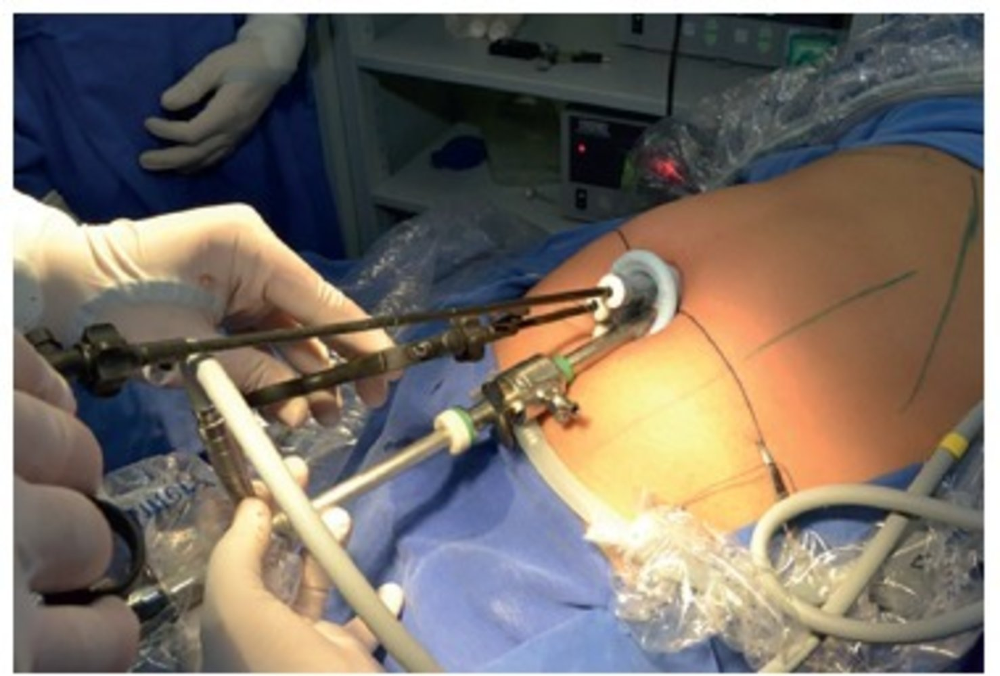
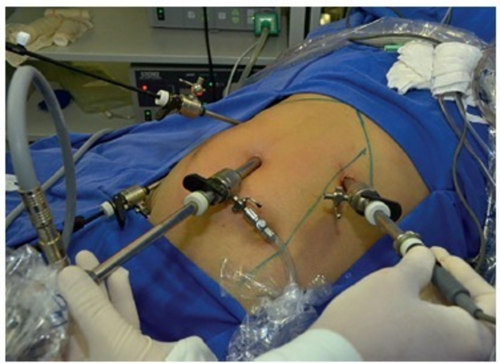

# Cholecystectomy

*Categories: Clinical knowledge > Internal medicine > Gastroenterology > Diseases of the gallbladder and biliary tract > Cholecystectomy*

[Original Article Link](https://coursology-qbank.com/amboss/article/kG0mzh)

---

## Summary

Cholecystectomy refers to the surgical removal of the <u>gallbladder</u>. It is most often performed for symptomatic or high-risk <u>cholelithiasis</u> and <u>acute cholecystitis</u>. It can also be a component of a more extensive surgical resection (e.g., <u>Whipple procedure</u>). <u>Laparoscopic cholecystectomy</u> is most commonly performed, while <u>open cholecystectomy</u> is typically reserved for select cases. The decision to proceed with <u>surgery</u> and its timing largely depends on patient and disease characteristics. Early complications of the procedure include infection, bleeding, bowel injury, and <u>postcholecystectomy bile leak</u>. Late complications include <u>hernias</u>, strictures, <u>fistulas</u>, <u>diarrhea</u>, and <u>postcholecystectomy syndrome</u>.

See also “<u>Cholelithiasis</u>,” “<u>Cholecystitis</u>,” “<u>Choledocholithiasis</u>,” “<u>Cholangitis</u>,” “<u>Biliary cancer</u>,” and “<u>Pancreatic and hepatic surgery</u>.”

---

## Indications

* <u>Symptomatic cholelithiasis</u>

* Asymptomatic <u>cholelithiasis</u> with an increased risk of:

* <u>Gallbladder cancer</u>  [[1]](https://coursology-qbank.com/amboss/article/9lYN_6)[[3]](https://coursology-qbank.com/amboss/article/xgbExG)[[4]](https://coursology-qbank.com/amboss/article/nJY7uJ)

* Developing complications  [[4]](https://coursology-qbank.com/amboss/article/nJY7uJ)[[5]](https://coursology-qbank.com/amboss/article/2EYTEI)

* Becoming symptomatic  [[4]](https://coursology-qbank.com/amboss/article/nJY7uJ)[[6]](https://coursology-qbank.com/amboss/article/BgbzxG)[[7]](https://coursology-qbank.com/amboss/article/ygbdBG)

* <u>Acute calculous cholecystitis</u>

* <u>Acalculous cholecystitis</u>

* Resectable <u>pancreatic</u> and/or hepatobiliary <u>neoplasms</u> (often combined with a more extensive resection)  (see also “<u>Pancreatic and hepatic surgery</u>”)

---

## Technique/steps

### Timing

Timing of cholecystectomy depends on the indication and individual surgical risks (See “<u>Surgical procedural risk assessment</u>” and “<u>Preoperative risk stratification tools</u>” for details).

* Symptomatic uncomplicated <u>cholelithiasis</u>: electively, but as early as possible  [[1]](https://coursology-qbank.com/amboss/article/9lYN_6)[[8]](https://coursology-qbank.com/amboss/article/zgbrBG)[[9]](https://coursology-qbank.com/amboss/article/ZSbZyG)

* Uncomplicated <u>choledocholithiasis</u>: within 72 hours of <u>ERCP</u>-guided stone clearance [[1]](https://coursology-qbank.com/amboss/article/9lYN_6)[[10]](https://coursology-qbank.com/amboss/article/cRbaNt)

* <u>Complicated cholelithiasis</u> or <u>choledocholithiasis</u>: depends on the severity of complication and the patient's anesthesia risks

* Mild <u>biliary pancreatitis</u>: during the same hospital admission [[11]](https://coursology-qbank.com/amboss/article/-hbDgt)[[12]](https://coursology-qbank.com/amboss/article/HVaKDj)[[13]](https://coursology-qbank.com/amboss/article/qoYC1J)

* <u>Acute cholecystitis</u> (see ''Treatment'' in “<u>Acute cholecystitis</u>” for details) [[14]](https://coursology-qbank.com/amboss/article/HibKGt)[[15]](https://coursology-qbank.com/amboss/article/FMYgqp)

* Low-risk <u>mild acute cholecystitis</u>: <u>early laparoscopic cholecystectomy</u>

* High-risk or <u>severe acute cholecystitis</u>: <u>interval laparoscopic cholecystectomy</u>

* <u>Acute cholangitis</u>: ∼ 6 weeks after successful <u>ERCP</u>-guided stone clearance [[16]](https://coursology-qbank.com/amboss/article/FlagAk)

### Approach [[2]](https://coursology-qbank.com/amboss/article/lSbv-G)

* Laparoscopic cholecystectomy 

* Removal of the <u>gallbladder</u> via a <u>laparoscopic</u> approach

* Current <u>standard of care</u> for most indications of cholecystectomy  [[17]](https://coursology-qbank.com/amboss/article/yjbd1F)

* Open cholecystectomy

* Removal of the <u>gallbladder</u> via an abdominal <u>incision</u> (typically right subcostal)

* Not routinely performed

* Indications include:

* Unsuccessful <u>laparoscopic cholecystectomy</u>

* <u>Gallbladder cancer</u>

* As part of a bigger operative procedure that requires an open <u>surgery</u>

---

## Complications

### Intraoperative and early <u>postoperative complications</u> [[1]](https://coursology-qbank.com/amboss/article/9lYN_6)[[2]](https://coursology-qbank.com/amboss/article/lSbv-G)[[18]](https://coursology-qbank.com/amboss/article/wMYhIp)

* Hemorrhage

* <u>Transmural</u> bowel injury

* <u>Surgical site infection</u>

* Postcholecystectomy bile leak [[19]](https://coursology-qbank.com/amboss/article/cPbadF)[[20]](https://coursology-qbank.com/amboss/article/WPbPdF)[[21]](https://coursology-qbank.com/amboss/article/1Pb2dF)

* Etiology

* Inadequately ligated <u>cystic duct</u> (most common)

* Leak from small biliary ductules from the dissected <u>gallbladder</u> bed

* Injury to <u>bile</u> duct

* Clinical features

* Intraoperatively: golden yellow <u>bile</u> in the operative field

* Postoperatively

* <u>Fever</u>, abdominal <u>pain</u>, persistent <u>paralytic ileus</u>

* Biliary <u>peritonitis</u>

* Subhepatic collection → <u>biloma</u> or <u>abscess</u>

* Treatment

* Intraoperative diagnosis: repair of injured <u>bile</u> duct and/or placement of drain in the <u>gallbladder</u> fossa

* Postoperative diagnosis: <u>ERCP</u> and <u>stenting</u> or surgical repair, depending on the severity

### Delayed complications [[1]](https://coursology-qbank.com/amboss/article/9lYN_6)[[2]](https://coursology-qbank.com/amboss/article/lSbv-G)[[18]](https://coursology-qbank.com/amboss/article/wMYhIp)

* <u>Incisional hernia</u> (at <u>trocar</u> site)

* <u>Biliary stricture</u>

* <u>Biliary-enteric fistula</u>

* Postcholecystectomy diarrhea 

* Definition: <u>chronic diarrhea</u> after removal of the <u>gallbladder</u> [[2]](https://coursology-qbank.com/amboss/article/lSbv-G)[[22]](https://coursology-qbank.com/amboss/article/ZPbZWF)

* Pathophysiology: Removal of the <u>gallbladder</u> → no reservoir of <u>bile</u> → entry of excess <u>bile acids</u> into the <u>colon</u> → <u>secretory diarrhea</u>  [[23]](https://coursology-qbank.com/amboss/article/zjbr1F)[[24]](https://coursology-qbank.com/amboss/article/-jbD1F)
* May also be functional or due to other undiagnosed causes of <u>diarrhea</u>

* Diagnostics: SeHCAT test  [[2]](https://coursology-qbank.com/amboss/article/lSbv-G)

* Treatment: Preferred first-line agent is <u>cholestyramine</u>. DOSAGE [[22]](https://coursology-qbank.com/amboss/article/ZPbZWF)

* Postcholecystectomy syndrome: persistent <u>RUQ</u> <u>pain</u> or new symptoms following <u>gallbladder</u> removal [[2]](https://coursology-qbank.com/amboss/article/lSbv-G)[[25]](https://coursology-qbank.com/amboss/article/O-cIxU0)

* <u>Incidence</u>: 10–15% of patients [[2]](https://coursology-qbank.com/amboss/article/lSbv-G)

* Etiology 

* Biliary (e.g., <u>choledocholithiasis</u>, <u>biliary stricture</u>, <u>sphincter of Oddi dysfunction</u>)

* <u>Pancreatic</u> (e.g., <u>pancreatitis</u>, <u>pancreatic pseudocyst</u>, <u>pancreatic</u> <u>malignancy</u>)

* Other gastrointestinal causes (e.g., <u>GERD</u>, <u>IBS</u>, <u>PUD</u>)

* Extraintestinal causes (e.g., <u>coronary heart disease</u>, <u>pain</u> syndromes, wound <u>neuroma</u>)

* Clinical features: Commonly <u>RUQ</u> abdominal <u>pain</u> associated with GI symptoms (e.g., <u>nausea</u>, <u>vomiting</u>, <u>diarrhea</u>), but often variable and often nonspecific

* Diagnostics

* Initial tests: <u>LFTs</u>, transabdominal <u>ultrasound</u>

* Additional tests to rule out <u>bile</u> duct stones: <u>endoscopic ultrasound</u> or <u>MRCP</u> [[1]](https://coursology-qbank.com/amboss/article/9lYN_6)

* Treatment: management of the underlying cause, e.g., <u>ERCP</u>-guided stone extraction for <u>cholelithiasis</u>  [[1]](https://coursology-qbank.com/amboss/article/9lYN_6)

We list the most important complications. The selection is not exhaustive.

---