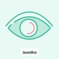
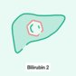
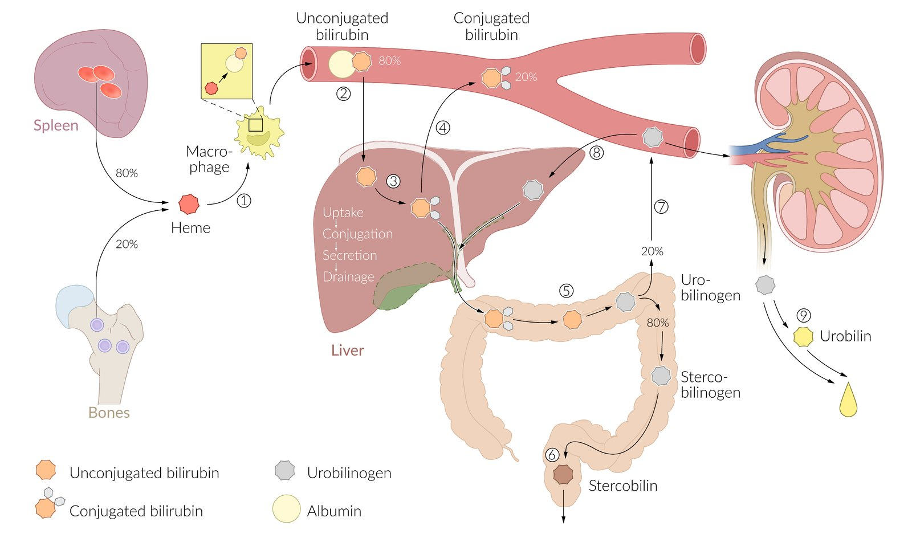
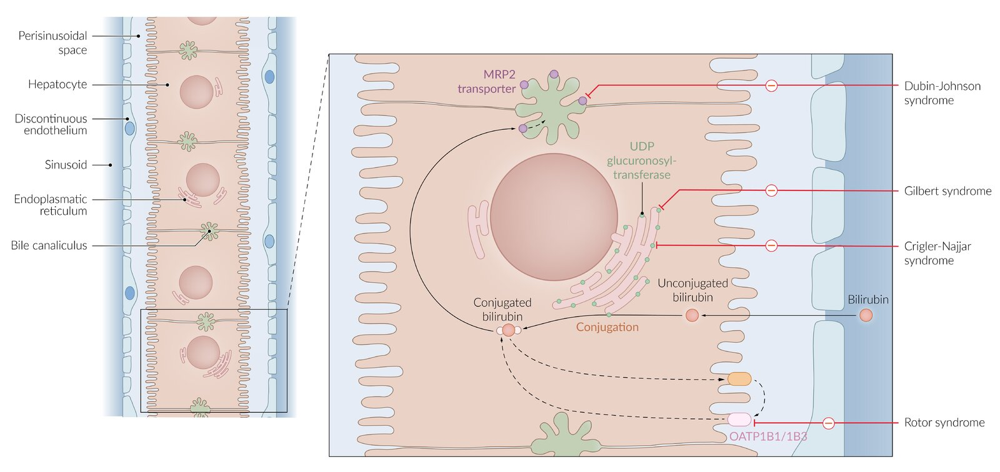
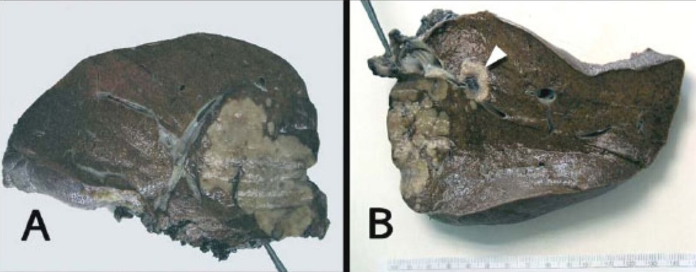

# Inherited hyperbilirubinemia

*Categories: Clinical knowledge > Internal medicine > Gastroenterology > Diseases of the gallbladder and biliary tract > Inherited hyperbilirubinemia*

[Original Article Link](https://coursology-qbank.com/amboss/article/iM0Jog)

---

## Summary

<u>Hyperbilirubinemia</u> is characterized by serum <u>bilirubin</u> levels of ≥ 1.1 mg/dL. In contrast to acute or chronic <u>cholestatic</u> <u>liver</u> disorders, which may also lead to increased serum <u>bilirubin</u> levels, syndromes associated with <u>hyperbilirubinemia</u> lead to isolated <u>hyperbilirubinemia</u> and hence do not affect <u>liver</u> enzymes. These syndromes cause a rise in either unconjugated or <u>conjugated bilirubin</u>. The clinical manifestation of <u>hyperbilirubinemia</u> is relatively mild; transient <u>jaundice</u> is the primary symptom. With the exception of <u>Crigler-Najjar</u> syndrome type I, inherited <u>hyperbilirubinemia</u> syndromes do not require medical management. Patients with <u>hyperbilirubinemia</u> generally have a good prognosis.

Jaundice: Differential Diagnosis

Bilirubin - Part 1: Metabolism & Excretion

Bilirubin - Part 2: Laboratory Measurement

---

## Classification

| Isolated <u>hyperbilirubinemia</u> |  |  |
| --- | --- | --- |
| Types | Etiology | Example |
|  ↑ <u>Indirect bilirubin</u>  (<u>unconjugated bilirubin</u>)  |  * Excess release   |  * <u>Hemolytic anemia</u>   |
|  * Defective conjugation   |  * <u>Gilbert syndrome</u>   |  |
|  * <u>Crigler-Najjar syndrome</u>   |  |  |
|  ↑ <u>Direct bilirubin</u> (<u>conjugated bilirubin</u>)  |  * Defective excretion   |  * <u>Dubin-Johnson syndrome</u>   |
|  * <u>Rotor syndrome</u>   |  |  |

Bilirubin metabolism

Hereditary hyperbilirubinemia

> [!NOTE]
> Individuals with Crigler-Najjar or Gilbert syndrome cannot ConjuGate <u>bilirubin</u>.

> [!NOTE]
> Individuals with Rotor syndrome or Dubin-Johnson syndrome cannot get RiD of DiRect <u>bilirubin</u>.

---

## Gilbert syndrome

* <u>Epidemiology</u>

* Most common inherited <u>hyperbilirubinemia</u>: The <u>prevalence</u> is 3–7% in the US. [[1]](https://coursology-qbank.com/amboss/article/ccXaYC)

* <u>♂</u> > <u>♀</u>

* Age of onset: <u>adolescence</u>  [[2]](https://coursology-qbank.com/amboss/article/VcXGYC)

* Etiology [[3]](https://coursology-qbank.com/amboss/article/bcXHaC)[[4]](https://coursology-qbank.com/amboss/article/XcX9aC)

* Mutation in the <u>promoter</u> region of UGT1A1 <u>gene</u> → mild reduction of <u>UDP-glucuronosyltransferase</u> activity → ↓ conjugation of <u>bilirubin</u> → ↑ <u>indirect bilirubin</u>

* Alternative: <u>missense mutation</u> in UGT1A1 <u>gene</u>

* Impaired hepatic <u>bilirubin</u> uptake

* Inheritance: <u>autosomal recessive</u> or <u>autosomal dominant</u>

* Clinical features

* Asymptomatic or unspecific symptoms such as fatigue and loss of appetite

* Transient, usually mild <u>jaundice</u> (varying from mild <u>scleral jaundice</u> to general <u>jaundice</u>)  [[5]](https://coursology-qbank.com/amboss/article/hzYcs7)

* Triggering factors of transient <u>jaundice</u>

* <u>Stress</u> (e.g., trauma, illness, exhaustion)

* <u>Fasting</u> periods

* <u>Alcohol</u> consumption

* Diagnosis

* Slightly ↑ <u>indirect bilirubin</u> but < 3 mg/dL (higher levels are possible during episodes of increased <u>bilirubin</u> breakdown)

* Normal <u>liver function</u>

* No <u>evidence of hemolysis</u>

* Detection of mutation using <u>PCR</u>

* Treatment: not required (benign condition)

---

## Crigler-Najjar syndrome

### <u>Crigler-Najjar syndrome type I</u>

* Etiology: <u>UDP-glucuronosyltransferase</u> is (almost completely) absent.

* Inheritance: <u>autosomal recessive</u>

* Clinical features

* Excessive, persistent <u>neonatal jaundice</u>

* <u>Kernicterus</u>: neurological symptoms (onset during <u>infancy</u> or later in childhood)

* Diagnosis

* ↑ <u>Indirect bilirubin</u> (20–50 mg/dL)

* Normal <u>liver function</u> tests

* No <u>evidence of hemolysis</u>

* Treatment

* <u>Phototherapy</u>: conversion of <u>unconjugated bilirubin</u> (hydrophobic <u>bilirubin</u>) to more polar, water-soluble form → ↑ excretion via urine and/or <u>bile</u>

* <u>Plasmapheresis</u> during acute rises in serum <u>bilirubin</u> levels

* Tin <u>protoporphyrin</u>

* <u>Calcium carbonate</u>

* <u>Liver transplantation</u> is the only curative treatment.

* Prognosis

* Without treatment, <u>Crigler-Najjar syndrome type I</u> is incompatible with life because it causes <u>kernicterus</u>.

* If treated, patients may survive past <u>puberty</u>, but most will eventually develop <u>kernicterus</u>.

### <u>Crigler-Najjar syndrome type II</u> (Arias syndrome)

* Etiology: reduced levels of <u>UDP-glucuronosyltransferase</u>

* Inheritance: <u>autosomal recessive</u> or <u>autosomal dominant</u>

* Clinical features

* Often asymptomatic

* No <u>neonatal jaundice</u>, although <u>jaundice</u> may occur during the patient's first year of life

* No neurological symptoms

* Diagnosis

* ↑ <u>Indirect bilirubin</u> (< 20 mg/dL)

* Normal <u>liver function</u> tests

* No <u>evidence of hemolysis</u>

* Responds to <u>phenobarbital</u> → ↓ serum <u>bilirubin</u> levels

* Treatment: Patients are less likely to develop <u>kernicterus</u>. Specific treatment may therefore not be required. The following treatment options are, however, available if patients become icteric.

* <u>Phenobarbital</u>: leads to induction of <u>UDP-glucuronosyltransferase</u>

* <u>Phototherapy</u> (as in type I)

* Avoid <u>hormonal contraception</u> and hepatic enzyme inhibitors

* Prognosis

* Usually favorable

* Management of <u>jaundice</u> allows for normal quality of life.

---

## Dubin-Johnson syndrome

* Etiology: defective multidrug resistance-associated protein 2 (<u>MRP2</u>);   → impaired excretion of <u>conjugated bilirubin</u> from the <u>hepatocytes</u> into the <u>bile canaliculi</u>

* Inheritance: <u>autosomal recessive</u>

* Clinical features

* Mild to moderate <u>jaundice</u>

* Onset often occurs during <u>adolescence</u>

* May worsen because of medication (particularly <u>contraceptives</u>) or <u>pregnancy</u>

* <u>Splenomegaly</u> may occur in rare cases.

* Diagnosis

* <u>Direct hyperbilirubinemia</u> (<u>direct bilirubin</u>/total <u>bilirubin</u> up to 50%)

* <u>Liver biopsy</u>: dark, granular pigmentation (due to accumulation of <u>epinephrine</u> metabolites)

* Treatment: not required (benign condition)

* Special considerations

* Be careful when administering a drug that is toxic to the <u>liver</u>, as it may worsen <u>jaundice</u>.

* Contraindication for oral <u>contraception</u>

> [!NOTE]
> In Dubin-Johnson syndrome, the <u>liver</u> appears Dark.

Dubin Johnson syndrome

---

## Rotor syndrome

* Etiology: defective organic <u>anion</u> transport <u>proteins</u> (OATP) 1B1 and 1B3 in <u>hepatocytes</u>  → impaired transport and reduced storage capacity of <u>conjugated bilirubin</u> (<u>direct bilirubin</u>) [[6]](https://coursology-qbank.com/amboss/article/tpaXrl)[[7]](https://coursology-qbank.com/amboss/article/HzaK8M)

* Inheritance: <u>autosomal recessive</u>

* Clinical features: usually asymptomatic but mild <u>jaundice</u> may occur (milder presentation compared to <u>Dubin-Johnson syndrome</u>)

* Diagnosis

* Moderate, <u>direct hyperbilirubinemia</u> and mild, <u>indirect hyperbilirubinemia</u>

* Normal <u>liver function test</u>

* ↑ Urinary coproporphyrins I and III (fraction of <u>isomer</u> I < 70% of total)

* <u>Liver biopsy</u>: normal, no pigmentation

* Treatment: not required

* Special considerations

* Be careful when administering a drug that is toxic to the <u>liver</u>, as it may worsen <u>jaundice</u>.

* Contraindication for oral <u>contraception</u>

> [!NOTE]
> In Rotor syndrome, the <u>liver</u> appears Regular (no dark pigmentation).

---