# Acute appendicitis

*Categories: Clinical knowledge > Internal medicine > Gastroenterology > Diseases of the intestine and appendix > Acute appendicitis*

[Original Article Link](https://coursology-qbank.com/amboss/article/a30QSf)

---

## Summary

Acute appendicitis is the <u>acute inflammation</u> of the <u>appendix</u>, typically due to an obstruction of the appendiceal lumen. It is the most common cause of <u>acute abdomen</u> requiring emergency surgical intervention in both children and adults. The characteristic features of acute appendicitis are periumbilical abdominal <u>pain</u> that migrates to the <u>right lower quadrant</u> (<u>RLQ</u>), <u>anorexia</u>, <u>nausea</u>, <u>fever</u>, and <u>RLQ</u> tenderness. When seen alongside <u>neutrophilic leukocytosis</u>, these features are sufficient to make a <u>clinical diagnosis</u> using <u>appendicitis scoring systems</u> to estimate the likelihood of appendicitis. Imaging (e.g., abdominal CT with IV contrast, abdominal <u>ultrasonography</u>) may be considered if the <u>clinical diagnosis</u> is uncertain. The current standard of management of acute <u>uncomplicated appendicitis</u> is <u>appendectomy</u> within 24 hours of diagnosis (<u>laparoscopic</u> or open) and <u>antibiotics</u>. <u>Emergency appendectomy</u> is indicated for patients with systemic complications. Nonoperative management (NOM), which includes bowel rest, <u>antibiotics</u>, and <u>analgesics</u>, is indicated in patients with an <u>inflammatory appendiceal mass</u> (<u>phlegmon</u>) or an <u>appendiceal abscess</u>, because surgical intervention is associated with a higher risk of complications in these patient groups. <u>Interval appendectomy</u> 6–8 weeks following resolution of the acute episode may be considered in these patients to prevent a recurrence or if there is concern for an underlying <u>appendiceal tumor</u>.

---

## Definitions

* Appendicitis: <u>acute inflammation</u> of the <u>vermiform appendix</u>

* Uncomplicated appendicitis: appendicitis with no evidence of an <u>appendiceal fecalith</u>, an <u>appendiceal tumor</u>, or complications, such as perforation, <u>gangrene</u>, <u>abscess</u>, or mass  [[1]](https://coursology-qbank.com/amboss/article/GhbB2t)

* Complicated appendicitis: appendicitis associated with perforation, <u>gangrene</u>, <u>abscess</u>, an inflammatory mass, an <u>appendiceal fecalith</u>, or an <u>appendiceal tumor</u> [[1]](https://coursology-qbank.com/amboss/article/GhbB2t)

---

## Epidemiology

* Common cause of <u>acute abdomen</u> [[2]](https://coursology-qbank.com/amboss/article/lR0vMf)

* Lifetime risk: ∼ 8%

* Peak <u>incidence</u>: 10–19 years of age  [[3]](https://coursology-qbank.com/amboss/article/NR0-Mf)

* Sex: <u>♂</u> > <u>♀</u>

References:[[2]](https://coursology-qbank.com/amboss/article/lR0vMf)[[3]](https://coursology-qbank.com/amboss/article/NR0-Mf)

Epidemiological data refers to the US, unless otherwise specified.

---

## Etiology

Caused by obstruction of the appendiceal lumen due to:

* Lymphoid tissue <u>hyperplasia</u> (60% of cases): most common cause in children and young adults

* Appendiceal fecalith (concretion of feces that develops in the <u>appendix</u> that can obstruct the appendiceal lumen) and fecal stasis (35% of cases): most common cause in adults

* <u>Neoplasm</u> (uncommon): more likely in patients > 50 years of age  [[4]](https://coursology-qbank.com/amboss/article/f6Yk4J)

* Parasitic <u>infestation</u> (uncommon): e.g., <u>Enterobius vermicularis</u>, <u>Ascaris lumbricoides</u>, and species of the Taenia and <u>Schistosoma</u> genera [[5]](https://coursology-qbank.com/amboss/article/26YT4J)

---

## Pathophysiology

* Obstructed <u>proximal</u> appendiceal lumen (<u>closed-loop obstruction</u>), resulting in:

* Stasis of <u>mucosal</u> secretions → bacterial multiplication and local inflammation → <u>transmural</u> spread of infection → <u>clinical features of appendicitis</u>

* Increased intraluminal pressure → obstruction of <u>veins</u> → <u>edema</u> of the appendiceal walls → obstruction of <u>capillaries</u> → <u>ischemia</u> → <u>gangrenous appendicitis</u> with/without perforation

* Inflammation can spread to serosa, leading to <u>peritonitis</u>

---

## Clinical features

* Migrating abdominal <u>pain</u>: most common and specific symptom

* Typically constant and rapidly worsens

* Most patients present within 48 hours of symptom onset.

* Initial diffuse periumbilical <u>pain</u>: caused by the irritation of the <u>visceral peritoneum</u> (<u>pain</u> is referred to T8–T10 <u>dermatomes</u>)  [[6]](https://coursology-qbank.com/amboss/article/T6Y64J)

* Localizes to the <u>RLQ</u> within ∼ 12–24 hours: caused by the irritation of the <u>parietal peritoneum</u>

* Associated nonspecific symptoms

* <u>Nausea</u>

* <u>Anorexia</u>

* In up to 80% of cases

* Hamburger sign: If there is no loss of appetite, appendicitis is unlikely. [[7]](https://coursology-qbank.com/amboss/article/h30cRf)

* <u>Vomiting</u>

* Low-grade <u>fever</u>

* <u>Diarrhea</u>

* <u>Constipation</u>

* Clinical signs of appendicitis

* McBurney point tenderness (<u>RLQ</u> tenderness)

* Tenderness at the junction of the <u>lateral</u> third and <u>medial</u> two-thirds of a line drawn from the right <u>anterior superior iliac spine</u> to the <u>umbilicus</u>

* This point corresponds to the location of the base of the <u>appendix</u>.

* <u>RLQ</u> guarding and/or rigidity

* <u>Rebound tenderness</u> (<u>Blumberg sign</u>), especially in the <u>RLQ</u>

* Rovsing sign: <u>RLQ</u> <u>pain</u> elicited on deep palpation of the <u>LLQ</u>  [[8]](https://coursology-qbank.com/amboss/article/S30y3f)

* Psoas sign: can be performed in two different ways 

* Can be elicited on flexing the right hip with stretched leg against resistance

* <u>RLQ</u> <u>pain</u> may be elicited on passive extension of the right hip when the patient is positioned on their left side.

* Obturator sign: <u>RLQ</u> <u>pain</u> on passive <u>internal rotation</u> of the right hip with the hip and knee flexed

* <u>Hyperesthesia</u> within Sherren triangle: formed by the <u>anterior superior iliac spine</u>, <u>umbilicus</u>, and <u>symphysis pubis</u>

* Lanz point tenderness: at the junction of the right third and left two-thirds of a line connecting both the <u>anterior superior iliac spines</u>

* Pain in the Pouch of Douglas: <u>pain</u> elicited by palpating the <u>rectouterine pouch</u> on rectal examination

* Baldwin sign: <u>pain</u> in the flank when flexing the right hip (suggests an inflamed retrocecal <u>appendix</u>)

> [!TIP]
> The location of the <u>pain</u> may be variable as the <u>appendix</u>'s location varies, especially in pregnant women. [[9]](https://coursology-qbank.com/amboss/article/69Yjor)

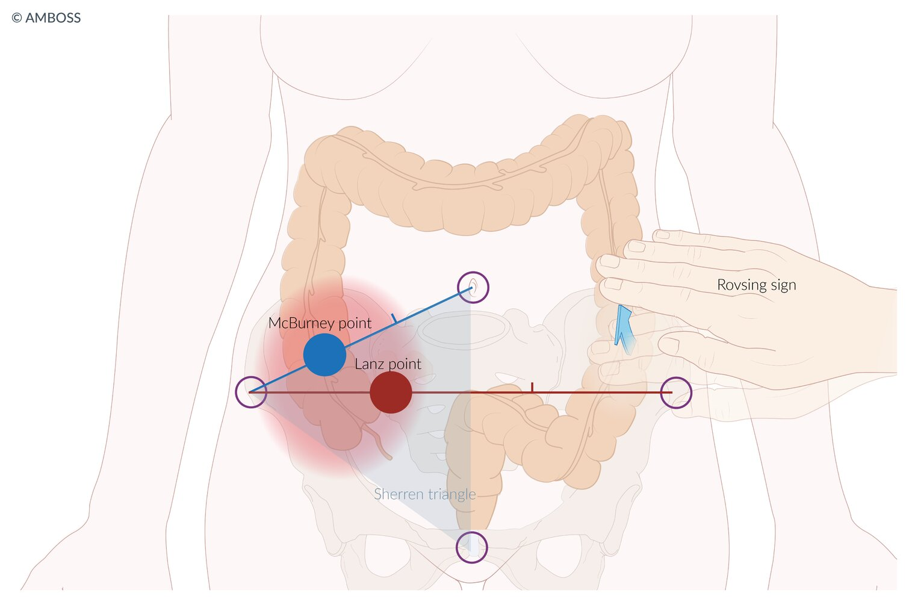

Signs of appendicitis

Examination of the Abdomen - Clinical Examination

---

## Management

The following recommendations apply to adult patients and are consistent with the 2020 World Society of Emergency <u>Surgery</u> (WSES) appendicitis guidelines, the 2018 American Association for the <u>Surgery</u> of Trauma (<u>AAST</u>) appendicitis guidelines, and the 2023 American College of Emergency Physicians (<u>ACEP</u>) clinical policy on acute appendicitis. See “Special patient groups” for modifications for pediatric, obstetric, and geriatric patients. [[10]](https://coursology-qbank.com/amboss/article/xtdEf70)[[11]](https://coursology-qbank.com/amboss/article/tgcXCb0)[[12]](https://coursology-qbank.com/amboss/article/HibKGt)

### Initial management [[10]](https://coursology-qbank.com/amboss/article/xtdEf70)[[11]](https://coursology-qbank.com/amboss/article/tgcXCb0)[[13]](https://coursology-qbank.com/amboss/article/SzYyH7)[[14]](https://coursology-qbank.com/amboss/article/7KY43J)

* Perform rapid clinical evaluation using <u>ABCDE approach</u>.

* Screen for <u>peritoneal signs</u> (e.g., due to <u>perforated appendix</u>) or <u>sepsis</u>.

* <u>Establish IV access</u> and obtain blood samples for <u>laboratory studies</u>.

* Provide <u>immediate hemodynamic support</u> if necessary.

* Keep patients <u>NPO</u> and initiate <u>supportive care</u>: e.g., <u>IV fluids</u>, <u>analgesia</u>, <u>antiemetics</u>

* Determine the likelihood of diagnosis based on a combination of:

* Patient demographics (e.g., age, sex)

* <u>Clinical features of appendicitis</u>

* Initial <u>laboratory studies</u> (see “Diagnostics”)

* <u>Appendicitis risk scores</u>, e.g., <u>AIR score</u>  [[10]](https://coursology-qbank.com/amboss/article/xtdEf70)[[11]](https://coursology-qbank.com/amboss/article/tgcXCb0)

* Proceed with subsequent management based on the likelihood of diagnosis.

### Subsequent management [[10]](https://coursology-qbank.com/amboss/article/xtdEf70)[[11]](https://coursology-qbank.com/amboss/article/tgcXCb0)[[13]](https://coursology-qbank.com/amboss/article/SzYyH7)[[14]](https://coursology-qbank.com/amboss/article/7KY43J)

Diagnostic imaging is often performed for most patients. A selective and individualized approach is generally recommended to minimize patient exposure to radiation and expedite care.  [[10]](https://coursology-qbank.com/amboss/article/xtdEf70)[[11]](https://coursology-qbank.com/amboss/article/tgcXCb0)[[15]](https://coursology-qbank.com/amboss/article/22bTSG)[[16]](https://coursology-qbank.com/amboss/article/wUbh2G)

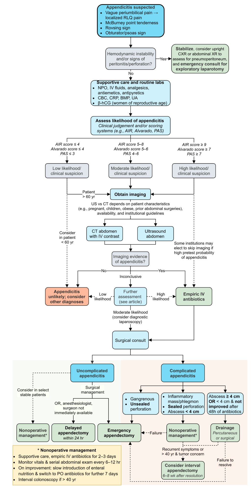

Management of appendicitis

#### Low likelihood of appendicitis

* Associated scores: <u>AIR score</u> ≤ 4, <u>Alvarado score</u> ≤ 2–4

* Management: Additional testing for appendicitis may not be required.   [[10]](https://coursology-qbank.com/amboss/article/xtdEf70)

* Consider other <u>differential diagnoses of acute abdominal pain</u>.

* Perform further <u>diagnostic workup of acute abdominal pain</u> as needed.

* Next steps: Determine disposition. [[11]](https://coursology-qbank.com/amboss/article/tgcXCb0)

* Consider discharge home with follow-up within 24 hours in select patients (e.g., motivated adults < 40 years old with clinical stability and no <u>red flags for abdominal pain</u>)  [[10]](https://coursology-qbank.com/amboss/article/xtdEf70)[[16]](https://coursology-qbank.com/amboss/article/wUbh2G)[[17]](https://coursology-qbank.com/amboss/article/SOcy7c0)

* Consider observation, reassessment (e.g., every 6–8 hours), and/or diagnostic imaging for:

* Suspected early appendicitis

* Unclear underlying cause of symptoms

* Older adults (e.g., ≥ 65 years old)  [[14]](https://coursology-qbank.com/amboss/article/7KY43J)[[18]](https://coursology-qbank.com/amboss/article/Dfb1oG)

> [!WARNING]
> A low <u>appendicitis risk score</u> alone is insufficient to exclude appendicitis in adults ≥ 65 years old with <u>RLQ</u> <u>pain</u>, who have a higher risk of serious underlying illness. These patients require a period of observation, at minimum, and a low threshold should be maintained for diagnostic imaging. [[19]](https://coursology-qbank.com/amboss/article/6I1jdR0)

#### Moderate likelihood of appendicitis

* Associated scores: <u>AIR score</u> ≤ 5–8, <u>Alvarado score</u> ≤ 5–6

* Management: confirmatory imaging required, e.g., <u>ultrasound</u> abdomen, CT abdomen (See “Diagnostics.”)

* Next steps

* Imaging confirms appendicitis: See “High likelihood of appendicitis”.

* Imaging is inconclusive or negative for appendicitis [[20]](https://coursology-qbank.com/amboss/article/3t0SW3)

* Low index of suspicion: See “Low likelihood of appendicitis.”

* High index of suspicion: Consult <u>surgery</u>.

* Consider admission, <u>serial abdominal examination</u>, and repeat imaging or <u>diagnostic laparoscopy</u>.  [[14]](https://coursology-qbank.com/amboss/article/7KY43J)[[20]](https://coursology-qbank.com/amboss/article/3t0SW3)[[21]](https://coursology-qbank.com/amboss/article/lTbvIG)[[22]](https://coursology-qbank.com/amboss/article/mTbVrG)

* Consider <u>empiric antibiotic therapy for acute appendicitis</u> (for at least 3 days). [[20]](https://coursology-qbank.com/amboss/article/3t0SW3)

#### High likelihood of appendicitis [[20]](https://coursology-qbank.com/amboss/article/3t0SW3)

* Associated scores: <u>AIR score</u> ≥ 9, <u>Alvarado score</u> ≥ 7–9

* Management: Urgent surgical consult for admission and definitive treatment required

* Begin <u>empiric antibiotic therapy for acute appendicitis</u>.

* Arrange preoperative CT abdomen as needed (e.g., for patients > 40 years old).  [[11]](https://coursology-qbank.com/amboss/article/tgcXCb0)

* Next steps

* <u>Laparoscopic</u> <u>appendectomy</u> within 24 hours for <u>uncomplicated appendicitis</u> (no <u>signs of sepsis</u> or <u>complicated appendicitis</u>)

* <u>Emergency appendectomy</u> for <u>complicated appendicitis</u> with systemic manifestations (e.g., generalized <u>peritonitis</u> or <u>sepsis</u>)

* <u>Nonoperative management of appendicitis</u>

* Recommended for <u>complicated appendicitis</u> with an appendiceal <u>phlegmon</u> or <u>appendiceal abscess</u>

* Consider in select patients who present with early <u>uncomplicated appendicitis</u> in close consultation with a <u>surgeon</u>.

---

## Risk stratification tools

These tools use clinical findings and <u>laboratory values</u> to estimate the <u>probability</u> of acute appendicitis and can help inform management in adults. The <u>pediatric appendicitis score</u> can be applied in children.  [[9]](https://coursology-qbank.com/amboss/article/69Yjor)[[10]](https://coursology-qbank.com/amboss/article/xtdEf70)[[11]](https://coursology-qbank.com/amboss/article/tgcXCb0)[[12]](https://coursology-qbank.com/amboss/article/HibKGt)[[16]](https://coursology-qbank.com/amboss/article/wUbh2G)

### <u>Appendicitis inflammatory response score</u> (AIR Score) [[9]](https://coursology-qbank.com/amboss/article/69Yjor)

* A relatively new scoring system that emphasizes laboratory parameters and graded clinical findings to provide a more objective clinical evaluation

* Provides a more accurate estimated likelihood of acute appendicitis than the Alvarado scoring system [[23]](https://coursology-qbank.com/amboss/article/i2bJhG)

|  Appendicitis inflammatory response score [[24]](https://coursology-qbank.com/amboss/article/8hbOft)  |  |  |  |
| --- | --- | --- | --- |
| Characteristics |  |  | Score |
| Symptoms | <u>Vomiting</u> |  | 1 |
|  <u>RLQ</u> <u>pain</u>  |  | 1 |  |
| <u>Physical examination</u> | <u>Rebound tenderness</u> | Mild | 1 |
| Moderate | 2 |  |  |
| Strong | 3 |  |  |
| Temperature ≥ 38.5°C (≥ 101.3°F)  |  | 1 |  |
| Laboratory parameters | <u>Leukocytosis</u> | 10,000–14,999 /mm³ | 1 |
| ≥ 15,000/mm³ | 2 |  |  |
| <u>PMN</u> | 70–84% | 1 |  |
| ≥ 85% | 2 |  |  |
| <u>CRP</u> | 1–4.9 mg/dL | 1 |  |
| ≥ 50 mg/L | 2 |  |  |
|  Likelihood of appendicitis   * ≤ 4: Low  * 5–8: Moderate  * ≥ 9: High     |  |  |  |

### <u>Alvarado score</u> (<u>MANTRELS</u>) [[9]](https://coursology-qbank.com/amboss/article/69Yjor)[[14]](https://coursology-qbank.com/amboss/article/7KY43J)[[16]](https://coursology-qbank.com/amboss/article/wUbh2G)[[25]](https://coursology-qbank.com/amboss/article/jeb_As)[[26]](https://coursology-qbank.com/amboss/article/thbXft)

* A 10-point scoring system that uses eight parameters to estimate the likelihood of appendicitis

* <u>Accuracy</u> is higher in young to middle-aged adults than in children < 10 years of age and adults > 60 years of age. [[27]](https://coursology-qbank.com/amboss/article/1Fd2S70)

|  Alvarado score (<u>MANTRELS</u>)[[28]](https://coursology-qbank.com/amboss/article/Fhbgft)  |  |  |
| --- | --- | --- |
| Characteristics |  | Score |
| Symptoms | Migration of <u>pain</u> to <u>RLQ</u> | 1 |
| Anorexia | 1 |  |
| Nausea and/or <u>vomiting</u> | 1 |  |
| <u>Physical examination</u> | Tenderness in <u>RLQ</u> | 2 |
| Rebound <u>pain</u> | 1 |  |
| Elevated temperature > 37.3°C (> 99.1°F) | 1 |  |
| Laboratory parameters | Leukocytosis (> 10,000/mm³) | 2 |
| Shift to the left and/or ≥ 75% <u>neutrophils</u> | 1 |  |
|  Likelihood of appendicitis   * ≤ 4: Low  [[16]](https://coursology-qbank.com/amboss/article/wUbh2G)  * 5–6: Moderate  * ≥ 7: High  [[16]](https://coursology-qbank.com/amboss/article/wUbh2G)     |  |  |

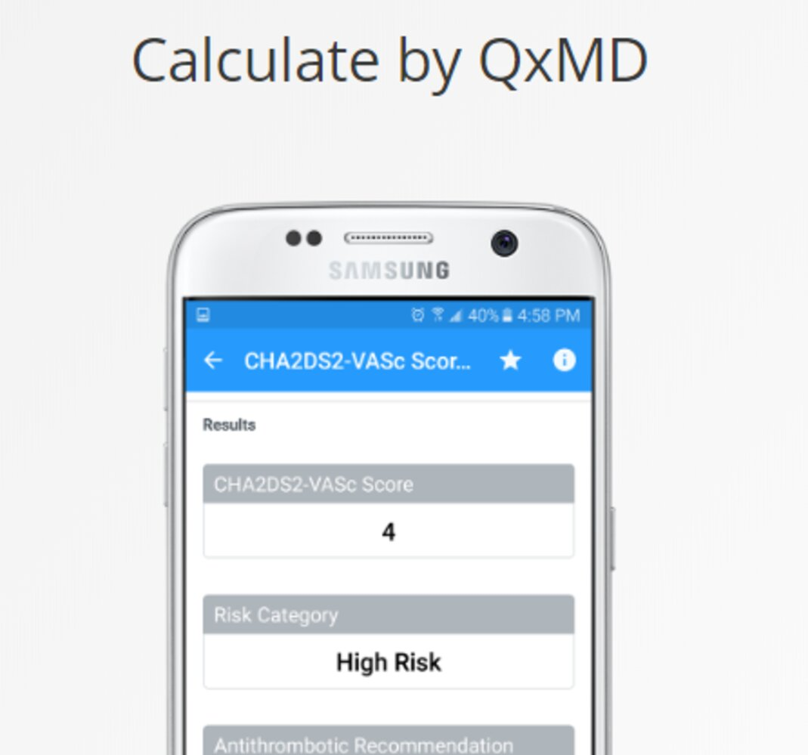

Alvarado Score for Acute Appendicitis

---

## Diagnosis

Acute appendicitis is usually a <u>clinical diagnosis</u> supported by laboratory findings (e.g., <u>leukocytosis</u> with <u>left shift</u>). Confirmatory imaging is recommended if the diagnosis is uncertain.

### <u>Laboratory studies</u> [[9]](https://coursology-qbank.com/amboss/article/69Yjor)

* Routine studies

* <u>CBC</u>: mild <u>leukocytosis</u> with <u>left shift</u>

* <u>CRP</u>: elevated (> 10 mg/L)

* <u>BMP</u>: ↑ <u>creatinine</u>, <u>electrolyte</u> abnormalities may be present in patients with severe <u>vomiting</u> and <u>diarrhea</u>

* <u>Urinalysis</u>: typically normal in appendicitis; possible findings of mild <u>pyuria</u> and/or <u>hematuria</u>

* Tests to evaluate differential diagnoses

* Urine/serum <u>β-hCG</u> test: perform in all women of reproductive age to rule out <u>pregnancy</u> (including <u>ectopic pregnancy</u>)  [[20]](https://coursology-qbank.com/amboss/article/3t0SW3)

* See also “Diagnostics workup of <u>acute abdominal pain</u>.”

> [!WARNING]
> A normal <u>WBC count</u> does not rule out acute appendicitis.

### Imaging [[9]](https://coursology-qbank.com/amboss/article/69Yjor)[[10]](https://coursology-qbank.com/amboss/article/xtdEf70)[[13]](https://coursology-qbank.com/amboss/article/SzYyH7)[[20]](https://coursology-qbank.com/amboss/article/3t0SW3)[[29]](https://coursology-qbank.com/amboss/article/s6YtmJ)

Decisions regarding the optimal timing and initial imaging modality should be based on individual patient factors (e.g., demographics, likelihood of appendicitis, risk of alternate diagnoses of concern, comorbidities), available resources, and local specialist preferences and hospital policy. [[10]](https://coursology-qbank.com/amboss/article/xtdEf70)[[11]](https://coursology-qbank.com/amboss/article/tgcXCb0)[[15]](https://coursology-qbank.com/amboss/article/22bTSG)[[16]](https://coursology-qbank.com/amboss/article/wUbh2G)

* Options for first-line imaging in nonpregnant adults   [[11]](https://coursology-qbank.com/amboss/article/tgcXCb0)[[12]](https://coursology-qbank.com/amboss/article/HibKGt)

* CT abdomen   [[12]](https://coursology-qbank.com/amboss/article/HibKGt)[[29]](https://coursology-qbank.com/amboss/article/s6YtmJ)

* Advantages: higher <u>accuracy</u> and reliability, allows operative planning, better evaluation of differential diagnoses (e.g., for patients > 60 years old)

* Limitations: exposure to <u>ionizing radiation</u> and risk of contrast-related <u>adverse events</u>

* <u>Ultrasound</u> abdomen (typically performed in conjunction with an <u>appendicitis scoring system</u>)  [[11]](https://coursology-qbank.com/amboss/article/tgcXCb0)[[16]](https://coursology-qbank.com/amboss/article/wUbh2G)

* Advantages: can limit the exposure to radiation and contrast, potentially reduce cost and length of stay (LOS) associated with CT use

* Limitations: lower <u>accuracy</u> and reliability , can increase cost and LOS if CT abdomen is still required  [[13]](https://coursology-qbank.com/amboss/article/SzYyH7)

* First-line imaging for pregnant adults and children: : <u>ultrasound</u> abdomen  [[10]](https://coursology-qbank.com/amboss/article/xtdEf70)[[11]](https://coursology-qbank.com/amboss/article/tgcXCb0)[[12]](https://coursology-qbank.com/amboss/article/HibKGt)

> [!TIP]
> The combined use of <u>appendicitis risk scores</u> and an initial <u>ultrasound</u> abdomen can reduce the need for CT abdomen in certain patients with suspected appendicitis, however, this should be balanced with the risk of missing the diagnosis. [[11]](https://coursology-qbank.com/amboss/article/tgcXCb0)[[16]](https://coursology-qbank.com/amboss/article/wUbh2G)[[17]](https://coursology-qbank.com/amboss/article/SOcy7c0)[[30]](https://coursology-qbank.com/amboss/article/dScoAb0)

#### Abdominal <u>ultrasound</u>

Many institutions prefer <u>ultrasound</u> as the initial imaging modality, reserving <u>CT scans</u> for inconclusive <u>ultrasound</u> findings.  [[11]](https://coursology-qbank.com/amboss/article/tgcXCb0)[[29]](https://coursology-qbank.com/amboss/article/s6YtmJ)

* Options

* <u>Formal ultrasound</u>

* <u>POCUS</u>  [[31]](https://coursology-qbank.com/amboss/article/VScGAb0)

* Supportive findings [[32]](https://coursology-qbank.com/amboss/article/I2bYQG)

* Distended <u>appendix</u> (diameter > 6 mm)

* Noncompressible, aperistaltic, distended <u>appendix</u>

* Target sign: concentric rings of hypo- and <u>hyperechogenicity</u> in the axial/transverse section of the <u>appendix</u>

* Possible <u>appendiceal fecalith</u>: focal <u>hyperechogenicity</u> with <u>posterior acoustic shadowing</u>

> [!WARNING]
> While abdominal <u>ultrasound</u> can confirm the diagnosis of acute appendicitis, normal <u>ultrasound</u> findings do not reliably rule out appendicitis. [[10]](https://coursology-qbank.com/amboss/article/xtdEf70)

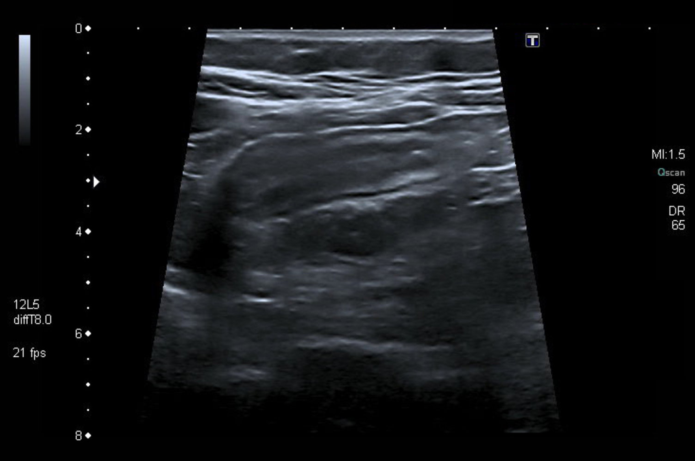

Acute appendicitis

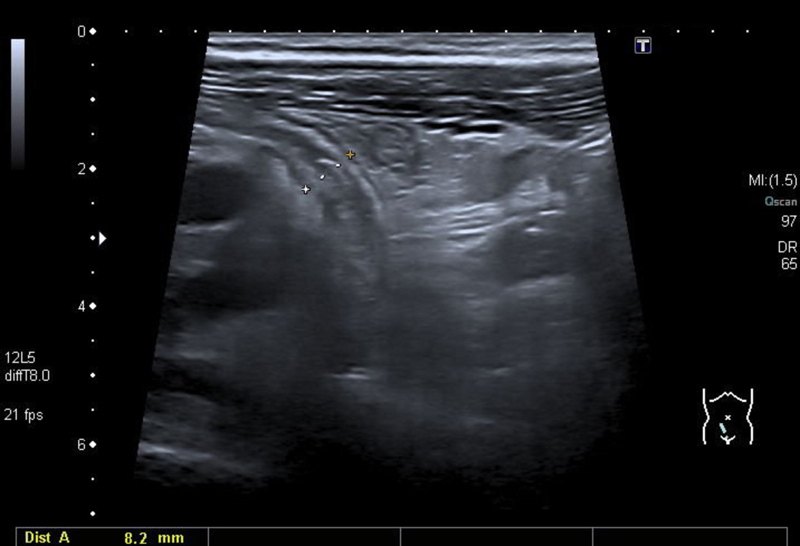

Acute appendicitis

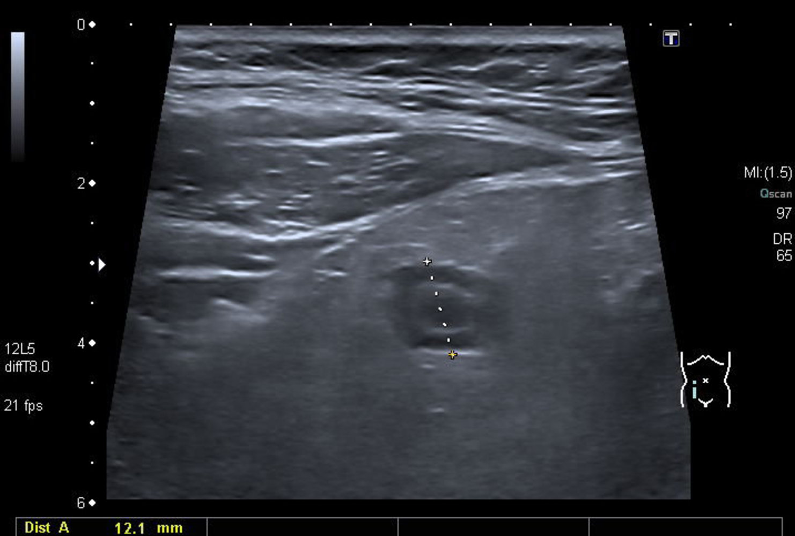

Appendicitis with target sign

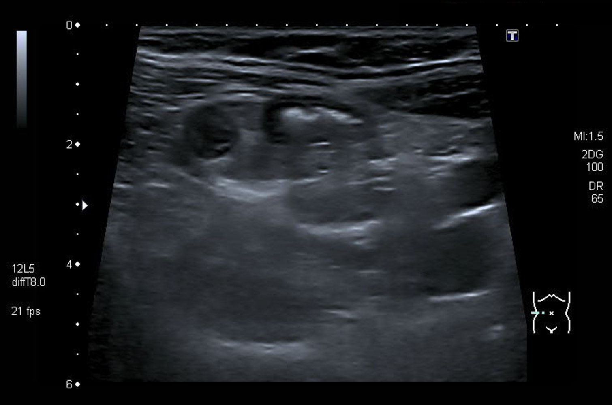

Appendicitis with target sign

#### CT abdomen with IV contrast

CT abdomen is the most accurate initial imaging modality for appendicitis.   [[12]](https://coursology-qbank.com/amboss/article/HibKGt)[[29]](https://coursology-qbank.com/amboss/article/s6YtmJ)

* Supportive findings [[29]](https://coursology-qbank.com/amboss/article/s6YtmJ)

* Distended <u>appendix</u> (diameter > 6 mm)

* <u>Edematous</u> <u>appendix</u> with periappendiceal <u>fat stranding</u>

* Possible <u>appendiceal fecalith</u>: focal <u>hyperdensity</u> within the appendiceal lumen

* Evidence of complications

* Additional considerations

* Consider low-dose <u>CT scan</u> (with IV contrast) to minimize radiation exposure.  [[33]](https://coursology-qbank.com/amboss/article/9UbN2G)[[34]](https://coursology-qbank.com/amboss/article/hOccHc0)

* Consider <u>CT without contrast</u> in patients with contrast <u>allergy</u>.  [[34]](https://coursology-qbank.com/amboss/article/hOccHc0)

> [!WARNING]
> Adding oral and/or rectal contrast does not improve diagnostic <u>accuracy</u> and may delay diagnosis. [[10]](https://coursology-qbank.com/amboss/article/xtdEf70)

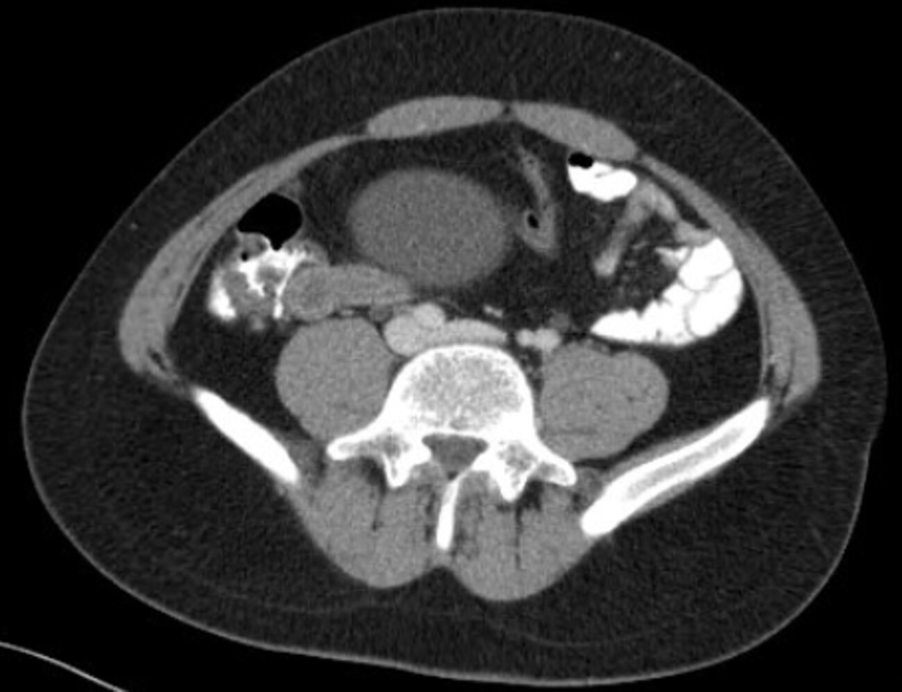

Appendicitis

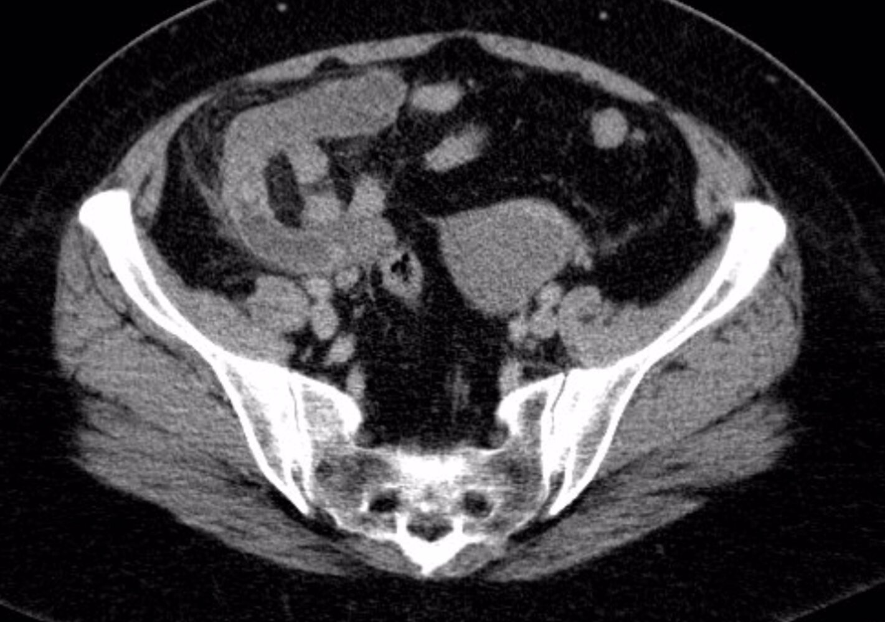

Appendicitis

Appendiceal abscess

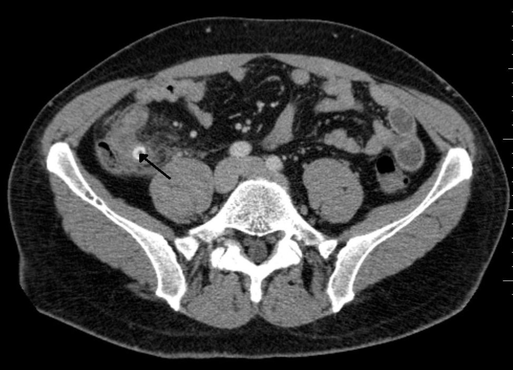

Perforated appendicitis due to fecalith

#### <u>MRI</u> abdomen and <u>pelvis</u> [[14]](https://coursology-qbank.com/amboss/article/7KY43J)[[29]](https://coursology-qbank.com/amboss/article/s6YtmJ)[[35]](https://coursology-qbank.com/amboss/article/iTbJqG)

* Indications

* <u>MRI</u> without IV contrast: pregnant patients with inconclusive <u>ultrasound</u> findings [[29]](https://coursology-qbank.com/amboss/article/s6YtmJ)[[35]](https://coursology-qbank.com/amboss/article/iTbJqG)

* <u>MRI</u> with IV contrast: nonpregnant patients with inconclusive <u>ultrasound</u> findings and <u>contraindications for CT</u> scan

* Findings: similar to <u>CT scan</u> findings

> [!WARNING]
> A normal <u>MRI</u> in a pregnant patient does not completely rule out the possibility of acute appendicitis. Consider <u>diagnostic laparoscopy</u> if clinical suspicion remains high. [[11]](https://coursology-qbank.com/amboss/article/tgcXCb0)

### <u>Diagnostic laparoscopy</u>

* Indications: Consider in the following groups of patients with inconclusive findings on imaging. [[14]](https://coursology-qbank.com/amboss/article/7KY43J)[[20]](https://coursology-qbank.com/amboss/article/3t0SW3)[[21]](https://coursology-qbank.com/amboss/article/lTbvIG)

* Women of reproductive age

* Patients with <u>obesity</u>

* Findings [[36]](https://coursology-qbank.com/amboss/article/5TbirG)

* Acute <u>uncomplicated appendicitis</u>: inflamed, distended, <u>erythematous</u> <u>appendix</u>

* Possible signs of complications: perforation, <u>gangrene</u>, <u>pus</u>

* Additional steps based on findings [[22]](https://coursology-qbank.com/amboss/article/mTbVrG)[[37]](https://coursology-qbank.com/amboss/article/NTb-IG)

* Normal <u>appendix</u> on <u>diagnostic laparoscopy</u>: Leave in situ.

* Appendicitis confirmed: Perform <u>laparoscopic</u> <u>appendectomy</u>.

---

## Treatment

### <u>Supportive care</u>

* Bowel rest (<u>NPO</u>)

* <u>Intravenous fluids</u> (see “<u>IV fluid therapy</u>”)

* <u>Electrolyte repletion</u> as needed

* IV <u>analgesics</u> (see “<u>Pain management</u>”)  [[9]](https://coursology-qbank.com/amboss/article/69Yjor)

* IV <u>antiemetics</u> as needed

* <u>Antipyretic therapy</u>

### Empiric antibiotic therapy for acute appendicitis [[13]](https://coursology-qbank.com/amboss/article/SzYyH7)[[20]](https://coursology-qbank.com/amboss/article/3t0SW3)[[38]](https://coursology-qbank.com/amboss/article/w6YhMJ)[[39]](https://coursology-qbank.com/amboss/article/v9YA6r)

* Indication: all patients with acute appendicitis

* Required coverage: : against gram-negative and anaerobic organisms [[20]](https://coursology-qbank.com/amboss/article/3t0SW3)

* Preoperative <u>antibiotics</u> for <u>uncomplicated appendicitis</u>: Administer one of the following agents within 60 minutes before <u>surgery</u> as prophylaxis against <u>surgical site infection</u> (can be discontinued after <u>surgery</u> or within 24 hours). [[14]](https://coursology-qbank.com/amboss/article/7KY43J)[[20]](https://coursology-qbank.com/amboss/article/3t0SW3)[[39]](https://coursology-qbank.com/amboss/article/v9YA6r)

* A <u>cephalosporin</u> with anaerobic coverage: <u>cefoxitin</u> DOSAGE OR <u>cefotetan</u> DOSAGE

* Combination therapy with a first-generation <u>cephalosporin</u> (e.g., <u>cefazolin</u> ; DOSAGE) PLUS <u>metronidazole</u> DOSAGE [[39]](https://coursology-qbank.com/amboss/article/v9YA6r)

* In patients allergic to <u>penicillin</u>/<u>cephalosporin</u>, administer <u>clindamycin</u> DOSAGE OR <u>metronidazole</u> DOSAGE PLUS one of the following: [[39]](https://coursology-qbank.com/amboss/article/v9YA6r)

* High-dose <u>gentamicin</u> DOSAGE

* <u>Ciprofloxacin</u> DOSAGE

* <u>Nonoperative management for appendicitis</u> (with or without <u>interval appendectomy</u>)

* Agents: See ''Mild or moderate infection'' in “<u>Empiric antibiotic therapy for intraabdominal infections</u>.” [[20]](https://coursology-qbank.com/amboss/article/3t0SW3)

* Duration for early <u>uncomplicated appendicitis</u> (not yet standardized): Consider initial parenteral <u>antibiotics</u> for at least 2–3 days then switch to oral <u>antibiotics</u> for 7 days.  [[35]](https://coursology-qbank.com/amboss/article/iTbJqG)[[40]](https://coursology-qbank.com/amboss/article/RTblqG)

* Duration for <u>complicated appendicitis</u> (<u>appendiceal mass</u> or <u>appendiceal abscess</u>): 3–5 days  [[14]](https://coursology-qbank.com/amboss/article/7KY43J)[[35]](https://coursology-qbank.com/amboss/article/iTbJqG)[[41]](https://coursology-qbank.com/amboss/article/cTbapG)[[42]](https://coursology-qbank.com/amboss/article/1Tb2pG)

### Operative management

#### Appendectomy [[13]](https://coursology-qbank.com/amboss/article/SzYyH7)[[14]](https://coursology-qbank.com/amboss/article/7KY43J)[[20]](https://coursology-qbank.com/amboss/article/3t0SW3)[[35]](https://coursology-qbank.com/amboss/article/iTbJqG)[[43]](https://coursology-qbank.com/amboss/article/VTbGpG)

<u>Appendectomy</u> within 24 hours of diagnosis is the current <u>standard of care</u> for acute <u>uncomplicated appendicitis</u>.  [[11]](https://coursology-qbank.com/amboss/article/tgcXCb0)[[11]](https://coursology-qbank.com/amboss/article/tgcXCb0)[[35]](https://coursology-qbank.com/amboss/article/iTbJqG)[[43]](https://coursology-qbank.com/amboss/article/VTbGpG)[[44]](https://coursology-qbank.com/amboss/article/WgbP8G)

* Definition: surgical removal of the <u>appendix</u>, usually within 24 hours of the diagnosis  [[11]](https://coursology-qbank.com/amboss/article/tgcXCb0)

* Emergency appendectomy  [[11]](https://coursology-qbank.com/amboss/article/tgcXCb0)

* Timing: less than 8 hours after diagnosis

* Indications: systemic manifestations resulting from <u>complicated appendicitis</u> (e.g., <u>sepsis</u>, generalized <u>peritonitis</u>) [[11]](https://coursology-qbank.com/amboss/article/tgcXCb0)[[35]](https://coursology-qbank.com/amboss/article/iTbJqG)

* <u>Relative contraindications</u>  [[35]](https://coursology-qbank.com/amboss/article/iTbJqG)[[45]](https://coursology-qbank.com/amboss/article/WTbPpG)

* <u>Appendiceal mass</u>

* <u>Appendicular abscess</u>

* Approach [[35]](https://coursology-qbank.com/amboss/article/iTbJqG)

* <u>Laparoscopic</u> <u>appendectomy</u>

* Open <u>appendectomy</u> (via a transabdominal <u>incision</u> in the <u>RLQ</u>)

> [!TIP]
> <u>Surgery</u> for acute <u>uncomplicated appendicitis</u> can safely be delayed for up to 24 hours from diagnosis.

> [!WARNING]
> Perform an <u>emergency appendectomy</u> for patients with <u>complicated appendicitis</u> and systemic symptoms. [[11]](https://coursology-qbank.com/amboss/article/tgcXCb0)

> [!WARNING]
> Initial operative treatment of appendiceal <u>abscesses</u> or appendiceal <u>phlegmons</u> is associated with a high risk of complications. [[46]](https://coursology-qbank.com/amboss/article/G6YBmJ)

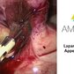

Laparoskopische Appendektomie - Chirurgie - AMBOSS Video

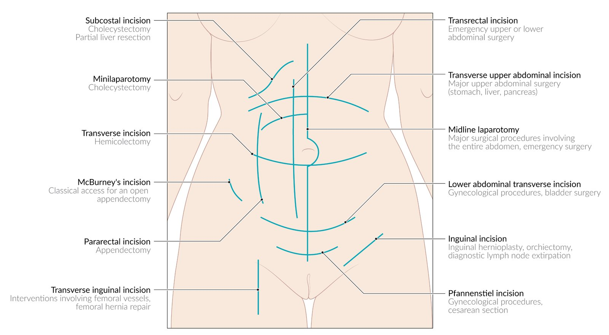

Important abdominal and inguinal incision sites and potential indications

#### Interval appendectomy [[14]](https://coursology-qbank.com/amboss/article/7KY43J)[[35]](https://coursology-qbank.com/amboss/article/iTbJqG)[[47]](https://coursology-qbank.com/amboss/article/p9YLor)[[48]](https://coursology-qbank.com/amboss/article/_db5ss)[[49]](https://coursology-qbank.com/amboss/article/TzY6H7)

Typically performed after a trial of <u>nonoperative management for appendicitis</u>.

* Definition: <u>appendectomy</u> performed 6–8 weeks following the resolution of an acute episode of <u>appendiceal mass</u> or <u>appendiceal abscess</u> to minimize surgical complications  [[49]](https://coursology-qbank.com/amboss/article/TzY6H7)

* Indications: currently not routinely recommended ;  [[14]](https://coursology-qbank.com/amboss/article/7KY43J)[[47]](https://coursology-qbank.com/amboss/article/p9YLor)

* Consider for persistent or recurrent symptoms of appendicitis in a patient with an <u>appendiceal mass</u> or <u>appendiceal abscess</u> <u>treated conservatively</u>. [[14]](https://coursology-qbank.com/amboss/article/7KY43J)[[35]](https://coursology-qbank.com/amboss/article/iTbJqG)[[45]](https://coursology-qbank.com/amboss/article/WTbPpG)

* Consider in patients > 40 years of age if there is concern for an underlying <u>appendiceal tumor</u>.  [[50]](https://coursology-qbank.com/amboss/article/4Tb3IG)[[51]](https://coursology-qbank.com/amboss/article/kTbmIG)

---

## Nonoperative management

Nonoperative management (NOM; <u>conservative management</u>) is typically preferred for patients at high risk of surgical <u>morbidity</u> if operated on immediately. It is sometimes followed by an <u>interval appendectomy</u>. NOM can also be offered to select patients with early <u>uncomplicated appendicitis</u> in consultation with an experienced <u>surgeon</u>, however, this remains an area of ongoing research.  [[11]](https://coursology-qbank.com/amboss/article/tgcXCb0)[[12]](https://coursology-qbank.com/amboss/article/HibKGt)[[35]](https://coursology-qbank.com/amboss/article/iTbJqG)[[47]](https://coursology-qbank.com/amboss/article/p9YLor)

### Indications [[14]](https://coursology-qbank.com/amboss/article/7KY43J)[[20]](https://coursology-qbank.com/amboss/article/3t0SW3)[[40]](https://coursology-qbank.com/amboss/article/RTblqG)[[47]](https://coursology-qbank.com/amboss/article/p9YLor)

* <u>Inflammatory appendiceal mass</u>  [[35]](https://coursology-qbank.com/amboss/article/iTbJqG)[[45]](https://coursology-qbank.com/amboss/article/WTbPpG)

* <u>Appendiceal abscess</u>  [[35]](https://coursology-qbank.com/amboss/article/iTbJqG)[[45]](https://coursology-qbank.com/amboss/article/WTbPpG)

* Patient refusal of <u>surgery</u>

* High surgical risk due to comorbidities

* History of previous surgical/anesthesia complications

* Consider in select patients with early <u>uncomplicated appendicitis</u> [[11]](https://coursology-qbank.com/amboss/article/tgcXCb0)[[12]](https://coursology-qbank.com/amboss/article/HibKGt)

### Contraindications  [[35]](https://coursology-qbank.com/amboss/article/iTbJqG)[[40]](https://coursology-qbank.com/amboss/article/RTblqG)

* <u>Septic shock</u>

* Generalized <u>peritonitis</u>

* Inability to percutaneously drain an <u>appendiceal abscess</u>

* <u>Appendiceal fecalith</u>  [[52]](https://coursology-qbank.com/amboss/article/VgbG8G)[[53]](https://coursology-qbank.com/amboss/article/egbx8G)

### Steps of nonoperative management [[20]](https://coursology-qbank.com/amboss/article/3t0SW3)[[40]](https://coursology-qbank.com/amboss/article/RTblqG)

* Empiric parenteral <u>antibiotic therapy</u> for 2–3 days: See ''Mild or moderate infection'' under ''<u>Community-acquired infections</u>'' in <u>empiric antibiotic therapy for intraabdominal infections</u>. [[20]](https://coursology-qbank.com/amboss/article/3t0SW3)[[35]](https://coursology-qbank.com/amboss/article/iTbJqG)[[40]](https://coursology-qbank.com/amboss/article/RTblqG)

* <u>Supportive care</u> (see above)

* <u>Periappendiceal abscess</u> > 4 cm: <u>image-guided percutaneous drainage</u>; send <u>aspirate</u> for cultures

* Monitor <u>vitals</u> and <u>serial abdominal examinations</u> every 6–12 hours.

* Insignificant improvement/worsening of symptoms : urgent surgical intervention  [[35]](https://coursology-qbank.com/amboss/article/iTbJqG)

* Symptomatic improvement within 24–48 hours

* Slow introduction of <u>enteral nutrition</u>

* Switch to oral <u>antibiotics</u> for 7-day course.  [[35]](https://coursology-qbank.com/amboss/article/iTbJqG)[[40]](https://coursology-qbank.com/amboss/article/RTblqG)

* Schedule interval <u>colonoscopy</u> in patients > 40 years of age following NOM of acute appendicitis to rule out early <u>colonic</u> <u>malignancy</u>. [[14]](https://coursology-qbank.com/amboss/article/7KY43J)[[45]](https://coursology-qbank.com/amboss/article/WTbPpG)[[54]](https://coursology-qbank.com/amboss/article/Efb8LG)

> [!NOTE]
> PAIN: Pain management, Antibiotics, Intravenous <u>fluid therapy</u>, and NPO are part of conservative <u>management of appendicitis</u>.

---

## Pathology

* The <u>appendix</u> is composed of the same four histological <u>layers of the alimentary canal</u>.

* See “Microscopic anatomy” in “<u>Large intestine</u>” for the histological features of a healthy <u>appendix</u>.

* <u>Transmural</u> neutrophilic infiltration is the characteristic histological feature of acute appendicitis.

* Blood vessel <u>thrombosis</u>, <u>mucosal</u> <u>ulceration</u>, and/or <u>gangrene</u> of the appendiceal wall may also be present.

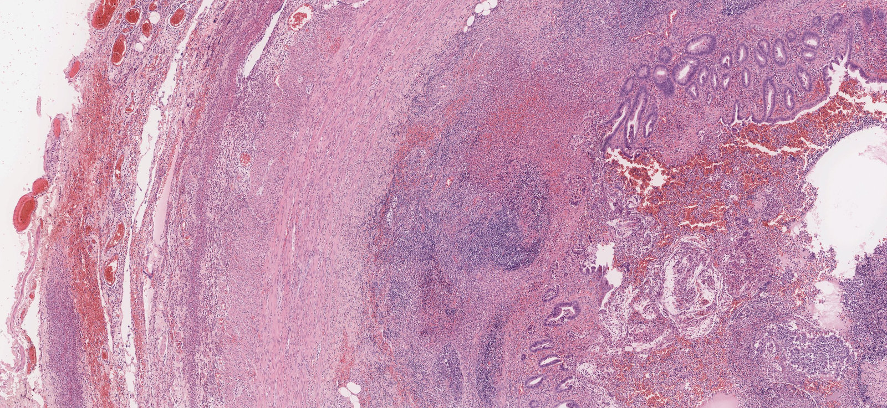

Appendicitis with ulceration

---

## Differential diagnoses

* <u>Ectopic pregnancy</u>

* <u>Pseudoappendicitis</u> [[59]](https://coursology-qbank.com/amboss/article/nR07nf)

* <u>Meckel diverticulum</u>

* <u>Diverticulitis</u> (especially in elderly patients)

* <u>Psoas abscess</u> (in patients with a positive <u>psoas sign</u>)

* <u>Inflammatory bowel disease</u>

* <u>Appendiceal diverticulitis</u>

* <u>Gastroenteritis</u>

* <u>Colon cancer</u>

* <u>Urolithiasis</u> and <u>renal colic</u>

* <u>Urinary tract infections</u>

* Gynecological diseases (e.g., <u>pelvic inflammatory disease</u>, <u>ovarian cyst</u>)

* See “<u>Differential diagnoses of acute abdomen</u>.”

> [!TIP]
> Right-sided <u>carcinoma</u> of the <u>colon</u> may manifest with clinical features similar to those of acute appendicitis. [[60]](https://coursology-qbank.com/amboss/article/LR0wnf)

References:[[59]](https://coursology-qbank.com/amboss/article/nR07nf)

### Appendiceal diverticulitis [[57]](https://coursology-qbank.com/amboss/article/11V2ft0)[[58]](https://coursology-qbank.com/amboss/article/W1VPft0)

* Definition: inflammation of one or more appendiceal <u>diverticula</u>

* <u>Epidemiology</u>

* Identified in up to 2% of <u>appendectomy</u> specimens

* Typically manifests after 30 years of age

* <u>♂</u> > <u>♀</u>

* Etiology

* Acquired lesions: likely due to orifice obstruction and increased intraluminal pressure, causing <u>mucosal prolapse</u> through a muscular defect

* May arise in areas of residual wall <u>weakness</u> after prior appendicitis

* Congenital <u>diverticula</u> are rare.

* Clinical features

* Insidious, intermittent right-lower-quadrant <u>pain</u> (patients may report similar prior episodes)

* Low-grade <u>fever</u>, <u>anorexia</u>, <u>constipation</u>, <u>nausea</u>

* Higher risk of perforation than classic appendicitis

* Diagnosis

* ↑ <u>WBC</u>

* ↑ <u>CRP</u>

* <u>Cross-sectional imaging</u> (e.g., <u>CECT</u>) may show <u>diverticula</u>, appendiceal wall thickening, or peridiverticulitis.

* <u>Histopathology</u> confirms <u>diverticulitis</u> and distinguishes it from true appendicitis.

* Treatment

* <u>Appendectomy</u> is the treatment of choice.

* Provide <u>empiric antibiotic therapy for acute appendicitis</u>.

> [!TIP]
> Although rare, <u>appendiceal diverticulitis</u> has a markedly increased risk of perforation (30–70%) and higher <u>morbidity</u> and mortality compared to acute appendicitis. [[58]](https://coursology-qbank.com/amboss/article/W1VPft0)

The differential diagnoses listed here are not exhaustive.

---

## Complications

### Inflammatory appendiceal mass (appendiceal <u>phlegmon</u>) [[35]](https://coursology-qbank.com/amboss/article/iTbJqG)[[45]](https://coursology-qbank.com/amboss/article/WTbPpG)

* Description: an ill-defined mass of inflammatory periappendiceal tissue

* Clinical features: manifests as a tender mass in the <u>RLQ</u>

* Treatment

* <u>Nonoperative management of acute appendicitis</u>  (see ''Treatment'' above for more information)

* Consider <u>interval appendectomy</u>.  [[20]](https://coursology-qbank.com/amboss/article/3t0SW3)[[35]](https://coursology-qbank.com/amboss/article/iTbJqG)[[45]](https://coursology-qbank.com/amboss/article/WTbPpG)

### Appendiceal abscess [[20]](https://coursology-qbank.com/amboss/article/3t0SW3)[[35]](https://coursology-qbank.com/amboss/article/iTbJqG)[[45]](https://coursology-qbank.com/amboss/article/WTbPpG)

* Description: a localized collection of <u>pus</u> and <u>necrotic</u> tissue that forms around an inflamed <u>appendix</u>, which typically follows an untreated <u>perforated appendix</u>

* Clinical features: manifests as a tender mass in the <u>RLQ</u> in an acutely ill patient (i.e., high-grade <u>fever</u>, possible <u>paralytic ileus</u>, <u>leukocytosis</u>, <u>signs of sepsis</u>)

* Treatment

* <u>Nonoperative management of acute appendicitis</u>

* <u>Abscess</u> < 4 cm: <u>antibiotic therapy</u> alone is usually sufficient.

* <u>Abscess</u> > 4 cm: image-guided percutaneous drainage or surgical drainage; send <u>aspirate</u> for cultures  [[45]](https://coursology-qbank.com/amboss/article/WTbPpG)[[61]](https://coursology-qbank.com/amboss/article/zKYrQJ)

* Consider <u>interval appendectomy</u>.  [[20]](https://coursology-qbank.com/amboss/article/3t0SW3)[[35]](https://coursology-qbank.com/amboss/article/iTbJqG)[[45]](https://coursology-qbank.com/amboss/article/WTbPpG)

### Gangrenous appendicitis

* Description: irreversible <u>necrosis</u> of the appendiceal wall

* Clinical features

* Manifests with high-grade <u>fever</u>, <u>tachycardia</u>, severe <u>RLQ</u> <u>pain</u> and tenderness

* Typically diagnosed intraoperatively: The <u>appendix</u> has a mottled purple appearance.

* Treatment: <u>emergency appendectomy</u> and IV <u>antibiotics</u>

### Perforated appendix [[35]](https://coursology-qbank.com/amboss/article/iTbJqG)

* Description: rupture of the <u>appendix</u>

* Clinical features

* Early presentation: localized/generalized <u>peritonitis</u> and decreased <u>bowel sounds</u>

* Generalized <u>peritonitis</u> indicates a free rupture of the <u>appendix</u> into the <u>peritoneal cavity</u>.

* Localized <u>peritonitis</u> suggests a concealed perforation.

* Delayed presentation: <u>appendiceal mass</u> or <u>appendiceal abscess</u>

* Treatment

* Early presentation

* <u>Emergency appendectomy</u> and IV <u>antibiotics</u>

* Obtain <u>pus</u> or <u>exudate</u> for cultures intraoperatively. [[20]](https://coursology-qbank.com/amboss/article/3t0SW3)

* Tailor <u>antibiotics</u> accordingly.

* Delayed presentation: See “<u>Appendiceal mass</u>” and “<u>Appendiceal abscess</u>.”

### Pylephlebitis [[62]](https://coursology-qbank.com/amboss/article/HhbK2t)

* Description: <u>septic</u> <u>thrombosis</u> of the <u>portal vein</u> or its branches

* Etiology: a complication of intraabdominal <u>sepsis</u> (e.g., due to <u>perforated appendicitis</u>, <u>diverticulitis</u>, or <u>necrotizing pancreatitis</u>)

* Clinical features: <u>fever</u>, abdominal <u>pain</u>

* Diagnostics

* CT: filling defect in the <u>portal vein</u> or its branches

* <u>Bacteremia</u>

* Treatment: broad-spectrum <u>antibiotics</u>

* Prognosis: <u>Thrombosis</u> of the portal circulation can result in <u>bowel infarction</u> and <u>death</u>.

We list the most important complications. The selection is not exhaustive.

---

## Special patient groups

### Appendicitis in children [[9]](https://coursology-qbank.com/amboss/article/69Yjor)[[63]](https://coursology-qbank.com/amboss/article/izYJs7)

#### Clinical features

* The reliability of signs and symptoms in children is lower.

* Most reliable symptoms: emesis and duration of <u>pain</u>, abdominal tenderness and <u>pain</u> with walking, jumping, and <u>coughing</u>

#### Diagnostics [[11]](https://coursology-qbank.com/amboss/article/tgcXCb0)

* Routinely obtain <u>laboratory studies</u>; initial <u>CRP</u> ≥ 10 mg/dL and <u>WBC count</u> > 16,000/mm³ strongly predict appendicitis.

* Consider either of the following clinical risk scores:

* <u>Alvarado score</u>

* <u>Pediatric appendicitis score</u>: A scoring system to estimate the likelihood of appendicitis in patients 3–18 years of age [[64]](https://coursology-qbank.com/amboss/article/f2bkSG)[[65]](https://coursology-qbank.com/amboss/article/uhbpft)

* <u>Ultrasound</u> is the diagnostic procedure of choice.

|  Pediatric appendicitis score [[64]](https://coursology-qbank.com/amboss/article/f2bkSG)  |  |  |
| --- | --- | --- |
| Characteristics |  | Score |
| Symptoms | Migration of <u>pain</u> to <u>RLQ</u>  | 1 |
| <u>Anorexia</u> | 1 |  |
|  <u>Nausea</u>/<u>vomiting</u>  | 1 |  |
| <u>Physical examination</u> |  <u>RLQ</u> tenderness  | 2 |
|  <u>RLQ</u> <u>pain</u> elicited on <u>coughing</u>/jumping/percussion | 2 |  |
| Temperature ≥ 38°C (≥ 100.4°F)  | 1 |  |
| Laboratory parameters |  <u>Leukocytosis</u> (≥ 10,000/mm³) | 1 |
|  <u>PMN</u> ≥ 75%  | 1 |  |
|  Likelihood of appendicitis  [[15]](https://coursology-qbank.com/amboss/article/22bTSG)   * ≤ 3: Low  * 4–6: Moderate  * ≥ 7: High     |  |  |

> [!WARNING]
> The diagnosis should not be based solely on the clinical score in children. [[11]](https://coursology-qbank.com/amboss/article/tgcXCb0)

#### Treatment [[9]](https://coursology-qbank.com/amboss/article/69Yjor)

* All patients: Provide <u>empiric antibiotic therapy for acute appendicitis</u> and <u>supportive care</u>.

* Operative treatment: See “<u>Appendectomy</u>.”

* Nonoperative treatment

* May be considered in consultation with a <u>surgeon</u> for patients with <u>uncomplicated appendicitis</u>  [[66]](https://coursology-qbank.com/amboss/article/iFdJ370)

* See “<u>Nonoperative management of acute appendicitis</u>.”

### Appendicitis in pregnant individuals [[9]](https://coursology-qbank.com/amboss/article/69Yjor)[[67]](https://coursology-qbank.com/amboss/article/JR0sLf)

#### Clinical features

Appendicitis often manifests atypically in pregnant individuals, potentially delaying diagnosis.

* Atypical (higher) <u>pain</u> localization

* Other possible symptoms include <u>heartburn</u>, flatulence, irregular bowel movements, <u>diarrhea</u>, <u>urinary frequency</u>, and <u>pain</u> on <u>Douglas pouch</u> palpation.

#### Diagnostics

* <u>Laboratory studies</u>: Results may be misleading due to physiological changes in <u>pregnancy</u>.

* Graded compression ultrasonography

* An <u>ultrasonographic</u> technique in which the transducer is used to gradually compress the abdominal wall, which displaces the bowel to better visualize intraabdominal structures.

* Can be used to diagnose <u>appendicitis in children</u> and pregnant individuals.

* If <u>ultrasonography</u> is inconclusive, consider <u>MRI</u>.

#### Treatment

Treatment consists of prompt <u>laparoscopic</u> or open <u>appendectomy</u>.

* Delayed intervention (> 24 hours) after symptom onset is associated with a higher risk of perforation.

* <u>Laparoscopic</u> approach is safe and can be performed in all trimesters.  [[68]](https://coursology-qbank.com/amboss/article/jn1_Gh0)

* Perioperative <u>antibiotics</u> with proven coverage of gram-negative and <u>anaerobic bacteria</u>

#### Complications

* Maternal: <u>cervical incompetence</u>, <u>vaginitis</u>, <u>vulvovaginitis</u>, <u>sepsis</u>

* Fetal: <u>small for gestational age</u>, <u>low birth weight</u>

* A <u>perforated appendix</u> is associated with a higher risk of <u>preterm labor</u> and <u>pregnancy loss</u>.

### Appendicitis in adults > 65 years of age [[11]](https://coursology-qbank.com/amboss/article/tgcXCb0)[[69]](https://coursology-qbank.com/amboss/article/pI1LdR0)

Management is broadly the same as for the general adult population, with some modifications. Diagnostic approach to undifferentiated <u>acute abdominal pain in older adults</u> is detailed separately.

#### Clinical features [[19]](https://coursology-qbank.com/amboss/article/6I1jdR0)

The presentation of appendicitis in older adults is often atypical (see “Clinical features of <u>acute abdomen in older adults</u>.”)

* <u>Fever</u> may be absent or low-grade.

* <u>Nausea</u> may be absent.

* Nonspecific symptoms such as confusion may be present.

* <u>RLQ</u> <u>pain</u> is typically present, but:

* <u>Abdominal guarding</u> may be subtle.

* <u>Rebound tenderness</u> may be absent.

#### Management [[11]](https://coursology-qbank.com/amboss/article/tgcXCb0)[[69]](https://coursology-qbank.com/amboss/article/pI1LdR0)

##### Initial management

* Provide immediate <u>supportive care</u> as necessary (see “Management” above).

* <u>Risk stratification tools for acute appendicitis</u>

* In older adults, a low score should not be used to support immediate discharge without observation.  [[69]](https://coursology-qbank.com/amboss/article/pI1LdR0)

* The following strategy has been suggested:

* Low likelihood score (e.g., <u>Alvarado score</u> < 5): Observe clinically and reassess; consider CT abdomen and <u>pelvis</u> with IV contrast if no improvement.

* Moderate or high likelihood score (e.g., <u>Alvarado score</u> ≥ 5): Obtain immediate imaging.

> [!TIP]
> In older adults, consider the possibility of other conditions masquerading as acute appendicitis (e.g., <u>colon carcinoma</u>, appendiceal tumors) or other serious causes of <u>acute abdominal pain</u> (e.g., <u>diverticulitis</u>, <u>bowel obstruction</u>). [[19]](https://coursology-qbank.com/amboss/article/6I1jdR0)[[70]](https://coursology-qbank.com/amboss/article/ElW8Al0)

> [!WARNING]
> Do not discharge older adults home without observation based only on a low <u>appendicitis risk score</u>. [[69]](https://coursology-qbank.com/amboss/article/pI1LdR0)

##### Imaging [[71]](https://coursology-qbank.com/amboss/article/WA1Pij0)

In older adults, imaging is required to confirm a diagnosis of appendicitis.

* CT abdomen and <u>pelvis</u> with IV contrast is the preferred study.

* In patients with <u>contraindications for iodinated IV contrast</u> and <u>Alvarado score</u> ≥ 5, consider either of the following. [[19]](https://coursology-qbank.com/amboss/article/6I1jdR0)

* Abdominal <u>ultrasound</u>: to confirm (but not to exclude) appendicitis

* <u>MRI</u> abdomen and <u>pelvis</u>: to confirm or exclude appendicitis, and to identify <u>perforated appendix</u>

* See “Diagnostics” for details on the advantages and disadvantages of various imaging modalities.

##### Treatment

* All patients: Provide <u>empiric antibiotic therapy for acute appendicitis</u> and <u>supportive care</u>.

* Nonoperative treatment

* Consider for select patients in consultation with a <u>surgeon</u>.  [[69]](https://coursology-qbank.com/amboss/article/pI1LdR0)

* See “<u>Nonoperative management of acute appendicitis</u>” for indications.

* Operative treatment

* <u>Laparoscopic</u> <u>appendectomy</u> within 24 hours is generally preferred.  [[11]](https://coursology-qbank.com/amboss/article/tgcXCb0)[[12]](https://coursology-qbank.com/amboss/article/HibKGt)[[72]](https://coursology-qbank.com/amboss/article/dA1oij0)

* See “<u>Preoperative management in older adults</u>” for surgical risk assessment.

* Consider continuing <u>antibiotics</u> for 3–5 days postoperatively for <u>complicated appendicitis</u>.

##### Subsequent management

* All older adults: Refer for <u>colonoscopy</u> after treatment to evaluate for <u>colonic</u> <u>malignancy</u>. [[69]](https://coursology-qbank.com/amboss/article/pI1LdR0)

* In older adults who received <u>nonoperative management of acute appendicitis</u>, consider both of the following (in consultation with a <u>surgeon</u>): [[11]](https://coursology-qbank.com/amboss/article/tgcXCb0)

* <u>CT colonography</u> with IV contrast to evaluate for <u>colonic</u> <u>malignancy</u>

* Elective <u>interval appendectomy</u>

> [!TIP]
> <u>Colonoscopy</u> to evaluate for <u>colonic</u> <u>malignancy</u> is recommended for all older adults following treatment of acute appendicitis; <u>CT colonography</u> with IV contrast may additionally be considered for those treated nonoperatively. [[11]](https://coursology-qbank.com/amboss/article/tgcXCb0)

#### Complications [[69]](https://coursology-qbank.com/amboss/article/pI1LdR0)

Older patients are more likely to develop <u>complications of appendicitis</u>, especially:

* <u>Perforated appendix</u>

* <u>Appendiceal abscess</u>

---