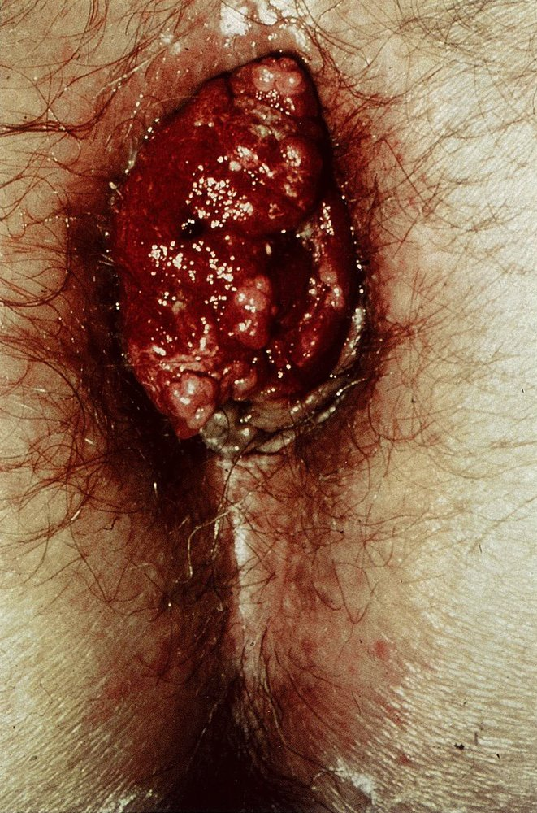
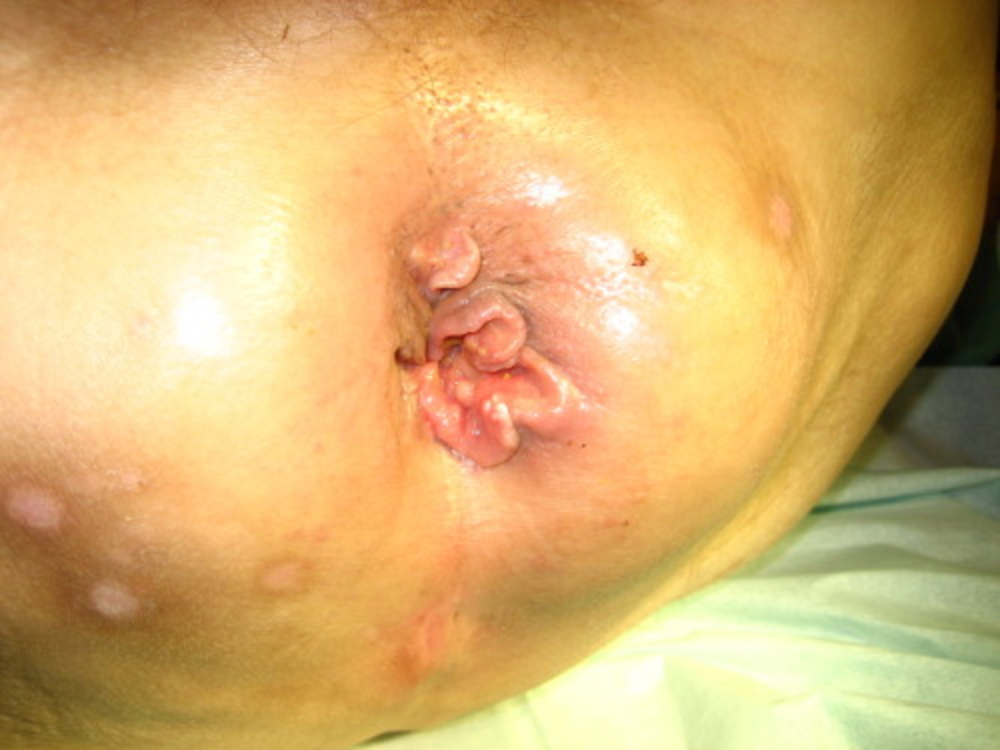

# Anal cancer

*Categories: Clinical knowledge > Internal medicine > Gastroenterology > Diseases of the intestine and appendix > Anal cancer*

[Original Article Link](https://coursology-qbank.com/amboss/article/gS0F_2)

---

## Summary

Anal cancer is a rare <u>malignancy</u> localized to the <u>anus</u> and perianal region. The main <u>risk factors</u> for developing anal cancer are <u>immunosuppression</u> and <u>human papillomavirus</u> (<u>HPV</u>) infection. <u>Squamous cell carcinoma</u> (<u>SCC</u>) accounts for the majority of anal cancers; <u>adenocarcinoma</u> and other nonepidermoid cancers are less common. Clinical features include rectal <u>pain</u>, <u>anal pruritus</u>, and bleeding, but patients may be asymptomatic. Initial diagnostic steps include <u>digital rectal examination</u> (<u>DRE</u>) and inspection. <u>Biopsy</u> with histopathologic analysis confirms the diagnosis. Staging with imaging (e.g., <u>CT scan</u> with IV contrast) is necessary to evaluate the extent of disease and determine treatment. <u>Chemoradiotherapy</u> is often curative. Anal <u>SCC</u> has a favorable prognosis when treated in the early stages. <u>Screening for anal cancer</u> should be considered in individuals at high risk, especially those with <u>HIV infection</u>; universal screening is not recommended.

---

## Epidemiology

* <u>Incidence</u>: ∼ 8,000 cases diagnosed per year in the US [[1]](https://coursology-qbank.com/amboss/article/McaM1j)

* More common in individuals with <u>HIV</u> and <u>men who have sex with men</u>

Epidemiological data refers to the US, unless otherwise specified.

---

## Etiology

* Risk factors for anal cancer [[2]](https://coursology-qbank.com/amboss/article/8bdOvo0)[[3]](https://coursology-qbank.com/amboss/article/qbdCuo0)

* <u>HPV</u> infection (especially types 16 and 18), e.g., individuals with <u>condylomata acuminata</u>

* <u>Immunosuppression</u>, e.g., <u>HIV</u>, recipient of <u>solid organ transplant</u>

* Receptive anal intercourse

* Tobacco use

* History of any <u>sexually transmitted infection</u>

* History of cervical, vaginal, or <u>vulvar cancer</u>

* Female sex

> [!TIP]
> Patients with <u>condylomata acuminata</u> (e.g., penile <u>warts</u> or a perianal <u>verrucous</u> mass) are at increased risk of anal cancer. [[2]](https://coursology-qbank.com/amboss/article/8bdOvo0)

---

## Clinical features

* <u>Rectal bleeding</u> (most significant initial symptom)

* <u>Anal pruritus</u>

* A lump or <u>tumor</u> around the <u>anus</u>

* Tenderness and/or <u>pain</u> in the anal area

* Foreign body sensation and/or inguinal <u>pain</u> (in advanced disease)  [[2]](https://coursology-qbank.com/amboss/article/8bdOvo0)

> [!TIP]
> Up to 20% of patients with anal cancer do not have anogenital symptoms. [[2]](https://coursology-qbank.com/amboss/article/8bdOvo0)

Anal cancer

Cancer of the anal margin

---

## Diagnosis

### General principles [[2]](https://coursology-qbank.com/amboss/article/8bdOvo0)[[4]](https://coursology-qbank.com/amboss/article/eXdxCo0)

* Clinical evaluation includes <u>DRE</u> and <u>inguinal lymph node</u> examination.

* Diagnostic confirmation requires <u>anoscopy</u> and <u>biopsy</u> for <u>histology</u> and <u>tumor grading</u>. [[2]](https://coursology-qbank.com/amboss/article/8bdOvo0)

* Additional evaluations are required for:

* Staging investigations to determine the <u>TNM score</u>

* Identification of comorbidities (e.g., <u>HPV</u>, <u>HIV</u>)

### Staging investigations [[2]](https://coursology-qbank.com/amboss/article/8bdOvo0)

Consider the following studies in consultation with a multidisciplinary team.

* Routine studies

* CT chest and abdomen/<u>pelvis</u> with IV contrast

* <u>Endoanal ultrasound</u> or <u>MRI</u> <u>pelvis</u>  [[2]](https://coursology-qbank.com/amboss/article/8bdOvo0)

* Additional studies

* CT head for patients with <u>focal neurological deficits</u>

* <u>FDG-PET/CT scan</u> as an adjunct to <u>CT scan</u>

* <u>FNA</u> or <u>core biopsy</u> of <u>inguinal lymph nodes</u>

### Additional evaluation [[2]](https://coursology-qbank.com/amboss/article/8bdOvo0)

* Assessment for <u>diseases associated with HPV infection</u>, e.g.:

* <u>Papanicolaou smear</u>

* Penile examination for <u>genital warts</u>

* <u>HIV testing</u> (if <u>HIV</u> status is unknown)

* <u>Colonoscopy</u> to assess for <u>synchronous tumors</u> of the <u>colon</u>; see “<u>Diagnostics for colorectal cancer</u>.” [[2]](https://coursology-qbank.com/amboss/article/8bdOvo0)

---

## Pathology

* <u>Histology</u>: primarily <u>squamous cell carcinoma</u>; rarely <u>adenocarcinoma</u> or other nonepidermoid cancers

* Location 

* Above the <u>anal verge</u>: anal canal tumors

* Below the <u>anal verge</u>: anal margin tumors

---

## Treatment

### General principles [[2]](https://coursology-qbank.com/amboss/article/8bdOvo0)[[4]](https://coursology-qbank.com/amboss/article/eXdxCo0)

* Therapy is guided by <u>tumor grading</u>, <u>tumor staging</u>, and <u>patient performance status</u> and preference.

* <u>HPV vaccination</u> is not recommended for patients with <u>SCC</u> or anal <u>dysplasia</u>. [[2]](https://coursology-qbank.com/amboss/article/8bdOvo0)

* For patients receiving <u>chemoradiotherapy</u>, offer pretreatment counseling. 

* <u>Sperm</u> or <u>ova</u> banking in patients of reproductive age

* Prevention of vaginal stenosis after <u>chemoradiation</u>, e.g., with vaginal dilators

### Locoregional disease [[2]](https://coursology-qbank.com/amboss/article/8bdOvo0)[[3]](https://coursology-qbank.com/amboss/article/qbdCuo0)

* <u>Chemoradiation</u> therapy: : treatment of choice for all <u>anal canal</u> <u>SCC</u> and most anal margin <u>SCC</u>  [[2]](https://coursology-qbank.com/amboss/article/8bdOvo0)

* Preferred regimen: 5-<u>fluorouracil</u> (<u>5-FU</u>) PLUS <u>mitomycin-C</u>

* May be curative while preserving anal sphincter function

* Surgical therapy

* <u>Wide local excision</u> for anal margin <u>SCC</u> that is both:

* Well-differentiated (<u>tumor grade</u> G1)

* Stage 1 (<u>TNM score</u> T1N0M0 )

* <u>Abdominoperineal resection</u> with <u>colostomy</u> [[4]](https://coursology-qbank.com/amboss/article/eXdxCo0)

* Persistent or recurrent disease (salvage <u>surgery</u>)

* Anal <u>adenocarcinoma</u> and other malignancies that do not respond to <u>radiotherapy</u> as well as <u>SCC</u>

> [!TIP]
> Well-differentiated stage 1 anal margin SSCs may be effectively managed with <u>wide local excision</u> alone. <u>Chemoradiation</u> therapy is preferred for all other <u>SCC</u> locoregional lesions. [[2]](https://coursology-qbank.com/amboss/article/8bdOvo0)

### <u>Metastatic</u> disease [[2]](https://coursology-qbank.com/amboss/article/8bdOvo0)[[3]](https://coursology-qbank.com/amboss/article/qbdCuo0)

* Systemic <u>chemotherapy</u>: <u>platinum</u>-containing regimen (e.g., <u>carboplatin</u> PLUS <u>paclitaxel</u>) [[3]](https://coursology-qbank.com/amboss/article/qbdCuo0)[[4]](https://coursology-qbank.com/amboss/article/eXdxCo0)

* First-line therapy for distant <u>metastatic</u> disease in patients fit for therapy  [[4]](https://coursology-qbank.com/amboss/article/eXdxCo0)

* May be given with or without <u>radiotherapy</u>

* <u>Immune checkpoint inhibitors</u> (e.g., <u>nivolumab</u> or <u>pembrolizumab</u>): may be considered in patients with disease progression after systemic <u>chemotherapy</u>  [[2]](https://coursology-qbank.com/amboss/article/8bdOvo0)[[3]](https://coursology-qbank.com/amboss/article/qbdCuo0)

* Additional therapy: <u>metastasectomy</u> and/or <u>radiofrequency ablation</u> in certain cases [[2]](https://coursology-qbank.com/amboss/article/8bdOvo0)

---