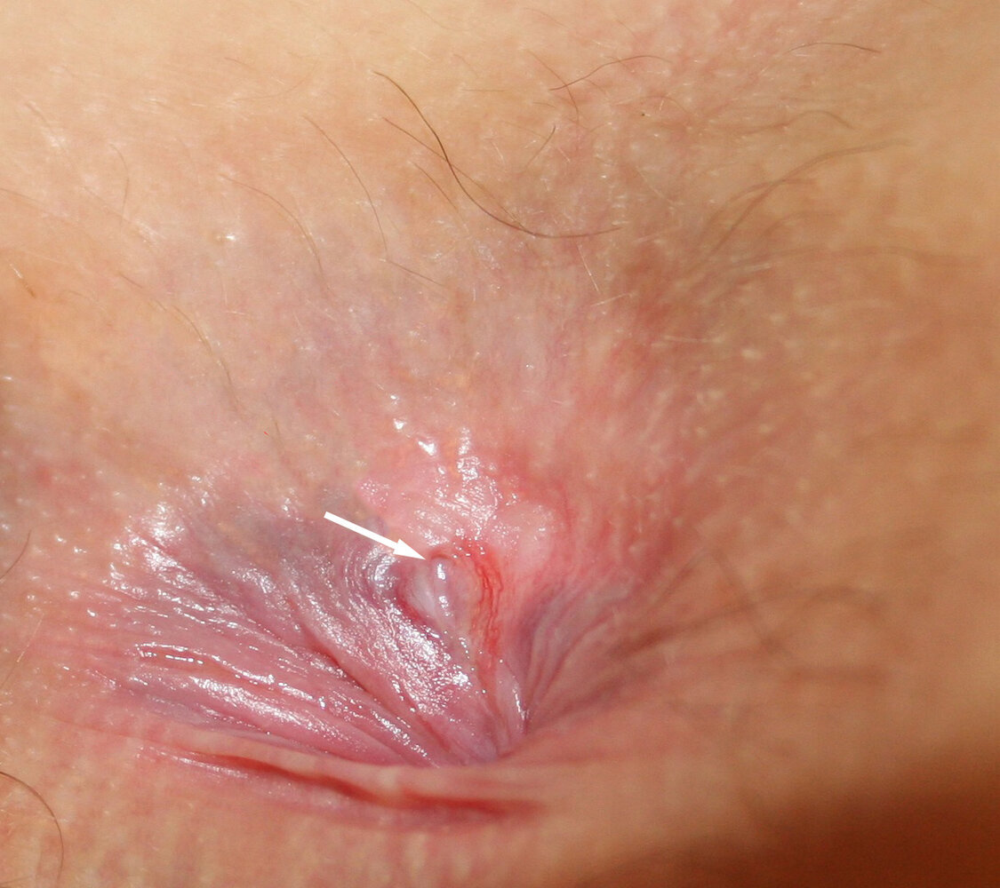
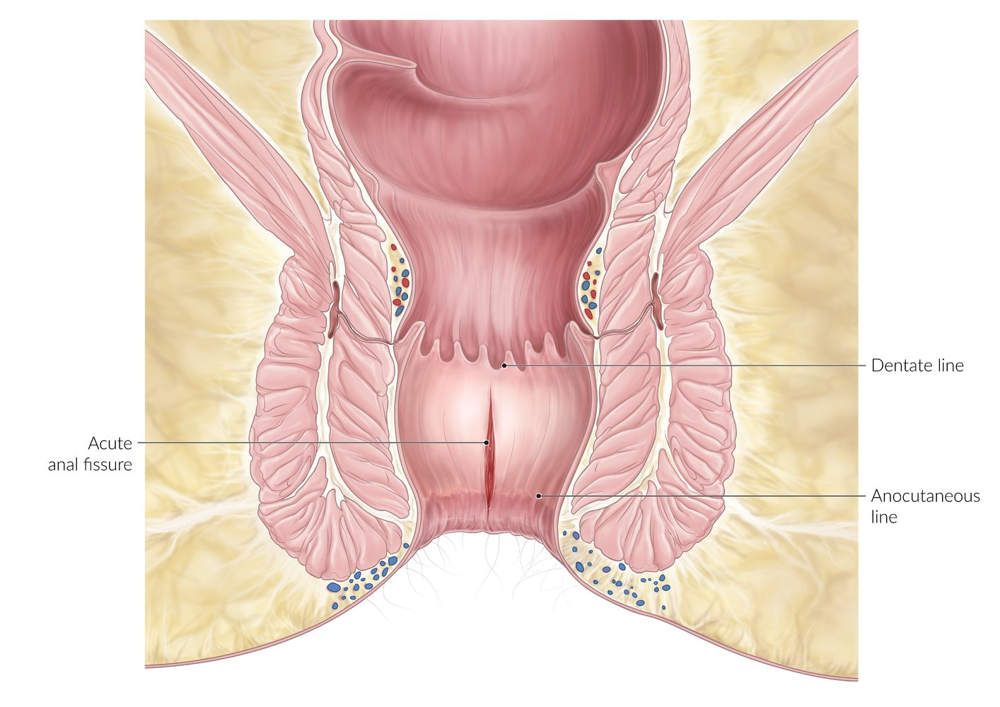
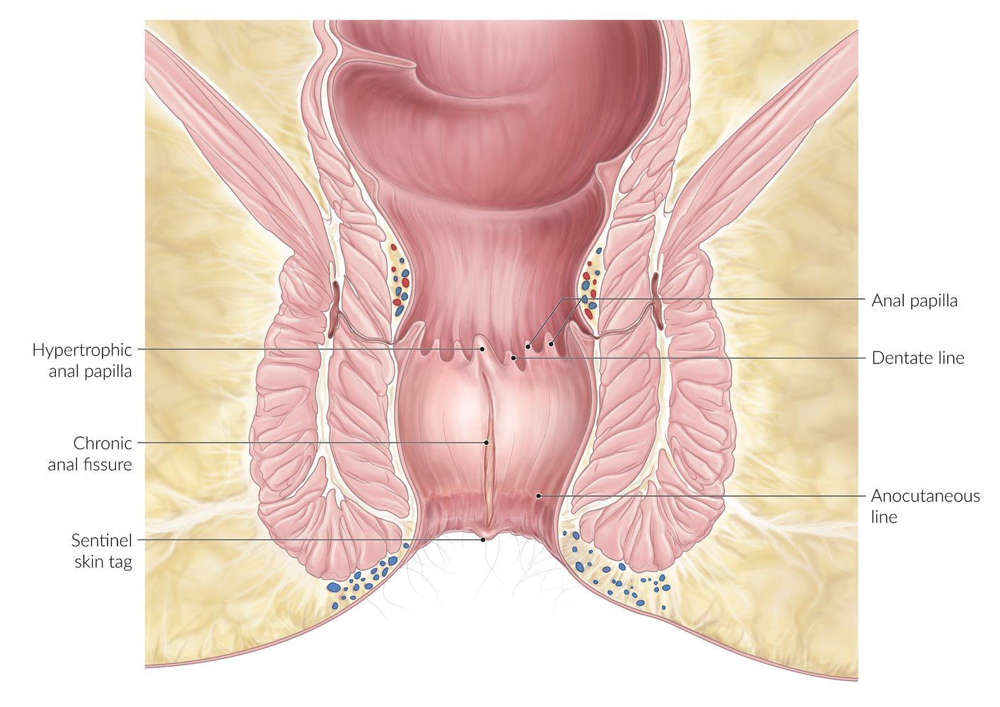

# Anal fissures

*Categories: Clinical knowledge > Internal medicine > Gastroenterology > Diseases of the intestine and appendix > Anal fissures*

[Original Article Link](https://coursology-qbank.com/amboss/article/X309Sf)

---

## Summary

Anal fissures are a longitudinal tear in the <u>anoderm</u>, typically located <u>distal</u> to the <u>dentate line</u> in the <u>posterior</u> midline, and are most commonly caused by increased <u>anal sphincter tone</u>. Fissures are classified by their cause (e.g., trauma, underlying disease) and duration (acute or chronic). Manifestations typically include sharp, severe <u>pain</u> during defecation and bright red <u>rectal bleeding</u>. Diagnosis is clinical, based on history and <u>physical examination</u>, though further evaluation is necessary if the diagnosis is unclear or if there are atypical features. Management is primarily conservative, involving <u>stool softeners</u>, <u>analgesics</u>, topical <u>anesthetics</u>, and topical <u>vasodilators</u>. <u>Surgery</u>, such as <u>lateral</u> internal sphincterotomy, should be considered if <u>conservative management</u> is unsuccessful, but carries a risk of <u>fecal incontinence</u>.

---

## Definitions

* Longitudinal tear of the <u>anal canal</u>; <u>distal</u> to the <u>dentate line</u>

---

## Etiology

### Primary (due to local trauma)

* Location: 90% of all anal fissures located at the <u>posterior</u> commissure (6 o'clock in the <u>lithotomy position</u>)

* Potential causes of trauma:

* Chronic spasm/increased tone in the <u>internal anal sphincter</u>

* Low fiber intake

* Chronic <u>constipation</u> or <u>diarrhea</u>

* Anal sex

* Vaginal delivery

### Secondary (due to underlying disease)

* Location: may occur <u>lateral</u> or <u>anterior</u> to the <u>posterior</u> commissure

* Underlying conditions:

* Previous anal <u>surgery</u> (e.g., possible stenosis of <u>anal canal</u>)

* <u>Inflammatory bowel disease</u> (<u>IBD</u>; e.g., <u>Crohn disease</u>)

* Granulomatous disease (e.g., <u>tuberculosis</u>)

* Infections (e.g., <u>chlamydia</u>, <u>HIV</u>)

* <u>Malignancy</u> (e.g., <u>leukemia</u>)

Lithotomy and left lateral positions

---

## Pathophysiology

* Overdistention or disease of the anal <u>mucosa</u> → <u>laceration</u> of the <u>anoderm</u>

* Spasm of the exposed <u>internal anal sphincter</u> leads to pulling along the <u>laceration</u>, which impairs healing and worsens the extent of <u>laceration</u> with each bowel movement.

* The resultant <u>pain</u> results in voluntary avoidance of defecation and <u>constipation</u>, which worsens distention of the anal <u>mucosa</u>.

* The <u>posterior</u> commissure is believed to have a very poor blood supply, which predisposes it to <u>ischemia</u> (exacerbated by poor <u>perfusion</u> during increased anal pressure).

---

## Clinical features

* Acute anal <u>fissure</u>  [[1]](https://coursology-qbank.com/amboss/article/2ucTqV0)[[2]](https://coursology-qbank.com/amboss/article/OwWIQn0)

* Typically a single <u>superficial</u> tear in the <u>anoderm</u> in the <u>posterior</u> midline

* Sharp, severe <u>pain</u> during defecation

* Bright red blood on stool or toilet paper

* Intermittent postdefecation <u>pain</u>

* Perianal <u>pruritus</u>

* Chronic <u>constipation</u>

* Chronic anal <u>fissure</u>   [[1]](https://coursology-qbank.com/amboss/article/2ucTqV0)[[2]](https://coursology-qbank.com/amboss/article/OwWIQn0)

* Cyclical sharp, severe <u>pain</u> with defecation [[3]](https://coursology-qbank.com/amboss/article/MOdMGJ0)

* External <u>skin tags</u> (sentinel <u>pile</u>)

* Internal <u>hypertrophied</u> anal <u>papillae</u>

* Exposed internal sphincter muscle fibers

> [!NOTE]
> 4 D's of anal fissures: Distal to the <u>dentate line</u>, Defecation <u>pain</u> with bleeding, Dull pudendal <u>pain</u>, Diet low in fiber

Anal fissure

Acute anal fissure

Chronic anal fissure

---

## Diagnosis

Anal fissures are a <u>clinical diagnosis</u> (see “Clinical features”). Further diagnostics are required if the diagnosis is unclear or to rule out underlying pathologies, e.g., in patients with chronic fissures. [[1]](https://coursology-qbank.com/amboss/article/2ucTqV0)[[2]](https://coursology-qbank.com/amboss/article/OwWIQn0)

* <u>Digital rectal examination</u>

* Use topical <u>lidocaine</u> ointment before performing the examination and consider examination under sedation.

* Only performed if the diagnosis is unclear or to rule out other pathologies (e.g., rectal <u>tumor</u>)

* <u>Anoscopy</u>: indicated if the <u>fissure</u> is not easily visualized or has an atypical presentation   [[4]](https://coursology-qbank.com/amboss/article/xd1EHf0)

* Endoscopy [[2]](https://coursology-qbank.com/amboss/article/OwWIQn0)[[5]](https://coursology-qbank.com/amboss/article/F4dgOJ0)

* Indicated for unclear diagnosis, <u>red flags for colorectal cancer</u>, and exclusion of <u>IBD</u>

* Consider delaying until after <u>fissure</u> treatment to reduce discomfort.

* Imaging (e.g., <u>CT scan</u>, <u>MRI</u>, or <u>endoanal ultrasound</u>): only performed if there is suspicion of <u>IBD</u> or anal or <u>colorectal cancer</u> [[6]](https://coursology-qbank.com/amboss/article/sDWtfn0)

> [!TIP]
> Consider additional diagnostics for atypical (<u>lateral</u> or multiple) or persistent fissures to rule out secondary causes (e.g., <u>Crohn disease</u>). [[2]](https://coursology-qbank.com/amboss/article/OwWIQn0)

> [!TIP]
> In patients with <u>rectal bleeding</u> and <u>red flags for colorectal cancer</u>, the presence of a <u>fissure</u> should not delay further diagnostics. [[7]](https://coursology-qbank.com/amboss/article/SQdyvp0)

---

## Differential diagnoses

### Proctalgia fugax [[8]](https://coursology-qbank.com/amboss/article/STWyJk0)[[9]](https://coursology-qbank.com/amboss/article/wTWhGk0)

* Definition: a functional disorder characterized by recurring episodes of sudden and sharp <u>pain</u> in the anorectal region unrelated to defecation

* <u>Epidemiology</u> [[10]](https://coursology-qbank.com/amboss/article/DSW1bO0)

* <u>Prevalence</u>: 8–18%

* Sex: <u>♀</u> > <u>♂</u> (3:2)

* Age of onset: 30–60 years

* Precipitating factors 

* Sexual intercourse

* Prolonged awkward posture or sitting

* <u>Stress</u>

* <u>Constipation</u>

* <u>Menstruation</u>

* Clinical features

* Recurring episodes of anorectal <u>pain</u>

* <u>Pain</u> lasts from seconds to minutes (max. 30 minutes).

* <u>Pain</u>-free intervals between attacks

* Diagnostics: a diagnosis of exclusion

* Treatment [[11]](https://coursology-qbank.com/amboss/article/KgWUwk0)

* Reassurance

* <u>Biofeedback</u> therapy

* Topical <u>antispasmodics</u> (e.g., <u>nitroglycerin</u>)

* Inhaled <u>beta-2-adrenergic agonists</u>

### Other

* <u>Hemorrhoids</u>

* Perianal <u>ulcer</u>

* <u>Anal fistula</u> or <u>abscess</u>

* <u>Anal carcinoma</u>

The differential diagnoses listed here are not exhaustive.

---

## Management

### Acute management [[1]](https://coursology-qbank.com/amboss/article/2ucTqV0)[[2]](https://coursology-qbank.com/amboss/article/OwWIQn0)[[12]](https://coursology-qbank.com/amboss/article/3QdSDp0)

* <u>Lifestyle changes for constipation</u>: increased <u>dietary fiber</u> and water intake

* Pharmacological treatment

* <u>Nonopioid analgesia</u>

* Topical <u>calcium channel blockers</u> (e.g., <u>nifedipine</u>, <u>diltiazem</u>) or <u>nitroglycerin</u> DOSAGE

* Topical <u>anesthetic</u> ointments (e.g., <u>lidocaine</u> gel)

* Topical <u>hydrocortisone</u> [[13]](https://coursology-qbank.com/amboss/article/KnbU88)

* Supportive management

* Warm <u>sitz baths</u>

* <u>Bulk-forming laxatives</u>, <u>stool softeners</u>

### Interventional and surgical management [[1]](https://coursology-qbank.com/amboss/article/2ucTqV0)[[2]](https://coursology-qbank.com/amboss/article/OwWIQn0)[[12]](https://coursology-qbank.com/amboss/article/3QdSDp0)

Refer patients with chronic anal fissures to a colorectal <u>surgeon</u>.

* Minimally invasive treatment: <u>botulinum toxin</u> A injection into the <u>internal anal sphincter</u>  [[14]](https://coursology-qbank.com/amboss/article/LOdwGJ0)

* <u>Surgery</u>: indicated if <u>conservative management</u> is unsuccessful after 8–12 weeks

* <u>Lateral</u> internal sphincterotomy: <u>gold standard</u> treatment with a lower risk of <u>fecal incontinence</u> than other surgical options [[4]](https://coursology-qbank.com/amboss/article/xd1EHf0)

* Other options: anal dilation, <u>anal advancement flap</u>, fissurectomy

> [!TIP]
> <u>Conservative management</u> is typically effective for acute fissures; <u>surgery</u> is reserved for chronic fissures due to the risk of <u>fecal incontinence</u>.

---