# Hemorrhoids

*Categories: Clinical knowledge > Internal medicine > Gastroenterology > Diseases of the intestine and appendix > Hemorrhoids*

[Original Article Link](https://coursology-qbank.com/amboss/article/c30ahf)

---

## Summary

Hemorrhoids are dilated <u>submucosal</u> vascular cushions within the <u>anal canal</u> that can be asymptomatic or manifest as painless perianal masses, <u>pruritus</u>, or <u>intermittent scant hematochezia</u> (<u>bright red blood per rectum</u>, typically at the end of defecation). Excessive straining during defecation or <u>intraabdominal pressure</u> (e.g., due to <u>constipation</u>, <u>pregnancy</u>, or prolonged periods sitting) increase the likelihood of developing hemorrhoids. Based on their anatomical location, hemorrhoids are internal (<u>above the dentate line</u>), external (<u>below the dentate line</u>), or mixed. <u>Internal hemorrhoids</u> are classified into four grades according to the extent of prolapse. The diagnosis is primarily clinical, based on a thorough history and examination that includes a <u>digital rectal examination</u> and <u>anoscopy</u>. Further investigation with <u>proctoscopy</u>, <u>sigmoidoscopy</u>, or <u>colonoscopy</u> may be required to rule out <u>differential diagnoses of hemorrhoids</u>, including <u>colorectal cancer</u>. All patients with symptomatic hemorrhoids should be counseled on lifestyle modifications (e.g., increased fiber and fluid intake, <u>regular physical activity</u>) to reduce straining during defecation. Medical management also includes <u>stool softeners</u> and short-term use of topical medications (e.g., <u>anesthetics</u>, <u>corticosteroids</u>, or vasoconstrictors) for symptomatic relief. Hemorrhoids refractory to medical management and larger (grades III and IV) <u>internal hemorrhoids</u> typically require procedures such as <u>rubber band ligation</u>, <u>sclerotherapy</u>, and infrared coagulation, or <u>surgery</u>. <u>Thrombosed external hemorrhoids</u> manifest with <u>acute pain</u> and a tender bluish-purple perianal <u>nodule</u>. Surgical excision of the thrombosed hemorrhoid may be beneficial in patients who present within 3–4 days of symptom onset. Those who present later should be <u>managed conservatively</u>.

---

## Etiology

* Excessive straining;  (e.g., from chronic <u>constipation</u>, frequent bowel movements, <u>chronic cough</u>, heavy lifting, <u>benign prostatic hyperplasia</u>)

* Extended periods of sitting (e.g., due to occupation or sedentary lifestyle)

* <u>Pregnancy</u>

* Older age

* <u>Connective tissue disorder</u> (e.g., Ehlers‑Danlos syndrome, <u>scleroderma</u>)

---

## Pathophysiology

### Anatomy of the anal canal

* Anal cushions

* Areas of thickened anal <u>mucosa</u> that consist of arteriovenous <u>blood vessels</u> (<u>corpus cavernosum recti</u>), <u>smooth muscle</u> (e.g., Treitz muscle), and fibroelastic tissue (e.g., <u>collagen</u>, <u>elastic fibers</u>)

* Located at 11, 7 and 3 o'clock in the <u>lithotomy position</u> (right <u>anterior</u>, right <u>posterior</u>, and left <u>lateral</u> position)

* Play an important role in maintaining continence by enabling tight closure of the <u>rectum</u>

* Defecation causes contraction of supportive structures (e.g., Treitz muscle) → compression of <u>anal cushions</u> → increased diameter of the <u>anal canal</u> for adequate passage of stool

* Anal columns: longitudinal folds of <u>mucous membrane</u> that are fused at their inferior ends by transverse folds (anal valves)

* Anal sinuses: small, mucus-secreting pouches between the <u>anal columns</u> above the <u>anal valves</u>

* Dentate line

* Circular separation line formed by the fusion of <u>anal valves</u> (<u>hindgut</u>-<u>proctodeum</u> junction)

* Divides <u>anal canal</u> into an upper and lower part (also see characteristics of the <u>anal canal</u> above and below the <u>dentate line</u> below)

* External anal sphincter

* Composed of

* Subcutaneous external sphincter: surrounds lower third of <u>anal canal</u>

* <u>Superficial</u> external sphincter

* Deep external sphincter

* Consists of <u>skeletal muscle</u> and functions to open and close the <u>anal canal</u> and opening

* Innervated by the <u>pudendal nerve</u> and under voluntary control

* Internal anal sphincter

* Surrounds upper two-thirds of <u>anal canal</u>

* Consists of involuntary circular <u>smooth muscle</u> and is responsible for ∼ 85% of the resting pressure of the <u>anal canal</u>

* Innervated by the <u>enteric nervous system</u>

Anal canal

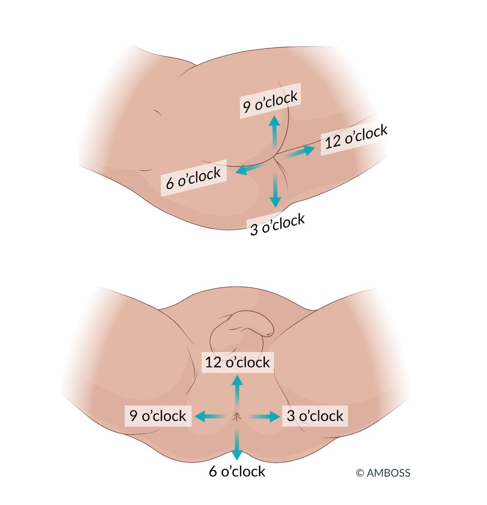

Lithotomy and left lateral positions

|  Characteristics of the anal canal above and below the dentate line [[3]](https://coursology-qbank.com/amboss/article/NxX-9Z0)[[4]](https://coursology-qbank.com/amboss/article/mxXVCZ0)  |  |  |
| --- | --- | --- |
|  | Above the dentate line | Below the dentate line |
| Embryological origin |  * <u>Endoderm</u> (from the <u>hindgut</u>)   |  * <u>Ectoderm</u> (from the cloaca)   |
| <u>Epithelium</u> |  * Simple <u>columnar epithelium</u>   |  * <u>Stratified</u> <u>nonkeratinized squamous epithelium</u> (known as anal pecten)   |
| Arterial supply |  * <u>Superior rectal artery</u> (branch of the <u>inferior mesenteric artery</u>)   |  * <u>Inferior rectal artery</u> (branch of the <u>internal pudendal artery</u>)   |
| Venous drainage |  * Internal hemorrhoidal plexus → <u>superior rectal vein</u> (drains into the <u>inferior mesenteric vein</u> → <u>splenic vein</u> → <u>portal vein</u> → <u>hepatic veins</u> → <u>inferior vena cava</u>)   |  * <u>External hemorrhoidal plexus</u> → <u>inferior rectal vein</u> (drains into the <u>internal pudendal vein</u> → <u>internal iliac vein</u> → <u>common iliac vein</u> → <u>inferior vena cava</u>)   |
| <u>Lymphatic drainage</u> |  * <u>Internal iliac lymph nodes</u>   |  * <u>Superficial inguinal lymph nodes</u>   |
| Innervation |  * <u>Visceral</u>  * <u>Sympathetic</u>: <u>inferior mesenteric plexus</u>  * <u>Parasympathetic</u>: <u>inferior hypogastric plexus</u> and <u>pelvic splanchnic nerves</u>   |  * Somatic: <u>inferior rectal nerve</u> (branch of the <u>pudendal nerve</u>)   |
| Clinical relevance |   * <u>Internal hemorrhoid</u> formation  * Development of <u>adenocarcinoma</u>  * <u>Anorectal varices</u>    |   * <u>External hemorrhoid</u> formation  * Development of <u>squamous cell carcinoma</u>  * <u>Anal fissures</u>    |

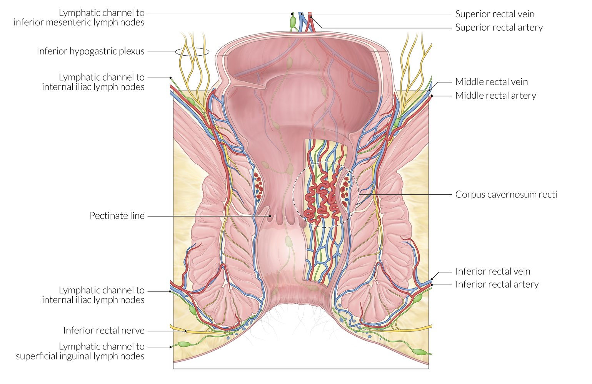

Blood supply and lymphatic drainage of the anal canal

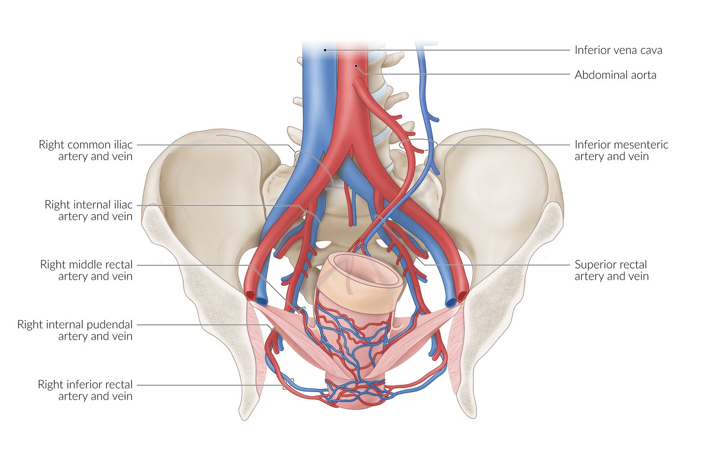

Pelvis with blood supply of the anal canal

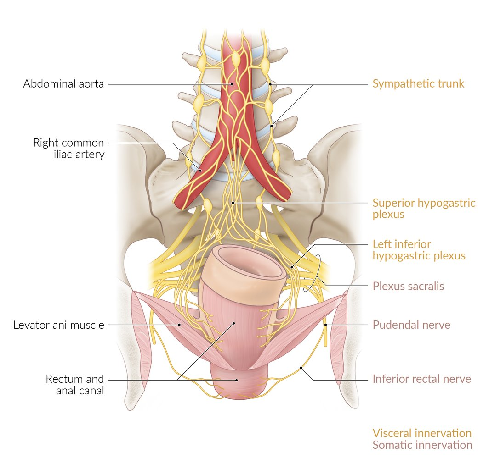

Innervation of the anal canal

### Internal vs. <u>external hemorrhoids</u>

Hemorrhoids are classified as internal , external , or mixed .

* Internal hemorrhoids

* Prolapse of <u>internal hemorrhoids</u>, with possible incarceration and strangulation, may cause <u>pain</u> by triggering an <u>anal sphincter complex</u> spasm.  → possible <u>ischemia</u> and <u>necrosis</u> of internal hemorrhoids → worsening <u>anal sphincter complex</u> spasm → potential <u>external hemorrhoid</u> <u>thrombosis</u> → cutaneous <u>pain</u>

* Develop <u>above the dentate line</u>, which is not innervated by cutaneous nerves; distension does not cause <u>pain</u>.

* Bleeding and/or prolapsed <u>internal hemorrhoids</u> irritate sensitive perianal <u>skin</u> → perianal itching

* External hemorrhoids

* Develop <u>below the dentate line</u>, which is innervated by cutaneous nerves; distention;  of this innervated <u>skin</u> due to <u>thrombosis</u> results in severe <u>pain</u>.

* Acute <u>thrombosis</u> triggers cutaneous <u>pain</u>, lasting 7–14 days → <u>thrombosis</u> resolves → residual <u>skin</u> or <u>skin tags</u> of distended anal <u>skin</u>

> [!NOTE]
> Hemorrhoids are not <u>varicose veins</u> (dilated, <u>tortuous</u> <u>veins</u>). <u>Anorectal varices</u> occur, e.g., as a result of <u>portal hypertension</u>. The terms <u>anorectal varices</u> and hemorrhoids are often used interchangeably, but this is incorrect.

---

## Clinical features

* <u>Internal hemorrhoids</u>

* Often painless, bright red bleeding at the end of defecation

* Perianal mass in the event of prolapse

* <u>Pruritus</u>

* Anal discharge (containing mucus or fecal debris)

* <u>Ulceration</u> (in <u>hemorrhoid stage</u> IV)

* <u>External hemorrhoids</u>

* Manifestations are similar to those of <u>internal hemorrhoids</u> (i.e., bright red bleeding, <u>pruritus</u>, perianal mass)

* A <u>thrombosed external hemorrhoid</u> manifests with severe perianal <u>pain</u> and a tender perianal mass.

---

## Classification

<u>Internal hemorrhoids</u> are graded according to extent of prolapse. There is no widely used classification system for <u>external hemorrhoids</u>.

|  Grading of internal hemorrhoids [[5]](https://coursology-qbank.com/amboss/article/2ucTqV0) |  |
| --- | --- |
| Grade | Palpation findings |
| I | Hemorrhoids bleed but do not prolapse. |
| II |  Prolapse when straining, but spontaneously reduce at rest   |
| III |  Prolapse when straining; only reducible manually   |
| IV |  Irreducible prolapse; may be strangulated and thrombosed with possible <u>ulceration</u>   |

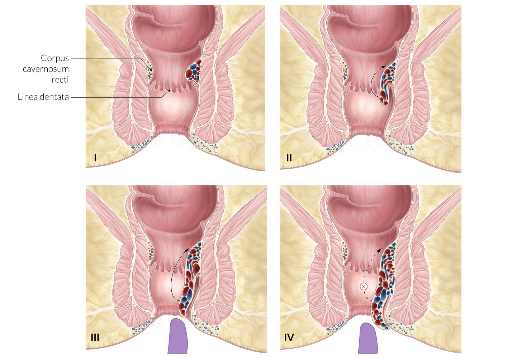

Classification of internal hemorrhoids

---

## Diagnosis

### Approach [[5]](https://coursology-qbank.com/amboss/article/2ucTqV0)[[6]](https://coursology-qbank.com/amboss/article/GscBwd0)[[7]](https://coursology-qbank.com/amboss/article/jsc_ud0)

* All patients with suspected hemorrhoids: Perform a perianal examination, <u>digital rectal examination</u>, and <u>anoscopy</u>.

* Inconclusive initial evaluation: Refer for <u>proctoscopy</u> or <u>flexible sigmoidoscopy</u> to evaluate the <u>rectum</u> and <u>distal</u> <u>colon</u>.

* Concern for <u>malignancy</u> (age ≥ 50 years;  , <u>risk factors for colorectal cancer</u>, <u>red flags for colorectal cancer</u>): <u>Colonoscopy</u> (alternatively, <u>CT colonography</u>) is required to evaluate the entire <u>colon</u>. [[6]](https://coursology-qbank.com/amboss/article/GscBwd0)

> [!TIP]
> Hemorrhoids are a <u>clinical diagnosis</u>.

### <u>Physical examination</u> [[5]](https://coursology-qbank.com/amboss/article/2ucTqV0)[[7]](https://coursology-qbank.com/amboss/article/jsc_ud0)[[8]](https://coursology-qbank.com/amboss/article/PscWEd0)

* Evaluate in the <u>prone</u> <u>jackknife position</u>, <u>lateral decubitus position</u>, or <u>lithotomy position</u>. [[8]](https://coursology-qbank.com/amboss/article/PscWEd0)

* Inspect the perianal area for <u>external hemorrhoids</u> and nonreduced <u>internal hemorrhoids</u>.

* Perform a <u>digital rectal examination</u> to evaluate for masses or tenderness.

* Ask the patient to perform the <u>Valsalva maneuver</u> in order to assess for any prolapse of grade II or III hemorrhoids or rectal <u>mucosa</u>.

* Rule out other potential sources of <u>bright red blood per rectum</u> or perianal masses (see “<u>Differential diagnoses of hemorrhoids</u>”).

### Anoscopy [[6]](https://coursology-qbank.com/amboss/article/GscBwd0)[[8]](https://coursology-qbank.com/amboss/article/PscWEd0)

* Insertion of an anoscope to directly visualize the <u>anus</u> and <u>distal</u> <u>rectum</u> [[9]](https://coursology-qbank.com/amboss/article/4sc3Ed0)

* Perform in all patients with suspected hemorrhoids.  [[7]](https://coursology-qbank.com/amboss/article/jsc_ud0)[[8]](https://coursology-qbank.com/amboss/article/PscWEd0)

* May show hemorrhoids or differential diagnoses, e.g., <u>anal carcinoma</u> or <u>fissure</u>

Lithotomy and left lateral positions

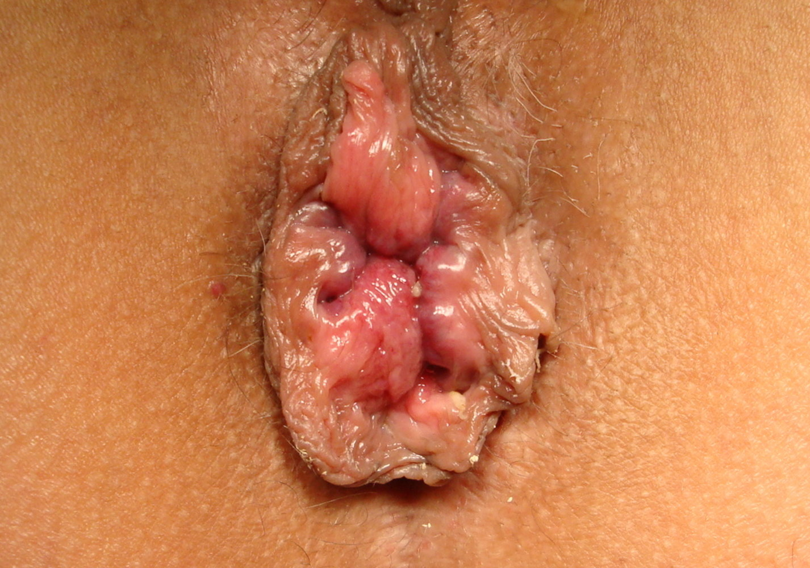

Grade II hemorrhoids

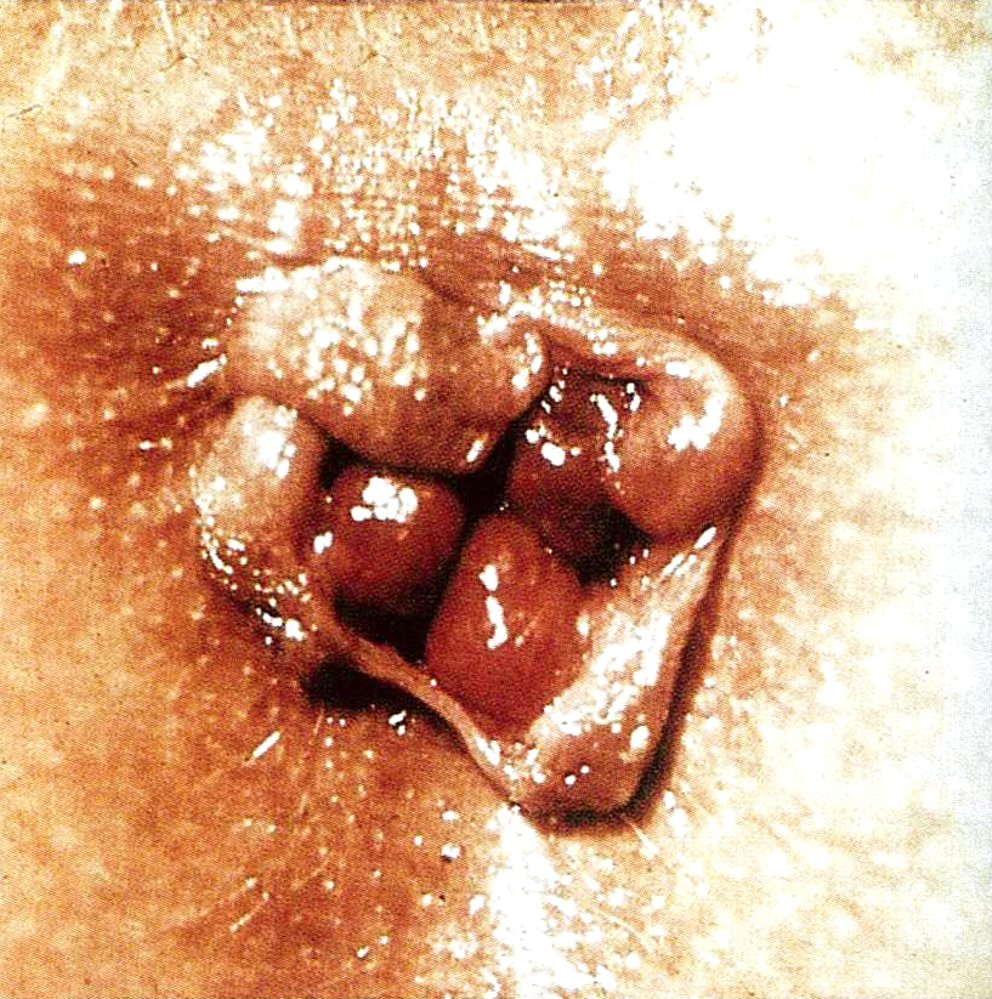

Grade III hemorrhoids and anal skin tags

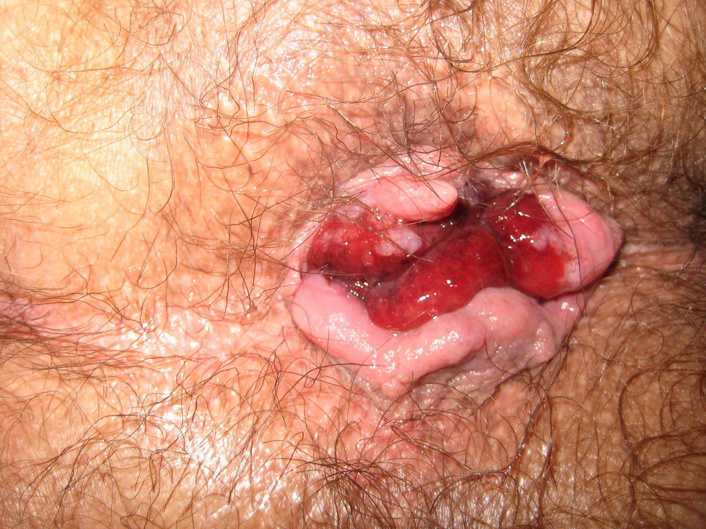

Grade IV hemorrhoids

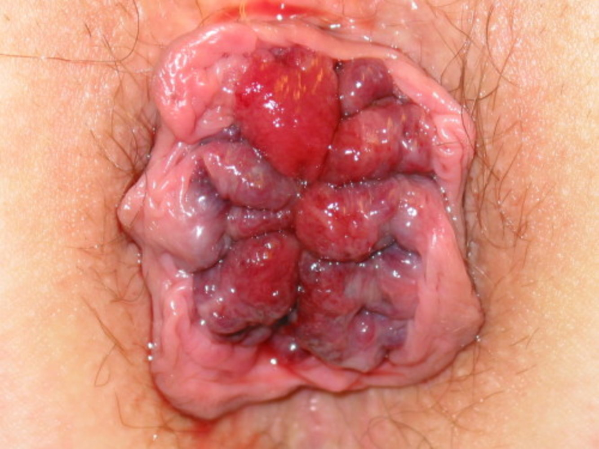

Grade IV hemorrhoids

### Further studies [[6]](https://coursology-qbank.com/amboss/article/GscBwd0)[[8]](https://coursology-qbank.com/amboss/article/PscWEd0)[[10]](https://coursology-qbank.com/amboss/article/98cNKV0)

* Indications

* Clinical uncertainty

* Inadequate visualization on <u>anoscopy</u>

* Concern for <u>malignancy</u>

* Modalities

* High risk for <u>malignancy</u> : <u>colonoscopy</u> to visualize the entire <u>colon</u>; see “Initial workup” in “<u>Approach to suspected colorectal cancer</u>” for further information

* Low risk for <u>malignancy</u> : <u>proctoscopy</u> or <u>flexible sigmoidoscopy</u>

---

## Differential diagnoses

* Anal skin tags: benign, painless folds of <u>skin</u> at the <u>anal verge</u> that are residues of previous episodes of inflammation or thrombosed hemorrhoids  [[5]](https://coursology-qbank.com/amboss/article/2ucTqV0)

* <u>Hypertrophied</u> anal <u>papillae</u>

* Polyps

* Anal and <u>colorectal carcinoma</u>

* <u>Anal fissures</u> (cause painful bright red bleeding per <u>rectum</u>)

* <u>Anorectal varices</u>

* <u>Proctitis</u>

* <u>Condyloma acuminata</u>

* <u>Inflammatory bowel disease</u> (often associated with <u>anal fistulas</u> and <u>abscesses</u>)

* <u>Rectal prolapse</u>

* <u>Perianal dermatitis</u>

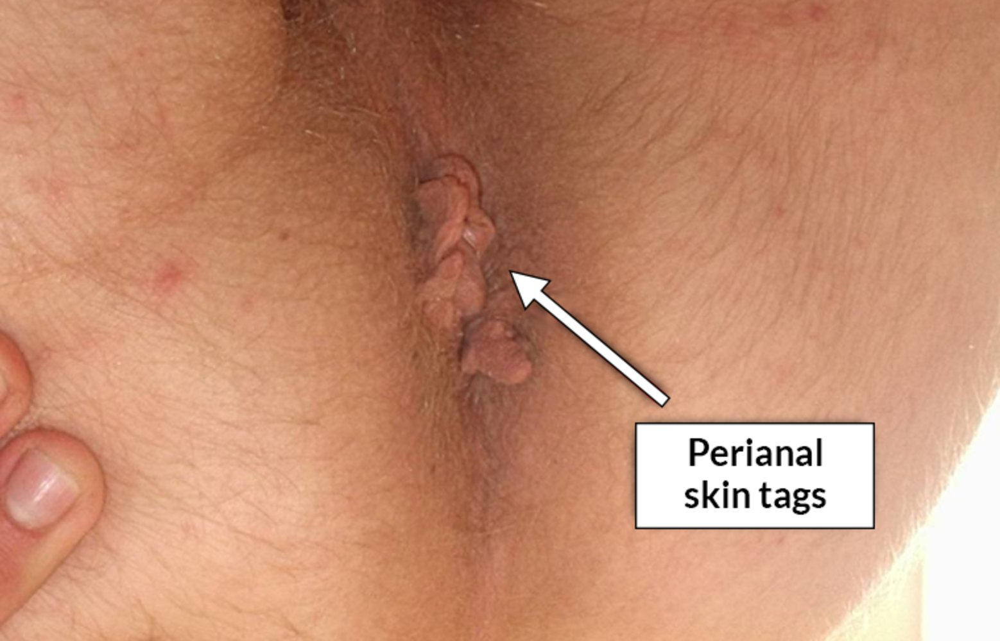

Perianal skin tags

> [!TIP]
> Always consider the possibility of concurrent <u>colorectal carcinoma</u>.

The differential diagnoses listed here are not exhaustive.

---

## Treatment

### Approach [[5]](https://coursology-qbank.com/amboss/article/2ucTqV0)[[6]](https://coursology-qbank.com/amboss/article/GscBwd0)[[7]](https://coursology-qbank.com/amboss/article/jsc_ud0)

* All patients with symptomatic hemorrhoids

* Lifestyle modifications  to reduce straining during defecation

* <u>Sitz baths</u> and topical medications for short-term symptomatic relief

* <u>Internal hemorrhoids</u>

* Grade I–III <u>internal hemorrhoids</u> unresponsive to <u>conservative treatment</u>: Refer for office-based procedures (e.g., <u>rubber band ligation</u>).

* Grade IV <u>internal hemorrhoids</u> and those unresponsive to other therapies: Refer for <u>surgery</u> (e.g., <u>hemorrhoidectomy</u>, stapled hemorrhoidopexy).

* <u>External hemorrhoids</u>

* Symptomatic <u>external hemorrhoids</u> refractory to <u>conservative management</u>: Refer for <u>surgery</u>.

* <u>Thrombosed external hemorrhoids</u>

* Presentation within 3–4 days of symptom onset: Consider excision of the thrombosed hemorrhoid.

* Delayed presentation: <u>conservative management</u>

> [!TIP]
> Hemorrhoids should only be treated in symptomatic patients. [[6]](https://coursology-qbank.com/amboss/article/GscBwd0)

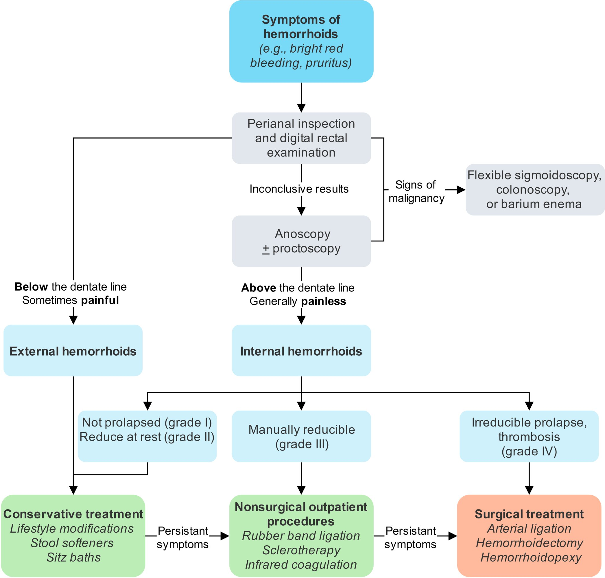

Management of hemorrhoids

### Medical management of hemorrhoids [[5]](https://coursology-qbank.com/amboss/article/2ucTqV0)[[6]](https://coursology-qbank.com/amboss/article/GscBwd0)[[7]](https://coursology-qbank.com/amboss/article/jsc_ud0)

* Indications: all patients with hemorrhoids

* Interventions to reduce anorectal pressure and straining

* Lifestyle modifications [[5]](https://coursology-qbank.com/amboss/article/2ucTqV0)

* <u>High fiber diet</u> (20–30 g/day)

* Increased fluid intake

* Avoidance of fatty foods

* <u>Regular physical activity</u>

* Avoidance of excessive straining  [[11]](https://coursology-qbank.com/amboss/article/cucaJV0)

* Limiting the amount of time spent on the toilet

* <u>Treatment of constipation</u> with short-term (up to 1 week) use of <u>stool softeners</u> (e.g., <u>docusate</u>) or <u>laxatives</u> (e.g., <u>polyethylene glycol</u> 3350) as needed. [[5]](https://coursology-qbank.com/amboss/article/2ucTqV0)

* Interventions to alleviate symptoms (e.g., <u>pain</u>, <u>pruritus</u>)

* Sitz baths: a bath in which the buttocks are immersed in warm water for short periods of time

* Topical medications for short-term symptomatic relief: topical <u>anesthetics</u> (e.g., <u>lidocaine</u>), <u>corticosteroids</u> (e.g., <u>hydrocortisone</u>), and/or vasoconstrictors (e.g., <u>phenylephrine</u>)

> [!TIP]
> <u>Conservative management</u> is often the only intervention required for grade I–II <u>internal hemorrhoids</u> and <u>external hemorrhoids</u>.

> [!WARNING]
> Long-term use of topical medications for hemorrhoids can lead to sensitization and localized reactions and should be avoided. [[6]](https://coursology-qbank.com/amboss/article/GscBwd0)

### Office-based procedures for hemorrhoids [[5]](https://coursology-qbank.com/amboss/article/2ucTqV0)[[6]](https://coursology-qbank.com/amboss/article/GscBwd0)[[8]](https://coursology-qbank.com/amboss/article/PscWEd0)

* Indications: grade I–III <u>internal hemorrhoids</u> with symptoms refractory to medical management  [[6]](https://coursology-qbank.com/amboss/article/GscBwd0)

* Interventions 

* <u>Rubber band ligation</u>: most common  [[5]](https://coursology-qbank.com/amboss/article/2ucTqV0)[[6]](https://coursology-qbank.com/amboss/article/GscBwd0)

* A rubber band at the base of an <u>internal hemorrhoid</u> under <u>vision</u> through an anoscope

* Ligation leads to <u>ischemic necrosis</u> with subsequent <u>fibrosis</u>.

* <u>Sclerotherapy</u>: low risk of bleeding; consider for patients on <u>anticoagulants</u> [[5]](https://coursology-qbank.com/amboss/article/2ucTqV0)

* Infrared coagulation: application of infrared light waves to the base of the hemorrhoid under <u>vision</u> to induce <u>necrosis</u> and <u>scar</u> formation; typically performed for grade I–II <u>internal hemorrhoids</u> [[6]](https://coursology-qbank.com/amboss/article/GscBwd0)

* Potential complications: uncommon; can include bleeding, <u>pain</u>, or infection (including perianal <u>sepsis</u>) [[6]](https://coursology-qbank.com/amboss/article/GscBwd0)

> [!TIP]
> <u>Sclerotherapy</u> may be preferable in patients with actively bleeding hemorrhoids who are on <u>anticoagulants</u>. [[5]](https://coursology-qbank.com/amboss/article/2ucTqV0)

### Surgery for hemorrhoids [[6]](https://coursology-qbank.com/amboss/article/GscBwd0)[[7]](https://coursology-qbank.com/amboss/article/jsc_ud0)

* Indications   [[6]](https://coursology-qbank.com/amboss/article/GscBwd0)[[10]](https://coursology-qbank.com/amboss/article/98cNKV0)

* Symptomatic grade III and IV <u>internal hemorrhoids</u>

* Symptomatic <u>external hemorrhoids</u> or combined external and <u>internal hemorrhoids</u> with prolapse

* No improvement after; , or inability to tolerate, medical and office-based interventions

* Options

* <u>Submucosal</u> hemorrhoidectomy: surgical removal of hemorrhoids [[12]](https://coursology-qbank.com/amboss/article/_sc5xd0)[[13]](https://coursology-qbank.com/amboss/article/UucbqV0)

* Ferguson approach (closed approach): The <u>mucosal</u> defect is closed (<u>healing by primary intention</u>) after excision of the hemorrhoid.  [[6]](https://coursology-qbank.com/amboss/article/GscBwd0)

* Milligan‑Morgan approach (open approach): The <u>mucosal</u> defect is kept open (<u>healing by secondary intention</u>) after excision of the hemorrhoid.

* Stapled hemorrhoidopexy (Longo procedure)  [[6]](https://coursology-qbank.com/amboss/article/GscBwd0)[[14]](https://coursology-qbank.com/amboss/article/iGcJ_d0)

* A circular stapling device is used to remove a circular wedge of <u>mucosal</u> tissue <u>above the dentate line</u>

* Only effective for <u>internal hemorrhoids</u>

* Doppler-guided hemorrhoidal arterial ligation: identification and ligation of the <u>arteries</u> supplying hemorrhoids

* Potential complications: <u>pain</u>, bleeding, <u>acute urinary retention</u>, and rarely, anal stricture/stenosis

> [!TIP]
> <u>Pain</u> is common after surgical <u>treatment of hemorrhoids</u>. Consider multimodal <u>analgesia</u> including <u>local anesthesia</u> and use of topical medications (e.g., <u>diltiazem</u> or <u>nitroglycerin</u> ointment) to reduce the need for <u>opioid analgesics</u>. [[6]](https://coursology-qbank.com/amboss/article/GscBwd0)

> [!WARNING]
> Perianal <u>sepsis</u> can occur after surgical or office-based interventions for hemorrhoids and may manifest with worsening <u>pain</u>, <u>fever</u>, or <u>dysuria</u>. [[6]](https://coursology-qbank.com/amboss/article/GscBwd0)

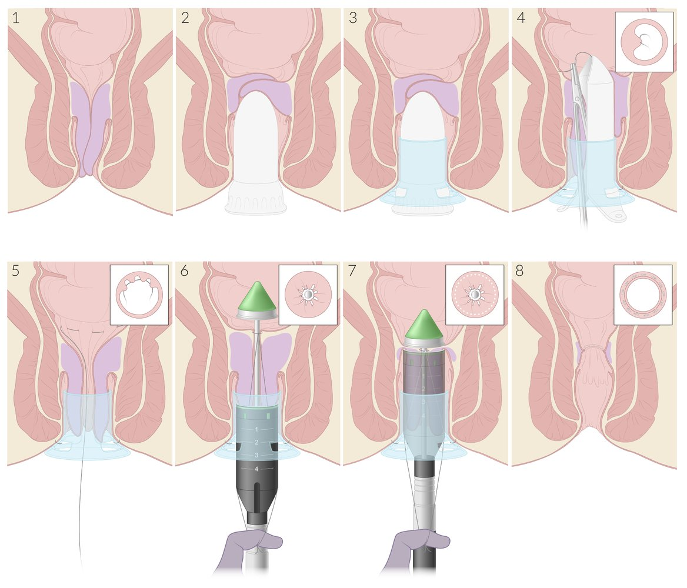

Stapled hemorrhoidopexy (Longo procedure): steps

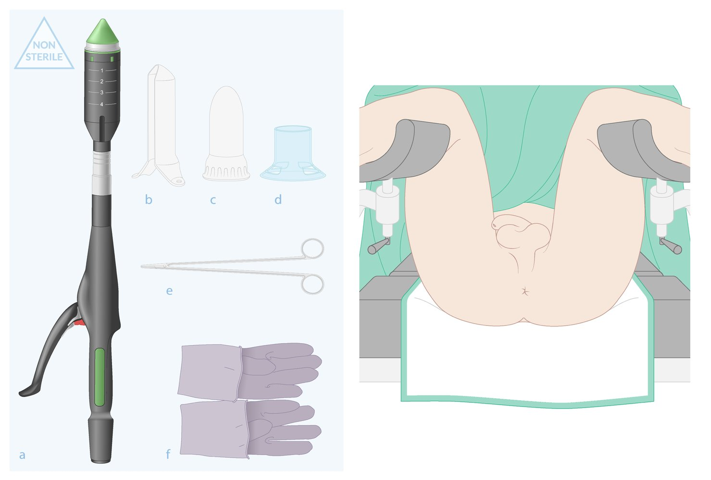

Stapled hemorrhoidopexy (Longo procedure): instruments and patient positioning

---

## Thrombosed external hemorrhoid

### Definition

A <u>thrombus</u> within the inferior hemorrhoidal venous plexus <u>distal</u> to the <u>dentate line</u>

### Pathophysiology

* Stasis of blood within the <u>external hemorrhoid</u> → <u>thrombus formation</u> → inflammation and distention of the overlying perianal <u>skin</u> → severe <u>pain</u>

> [!NOTE]
> <u>External hemorrhoids</u> are located <u>distal</u> to the dentate (pectinate) line and are drained by the inferior hemorrhoidal (rectal) plexus. <u>External hemorrhoid thrombosis</u> occurs if a clot forms in the inferior hemorrhoidal plexus. [[15]](https://coursology-qbank.com/amboss/article/CS0qbf)

### Clinical features [[6]](https://coursology-qbank.com/amboss/article/GscBwd0)[[8]](https://coursology-qbank.com/amboss/article/PscWEd0)[[16]](https://coursology-qbank.com/amboss/article/hYYcKn)

* Acute onset of severe perianal <u>pain</u>

* Painful perianal mass that may ulcerate and bleed

* Painful defecation

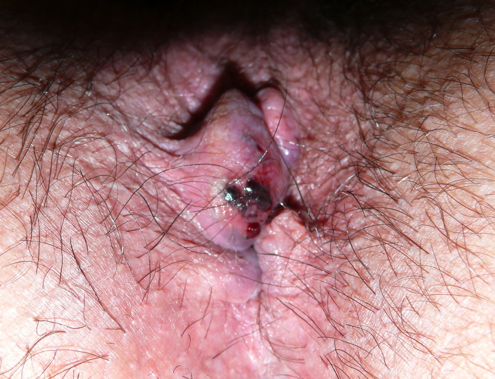

Thrombosed external hemorrhoid

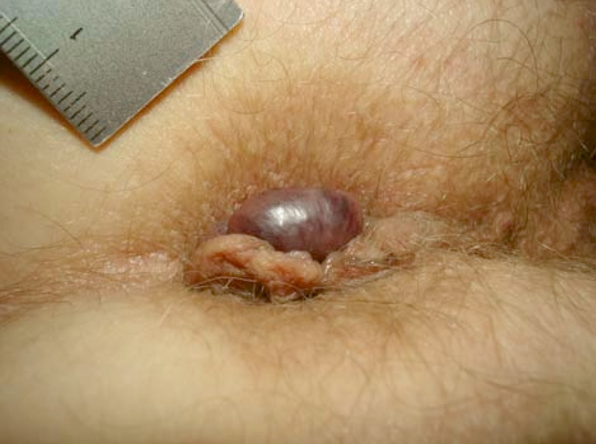

Thrombosed external hemorrhoid

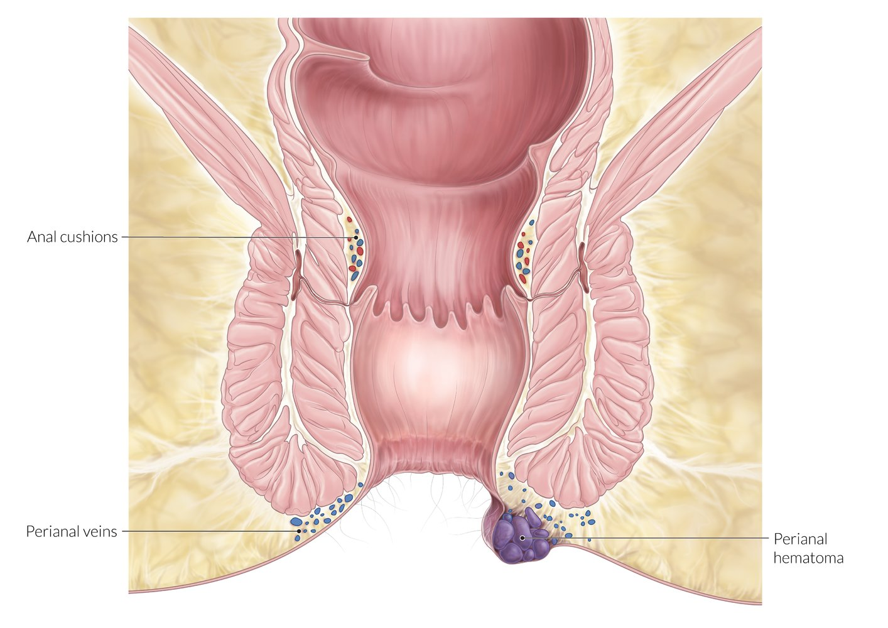

Thrombosed external hemorrhoid

### Diagnostics [[6]](https://coursology-qbank.com/amboss/article/GscBwd0)

* Typically a <u>clinical diagnosis</u>

* Perianal examination: a palpable, tender, dark red to purplish <u>nodule</u> at the <u>anal verge</u> or just within the <u>anal canal</u>

### Management [[5]](https://coursology-qbank.com/amboss/article/2ucTqV0)[[6]](https://coursology-qbank.com/amboss/article/GscBwd0)[[8]](https://coursology-qbank.com/amboss/article/PscWEd0)

#### Surgical excision [[12]](https://coursology-qbank.com/amboss/article/_sc5xd0)

* Indication: severe, acute perianal <u>pain</u> (< 3–4 days duration)  [[8]](https://coursology-qbank.com/amboss/article/PscWEd0)

* Procedure: : See “<u>Excision of thrombosed external hemorrhoids</u>.”

#### Medical management [[6]](https://coursology-qbank.com/amboss/article/GscBwd0)[[8]](https://coursology-qbank.com/amboss/article/PscWEd0)

* Indications

* Patients who present after > 3–4 days of symptom onset

* An alternative to <u>surgery</u> in patients with mild or moderate symptoms who present early

* Methods

* <u>Analgesia</u>: warm <u>sitz baths</u> , <u>antispasmodic agents</u> (e.g., topical <u>nitroglycerin</u> or <u>nifedipine</u>) , <u>analgesic</u> creams (e.g., <u>lidocaine</u>)

* Topical antiinflammatories: e.g., <u>hydrocortisone</u> cream

* Improve passage of stool: <u>stool softeners</u> (e.g., <u>docusate</u>), increased intake of fluids and fiber

---