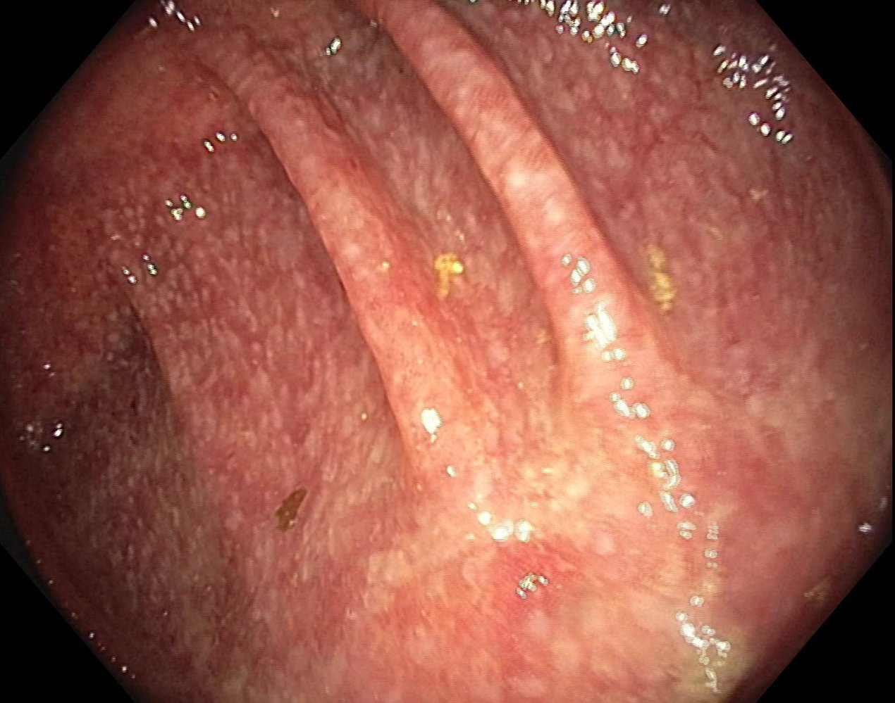
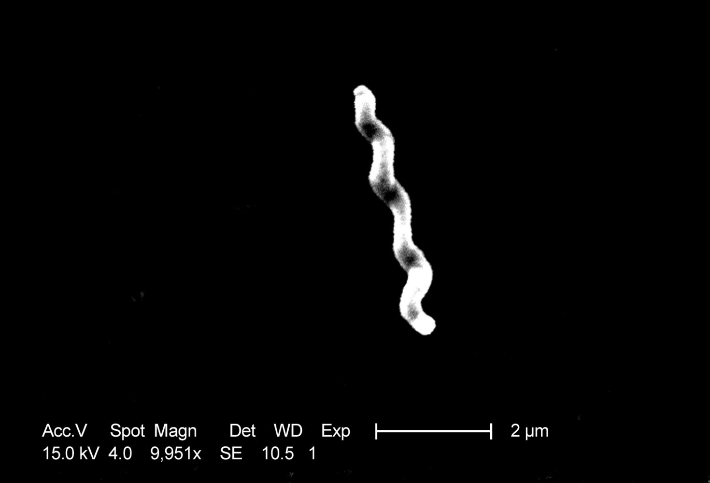
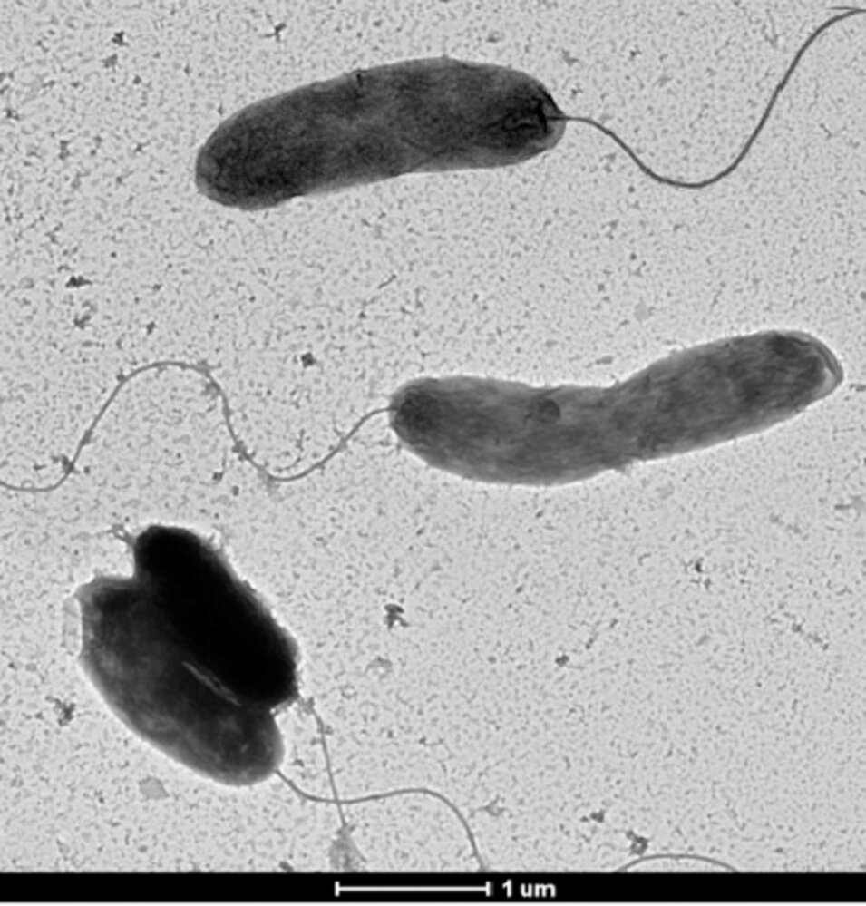
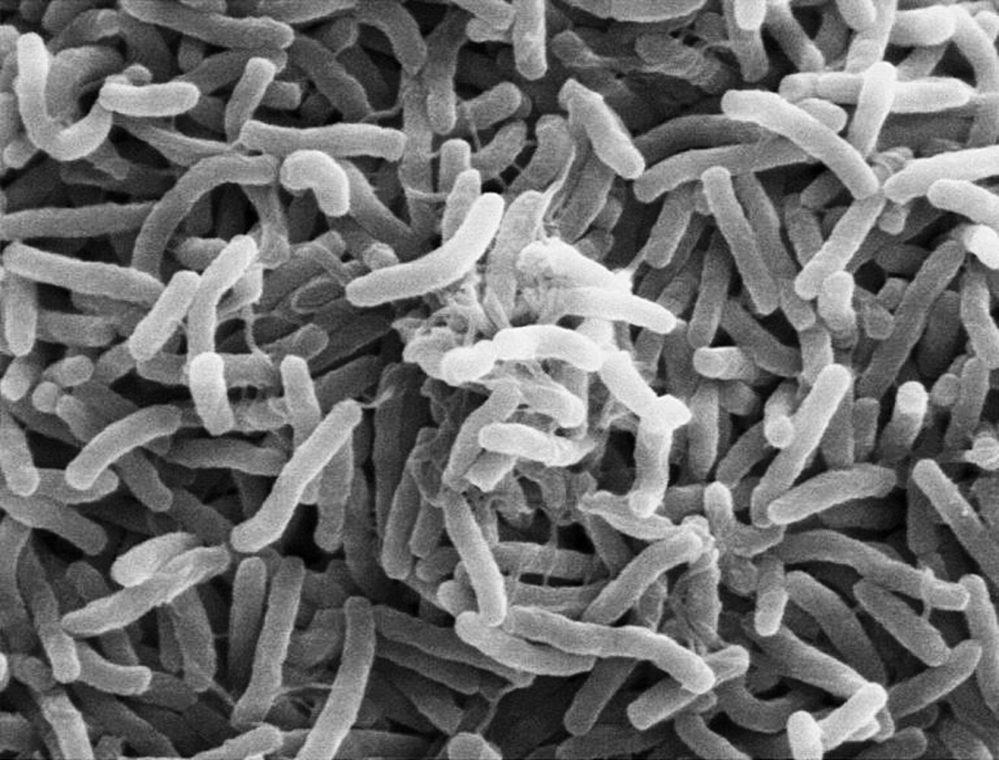

# Infectious gastroenteritis

*Categories: Clinical knowledge > Internal medicine > Gastroenterology > Diseases of the intestine and appendix > Infectious gastroenteritis*

[Original Article Link](https://coursology-qbank.com/amboss/article/oM00pg)

---

## Summary

Infectious <u>gastroenteritis</u> is an inflammation of the <u>gastrointestinal tract</u> that is most commonly caused by <u>viruses</u> (e.g., <u>norovirus</u>, <u>rotavirus</u>, <u>enteric</u> <u>adenovirus</u>). However, it can also be caused by bacteria (e.g., <u>Campylobacter</u>, <u>Salmonella</u>, <u>Shigella</u>, <u>Yersinia</u>, <u>Vibrio cholerae</u>, <u>diarrheagenic Escherichia coli</u>, <u>Clostridioides difficile</u>), fungi, or <u>parasites</u>, such as <u>protozoans</u> (e.g., <u>giardiasis</u>, or <u>cryptosporidiosis</u>) or <u>helminths</u> (e.g., <u>nematodes</u>, or <u>cestodes</u>). Transmission is commonly fecal-oral, foodborne, or waterborne and therefore education on <u>food and water hygiene</u> is crucial for preventing disease. Clinical features can be mild, manifesting as abdominal <u>pain</u> and <u>diarrhea</u>, <u>nausea</u>, and/or <u>vomiting</u>, or severe, e.g., <u>sepsis</u>, intense abdominal <u>pain</u>, and/or significant <u>dehydration</u> from severe <u>diarrhea</u> and/or <u>vomiting</u>. For mild disease courses, diagnostic studies are not usually required, and since the disease is usually <u>self-limiting</u>, patients often only require supportive therapy (e.g., oral rehydration and <u>antiemetics</u>). <u>Stool cultures</u> followed by <u>empiric antibiotic therapy</u> may be considered in patients with <u>severe gastroenteritis</u> and/or <u>risk factors</u> for complicated disease (e.g., those who are <u>immunocompromised</u>).

<u>Infectious gastroenteritis in children</u> and <u>Clostridioides difficile infection</u> are covered separately in their respective articles.

---

## Overview

### Definitions

* Gastroenteritis: inflammation of the <u>gastrointestinal tract</u> that usually manifests with <u>acute diarrhea</u>, <u>vomiting</u>, and/or abdominal <u>pain</u>

* Infectious <u>gastroenteritis</u>: <u>gastroenteritis</u> caused by pathogens; most commonly <u>viruses</u>, but can also be caused by bacteria, <u>parasites</u>, and fungi

### Clinical features of infectious gastroenteritis [[1]](https://coursology-qbank.com/amboss/article/xMYEIp)[[2]](https://coursology-qbank.com/amboss/article/GqYB-J)[[3]](https://coursology-qbank.com/amboss/article/ZtYZXI)[[4]](https://coursology-qbank.com/amboss/article/fjck-X0)

* Mild-to-moderate gastroenteritis

* Abdominal <u>pain</u> with normal <u>abdominal examination</u>

* Mild <u>diarrhea</u>, <u>nausea</u>, and/or <u>vomiting</u>

* Severe gastroenteritis includes: [[2]](https://coursology-qbank.com/amboss/article/GqYB-J)

* Gastrointestinal features

* Bloody stools

* Severe <u>diarrhea</u>, <u>nausea</u>, and/or <u>vomiting</u>

* Severe abdominal cramping and/or tenderness

* Systemic features

* <u>Fever</u> (≥ 38.3°C) or <u>sepsis</u>

* <u>Clinical signs of significant dehydration</u>

* <u>End-organ damage</u>

* Duration > 1 week

### Diagnostics for infectious gastroenteritis [[1]](https://coursology-qbank.com/amboss/article/xMYEIp)[[5]](https://coursology-qbank.com/amboss/article/hUac1P)[[6]](https://coursology-qbank.com/amboss/article/6fajMP)

#### Approach

* <u>Clinical diagnosis</u>

* Perform a thorough history  and <u>physical examination</u>.

* Evaluate for <u>risk factors</u> for specific pathogens.

* Evaluate for <u>clinical features of dehydration and hypovolemia</u>.

* Diagnostic studies are only recommended for the following: [[1]](https://coursology-qbank.com/amboss/article/xMYEIp)[[2]](https://coursology-qbank.com/amboss/article/GqYB-J)[[3]](https://coursology-qbank.com/amboss/article/ZtYZXI)

* Patients with <u>severe gastroenteritis</u> or <u>risk factors</u> for severe illness

* And/or if the results may alter management

> [!WARNING]
> Suspect <u>Shiga toxin-producing E. coli</u> (<u>STEC</u>) <u>gastroenteritis</u> in patients with abdominal <u>pain</u> or tenderness and bloody <u>diarrhea</u> in the absence of <u>fever</u>. [[2]](https://coursology-qbank.com/amboss/article/GqYB-J)

> [!TIP]
> <u>Viral gastroenteritis</u> may be asymptomatic or manifest with nonbloody <u>watery diarrhea</u> and <u>vomiting</u>, which is sometimes accompanied by abdominal <u>pain</u> or cramps, and <u>fever</u>. [[3]](https://coursology-qbank.com/amboss/article/ZtYZXI)

#### <u>Laboratory studies</u> [[1]](https://coursology-qbank.com/amboss/article/xMYEIp)[[4]](https://coursology-qbank.com/amboss/article/fjck-X0)

* <u>BMP</u> and serum <u>electrolytes</u>: may show <u>AKI</u> or <u>electrolyte</u> abnormalities (see “<u>Laboratory findings in dehydration and hypovolemia</u>”)

* <u>CBC</u>

* <u>Leukocytosis</u> with <u>left shift</u>: may indicate an inflammatory bacterial infection

* <u>Eosinophilia</u>: may indicate a parasitic infection caused by invasive <u>helminths</u>

* Stool analysis:  (for <u>inflammatory markers</u>): may show <u>leukocytes</u>, occult blood, and/or <u>lactoferrin</u>  [[1]](https://coursology-qbank.com/amboss/article/xMYEIp)[[4]](https://coursology-qbank.com/amboss/article/fjck-X0)

> [!TIP]
> Testing for <u>leukocytes</u> and/or <u>lactoferrin</u> in the stool in patients with suspected infectious <u>gastroenteritis</u> is controversial and 2017 <u>IDSA</u> guidelines recommend against these studies in patients with acute infectious <u>diarrhea</u>. [[1]](https://coursology-qbank.com/amboss/article/xMYEIp)

#### Diagnostic confirmation

* Indications include:

* <u>Severe gastroenteritis</u> or <u>persistent diarrhea</u>

* Patients with <u>risk factors</u> for severe illness

* Consider for patients with <u>leukocytes</u> and/or <u>lactoferrin</u> in the stool.

* Recommended studies [[3]](https://coursology-qbank.com/amboss/article/ZtYZXI)

* Obtain a <u>stool culture</u> to look for <u>Shigella</u>, <u>Salmonella</u>, <u>Campylobacter</u>, <u>Yersinia</u>, and <u>STEC</u>.

* Alternatively, obtain non-culture-based studies.

* Further studies (in select cases)

* <u>Clostridioides difficile</u> toxin: Obtain for patients with <u>risk factors for C. difficile infection</u> (<u>CDI</u>), e.g., recent history of <u>antibiotic</u> use.

* <u>Blood cultures</u>

* Stool microscopy (e.g., to identify <u>ova</u> and <u>parasites</u>)

* Endoscopy (<u>colonoscopy</u> or <u>sigmoidoscopy</u>) : may show signs of inflammation (e.g., in infectious <u>colitis</u>)

> [!TIP]
> Microbiological studies should be reserved for patients with <u>fever</u>, mucoid or bloody stools, <u>signs of sepsis</u>, <u>immunosuppression</u>, or severe abdominal cramping, and cases in which the identification of a causative <u>pathogen</u> would modify management.

Infectious colitis

### Differential diagnosis

See “<u>Overview of bacterial gastroenteritis</u>,”;  “<u>Overview of viral gastroenteritis</u>,” “<u>Diagnostic workup of diarrhea</u>,” and “<u>Food poisoning</u>.”

### Treatment of infectious gastroenteritis [[1]](https://coursology-qbank.com/amboss/article/xMYEIp)

#### Supportive therapy for gastroenteritis

Infectious <u>gastroenteritis</u> is usually <u>self-limiting</u>. Supportive therapy may suffice for most patients.

* Diet and fluids

* Bland diet: e.g., broths, saltine crackers, boiled vegetables

* <u>Oral rehydration therapy</u> or <u>intravenous fluid therapy</u>: i.e., <u>fluid replacement</u> or <u>fluid resuscitation</u>

* Oral or parenteral <u>electrolyte repletion</u>

* Pharmacotherapy (not routinely recommended)

* Oral or parenteral <u>antiemetics</u> as needed: e.g., <u>ondansetron</u> (<u>off label</u>)  or <u>promethazine</u> DOSAGE)

* Consider antimotility drugs (e.g., <u>loperamide</u> DOSAGE) for immunocompetent adult patients with acute <u>watery diarrhea</u>.

> [!WARNING]
> Antimotility drugs (e.g., <u>loperamide</u>) should be avoided in patients with <u>fever</u> or <u>inflammatory diarrhea</u> because of the risk of developing <u>toxic megacolon</u>.

#### <u>Antibiotic therapy</u> [[1]](https://coursology-qbank.com/amboss/article/xMYEIp)

<u>Antibiotic therapy</u> is not routinely indicated in <u>bacterial gastroenteritis</u>. When indications for <u>empiric antibiotics</u> exist, they should be started after appropriate cultures have been collected.

* Empiric antibiotics for bacterial gastroenteritis

* Indications include: 

* Suspected <u>Shigella</u> infection

* Suspected <u>enteric fever</u>

* High-grade <u>fever</u> or <u>sepsis</u>

* High-risk groups

* Recommended regimens (adult patients) [[2]](https://coursology-qbank.com/amboss/article/GqYB-J)

* <u>Azithromycin</u> (<u>off label</u>) DOSAGE [[2]](https://coursology-qbank.com/amboss/article/GqYB-J)

* <u>Ciprofloxacin</u> DOSAGE [[2]](https://coursology-qbank.com/amboss/article/GqYB-J)

* <u>Trimethoprim/sulfamethoxazole</u> is not recommended because of high resistance rates.

* <u>Targeted therapy</u>: Once a <u>pathogen</u> has been identified, modify therapy accordingly.

* E.g., <u>treatment for C. difficile infection</u>

* Consider discontinuing or adjusting therapy for other pathogens (see relevant sections below for details).

> [!WARNING]
> <u>Antibiotic therapy</u> is contraindicated for <u>enterohemorrhagic E. coli</u>. It may increase the risk of or worsen <u>HUS</u>.

### Complications

* <u>Dehydration</u> (most common; especially severe in <u>shigellosis</u> and <u>cholera</u>)

* <u>Malnutrition</u>

* Permanent carrier status (<u>chronic Salmonella carrier</u>)

* <u>Reactive arthritis</u>

* <u>Postinfectious irritable bowel syndrome</u>

### Prevention of infectious gastroenteritis [[1]](https://coursology-qbank.com/amboss/article/xMYEIp)[[7]](https://coursology-qbank.com/amboss/article/I0cYha0)[[8]](https://coursology-qbank.com/amboss/article/Ef18LT0)

#### General measures

* <u>Food and water hygiene</u>

* Educate patients and caregivers on preventing onward community transmission of infectious gastroenteritis. [[1]](https://coursology-qbank.com/amboss/article/xMYEIp)[[9]](https://coursology-qbank.com/amboss/article/Nea-_j)[[10]](https://coursology-qbank.com/amboss/article/OQcIwX0)

* Regular <u>hand hygiene</u> with soap and water including after changing diapers.

* Clean bathrooms, high-touch, and contaminated areas with bleach-based cleaners.

* Use gloves to handle soiled items and wash them at the highest heat.

* Avoid sharing towels and linens.

* Avoid food preparation for others until symptoms have resolved.  [[11]](https://coursology-qbank.com/amboss/article/W41PRS0)

* Isolate at home until symptoms are resolved.

* For prevention of <u>nosocomial</u> transmission, see “<u>Infection prevention and control</u>.”

* Prophylaxis against select infections (e.g., <u>cystoisosporiasis</u>) is recommended for patients with <u>advanced HIV</u>; see “<u>Primary prevention of opportunistic infections in HIV</u>.”

#### Reporting suspected <u>outbreaks</u> [[12]](https://coursology-qbank.com/amboss/article/X5c9i10)[[13]](https://coursology-qbank.com/amboss/article/qfaCMP)

* Nationally <u>notifiable diseases</u> in the US include: [[12]](https://coursology-qbank.com/amboss/article/X5c9i10)[[13]](https://coursology-qbank.com/amboss/article/qfaCMP)

* <u>Salmonellosis</u>

* <u>Shigellosis</u>

* <u>STEC</u> <u>colitis</u>

* Vibrio (<u>cholera</u> and noncholera species) infections

* Other suspected <u>outbreaks</u> should be reported to local health departments. [[9]](https://coursology-qbank.com/amboss/article/Nea-_j)

#### <u>Vaccination</u> [[1]](https://coursology-qbank.com/amboss/article/xMYEIp)[[5]](https://coursology-qbank.com/amboss/article/hUac1P)

* <u>Infants</u>: <u>rotavirus vaccination</u>

* Specific <u>vaccines</u> (e.g., <u>typhoid vaccine</u>, <u>cholera vaccine</u>) may be recommended for international travelers depending on the destination.

---

## Bacterial gastroenteritis

|  Overview of bacterial gastroenteritis [[6]](https://coursology-qbank.com/amboss/article/6fajMP) |  |  |  |
| --- | --- | --- | --- |
| <u>Pathogen</u> | Pathophysiology | Associations | Stool findings |
| <u>Secretory diarrhea</u> |  |  |  |
| <u>Bacillus cereus</u> |  * <u>Enterotoxin</u> or bacterial invasion shifts water and <u>electrolyte</u> excretion and absorption in the <u>proximal</u> <u>small intestine</u>, which leads to <u>watery diarrhea</u>.   |   * Rice  * Manifests as <u>vomiting</u>    |   * <u>WBC</u> negative  * No blood    |
| <u>Enterotoxigenic E. coli</u> (<u>ETEC</u>) |  * Recent travel  [[5]](https://coursology-qbank.com/amboss/article/hUac1P)   |  |  |
| <u>Clostridium perfringens</u> |  * Undercooked meat and raw legumes   |  |  |
| <u>Staphylococcus aureus</u> |   * Inadequately refrigerated food  * Poor <u>hand hygiene</u> among food preparers    |  |  |
| <u>Vibrio cholerae</u> |   * Undercooked seafood and contaminated water  * Manifests as profuse <u>secretory diarrhea</u>    |  |  |
| Invasive <u>diarrhea</u> |  |  |  |
| <u>Yersinia</u> |  * Pathogens penetrate the <u>mucosa</u> and invade the <u>reticuloendothelial system</u> of the <u>distal</u> <u>small intestine</u>, which leads to <u>enteric fever</u>.   |   * Milk and pork  * May manifest as <u>pseudoappendicitis</u>    |   * <u>WBC</u> positive (fecal mononuclear <u>leukocytes</u>)  * Blood may be present    |
| <u>Salmonella enterica serotype Typhi</u> or <u>Salmonella enterica serotype Paratyphi</u> |   * Recent travel  * Typically manifests in three stages  * <u>Fever</u> with relative <u>bradycardia</u>  * Rose-colored <u>exanthem</u> on the lower chest and abdomen  * <u>Hepatosplenomegaly</u>    |  |  |
| <u>Inflammatory diarrhea</u> |  |  |  |
| <u>Campylobacter</u> |  * Bacteria or cytotoxins damage the <u>colonic</u> <u>mucosa</u>, which leads to blood in the stool and <u>fever</u>.   |   * Most common bacterial <u>pathogen</u> responsible for foodborne <u>gastroenteritis</u> in the US  * Recent travel to low- or middle-income countries    |   * <u>WBC</u> positive (fecal <u>polymorphonuclear leukocytes</u>)  * Blood present    |
| <u>Enterohemorrhagic E. coli</u> (<u>EHEC</u>) |   * Most common infectious trigger of <u>HUS</u>  * Undercooked meat    |  |  |
| <u>Clostridioides difficile</u> |  * <u>Risk factors for CDI</u> (e.g., recent <u>antibiotic</u> use)   |  |  |
| <u>Shigella</u> |   * Second most common infectious trigger of <u>HUS</u>  * Recent travel to low- or middle-income countries    |  |  |
| Noncholera Vibrio species |  * Shellfish   |  |  |
| <u>Salmonella</u> (nontyphoidal) |  * Poultry and eggs   |  |  |

---

## Campylobacter enteritis (campylobacteriosis)

### Overview

* <u>Pathogen</u>

* <u>Campylobacter jejuni</u>, <u>Campylobacter</u> coli

* Curved, gram-negative, <u>oxidase-positive</u> rods with <u>polar flagella</u>

* Optimal growth temperature: 37–42°C [[23]](https://coursology-qbank.com/amboss/article/nCb7sD)

* Most common <u>pathogen</u> responsible for foodborne <u>gastroenteritis</u> in the US [[24]](https://coursology-qbank.com/amboss/article/YTan6P)

* Highly contagious: low infective dose required (> 500 organisms)

* Transmission

* Fecal-oral

* Foodborne (undercooked meat;  and unpasteurized milk; ), contaminated water

* Direct contact with infected animals (i.e., cats, dogs, pigs) or animal products

* <u>Incubation period</u>: 2–4 days

> [!NOTE]
> “There's no camping without a campfire:” Campylobacter jejuni grows best at hot temperatures.

Campylobacter jejuni

### Clinical features

* Duration: up to a week

* High <u>fever</u>, aches, <u>dizziness</u>

* Inflammatory (bloody) <u>diarrhea</u>, especially in children

* Severe abdominal <u>pain</u> may present as <u>pseudoappendicitis</u> or <u>colitis</u>.

### Treatment

* <u>Supportive therapy for gastroenteritis</u>: e.g., bland diet, <u>oral rehydration therapy</u>

* <u>Antibiotic therapy</u>: : <u>macrolides</u>, e.g., <u>erythromycin</u> (<u>off label</u>) DOSAGE or <u>azithromycin</u> (<u>off label</u>) DOSAGE in severe cases  [[4]](https://coursology-qbank.com/amboss/article/fjck-X0)[[25]](https://coursology-qbank.com/amboss/article/WHYP6q)[[26]](https://coursology-qbank.com/amboss/article/J7Ys5q)

### Complications

Complications are more common and severe in patients with <u>HIV</u> (see “<u>HIV-associated conditions</u>” for details).

* <u>Guillain-Barré syndrome</u>

* <u>Reactive arthritis</u>

* <u>Acute abdomen</u>: <u>cholecystitis</u>, <u>pancreatitis</u>

* <u>Bacteremia</u>

---

## Salmonellosis (salmonella gastroenteritis)

This section covers nontyphoidal <u>Salmonella</u>. For <u>S. enterica serotype Typhi</u> and <u>S. enterica serotype Paratyphi</u> <u>enteric fever</u>, see “<u>Typhoid fever</u>.”

### Overview

* Pathogens: <u>Salmonella enterica serotype Enteritidis</u>, <u>Salmonella enterica serotype Typhimurium</u>, <u>Salmonella enterica</u> <u>serotype</u> Heidelberg

* Gram-negative bacteria, <u>obligate pathogens</u>

* Produce <u>hydrogen sulfide</u>

* Do not ferment <u>lactose</u>

* 2nd most common group of pathogens responsible for bacterial foodborne <u>gastroenteritis</u>

* High infectious dose required (104–106 pathogens), depending on the strength of an individual's <u>immune system</u>

* Transmission: foodborne (poultry, raw eggs, and milk), reptiles (e.g., pet turtles or snakes) [[27]](https://coursology-qbank.com/amboss/article/oCb0GD)

* <u>Incubation period</u>: : 0–3 days

* Prevention: no <u>vaccine</u> available

### Clinical features

* Duration: 3–7 days

* <u>Fever</u> (usually resolves within 2 days), chills, <u>headaches</u>, <u>myalgia</u>

* Severe <u>vomiting</u>, abdominal <u>pain</u>, and inflammatory (watery-bloody) <u>diarrhea</u>

### Treatment [[1]](https://coursology-qbank.com/amboss/article/xMYEIp)[[4]](https://coursology-qbank.com/amboss/article/fjck-X0)[[28]](https://coursology-qbank.com/amboss/article/v7YAnq)

* <u>Supportive therapy for gastroenteritis</u>: e.g., bland diet, <u>oral rehydration therapy</u>

* <u>Antibiotic therapy</u>

* Not routinely indicated (usually not indicated in immunocompetent individuals)

* Indications: severe cases of nontyphoidal <u>Salmonella</u> (consider also for high-risk patients ) [[1]](https://coursology-qbank.com/amboss/article/xMYEIp)

* Preferred regimens (usually given for 7–10 days ) [[4]](https://coursology-qbank.com/amboss/article/fjck-X0)

* <u>Fluoroquinolones</u>: e.g., <u>ciprofloxacin</u> (<u>off label</u>) DOSAGE

* OR <u>cephalosporins</u>. e.g., <u>ceftriaxone</u> (<u>off label</u>) DOSAGE

* Alternatives

* <u>Trimethoprim/sulfamethoxazole</u> (<u>off label</u>) DOSAGE [[28]](https://coursology-qbank.com/amboss/article/v7YAnq)

* OR <u>azithromycin</u> (<u>off label</u>) DOSAGE [[28]](https://coursology-qbank.com/amboss/article/v7YAnq)

> [!TIP]
> <u>Antibiotic</u> treatment for <u>salmonellosis</u> prolongs fecal excretion of the <u>pathogen</u>. Therefore, it is only indicated for severe nontyphoidal <u>Salmonella</u> infections (e.g., in patients with systemic manifestations or ≥ 9 episodes of <u>diarrhea</u> per day, and those who require hospitalization).

### Complications

Complications are more frequent in <u>immunocompromised</u> patients, e.g., those with <u>HIV</u>; treatment for complicated <u>salmonellosis</u> (e.g., <u>antibiotic therapy</u>) in patients with <u>HIV</u> should be given in consultation with a specialist.

* <u>Bacteremia</u>

* <u>Chronic Salmonella carriage</u>

* Systemic disease: e.g., <u>osteomyelitis</u>, <u>meningitis</u>, <u>myocarditis</u>, <u>aortitis</u>

* <u>Reactive arthritis</u>

---

## Shigellosis (bacillary dysentery)

### Overview [[29]](https://coursology-qbank.com/amboss/article/fTakJP)

* Pathogens: <u>Shigella dysenteriae</u>, <u>Shigella flexneri</u>, <u>Shigella sonnei</u>

* Gram-negative rods

* Produce <u>Shiga toxin</u> (<u>enterotoxin</u>) and <u>endotoxin</u>

* Invade <u>M cells</u> via <u>pinocytosis</u> and travel from cell to cell via <u>actin filaments</u> (no hematogenous spread)

* Transmission

* Fecal-oral (especially a concern in areas with poor sanitation)

* Oral-anal sexual contact

* Foodborne (unpasteurized milk products and raw unwashed vegetables)

* Contaminated water

* <u>Incubation period</u>: 0–2 days

* <u>Infectivity</u>: highly contagious; very low infective dose required (≥ 10 bacteria)

* Prevention: no <u>vaccine</u> available

### Clinical features

* Duration: 2–7 days

* High <u>fever</u>

* <u>Tenesmus</u>, abdominal cramps

* Profuse inflammatory, mucoid-bloody <u>diarrhea</u>

### Treatment [[1]](https://coursology-qbank.com/amboss/article/xMYEIp)[[4]](https://coursology-qbank.com/amboss/article/fjck-X0)[[28]](https://coursology-qbank.com/amboss/article/v7YAnq)

* <u>Supportive therapy for gastroenteritis</u>: e.g., bland diet, <u>oral rehydration therapy</u>

* <u>Antibiotic therapy</u> 

* Preferred regimens [[1]](https://coursology-qbank.com/amboss/article/xMYEIp)[[28]](https://coursology-qbank.com/amboss/article/v7YAnq)

* <u>Ciprofloxacin</u> DOSAGE [[28]](https://coursology-qbank.com/amboss/article/v7YAnq)

* OR <u>azithromycin</u> (<u>off label</u>) DOSAGE [[28]](https://coursology-qbank.com/amboss/article/v7YAnq)

* OR <u>ceftriaxone</u> (<u>off label</u>) DOSAGE [[28]](https://coursology-qbank.com/amboss/article/v7YAnq)

* Alternative: <u>trimethoprim/sulfamethoxazole</u> DOSAGE [[28]](https://coursology-qbank.com/amboss/article/v7YAnq)

### Complications

* <u>HUS</u>

* <u>Febrile seizures</u>

* <u>Reactive arthritis</u>

* Intestinal complications (e.g., toxic <u>megacolon</u>, <u>colonic</u> perforation, <u>intestinal obstruction</u>, <u>proctitis</u>, <u>rectal prolapse</u>)

---

## Cholera

### Overview

* <u>Pathogen</u>: <u>Vibrio cholerae</u>  

* Most common in developing countries

* Gram-negative, <u>oxidase positive</u>, curved bacterium with a single polar <u>flagellum</u> → production of <u>cholera toxin</u>

* <u>Cholera toxin</u> stimulates <u>adenylate cyclase</u> via activation of Gs → increased cyclic <u>AMP</u> → increased ion (mainly <u>chloride</u>) and water secretion into the intestinal lumen → profuse liquid stools

* Transmission

* Fecal-oral

* Undercooked seafood or contaminated water (e.g., unseparated drinking water and sewage systems)

* <u>Incubation period</u>: 0–2 days

* <u>Infectivity</u>

* Acid-labile (grows well in an alkaline medium)

* High infective dose required (over 108 pathogens)

* <u>Gastric acid</u> provides a natural barrier against <u>V. cholerae</u> infection; therefore, the infective dose in individuals with reduced gastric acidity is lower.

Vibrio cholerae

Vibrio cholerae

### Clinical features

* Low-grade <u>fever</u>, <u>vomiting</u>

* Profuse “rice-water” stools

### Diagnosis

* <u>Dipstick</u> (rapid test; initial test)

* <u>Stool culture</u> (confirmatory)

### Treatment [[1]](https://coursology-qbank.com/amboss/article/xMYEIp)[[28]](https://coursology-qbank.com/amboss/article/v7YAnq)[[30]](https://coursology-qbank.com/amboss/article/PTaWIP)

* <u>Supportive therapy for gastroenteritis</u>: Urgent <u>initial fluids for dehydration and hypovolemia</u> (e.g., <u>oral rehydration solution</u>, <u>IV fluids</u>)  [[31]](https://coursology-qbank.com/amboss/article/tfaXLP)

* <u>Antibiotic therapy</u>: Treatment should be based on culture susceptibility testing. [[1]](https://coursology-qbank.com/amboss/article/xMYEIp)[[28]](https://coursology-qbank.com/amboss/article/v7YAnq)

* Indications: severe cases

* Preferred regimen: <u>doxycycline</u> DOSAGE [[30]](https://coursology-qbank.com/amboss/article/PTaWIP)

* Alternative regimens [[1]](https://coursology-qbank.com/amboss/article/xMYEIp)[[28]](https://coursology-qbank.com/amboss/article/v7YAnq)

* <u>Azithromycin</u> (<u>off label</u>) DOSAGE [[28]](https://coursology-qbank.com/amboss/article/v7YAnq)

* OR <u>tetracycline</u> DOSAGE [[28]](https://coursology-qbank.com/amboss/article/v7YAnq)

* OR <u>trimethoprim/sulfamethoxazole</u> (<u>off label</u>) DOSAGE [[28]](https://coursology-qbank.com/amboss/article/v7YAnq)

* OR <u>ciprofloxacin</u> (<u>off label</u>) DOSAGE [[30]](https://coursology-qbank.com/amboss/article/PTaWIP)

### Complications

* <u>Severe dehydration</u>

* <u>Pneumonia</u> may occur in children.

* <u>Cholera</u> sicca (rare): intestinal <u>paralysis</u> and accumulation of liquid in the intestinal lumen → circulatory collapse and high <u>mortality rate</u>

---

## Yersiniosis

### Overview

* Pathogens: <u>Yersinia enterocolitica</u>, <u>Yersinia pseudotuberculosis</u> [[32]](https://coursology-qbank.com/amboss/article/4Ta3IP)

* Gram-negative, rod-shaped, <u>pleomorphic</u> bacteria; <u>obligate pathogens</u>

* High infective dose required (109pathogens)

* Transmission

* Foodborne (e.g., raw/undercooked pork, unpasteurized milk products)

* Contaminated water

* Direct/indirect contact with infected animal (e.g., dogs, pigs, rodents) and/or their feces [[32]](https://coursology-qbank.com/amboss/article/4Ta3IP)

* <u>Incubation period</u>: 4–6 days [[32]](https://coursology-qbank.com/amboss/article/4Ta3IP)

### Clinical features

* Duration: 12–22 days

* Low-grade <u>fever</u>, <u>vomiting</u>

* Invasive <u>diarrhea</u> (may be bloody in severe cases) [[6]](https://coursology-qbank.com/amboss/article/6fajMP)

* Pseudoappendicitis: <u>mesenteric lymphadenitis</u>, particularly in the <u>ileum</u>, with typical <u>signs of appendicitis</u>

### Diagnosis

* Direct <u>pathogen</u> detection in culture or <u>cold enrichment</u>

### Treatment [[1]](https://coursology-qbank.com/amboss/article/xMYEIp)[[32]](https://coursology-qbank.com/amboss/article/4Ta3IP)

* <u>Supportive therapy for gastroenteritis</u>: e.g., bland diet, <u>oral rehydration therapy</u>

* <u>Antibiotic therapy</u>: Treatment should be based on culture susceptibility testing.

* Indications: severe cases

* Recommended regimens

* <u>Trimethoprim/sulfamethoxazole</u> (<u>off label</u>) DOSAGE [[28]](https://coursology-qbank.com/amboss/article/v7YAnq)

* OR <u>fluoroquinolones</u>: e.g., <u>ciprofloxacin</u> (<u>off label</u>) DOSAGE [[28]](https://coursology-qbank.com/amboss/article/v7YAnq)

* OR <u>third-generation cephalosporins</u>: e.g., <u>cefotaxime</u> (<u>off label</u>)

### Complications

Particularly common in patients with <u>HLA-B27</u>

* <u>Reactive arthritis</u>

* <u>Erythema nodosum</u>

* <u>Acute abdomen</u>: <u>appendicitis</u>, <u>bowel perforation</u>, <u>toxic megacolon</u>, <u>cholangitis</u>

* <u>Bacteremia</u>

---

## Clostridium perfringens enterocolitis

### Overview

* <u>Pathogen</u>: <u>Clostridium perfringens</u> 

* Gram-positive, anaerobic

* <u>Spore-forming</u> rod-shaped bacterium → produce <u>exotoxins</u> [[33]](https://coursology-qbank.com/amboss/article/MTaMrP)

* Transmission: foodborne (undercooked or poorly refrigerated meat, legumes)

* <u>Incubation period</u>: 6–24 hours

### Clinical features

* Duration: < 24 hours

* Severe abdominal cramping

* <u>Watery diarrhea</u>

### Diagnosis

* Toxin detection in <u>stool cultures</u>

### Treatment

* <u>Supportive therapy for gastroenteritis</u>: e.g., bland diet, <u>oral rehydration therapy</u>

### Complications

* Clostridial necrotizing enteritis

* Requires <u>antibiotic therapy</u>: <u>penicillin</u>, <u>metronidazole</u>

* <u>Surgery</u> may be required for complicated and/or refractory disease (e.g., perforation)

---

## Noncholera Vibrio infection

### Overview

* <u>Pathogen</u>

* Vibrio parahaemolyticus;  : non-<u>lactose</u> fermenter, gram-negative <u>bacilli</u>

* Vibrio vulnificus: <u>lactose fermenter</u>, gram-negative <u>bacilli</u>

* Transmission

* Foodborne (raw or undercooked shellfish)

* Wounds infected by contaminated sea water

* <u>Incubation period</u>: : 12–52 hours

### Clinical features

* <u>Inflammatory diarrhea</u>

* Low-grade <u>fever</u>, <u>vomiting</u>, abdominal <u>pain</u>

* <u>Cellulitis</u>, <u>bullous</u> <u>skin</u> lesions

### Treatment [[4]](https://coursology-qbank.com/amboss/article/fjck-X0)[[35]](https://coursology-qbank.com/amboss/article/6jcjYc0)[[36]](https://coursology-qbank.com/amboss/article/Dkc1Jc0)

* <u>Supportive therapy for gastroenteritis</u>: e.g., bland diet, <u>oral rehydration therapy</u>

* <u>Surgical debridement</u>: may be needed in patients with severe wound infections

* <u>Antibiotic therapy</u>

* Indications

* <u>Severe gastroenteritis</u> due to <u>V. parahaemolyticus</u>

* <u>Gastroenteritis</u> due to <u>V. vulnificus</u>

* Wound infections due to Vibrio species

* Suggested regimen: give for 7–14 days

* <u>Doxycycline</u> (<u>off label</u>)

* OR <u>fluoroquinolone</u>: e.g., <u>ciprofloxacin</u> (<u>off label</u>) DOSAGE [[4]](https://coursology-qbank.com/amboss/article/fjck-X0)

* For patients with <u>V. vulnificus</u> and/or wound infections, add a <u>third-generation cephalosporin</u>: e.g., <u>ceftazidime</u> (<u>off label</u>) DOSAGE . [[36]](https://coursology-qbank.com/amboss/article/Dkc1Jc0)

> [!TIP]
> Infections caused by Vibrio species are often <u>self-limiting</u> and may only require <u>supportive care</u>.

### Complications

* Complications of noncholera Vibrio infection are common in patients with high levels of free <u>iron</u> (e.g., <u>liver</u> disease, <u>hemochromatosis</u>), <u>diabetes</u>, or <u>immunocompromise</u>.

* <u>Septic shock</u> and <u>necrotizing fasciitis</u> associated with <u>Vibrio vulnificus</u> infection (rare)

---

## Cystoisosporiasis (isosporiasis)

### Overview [[40]](https://coursology-qbank.com/amboss/article/r3VfP80)[[41]](https://coursology-qbank.com/amboss/article/RjVlZu0)

* <u>Pathogen</u>: <u>Cystoisospora belli</u>; formerly known as <u>Isospora belli</u> 

* Worldwide distribution, but commonly found in tropical and subtropical areas (e.g., Central and South America, Southeast Asia, the Caribbean, India, Africa)

* High risk of chronic illness in <u>immunocompromised individuals</u> (e.g., those with <u>HIV</u>)

* Transmission: contaminated food and/or water

* <u>Infectivity</u>: <u>Oocytes</u> shed in feces and become infective after maturing in the environment for 1–2 days

* Prevention: See "<u>Primary prevention of opportunistic infections in HIV</u>."

### Clinical features [[40]](https://coursology-qbank.com/amboss/article/r3VfP80)[[41]](https://coursology-qbank.com/amboss/article/RjVlZu0)

* Usually <u>self-limited</u> in immunocompetent individuals

* Watery, nonbloody <u>diarrhea</u> 

* Most common manifestation

* May last for > 1 month; typically in patients with <u>CD4 counts</u> < 200 cells/mm3 [[41]](https://coursology-qbank.com/amboss/article/RjVlZu0)

* Abdominal <u>pain</u> and cramping

* <u>Anorexia</u>

* <u>Nausea and vomiting</u>

* Low-grade <u>fever</u>

* Severe disease is associated with: 

* <u>Severe dehydration</u>

* Weight loss

* <u>Malabsorption</u>

> [!TIP]
> Chronic <u>cystoisosporiasis</u> infection lasting > 1 month is an <u>AIDS-defining condition</u> in individuals with <u>HIV</u>. [[43]](https://coursology-qbank.com/amboss/article/kNXmYA)

### Diagnostics [[40]](https://coursology-qbank.com/amboss/article/r3VfP80)[[41]](https://coursology-qbank.com/amboss/article/RjVlZu0)

<u>Oocyst</u> shedding is intermittent; repeat stool examinations and stool sample concentration procedures may be necessary.

* <u>Stool microscopy</u>: large, ellipsoidal <u>oocysts</u>, 25–30 μm in diameter [[44]](https://coursology-qbank.com/amboss/article/G_dBps0)

* UV fluorescence microscopy: <u>Oocyst</u> walls autofluoresce.

* Modified <u>acid-fast stain</u>: <u>Oocysts</u> stain bright red.

* <u>Gastrointestinal pathogen panel</u>: ↑ <u>sensitivity</u> compared with microscopy

* Upper GI sampling: Consider if there is high clinical suspicion but negative stool studies.

* <u>Duodenal aspirate</u>: detection of <u>oocysts</u>

* Small-bowel <u>biopsy</u> or <u>string test</u>: direct <u>parasite</u> identification

### Management [[41]](https://coursology-qbank.com/amboss/article/RjVlZu0)

The following treatment recommendations are based on guidelines for people living with <u>HIV</u>. [[41]](https://coursology-qbank.com/amboss/article/RjVlZu0)

#### Acute infection

* <u>Supportive care</u>

* Fluid and <u>electrolyte</u> supplementation for individuals with <u>dehydration</u>

* <u>Nutritional support</u> for patients with <u>malnutrition</u>

* First-line <u>antibiotics</u>: <u>trimethoprim/sulfamethoxazole</u> (<u>off-label</u>) DOSAGE [[41]](https://coursology-qbank.com/amboss/article/RjVlZu0)

* Consider IV administration for patients with <u>malabsorption</u>.

* Increase daily dose and/or extend treatment duration in patients with worsening or persistent symptoms.

* Alternative treatments: for sulfa-intolerant patients

* <u>Pyrimethamine</u> (<u>off-label</u>) DOSAGE PLUS <u>leucovorin</u> (<u>off-label</u>) DOSAGE [[41]](https://coursology-qbank.com/amboss/article/RjVlZu0)

* <u>Ciprofloxacin</u> (<u>off-label</u>) DOSAGE [[41]](https://coursology-qbank.com/amboss/article/RjVlZu0)

#### Prophylaxis

* Indication: <u>HIV</u> and <u>CD4 count</u> < 200 cells/mm³

* First-line <u>antibiotics</u>: <u>trimethoprim/sulfamethoxazole</u> (<u>off-label</u>) DOSAGE [[41]](https://coursology-qbank.com/amboss/article/RjVlZu0)

* Alternative treatments

* Sulfa-tolerant patients: <u>trimethoprim/sulfamethoxazole</u> (<u>off-label</u>) DOSAGE [[41]](https://coursology-qbank.com/amboss/article/RjVlZu0)

* Sulfa–intolerant patients

* First line: <u>pyrimethamine</u> (<u>off-label</u>) DOSAGE PLUS <u>leucovorin</u> (<u>off-label</u>) DOSAGE [[41]](https://coursology-qbank.com/amboss/article/RjVlZu0)

* Second line: <u>ciprofloxacin</u> (<u>off-label</u>) DOSAGE [[41]](https://coursology-qbank.com/amboss/article/RjVlZu0)

* Discontinuation: Consider for patients on <u>ART</u> who meet the following criteria [[41]](https://coursology-qbank.com/amboss/article/RjVlZu0)

* Sustained <u>CD4 count</u> > 200 cells/mm³ for > 6 months

* No evidence of active infection

### Complications [[41]](https://coursology-qbank.com/amboss/article/RjVlZu0)

* <u>Electrolyte</u> derangements (e.g., <u>hypokalemia</u>)

* <u>Acalculous cholecystitis</u>

* <u>AIDS cholangiopathy</u>

* <u>Reactive arthritis</u>

* Extraintestinal dissemination (e.g., to the <u>biliary tract</u>, <u>lymph nodes</u>, <u>liver</u>, and/or <u>spleen</u>)

---

## Cryptosporidiosis

### Overview [[42]](https://coursology-qbank.com/amboss/article/SSdy_60)

* <u>Pathogen</u> 

* <u>Cryptosporidium</u> species, most commonly <u>C. hominis</u>, <u>C. parvum</u>, or C. meleagridis

* Highest risk of chronic infection in <u>immunocompromised individuals</u>, e.g., those with <u>HIV</u> (typically at <u>CD4 counts</u> < 100 cells/mm³)

* Transmission 

* Fecal-oral

* Contaminated water

* Person-to-person (e.g., through sexual contact)

### Clinical features [[42]](https://coursology-qbank.com/amboss/article/SSdy_60)

* Chronic, <u>watery diarrhea</u> (lasting > 1 month;  in <u>immunocompromised</u> patients, e.g., those with <u>HIV</u>)

* <u>Nausea</u>

* Abdominal <u>pain</u>

### Diagnostics [[42]](https://coursology-qbank.com/amboss/article/SSdy_60)

<u>Oocyst</u> shedding is intermittent; repeat stool examinations and stool sample concentration procedures may be necessary.

* <u>Stool microscopy</u>; : spherical, homogeneously-stained <u>acid-fast</u> <u>oocysts</u>, 4–5 μm in diameter [[44]](https://coursology-qbank.com/amboss/article/G_dBps0)

* <u>Gastrointestinal pathogen panel</u>

### Treatment [[42]](https://coursology-qbank.com/amboss/article/SSdy_60)

* Symptomatic care (e.g., <u>oral rehydration solution</u> and antimotility agents)

* Consider <u>antiparasitic therapy</u> (e.g., <u>nitazoxanide</u>  DOSAGE).

---