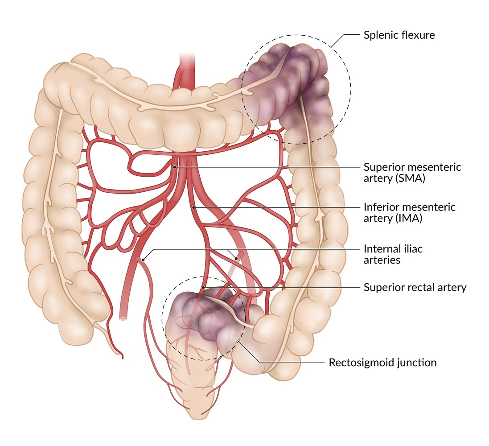
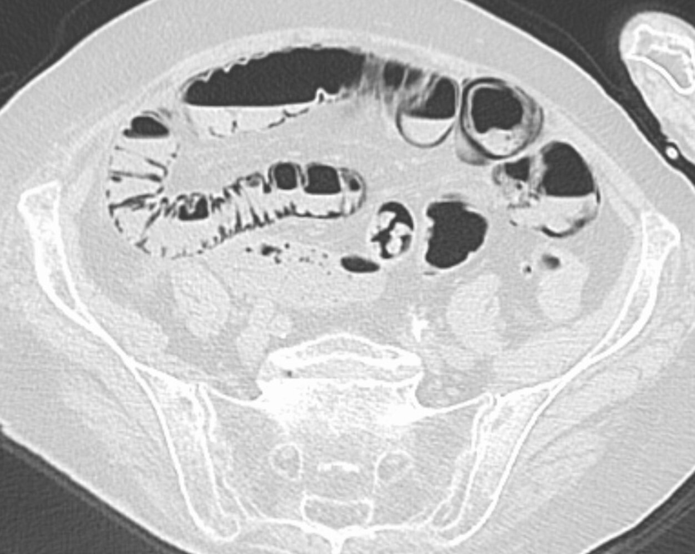
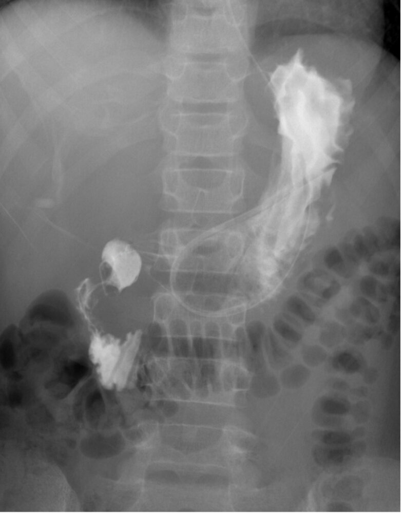
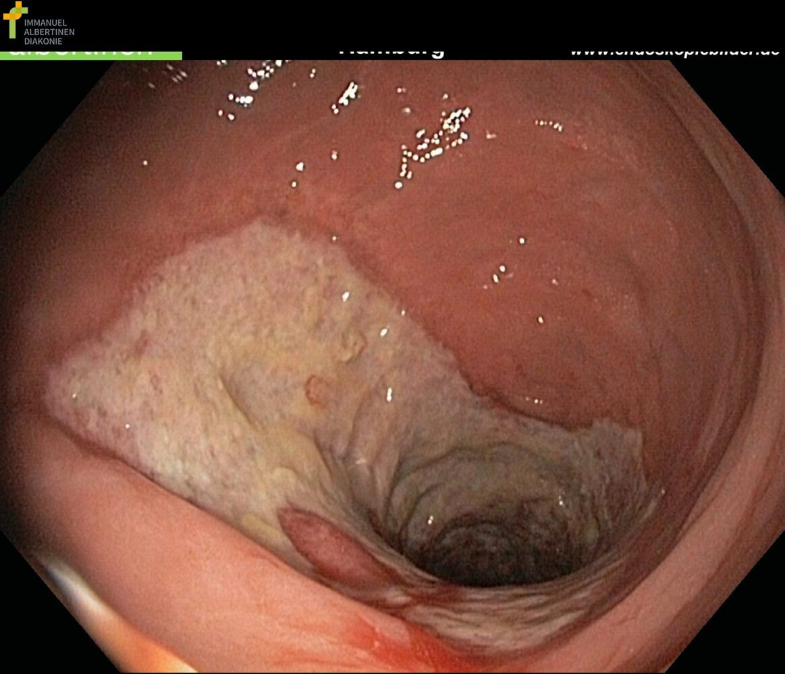
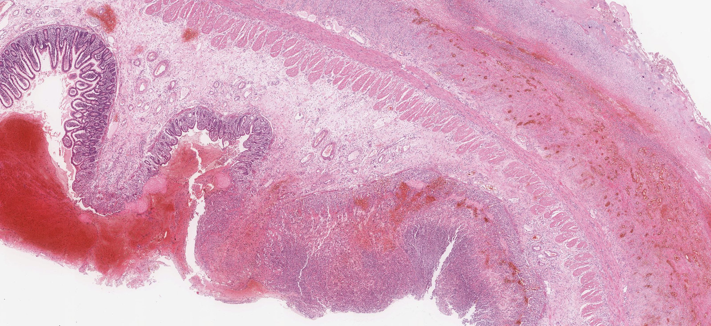
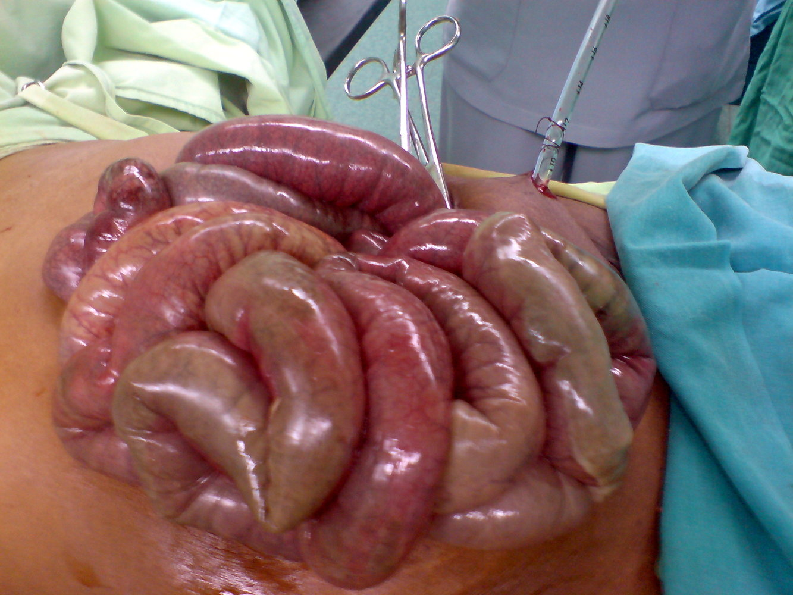
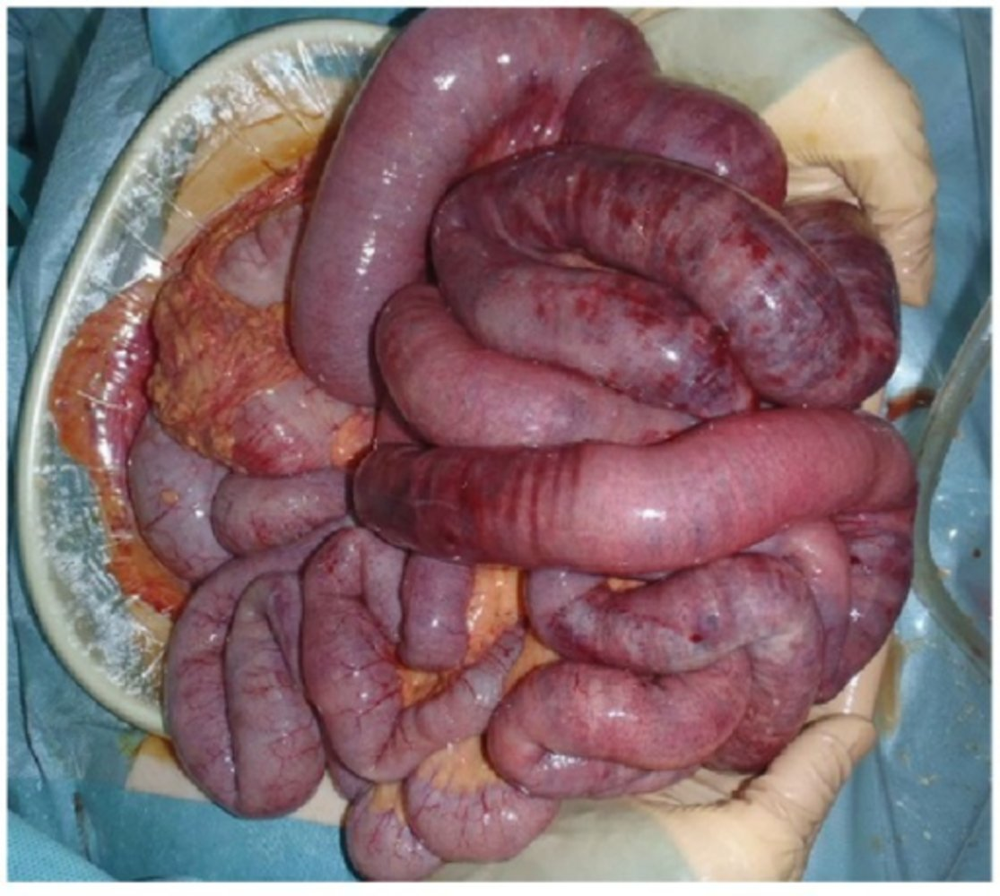
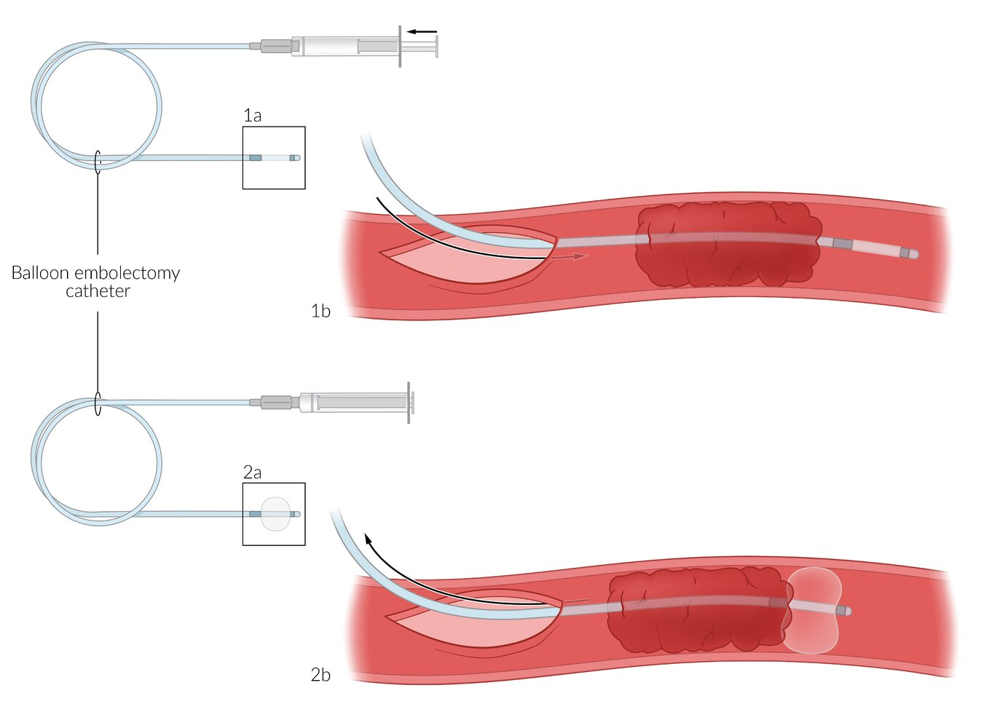

# Intestinal ischemia

*Categories: Clinical knowledge > Internal medicine > Gastroenterology > Diseases of the intestine and appendix > Intestinal ischemia*

[Original Article Link](https://coursology-qbank.com/amboss/article/cS0aA2)

---

## Summary

Intestinal <u>ischemia</u> occurs if bowel <u>perfusion</u> cannot meet the metabolic demands of the intestine. This relative <u>hypoperfusion</u> may be the result of <u>atherosclerosis</u>, thromboembolic disease, or severe systemic <u>hypotension</u>. Intestinal <u>ischemia</u> is often classified based on its onset and location: <u>acute mesenteric ischemia</u> (<u>AMI</u>), <u>chronic mesenteric ischemia</u> (<u>CMI</u>), or <u>colon ischemia</u> (<u>ischemic colitis</u>). Each type has a different manifestation and treatment. <u>AMI</u> is a vascular emergency and manifests with sudden, severe abdominal <u>pain</u>; <u>CMI</u> manifests with chronic recurrent <u>postprandial</u> abdominal <u>pain</u>. <u>Colon ischemia</u> manifests with cramping abdominal <u>pain</u> and bloody <u>diarrhea</u> and is often <u>self-limited</u>, though, rarely, it may progress to fulminant bowel <u>necrosis</u>. Diagnosis is primarily made with <u>cross-sectional imaging</u> and <u>CT angiography</u> (<u>CTA</u>). <u>Laboratory studies</u> are used to determine disease severity and monitor the effects of resuscitation. Early diagnosis, surgical consultation, and definitive treatment with urgent surgical or endovascular <u>revascularization</u> are essential in <u>AMI</u>, which has a <u>mortality rate</u> of > 50%. Patients with <u>CMI</u> have a more favorable prognosis but still benefit from timely <u>revascularization</u>. <u>Colon ischemia</u> is primarily managed with <u>supportive care</u> and monitoring for symptom progression. <u>Bowel perforation</u>, intestinal <u>infarct</u>, and/or <u>sepsis</u> are associated with a poor prognosis, regardless of the type of intestinal <u>ischemia</u>.

---

## Overview

| Overview of intestinal ischemia |  |  |  |
| --- | --- | --- | --- |
| Types | <u>Colon ischemia</u> | <u>Acute mesenteric ischemia</u> | <u>Chronic mesenteric ischemia</u> |
| Etiology |   * Nonocclusive disease (∼ 95%)  * Acute <u>hypoperfusion</u> (e.g., due to hemorrhage, <u>sepsis</u>, <u>surgery</u>, vasoconstrictive drugs) leads to <u>ischemia</u>.  * Typically an exacerbation of preexisting occlusion due to <u>atherosclerosis</u>  * Occlusive disease (e.g., <u>arterial thromboembolism</u>)    |   * Occlusive disease (∼ 80%)  * Acute <u>mesenteric</u> <u>artery</u> embolism (e.g., due to <u>atrial fibrillation</u>)  * <u>Acute mesenteric artery thrombosis</u> (e.g., due to <u>visceral</u> <u>atherosclerosis</u>)  * <u>Mesenteric venous thrombosis</u> (e.g., due to <u>hypercoagulable states</u>)  * Nonocclusive disease (∼ 20%)  * Acute <u>hypoperfusion</u> in critically ill patients leads to <u>ischemia</u>.  * Typically an exacerbation of preexisting occlusion due to <u>atherosclerosis</u>    |  * Occlusive disease: slowly progressing stenosis most commonly caused by <u>atherosclerosis</u> (smoking, <u>dyslipidemia</u>)   |
| Sites of <u>ischemia</u> |  * <u>Watershed areas</u> in the <u>colon</u> (i.e., the <u>splenic flexure</u> and the rectosigmoid junction)   |   * <u>Superior mesenteric artery</u> (∼ 90%)  * <u>Superior mesenteric vein</u> (< 10%)    |  * Main <u>mesenteric</u> <u>arteries</u> (SMA, <u>IMA</u>, and/or <u>celiac artery</u>; typically ≥ 2 affected)   |
| Clinical features |   * Sudden-onset cramping abdominal <u>pain</u> (usually <u>left lower quadrant</u>)  * Bloody <u>diarrhea</u> within 24 hours of symptom onset    |   * Severe periumbilical <u>pain out of proportion</u> to <u>physical examination</u>  * <u>Diarrhea</u> (bloody in later stages)  * Cause-specific  * <u>Atrial fibrillation</u> (suggests embolism)  * History of symptoms consistent with <u>chronic mesenteric ischemia</u> (suggests <u>thrombosis</u>)    |   * <u>Postprandial</u> epigastric <u>pain</u>  * Food aversion  * Weight loss  * Abdominal <u>bruit</u>    |
| Diagnostic tests |   * CT abdomen with IV and oral contrast (all cases)  * Bowel wall thickening  * <u>Pneumatosis intestinalis</u>  * <u>Thumbprint sign</u>  * <u>Colonoscopy</u> (<u>confirmatory test</u> for mild to moderate cases): <u>edematous</u> and <u>friable</u> <u>mucosa</u>  * <u>CT angiography</u> (<u>confirmatory test</u> for severe cases)    |  * <u>CT angiography</u> of the abdomen and <u>pelvis</u>  * Embolism, <u>thrombosis</u>, stenosis, or dissection of <u>mesenteric vessels</u>  * Bowel wall thickening, <u>hypoperfusion</u>, hemorrhage  * <u>Pneumatosis intestinalis</u>   |   * <u>Duplex ultrasound</u> of the <u>mesenteric</u> <u>arteries</u> (first test)  * <u>CT angiography</u> (<u>confirmatory test</u>)    |
|  * Nonspecific laboratory findings (depend on severity): e.g., <u>leukocytosis</u>, <u>metabolic acidosis</u>, elevated <u>lactate</u>   |  |  |  |
| Management |   * Mild, nongangrenous (∼ 80%): <u>supportive care</u> (e.g., <u>IV fluids</u>), resolves spontaneously  * Severe, gangrenous  * <u>Broad-spectrum antibiotics</u>  * <u>Colonic</u> resection    |   * <u>Supportive care</u> (e.g., <u>IV fluids</u>, <u>nasogastric tube</u>, <u>NPO</u>)  * <u>Broad-spectrum antibiotics</u>  * <u>Parenteral anticoagulation</u> (<u>unfractionated heparin</u>)  * Cause and severity-specific  * Endovascular <u>revascularization</u> (<u>thrombosis</u> and embolism in hemodynamically stable patients)  * <u>Emergency laparotomy</u> and <u>bowel resection</u> (<u>signs of peritonitis</u>, intestinal <u>infarct</u>, or <u>hemodynamic instability</u>)  * Continued anticoagulation (venous <u>thrombosis</u>)    |   * Frequent, small meals and a low-fat diet  * Risk reduction (e.g., <u>smoking cessation</u>)  * Endovascular or surgical <u>revascularization</u>    |

---

## Colon ischemia

### Definition [[1]](https://coursology-qbank.com/amboss/article/0rYefq)[[2]](https://coursology-qbank.com/amboss/article/pJcLEW0)[[3]](https://coursology-qbank.com/amboss/article/JJcsEW0)

* Acute or chronic <u>hypoperfusion</u> of the <u>colon</u>; typically transient and <u>self-limited</u> (nongangrenous form), but can also result in severe acute <u>ischemia</u> with bowel <u>infarction</u> (gangrenous form)

* Often used interchangeably with the term <u>ischemic colitis</u>.

### <u>Epidemiology</u> [[2]](https://coursology-qbank.com/amboss/article/pJcLEW0)[[4]](https://coursology-qbank.com/amboss/article/dSXoAx)

* Most common type of intestinal <u>ischemia</u>

* Most commonly affects individuals > 60 years of age

* ∼ 80% of cases are nongangrenous, resolving without <u>surgery</u>

* Isolated right-sided <u>colon ischemia</u> (IRCI): 10–25% of cases  [[5]](https://coursology-qbank.com/amboss/article/q01CS20)

### Etiology [[3]](https://coursology-qbank.com/amboss/article/JJcsEW0)[[6]](https://coursology-qbank.com/amboss/article/qJcCEW0)

* Causes

* Most commonly (∼ 95%) caused by transient <u>hypoperfusion</u> due to nonocclusive disease

* Less commonly caused by occlusive disease (arterial <u>thromboembolism</u> or <u>mesenteric venous thrombosis</u>)

* <u>Risk factors</u>

* <u>Hypotension</u>, <u>hypovolemia</u>: e.g., due to <u>sepsis</u>, <u>dehydration</u>, hemorrhage

* Chronic disease: e.g., <u>diabetes mellitus</u>, cardiovascular disease, <u>renal insufficiency</u>

* <u>Thrombophilia</u>: e.g., in <u>antiphospholipid syndrome</u>

* <u>Surgery</u>: e.g., <u>aortic aneurysm</u> repair; , abdominal <u>surgery</u> affecting <u>mesenteric</u> <u>arteries</u>, cardiac <u>surgery</u> [[7]](https://coursology-qbank.com/amboss/article/CJcqwW0)

* Medications and <u>recreational drug</u> use: e.g., vasoconstrictive drugs, immunomodulators, <u>cocaine</u>

* <u>Constipation</u>, <u>irritable bowel syndrome</u>, <u>colonic</u> obstruction

> [!TIP]
> Older patients with <u>risk factors for atherosclerosis</u> are at especially high risk for developing <u>colon ischemia</u>. [[8]](https://coursology-qbank.com/amboss/article/6JcjEW0)

> [!TIP]
> Severe abdominal <u>pain</u> and bloody <u>diarrhea</u> after an <u>abdominal aortic aneurysm repair</u> is a classic manifestation of <u>colon ischemia</u>.

### Pathophysiology [[4]](https://coursology-qbank.com/amboss/article/dSXoAx)[[6]](https://coursology-qbank.com/amboss/article/qJcCEW0)

* Intestinal blood flow of the <u>superior mesenteric artery</u> (SMA) and/or <u>inferior mesenteric artery</u> (<u>IMA</u>) is acutely compromised → intestinal <u>hypoxia</u> → intestinal wall damage → <u>mucosal</u> inflammation and possibly bleeding → possible progression to <u>infarction</u> and <u>necrosis</u> (gangrenous <u>colon ischemia</u>) → disruption of the <u>mucosal</u> barrier and perforation → release of bacteria, toxins, and vasoactive substances → life-threatening <u>sepsis</u>

* Tissue damage depends on the severity and duration of <u>perfusion</u> disruption.

* Nongangrenous <u>colon ischemia</u> (<u>mucosal</u> or <u>submucosal</u> <u>ischemia</u>): 80–85% of cases; typically reversible

* Gangrenous <u>colon ischemia</u> (<u>transmural</u> <u>ischemia</u>): 15–20% of cases; typically irreversible

* Tissue damage may be exacerbated by <u>reperfusion injury</u>. [[9]](https://coursology-qbank.com/amboss/article/xJcEwW0)

* Sites of compromise

* <u>Superior mesenteric artery</u>

* <u>Inferior mesenteric artery</u>

* Middle and inferior rectal <u>arteries</u>

* Watershed areas in the <u>colon</u> (i.e., the <u>splenic flexure</u> and the rectosigmoid junction) are at high risk for <u>ischemia</u>.    [[2]](https://coursology-qbank.com/amboss/article/pJcLEW0)[[10]](https://coursology-qbank.com/amboss/article/FAcglU0)

> [!TIP]
> Injury to the intestinal <u>mucosa</u> can occur after just 20 minutes of <u>ischemia</u>; <u>transmural</u> <u>infarction</u> and <u>gangrene</u> occur after 8–16 hours of <u>ischemia</u>. [[6]](https://coursology-qbank.com/amboss/article/qJcCEW0)

Watershed areas in colon ischemia

### Clinical features [[2]](https://coursology-qbank.com/amboss/article/pJcLEW0)[[3]](https://coursology-qbank.com/amboss/article/JJcsEW0)

* Classic presentation of colon ischemia

* Sudden onset of cramping abdominal <u>pain</u> (usually in the <u>left lower quadrant</u>)

* Urgent need to defecate

* Bloody <u>diarrhea</u> or <u>rectal bleeding</u> within 24 hours of symptom onset

* Symptoms resolve within 2–3 days.

* Signs of gangrenous <u>colon ischemia</u>

* Progressive abdominal tenderness

* <u>Peritoneal signs</u>

* <u>Fever</u>

* <u>Ileus</u> (absent <u>bowel sounds</u>)

* Signs of systemic complications

* <u>Acute abdomen</u> with <u>abdominal guarding</u> and <u>rebound tenderness</u>

* Systemic inflammatory response and/or signs of <u>septic shock</u>

* <u>Hypovolemic shock</u> (e.g, due to <u>dehydration</u> or hemorrhage)

> [!WARNING]
> Consider <u>colon ischemia</u> in any patient with abdominal <u>pain</u> and/or bloody <u>diarrhea</u> without a clear infectious etiology, as many do not have the <u>classic presentation of colon ischemia</u>. [[3]](https://coursology-qbank.com/amboss/article/JJcsEW0)

> [!TIP]
> In <u>colon ischemia</u>, <u>pain</u> is typically milder and more laterally located than in small intestinal <u>ischemia</u>. [[3]](https://coursology-qbank.com/amboss/article/JJcsEW0)

### Red flags in colon ischemia

The following are poor prognostic markers:

* Clinical presentation

* Male sex

* Abdominal <u>pain</u> without <u>rectal bleeding</u>

* <u>Hypotension</u> (<u>SBP</u> < 90 mm Hg)

* <u>Tachycardia</u> (HR > 100 bpm)

* Diagnostics

* <u>WBC</u> > 15,000/mm³

* <u>Hemoglobin</u> < 12 g/dL

* <u>LDH</u> > 350 U/L

* <u>BUN</u> > 20 mg/dL

* Serum <u>sodium</u> < 136 mEq/L

* <u>Mucosal</u> <u>ulceration</u> on <u>colonoscopy</u>

### Classification

The severity of <u>colon ischemia</u> determines the appropriate approach to diagnostics and treatment.  [[2]](https://coursology-qbank.com/amboss/article/pJcLEW0)

* Mild colon ischemia: <u>classic presentation of colon ischemia</u>, no IRCI, and no <u>colon ischemia red flags</u>

* Moderate colon ischemia: 1–3 <u>colon ischemia red flags</u>

* Severe colon ischemia

* > 3 <u>colon ischemia red flags</u>

* OR any of the following:

* <u>Signs of peritonitis</u> on examination

* <u>Pneumatosis intestinalis</u> on imaging

* <u>Gangrene</u> on <u>colonoscopy</u>

* IRCI or pancolonic <u>ischemia</u>

### Diagnostics [[2]](https://coursology-qbank.com/amboss/article/pJcLEW0)[[3]](https://coursology-qbank.com/amboss/article/JJcsEW0)[[11]](https://coursology-qbank.com/amboss/article/I01Yh20)

#### Approach

* All patients with suspected <u>colon ischemia</u>

* Obtain <u>laboratory studies</u>  and stool studies.

* Perform CT abdomen with IV and oral contrast.

* Determine disease severity.

* <u>Mild colon ischemia</u> or <u>moderate colon ischemia</u>

* Confirm the diagnosis with a <u>colonoscopy</u> and <u>biopsy</u> within 48 hours.

* Consider <u>CTA</u> or <u>MR angiography</u> if suspicion for acute vascular occlusion remains.

* <u>Severe colon ischemia</u>, including IRCI

* Routinely perform <u>CTA</u>, <u>MR angiography</u>, or <u>mesenteric</u> <u>angiography</u> to exclude persistent vascular occlusion.

* Consider limited <u>colonoscopy</u> for diagnostic confirmation. [[2]](https://coursology-qbank.com/amboss/article/pJcLEW0)[[3]](https://coursology-qbank.com/amboss/article/JJcsEW0)

* Consider surgical exploration if the diagnosis remains in doubt.

> [!TIP]
> CT abdomen is the preferred initial test for all patients with suspected <u>colon ischemia</u>.

#### <u>Laboratory studies</u> [[3]](https://coursology-qbank.com/amboss/article/JJcsEW0)

* There are no specific diagnostic <u>laboratory studies</u> for <u>colon ischemia</u>.

* Blood tests help assess the severity of <u>colon ischemia</u>; findings in <u>severe colon ischemia</u> include:

* <u>CBC</u>: ↑ <u>WBC</u> and ↓ <u>Hb</u>

* <u>BMP</u>: ↓ Serum Na+ and ↓ <u>HCO3-</u>

* Other: ↑ <u>Lactate</u>, ↑ <u>amylase</u>, ↑ <u>creatinine</u> <u>kinase</u>, ↑ <u>LDH</u>

* Stool studies are indicated to rule out differential diagnoses (e.g., <u>C. difficile-associated diarrhea</u>).

> [!TIP]
> Hallmark findings of <u>severe colon ischemia</u> include <u>leukocytosis</u>, <u>metabolic acidosis</u>, ↑ <u>lactate</u>, ↑ <u>LDH</u>, and ↑ <u>CPK</u>.

#### Imaging [[8]](https://coursology-qbank.com/amboss/article/6JcjEW0)

* CT abdomen with IV and PO contrast

* Indication: required in all patients with suspected <u>colon ischemia</u>

* Findings

* Bowel wall thickening

* Bowel <u>edema</u>

* <u>Pneumatosis intestinalis</u>

* Thumbprint sign: <u>edematous</u> thickening of the <u>mucosa</u> causing indentations in the large bowel wall

* Additional benefit: may detect an alternative pathology

* Other imaging studies

* <u>CTA</u> or <u>MR angiography</u>: indicated if there is suspicion of IRCI or <u>AMI</u> and in <u>severe colon ischemia</u>  [[2]](https://coursology-qbank.com/amboss/article/pJcLEW0)

* <u>Splanchnic</u> <u>angiography</u>: Consider if CT findings are negative but the patient has symptoms consistent with impending <u>AMI</u>.  [[2]](https://coursology-qbank.com/amboss/article/pJcLEW0)

* Plain <u>abdominal radiograph</u>

* May be performed during urgent assessment of <u>acute abdomen</u>

* Potential findings are nonspecific (e.g., air-filled, distended bowel).

Pneumatosis intestinalis

Thumbprint sign

#### <u>Colonoscopy</u>

<u>Colonoscopy</u> confirms the diagnosis, defines the distribution of the <u>ischemia</u>, and excludes other pathology.

* Indication: suspected <u>mild colon ischemia</u> or <u>moderate colon ischemia</u>

* Contraindications: <u>signs of peritonitis</u> or gangrenous bowel (e.g., pneumatosis on imaging)

* Findings

* <u>Edematous</u> and fragile <u>mucosa</u> with <u>erosions</u>, <u>ulcerations</u>, and hemorrhagic lesions

* Clearly defined segmental distribution of disease

> [!TIP]
> <u>Colonoscopy</u> should be performed within 48 hours in patients with suspected <u>colon ischemia</u>. [[2]](https://coursology-qbank.com/amboss/article/pJcLEW0)

Ischemic colitis

### Differential diagnoses [[3]](https://coursology-qbank.com/amboss/article/JJcsEW0)

* <u>Inflammatory bowel disease</u>

* <u>Infectious colitis</u>

* <u>Colorectal carcinoma</u>

* Other <u>differential diagnoses of acute abdomen</u>

### Treatment [[2]](https://coursology-qbank.com/amboss/article/pJcLEW0)[[3]](https://coursology-qbank.com/amboss/article/JJcsEW0)[[12]](https://coursology-qbank.com/amboss/article/aqcQCW0)

* <u>Colon ischemia</u> usually resolves spontaneously and requires no specific therapy.

* Surgical intervention is required in severe cases (e.g., patients with gangrenous bowel).

#### Initial management

* Initiate <u>supportive care</u> (e.g., <u>analgesia</u>, <u>fluid therapy</u>, and bowel rest) for all patients.

* Urgently consult <u>surgery</u> for patients with <u>severe colon ischemia</u>, <u>signs of peritonitis</u>, and/or <u>hemodynamic instability</u>.

* Consider <u>antibiotic</u> treatment for patients with moderate or <u>severe colon ischemia</u>.

* Disposition

* Admit patients with <u>severe colon ischemia</u> to intensive care.

* Consider outpatient management if symptoms are very mild.

#### <u>Conservative management</u>

* <u>Supportive care</u>

* <u>Complete bowel rest</u>

* <u>IV fluid therapy</u>

* <u>Analgesia</u>

* Consider <u>parenteral nutrition</u> if a prolonged disease course is anticipated.

* <u>Antibiotic</u> treatment

* Consider in <u>moderate colon ischemia</u> and <u>severe colon ischemia</u>.

* Give <u>broad-spectrum antibiotics</u> that cover both aerobic and <u>anaerobic bacteria</u>.

* For potential regimens, see “<u>Empiric antibiotic therapy for intraabdominal infections</u>.”

* Management of the underlying condition, e.g.:

* <u>Treatment of hypercoagulable states</u>  [[3]](https://coursology-qbank.com/amboss/article/JJcsEW0)

* <u>Treatment of congestive heart failure</u>

* <u>Treatment of constipation</u>

#### <u>Surgery</u>

* Urgent indications

* <u>Signs of peritonitis</u>

* <u>Massive bleeding</u>

* <u>Portal venous gas</u> or <u>pneumatosis intestinalis</u>

* <u>Toxic megacolon</u>

* Other indications

* Unsuccessful <u>conservative management</u>

* Recurrent episodes of <u>sepsis</u>

* Symptomatic stricture

* Chronic segmental <u>ischemia</u>

* Procedures

* <u>Laparotomy</u> and possible <u>bowel resection</u>

* Creation of a temporary or permanent <u>stoma</u>

* <u>Revascularization</u> procedures (rarely indicated in <u>colon ischemia</u>)

### Complications

* Acute: <u>bowel perforation</u>, <u>peritonitis</u>, <u>sepsis</u>, <u>multiple organ failure</u>

* Chronic: chronic <u>ischemic colitis</u>, <u>colon strictures</u>

### Prognosis [[2]](https://coursology-qbank.com/amboss/article/pJcLEW0)

* Overall mortality: 4–12%

* Recurrence rate: up to 10% within 5 years

---

## Acute mesenteric ischemia

### Definition

* Acute reduction in arterial or venous blood flow to the <u>small intestine</u>; may result in bowel <u>ischemia</u> or <u>infarct</u> [[13]](https://coursology-qbank.com/amboss/article/XqY9CJ)

### <u>Epidemiology</u>

* Most commonly occurs in individuals > 60 years of age  [[14]](https://coursology-qbank.com/amboss/article/RSXlzx)

* <u>Prevalence</u> in patients with <u>acute abdomen</u>: ∼ 1%  [[15]](https://coursology-qbank.com/amboss/article/3qcSyW0)

* Mortality: 50–70%  [[13]](https://coursology-qbank.com/amboss/article/XqY9CJ)[[16]](https://coursology-qbank.com/amboss/article/aqYQCJ)[[17]](https://coursology-qbank.com/amboss/article/hqccyW0)

### Etiology [[13]](https://coursology-qbank.com/amboss/article/XqY9CJ)[[15]](https://coursology-qbank.com/amboss/article/3qcSyW0)[[16]](https://coursology-qbank.com/amboss/article/aqYQCJ)

<u>AMI</u> has various etiologies, which manifest with similar clinical features despite having different underlying <u>risk factors</u> and pathology.

* Acute mesenteric artery embolism

* Most common cause of <u>AMI</u> (causes 50% of all cases)

* <u>Risk factors</u> include <u>atrial fibrillation</u>, <u>myocardial infarction</u>, <u>valvular heart disease</u>, and arterial interventions involving the aorta. [[18]](https://coursology-qbank.com/amboss/article/7Ac4OU0)

* Most commonly involves the SMA

* Acute mesenteric artery thrombosis

* Causes ∼ 25% of cases

* <u>Risk factors</u> include <u>visceral</u> <u>atherosclerosis</u>, arteritis, <u>aortic aneurysm</u>, and <u>aortic dissection</u>.

* Nonocclusive mesenteric ischemia

* Causes ∼ 20% of cases

* Most commonly occurs in critically ill patients with low <u>cardiac output</u>

* <u>Risk factors</u> include <u>hypotension</u> and the use of <u>vasopressors</u>, <u>digitalis</u>, <u>ergotamines</u>, or <u>cocaine</u>.

* Mesenteric venous thrombosis

* Least common cause of <u>AMI</u> (causes < 10% of all cases)

* <u>Risk factors</u> include infection, <u>malignancy</u>, <u>portal hypertension</u>, <u>estrogen</u> therapy, and <u>hypercoagulability</u> disorders. [[19]](https://coursology-qbank.com/amboss/article/PSXW-x)

### Pathophysiology [[15]](https://coursology-qbank.com/amboss/article/3qcSyW0)[[16]](https://coursology-qbank.com/amboss/article/aqYQCJ)

* Sudden interruption of blood flow to <u>small bowel</u>;  → intestinal <u>hypoxia</u> → hemorrhagic <u>infarction</u> and <u>necrosis</u> → disruption of the <u>mucosal</u> barrier and perforation → release of bacteria, toxins, and vasoactive substances → life-threatening <u>sepsis</u>

* Sites of vessel occlusion

* SMA (∼ 90% of cases)

* <u>Superior mesenteric vein</u> (< 10% of cases)

* <u>IMA</u> and <u>celiac artery</u> (uncommon)

Infarction of small intestine with ischemia

### Clinical features [[13]](https://coursology-qbank.com/amboss/article/XqY9CJ)[[15]](https://coursology-qbank.com/amboss/article/3qcSyW0)[[16]](https://coursology-qbank.com/amboss/article/aqYQCJ)

* Abdominal <u>pain out of proportion to physical examination</u>

* <u>Diarrhea</u>; bloody in later stages

* <u>Nausea and vomiting</u>, abdominal <u>bloating</u>

* Systemic <u>signs of sepsis</u>

* <u>Peritonitis</u> and <u>acute abdomen</u> in late stages

* Symptom onset and intensity may vary with the etiology of <u>AMI</u>. [[13]](https://coursology-qbank.com/amboss/article/XqY9CJ)[[15]](https://coursology-qbank.com/amboss/article/3qcSyW0)

* <u>Acute mesenteric arterial embolism</u>

* Most acute onset and most severe <u>pain</u> of all <u>AMI</u> etiologies  [[15]](https://coursology-qbank.com/amboss/article/3qcSyW0)

* Patients may present with symptoms suggestive of an embolic source.

* <u>Acute mesenteric arterial thrombosis</u>: subacute onset, less severe <u>pain</u>; occurs in patients with a history of <u>abdominal angina</u>  [[20]](https://coursology-qbank.com/amboss/article/jSX_zx)

* <u>Nonocclusive mesenteric ischemia</u>: gradual onset of symptoms over several days; patients may be asymptomatic

* <u>Mesenteric venous thrombosis</u>: mild, nonspecific symptoms that worsen gradually

> [!TIP]
> Patients with <u>acute mesenteric artery embolism</u> typically present with the classic triad of severe abdominal <u>pain</u>, bloody <u>diarrhea</u>, and <u>atrial fibrillation</u>.

> [!TIP]
> Patients with <u>acute mesenteric artery thrombosis</u> typically have known cardiovascular or <u>peripheral vascular disease</u> and/or symptoms of <u>CMI</u> in addition to acute symptoms.

> [!WARNING]
> Evaluate patients with <u>atrial fibrillation</u> and <u>acute abdominal pain</u> for <u>acute mesenteric ischemia</u>. [[15]](https://coursology-qbank.com/amboss/article/3qcSyW0)

### Approach to management

* Perform an <u>ABCDE survey</u> and initiate resuscitation as indicated.

* Consult general <u>surgery</u> urgently for patients with <u>peritonitis</u> or <u>hemodynamic instability</u>.

* Consider <u>differential diagnoses of acute abdomen</u>.

* Obtain <u>CTA</u> to determine the site and possible etiology of the occlusion.

* Order routine <u>laboratory studies</u>, <u>lactate</u>, and <u>emergency pre-op diagnostics</u> (e.g., <u>type and screen</u>).

* Admit the patient to the <u>ICU</u> or organize direct transfer to the operating room.

* Consult vascular <u>surgery</u> and/or interventional radiology for definitive treatment.

* Start anticoagulation with full-dose <u>heparin</u>.

* Evaluate and treat the underlying disease (e.g., <u>echocardiography</u> for <u>Afib</u>).

> [!TIP]
> Patients presenting with <u>peritonitis</u> and/or <u>hemodynamic instability</u> may need to proceed to <u>surgery</u> before imaging can be obtained.

### Diagnostics [[13]](https://coursology-qbank.com/amboss/article/XqY9CJ)[[15]](https://coursology-qbank.com/amboss/article/3qcSyW0)[[21]](https://coursology-qbank.com/amboss/article/ZrYZfq)[[22]](https://coursology-qbank.com/amboss/article/fzYkH7)

#### <u>CTA</u> abdomen and <u>pelvis</u>   [[22]](https://coursology-qbank.com/amboss/article/fzYkH7)

* Indication: all patients with suspected <u>AMI</u>   [[22]](https://coursology-qbank.com/amboss/article/fzYkH7)

* Findings

* Vascular pathology: embolism, <u>thrombosis</u>, stenosis, or dissection of <u>mesenteric vessels</u>

* Bowel wall thickening, <u>hypoperfusion</u>, hemorrhage

* Bowel dilation, <u>air-fluid levels</u>, <u>mesenteric</u> <u>fat stranding</u>

* Pneumatosis intestinalis

* A radiographic finding of gas within the wall of the intestine

* Suggests <u>transmural</u> <u>ischemia</u> or <u>infarction</u>

* <u>Portal venous gas</u>

> [!TIP]
> <u>CTA</u> is the test of choice for <u>AMI</u>. [[16]](https://coursology-qbank.com/amboss/article/aqYQCJ)[[17]](https://coursology-qbank.com/amboss/article/hqccyW0)

> [!WARNING]
> Do not delay <u>CTA</u> while waiting for other diagnostic test results. [[16]](https://coursology-qbank.com/amboss/article/aqYQCJ)[[17]](https://coursology-qbank.com/amboss/article/hqccyW0)

Pneumatosis intestinalis

#### Other imaging

* Consider <u>catheter angiography</u> in consultation with a specialist.  [[15]](https://coursology-qbank.com/amboss/article/3qcSyW0)[[18]](https://coursology-qbank.com/amboss/article/7Ac4OU0)[[22]](https://coursology-qbank.com/amboss/article/fzYkH7)

* <u>X-ray abdomen</u>: may be considered only as a quick screening method for <u>bowel perforation</u> or obstruction  [[22]](https://coursology-qbank.com/amboss/article/fzYkH7)

#### <u>Laboratory studies</u> [[13]](https://coursology-qbank.com/amboss/article/XqY9CJ)[[15]](https://coursology-qbank.com/amboss/article/3qcSyW0)[[16]](https://coursology-qbank.com/amboss/article/aqYQCJ)

These can help establish <u>AMI</u> severity and guide resuscitation efforts but are not diagnostic for <u>AMI</u>. [[13]](https://coursology-qbank.com/amboss/article/XqY9CJ)

* <u>CBC</u>: <u>leukocytosis</u>, ↑ <u>Hct</u> (due to <u>volume depletion</u>) or ↓ <u>Hct</u> (due to <u>GI bleed</u>)

* ↑ Serum <u>lactate</u>

* <u>CMP</u>: <u>electrolyte</u> abnormalities, ↑ <u>AST</u>

* <u>Blood gas</u>: <u>metabolic acidosis</u>, ↓ <u>HCO3-</u>

* Other: ↑ <u>D-dimer</u> , ↑ <u>amylase</u>, ↑ <u>CPK</u>, ↑ <u>LDH</u>

> [!WARNING]
> Patients with <u>AMI</u> may have normal <u>lactate</u> levels and <u>pH</u> on initial presentation.

### Treatment [[13]](https://coursology-qbank.com/amboss/article/XqY9CJ)[[16]](https://coursology-qbank.com/amboss/article/aqYQCJ)

#### Initial treatment [[17]](https://coursology-qbank.com/amboss/article/hqccyW0)[[23]](https://coursology-qbank.com/amboss/article/_zY5v7)[[24]](https://coursology-qbank.com/amboss/article/uqcpZd0)

* Initiate supportive measures.

* Administer <u>supplemental oxygen</u>.

* Begin IV <u>fluid resuscitation</u>.

* Provide additional <u>hemodynamic support</u> as needed.

* Provide <u>antiemetics</u> and adequate <u>pain management</u>.

* Insert a <u>nasogastric tube</u> and keep the patient <u>NPO</u>.

* Start broad-spectrum IV <u>antibiotics</u>: See “<u>Empiric antibiotic therapy for intraabdominal infections</u>.”

* Begin <u>parenteral anticoagulation</u> with <u>unfractionated heparin</u> DOSAGE.

* IV anticoagulation is indicated in all patients without <u>contraindications to anticoagulation</u>.

* Coordinate <u>heparin</u> administration with the consulting surgical team.

* Consider early <u>palliative care</u> consultation in patients with extensive disease, particularly older patients.

#### Definitive treatment [[15]](https://coursology-qbank.com/amboss/article/3qcSyW0)

Definitive treatment is determined by the etiology of the <u>AMI</u>, the integrity of the bowel wall, and institutional resources .

* Surgical

* <u>Bowel resection</u> (of <u>necrotic</u> segments)

* <u>Revascularization</u>: open embolectomy  and/or <u>mesenteric bypass surgery</u>

* <u>Damage control surgery</u> (with or without <u>temporary abdominal closure</u>): for critically ill patients

* <u>Second-look surgery</u>: to assess viability of remaining bowel

* Endovascular <u>revascularization</u>

* Mechanical removal of the <u>emboli</u> or <u>thrombus</u>

* <u>Angioplasty</u> with or without <u>stenting</u> of the <u>mesenteric</u> <u>artery</u>

* Catheter-directed intraarterial infusion of <u>thrombolytics</u> or <u>vasodilators</u> (e.g., papaverine)

> [!WARNING]
> <u>Emergency laparotomy</u> is indicated if there are <u>signs of peritonitis</u>, intestinal <u>infarct</u>, or <u>hemodynamic instability</u>. [[13]](https://coursology-qbank.com/amboss/article/XqY9CJ)[[15]](https://coursology-qbank.com/amboss/article/3qcSyW0)

> [!TIP]
> Immediate anticoagulation and endovascular <u>revascularization</u> may be considered in hemodynamically stable patients with <u>AMI</u> and no signs of advanced bowel <u>ischemia</u>.

> [!TIP]
> Patients who do not improve after endovascular intervention should undergo surgical intervention. [[24]](https://coursology-qbank.com/amboss/article/uqcpZd0)

Intestinal necrosis in mesenteric ischemia

Mesenteric ischemia

Fogarty embolectomy catheter

#### Long-term management [[13]](https://coursology-qbank.com/amboss/article/XqY9CJ)[[23]](https://coursology-qbank.com/amboss/article/_zY5v7)[[24]](https://coursology-qbank.com/amboss/article/uqcpZd0)

* Recommend lifestyle modifications for <u>management of ASCVD</u>.

* Optimize treatment of the underlying disease (e.g., <u>Afib</u>, <u>HFrEF</u>).

* Lifelong anticoagulation is typically recommended for patients with <u>embolic AMI</u>.

* Lifelong <u>antiplatelet therapy</u> is recommended after any <u>revascularization</u> procedure.  [[25]](https://coursology-qbank.com/amboss/article/06Xej_)[[26]](https://coursology-qbank.com/amboss/article/HAcKOU0)

### Complications

* <u>Peritonitis</u>

* <u>Sepsis</u>

* <u>Multiple organ failure</u>

* <u>Abdominal compartment syndrome</u>

---

## Chronic mesenteric ischemia

### Definition [[27]](https://coursology-qbank.com/amboss/article/RJclFW0)

* Mesenteric artery occlusive disease (<u>MAOD</u>)

* Obstruction of blood flow in one or more of the major <u>mesenteric</u> <u>arteries</u>

* May be symptomatic

* <u>Chronic mesenteric ischemia</u> (<u>CMI</u>):

* Clinically symptomatic <u>hypoperfusion</u> of the bowel as a result of <u>MAOD</u>

* <u>Hypoperfusion</u> is typically episodic but may be constant in advanced disease [[27]](https://coursology-qbank.com/amboss/article/RJclFW0)

### <u>Epidemiology</u> [[27]](https://coursology-qbank.com/amboss/article/RJclFW0)[[28]](https://coursology-qbank.com/amboss/article/cIcabd0)[[29]](https://coursology-qbank.com/amboss/article/3SXSzx)

* <u>MAOD</u> is common, while <u>CMI</u> is rare.

* <u>CMI</u> most commonly occurs in adults > 60 years of age; <u>♀</u> > <u>♂</u>

### Etiology [[27]](https://coursology-qbank.com/amboss/article/RJclFW0)[[28]](https://coursology-qbank.com/amboss/article/cIcabd0)

* <u>Atherosclerosis</u> (see “<u>Risk factors for atherosclerosis</u>”) is the main cause of <u>CMI</u>.

* Less common causes: <u>median arcuate ligament syndrome</u>, <u>vasculitis</u>, <u>mesenteric venous thrombosis</u>

### Pathophysiology

* Slowly progressing stenosis of two or more of the main <u>mesenteric</u> <u>arteries</u>: SMA, <u>IMA</u>, and/or <u>celiac artery</u> → <u>postprandial</u> mismatch between <u>splanchnic</u> blood flow and intestinal metabolic demand → <u>postprandial</u> <u>pain</u>

* If only one main <u>artery</u> is affected, collateral connections between the <u>arteries</u> can form and compensate for the reduced flow; these patients may be asymptomatic.

* <u>Thrombus formation</u> in addition to stenosis can lead to acute-on-<u>chronic mesenteric ischemia</u>, which leads to <u>AMI</u>.

> [!NOTE]
> <u>CMI</u> manifests as <u>postprandial</u> <u>pain</u> because oxygen demand increases significantly during digestion but the supply is limited by the fixed obstruction. [[27]](https://coursology-qbank.com/amboss/article/RJclFW0)[[28]](https://coursology-qbank.com/amboss/article/cIcabd0)

### Clinical features [[28]](https://coursology-qbank.com/amboss/article/cIcabd0)

* <u>Postprandial</u> abdominal <u>pain</u>: begins 10–30 minutes after eating and lasts 1–2 hours

* Food aversion (sitophobia): fear of eating because of <u>postprandial</u> <u>pain</u>

* <u>Unintended weight loss</u>

* Nonspecific symptoms: e.g., <u>nausea</u>, <u>diarrhea</u>, <u>bloating</u>

* Abdominal <u>bruit</u> on <u>auscultation</u>

> [!NOTE]
> The recurrent dull <u>postprandial</u> <u>pain</u> associated with <u>CMI</u> is sometimes referred to as intestinal or <u>abdominal angina</u>.

### Diagnostics [[15]](https://coursology-qbank.com/amboss/article/3qcSyW0)[[18]](https://coursology-qbank.com/amboss/article/7Ac4OU0)[[27]](https://coursology-qbank.com/amboss/article/RJclFW0)[[28]](https://coursology-qbank.com/amboss/article/cIcabd0)

Evidence of <u>mesenteric</u> <u>artery</u> stenosis is diagnostic for <u>CMI</u> in patients with suggestive clinical features and no other etiologies of <u>postprandial</u> abdominal <u>pain</u>.  [[27]](https://coursology-qbank.com/amboss/article/RJclFW0)

* <u>Angiography</u>: to confirm the diagnosis in symptomatic patients

* Modalities

* <u>Duplex ultrasound</u> of the <u>mesenteric</u> <u>arteries</u>: preferred <u>screening test</u>

* <u>CTA</u>: preferred definitive diagnostic test

* <u>MR angiography</u>: alternative if there are contraindications to <u>CTA</u> [[18]](https://coursology-qbank.com/amboss/article/7Ac4OU0)

* Catheter-based <u>angiography</u>: consider for therapeutic intervention or if noninvasive <u>angiography</u> is inconclusive

* Findings: <u>Mesenteric</u> <u>artery</u> stenosis of > 70% is typically considered clinically relevant.   [[15]](https://coursology-qbank.com/amboss/article/3qcSyW0)[[27]](https://coursology-qbank.com/amboss/article/RJclFW0)[[28]](https://coursology-qbank.com/amboss/article/cIcabd0)

* <u>Laboratory studies</u>: nonspecific; may show findings suggestive of <u>malnutrition</u>  [[15]](https://coursology-qbank.com/amboss/article/3qcSyW0)

* Additional testing

* Indicated in most patients to rule out <u>malignancy</u> and other causes of abdominal <u>pain</u>

* May include upper and lower endoscopy, CT abdomen, <u>MRI</u> abdomen, and/or <u>ultrasound</u> abdomen

### Differential diagnoses [[28]](https://coursology-qbank.com/amboss/article/cIcabd0)

* <u>Malignancy</u> (e.g., <u>gastric cancer</u>, <u>pancreatic cancer</u>)

* <u>Chronic cholecystitis</u>

* <u>Chronic pancreatitis</u>

* <u>Inflammatory bowel disease</u>

* <u>Irritable bowel syndrome</u>

* <u>Infectious gastroenteritis</u>

* <u>Celiac disease</u>

* <u>Peptic ulcer disease</u>

### Treatment [[15]](https://coursology-qbank.com/amboss/article/3qcSyW0)[[18]](https://coursology-qbank.com/amboss/article/7Ac4OU0)[[27]](https://coursology-qbank.com/amboss/article/RJclFW0)[[28]](https://coursology-qbank.com/amboss/article/cIcabd0)

#### Approach

* Offer <u>revascularization</u> to all patients.  [[27]](https://coursology-qbank.com/amboss/article/RJclFW0)

* Medically optimize patients prior to intervention (see “<u>Preoperative management</u>”).

* Provide <u>nutritional therapy</u> while awaiting <u>revascularization</u>.

* Monitor patients with <u>MAOD</u> for symptom development.

#### <u>Revascularization</u>

* Definitive therapy  [[27]](https://coursology-qbank.com/amboss/article/RJclFW0)

* Endovascular procedures (e.g., <u>angioplasty</u>, <u>stenting</u>) are preferred. 

* The SMA is the primary target for <u>revascularization</u>. [[26]](https://coursology-qbank.com/amboss/article/HAcKOU0)

* Percutaneous <u>mesenteric</u> <u>artery</u> <u>stenting</u> is the most common procedure.

* Surgical <u>revascularization</u> is typically reserved for lesions not suitable for an endovascular approach.

> [!TIP]
> <u>Revascularization</u> is recommended in all patients with <u>CMI</u>.

#### <u>Nutritional therapy</u>

* Frequent, small meals and a low-fat diet may provide some symptom relief.

* <u>Total parenteral nutrition</u> should only be considered as a temporary supportive measure.

#### Long-term management

* <u>Management of ASCVD</u>

* Long-term <u>antiplatelet therapy</u> after <u>revascularization</u>  [[26]](https://coursology-qbank.com/amboss/article/HAcKOU0)

* Scheduled follow-up examinations for recurrent stenosis

### Prognosis

* 5-year mortality for untreated <u>CMI</u> is close to 100%. [[27]](https://coursology-qbank.com/amboss/article/RJclFW0)[[30]](https://coursology-qbank.com/amboss/article/Fh1gfg0)

* Symptoms are relieved in 95% of patients following <u>revascularization</u>. [[23]](https://coursology-qbank.com/amboss/article/_zY5v7)

---