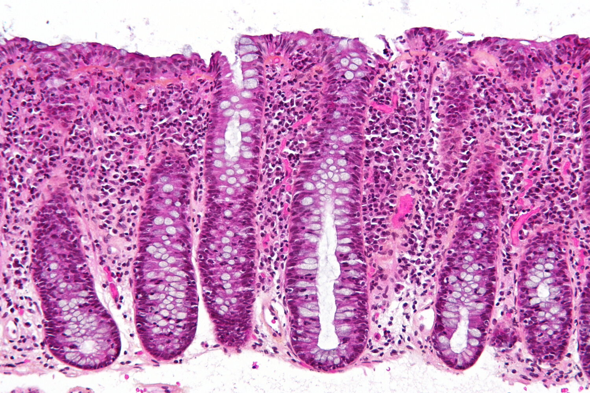

# Microscopic colitis

*Categories: Clinical knowledge > Internal medicine > Gastroenterology > Diseases of the intestine and appendix > Microscopic colitis*

[Original Article Link](https://coursology-qbank.com/amboss/article/Kw0UPR)

---

## Summary

Microscopic <u>colitis</u> is an <u>idiopathic</u> inflammatory disease of the <u>colon</u> that manifests as chronic, nonbloody, <u>watery diarrhea</u>. There are three subtypes: <u>lymphocytic colitis</u>, <u>collagenous colitis</u>, and incomplete microscopic <u>colitis</u>. The condition is most common in women over 60 years of age and is associated with smoking, certain medications (e.g., <u>NSAIDs</u> and <u>PPIs</u>), and other autoimmune diseases. Diagnosis is based on the presence of chronic, <u>watery diarrhea</u>, a normal-appearing <u>colon</u> on <u>colonoscopy</u>, and characteristic histological findings in <u>colon</u> <u>biopsy</u> specimens. Treatment involves discontinuing offending agents and initiating pharmacological treatment (e.g., <u>budesonide</u>) to induce and maintain remission. Although the clinical course is variable, microscopic <u>colitis</u> is not associated with an increased risk of mortality.

---

## Definitions

* Microscopic <u>colitis</u>: : an <u>idiopathic</u> inflammatory disease of the <u>colon</u> characterized by chronic, nonbloody, <u>watery diarrhea</u>, normal macroscopic appearance of the bowel on <u>colonoscopy</u>, and collagenous or <u>lymphocytic</u> infiltrates on microscopy [[2]](https://coursology-qbank.com/amboss/article/9_dNqs0)

* Collagenous colitis: a histological subtype of microscopic <u>colitis</u> characterized by <u>proliferation</u> of collagenous <u>connective tissue</u> that forms a thick subepithelial <u>collagen</u> band [[3]](https://coursology-qbank.com/amboss/article/C_dqqs0)

* Lymphocytic colitis: a histological subtype of microscopic <u>colitis</u> characterized by intraepithelial <u>lymphocytic</u> infiltrates and little to no <u>proliferation</u> of <u>connective tissue</u> [[3]](https://coursology-qbank.com/amboss/article/C_dqqs0)

* Incomplete microscopic <u>colitis</u>: a histological subtype of microscopic <u>colitis</u> that has features of both collagenous and <u>lymphocytic colitis</u> but does not fulfill the histological criteria of either [[3]](https://coursology-qbank.com/amboss/article/C_dqqs0)

> [!TIP]
> Outcomes and treatment recommendations do not differ between subtypes. [[4]](https://coursology-qbank.com/amboss/article/x_dEqs0)

Lymphocytic colitis

---

## Epidemiology

* Peak <u>incidence</u>: 60–65 years [[2]](https://coursology-qbank.com/amboss/article/9_dNqs0)

* <u>♀</u> > <u>♂</u> [[2]](https://coursology-qbank.com/amboss/article/9_dNqs0)[[3]](https://coursology-qbank.com/amboss/article/C_dqqs0)

* Present in ∼ 13% of patients with unexplained chronic, <u>watery diarrhea</u> [[3]](https://coursology-qbank.com/amboss/article/C_dqqs0)

Epidemiological data refers to the US, unless otherwise specified.

---

## Etiology

* <u>Risk factors</u> [[5]](https://coursology-qbank.com/amboss/article/elWxDl0)

* Older age

* Female sex

* Smoking  [[3]](https://coursology-qbank.com/amboss/article/C_dqqs0)[[5]](https://coursology-qbank.com/amboss/article/elWxDl0)

* Associated medications [[4]](https://coursology-qbank.com/amboss/article/x_dEqs0)[[5]](https://coursology-qbank.com/amboss/article/elWxDl0)

* <u>PPIs</u>

* <u>NSAIDs</u>

* <u>Selective serotonin reuptake inhibitors</u>

* <u>Statins</u>

* Associated autoimmune diseases [[3]](https://coursology-qbank.com/amboss/article/C_dqqs0)[[5]](https://coursology-qbank.com/amboss/article/elWxDl0)

* <u>Celiac disease</u>

* <u>Rheumatoid arthritis</u>

* <u>Thyroid disorders</u> (e.g., <u>hypothyroidism</u> or <u>hyperthyroidism</u>)

* <u>Type 1 diabetes mellitus</u>

---

## Clinical features

* Chronic, nonbloody, <u>watery diarrhea</u>

* Weight loss

* Abdominal <u>pain</u>

* <u>Fecal urgency</u>

* <u>Fecal incontinence</u>

* Nocturnal stools

---