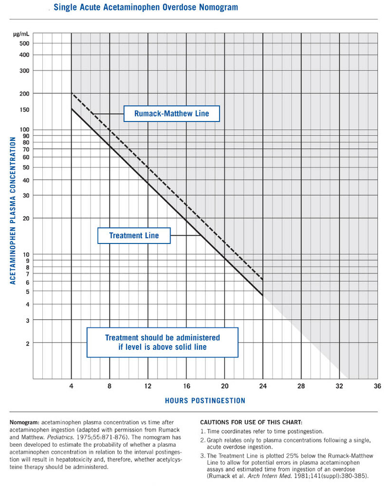

# Acetaminophen overdose

*Categories: Clinical knowledge > Internal medicine > Gastroenterology > Diseases of the liver > Acetaminophen overdose*

[Original Article Link](https://coursology-qbank.com/amboss/article/oF00Q3)

---

## Summary

<u>Acetaminophen</u> (<u>APAP</u>) is a <u>non-opioid analgesic</u> that can cause severe side effects when ingested in toxic amounts. Ingestion of ≤ 4 g/day of <u>APAP</u> is generally considered safe. <u>APAP</u> overdose is the leading <u>cause of acute liver failure</u> in the US and is commonly intentional. Clinical features, diagnostics, and management vary depending on the type of overdose, e.g., <u>acute APAP overdose</u>, <u>massive APAP overdose</u>, or <u>chronic APAP overdose</u>. In the early stages of <u>acute APAP overdose</u>, individuals may be asymptomatic or have <u>nausea</u>, <u>vomiting</u>, and <u>lethargy</u>. In later stages, individuals can develop <u>signs of acute liver failure</u> (<u>ALF</u>). Clinical features of <u>chronic APAP overdose</u> vary. Management is most often guided by <u>serum APAP levels</u> and other markers of <u>liver function</u> but can be empiric depending on the overdose type. The mainstay of therapy is the <u>antidote</u> <u>N-acetylcysteine</u> (<u>NAC</u>). <u>Single-dose activated charcoal</u> (AC) may be indicated for <u>gastrointestinal decontamination</u>. Patients with <u>acute liver failure</u> may require <u>liver transplantation</u>.

---

## Epidemiology

* Leading <u>cause of acute liver failure</u> [[2]](https://coursology-qbank.com/amboss/article/Y11n2f0)[[3]](https://coursology-qbank.com/amboss/article/xmWE3N0)

* <u>Acute APAP overdose</u> has a <u>mortality rate</u> of < 0.5%. [[2]](https://coursology-qbank.com/amboss/article/Y11n2f0)

Epidemiological data refers to the US, unless otherwise specified.

---

## Pathophysiology

* Exhaustion of hepatic metabolic pathways causes accumulation of a toxic metabolite of <u>acetaminophen</u>, N-acetyl-p-benzoquinoneimine (<u>NAPQI</u>). [[2]](https://coursology-qbank.com/amboss/article/Y11n2f0)

* <u>Glutathione</u> initially inactivates <u>NAPQI</u>, but its reserves are eventually depleted, leading to <u>NAPQI</u> accumulation.

* <u>NAPQI</u> → irreversible oxidative <u>hepatocyte</u> injury → <u>liver</u> cell <u>necrosis</u>

* APAP-induced hepatotoxicity

* Defined as peak <u>AST</u> or <u>ALT</u> > 1000 IU/L

* Most commonly caused by <u>APAP</u> overdose

* Occurs rarely at therapeutic doses in patients with: [[3]](https://coursology-qbank.com/amboss/article/xmWE3N0)

* <u>Alcohol</u> consumption

* Prolonged <u>fasting</u>

* <u>Chronic liver disease</u>  [[4]](https://coursology-qbank.com/amboss/article/mSdVZp0)

---

## Clinical features

Clinical features vary with the type of ingestion and the time since ingestion. Patients may be asymptomatic or have any of the following:

* <u>Nausea</u>, <u>vomiting</u>

* <u>Pallor</u>

* <u>RUQ</u> <u>pain</u>

* <u>Signs of acute liver failure</u>

* For specific types of ingestion:

* See “<u>Acute APAP overdose</u>.”

* See “<u>Chronic APAP overdose</u>.”

---

## Diagnosis

### Serum APAP level [[2]](https://coursology-qbank.com/amboss/article/Y11n2f0)[[5]](https://coursology-qbank.com/amboss/article/drWoT50)

* Indications

* History or <u>clinical features of APAP overdose</u>

* <u>Elevated transaminases</u> or <u>ALF</u> without apparent cause

* Screening for <u>APAP</u> co-ingestion if <u>poisoning</u> by another substance is suspected

* Measurement and interpretation: depends on the time and acuity of ingestion

* Detectability thresholds vary; be familiar with the cutoffs used at your institution.  [[6]](https://coursology-qbank.com/amboss/article/erWxT50)

* Acute ingestion

* Interpret levels obtained 4–24 hours after ingestion.  [[2]](https://coursology-qbank.com/amboss/article/Y11n2f0)[[5]](https://coursology-qbank.com/amboss/article/drWoT50)[[7]](https://coursology-qbank.com/amboss/article/R3dlRp0)

* See “<u>Serum APAP level in acute overdose</u>” for details.

* All other types of ingestion 

* A detectable level measured at any time is clinically significant.

* See “<u>Chronic APAP overdose</u>” for details.

> [!WARNING]
> In <u>acute APAP overdose</u>, measure <u>serum APAP levels</u> at least 4 hours after ingestion, as levels measured prior to 4 hours are unreliable. [[2]](https://coursology-qbank.com/amboss/article/Y11n2f0)[[5]](https://coursology-qbank.com/amboss/article/drWoT50)[[7]](https://coursology-qbank.com/amboss/article/R3dlRp0)

### Investigations for <u>end-organ dysfunction</u> [[2]](https://coursology-qbank.com/amboss/article/Y11n2f0)

* <u>AST</u> and <u>ALT</u>

* Usually normal in the first 24 hours of <u>acute APAP overdose</u>

* Normal or elevated in <u>chronic APAP overdose</u>

* Can exceed 10,000 IU/L during maximal <u>APAP</u>-induced toxicity

* <u>Coagulation studies</u>: <u>INR</u> elevation can indicate <u>ALF</u>.

* Serial measurements may be required (e.g., to identify <u>NAC stopping criteria</u>).

* Avoid using <u>PT</u> alone to guide treatment or prognosis.  [[2]](https://coursology-qbank.com/amboss/article/Y11n2f0)

* <u>BMP</u>: may show <u>acute kidney injury</u> (<u>AKI</u>)

* <u>Blood gas analysis</u>: may show <u>metabolic acidosis</u>

* <u>Lactate</u>: Elevated serum <u>lactate</u> after <u>fluid resuscitation</u> is associated with poor prognosis.

> [!TIP]
> <u>INR</u>, <u>PT</u>, <u>lactate</u>, <u>creatinine</u>, and <u>blood gas analysis</u> are used in the <u>King's College criteria</u> to determine the need for <u>liver transplantation</u>. [[8]](https://coursology-qbank.com/amboss/article/8pXOr_)

### Screening for co-ingestions

Consider obtaining serum levels of commonly co-ingested substances, e.g.:

* <u>Blood alcohol level</u>

* <u>Salicylate level</u>

> [!TIP]
> Patients may confuse <u>aspirin</u>, <u>ibuprofen</u>, and <u>acetaminophen</u> when providing history of an overdose. Consider screening for all detectable toxic <u>OTC</u> <u>analgesics</u>. [[9]](https://coursology-qbank.com/amboss/article/AN1Rdh0)

---

## Management

### Initial management [[2]](https://coursology-qbank.com/amboss/article/Y11n2f0)[[5]](https://coursology-qbank.com/amboss/article/drWoT50)[[9]](https://coursology-qbank.com/amboss/article/AN1Rdh0)

* Follow the <u>ABCDE approach for poisoning</u>.

* Perform a <u>toxicological risk assessment</u> based on ingestion amount, type, and time.

* Obtain <u>diagnostics for APAP overdose</u>, e.g., <u>serum APAP level</u>, <u>LFTs</u>, <u>BMP</u>, <u>VBG</u>, and screening for co-ingestions.

* Administer <u>single-dose AC</u> and <u>NAC</u> therapy without delay, if indicated.

* Call poison control and consult a medical toxicologist; the US Poison Help line is 1-800-222-1222.

* Begin initial <u>management of suicidal behavior</u>, if indicated.

> [!TIP]
> Obtain and interpret the <u>serum APAP level</u> based on the time and type of ingestion.

### Approach [[2]](https://coursology-qbank.com/amboss/article/Y11n2f0)[[5]](https://coursology-qbank.com/amboss/article/drWoT50)[[9]](https://coursology-qbank.com/amboss/article/AN1Rdh0)

#### Acute ingestion (< 24 hours)

See “<u>Acute APAP overdose</u>” for details.

* <u>GI decontamination</u>: <u>single-dose AC</u>  DOSAGE if < 4 hours since ingestion; consider for extended-release (ER) <u>APAP</u> formulations ≥ 4 hours since ingestion.

* <u>Antidote</u>: Administer <u>NAC</u> based on <u>serum APAP level</u> ≥ 4 hours from ingestion and the <u>Rumack-Matthew nomogram</u>.

#### Massive ingestion

See “<u>Massive APAP overdose</u>” for details.

* Acute stabilization: Consider <u>intubation</u> and <u>central venous line insertion</u>.

* <u>GI decontamination</u>: <u>single-dose AC</u> DOSAGE indicated once the <u>airway</u> is protected

* <u>Antidote</u>: high-dose <u>NAC</u> indicated in consultation with medical toxicology

* <u>Enhanced elimination</u>: Consider <u>hemodialysis</u> in selected patients. [[10]](https://coursology-qbank.com/amboss/article/tuWXGM0)

#### Chronic ingestion, unknown time of ingestion, or > 24 hours since ingestion

See “<u>Chronic APAP overdose</u>” for details.

* <u>GI decontamination</u>: usually not indicated

* <u>Antidote</u>: Consider <u>NAC</u> based on clinical evaluation, <u>serum APAP level</u> at presentation, and <u>LFTs</u>, in consultation with a toxicologist.

### Definitive treatment

* <u>Antidote</u>: PO or IV <u>N-acetylcysteine</u> (<u>NAC</u>) is used to treat and prevent <u>APAP</u>-induced hepatoxicity.

* Specific indications

* See “<u>Acute APAP overdose</u>.”

* See “<u>Chronic APAP overdose</u>.”

* Dosage and administration: See “<u>NAC for APAP overdose</u>.”

* <u>Liver transplant</u>: indicated for selected patients with <u>acute liver failure</u>

* Identify candidates using <u>King's College criteria</u>.

* See “<u>Management of ALF</u>” for pre-transplant management.

### Monitoring [[2]](https://coursology-qbank.com/amboss/article/Y11n2f0)[[9]](https://coursology-qbank.com/amboss/article/AN1Rdh0)

Laboratory monitoring is indicated to assess treatment <u>efficacy</u> and identify <u>NAC stopping criteria</u>, <u>liver transplant</u> candidates, and complications.

* Normal initial <u>AST</u>: Repeat <u>AST</u> before the end of the treatment protocol or every 24 hours.

* Elevated initial <u>AST</u>: Monitor <u>PT</u>, <u>INR</u>, and <u>creatinine</u> levels at least daily.

* <u>Signs of liver failure</u> and/or extrahepatic organ toxicity: Monitor <u>pH</u>, <u>lactate</u>, and <u>phosphate</u>.

* ER formulations of <u>APAP</u> or co-ingestion of medications that delay GI transit (e.g., <u>opioids</u>, <u>anticholinergics</u>): Consider repeat <u>serum APAP levels</u> in consultation with a toxicologist.

### Disposition [[2]](https://coursology-qbank.com/amboss/article/Y11n2f0)[[9]](https://coursology-qbank.com/amboss/article/AN1Rdh0)

* <u>Signs of liver failure</u>: Admit to monitored bed or critical care based on clinical status and monitoring needs.

* Asymptomatic or stable on <u>NAC</u> treatment: Admit to inpatient or observation unit.

* Asymptomatic, no <u>NAC</u> required, and normal or baseline <u>AST</u>: Assess if further medical treatment is necessary; consider further disposition based on <u>suicidal risk</u> or risk of self-harm.

* <u>Suicidality</u> suspected

* Consult <u>psychiatry</u>.

* Admit patients with high <u>suicidal risk</u> to hospital even if medically stable; <u>involuntary commitment</u> may be necessary.

---

## N-acetylcysteine (NAC)

### Mechanism of action [[2]](https://coursology-qbank.com/amboss/article/Y11n2f0)[[11]](https://coursology-qbank.com/amboss/article/8uWOGM0)

* Replenishes <u>glutathione</u> stores in the <u>liver</u>  [[2]](https://coursology-qbank.com/amboss/article/Y11n2f0)[[11]](https://coursology-qbank.com/amboss/article/8uWOGM0)

* Close to 100% effective in preventing <u>hepatotoxicity</u> if administered within 8 hours of ingestion [[2]](https://coursology-qbank.com/amboss/article/Y11n2f0)

### Indications [[2]](https://coursology-qbank.com/amboss/article/Y11n2f0)[[5]](https://coursology-qbank.com/amboss/article/drWoT50)[[9]](https://coursology-qbank.com/amboss/article/AN1Rdh0)

* <u>Acetaminophen</u> toxicity

* Acute ingestion

* Serum concentration of <u>APAP</u> above the treatment line on the <u>Rumack-Matthew nomogram</u>

* Empiric administration: if ingestion is ≥ 30 g or <u>APAP level</u> cannot be obtained within 8 hours of ingestion [[5]](https://coursology-qbank.com/amboss/article/drWoT50)

* Chronic ingestion: <u>serum APAP level</u> > 10 mcg/mL and/or <u>AST</u> or <u>ALT</u> above baseline

* Unknown time of ingestion: <u>serum APAP level</u> detectable and/or <u>AST</u> or <u>ALT</u> above baseline

* Less common indications

* <u>Mucolysis</u>: e.g., in patients with <u>COPD</u>, <u>chronic bronchitis</u>, intubated patients

* <u>Off-label</u> for <u>hepatotoxicity</u> associated with oxidative injury, e.g.: [[2]](https://coursology-qbank.com/amboss/article/Y11n2f0)

* Amatoxin (<u>Amanita phalloides</u> <u>poisoning</u>)

* <u>Carbon tetrachloride</u> <u>poisoning</u>

* Consider for other causes of <u>drug-induced liver injury</u>. [[3]](https://coursology-qbank.com/amboss/article/xmWE3N0)

### Contraindications [[5]](https://coursology-qbank.com/amboss/article/drWoT50)

* There are no contraindications.

* A previous <u>anaphylactoid reaction</u> is not a contraindication to <u>NAC for APAP overdose</u>.

### NAC for APAP overdose [[2]](https://coursology-qbank.com/amboss/article/Y11n2f0)[[5]](https://coursology-qbank.com/amboss/article/drWoT50)

There is no <u>gold standard</u> regimen for <u>NAC</u> administration. Follow local protocols and consult poison control if needed.

* In <u>acute APAP overdose</u>, initiate therapy as soon as possible at least 4 hours after ingestion; ideally within 8 hours of ingestion.

* Select a protocol that delivers at least 300 mg/kg PO or IV in the first 20–24 hours, e.g.:  [[5]](https://coursology-qbank.com/amboss/article/drWoT50)

* Standard IV <u>NAC</u> protocol (“three-bag method”) DOSAGE [[2]](https://coursology-qbank.com/amboss/article/Y11n2f0)[[3]](https://coursology-qbank.com/amboss/article/xmWE3N0)[[5]](https://coursology-qbank.com/amboss/article/drWoT50)

* Oral <u>NAC protocol</u> DOSAGE [[2]](https://coursology-qbank.com/amboss/article/Y11n2f0)[[3]](https://coursology-qbank.com/amboss/article/xmWE3N0)[[5]](https://coursology-qbank.com/amboss/article/drWoT50)

* Discuss further doses with a toxicologist.

* Measure serum <u>APAP</u> and <u>AST</u> prior to completion of the IV infusion or at 24 hours for PO <u>NAC</u>.

* Continue until <u>NAC stopping criteria</u> are met. [[5]](https://coursology-qbank.com/amboss/article/drWoT50)[[6]](https://coursology-qbank.com/amboss/article/erWxT50)

> [!WARNING]
> Avoid oral <u>NAC</u> administration in patients with potential <u>airway</u> compromise.

### NAC stopping criteria [[2]](https://coursology-qbank.com/amboss/article/Y11n2f0)[[5]](https://coursology-qbank.com/amboss/article/drWoT50)

All of the following must be present:

* <u>Serum APAP level</u> undetectable

* <u>INR</u> < 2.0

* <u>ALT</u> and <u>AST</u> at baseline or 25–50% below peak

* Patient clinically well

### Adverse effects [[5]](https://coursology-qbank.com/amboss/article/drWoT50)

* <u>Nausea</u>, <u>vomiting</u>

* <u>Anaphylactoid reaction</u>

---

## Acute ingestion

### Definition

* A large ingestion or multiple ingestions over a brief period of time, usually < 24 hours  [[2]](https://coursology-qbank.com/amboss/article/Y11n2f0)[[5]](https://coursology-qbank.com/amboss/article/drWoT50)

* Minimum toxic dose [[2]](https://coursology-qbank.com/amboss/article/Y11n2f0)[[5]](https://coursology-qbank.com/amboss/article/drWoT50)

* Healthy adults: 7.5 g/day

* Children: 150 mg/kg/day

> [!TIP]
> Ingestions occurring > 24 hours or at an unknown time before presentation, even large single ones, are typically managed as <u>chronic APAP overdoses</u>. [[5]](https://coursology-qbank.com/amboss/article/drWoT50)

### Stages of <u>acute APAP toxicity</u> [[2]](https://coursology-qbank.com/amboss/article/Y11n2f0)[[9]](https://coursology-qbank.com/amboss/article/AN1Rdh0)[[12]](https://coursology-qbank.com/amboss/article/pFXLQ-)

Clinical and biochemical findings vary depending on the amount ingested and the time from ingestion.

* Stage 1: first 24 hours after ingestion

* Most patients are asymptomatic.

* Nonspecific symptoms: <u>nausea</u>, <u>vomiting</u>, <u>pallor</u>

* Normal <u>liver chemistries</u>

* Stage 2: 24–36 hours after ingestion

* <u>Nausea</u>, <u>vomiting</u>, <u>RUQ</u> <u>pain</u>

* Abnormal <u>liver chemistries</u>

* Stage 3: 72–96 hours after ingestion

* Time of maximal <u>liver</u> toxicity and highest likelihood of <u>death</u>

* Progressive <u>liver</u> impairment: <u>signs of ALF</u>

* Hemorrhage due to <u>ALF</u>-induced <u>coagulopathy</u> (see “<u>Clinical features of bleeding disorders</u>”)

* <u>AKI</u> occurs in up to 25% of patients with significant <u>liver</u> toxicity.

* Stage 4: recovery phase

* <u>AST</u>, <u>pH</u>, <u>lactate</u>, and <u>coagulation studies</u> usually normalize within 7 days.

* <u>ALT</u> and <u>creatinine</u> may remain elevated for longer.

> [!WARNING]
> <u>Coma</u>, <u>metabolic acidosis</u>, and <u>death</u> can occur during the first stage of a <u>massive APAP overdose</u>.

### Diagnostics [[2]](https://coursology-qbank.com/amboss/article/Y11n2f0)[[5]](https://coursology-qbank.com/amboss/article/drWoT50)

* Obtain <u>diagnostics for APAP overdose</u>.

* Serum APAP level in acute overdose

* < 2 hours from ingestion: Do not interpret; retake level 4 hours after ingestion.

* 2–4 hours from ingestion

* If <u>APAP</u> is undetectable: Acute toxicity is unlikely.

* If <u>APAP</u> is detected: Do not interpret; retake level 4 hours after ingestion.

* 4–24 hours from ingestion

* Obtain level immediately.

* Interpret using the <u>Rumack-Matthew nomogram</u>.

* ER formulations or co-ingestion with <u>opioids</u> and/or <u>anticholinergics</u>

* <u>APAP level</u> < 10 mcg/mL: no further measurement needed

* <u>APAP level</u> > 10 mcg/mL and lower than treatment line: Repeat level 4–6 hours after the initial measurement.

### Rumack-Matthew nomogram [[2]](https://coursology-qbank.com/amboss/article/Y11n2f0)

* A graph used to determine the risk of severe <u>hepatotoxicity</u> in <u>acute APAP overdose</u> based on:

* <u>Serum APAP level</u> obtained 4–24 hours after ingestion

* Time since ingestion

* <u>NAC</u> is indicated if the <u>serum APAP level</u> is above the treatment line.

Rumack-Matthew Nomogram

> [!WARNING]
> Do not use the <u>Rumack-Matthew nomogram</u> if < 4 hours or > 24 hours have passed since ingestion, or if the time of ingestion is unreliable or unknown. [[5]](https://coursology-qbank.com/amboss/article/drWoT50)

### Management [[2]](https://coursology-qbank.com/amboss/article/Y11n2f0)[[3]](https://coursology-qbank.com/amboss/article/xmWE3N0)[[13]](https://coursology-qbank.com/amboss/article/lDWven0)

* <u>GI decontamination</u>

* Any formulation < 4 hours from ingestion: Administer <u>single-dose AC</u>  DOSAGE unless contraindicated.

* ER formulation ≥ 4 hours after ingestion: Consider <u>single-dose AC</u>. DOSAGE  [[5]](https://coursology-qbank.com/amboss/article/drWoT50)

* <u>Antidote</u>: <u>NAC</u>

* Indication: <u>serum APAP level</u> measured ≥ 4 hours from ingestion that is above the <u>Rumack-Matthew nomogram</u> treatment line

* Dosage and administration: See “<u>NAC protocol</u>.”

* <u>Supportive care</u>, monitoring, and disposition: See “<u>Management of APAP overdose</u>.”

### Massive APAP overdose [[2]](https://coursology-qbank.com/amboss/article/Y11n2f0)[[9]](https://coursology-qbank.com/amboss/article/AN1Rdh0)[[12]](https://coursology-qbank.com/amboss/article/pFXLQ-)

* Definition: ingestion of ≥ 30–40 g or > 0.5 g/kg body weight [[5]](https://coursology-qbank.com/amboss/article/drWoT50)[[9]](https://coursology-qbank.com/amboss/article/AN1Rdh0)[[14]](https://coursology-qbank.com/amboss/article/EuW8GM0)

* Clinical features

* Early <u>altered mental status or coma</u>

* Other clinical features of <u>acute APAP overdose</u>, e.g., <u>signs of ALF</u>

* Diagnostics

* Early <u>lactic acidosis</u>

* <u>Diagnostic findings of ALF</u>

* Management [[5]](https://coursology-qbank.com/amboss/article/drWoT50)

* Follow the <u>ABCDE approach for poisoning</u>.

* Consult toxicology and nephrology for <u>hemodialysis</u>. [[9]](https://coursology-qbank.com/amboss/article/AN1Rdh0)[[10]](https://coursology-qbank.com/amboss/article/tuWXGM0)

* Consider <u>single-dose AC</u> DOSAGE regardless of time from ingestion.

* Begin <u>NAC</u>; consider a higher dosage than standard in consultation with a toxicologist.

* Admit patients to the <u>ICU</u> for ongoing <u>management of ALF</u>.

> [!WARNING]
> Patients with <u>massive APAP overdose</u> may require <u>intubation</u> for <u>airway</u> protection and <u>central venous line insertion</u> for <u>hemodialysis</u>.

---