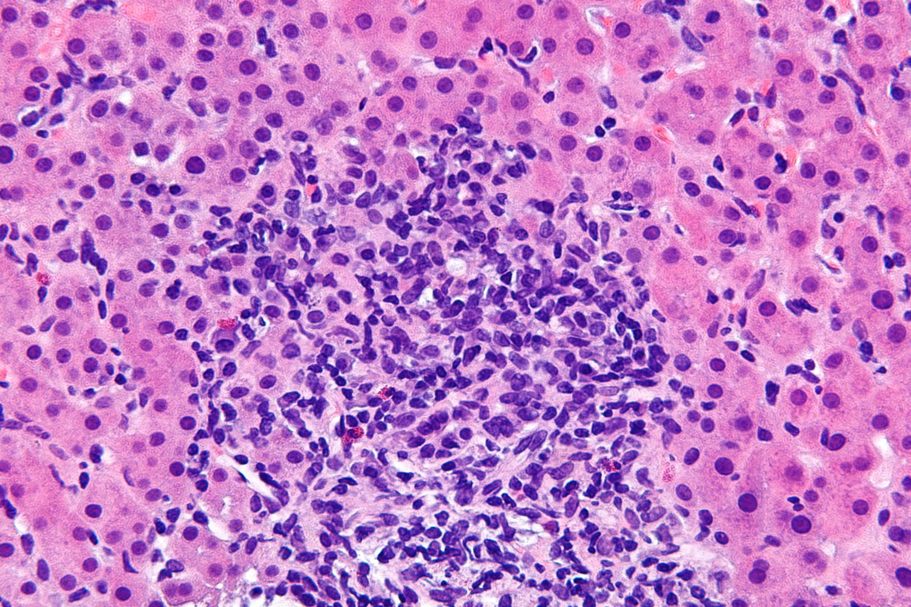

# Autoimmune hepatitis

*Categories: Clinical knowledge > Internal medicine > Gastroenterology > Diseases of the liver > Autoimmune hepatitis*

[Original Article Link](https://coursology-qbank.com/amboss/article/JM0spg)

---

## Summary

Autoimmune <u>hepatitis</u> (AIH) is a rare form of chronic <u>hepatitis</u> that predominantly affects women. Although the etiology is unclear, it is commonly associated with other autoimmune conditions (e.g., <u>thyroid disease</u>, type 1 <u>diabetes mellitus</u>, <u>celiac disease</u>). The clinical presentation ranges from asymptomatic <u>transaminitis</u> to <u>acute liver failure</u>. Diagnosis is established based on the detection of <u>autoantibodies</u> (e.g., <u>antinuclear antibodies</u>, <u>anti-smooth muscle antibodies</u>) and the histologic findings of <u>interface hepatitis</u> on <u>liver biopsy</u>. Treatment consists of <u>immunosuppressive</u> medications such as <u>prednisone</u> and <u>azathioprine</u>. The prognosis is favorable with treatment; without treatment, patients may develop <u>cirrhosis</u> and <u>liver</u> failure.

---

## Classification

* Type 1 AIH (80% of cases): characteristic <u>autoantibodies</u> include <u>antinuclear antibodies</u> (<u>ANAs</u>), anti-smooth muscle antibodies (<u>ASMAs</u>) anti-soluble liver antigen antibodies (<u>anti-SLA</u>)

* Type 2 AIH: characteristic <u>autoantibodies</u> include <u>anti-liver-kidney microsomal-1 antibodies</u> (<u>anti-LKM-1</u>), anti-liver cytosol antibodies-1 (<u>ALC-1</u>)

---

## Epidemiology

* <u>Prevalence</u>: 0.1–2/100,000 white adults in the US, even less so in other ethnicities [[1]](https://coursology-qbank.com/amboss/article/AxXR_Z0)

* <u>Bimodal distribution</u>: 10–20 years and 40–60 years [[2]](https://coursology-qbank.com/amboss/article/yxXd_Z0)

* <u>Type 1 AIH</u>: most common in adults

* <u>Type 2 AIH</u>: most common in children

* Sex: <u>♀</u> > <u>♂</u> 

* <u>Type 1 AIH</u>: (∼ 4:1) [[3]](https://coursology-qbank.com/amboss/article/BxXzAZ0)

* <u>Type 2 AIH</u>: (∼ 10:1)

Epidemiological data refers to the US, unless otherwise specified.

---

## Etiology

* <u>Idiopathic</u>  [[4]](https://coursology-qbank.com/amboss/article/4P03UT)

* AIH is commonly associated with other autoimmune conditions

* <u>Type 1 AIH</u>: <u>Hashimoto thyroiditis</u>, <u>Graves disease</u>, <u>ulcerative colitis</u>, <u>celiac disease</u>, <u>rheumatoid arthritis</u>

* <u>Type 2 AIH</u>: <u>Hashimoto thyroiditis</u>, <u>type 1 diabetes mellitus</u>, <u>vitiligo</u>

---

## Clinical features

AIH has an insidious onset in most patients and its presentation varies widely, ranging from asymptomatic disease to severe symptoms or even <u>acute liver failure</u>.

* Nonspecific symptoms 

* Fatigue

* Upper abdominal <u>pain</u>

* Weight loss

* <u>Signs of acute liver failure</u> (∼ ⅓ of patients)

* <u>Signs of chronic liver disease</u>

Overview of PSC, PBC, and autoimmune hepatitis

---

## Diagnosis

### Approach [[5]](https://coursology-qbank.com/amboss/article/l81v5i0)

* Consider AIH in patients with unexplained <u>liver</u> disease.

* Rule out other causes of <u>hepatitis</u>; see “Differential diagnoses.”

* Establish the diagnosis of AIH with <u>laboratory studies</u> and <u>liver</u> <u>histology</u>.

* Consider utilizing the Autoimmune <u>Hepatitis</u> Diagnosis calculator to facilitate the diagnosis.  [[6]](https://coursology-qbank.com/amboss/article/BE1zBi0)

* Consult hepatology for guidance on further diagnostic testing.

> [!TIP]
> The diagnosis of AIH is based on positive <u>autoantibodies</u> (e.g., <u>ANA</u>, <u>ASMA</u>) and histological findings of <u>interface hepatitis</u> on <u>biopsy</u>.

Autoimmune Hepatitis Diagnosis Calculator

### Initial studies [[5]](https://coursology-qbank.com/amboss/article/l81v5i0)

#### Laboratory tests [[7]](https://coursology-qbank.com/amboss/article/_v15cQ0)[[8]](https://coursology-qbank.com/amboss/article/rMXfJA)

* <u>Liver chemistries</u>: ↑↑↑ <u>ALT</u> and ↑↑ <u>AST</u>; , ↑ <u>GGT</u>, normal or ↑ <u>ALP</u>, and ↑ <u>bilirubin</u>

* Serum <u>antibodies</u>

* <u>ANA</u>, <u>ASMA</u>:  combination is highly specific for <u>type 1 AIH</u> [[7]](https://coursology-qbank.com/amboss/article/_v15cQ0)

* <u>Anti-LKM-1</u>:  typically positive in <u>type 2 AIH</u>

* <u>SPEP</u>: <u>hypergammaglobulinemia</u> (↑ <u>IgG</u>)

* <u>CBC</u>: normochromic <u>anemia</u>, <u>thrombocytopenia</u>, mild <u>leukopenia</u>

* <u>Inflammatory markers</u>: ↑ <u>ESR</u>

#### <u>Liver biopsy</u> [[7]](https://coursology-qbank.com/amboss/article/_v15cQ0)

* Perform following the detection of AIH <u>antibodies</u> to confirm the diagnosis.

* Histological findings: 

* Lymphoplasmacytic <u>interface hepatitis</u>: ongoing inflammatory process with <u>lymphocytic</u> infiltration, bridging or multiacinar <u>necrosis</u>, and <u>fibrotic</u> changes

* Centrilobular perivenulitis and <u>necrosis</u>

* <u>Hepatocyte</u> emperipolesis  [[7]](https://coursology-qbank.com/amboss/article/_v15cQ0)

* <u>Hepatocyte</u> rosettes

* <u>Bile</u> duct changes (e.g., <u>cholangitis</u>, ductal injury)

Chronic hepatitis

### Additional evaluation [[5]](https://coursology-qbank.com/amboss/article/l81v5i0)

* Obtain further serum <u>antibodies</u> to clarify diagnosis if initial <u>antibody</u> testing is negative.

* <u>ALC-1</u> (<u>type 2 AIH</u>), <u>anti-SLA</u> (<u>type 1 AIH</u>)

* <u>Antimitochondrial antibody</u>: rare in AIH; may indicate <u>AIH-PBC overlap</u>

* <u>pANCA</u>: may be present in <u>type 1 AIH</u> or AIH-<u>PSC</u> overlap

* Screen all patients for concomitant <u>celiac disease</u> (with <u>anti-tTG</u>) and <u>thyroid disease</u> (with <u>TSH</u>).

* Assess for other common comorbidities (e.g., <u>rheumatoid arthritis</u>, <u>diabetes mellitus</u>, <u>inflammatory bowel disease</u>) based on clinical suspicion.

---

## Differential diagnoses

* Viral <u>hepatitis</u> (e.g., <u>hepatitis C</u>)

* <u>Primary sclerosing cholangitis</u>

* <u>Primary biliary cholangitis</u>

* <u>Alcohol-associated liver disease</u>

* <u>Metabolic dysfunction-associated steatohepatitis</u>

* <u>Drug-induced liver injury</u>

* Drug-induced autoimmune-like hepatitis (<u>DIAH</u>)

* <u>Hemochromatosis</u>

* <u>Wilson disease</u>

The differential diagnoses listed here are not exhaustive.

---

## Treatment

### General principles [[5]](https://coursology-qbank.com/amboss/article/l81v5i0)[[7]](https://coursology-qbank.com/amboss/article/_v15cQ0)

* Initiate <u>management of acute liver failure</u> if necessary.

* Refer patients to a hepatologist for management.

* <u>Immunosuppression</u> is the mainstay of treatment.

* Provide <u>age-appropriate immunizations</u> and pretreatment counseling.

* <u>Prevent complications of glucocorticoid therapy</u>.

* <u>Liver transplantation</u> is indicated in patients with <u>decompensated liver cirrhosis</u>.

### Pharmacotherapy [[5]](https://coursology-qbank.com/amboss/article/l81v5i0)

* Indication: active disease (i.e., <u>elevated transaminases</u>, elevated <u>IgG</u>, and/or histological disease)

* Goals of treatment

* Reduce symptoms.

* Reverse <u>liver</u> inflammation and <u>fibrosis</u>.

* Achieve remission.

* <u>Induction therapy</u>

* First line: <u>glucocorticoids</u> (e.g., <u>prednisone</u> or <u>prednisolone</u>) with or without <u>azathioprine</u> (<u>AZA</u>)

* Alternatives: <u>mycophenolate</u>, <u>tacrolimus</u>, <u>infliximab</u>, <u>rituximab</u>

* Maintenance: <u>glucocorticoid</u> discontinuation after gradual tapering; continue <u>AZA</u>.

* Monitoring

* Check <u>ALT</u>, <u>AST</u>, <u>IgG</u> levels to assess for biochemical response and remission.  [[5]](https://coursology-qbank.com/amboss/article/l81v5i0)

* Conduct <u>transient elastography</u> at least 6 months after successful treatment to assess for advanced <u>fibrosis</u> or <u>cirrhosis</u>

* Treatment withdrawal

* Consider in patients with biochemical remission for ≥ 2 years.

* Consider repeat <u>liver biopsy</u> to exclude active inflammation prior to withdrawal.

* Relapse is common; obtain <u>AST</u>, <u>ALT</u>, and <u>IgG</u> levels at regular intervals.  [[5]](https://coursology-qbank.com/amboss/article/l81v5i0)

> [!WARNING]
> Do not use <u>azathioprine</u> in patients with <u>decompensated cirrhosis</u> or acute severe AIH (i.e., <u>jaundice</u>, <u>INR</u> > 1.5). [[5]](https://coursology-qbank.com/amboss/article/l81v5i0)

---

## Prognosis

* 10-year survival rate with treatment: > 90%  [[9]](https://coursology-qbank.com/amboss/article/m3cVQX0)

* Lifelong therapy is usually required.

* Increased risk of developing <u>hepatocellular carcinoma</u> (<u>HCC</u>): Follow-ups are recommended.

* <u>Type 2 AIH</u> is associated with more severe disease, a worse response to <u>corticosteroids</u>, and more frequent relapses.

* Increased risk of <u>liver cirrhosis</u> if left untreated

---