# Benign liver tumors and hepatic cysts

*Categories: Clinical knowledge > Internal medicine > Gastroenterology > Diseases of the liver > Benign liver tumors and hepatic cysts*

[Original Article Link](https://coursology-qbank.com/amboss/article/pS0L0f)

---

## Summary

Benign <u>liver</u> tumors and <u>hepatic cysts</u> are common and may occur in all age groups. Benign <u>liver</u> tumors are especially frequent in young women and include <u>hepatic hemangiomas</u>, <u>focal nodular hyperplasia</u> (<u>FNH</u>), and <u>hepatocellular adenoma</u> (also known as <u>liver cell adenoma</u>). Use of <u>oral contraceptives</u>, especially those containing <u>estrogen</u>, and <u>pregnancy</u> are associated with an increased risk of <u>hepatocellular adenoma</u>. <u>Hepatic cysts</u> include solitary and hydatid (echinococcal) cysts. Benign <u>liver</u> tumors and cysts are mainly asymptomatic and are often incidental findings in patients undergoing abdominal imaging. However, in some cases (e.g., large lesions), symptoms like upper abdominal <u>pain</u> and <u>postprandial</u> fullness may occur. Diagnosis is usually based on imaging, but may require <u>biopsy</u> in unclear cases. Treatment is generally conservative; <u>surgery</u> is reserved for specific lesion types and the presence of symptoms or complications.

---

## Benign liver tumors

### General

* <u>Epidemiology</u> [[1]](https://coursology-qbank.com/amboss/article/jp0_6S)

* Frequency: <u>hepatic hemangioma</u> (most common) > focal nodular <u>hyperplasia</u> (<u>FNH</u>) > hepatocellular <u>adenoma</u> (rare)

* Sex: usually <u>♀</u> > <u>♂</u>

* <u>Hepatic hemangioma</u>: 5:1 female:male <u>ratio</u> [[2]](https://coursology-qbank.com/amboss/article/LBbwYw)

* <u>FNH</u>: 8:1 female:male <u>ratio</u> [[3]](https://coursology-qbank.com/amboss/article/NBb-aw)

* <u>Hepatocellular adenoma</u>: 9:1 female:male <u>ratio</u> [[4]](https://coursology-qbank.com/amboss/article/lSbv-G)

* Age

* <u>Hepatic hemangioma</u>: peak <u>incidence</u> at age 30–50 [[2]](https://coursology-qbank.com/amboss/article/LBbwYw)

* <u>FNH</u>: can occur at any age but mostly affects young women in the third or fourth decade of life; However, <u>FNH</u> in men is diagnosed later in life. [[5]](https://coursology-qbank.com/amboss/article/5BbiYw)[[6]](https://coursology-qbank.com/amboss/article/mBbVYw)

* <u>Hepatocellular adenoma</u>: childbearing age (mostly at age 15–45) [[4]](https://coursology-qbank.com/amboss/article/lSbv-G)[[7]](https://coursology-qbank.com/amboss/article/DBb11w)

* Most often an incidental finding on imaging tests

* Etiology

* <u>Hepatic hemangioma</u>: possible hormonal component; <u>estrogen</u> therapy associated with increased growth

* <u>FNH</u>

* Mostly unknown

* Suggested to be the result of a localized <u>hyperplastic</u> reaction by <u>hepatocytes</u> to an underlying <u>arteriovenous malformations</u>  [[3]](https://coursology-qbank.com/amboss/article/NBb-aw)

* <u>Hepatocellular adenoma</u>: <u>oral contraceptives</u> and <u>anabolic steroids</u> [[8]](https://coursology-qbank.com/amboss/article/EBb8cw)

* Clinical features

* Usually asymptomatic (incidental finding in most cases)

* Large tumors (especially <u>hepatocellular adenoma</u>) may present with upper abdominal <u>pain</u>, fullness, and <u>nausea</u>.

* Diagnostics

* <u>Ultrasonography</u>: best initial test

* Further imaging 

* <u>Contrast-enhanced CT scan</u>: helpful to characterize the lesions and may bring specific signs of large <u>hemangiomas</u> or <u>FNH</u>

* <u>MRI</u>

* <u>Biopsy</u>

* Performed to confirm the diagnosis if imaging is inconclusive

* Contraindicated in <u>hepatic hemangiomas</u>, as it may cause bleeding

* Treatment [[9]](https://coursology-qbank.com/amboss/article/zBbrWw)

* <u>Conservative treatment</u> is often sufficient for <u>hepatic hemangioma</u> and <u>focal nodular hyperplasia</u>.

* Surgical treatment if symptomatic and/or complications arise

* <u>Hepatocellular adenoma</u>

* Discontinue <u>oral contraceptives</u>

* Women with symptoms or <u>tumor</u> > 5 cm: indication for surgical resection because of increased risk of rupture, bleeding, or malignant transformation

* Men with <u>hepatocellular adenoma</u>: indication for surgical resection irrespective of the size of the lesion because of an increased risk of malignant transformation  [[10]](https://coursology-qbank.com/amboss/article/_Bb5Ww)

* Follow-up

* <u>Hepatic hemangioma</u>: regular follow-up [[2]](https://coursology-qbank.com/amboss/article/LBbwYw)

* <u>FNH</u>: <u>ultrasonography</u> every six months for the first three years after diagnosis [[3]](https://coursology-qbank.com/amboss/article/NBb-aw)

* <u>hepatocellular adenoma</u>: CT or <u>MRI</u> at 6- to 12-month intervals [[10]](https://coursology-qbank.com/amboss/article/_Bb5Ww)

* Complications
* <u>Hepatocellular adenoma</u> [[8]](https://coursology-qbank.com/amboss/article/EBb8cw)

* Risk of malignant transformation

* Rupture and bleeding: presents with sudden onset of abdominal <u>pain</u> and may cause <u>hemorrhagic shock</u>

> [!TIP]
> The typical clinical picture of a <u>hepatocellular adenoma</u> is a young woman with a history of <u>oral contraceptive</u> or <u>anabolic steroid</u> use and upper right abdominal <u>pain</u>.

### Additional diagnostic findings [[11]](https://coursology-qbank.com/amboss/article/Pp0WpS)

| Diagnostic studies to differentiate benign <u>liver</u> tumors |  |  |  |
| --- | --- | --- | --- |
| Diagnostic studies | Hepatic hemangioma |  Focal nodular hyperplasia (<u>FNH</u>)  [[3]](https://coursology-qbank.com/amboss/article/NBb-aw)[[12]](https://coursology-qbank.com/amboss/article/-BbDWw)  |  Hepatocellular adenoma [[13]](https://coursology-qbank.com/amboss/article/vBbAcw)  |
| <u>Ultrasonography</u> |  * Usually well-demarcated, homogeneous, <u>hyperechoic</u> (pale)   |   * Homogeneous, <u>hypoechoic</u> to <u>isoechoic</u>  * Round/oval, sharply defined  * Central, stellate <u>scar</u> (∼ 50% of cases)    |   * Mainly <u>isoechoic</u>  * No characteristic vascularization  * Inhomogenous due to bleeding  * More frequent in the right lobe of the <u>liver</u>    |
| Contrast-enhanced <u>sonography</u> |   * Early arterial phase peripheral nodular <u>enhancement</u> with complete <u>centripetal</u> filling in the <u>portal venous</u> and late phases [[2]](https://coursology-qbank.com/amboss/article/LBbwYw)  * <u>Iris diaphragm phenomenon</u>    |  * From the central <u>artery</u>, radial arrangement of the peripheral <u>arteries</u> with a typical spoke-like pattern [[6]](https://coursology-qbank.com/amboss/article/mBbVYw)   |   * Fast <u>centripetal</u> or mixed filling in the arterial phase [[14]](https://coursology-qbank.com/amboss/article/wBbh1w)  * Hypervascularity compared to the adjacent <u>liver</u> <u>parenchyma</u>  * Sustained <u>enhancement</u> or weak washout in the delayed phase [[15]](https://coursology-qbank.com/amboss/article/ZybZdw)    |
| <u>Contrast-enhanced CT scan</u> |   * Well-demarcated  * Early arterial phase discontinuous, nodular, or peripheral <u>enhancement</u>  * Subsequent gradual <u>centripetal</u> <u>enhancement</u> (iris diaphragm phenomenon)  * Delayed-phase <u>hyperintensity</u> due to retention of contrast    |   * Early arterial phase <u>enhancement</u>  * <u>Hypointense</u> to <u>isointense</u> and poorly visualized in the <u>portal venous</u> phase  * Central <u>scar</u> (“nest of vessels”)    |   * Well-demarcated  * Heterogenous density due to the presence of fat, <u>glycogen</u>, and hemorrhagic products  * Early arterial phase peripheral <u>enhancement</u> due to feeding <u>arteries</u>  * Subsequent <u>centripetal</u> pattern of <u>enhancement</u>  * No retention of contrast due to <u>arteriovenous shunting</u> on delayed-phase    |
| Pathology |   * Possibly <u>pedunculated</u>, cystic lesions with a dark color  * Cavernous vascular spaces of variable size, lined by flat <u>endothelial</u> cells    |   * Light yellow color compared with the surrounding <u>liver</u> tissue  * Localized <u>hepatocyte</u> <u>nodules</u>, with large malformed arterial branches and centralized fibrous tissue (central stellate <u>scar</u>)  * May resemble macronodular <u>cirrhosis</u> [[16]](https://coursology-qbank.com/amboss/article/uTapsP)    |   * Normal hepatic lobular architecture is absent.  * Enlarged <u>hepatocytes</u>, with small and regular <u>nuclei</u>, <u>cytoplasmic</u> <u>glycogen</u> and lipid deposits  * Arranged in sheets or 2-cell thick cords    |

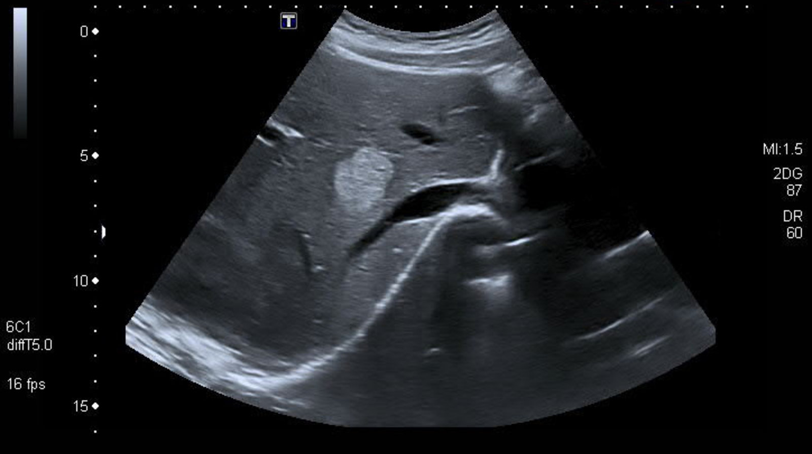

Hepatic hemangioma

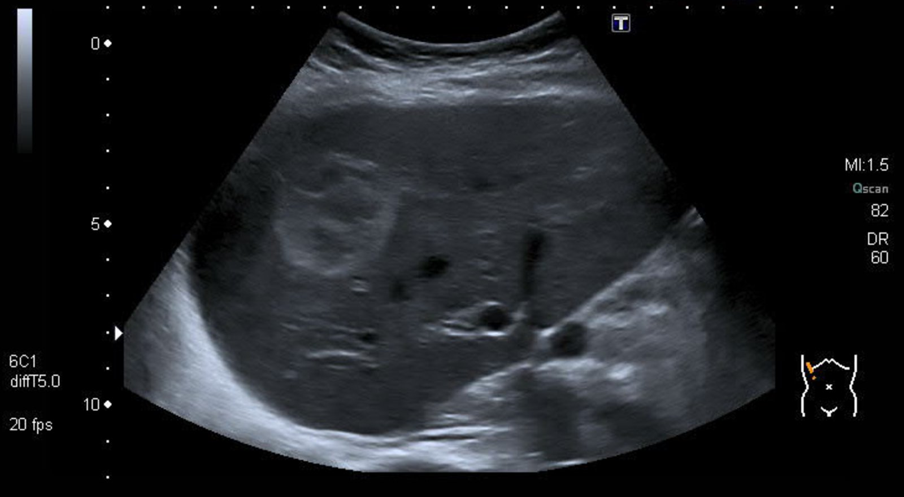

Mixed echogenicity atypical hemangioma

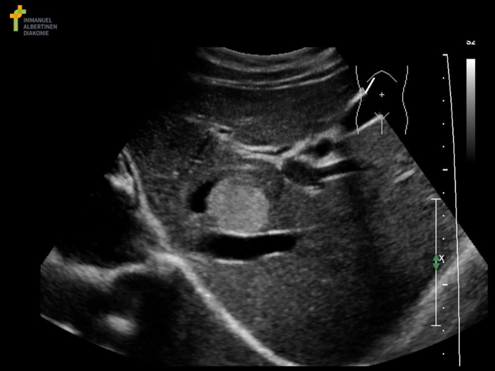

Hepatic hemangioma

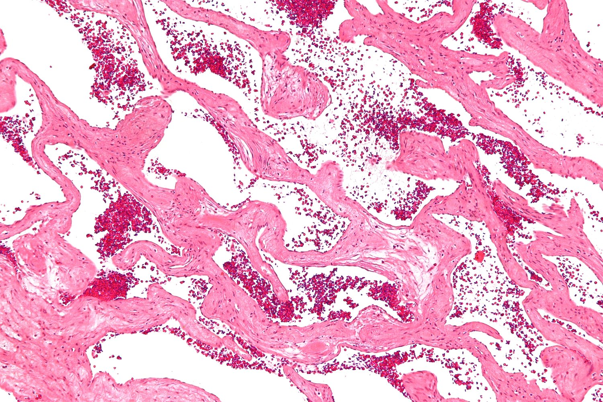

Cavernous hemangioma of the liver

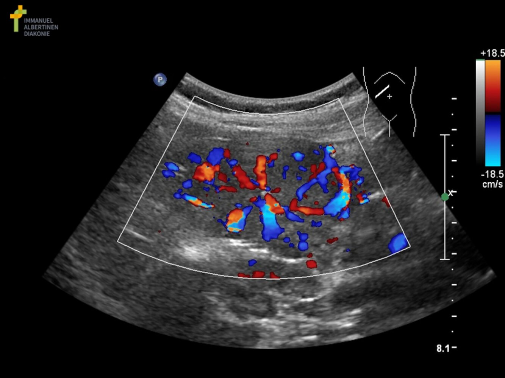

Focal nodular hyperplasia

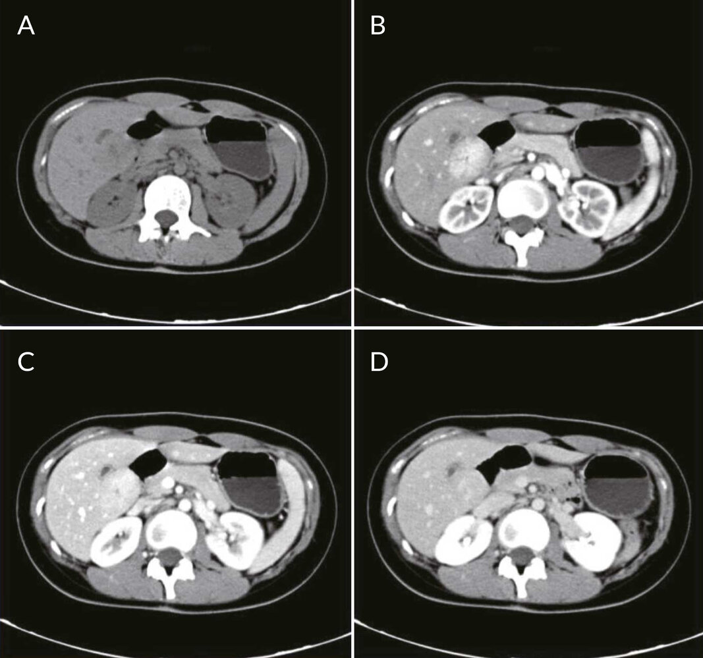

Focal nodular hyperplasia

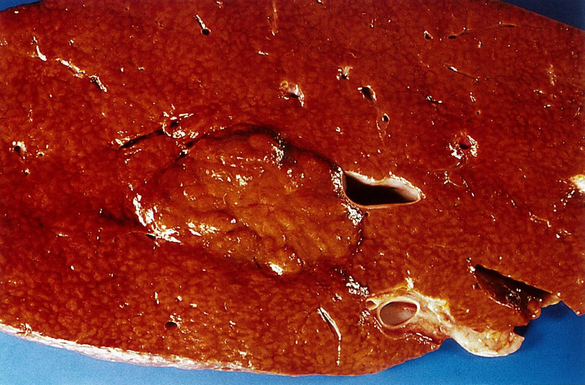

Focal nodular hyperplasia

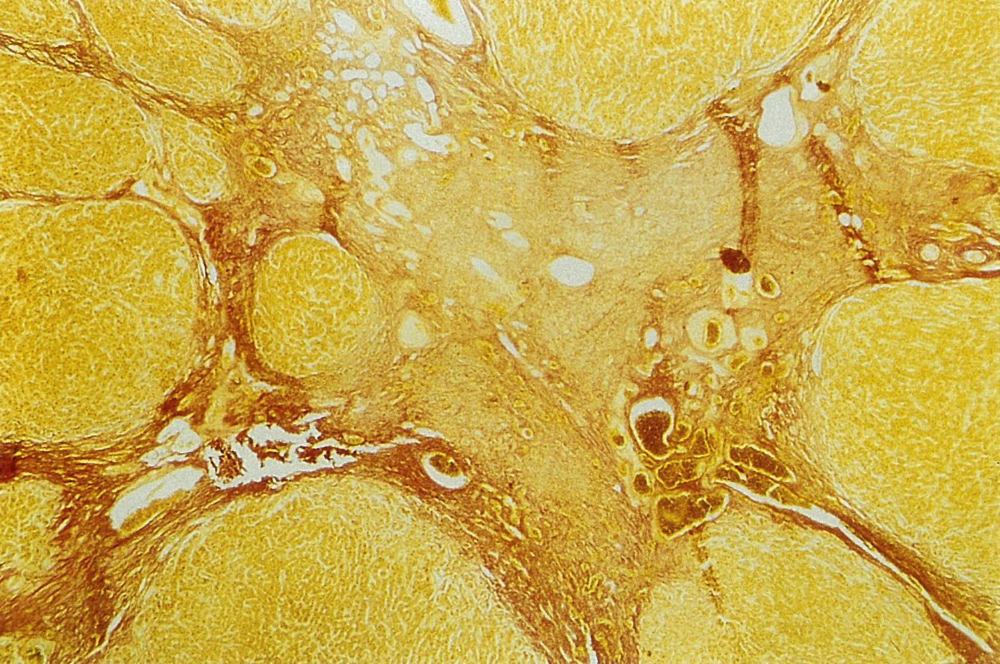

Focal nodular hyperplasia

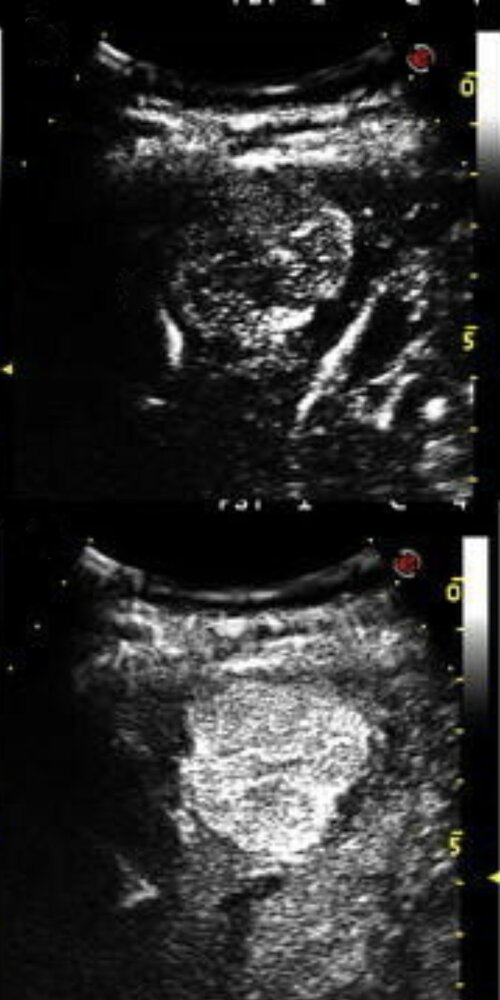

Contrast-enhanced ultrasound of hepatocellular adenoma (hepatic adenoma)

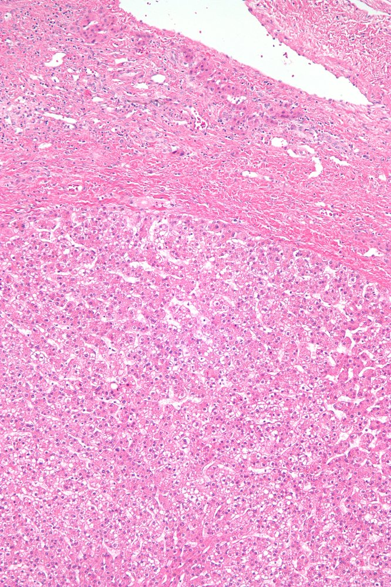

Hepatocellular adenoma

---

## Hepatic cysts

### Simple <u>hepatic cysts</u> [[17]](https://coursology-qbank.com/amboss/article/MBbMYw)

* Etiology: congenital

* <u>Epidemiology</u>

* Peak <u>incidence</u>: > 50 years

* Sex: slightly higher in females (1.5:1 female:male <u>ratio</u>) [[18]](https://coursology-qbank.com/amboss/article/nBb7Yw)

* Clinical features

* Usually asymptomatic

* Patients with large cysts may present with dull abdominal <u>pain</u> located in the <u>right upper quadrant</u>, <u>bloating</u>, and early satiety.

* Diagnostics

* <u>Ultrasonography</u>: <u>anechoic</u>, round lesion with <u>dorsal</u> <u>acoustic enhancement</u>

* CT: well-delimited lesion; shows no <u>contrast enhancement</u>

* Treatment: <u>laparoscopic</u> resection if symptomatic

### Congenital polycystic <u>liver</u>

See <u>polycystic kidney disease</u>.

### Hydatid (echinococcal) cysts

See <u>echinococcosis</u>.

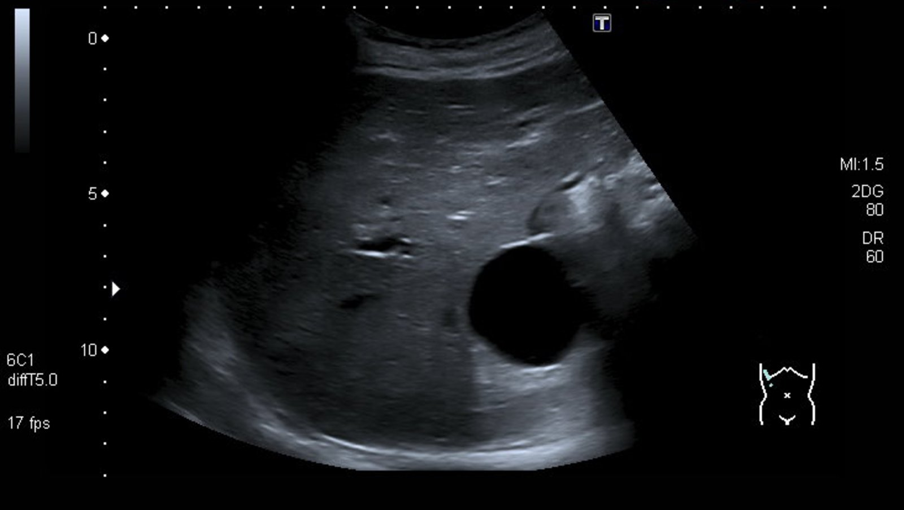

Simple hepatic cyst

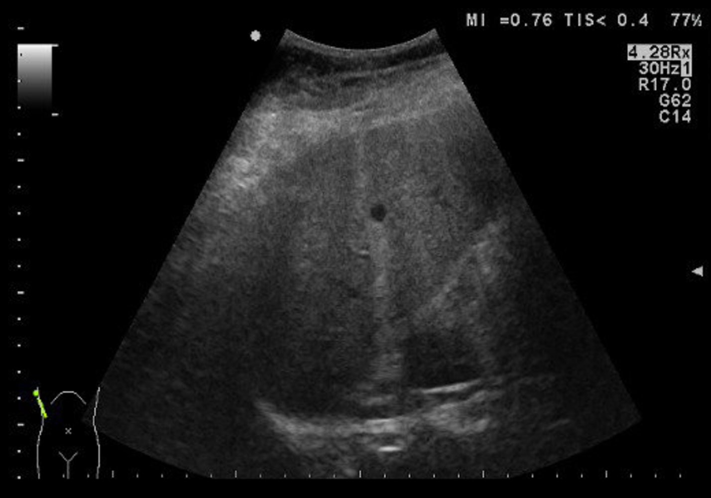

Simple hepatic cyst

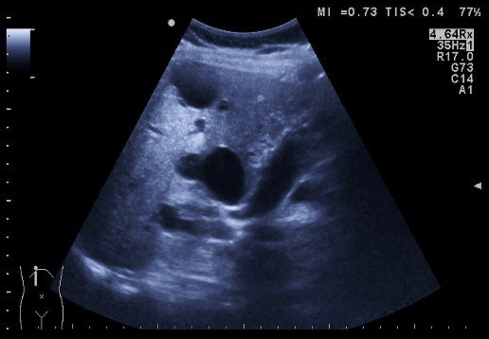

Liver cysts

---

## Differential diagnoses

* Malignant <u>liver</u> tumors

* <u>Hepatocellular carcinoma</u> (<u>HCC</u>)

* Intrahepatic <u>cholangiocellular carcinoma</u> (CCC)

* <u>Liver metastases</u>

* <u>Liver abscess</u>

* Localized nonspace occupying lesions of the <u>liver</u>

* <u>Steatohepatitis</u> (<u>fatty liver</u>) with localized <u>steatosis</u> close to the <u>gallbladder</u> and <u>portal vein</u>

* Regenerative <u>nodules</u> in <u>liver cirrhosis</u>

* <u>Portal vein thrombosis</u>

* Accessory lobes of the <u>liver</u>: caudate and quadrate lobes

* <u>Round ligament of the liver</u>

* Hepatic inflammatory pseudotumor: a rare hepatic lesion that is associated with other inflammatory lesions (e.g., <u>sclerosing</u> <u>cholangitis</u>, <u>retroperitoneal fibrosis</u>, and autoimmune diseases); most commonly seen in young men [[19]](https://coursology-qbank.com/amboss/article/ABbRWw)

* Fibrohistiocytic subtype [[20]](https://coursology-qbank.com/amboss/article/EhV8f80)

* Pathology: xanthogranulomatous inflammation (e.g., foamy <u>macrophages</u>, <u>multinucleated giant cells</u>) and <u>neutrophils</u>

* Location: typically peripheral <u>liver</u> <u>parenchyma</u>

* Clinical features: <u>fever</u>, abdominal <u>pain</u>, <u>malaise</u>

* Lymphoplasmacytic subtype (IgG4-related) [[20]](https://coursology-qbank.com/amboss/article/EhV8f80)

* Pathology: dense lymphoplasmacytic infiltration with IgG4-positive <u>plasma cells</u>, obliterative phlebitis, and <u>eosinophils</u>

* Location: typically near the <u>liver</u> hilum

* Clinical features: often asymptomatic; may present with <u>biliary obstruction</u>

* Biloma [[21]](https://coursology-qbank.com/amboss/article/yBbdWw)

* Definition: collection of <u>bile</u> in the form of a cyst (<u>biliary cyst</u>)

* Etiology

* Common complication of hemihepatectomy or <u>liver transplantation</u> [[22]](https://coursology-qbank.com/amboss/article/9BbN1w)[[23]](https://coursology-qbank.com/amboss/article/CBbq1w)

* Trauma

* Spontaneous

* Pathology: insufficient closure of the <u>bile</u> ducts

* Clinical features

* Nonspecific

* <u>Fever</u>, and signs of inflammation

* Potential <u>jaundice</u>

* Abdominal <u>pain</u>

* Diagnostics [[24]](https://coursology-qbank.com/amboss/article/xBbE1w)[[25]](https://coursology-qbank.com/amboss/article/BBbz1w)

* <u>Ultrasonography</u>: <u>hypoechoic</u> to <u>anechoic</u>

* CT: <u>hypodense</u>, possible peripheral <u>contrast enhancement</u>

* Lab findings: <u>elevated transaminases</u> and <u>bilirubin</u>, and <u>leukocytosis</u>

* Treatment

* Drainage and <u>antibiotic</u> treatment in patients with inflammation

* Spontaneous healing is possible.

* Surgical repair may be necessary

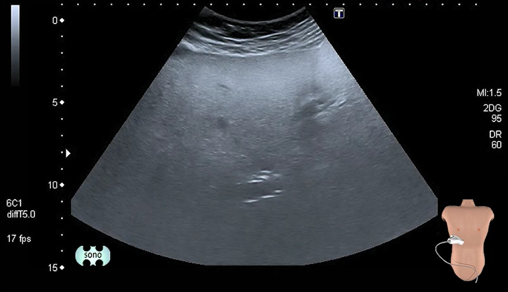

Diffuse hepatic steatosis

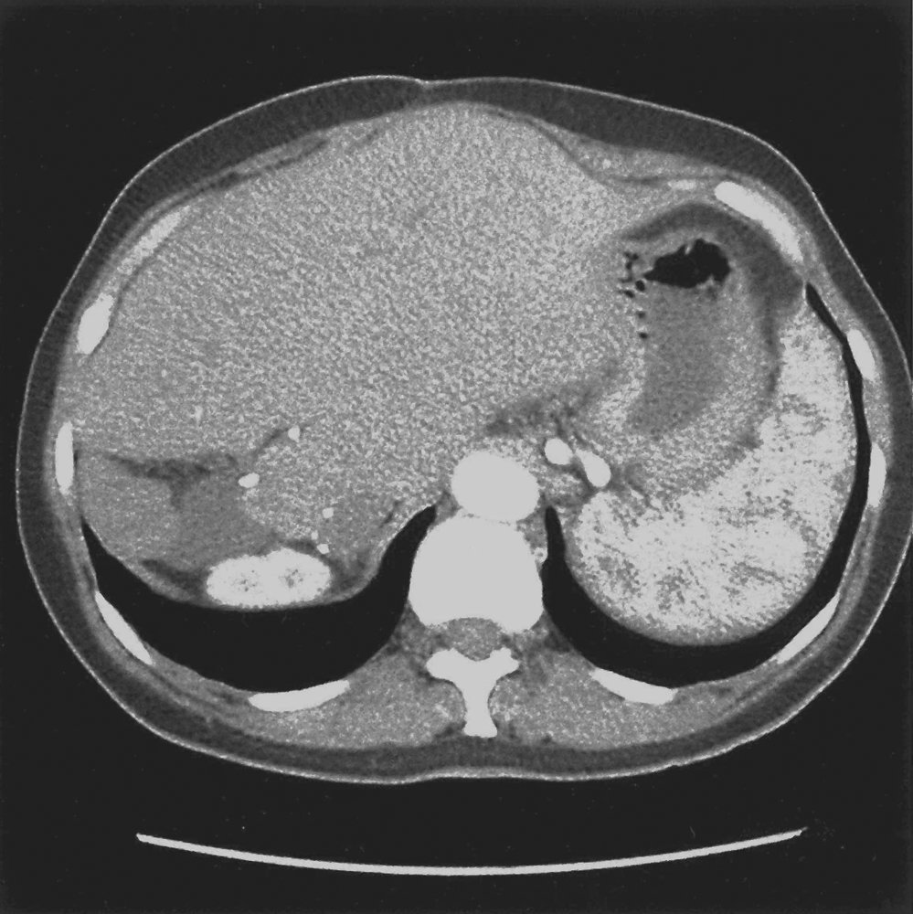

Biloma

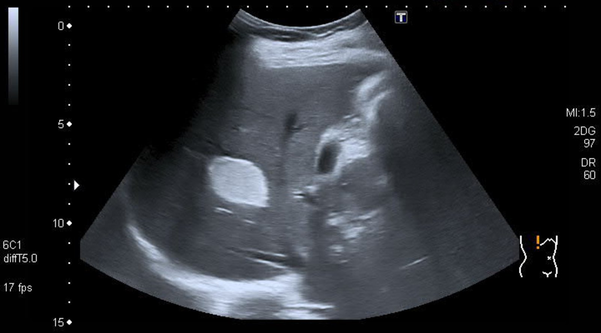

Hepatic lipoma

The differential diagnoses listed here are not exhaustive.

---