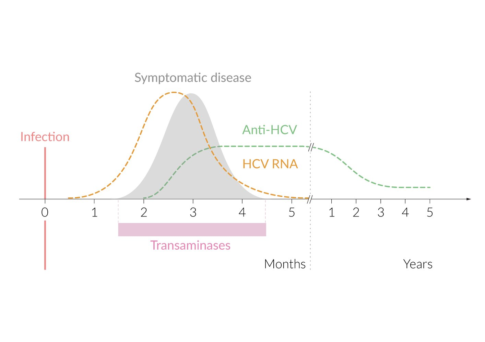
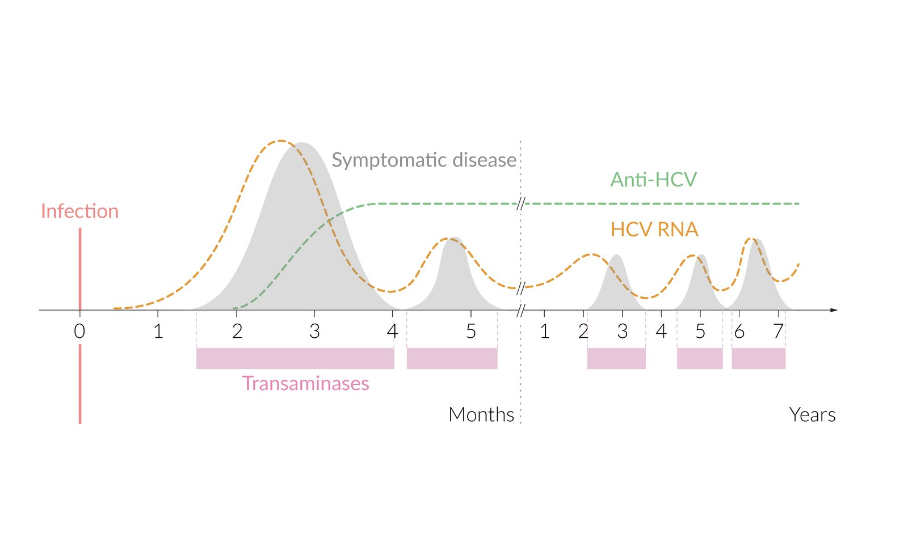

# Hepatitis C

*Categories: Clinical knowledge > Internal medicine > Gastroenterology > Diseases of the liver > Hepatitis C*

[Original Article Link](https://coursology-qbank.com/amboss/article/lS0v-2)

---

## Summary

<u>Hepatitis</u> C is an infection caused by the <u>hepatitis C virus</u> (<u>HCV</u>), which attacks <u>liver</u> cells and causes <u>liver</u> inflammation. <u>HCV</u> is a <u>bloodborne pathogen</u> commonly transmitted through <u>needlestick injuries</u> in health care settings or through shared drug-injection needles. <u>Perinatal transmission</u> is the leading cause of <u>HCV infection in children</u>. Screening plays a central role in detecting <u>HCV</u> infection because most infected individuals are asymptomatic or mildly symptomatic. Approximately 85% of individuals with an acute infection that is not recognized and treated will develop <u>chronic hepatitis C</u>, which is associated with <u>cirrhosis</u>, <u>hepatocellular carcinoma</u>, and increased mortality. The presence of <u>HCV</u> <u>antibodies</u> and/or <u>HCV</u> <u>RNA</u> confirms the diagnosis. <u>HCV</u> infection can be safely and effectively treated with <u>direct-acting antivirals</u> (<u>DAAs</u>), which have cure rates of over 95% and are approved for use beginning at 3 years of age. Simplified algorithms for the use of <u>DAAs</u> in treatment-naive patients without <u>decompensated cirrhosis</u> reduce the need for specialist-guided care.

Viral Hepatitis: Comparing Hepatitis A, B, C, D, and E

---

## Definitions

* Acute hepatitis C: <u>HCV</u> infection that develops during the first 6 months following the exposure

* Chronic hepatitis C: <u>HCV</u> infection that persists beyond 6 months following the exposure [[1]](https://coursology-qbank.com/amboss/article/sgat9P)

---

## Epidemiology

* <u>Prevalence</u>: Up to 2% of the US population has <u>chronic HCV infection</u>. [[2]](https://coursology-qbank.com/amboss/article/N-b-xw)

* <u>Incidence</u>: 1 case per 100,000 population, > 40,000 new infections per year in the US [[3]](https://coursology-qbank.com/amboss/article/N6Y-OJ)

* Clinical progression: 75–85% of individuals with <u>HCV</u> infection go on to develop chronic disease. [[4]](https://coursology-qbank.com/amboss/article/opY0qJ)

Hepatitis C fact sheet and prevalence map

Epidemiological data refers to the US, unless otherwise specified.

---

## Etiology

### <u>Pathogen</u>

* <u>Hepacivirus</u> C (<u>Hepatitis C virus</u>): <u>RNA virus</u> of the <u>Hepacivirus</u> genus and <u>Flaviviridae</u> family

* The risk of chronic infection is multifactorial and depends on the host's ability to clear the <u>pathogen</u> through activation of multiple <u>innate immunity</u> pathways against the viral envelope. [[5]](https://coursology-qbank.com/amboss/article/qpYCqJ)

* Flawed <u>proofreading</u> capability of RNA-dependent RNA polymerase (no 3′– 5′ exonuclease activity) introduces mutations into <u>genes</u> encoding viral glycoprotein envelope and enabling novel <u>antigen</u> production.

* Rapid replication rate produces many antigenically unique viral envelopes.

* Infection persists because the production rate of new mutant <u>virions</u> exceeds the production rate of host <u>antibodies</u>.

* There are six <u>genotypes</u>: In the US, the main ones are <u>genotype</u> 1 (65–80%) and <u>genotype</u> 2 (10–15%). [[6]](https://coursology-qbank.com/amboss/article/n-b7Bw)

* Reinfection with another <u>HCV</u> <u>genotype</u> is possible.

### Transmission

* Parenteral

* Needle sharing among individuals who use injection drugs

* <u>Needlestick injury</u> (e.g., health care workers)  [[7]](https://coursology-qbank.com/amboss/article/M-bMBw)

* <u>Blood transfusion</u>  [[8]](https://coursology-qbank.com/amboss/article/L-bwBw)

* Dialysis

* <u>Organ transplantation</u>

* Sexual: rare (in contrast to <u>HBV</u> and <u>HIV</u>)

* <u>Perinatal</u> (vertical)

### Risk factors for HCV infection

* Injection drug use (past or current, especially long-term use)  [[9]](https://coursology-qbank.com/amboss/article/IpYYIJ)

* <u>Hepatitis B virus</u> or <u>HIV</u> positivity

* History of incarceration

* Individuals born between 1945 and 1965  [[10]](https://coursology-qbank.com/amboss/article/rpYfIJ)

* Individuals who received a <u>blood transfusion</u> or organ transplant before 1992

> [!TIP]
> Patients at <u>high risk of HCV infection</u> should be tested.

---

## Clinical features

### <u>Incubation period</u>

* 2 weeks to 6 months

### Acute course

* Asymptomatic in 80% of cases

* Symptomatic (see “<u>Acute viral hepatitis</u>”)

* <u>Malaise</u>, <u>fever</u>, <u>myalgias</u>, <u>arthralgias</u>

* <u>RUQ</u> <u>pain</u>, tender <u>hepatomegaly</u>

* <u>Nausea</u>, <u>vomiting</u>, <u>diarrhea</u>

* <u>Jaundice</u>, possibly <u>pruritus</u>

> [!TIP]
> Symptoms are nonspecific and may be similar to those of other acute viral infections.

### Chronic course

* Seen especially in asymptomatic individuals (up to 85%), as the disease may go undiagnosed and treatment may be delayed or never initiated (carrier state). [[1]](https://coursology-qbank.com/amboss/article/sgat9P)

* Findings often mild, nonspecific (e.g., fatigue)

* <u>Liver cirrhosis</u> (up to 25% of cases) within 20 years of infection [[11]](https://coursology-qbank.com/amboss/article/Ega8CP)

* Extrahepatic features of HCV (common) 

* Hematological

* <u>Mixed cryoglobulinemia</u>

* <u>Lymphoma</u> (especially <u>B-cell</u> <u>non-Hodgkin lymphoma</u>)

* <u>ITP</u>

* <u>Autoimmune hemolytic anemia</u>

* Monoclonal gammopathies

* Renal

* Membranoproliferative <u>glomerulonephritis</u> (more common)

* <u>Membranous glomerulonephritis</u>

* Rheumatological

* <u>Polyarteritis nodosa</u>

* <u>Sjogren syndrome</u>

* Dermatological

* <u>Porphyria cutanea tarda</u>

* <u>Lichen planus</u>

* Endocrine

* <u>Diabetes mellitus</u>

* <u>Autoimmune thyroiditis</u> (may lead to <u>hypothyroidism</u>)

* Vascular: <u>leukocytoclastic vasculitis</u>

* Others: <u>sialadenitis</u>

---

## Screening

See also "<u>HCV in pregnancy</u>" and "<u>HCV in children</u>" for specific <u>screening recommendations</u>.

### Individuals without <u>risk factors for HCV infection</u> [[12]](https://coursology-qbank.com/amboss/article/GmWBSN0)[[13]](https://coursology-qbank.com/amboss/article/jqX_y_)[[14]](https://coursology-qbank.com/amboss/article/Wf1POT0)

* All individuals aged ≥ 18 years: at least once per lifetime  [[13]](https://coursology-qbank.com/amboss/article/jqX_y_)[[15]](https://coursology-qbank.com/amboss/article/DnY1vp)

* Individuals planning to become pregnant: prior to <u>conception</u> [[16]](https://coursology-qbank.com/amboss/article/-qWDa50)

> [!TIP]
> The <u>CDC</u> recommends against universal screening in settings where <u>HCV</u> disease <u>prevalence</u> is < 0.1%. [[14]](https://coursology-qbank.com/amboss/article/Wf1POT0)

### Individuals with <u>risk factors for HCV infection</u> [[14]](https://coursology-qbank.com/amboss/article/Wf1POT0)[[15]](https://coursology-qbank.com/amboss/article/DnY1vp)

* One-time screening

* Upon diagnosis with <u>HIV</u>

* Individuals < 18 years of age with <u>risk factors for HCV infection</u>

* <u>Infants</u> born to <u>HCV</u>-positive mothers

* Repeat screening

* Screening after recent exposure to <u>HCV</u> (e.g., <u>health care personnel exposure</u>)

* Initial screening: ideally within 48 hours of exposure

* Repeat testing: ≥ 6 months after exposure (if the initial test is negative)

* Annual screening

* People who recreationally inject drugs

* Men with <u>HIV infection</u> who have unprotected sex with men

* <u>Men who have sex with men</u> taking <u>HIV preexposure prophylaxis</u>

* Other indications

* Periodically based on individual <u>risk factors for HCV infection</u>

* On patient request

---

## Diagnosis

### General principles [[15]](https://coursology-qbank.com/amboss/article/DnY1vp)

* Indications for <u>hepatitis C testing</u>

* <u>Screening for HCV</u> in asymptomatic individuals

* New diagnosis of <u>hepatitis</u> or <u>cirrhosis</u>

* <u>Extrahepatic features of HCV</u> infection

* The same tests  are used for both screening and diagnosis.

* For patients who test positive, obtain additional studies to guide management.

* <u>Liver biopsy</u> is not routinely recommended.

> [!TIP]
> Individuals with <u>hepatitis</u> C are often asymptomatic or minimally symptomatic. Screening plays an essential role in the diagnosis of <u>hepatitis</u> C infection.

> [!WARNING]
> <u>Hepatitis</u> C is a nationally <u>notifiable disease</u> in the US. Notify the state or local health department if a case is confirmed. [[17]](https://coursology-qbank.com/amboss/article/2SVT_F0)

### <u>Hepatitis</u> C tests [[15]](https://coursology-qbank.com/amboss/article/DnY1vp)

* Anti-HCV antibodies (<u>EIA</u>/<u>ELISA</u> immunoassay): initial test for immunocompetent individuals who are <u>HCV</u> naïve

* <u>HCV</u> <u>RNA</u> (<u>qualitative PCR</u>)

* If <u>anti-HCV antibody</u> test is positive

* Alternatively, as the initial test in patients with the following:

* Prior <u>HCV</u> infection

* <u>Immunocompromise</u>

* <u>Infants</u> aged 2–17 months with <u>perinatal</u> <u>HCV</u> exposure (see "<u>HCV in children</u>")

#### Interpretation of hepatitis C tests

|  <u>Interpretation of hepatitis C tests</u> [[15]](https://coursology-qbank.com/amboss/article/DnY1vp) |  |  |  |
| --- | --- | --- | --- |
|  |  | <u>Anti-HCV antibodies</u> |  |
| Negative | Positive |  |  |
| <u>HCV</u> <u>RNA</u> | Negative |   * No infection  * Or within the <u>window period</u>    |   * Resolved infection  * Or <u>false-positive</u> <u>antibody</u> test    |
| Positive |  * Active infection  * Within the <u>window period</u>  * Or patient is <u>immunocompromised</u>   |  * Active infection (acute or chronic)   |  |
|   * <u>Anti-HCV antibodies</u> may take as long as 6 weeks after <u>HCV</u> exposure to be detectable on tests.  * <u>HCV</u> <u>RNA</u> may take as long as 2–3 weeks after viral exposure to be detectable on tests.    |  |  |  |

Serology of resolved hepatitis C infection

Serology of chronic hepatitis C infection

### Additional evaluations [[12]](https://coursology-qbank.com/amboss/article/GmWBSN0)

Obtain prior to treatment to exclude <u>liver cirrhosis</u> and its complications and assess for comorbidities.

#### <u>Laboratory studies</u>

* Viral load determination: <u>quantitative PCR</u> for <u>HCV</u> <u>RNA</u>

* Routine studies

* <u>CBC</u>, <u>BMP</u>

* <u>Hepatocellular enzymes</u>

* Normal or ↑ <u>transaminases</u> (10–20 × <u>ULN</u>) [[18]](https://coursology-qbank.com/amboss/article/Wc1PYf0)

* Fluctuating <u>ALT</u> peaks indicate <u>acute HCV infection</u> [[15]](https://coursology-qbank.com/amboss/article/DnY1vp)

* <u>Cholestasis parameters</u>

* ↑ <u>GGT</u>

* ↑ <u>Alkaline phosphatase</u>

* ↑ <u>Bilirubin</u>

* <u>Liver synthetic function tests</u> (alterations suggest <u>cirrhosis</u>)

* ↓ <u>Albumin</u>

* ↓ Total protein

* ↑ <u>PT</u>/<u>INR</u>

* Evaluation of <u>coinfection</u>

* <u>HIV testing</u>

* <u>Hepatitis B serology</u>

* <u>Hepatitis A</u> <u>serology</u>

* Serum <u>pregnancy test</u> (if applicable): ideally performed directly before initiating treatment

#### <u>Cirrhosis</u> assessment

* Presence of <u>liver fibrosis</u>: established with either of the following  [[15]](https://coursology-qbank.com/amboss/article/DnY1vp)

* <u>FIB-4 score</u> > 3.25

* Supportive findings during a previous assessment

* <u>Clinical features of liver cirrhosis</u>

* <u>Serological tests</u> (e.g., FibroSure®)

* <u>Liver elastography</u> (e.g., <u>FibroScan®</u>)

* <u>Liver biopsy</u>

* Patients with <u>liver fibrosis</u> or confirmed <u>cirrhosis</u>

* Calculate the <u>Child-Pugh score</u>.

* Obtain a <u>liver</u> <u>ultrasound</u> to <u>screen for HCC</u>.

* Consider determining the <u>HCV</u> <u>genotype</u> .

#### <u>Liver biopsy</u>

* Consider when:

* Etiology of <u>hepatitis</u> is unknown

* Accurate <u>liver fibrosis</u> staging would alter treatment

* Supportive findings: See “Pathology.”

---

## Pathology

* Acute Phase [[19]](https://coursology-qbank.com/amboss/article/V2bGgG)

* Focal areas of macrovesicular <u>steatosis</u>

* <u>Bile</u> duct injury

* Sinusoidal inflammation of hepatic cells

* Lobular involvement in the form of eosinophilic single-cell <u>necrosis</u>

* Chronic phase

* Lymphoid follicles in <u>portal triad</u>

* Necroinflammation of periportal <u>liver</u> cells

* Variable degree of <u>fibrosis</u>

* Severe <u>hepatocyte</u> injury

Without treatment, the disease will ultimately progress to <u>liver fibrosis</u>, <u>cirrhosis</u>, and <u>hepatocellular carcinoma</u>. See “<u>Pathology of viral hepatitis</u>.”

---

## Differential diagnoses

* <u>Autoimmune hepatitis</u>

* <u>Cholangitis</u>

* See “<u>Overview of viral hepatitis</u>.”

The differential diagnoses listed here are not exhaustive.

---

## Treatment

### General principles [[15]](https://coursology-qbank.com/amboss/article/DnY1vp)

* Recommend early <u>antiviral therapy</u> unless <u>life expectancy</u> is too short for the patient to benefit.

* Determine patient eligibility for simplified treatment or specialist-guided treatment regimens.

* The goal of treatment is <u>sustained virologic response</u> (<u>SVR</u>).

* Refer patients with <u>end-stage liver disease</u> for <u>liver transplantation</u> evaluation.

> [!TIP]
> Patients who are treatment-naive and have no history of <u>decompensated cirrhosis</u> are eligible for simplified treatment. [[15]](https://coursology-qbank.com/amboss/article/DnY1vp)

### <u>Antiviral therapy</u> [[15]](https://coursology-qbank.com/amboss/article/DnY1vp)

<u>HCV</u> infection is always treated with a multidrug approach (no antivirals are approved as monotherapy).

* Direct-acting antivirals (<u>DAAs</u>)

* Antivirals target and inhibit <u>HCV</u>-encoded <u>proteins</u> that are essential for the <u>HCV</u> replication cycle.

* Example regimens (approved for use beginning at 3 years of age)

* <u>Glecaprevir</u> PLUS <u>pibrentasvir</u> (all 6 <u>genotypes</u>)

* <u>Sofosbuvir</u> PLUS <u>velpatasvir</u> (all 6 <u>genotypes</u>)

* <u>Ledipasvir</u> PLUS <u>sofosbuvir</u> (<u>genotypes</u> 1, 4, 5, and 6)

* <u>Interferon</u> PLUS <u>ribavirin</u> [[20]](https://coursology-qbank.com/amboss/article/9gaNxP)

* Was the preferred treatment before the development of <u>DAAs</u>

* Associated with severe adverse effects (e.g., <u>arthralgias</u>, <u>thrombocytopenia</u>, <u>leukopenia</u>, <u>depression</u>, <u>anemia</u>) and <u>teratogenicity</u>

* Contraindicated in patients with <u>decompensated cirrhosis</u> (high risk of worsening <u>cirrhosis</u> decompensation)

> [!WARNING]
> <u>Ribavirin</u> is a <u>teratogen</u>. Individuals taking <u>ribavirin</u> and partners of individuals taking <u>ribavirin</u> should avoid <u>pregnancy</u> until 6 months after completion of therapy. [[12]](https://coursology-qbank.com/amboss/article/GmWBSN0)[[16]](https://coursology-qbank.com/amboss/article/-qWDa50)

> [!TIP]
> <u>DAAs</u> have superior <u>efficacy</u> and safety profiles compared with <u>interferon</u> or <u>ribavirin</u>-based regimens and are thus preferred.

> [!NOTE]
> Acute and chronic <u>HCV</u> are treated with the same antiviral regimens.

### Treatment regimens

#### Simplified treatment [[12]](https://coursology-qbank.com/amboss/article/GmWBSN0)

Simplified treatment regimens may be provided by nonspecialists.

* Indications: treatment-naive patients with none of the following

* Current <u>pregnancy</u>

* Current or prior decompensated <u>cirrhosis</u> (<u>Child-Pugh class B</u> or C)

* <u>Compensated cirrhosis</u> (<u>Child-Pugh class A</u>) with <u>end-stage renal disease</u>

* <u>Hepatitis B</u> <u>coinfection</u>

* <u>Hepatocellular carcinoma</u>

* History of <u>liver transplant</u>

* Regimen examples

* <u>Glecaprevir</u> PLUS <u>pibrentasvir</u> DOSAGE [[15]](https://coursology-qbank.com/amboss/article/DnY1vp)

* <u>Sofosbuvir</u> PLUS <u>velpatasvir</u> DOSAGE: not recommended in patients with <u>compensated cirrhosis</u> with <u>HCV</u> <u>genotype</u> 3 [[15]](https://coursology-qbank.com/amboss/article/DnY1vp)

* Monitoring

* All patients

* Assess for potential drug-<u>drug interactions</u> between pharmacotherapy and current medications.

* Monitor for sequelae of increased hepatic drug metabolism.

* Patients with <u>cirrhosis</u> 

* Monitor for signs of <u>decompensated cirrhosis</u>.

* Consider obtaining serial <u>liver chemistries</u> to monitor for <u>liver</u> injury.

> [!WARNING]
> Refer for specialty care if clinical findings and/or <u>laboratory studies</u> indicate hepatic decompensation (e.g., <u>jaundice</u>, <u>hepatic encephalopathy</u>, ↑ <u>bilirubin</u>, ↑ <u>transaminases</u>)

#### Specialist-guided treatment [[15]](https://coursology-qbank.com/amboss/article/DnY1vp)

* Indications

* Ineligible for simplified treatment (e.g., patients with <u>decompensated cirrhosis</u>)

* Did not achieve <u>SVR</u> after initial treatment

* Regimen examples

* <u>DAAs</u> in combination with <u>ribavirin</u> (e.g., <u>ledipasvir</u> PLUS <u>sofosbuvir</u> PLUS <u>ribavirin</u> ) [[15]](https://coursology-qbank.com/amboss/article/DnY1vp)

* If <u>ribavirin</u> is contraindicated (e.g., during <u>pregnancy</u>): Extend <u>DAA</u> treatment to 24 weeks.

### Posttreatment care [[12]](https://coursology-qbank.com/amboss/article/GmWBSN0)[[21]](https://coursology-qbank.com/amboss/article/AobReu)

Assess for <u>sustained virologic response</u> with a <u>quantitative PCR</u> for <u>HCV</u> <u>RNA</u> ≥ 12 weeks after completion of therapy.

* <u>SVR</u> achieved: i.e., viral load is undetectable

* Ongoing <u>risk factors for HCV infection</u>: Screen for reinfection periodically.

* No <u>cirrhosis</u>: No further <u>liver</u>-related monitoring is required.

* <u>Cirrhosis</u>: Continue to screen for <u>liver</u>-related complications (e.g., <u>HCC</u>, <u>esophageal varices</u>).

* <u>SVR</u> not achieved: i.e., persistent <u>viremia</u> (unsuccessful treatment) or <u>viremia</u> after initially achieving <u>SVR</u> (relapse or reinfection)

* Refer to specialist care.

* Assess for disease progression every 6–12 months.

> [!TIP]
> If <u>hepatocellular enzymes</u> remain elevated after achieving <u>SVR</u>, test for other etiologies of <u>liver</u> disease. [[21]](https://coursology-qbank.com/amboss/article/AobReu)

### Supportive care for HCV infection [[12]](https://coursology-qbank.com/amboss/article/GmWBSN0)

* All individuals with <u>HCV</u>

* Avoid <u>hepatotoxic</u> drugs (including supplements) and <u>alcohol</u> use.

* Counsel about <u>HIV</u> and <u>hepatitis B prevention</u>.

* Counsel regarding adherence, reinfection prevention, and medication risks.

* <u>Hepatitis A</u> and B seronegative individuals: Offer <u>hepatitis A vaccination</u> and/or <u>hepatitis B vaccination</u>.

* People who inject drugs

* Counsel on <u>harm reduction strategies</u>.

* Refer for treatment of <u>substance use disorder</u>.

* Individuals with <u>cirrhosis</u>: See "<u>Supportive care for cirrhosis</u>."

> [!TIP]
> Monitor for <u>complications of HCV</u> infection in individuals who decline antiviral treatment or do not achieve <u>SVR</u>.

---

## Complications

* Rarely <u>fulminant hepatitis</u> (<u>liver</u> failure)  [[22]](https://coursology-qbank.com/amboss/article/tUYXUo)[[23]](https://coursology-qbank.com/amboss/article/FUYgUo)

* <u>Liver cirrhosis</u>

* <u>Hepatocellular carcinoma</u>

* <u>Secondary hemochromatosis</u>

We list the most important complications. The selection is not exhaustive.

---

## Prevention

* <u>Primary prevention</u>

* There is currently no effective preexposure or <u>postexposure prophylaxis</u> and no <u>vaccine</u> against <u>HCV</u> infection.

* Use <u>standard precautions</u> for <u>bloodborne pathogens</u> in healthcare settings.

* Educate individuals with <u>HCV</u> infection about preventing transmission, e.g.:

* Do not donate blood, semen, etc.

* Do not share personal items that might have blood on them (e.g., needles, razors, toothbrushes).

* Cover open cuts and sores.

* <u>Secondary prevention</u>: See “<u>Screening for hepatitis C virus infection</u>.”

> [!TIP]
> Spontaneous resolution of <u>HCV</u> and successful treatment of infection do not confer <u>immunity</u> to reinfection.

---

## Special patient groups

The approach to <u>HCV</u> infection requires additional considerations in pregnant individuals;  and children.

---

## HCV in pregnancy

The <u>etiology of HCV infection</u> and <u>clinical features of HCV</u> are the same in pregnant and nonpregnant adults. [[16]](https://coursology-qbank.com/amboss/article/-qWDa50)[[24]](https://coursology-qbank.com/amboss/article/eSVxAF0)

### Screening for HCV infection in pregnancy [[16]](https://coursology-qbank.com/amboss/article/-qWDa50)[[24]](https://coursology-qbank.com/amboss/article/eSVxAF0)[[25]](https://coursology-qbank.com/amboss/article/3SVSzF0)

* Indications 

* All individuals during each <u>pregnancy</u>, ideally during the <u>initial prenatal visit</u>  [[13]](https://coursology-qbank.com/amboss/article/jqX_y_)[[17]](https://coursology-qbank.com/amboss/article/2SVT_F0)

* Diagnosis of <u>intrahepatic cholestasis of pregnancy</u> with either of the following:

* Present at < 24 weeks' <u>gestation</u> [[24]](https://coursology-qbank.com/amboss/article/eSVxAF0)

* <u>Bile acid</u> levels ≥ 100 mcmol/L [[24]](https://coursology-qbank.com/amboss/article/eSVxAF0)

* Method: <u>anti-HCV antibody</u>

* Further management of positive screening: Confirm diagnosis using <u>HCV</u> <u>RNA</u>; see "<u>Interpretation of hepatitis C tests</u>" for details.

* <u>HCV</u> <u>RNA</u> positive: See "<u>Management of HCV infection in pregnancy</u>."

* <u>HCV</u> <u>RNA</u> negative

* Consider a second <u>anti-HCV antibody</u> test to exclude <u>false positive</u> <u>anti-HCV</u> result.  [[17]](https://coursology-qbank.com/amboss/article/2SVT_F0)[[24]](https://coursology-qbank.com/amboss/article/eSVxAF0)

* Repeat <u>HCV</u> <u>RNA</u> testing if patient has <u>risk factors for HCV</u> within the past 6 months and/or <u>clinical features of HCV</u>. [[17]](https://coursology-qbank.com/amboss/article/2SVT_F0)

### Management of HCV infection in pregnancy [[16]](https://coursology-qbank.com/amboss/article/-qWDa50)[[24]](https://coursology-qbank.com/amboss/article/eSVxAF0)

#### Antepartum management

* Coordinate care with specialists (e.g., hepatology, infectious disease, <u>maternal-fetal medicine</u>).

* As in nonpregnant adults, obtain additional laboratory testing in newly diagnosed patients to assess:

* Baseline viral load (using <u>quantitative PCR</u>)

* Degree of <u>liver</u> disease (e.g., <u>CBC</u>, <u>liver synthetic function tests</u>)

* For <u>coinfections</u> and/or <u>hepatitis</u> <u>immunity</u> 

* <u>STI screening</u>

* <u>Hepatitis B serology</u>

* <u>Hepatitis A</u> <u>immunity</u> <u>serology</u> (i.e., <u>anti-HAV IgG</u>)

* <u>HCV</u> <u>genotype</u>

* <u>Antiviral therapy</u> is generally not recommended, but specialists may consider it using shared-decision making.  [[12]](https://coursology-qbank.com/amboss/article/GmWBSN0)[[24]](https://coursology-qbank.com/amboss/article/eSVxAF0)

* Provide <u>supportive care for HCV infection</u>, including <u>hepatitis A</u> and B <u>vaccination</u> for seronegative individuals.

* If <u>invasive prenatal diagnostic testing</u> is indicated, use <u>shared decision-making</u> and discuss potential risks and benefits.  [[16]](https://coursology-qbank.com/amboss/article/-qWDa50)[[24]](https://coursology-qbank.com/amboss/article/eSVxAF0)

* Consider a <u>fetal growth ultrasound</u> in the <u>third trimester</u>.  [[24]](https://coursology-qbank.com/amboss/article/eSVxAF0)

> [!TIP]
> Both <u>hepatitis A vaccination</u> and <u>hepatitis B vaccination</u> are safe during <u>pregnancy</u> and are recommended for pregnant patients with <u>HCV</u> infection who do not have evidence of <u>immunity</u>. [[16]](https://coursology-qbank.com/amboss/article/-qWDa50)

#### <u>Intrapartum</u> management

* Vaginal delivery can be performed in the absence of <u>indications for cesarean delivery</u>.  [[16]](https://coursology-qbank.com/amboss/article/-qWDa50)[[24]](https://coursology-qbank.com/amboss/article/eSVxAF0)[[26]](https://coursology-qbank.com/amboss/article/zlVrzu0)

* When possible, avoid early <u>amniotomy</u> and <u>internal fetal monitoring</u>.  [[24]](https://coursology-qbank.com/amboss/article/eSVxAF0)

> [!TIP]
> <u>HCV</u> infection alone is not an indication for <u>cesarean delivery</u>. [[16]](https://coursology-qbank.com/amboss/article/-qWDa50)[[24]](https://coursology-qbank.com/amboss/article/eSVxAF0)[[26]](https://coursology-qbank.com/amboss/article/zlVrzu0)

#### Postpartum management [[24]](https://coursology-qbank.com/amboss/article/eSVxAF0)[[25]](https://coursology-qbank.com/amboss/article/3SVSzF0)

* Inform the <u>newborn</u>'s <u>pediatrician</u> of the diagnosis.  [[27]](https://coursology-qbank.com/amboss/article/USVb_F0)

* <u>Breastfeeding</u> is safe if none of the following are present: [[24]](https://coursology-qbank.com/amboss/article/eSVxAF0)[[25]](https://coursology-qbank.com/amboss/article/3SVSzF0)[[28]](https://coursology-qbank.com/amboss/article/Bedza60)

* <u>Contraindications to breastfeeding</u> (e.g., inadequately treated <u>HIV</u>)

* Cracked or bleeding <u>nipples</u>

* Repeat <u>HCV</u> <u>RNA</u> levels.  [[25]](https://coursology-qbank.com/amboss/article/3SVSzF0)[[29]](https://coursology-qbank.com/amboss/article/a51Qih0)

* Refer to a specialist for <u>management of hepatitis C infection</u>, if not already done.

* Educate patients on <u>HCV prevention</u>.

### Complications [[16]](https://coursology-qbank.com/amboss/article/-qWDa50)[[24]](https://coursology-qbank.com/amboss/article/eSVxAF0)

* <u>Vertical transmission</u>  [[27]](https://coursology-qbank.com/amboss/article/USVb_F0)

* <u>Intrahepatic cholestasis of pregnancy</u> [[25]](https://coursology-qbank.com/amboss/article/3SVSzF0)

* <u>Preterm delivery</u>

* <u>Fetal growth restriction</u>

* See also "Complications of <u>Hepatitis</u> C."

> [!TIP]
> <u>Cirrhosis</u> in <u>pregnancy</u> is associated with several adverse outcomes, including <u>preterm delivery</u>, <u>low birth weight</u>, and maternal and neonatal <u>death</u>. [[25]](https://coursology-qbank.com/amboss/article/3SVSzF0)

---