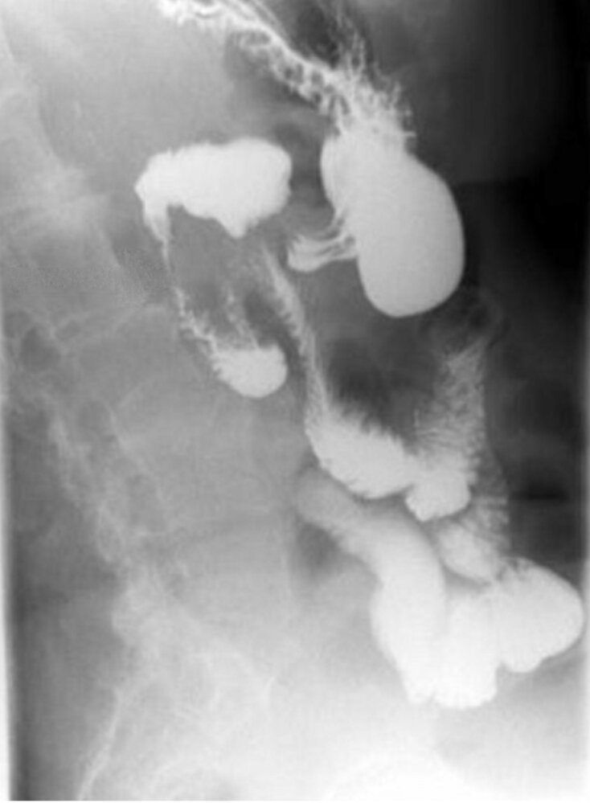
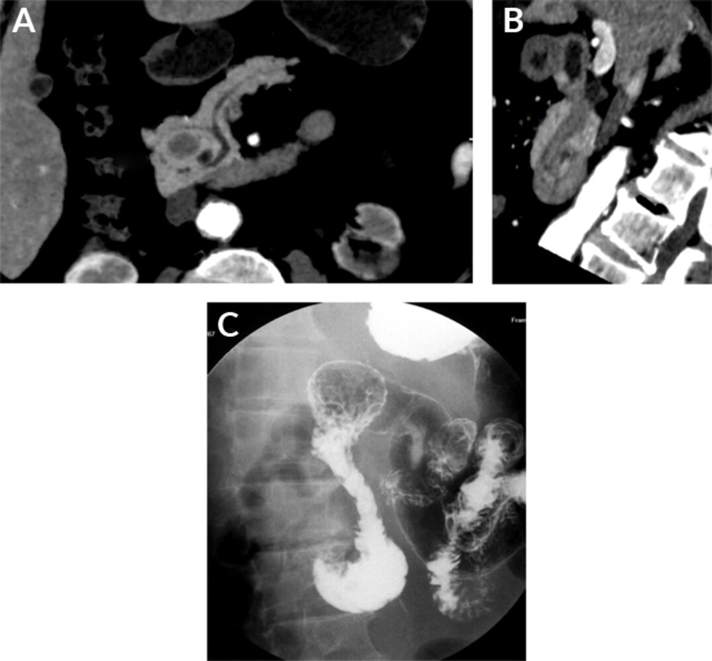

# Congenital anomalies of the pancreas

*Categories: Clinical knowledge > Internal medicine > Gastroenterology > Diseases of the pancreas > Congenital anomalies of the pancreas*

[Original Article Link](https://coursology-qbank.com/amboss/article/F90g6R)

---

## Summary

Congenital anomalies of the <u>pancreas</u> are structural abnormalities that result from improper development of the <u>pancreas</u> during <u>embryogenesis</u>. The most common anomaly is <u>pancreas divisum</u>. Others include <u>annular pancreas</u>, <u>dorsal pancreatic agenesis</u>, and <u>ectopic pancreas</u>. Although most individuals are asymptomatic, some may present with abdominal <u>pain</u>, recurrent <u>pancreatitis</u>, or features of gastrointestinal obstruction, depending on the specific anomaly. Diagnosis is typically made with <u>cross-sectional imaging</u>. Asymptomatic individuals generally do not require treatment. Symptomatic patients may be managed with <u>conservative measures</u>, endoscopic therapy, or surgical intervention.

---

## Overview

| Overview of congenital anomalies of the <u>pancreas</u> |  |  |  |  |
| --- | --- | --- | --- | --- |
|  | Etiology | Clinical features | Diagnostics | Management |
| <u>Pancreas divisum</u> |  * Failure of fusion of the <u>dorsal</u> and <u>ventral</u> <u>pancreatic</u> buds   |   * Most are asymptomatic  * Symptomatic:  * Abdominal <u>pain</u>  * Recurrent <u>acute pancreatitis</u>  * <u>Chronic pancreatitis</u>    |   * <u>Secretin-enhanced MRCP</u>: imaging modality of choice  * <u>ERCP</u>: <u>gold standard</u>, but reserved for therapeutic intervention    |   * Asymptomatic: no treatment  * Symptomatic:  * Conservative: low-fat diet, <u>analgesics</u>  * Endoscopic therapy (first-line)  * Surgical therapy (if endoscopic therapy fails)    |
| <u>Annular pancreas</u> |   * Defective migration and malrotation of the <u>ventral</u> <u>pancreatic</u> bud  * Associated with <u>Down syndrome</u>, <u>duodenal atresia</u>, and <u>intestinal malrotation</u>    |   * Most are asymptomatic  * Prenatal: <u>polyhydramnios</u>  * <u>Neonates</u>: feeding difficulties, abdominal distention, <u>vomiting</u>  * Adults: abdominal <u>pain</u>, <u>nausea</u>/<u>vomiting</u>, <u>postprandial</u> fullness    |   * <u>Prenatal ultrasound</u>/<u>radiograph</u>: may show <u>double bubble sign</u> (<u>duodenal</u> obstruction)  * <u>Cross-sectional imaging</u>: <u>pancreatic</u> tissue encircling the <u>duodenum</u>    |   * Asymptomatic: no treatment  * Symptomatic: surgical bypass procedures (e.g., duodenoduodenostomy)    |
| <u>Dorsal pancreatic agenesis</u> |  * Failure of development of the <u>dorsal</u> <u>pancreatic</u> bud   |   * Most are asymptomatic  * Symptomatic:  * Nonspecific abdominal <u>pain</u>  * Symptoms of <u>pancreatitis</u>  * <u>Symptoms of diabetes mellitus</u>    |  * <u>Cross-sectional imaging</u>: truncated <u>pancreas</u>, absence of the <u>dorsal pancreatic duct</u>   |  * No disease-specific therapy   |
| <u>Ectopic pancreas</u> |   * Misplacement of <u>pancreatic</u> tissue during embryonic <u>foregut</u> rotation  * Most common locations: <u>gastric antrum</u>, <u>proximal</u> <u>duodenum</u>, <u>proximal</u> <u>jejunum</u>    |   * Most are asymptomatic  * Symptoms due to <u>mass effect</u>:  * <u>Dyspepsia</u>, epigastric <u>pain</u>  * <u>Postprandial</u> <u>nausea</u>/<u>vomiting</u>  * <u>Bowel obstruction</u>    |   * Imaging: nonspecific, endophytic, solid, <u>submucosal</u> mass  * <u>Enhancement</u> pattern similar to normal <u>pancreas</u>    |  * Symptomatic individuals may require surgical intervention.   |

---

## Annular pancreas

### Definition [[2]](https://coursology-qbank.com/amboss/article/QYVuKG0)[[4]](https://coursology-qbank.com/amboss/article/JYVsJG0)

<u>Annular pancreas</u> is a rare congenital anomaly characterized by a complete or partial ring of <u>pancreatic</u> tissue encircling the second portion of the <u>duodenum</u>.

### <u>Epidemiology</u>

* <u>Prevalence</u>: ∼ 0.0045% in the general population [[4]](https://coursology-qbank.com/amboss/article/JYVsJG0)

* Age: manifests most often in <u>infancy</u>, but some individuals remain asymptomatic until adulthood[[2]](https://coursology-qbank.com/amboss/article/QYVuKG0)

### Etiology [[2]](https://coursology-qbank.com/amboss/article/QYVuKG0)[[4]](https://coursology-qbank.com/amboss/article/JYVsJG0)

* Arises from defective migration and malrotation of the <u>ventral</u> <u>pancreatic</u> bud during <u>embryonic development</u>

* Common associated conditions include:

* <u>Down syndrome</u>

* <u>Congenital heart defects</u>

* <u>Intestinal malrotation</u>

* <u>Duodenal atresia</u>

* <u>Meckel diverticulum</u>

### Classification [[2]](https://coursology-qbank.com/amboss/article/QYVuKG0)[[5]](https://coursology-qbank.com/amboss/article/OYVI6G0)

* Based on <u>duodenal</u> encirclement

* Complete: annulus fully encircles the <u>duodenum</u>

* Incomplete: annulus does not entirely encircle the <u>duodenum</u>

* Based on tissue location 

* Extramural: a band of <u>pancreatic</u> tissue overlies the <u>duodenum</u>, with a duct encircling it and connecting to the <u>main pancreatic duct</u>

* Intramural: <u>pancreatic</u> tissue is located within the <u>duodenal</u> wall, with small ducts draining directly into the intestinal lumen

* Portal <u>annular pancreas</u>: rare variant where <u>pancreatic</u> tissue fuses around the <u>portal vein</u> and <u>superior mesenteric veins</u>

### Clinical features [[2]](https://coursology-qbank.com/amboss/article/QYVuKG0)[[4]](https://coursology-qbank.com/amboss/article/JYVsJG0)[[5]](https://coursology-qbank.com/amboss/article/OYVI6G0)

Many patients are asymptomatic; when present, clinical features vary with age.

* Prenatal: <u>polyhydramnios</u>

* <u>Neonates</u> 

* Feeding difficulties

* Abdominal distention

* Nonbilious or <u>bilious</u> <u>vomiting</u>

* Adults

* Abdominal <u>pain</u>

* <u>Nausea</u> and/or <u>vomiting</u>

* <u>Postprandial</u> fullness

* Symptoms of <u>pancreatitis</u>

* <u>Peptic ulcer disease</u>

* <u>Jaundice</u> (infrequent)

### Diagnostics [[2]](https://coursology-qbank.com/amboss/article/QYVuKG0)[[4]](https://coursology-qbank.com/amboss/article/JYVsJG0)[[5]](https://coursology-qbank.com/amboss/article/OYVI6G0)

* <u>Prenatal ultrasound</u> or <u>abdominal radiograph</u> may show features of <u>duodenal</u> obstruction (e.g., <u>double bubble sign</u>).

* <u>Cross-sectional imaging</u>

* Circumferential or crescent-shaped <u>pancreatic</u> tissue encases the second portion of the <u>duodenum</u>.

* <u>Duodenal</u> wall thickening, narrowing, and <u>proximal</u> dilatation may be visualized.

### Differential diagnoses [[2]](https://coursology-qbank.com/amboss/article/QYVuKG0)[[4]](https://coursology-qbank.com/amboss/article/JYVsJG0)

* Causes of <u>duodenal</u> wall thickening, e.g.:

* <u>Duodenal</u> <u>adenocarcinoma</u>

* <u>Duodenal</u> <u>leiomyoma</u>

* Causes of <u>duodenal</u> obstruction, e.g.:

* <u>Duodenal atresia</u>

* <u>Duodenal</u> web

* <u>Intestinal malrotation</u>

### Management [[2]](https://coursology-qbank.com/amboss/article/QYVuKG0)[[4]](https://coursology-qbank.com/amboss/article/JYVsJG0)[[5]](https://coursology-qbank.com/amboss/article/OYVI6G0)

* Asymptomatic: Treatment is generally not required.

* Symptomatic 

* Surgical intervention may be considered.

* Bypass procedures (e.g., duodenoduodenostomy) are preferred over resection of the annular tissue.

### Complications [[2]](https://coursology-qbank.com/amboss/article/QYVuKG0)[[4]](https://coursology-qbank.com/amboss/article/JYVsJG0)

* <u>Duodenal</u> obstruction

* <u>Acute pancreatitis</u>

* <u>Chronic pancreatitis</u>

* <u>Biliary obstruction</u>

* <u>Peptic ulcer disease</u>

Duodenal stenosis from annular pancreas

Annular pancreas

---