# Pancreatic cancer

*Categories: Clinical knowledge > Internal medicine > Gastroenterology > Diseases of the pancreas > Pancreatic cancer*

[Original Article Link](https://coursology-qbank.com/amboss/article/3S0Sz2)

---

## Summary

<u>Pancreatic</u> cancer is the fourth leading cause of cancer deaths in the US and typically affects older individuals in the sixth to eighth decades of life. Underlying <u>risk factors</u> include smoking, <u>obesity</u>, <u>heavy alcohol consumption</u>, and <u>chronic pancreatitis</u>. <u>Pancreatic</u> <u>carcinomas</u> are mostly ductal <u>adenocarcinomas</u> and frequently located in the <u>pancreatic</u> head. The disease is commonly diagnosed at an advanced stage because of the late onset of clinical features (e.g., epigastric <u>pain</u>, painless <u>jaundice</u>, and weight loss). In many cases, the <u>tumor</u> has already spread to other organs (mainly the <u>liver</u>) when it is diagnosed. Treatment is often palliative as surgical resection is only possible in approx. 20% of cases. The most commonly used surgical technique is the <u>pancreaticoduodenectomy</u> (<u>Whipple procedure</u>). Five-year survival rates range from 3–40% depending on the extent, spread, and resectability of the <u>tumor</u>. Occasionally, small, potentially resectable <u>pancreatic</u> lesions can be discovered on imaging. These can represent benign, precancerous, or malignant lesions. Management varies by lesion type, e.g., <u>pancreatic cystic lesions</u>, <u>pancreatic neuroendocrine tumors</u>. Screening is not routinely performed but is recommended for select high-risk individuals.

---

## Epidemiology

* Age of onset: : 60–80 years [[1]](https://coursology-qbank.com/amboss/article/Zl0ZvT)

* <u>Incidence</u>

* ∼ 3% of all new cancers in the US

* In 2020, 57,600 individuals in the US will be newly diagnosed with <u>pancreatic</u> cancer (<u>♂</u> > <u>♀</u>)

* Mortality: accounts for ∼ 8% of all cancer deaths in the US

* High-risk groups [[2]](https://coursology-qbank.com/amboss/article/CdbqHs)[[3]](https://coursology-qbank.com/amboss/article/PebW_s)

* African Americans

* Individuals of Jewish ancestry

Epidemiological data refers to the US, unless otherwise specified.

---

## Etiology

### <u>Exogenous</u> <u>risk factors</u> [[4]](https://coursology-qbank.com/amboss/article/KCaUG5)[[5]](https://coursology-qbank.com/amboss/article/pCaLG5)[[6]](https://coursology-qbank.com/amboss/article/JCasG5)

* Smoking (strongest <u>risk factor</u>)

* <u>Chronic pancreatitis</u> (especially when present for more than 20 years)

* High <u>alcohol</u> consumption

* <u>Type 2 diabetes mellitus</u>

* <u>Obesity</u>

* <u>Occupational exposure</u> to chemicals used in the dry cleaning and metalworking industries

* Possibly infections with: 

* <u>H. pylori</u> (and excess <u>stomach acid</u>)

* <u>Hepatitis B</u>

### <u>Endogenous</u> <u>risk factors</u> [[4]](https://coursology-qbank.com/amboss/article/KCaUG5)[[7]](https://coursology-qbank.com/amboss/article/6CajG5)

* Age > 50 years

* Inherited genetic syndromes (10% of <u>pancreatic</u> cancers)

* Familial atypical multiple mole <u>melanoma</u> (<u>FAMMM</u>) syndrome

* Hereditary <u>breast</u> and <u>ovarian cancer</u> syndrome (<u>BRCA1</u> and <u>BRCA2</u> mutations)

* <u>HNPCC</u>

* <u>Von-Hippel-Lindau syndrome</u>

* <u>Neurofibromatosis type 1</u>

* <u>Multiple endocrine neoplasia type 1</u>

* Familial <u>pancreatic</u> <u>carcinoma</u>

* <u>Hereditary pancreatitis</u> (mutations in the <u>PRSS1</u> <u>gene</u>)

* <u>Peutz-Jeghers syndrome</u>

---

## Clinical features

In most cases, there are no early symptoms suggestive of <u>pancreatic</u> cancer. [[8]](https://coursology-qbank.com/amboss/article/sgXt9x)

### <u>Constitutional symptoms</u>

* Poor appetite

* Weight loss

* <u>Weakness</u>

### Gastrointestinal symptoms

* Belt-shaped epigastric <u>pain</u> which may radiate to the back

* <u>Nausea</u>

* <u>Malabsorption</u>, <u>diarrhea</u> (possibly <u>steatorrhea</u> secondary to <u>exocrine pancreatic insufficiency</u>)

* <u>Jaundice</u> caused by obstruction of extrahepatic <u>bile</u> ducts (especially in tumors of the <u>pancreatic</u> head)

* Courvoisier sign: enlarged, nontender <u>gallbladder</u> and painless <u>jaundice</u>

* Pale stools, dark urine, and <u>pruritus</u>

* <u>Impaired glucose tolerance</u> (rarely)

### <u>Hypercoagulability</u>

* Trousseau syndrome: <u>superficial thrombophlebitis</u> (in 10% of cases)

* Recurring <u>thrombophlebitis</u> in changing locations (migratory)

* Red, tender extremities

* Classically associated with <u>pancreatic</u> cancer

* <u>Thrombosis</u> (e.g., <u>phlebothrombosis</u>, <u>splenic vein thrombosis</u>)

> [!TIP]
> A <u>thrombosis</u> of unknown origin may be caused by an undiagnosed <u>malignancy</u> (especially <u>pancreatic</u> cancer, but also pulmonary, and <u>prostatic</u> <u>carcinoma</u>, the "3P's").

> [!TIP]
> The symptoms of <u>pancreatic</u> cancer may be similar to those of <u>chronic pancreatitis</u>. Differential diagnosis is difficult since <u>carcinoma</u> may be accompanied by <u>pancreatitis</u>.

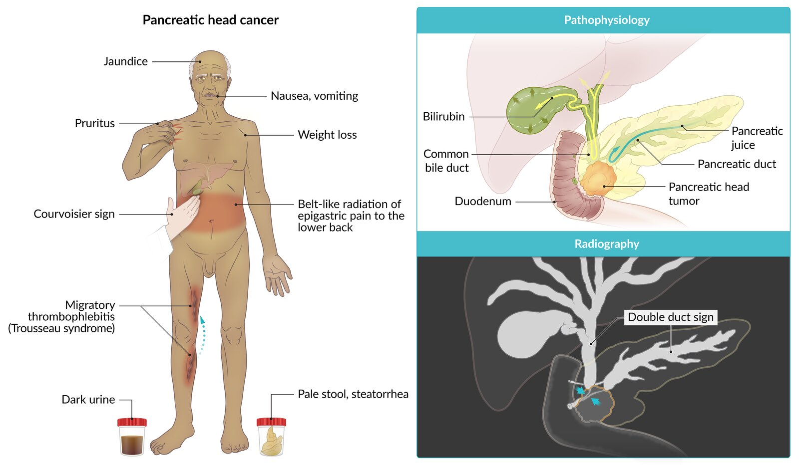

Pancreatic head cancer

---

## Diagnosis

### Approach [[9]](https://coursology-qbank.com/amboss/article/Dl01_T)[[10]](https://coursology-qbank.com/amboss/article/yIcd2d0)[[11]](https://coursology-qbank.com/amboss/article/krcmhd0)[[12]](https://coursology-qbank.com/amboss/article/B_czqU0)

In the majority of instances, <u>pancreatic</u> cancer is diagnosed in symptomatic patients once it has already spread regionally or distally and is no longer resectable. If identified at an early stage (e.g., as an <u>incidentaloma</u>), lesions may be resectable. Initial testing is guided by clinical presentation. Consider screening for high-risk asymptomatic individuals (see “Prevention”). [[13]](https://coursology-qbank.com/amboss/article/6e1j-f0)

* Unexplained epigastric <u>pain</u>, <u>RUQ</u> <u>pain</u>, and/or <u>jaundice</u> 

* Obtain abdomen <u>ultrasound</u> as initial imaging.

* Include <u>liver chemistries</u>, <u>lipase</u>, and <u>amylase</u> in <u>laboratory studies</u>.

* See also “Abdominal <u>pain</u>” and “<u>Jaundice and cholestasis</u>”

* High clinical suspicion for abdominal <u>malignancy</u> : Consider CT abdomen and <u>pelvis</u> with IV contrast as initial imaging.

* Indeterminate <u>pancreatic</u> lesions on imaging (e.g., found during workup or screening, including <u>incidentalomas</u>)  [[14]](https://coursology-qbank.com/amboss/article/Je1s-f0)

* Obtain <u>pancreas</u> protocol imaging (CT or <u>MRI</u>).

* Consider advanced testing (e.g., <u>EUS</u>, <u>MRCP</u>) based on findings or if the diagnosis remains uncertain.

* Arrange tissue sampling for <u>histopathology</u> in most patients.

* See also “<u>Pancreatic cystic lesions</u>” and “<u>Pancreatic neuroendocrine tumors</u>.”

* Confirmed <u>pancreatic</u> <u>malignancy</u>

* Obtain imaging for preoperative staging to assess local and distant spread and determine resectability.

* Measure baseline <u>tumor markers</u>.

* Perform <u>genetic testing</u> for individuals with a positive <u>family history</u> or suspected genetic syndrome (see “<u>Endogenous</u> <u>risk factors</u>”).

> [!TIP]
> <u>Pancreatic</u> <u>incidentalomas</u> should be investigated early and evaluated for curative resection.

### Initial diagnostic imaging [[11]](https://coursology-qbank.com/amboss/article/krcmhd0)[[15]](https://coursology-qbank.com/amboss/article/wIchUd0)[[16]](https://coursology-qbank.com/amboss/article/VZ1G020)

Used to identify potentially malignant lesions and evaluate for resectability

* <u>Ultrasound</u> abdomen: often the initial recommended test, especially if the patient presents with <u>jaundice</u>

* CT abdomen (with PO water and IV contrast; <u>pancreas</u>-specific triphasic protocol) 

* To confirm <u>ultrasound</u> findings if a <u>pancreatic</u> mass is detected

* To evaluate spread to adjacent structures and determine resectability

* If clinical suspicion remains high despite a negative <u>ultrasound</u>

* Performed as initial imaging if abdominal <u>pain</u> and weight loss are the initial presenting symptoms

* <u>MRI</u> abdomen: alternative if <u>CT is contraindicated</u>  [[17]](https://coursology-qbank.com/amboss/article/4Ac3PU0)

* Findings of <u>pancreatic adenocarcinoma</u> (See “<u>Pancreatic cystic lesions</u>” for other findings.)

* Poorly defined, <u>hypodense</u>/<u>hypoechoic</u> and hypovascular mass

* Double-duct sign: dilation of the <u>common bile duct</u> and <u>pancreatic duct</u> due to tumors of the <u>pancreatic</u> head blocking <u>bile</u> drainage.

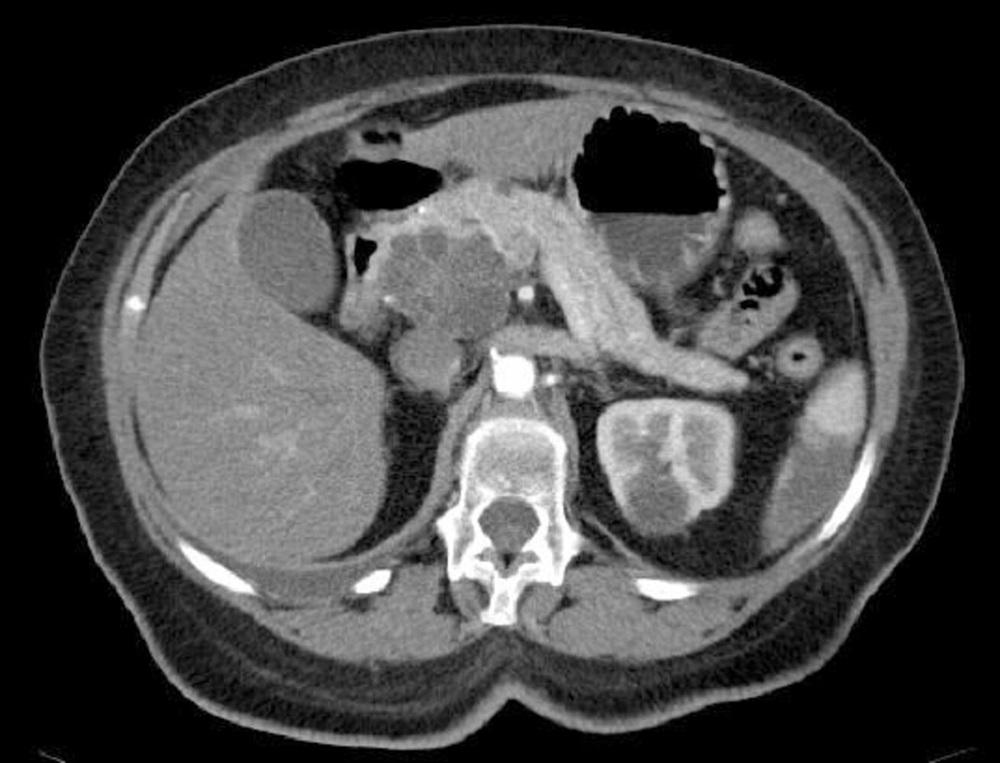

Pancreatic head mass with cystic components

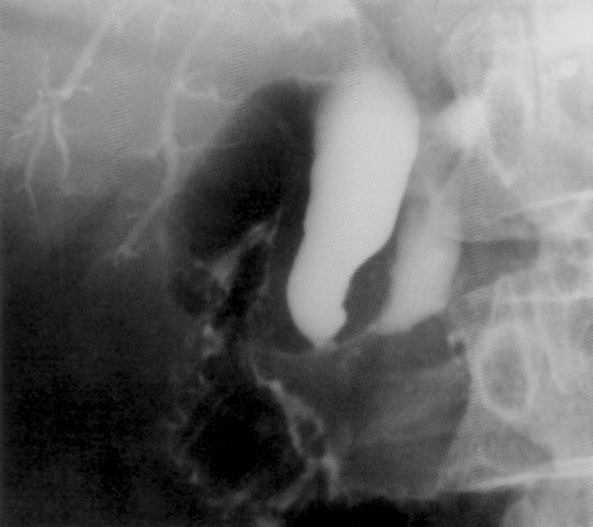

Double duct sign in pancreatic head carcinoma

Double duct sign in pancreatic head carcinoma

Pancreatic head cancer

### Routine <u>laboratory studies</u> [[10]](https://coursology-qbank.com/amboss/article/yIcd2d0)[[15]](https://coursology-qbank.com/amboss/article/wIchUd0)[[18]](https://coursology-qbank.com/amboss/article/0-ceDU0)

Findings are variable and nonspecific but may show abnormalities caused by <u>pancreatic</u> cancer or related complications.

* Obtain <u>CBC</u>, <u>BMP</u>, <u>pancreatic enzymes</u>, <u>liver chemistries</u>, and <u>liver function</u> parameters.

* Increased <u>lipase</u> and/or <u>cholestatic enzymes</u> can occur due to the presence of obstructive tumors (typically of the <u>pancreatic</u> head).

* Other abnormalities may occur due to:

* Chronic illnesses such as <u>anemia</u> and <u>malnutrition</u> (abnormalities include <u>coagulopathy</u> and <u>hypoalbuminemia</u>)

* <u>Pancreatic</u> endocrine dysfunction (e.g., <u>hyperglycemia</u> can occur due to secondary <u>diabetes mellitus</u>)

* <u>Liver</u> or <u>kidney</u> dysfunction

### Diagnostic confirmation [[11]](https://coursology-qbank.com/amboss/article/krcmhd0)[[15]](https://coursology-qbank.com/amboss/article/wIchUd0)[[19]](https://coursology-qbank.com/amboss/article/2rcTgd0)[[20]](https://coursology-qbank.com/amboss/article/oX10_20)[[21]](https://coursology-qbank.com/amboss/article/KX1U_20)

* <u>Endoscopic ultrasound</u> (<u>EUS</u>)

* Used to confirm the diagnosis and determine resectability when other studies are inconclusive

* Can be combined with <u>FNA</u> for tissue sampling

* Tissue sampling: required for most patients with <u>pancreatic</u> masses or suspicious <u>pancreatic cysts</u> on imaging ;  [[15]](https://coursology-qbank.com/amboss/article/wIchUd0)

* Typically obtained <u>EUS</u>-guided

* Alternatives: percutaneous <u>ultrasound</u>- or CT-guided <u>biopsy</u>

* Can help differentiate <u>pancreatic</u> cancer from <u>pancreatitis</u> and other malignant and nonmalignant lesions (e.g., <u>metastases</u>, benign <u>neoplasms</u>)

> [!WARNING]
> A negative <u>biopsy</u> does not rule out <u>pancreatic</u> cancer in patients with highly concerning imaging findings; consider repeat preoperative or intraoperative sampling in such cases.

#### Adjunctive investigations

* <u>MRCP</u>

* Typically used to rule out <u>choledocholithiasis</u> and assess if biliary decompression is indicated

* Can be used adjunctively to evaluate local <u>tumor</u> extension  [[21]](https://coursology-qbank.com/amboss/article/KX1U_20)[[22]](https://coursology-qbank.com/amboss/article/SAYyQ7)

* <u>ERCP</u>: usually used when biliary decompression is indicated

* <u>Tumor markers</u>: not recommended for diagnosis or screening ;  [[9]](https://coursology-qbank.com/amboss/article/Dl01_T)[[15]](https://coursology-qbank.com/amboss/article/wIchUd0)[[17]](https://coursology-qbank.com/amboss/article/4Ac3PU0)

* <u>CA 19-9</u> 

* Prognostic marker  [[15]](https://coursology-qbank.com/amboss/article/wIchUd0)

* Marker of cancer progression and response to therapy

* <u>CEA</u> (less specific): may be used as an adjunct to <u>CA 19-9</u> as a diagnostic and prognostic marker  [[23]](https://coursology-qbank.com/amboss/article/PAcWPU0)

### Imaging for preoperative staging  [[11]](https://coursology-qbank.com/amboss/article/krcmhd0)[[12]](https://coursology-qbank.com/amboss/article/B_czqU0)

Required to assess the extent of the <u>tumor</u>, the involvement of local key vascular structures, and to identify <u>metastatic</u> disease

* Intraabdominal and <u>pelvic</u> staging: CT abdomen and <u>pelvis</u> (with IV and PO contrast, including <u>pancreas</u>-specific triphasic protocol) or <u>MRI</u> (including <u>MRCP</u>)

* Thoracic staging: <u>CXR</u> or CT chest  [[11]](https://coursology-qbank.com/amboss/article/krcmhd0)[[24]](https://coursology-qbank.com/amboss/article/OrcIhd0)[[25]](https://coursology-qbank.com/amboss/article/lrcvhd0)

---

## Pathology

### Location [[28]](https://coursology-qbank.com/amboss/article/tgXXCx)

* <u>Pancreatic</u> head: 65% of cases

* <u>Pancreatic</u> body and tail: 15% of cases

* Diffuse: 20% of cases

### Cell origin

* <u>Pancreatic</u> exocrine tumors: originate from <u>pancreatic acini</u> and ducts [[29]](https://coursology-qbank.com/amboss/article/cl0aDT)

* Most common: ductal <u>adenocarcinoma</u> (95%) 

* Altered ductal structures

* Cellular infiltration

* Less common

* Acinar <u>adenocarcinoma</u> (acinar cells produce digestive enzymes)

* <u>Mucinous</u> <u>cystadenocarcinoma</u>

* <u>Pancreatic</u> endocrine tumors: originate from <u>islet cells</u> (See “<u>Pancreatic neuroendocrine tumors</u>” for details.)

> [!TIP]
> The majority of <u>pancreatic</u> malignancies are located in the head of the <u>pancreas</u> and originate from <u>epithelial</u> cells within the tubules.

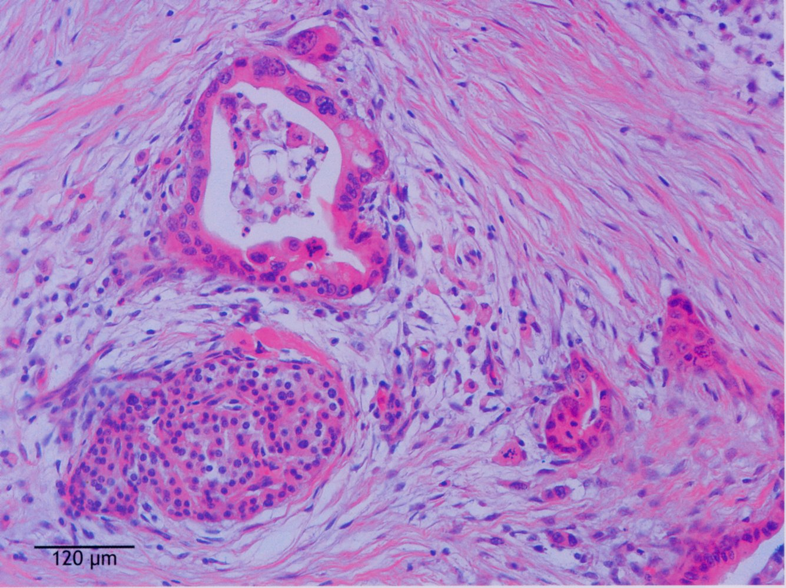

Pancreatic ductal adenocarcinoma

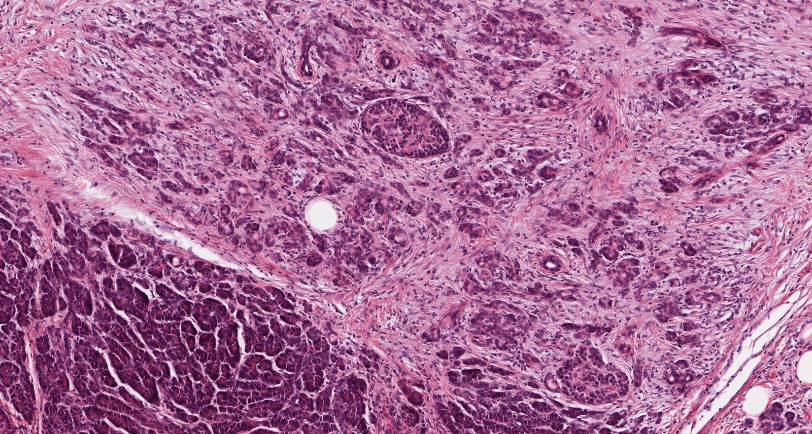

Pancreatic ductal adenocarcinoma

---

## Differential diagnoses

* Focal <u>pancreatitis</u>  [[30]](https://coursology-qbank.com/amboss/article/W-cPwU0)[[31]](https://coursology-qbank.com/amboss/article/bU1HbT0)

* <u>Pancreatic pseudocyst</u>

* <u>Metastasis</u>: e.g., <u>RCC</u> (most common), <u>breast carcinoma</u>, <u>bronchial carcinoma</u>

* <u>Ampullary cancer</u>

* <u>Lipoma</u>  [[32]](https://coursology-qbank.com/amboss/article/XU19bT0)

* Cystic lesions [[33]](https://coursology-qbank.com/amboss/article/_YV57G0)[[34]](https://coursology-qbank.com/amboss/article/zYVr7G0)

* <u>Intraductal papillary mucinous neoplasm</u> (<u>IPMN</u>)

* <u>Mucinous cystic neoplasm</u> (<u>MCN</u>)

* <u>Serous cystadenoma</u>

* Solid-pseudopapillary <u>neoplasm</u>

* Cystic <u>pancreatic</u> endocrine <u>neoplasm</u>

* Lymphoepithelial cyst

The differential diagnoses listed here are not exhaustive.

---

## Treatment

### General principles [[11]](https://coursology-qbank.com/amboss/article/krcmhd0)[[35]](https://coursology-qbank.com/amboss/article/stctUV0)[[36]](https://coursology-qbank.com/amboss/article/fb1kG20)

* Establish <u>goals of care</u> via shared-decision making.

* <u>Multidisciplinary care</u> is typically required.

* Treatment intent depends on:

* <u>Tumor</u> resectability

* <u>Patient performance status</u> and comorbidity profile

* Generally poor prognosis; all patients should be considered for clinical trials

* Provide <u>supportive care</u> and manage complications (e.g., <u>biliary obstruction</u>).

* See also “<u>Principles of cancer care</u>” for general information on treatment plans and <u>goals of care</u>.

> [!TIP]
> Most patients are not candidates for <u>surgery</u> and require nonoperative management because they have inoperable tumors (∼ 80%), distant <u>metastases</u>, or are not medically fit for a major procedure. [[11]](https://coursology-qbank.com/amboss/article/krcmhd0)

### Approach [[10]](https://coursology-qbank.com/amboss/article/yIcd2d0)[[11]](https://coursology-qbank.com/amboss/article/krcmhd0)[[15]](https://coursology-qbank.com/amboss/article/wIchUd0)[[35]](https://coursology-qbank.com/amboss/article/stctUV0)[[37]](https://coursology-qbank.com/amboss/article/XZ19Z20)

Approximately 10–20% of patients present with resectable tumors, 30–40% present with borderline resectable disease, and 50–60% present with locally advanced or <u>metastatic</u> disease. [[15]](https://coursology-qbank.com/amboss/article/wIchUd0)

| <u>Treatment of pancreatic cancer</u> by disease stage |  |  |  |
| --- | --- | --- | --- |
| Treatment intent |  Resectability status [[10]](https://coursology-qbank.com/amboss/article/yIcd2d0)[[11]](https://coursology-qbank.com/amboss/article/krcmhd0)[[38]](https://coursology-qbank.com/amboss/article/etcxcV0)  | AJCC stage | Typical treatment approach |
| Potentially curative |  Resectable disease  |  * Stage I or II   |   * Primary surgical resection followed by <u>adjuvant chemotherapy</u>  * Adjuvant <u>chemoradiation</u> may be given after completion of <u>chemotherapy</u> in patients who had <u>R1</u> resection and/or <u>lymph node</u> involvement.    |
|  Borderline resectable disease  |  * Stage II or III   |  * <u>Neoadjuvant therapy</u> followed by surgical resection   |  |
|  Usually palliative  |  Locally advanced unresectable disease  |  * Stage III   |  * <u>Combination chemotherapy</u>; regimens vary depending on the patient's general condition and response to <u>induction chemotherapy</u>.   |
| Palliative | <u>Metastatic</u> disease |  * Stage IV   |  * <u>Combination chemotherapy</u>; regimens vary depending on the patient's general condition and the presence of actionable genomic alterations.   |

> [!TIP]
> The only potentially curative treatment for <u>pancreatic</u> cancer is surgical resection, usually in combination with other treatments. Neither <u>chemotherapy</u> nor <u>radiation therapy</u> can be curative without <u>surgery</u>.

### Potentially curable disease [[11]](https://coursology-qbank.com/amboss/article/krcmhd0)

Curative treatment is primarily surgical and may involve <u>neoadjuvant</u> and/or <u>adjuvant therapy</u>.

#### Approach

* Primary surgical resection: recommended in patients with nonmetastatic disease who meet certain criteria.

* <u>Neoadjuvant therapy</u> prior to resection: for patients with features suggestive of <u>metastatic</u> disease and/or less favorable <u>performance status</u>

#### Surgical resection [[15]](https://coursology-qbank.com/amboss/article/wIchUd0)[[39]](https://coursology-qbank.com/amboss/article/ttcX2V0)[[40]](https://coursology-qbank.com/amboss/article/l-cvxU0)

See also “<u>Pancreatic surgery</u>.”

* <u>Pancreatic</u> head <u>carcinoma</u>: <u>pancreaticoduodenectomy</u> and <u>lymphadenectomy</u>

* <u>Whipple procedure</u>: resection of <u>pancreatic</u> head, <u>distal</u> <u>stomach</u>, <u>duodenum</u>, <u>gallbladder</u>, and <u>common bile duct</u>

* <u>Traverso-Longmire procedure</u>: <u>pylorus-preserving pancreaticoduodenectomy</u>    [[39]](https://coursology-qbank.com/amboss/article/ttcX2V0)

* Reconstruction methods include <u>enterostomy</u>, <u>Roux-en-Y</u>, and <u>Billroth</u>-II.

* <u>Pancreatic</u> body and tail <u>carcinoma</u>: : Typically involves resection of the left side of the <u>pancreas</u> with <u>splenectomy</u>

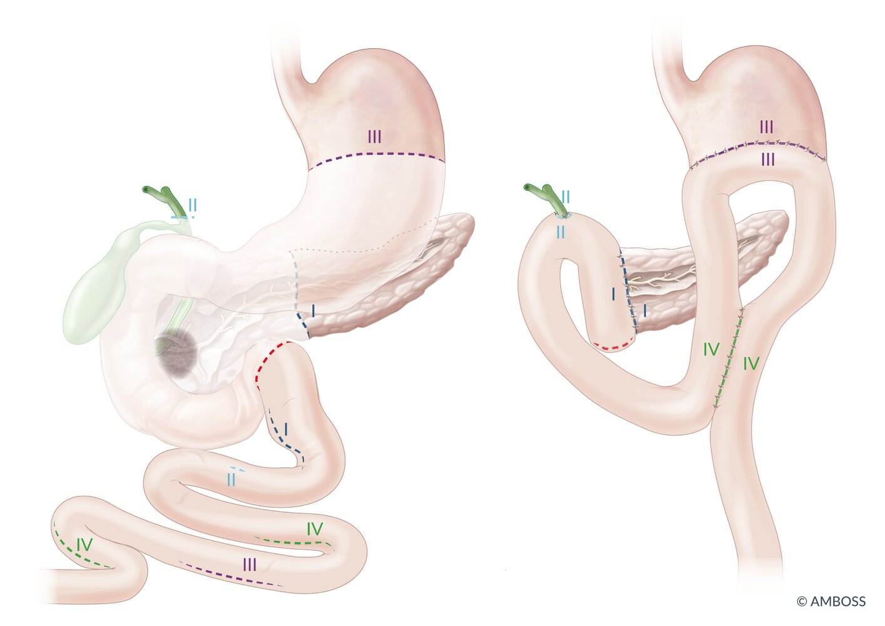

Pancreaticoduodenectomy (Whipple procedure)

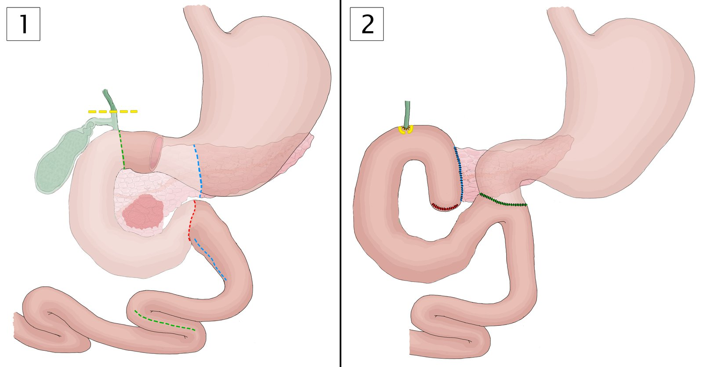

Principles of the pylorus-preserving pancreaticoduodenectomy (Traverso-Longmire procedure)

#### <u>Chemotherapy</u> and <u>radiotherapy</u> for potentially curable disease [[11]](https://coursology-qbank.com/amboss/article/krcmhd0)[[41]](https://coursology-qbank.com/amboss/article/cZ1a020)[[42]](https://coursology-qbank.com/amboss/article/HtcKUV0)

* <u>Neoadjuvant therapy</u>: to improve resectability

* Indication: considered in patients with a high likelihood of <u>metastatic</u> disease or margin-positive resection [[11]](https://coursology-qbank.com/amboss/article/krcmhd0)

* Regimen: usually <u>FOLFIRINOX</u> or <u>gemcitabine</u>-based regimens, though no clear consensus exits [[41]](https://coursology-qbank.com/amboss/article/cZ1a020)

* <u>Adjuvant therapy</u>: to increase long-term survival 

* Indication: all patients following surgical resection who did not receive preoperative treatment

* Regimen: up to 6 months of <u>chemotherapy</u> (e.g., mFOLFIRINOX) with or without <u>chemoradiation</u>

> [!TIP]
> Following preoperative therapy, patients require full restaging to assess for resectability. [[11]](https://coursology-qbank.com/amboss/article/krcmhd0)

### Locally advanced and <u>metastatic</u> disease

Treatment intent is usually palliative. Patients with locally advanced disease may be able to undergo curative <u>surgery</u> if preoperative treatment leads to improved resectability; however, this is rare. [[43]](https://coursology-qbank.com/amboss/article/eb1xs20)

* Locally advanced disease

* Combination of <u>chemotherapy</u> (e.g., <u>FOLFIRINOX</u>), <u>chemoradiotherapy</u>, and/or <u>stereotactic body radiation therapy</u>

* Patients with a dramatic <u>response to chemotherapy</u> may be able to undergo surgical resection.

* <u>Metastatic</u> disease

* The approach depends on <u>ECOG</u> <u>performance status</u> (<u>ECOG PS</u>), symptom burden, comorbidity profile, and the presence of actionable genomic alterations.   [[35]](https://coursology-qbank.com/amboss/article/stctUV0)

* Regimens: e.g., <u>FOLFIRINOX</u>, <u>nab-paclitaxel</u> PLUS gemcitabin

### <u>Supportive care</u> [[11]](https://coursology-qbank.com/amboss/article/krcmhd0)[[15]](https://coursology-qbank.com/amboss/article/wIchUd0)[[35]](https://coursology-qbank.com/amboss/article/stctUV0)

For general guidance on <u>supportive care</u> for cancer and/or treatment-related complications, see “<u>Principles of cancer care</u>” and “<u>Overview of palliative medicine</u>.”

#### <u>Pain management</u> [[11]](https://coursology-qbank.com/amboss/article/krcmhd0)[[35]](https://coursology-qbank.com/amboss/article/stctUV0)[[36]](https://coursology-qbank.com/amboss/article/fb1kG20)

Severe <u>pain</u> is common in the course of <u>tumor</u> progression. See “<u>Treatment of pain</u>” and “<u>Pain management in palliative care</u>” for additional guidance.

* Pharmacotherapy

* Follow the <u>WHO analgesic ladder</u> and consider early consultation with a <u>pain</u> specialist.

* Anticipate side effects and consider interventions for their treatment and prevention (e.g., <u>laxatives</u> and <u>antiemetics</u> for patients who require <u>opioids</u>).

* <u>Radiotherapy</u>: Consider for patients with symptomatic <u>metastases</u>, especially to the <u>brain</u> and bones (rare).

* Advanced interventions: Consider for patients with refractory abdominal <u>pain</u>. [[44]](https://coursology-qbank.com/amboss/article/2b1TG20)

* Celiac ganglion block (<u>celiac plexus</u> neurolysis): <u>EUS</u>-guided transgastric puncture of the <u>celiac ganglion</u> with instillation of 98% ethanol to destroy the <u>nerve tissue</u>

* Thoracoscopic splanchnicectomy: unilateral or bilateral sectioning of the <u>splanchnic nerve</u> to interrupt <u>pain</u>-conducting nerve fibers

#### <u>Cancer anorexia-cachexia syndrome</u> [[11]](https://coursology-qbank.com/amboss/article/krcmhd0)[[35]](https://coursology-qbank.com/amboss/article/stctUV0)[[43]](https://coursology-qbank.com/amboss/article/eb1xs20)

* Obtain <u>nutrition counseling</u>.

* Consider nutritional supplements and <u>appetite stimulants</u> (e.g., <u>megestrol acetate</u>, <u>dronabinol</u>).

* Treat <u>exocrine pancreatic insufficiency</u> with <u>pancreatic enzyme</u> replacement.

### Monitoring and follow-up [[45]](https://coursology-qbank.com/amboss/article/utcp2V0)

Data to guide monitoring for recurrence and follow-up recommendations after curative treatment for <u>pancreatic</u> cancer is limited. The following recommendations are based on expert opinion and consistent with the 2016 American Society of Clinical Oncology (<u>ASCO</u>) guidelines. [[11]](https://coursology-qbank.com/amboss/article/krcmhd0)

* Follow-up frequency: every 3–6 months for 2 years, then every 6–12 months

* Follow-up evaluation

* <u>Patient history</u> and <u>physical examination</u>

* <u>CA 19-9</u> levels if elevated at baseline

* Cross-sectional abdominal imaging (e.g., CT abdomen)

---

## Complications

### <u>Metastasis</u>

Lymphogenic and hematogenous <u>metastases</u> are often already present at the time of diagnosis.

* Early stage: <u>liver</u>, nearby <u>lymph nodes</u>

* Advanced stage: surrounding <u>visceral</u> organs (<u>duodenum</u>, <u>stomach</u>, <u>colon</u>), <u>lungs</u>

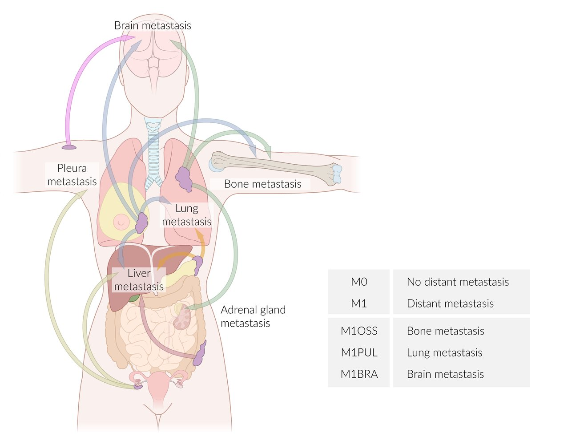

Most common routes of metastasis with TNM classification

### Management of GI complications [[35]](https://coursology-qbank.com/amboss/article/stctUV0)[[46]](https://coursology-qbank.com/amboss/article/Tb16G20)[[47]](https://coursology-qbank.com/amboss/article/gb1FG20)

* <u>Biliary obstruction</u>: e.g., stenosis of the <u>common bile duct</u>  

* <u>ERCP</u> with <u>stent implantation</u> (preferred)

* Percutaneous transhepatic bile duct drainage (<u>PTBD</u>)

* Involves placement of an external drain that drains the <u>bile</u> into a collection bag.

* Consider if endoscopic access is impaired.

* Surgical bypass: consider in select patients when other measures fail or are not feasible.

* Gastric outlet and/or <u>duodenal</u> obstruction

* Preferred: endoscopic <u>stent</u> placement

* Alternatives

* <u>Percutaneous endoscopic gastrostomy</u> (or <u>jejunostomy</u>)

* Surgical bypass (e.g., <u>gastroenterostomy</u>)

* Malignant <u>ascites</u>

* Cautious use of <u>diuretics</u> (e.g., <u>spironolactone</u>)

* Intermittent <u>paracentesis</u> or placement of a long term <u>peritoneal</u> drain

* <u>Ileus</u>: <u>percutaneous endoscopic gastrostomy</u> (<u>PEG</u>) tube as a relief tube

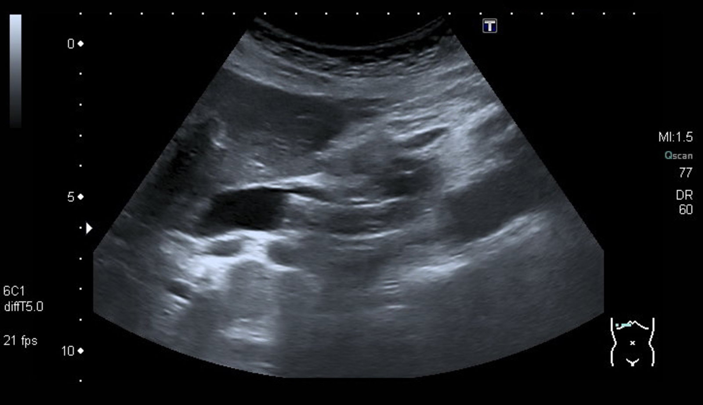

Self-expandable metal stent (SEMS) in common bile duct

### Thromboembolic disease

* <u>Venous thromboembolism</u> (<u>VTE</u>): See “<u>Deep vein thrombosis</u>” and “<u>DVT prophylaxis</u>” for details on prevention and management.  [[11]](https://coursology-qbank.com/amboss/article/krcmhd0)[[35]](https://coursology-qbank.com/amboss/article/stctUV0)[[43]](https://coursology-qbank.com/amboss/article/eb1xs20)

* <u>Disseminated intravascular coagulation</u> (<u>DIC</u>)

> [!WARNING]
> Patients with <u>pancreatic</u> cancer are at a very high risk of <u>VTE</u>.

### Others

* Secondary <u>diabetes mellitus</u>

* <u>Necrolytic migratory erythema</u>

We list the most important complications. The selection is not exhaustive.

---

## Prognosis

* Very aggressive course

* 12.8% overall 5-year survival rate  [[1]](https://coursology-qbank.com/amboss/article/Zl0ZvT)

* ∼ 3% 5-year survival rate of <u>metastatic</u> <u>pancreatic</u> cancer [[1]](https://coursology-qbank.com/amboss/article/Zl0ZvT)

* Median survival for patients who undergo successful resection: ∼ 18 months (5-year survival rate: ∼ 20%) [[48]](https://coursology-qbank.com/amboss/article/7SX4aB)

---

## Subtypes and variants

### Pancreatic cystic lesions [[49]](https://coursology-qbank.com/amboss/article/Be1zaT0)[[50]](https://coursology-qbank.com/amboss/article/_e15YT0)[[51]](https://coursology-qbank.com/amboss/article/cU1aXT0)[[52]](https://coursology-qbank.com/amboss/article/1U12XT0)[[53]](https://coursology-qbank.com/amboss/article/oU10VT0)

* Description

* <u>Epithelium</u>-lined cyst, filled with serous or mucous liquid

* Can be benign, precancerous, or cancerous

* Clinical features: usually asymptomatic

* May cause abdominal <u>pain</u> or <u>back pain</u>

* Rarely, <u>obstructive jaundice</u> or features of <u>ascending cholangitis</u> (e.g., <u>fever</u>, <u>sepsis</u>) may develop.

* Diagnosis: most often found incidentally;  on CT or <u>MRI</u> abdomen; can be followed by endoscopic investigations (e.g., <u>EUS</u>, <u>ERCP</u>) and tissue sampling (e.g., <u>FNA</u>)

* Management: varies depending on radiological and pathological features (e.g., size, location, degree of cell <u>dysplasia</u>) and patient characteristics (e.g., symptoms, <u>preoperative risk assessment</u>) [[53]](https://coursology-qbank.com/amboss/article/oU10VT0)

* Offer surgical resection to patients with:

* High-risk features on imaging

* Pathology showing <u>malignancy</u> or high-grade <u>dysplasia</u>

* Worrisome symptoms (e.g., <u>jaundice</u>)

* Consider <u>conservative management</u> for asymptomatic individuals with low-risk lesions, e.g.:

* Serial <u>MRI</u> (e.g., annually)

* Tissue sampling (e.g., <u>EUS</u> with <u>FNA</u>) of lesions that develop suspicious radiological features

* Referral for surgical resection in patients with worrisome pathology

> [!NOTE]
> <u>Pancreatic cysts</u> are common in patients with <u>von Hippel-Lindau syndrome</u>. [[54]](https://coursology-qbank.com/amboss/article/pU1LVT0)

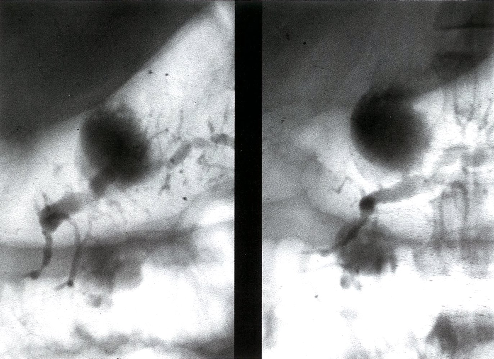

Pancreatic cyst

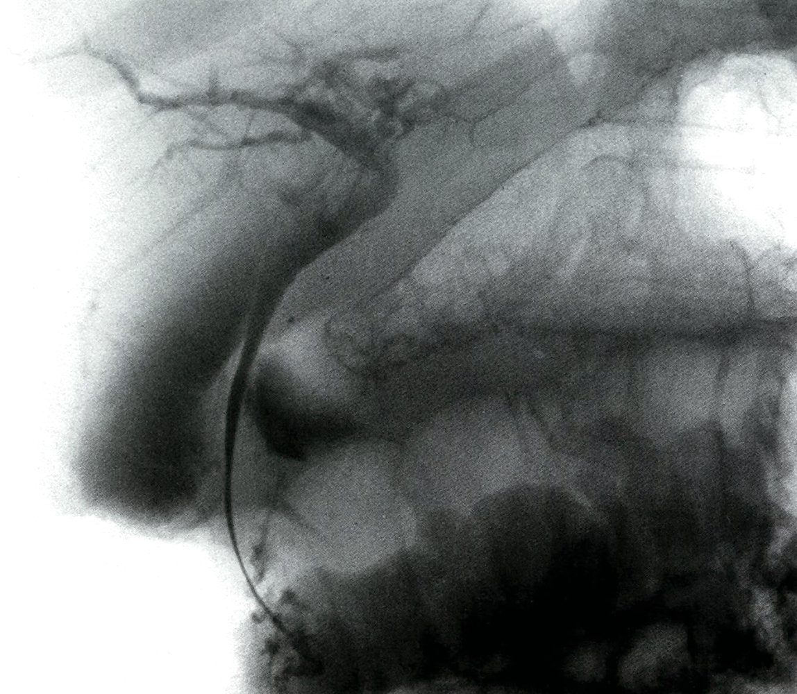

Constricted common bile duct

#### Benign lesions [[55]](https://coursology-qbank.com/amboss/article/Ae1RYT0)

Benign lesions have low <u>malignancy</u> potential and are typically <u>managed conservatively</u>.

* <u>Serous cystadenomas</u>: See "<u>Pancreatic cystic neoplasms</u>" for details.

* Simple cysts (retention cysts): typically appear as a single well-defined, nonenhancing, unilocular cyst without mural nodularity or calcification [[52]](https://coursology-qbank.com/amboss/article/1U12XT0)

#### Precancerous lesions [[53]](https://coursology-qbank.com/amboss/article/oU10VT0)[[55]](https://coursology-qbank.com/amboss/article/Ae1RYT0)[[56]](https://coursology-qbank.com/amboss/article/ZU1ZbT0)[[57]](https://coursology-qbank.com/amboss/article/WU1PXT0)

Surgical resection is usually offered to good surgical candidates; <u>conservative management</u> can be considered in select cases.

* <u>Intraductal papillary mucinous neoplasms</u>: See "<u>Pancreatic cystic neoplasms</u>" for details.

* <u>Mucinous cystic neoplasms</u>: See "<u>Pancreatic cystic neoplasms</u>" for details.

* Solid pseudopapillary neoplasms: most commonly affects young women; <u>malignancy</u> potential 10–15% [[58]](https://coursology-qbank.com/amboss/article/rU1feT0)

> [!WARNING]
> Main-duct <u>IPMNs</u> have the highest <u>malignancy</u> potential (up to 80%) and should be evaluated early for surgical resection (e.g., <u>pancreaticoduodenectomy</u>). [[55]](https://coursology-qbank.com/amboss/article/Ae1RYT0)

### <u>Pancreatic neuroendocrine tumors</u> (<u>PNETs</u>)  [[59]](https://coursology-qbank.com/amboss/article/7U14eT0)[[60]](https://coursology-qbank.com/amboss/article/VU1GXT0)

See also “<u>Pancreatic neuroendocrine tumors</u>” and dedicated articles on “<u>Insulinoma</u>” and “<u>Gastrinoma</u>.”

* Description

* <u>Neuroendocrine tumors</u> arising from endocrine cells in the <u>pancreas</u> (e.g., <u>islet cells</u>) that can secrete a variety of <u>hormones</u>

* Functional <u>PNETs</u>: secrete <u>hormones</u>; symptoms depend on the type of <u>hormone</u> secreted (e.g., <u>insulinomas</u> cause <u>hypoglycemia</u>)

* Nonfunctional <u>PNETs</u>: do not secrete enough <u>hormones</u> to cause symptoms; can produce local <u>mass effect</u> if large enough

* <u>Malignancy</u> potential varies widely.

* Types

* <u>Insulinomas</u>

* <u>Gastrinomas</u>

* <u>Vasoactive intestinal peptide</u>-producing tumors

* <u>Pancreatic polypeptide</u>-secreting endocrine tumors of the <u>pancreas</u>

* <u>Glucagonomas</u>

* <u>Somatostatinomas</u>

* Management

* Surgical resection is typically offered for localized lesions and is often curative.

* Consider <u>targeted therapy</u> and/or serial imaging for unresectable or <u>metastatic</u> disease.

* Symptomatic therapy of functional <u>PNETs</u> (e.g., <u>somatostatin analogues</u>) depends on the <u>hormone</u> secreted and the severity of the symptoms.

### Pancreatic acinar cell carcinoma [[61]](https://coursology-qbank.com/amboss/article/Z3VZS80)

* Definition: a rare malignant exocrine <u>tumor</u> of the <u>pancreas</u> composed of cells resembling <u>pancreatic acinar cells</u> with evidence of exocrine enzyme production

* <u>Epidemiology</u> [[61]](https://coursology-qbank.com/amboss/article/Z3VZS80)

* Rare (< 5% of <u>pancreatic</u> <u>carcinomas</u>)

* Occurs in both children and adults and shows a male predominance

* Clinical features

* <u>Clinical features of pancreatic cancer</u>

* <u>Lipase hypersecretion syndrome</u> in ∼ 15% of cases [[61]](https://coursology-qbank.com/amboss/article/Z3VZS80)

* Diagnostics

* <u>Laboratory studies</u>

* ↑ Serum <u>lipase</u>

* <u>Tumor markers</u> (e.g., <u>CEA</u>, <u>CA19-9</u>, <u>AFP</u>) may be elevated.

* <u>Cross-sectional imaging</u>

* Large, ovoid, well-circumscribed, solid mass

* Most often located in the head of the <u>pancreas</u>

* <u>Necrosis</u>, cystic changes, and hemorrhage may occur.

* Invasion into surrounding structures is common.

* <u>Endoscopic ultrasound</u>-guided fine-needle tissue acquisition

* <u>Immunohistochemistry</u>: positive for <u>antibodies</u> for acinar <u>cell differentiation</u> (e.g., <u>trypsin</u>, BCL10)

* Management

* Surgical resection

* <u>Chemotherapy</u> (e.g., <u>FOLFIRINOX</u>)

* Prognosis

* Better survival rates compared to <u>pancreatic</u> ductal <u>adenocarcinoma</u>

* 5-year survival: 21–43% [[61]](https://coursology-qbank.com/amboss/article/Z3VZS80)

### Intraductal tubulopapillary neoplasm (ITPN) [[62]](https://coursology-qbank.com/amboss/article/-hVDg80)

* Definition: a rare <u>pancreatic</u> intraductal <u>neoplasm</u> characterized by tubulopapillary growth with minimal <u>mucin</u> production [[62]](https://coursology-qbank.com/amboss/article/-hVDg80)

* Clinical features

* Abdominal <u>pain</u>, <u>jaundice</u>, <u>diarrhea</u>

* Associated <u>invasive carcinoma</u> is common (∼ 60%). [[62]](https://coursology-qbank.com/amboss/article/-hVDg80)

* Diagnostics

* Imaging: Most lesions are solid masses.

* <u>Immunohistochemistry</u>: MUC1 and MUC6 positive, MUC2 and MUC5AC negative  [[62]](https://coursology-qbank.com/amboss/article/-hVDg80)

* Genetics: PIK3CA mutations and FGFR2 fusions are common; <u>KRAS</u> mutations are rare. [[62]](https://coursology-qbank.com/amboss/article/-hVDg80)

* Prognosis: better survival rates compared to <u>pancreatic</u> ductal <u>adenocarcinoma</u>

---

## Screening

* Not recommended for asymptomatic individuals at average risk [[63]](https://coursology-qbank.com/amboss/article/pe1L-f0)

* Indicated for certain high-risk individuals, e.g.:  [[13]](https://coursology-qbank.com/amboss/article/6e1j-f0)

* Patients with genetic syndromes that increase the risk of <u>pancreatic</u> cancer, e.g., <u>Peutz-Jeghers syndrome</u>, <u>hereditary pancreatitis</u>

* <u>First-degree relatives</u> of individuals who have <u>pancreatic</u> cancer and any of the following:

* ≥ 2 genetic relatives with <u>pancreatic</u> cancer

* Specific <u>genetic markers</u> (e.g., <u>BRCA mutation</u>)

* <u>Hereditary cancer syndrome</u> (e.g., <u>Lynch syndrome</u>)

* Modalities include <u>MRI</u> and <u>endoscopic ultrasound</u>.

> [!TIP]
> There are no specific biomarkers for <u>pancreatic</u> <u>cancer screening</u>. [[13]](https://coursology-qbank.com/amboss/article/6e1j-f0)

---