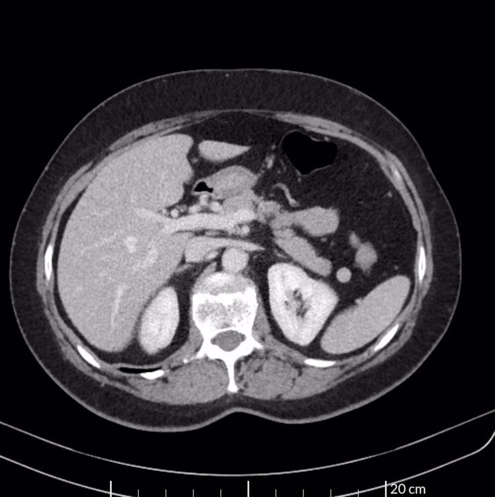
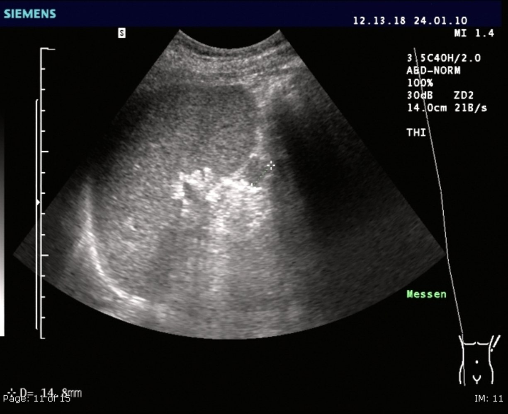
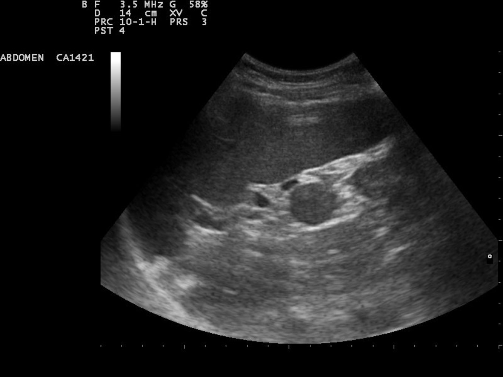

# Asplenia

*Categories: Clinical knowledge > Internal medicine > Gastroenterology > Diseases of the spleen > Asplenia*

[Original Article Link](https://coursology-qbank.com/amboss/article/v40AOT)

---

## Summary

The <u>spleen</u> is primarily responsible for the elimination of damaged <u>erythrocytes</u> and plays a central role in the <u>opsonization</u> and removal of encapsulated organisms from the bloodstream. <u>Functional asplenia</u> is the absence of normal <u>spleen</u> function and anatomical asplenia is the absence of the <u>spleen</u> itself. Anatomical asplenia is most commonly due to elective or emergency <u>splenectomy</u>, while <u>functional asplenia</u> is due to conditions that result in the loss of splenic function (e.g., multiple infarctions in <u>sickle cell disease</u>). Asplenia typically manifests with <u>Howell-Jolly bodies</u> on <u>peripheral blood smears</u> as well as <u>neutrophilia</u> and <u>thrombocytosis</u>. Patients with asplenia have a lifelong risk of fulminant, life-threatening infections. The prognosis for <u>asplenic sepsis</u> and <u>overwhelming postsplenectomy sepsis</u> is very poor. Preventive measures are vital and include <u>immunization</u> against <u>encapsulated bacteria</u> and early <u>empiric antibiotic treatment</u> for <u>fever</u>. Infections in asplenic or hyposplenic patients can quickly worsen and become an <u>overwhelming postsplenectomy infection</u> (<u>OPSI</u>), which requires immediate <u>empiric antibiotic treatment</u>, <u>supportive care</u>, and hospital admission.

---

## Etiology

### Anatomical causes [[1]](https://coursology-qbank.com/amboss/article/LSVwZ80)

* Acquired anatomical asplenia, i.e., <u>splenectomy</u>, indicated for:

* <u>Thrombocytopenia</u> (e.g., refractory <u>idiopathic thrombocytopenic purpura</u>)

* Severe <u>hemolytic anemias</u> (e.g., <u>spherocytosis</u>)

* <u>Splenic rupture</u> (e.g., from <u>blunt abdominal trauma</u>)

* <u>Hypersplenism</u> with <u>splenomegaly</u>

* Congenital asplenia [[1]](https://coursology-qbank.com/amboss/article/LSVwZ80)

* A very rare type of anatomical asplenia

* Associated with other congenital disorders (e.g., <u>congenital heart disease</u>)

* Isolated congenital asplenia affects 1:600,000 births.

### Functional causes [[1]](https://coursology-qbank.com/amboss/article/LSVwZ80)

Functional types of asplenia are often preceded by hyposplenism, in which splenic function is reduced but not yet absent, and splenic anatomy is preserved, although it may be altered.

* Functional asplenia: a condition in which phagocytic activity of the <u>spleen</u> is lost due to an underlying condition, while splenic tissue is preserved

* Autosplenectomy: a form of <u>functional asplenia</u> caused by repeated infarctions in which splenic function is absent, and splenic <u>atrophy</u> also occurs

* Underlying causes

* <u>Sickle cell anemia</u>

* <u>Splenic infarction</u> (<u>splenic artery</u> <u>thrombosis</u>)

* <u>Tumor</u> infiltration

* Autoimmune disorders

---

## Diagnosis

### <u>Laboratory studies</u>[[1]](https://coursology-qbank.com/amboss/article/LSVwZ80)[[2]](https://coursology-qbank.com/amboss/article/2hVTW80)

* <u>Peripheral blood smear</u> 

* Pitted <u>red blood cell count</u> (<u>criterion standard</u>): limited availability

* <u>Howell-Jolly bodies</u>

* <u>Target cells</u>

* <u>Complete blood count</u>

* <u>Leukocytosis</u>  [[3]](https://coursology-qbank.com/amboss/article/JsbsDE)

* <u>Reactive thrombocytosis</u>: usually for the first weeks to months after <u>splenectomy</u>  [[4]](https://coursology-qbank.com/amboss/article/ySVdX80)

Howell-Jolly bodies in asplenia

> [!NOTE]
> The lack of <u>Howell-Jolly bodies</u> in asplenic patients suggests an accessory <u>spleen</u>.

### Imaging [[1]](https://coursology-qbank.com/amboss/article/LSVwZ80)

* Typically used as <u>confirmatory testing</u> for suspected anatomical asplenia (e.g., congenital asplenia) or other abnormalities (e.g., accessory <u>spleen</u>)

* Modalities: abdominal <u>ultrasound</u>, CT, <u>MRI</u>

Accessory spleen

Accessory spleen

Accessory spleen

---

## Management

### Infection prevention

#### <u>Immunization</u> [[1]](https://coursology-qbank.com/amboss/article/LSVwZ80)[[5]](https://coursology-qbank.com/amboss/article/2jVT-80)[[6]](https://coursology-qbank.com/amboss/article/zSVrX80)

Patients with asplenia have more <u>vaccination</u> requirements compared to the general population.

* Recommended <u>vaccines</u>: <u>Streptococcus pneumoniae</u>, <u>Neisseria meningitidis</u>, and <u>Haemophilus influenzae type b</u> 

* <u>S. pneumoniae</u> <u>vaccines</u>: <u>Pneumococcal</u> conjugate and <u>pneumococcal</u> <u>polysaccharide</u> <u>vaccines</u> may be necessary (see "<u>Immunization schedule by medical indication</u>").

* <u>Meningococcal vaccines</u>: <u>Meningococcal conjugate</u> (quadrivalent) and <u>meningococcal B vaccines</u> may be necessary (see "<u>Immunization schedule by medical indication</u>").

* <u>Hib vaccine</u>: Dosing varies (see "<u>Immunization schedule by medical indication</u>").

* Timing of <u>vaccination</u>

* Elective <u>splenectomy</u>: completion of <u>vaccination</u> course at least 14 days prior to the procedure

* Emergency <u>splenectomy</u>: at least 14 days after the procedure

* <u>Functional asplenia</u>: as soon as possible

* Consider the following annually:

* Inactivated <u>influenza vaccination</u>

* <u>COVID</u> <u>vaccination</u> [[1]](https://coursology-qbank.com/amboss/article/LSVwZ80)

* Consider daily <u>antibiotic prophylaxis</u> (e.g., with oral <u>penicillin</u> or <u>amoxicillin</u>) in all patients with asplenia.

* There is limited data on the optimal duration of prophylaxis; some experts recommend the following:

* Asplenic children: until at least 5 years of age

* Following <u>splenectomy</u>: children > 5 years of age and adults for at least 1 year

* Lifelong prophylaxis is recommended for patients who remain <u>immunocompromised</u> or have recovered from an episode of <u>sepsis</u>.

* Provide patients with an emergency oral <u>antibiotic</u> to be taken immediately in case of <u>fever</u>, e.g., <u>amoxicillin/clavulanate</u> (<u>off-label</u>). DOSAGE[[7]](https://coursology-qbank.com/amboss/article/dhVo180)

* Consider prophylactic <u>amoxicillin</u> for patients undergoing sinus <u>surgery</u> or <u>airway</u> procedures.[[7]](https://coursology-qbank.com/amboss/article/dhVo180)

#### Patient education [[1]](https://coursology-qbank.com/amboss/article/LSVwZ80)[[7]](https://coursology-qbank.com/amboss/article/dhVo180)

* Closely monitor for <u>clinical features of sepsis</u> (e.g., <u>fever</u>) or nonspecific viral symptoms.

* Take emergency <u>antibiotics</u> and present to the emergency department immediately if symptoms arise.

* Consider carrying an identification card, bracelet, or necklace to inform providers that they have asplenia.

* Avoid dog and <u>tick bites</u>.

* Exercise caution when traveling to <u>malaria</u>-<u>endemic</u> areas.

### <u>Thrombosis</u> prevention

* Indication: severe <u>reactive thrombocytosis</u> after <u>splenectomy</u> and <u>risk factors</u> for <u>thrombosis</u> (e.g., <u>malignancy</u>)

* Treatment

* Low-dose <u>heparin</u> for at least 4 weeks

* Optionally, <u>acetylsalicylic acid</u> (100 mg daily) for one year

---

## Complications

* Immediately postsplenectomy: See "<u>Postoperative complications</u>."

* Increased risk of life-threatening infections and <u>sepsis</u> (see "<u>Overwhelming postsplenectomy infection</u>") that can continue for over 40 years after <u>splenectomy</u>[[1]](https://coursology-qbank.com/amboss/article/LSVwZ80)

* Arterial and/or venous <u>thrombosis</u>

* <u>Pulmonary hypertension</u>

We list the most important complications. The selection is not exhaustive.

---

## Overwhelming postsplenectomy infection

### Background [[2]](https://coursology-qbank.com/amboss/article/2hVTW80)[[8]](https://coursology-qbank.com/amboss/article/AN1Rdh0)

* Definition: a bacterial infection that develops into fulminant <u>sepsis</u> in individuals with asplenia

* Etiology: : typically infection with <u>encapsulated bacteria</u> (e.g., <u>Streptococcus pneumoniae</u>, <u>Neisseria meningitidis</u>, <u>Haemophilus influenzae</u>)

* <u>Epidemiology</u> [[9]](https://coursology-qbank.com/amboss/article/fhVkW80)

* <u>Incidence</u>: 0.13 per 100 <u>person-years</u> among individuals with <u>splenectomy</u>

* High <u>mortality rates</u> (50–70%)

* Pathophysiology

* Normally, <u>encapsulated pathogens</u> are <u>opsonized</u> with <u>antibodies</u> and then <u>phagocytosed</u> by specialized <u>macrophages</u> in the <u>spleen</u>.

* Individuals with asplenia do not have these specialized <u>macrophages</u>, allowing pathogens to spread and cause <u>sepsis</u>.

> [!NOTE]
> Asplenic individuals Have No Spleen: H. influenzae, N. meningitidis, and S. <u>pneumonia</u> are the pathogens that most commonly cause <u>asplenic sepsis</u>.

### Clinical features [[2]](https://coursology-qbank.com/amboss/article/2hVTW80)[[8]](https://coursology-qbank.com/amboss/article/AN1Rdh0)[[9]](https://coursology-qbank.com/amboss/article/fhVkW80)

* Patients may initially have nonspecific viral symptoms.

* Rapid deterioration within hours

* Isolated <u>fever</u>

* <u>Signs of sepsis</u>

* <u>Signs of meningitis</u>

* <u>Signs of DIC</u>

* Signs of <u>acute respiratory distress syndrome</u>

### Initial management [[2]](https://coursology-qbank.com/amboss/article/2hVTW80)[[8]](https://coursology-qbank.com/amboss/article/AN1Rdh0)[[9]](https://coursology-qbank.com/amboss/article/fhVkW80)

* Perform <u>ABCDE survey</u>.

* In patients without a known history of asplenia, check for indicators of possible asplenia (e.g., surgical scars, collateral history, rapid deterioration).

* Make a <u>clinical diagnosis</u> of <u>OPSI</u>.

* Obtain supportive diagnostics to assess for multisystem involvement and guide treatment.

* Initiate <u>sepsis</u> stabilization and treatment without delay.

* Adults: See "<u>Hour-1 bundle for sepsis</u>."

* Children: See "<u>Hour-1 bundle for children with sepsis</u>."

* Admit to hospital and consult critical care.

> [!WARNING]
> Maintain high suspicion for <u>OPSI</u>, as patients often initially present with nonspecific symptoms, and there is a high risk of misdiagnosis. [[2]](https://coursology-qbank.com/amboss/article/2hVTW80)

> [!WARNING]
> Asplenic patients with <u>fever</u> require immediate <u>empiric antibiotic therapy</u> regardless of whether they have other symptoms.

### Diagnostics [[2]](https://coursology-qbank.com/amboss/article/2hVTW80)[[8]](https://coursology-qbank.com/amboss/article/AN1Rdh0)[[9]](https://coursology-qbank.com/amboss/article/fhVkW80)

* <u>OPSI</u> is a <u>clinical diagnosis</u>; maintain a high level of suspicion in asplenic patients with <u>fever</u>.

* <u>Laboratory studies</u>: to assess for multisystem involvement and guide treatment

* <u>Diagnostics for sepsis</u>, including <u>urinalysis</u>, <u>urine cultures</u>, and <u>blood cultures</u>

* <u>Liver chemistries</u>

* <u>Coagulation studies</u>

* <u>Chest x-ray</u> to assess for <u>pneumonia</u>

* Consider diagnostics to confirm asplenia (e.g., <u>peripheral blood smear</u>, abdominal <u>ultrasound</u>) as indicated.

### Ongoing management [[2]](https://coursology-qbank.com/amboss/article/2hVTW80)[[8]](https://coursology-qbank.com/amboss/article/AN1Rdh0)[[9]](https://coursology-qbank.com/amboss/article/fhVkW80)

* <u>Management of sepsis</u> in adults

* <u>IV fluid resuscitation</u>

* <u>Vasopressors for septic shock</u> as indicated

* <u>Empiric antibiotic therapy</u> for adults, e.g.: 

* <u>Vancomycin</u> DOSAGE [[10]](https://coursology-qbank.com/amboss/article/8NbO18)

* PLUS <u>ceftriaxone</u> DOSAGE [[11]](https://coursology-qbank.com/amboss/article/A3bROt)

* <u>Management of sepsis in children</u>

* <u>Fluid resuscitation for children with sepsis</u>

* <u>Empiric antibiotic therapy</u> for children with <u>OPSI</u> 

* <u>Vancomycin</u> (<u>off-label</u>) DOSAGE [[12]](https://coursology-qbank.com/amboss/article/Ef18LT0)

* PLUS <u>ceftriaxone</u> (<u>off-label</u>) DOSAGE [[12]](https://coursology-qbank.com/amboss/article/Ef18LT0)

* Consider the following if indicated: 

* <u>Corticosteroids</u> for suspected <u>meningitis</u>

* <u>Hydrocortisone</u> for suspected <u>adrenal insufficiency</u>

#### Disposition

* All patients with asplenia should be admitted for further care. [[13]](https://coursology-qbank.com/amboss/article/ND1-eQ0)

* Consider critical care admission for patients who require <u>vasopressors</u>, have <u>signs of DIC</u>, or otherwise require close monitoring.

---