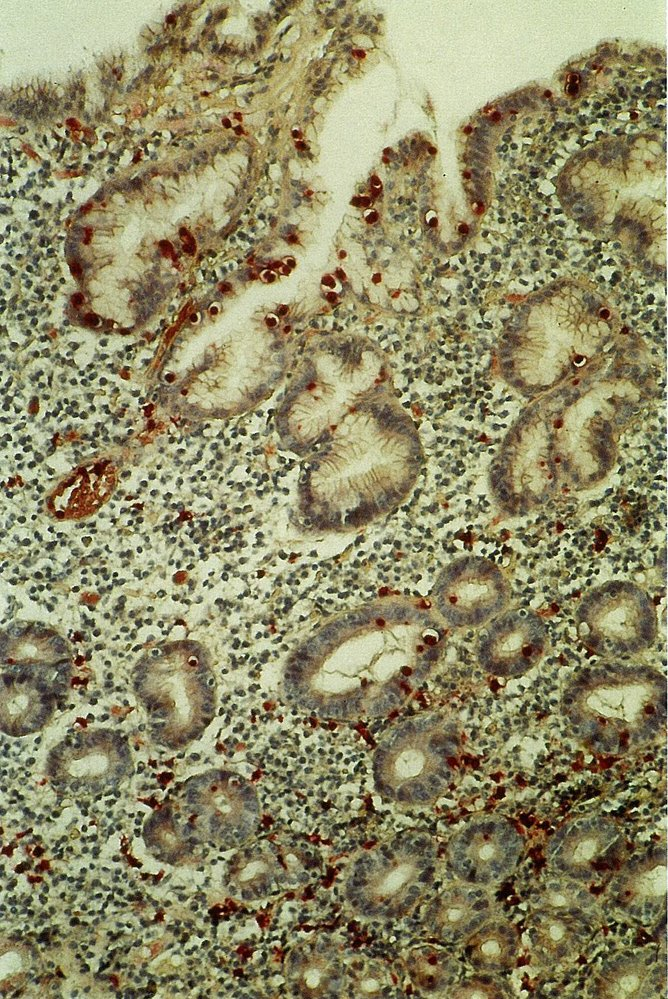
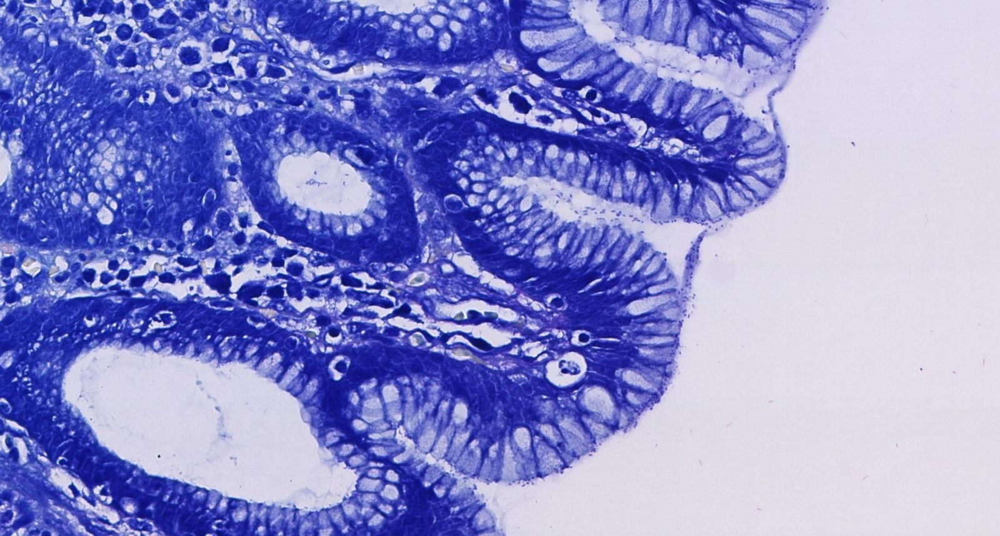
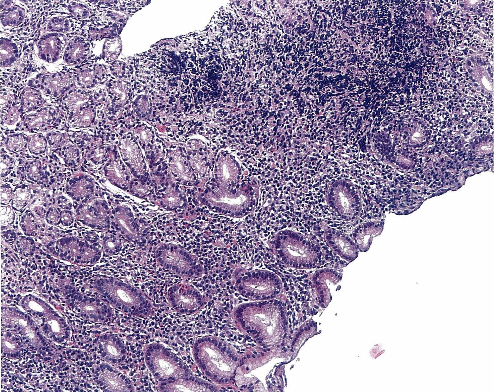
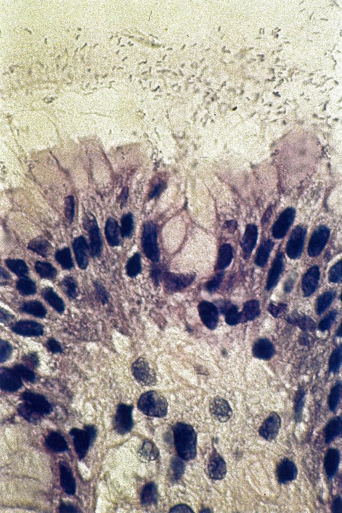
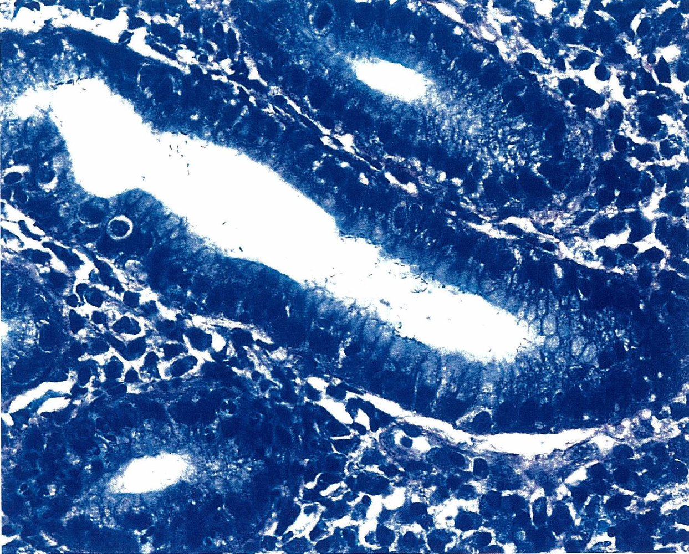

# Gastric premalignant conditions

*Categories: Clinical knowledge > Internal medicine > Gastroenterology > Diseases of the stomach > Gastric premalignant conditions*

[Original Article Link](https://coursology-qbank.com/amboss/article/Ag0RB2)

---

## Summary

Gastric premalignant conditions (GPMCs) are histological abnormalities of the gastric <u>mucosa</u> that increase the risk for <u>gastric adenocarcinoma</u>. These conditions include <u>atrophic gastritis</u>, gastric <u>intestinal metaplasia</u> (GIM), gastric <u>dysplasia</u>, and certain <u>gastric epithelial polyps</u> (<u>GEPs</u>). The most common cause is chronic <u>Helicobacter pylori</u> infection. While often asymptomatic, some patients may experience nonspecific symptoms such as <u>dyspepsia</u>, epigastric <u>pain</u>, or early satiety. Diagnosis is established through <u>esophagogastroduodenoscopy</u> (<u>EGD</u>) with <u>biopsies</u> for histopathological evaluation. Management is guided by the severity and extent of the condition and primarily involves treating the underlying cause, such as eradicating <u>H. pylori</u>. Endoscopic surveillance is recommended for patients with high-risk features to assess for progression to gastric <u>dysplasia</u> or early <u>gastric adenocarcinoma</u>. <u>Dysplastic</u> lesions are managed with periodic endoscopic surveillance or endoscopic resection. Early detection and management are crucial for preventing invasive <u>gastric adenocarcinoma</u>.

---

## Overview

| Overview of gastric premalignant conditions |  |  |  |  |  |
| --- | --- | --- | --- | --- | --- |
|  |  | Etiology | Clinical features | Diagnostics | Management |
|  Atrophic gastritis [[1]](https://coursology-qbank.com/amboss/article/YaVnQG0)[[2]](https://coursology-qbank.com/amboss/article/FWdgMK0)  | <u>H. pylori</u>-associated <u>atrophic gastritis</u> (environmental metaplastic atrophic gastritis) |  * Chronic <u>H. pylori</u> infection   |   * <u>Dyspepsia</u>  * Epigastric <u>pain</u>  * <u>Nausea</u>, <u>vomiting</u>  * <u>Features of anemia</u>  * May manifest with <u>gastroduodenal ulcers</u>    |   * <u>EGD</u> with <u>biopsies</u>  * Macroscopic findings:  * Pale, thin gastric <u>mucosa</u>  * Visible vasculature  * Flattening and/or loss of <u>gastric folds</u>  * <u>H. pylori testing</u>  * Laboratory tests, e.g.:   * <u>CBC</u>  * <u>Iron studies</u>  * <u>Vitamin B12</u> levels (reduced in <u>AIG</u> due to <u>pernicious anemia</u>)    |   * <u>H. pylori eradication therapy</u> if results are positive  * <u>H. pylori eradication confirmation</u>  * Correction of nutritional deficiencies (e.g., <u>iron</u> and/or <u>vitamin B12 replacement</u>)  * Lifestyle modifications (e.g., <u>smoking cessation</u>, trigger avoidance)  * Pharmacological treatment: <u>PPIs</u>, <u>H2 receptor blockers</u>, <u>antacids</u>, <u>sucralfate</u>  * Endoscopic surveillance: every 3 years for advanced <u>atrophic gastritis</u>    |
| <u>Autoimmune gastritis</u> (<u>AIG</u>) |  * Associated with <u>HLA-B8</u> and <u>HLA-DR3</u>   |  * May manifest with symptoms of other autoimmune diseases (e.g., <u>goiter</u> in <u>Hashimoto thyroiditis</u>)   |  |  |  |
|  Gastric <u>intestinal metaplasia</u> (GIM) [[1]](https://coursology-qbank.com/amboss/article/YaVnQG0)  |  |   * Caused by chronic gastric inflammation, typically due to <u>H. pylori</u> infection  * Occurs after <u>atrophic gastritis</u> in the <u>Correa cascade</u>    |   * Typically asymptomatic  * May manifest with nonspecific symptoms (e.g., <u>dyspepsia</u>)    |   * <u>EGD</u> with <u>biopsies</u>  * Macroscopic findings:  * Irregular, patchy, white <u>mucosa</u>  * Fine tubulovillous surface pattern  * Light blue crests and/or white opaque areas  * Histological subtype: complete, incomplete, or mixed    |   * <u>H. pylori</u> eradication therapy if results are positive  * Endoscopic surveillance: every 3 years for high-risk individuals (see "Monitoring")    |
|  Gastric <u>dysplasia</u> [[1]](https://coursology-qbank.com/amboss/article/YaVnQG0)  |  |  * Final step before invasive <u>gastric adenocarcinoma</u> in the <u>Correa cascade</u>   |  * Typically asymptomatic   |   * <u>EGD</u> with <u>biopsies</u>  * Macroscopic findings are nonspecific:  * Loss of regular <u>mucosal</u> and vascular patterns  * Color irregularities  * <u>Gastric fold</u> abnormalities    |   * Endoscopic resection for lesions with visible margins  * Lesions without visible margins:  * Repeat <u>EGD</u> after treating inflammation  * Interval surveillance based on the <u>dysplasia</u> grade with the aim of resecting once margins are visible:  * Low-grade: 6–12 months  * High-grade: 3–6 months    |
|  <u>Gastric epithelial polyps</u> (<u>GEPs</u>) [[1]](https://coursology-qbank.com/amboss/article/YaVnQG0)  |  |   * Chronic <u>atrophic gastritis</u>  * Chronic <u>PPI</u> use (associated with <u>fundic gland polyps</u>)  * <u>Hereditary polyposis syndromes</u>    |   * Typically asymptomatic  * May cause <u>GI bleeding</u>    |   * <u>EGD</u> with <u>biopsies</u>  * Macroscopic findings vary by type:  * <u>Fundic gland polyps</u>: small, <u>sessile</u>, <u>hyperemic</u>  * <u>Hyperplastic polyps</u>: red, smooth, glistening  * Gastric <u>adenomas</u>: velvety, pink, lobulated  * <u>Biopsies</u> of polyp and surrounding <u>mucosa</u>    |   * Management guided by subtype and size:  * <u>Fundic gland polyps</u>: generally no excision unless > 10 mm  * <u>Hyperplastic polyps</u>: consider excision if > 5–10 mm  * Gastric <u>adenomas</u>: endoscopic resection recommended regardless of size  * Endoscopic surveillance  * See "<u>Benign lesions of the stomach and small intestine</u>" for more information.    |

---

## Etiology

* Chronic <u>H. pylori</u> infection: most common cause of GPMCs [[1]](https://coursology-qbank.com/amboss/article/YaVnQG0)

* <u>Autoimmune gastritis</u> (<u>AIG</u>)

* <u>Risk factors</u> for gastric premalignant conditions include: [[1]](https://coursology-qbank.com/amboss/article/YaVnQG0) 

* <u>First-degree relative</u> with <u>gastric cancer</u>

* Male sex

* Tobacco use

* <u>Heavy alcohol use</u>

* Dietary factors (e.g., high intake of salted, smoked, and/or <u>nitrate</u>-preserved foods; low intake of fresh fruits and vegetables)

> [!NOTE]
> <u>H. pylori</u>  mainly colonizes the <u>gastric antrum</u>.

---

## Pathophysiology

* Pathogenesis: a stepwise sequence known as the <u>Correa cascade</u> [[1]](https://coursology-qbank.com/amboss/article/YaVnQG0)

* Persistent <u>H. pylori</u> infection: chronic inflammation of the <u>gastric body</u> → local destruction of gastric <u>mucosa</u> (via cytotoxins such as <u>ammonia</u>) → ↓ production of mucins and <u>atrophy</u> of the gastric glands → hypochlorhydria → <u>hypergastrinemia</u> and <u>epithelial</u> <u>metaplasia</u> → <u>epithelial</u> <u>dysplasia</u> → ↑ risk of <u>gastric adenocarcinoma</u> [[5]](https://coursology-qbank.com/amboss/article/LXVwAG0)[[6]](https://coursology-qbank.com/amboss/article/oXV0_G0)

* Dietary factors: oral and gastric bacteria metabolize <u>nitrates</u> present in food to nitrites → nitrites form <u>carcinogenic</u> N-nitroso compounds in an acidic environment → <u>epithelial</u> <u>metaplasia</u> → ↑ risk of gastrointestinal cancer [[7]](https://coursology-qbank.com/amboss/article/_cV5Ut0)

---

## Clinical features

* Typically asymptomatic [[1]](https://coursology-qbank.com/amboss/article/YaVnQG0)

* When present, symptoms may include:

* <u>Dyspepsia</u>

* Epigastric discomfort

* Early satiety

* <u>Nausea</u>, <u>vomiting</u>

* Features of associated complications, e.g.:

* <u>Anemia</u> (e.g., <u>pallor</u>, fatigue) due to <u>iron deficiency</u> and/or <u>vitamin B12 deficiency</u>

* Overt or <u>occult gastrointestinal bleeding</u> due to <u>erosions</u> or <u>gastroduodenal ulcers</u>

* <u>Small intestinal bacterial overgrowth</u> due to <u>achlorhydria</u> [[8]](https://coursology-qbank.com/amboss/article/QFcu3V0)

---

## Diagnosis

The diagnosis of GPMCs requires endoscopic evaluation and <u>biopsies</u>.

### <u>EGD</u> and <u>biopsies</u> [[1]](https://coursology-qbank.com/amboss/article/YaVnQG0)[[2]](https://coursology-qbank.com/amboss/article/FWdgMK0)

* Indication: individuals with suspected GPMC and relevant <u>risk factors</u>

* Procedure: advanced endoscopic imaging techniques preferred (e.g., high-definition white light endoscopy)

* <u>Biopsies</u>: Systematic <u>biopsies</u> using the <u>Sydney protocol</u> and targeted <u>biopsies</u> of visible <u>mucosal</u> abnormalities should be obtained.

* Histopathological evaluation

* <u>H. pylori testing</u>

* Factors used for risk <u>stratification</u> include: 

* Location, severity, and extent of <u>mucosal</u> abnormalities

* Subtype of gastric <u>intestinal metaplasia</u> (i.e., complete, incomplete, or mixed)

* Grade of gastric <u>dysplasia</u> (i.e., indeterminate, low-grade, high-grade)

### <u>Laboratory studies</u> [[1]](https://coursology-qbank.com/amboss/article/YaVnQG0)[[2]](https://coursology-qbank.com/amboss/article/FWdgMK0)

* <u>CBC</u>

* <u>Anemia</u>: due to <u>micronutrient</u> deficiencies or blood loss

* <u>Microcytosis</u>: suggests <u>iron deficiency</u>

* <u>Macrocytosis</u>: suggests <u>vitamin B12 deficiency</u>

* Noninvasive <u>H. pylori testing</u>

* <u>Iron studies</u>

* <u>Vitamin B12</u> levels

* <u>Serology</u> for <u>AIG</u> if <u>autoimmune gastritis</u> is suspected

* Biomarkers (e.g., serum <u>pepsinogen</u> isoforms, <u>gastrin</u>) are not recommended for screening or surveillance.

---

## Pathology

### Microscopy findings

* <u>Chronic inflammation</u> → granulocytic infiltrations in the <u>mucosa</u>, <u>lymphocytic</u> infiltrations in the <u>submucosa</u>

* <u>Mucosal</u> thinning

* Loss of glands

* <u>Epithelial</u> <u>metaplasia</u>

* (Pseudo)<u>pyloric</u>: replacement of parietal and <u>chief cells</u> in oxyntic glands by mucus-secreting cells, which are usually present in the <u>pyloric</u> region

* Intestinal: replacement of <u>epithelial</u> cells in the oxyntic or antral <u>mucosa</u> by intestinal <u>epithelium</u> cells (e.g., <u>goblet cells</u>)

* Possible detection of <u>H. pylori</u> (gram-negative, rod-shaped bacteria)

* <u>G-cell</u> <u>hyperplasia</u> (common in <u>AIG</u>)

Gastritis: granulocyte infiltration in Helicobacter pylori infection

Bacterial gastritis

Gastritis

Gastric tissue with Helicobacter pylori

Helicobacter pylori gastritis

### Patterns of affliction

* <u>AIG</u>: Lesions are confined to the <u>gastric corpus</u> and fundus.

* <u>H. pylori-associated atrophic gastritis</u>: Lesions first manifest in the <u>gastric antrum</u> (predominant), then spread to corpus and fundus.

---

## Management

### General principles [[1]](https://coursology-qbank.com/amboss/article/YaVnQG0)[[2]](https://coursology-qbank.com/amboss/article/FWdgMK0)

* Treat <u>H. pylori</u> infection if present

* Confirm eradication with <u>H. pylori eradication confirmation testing</u>

* Correct nutritional deficiencies if present, e.g.:

* <u>Iron therapy for iron deficiency</u>

* <u>Vitamin B12 replacement therapy</u>

* Encourage lifestyle modifications that reduce symptoms and disease progression, e.g.:

* <u>Smoking cessation</u>

* Reduced <u>alcohol</u> use

* Dietary adjustments (e.g., avoidance of trigger foods, reduced salt intake, increased intake of fresh fruit and vegetables)

* Avoidance of;  medications associated with <u>reactive gastritis</u> (e.g., <u>NSAIDs</u>)

* See “Nonpharmacological recommendations” in “<u>Treatment of dyspepsia</u>” for details.

### Symptom management [[9]](https://coursology-qbank.com/amboss/article/2edTyK0)

Provide symptomatic relief of <u>dyspepsia</u> and epigastric discomfort as needed.

* <u>PPIs</u>

* <u>H2 receptor blockers</u>

* <u>Antacids</u>

* <u>Sucralfate</u>

* See “<u>Antacids and acid suppression medications</u>” for dosages.

> [!WARNING]
> Avoid coadministration of <u>sucralfate</u> with <u>PPIs</u> or <u>H2 receptor blockers</u> because <u>sucralfate</u> requires an acidic environment for activation.

### Management of gastric <u>dysplasia</u> [[1]](https://coursology-qbank.com/amboss/article/YaVnQG0)

* Lesions with visible margins: endoscopic resection

* Lesions with nonvisible margins

* Treat gastric inflammation, if present.

* Refer for periodic endoscopic surveillance (e.g., every 3–6 months for high-grade <u>dysplasia</u>, every 6–12 months for low-grade <u>dysplasia</u>). [[1]](https://coursology-qbank.com/amboss/article/YaVnQG0)

---

## Complications

* <u>Gastric adenocarcinoma</u>  [[1]](https://coursology-qbank.com/amboss/article/YaVnQG0)

* <u>Gastrointestinal bleeding</u> or perforation

* Nutritional deficiencies (e.g., <u>iron deficiency</u>, <u>vitamin B12 deficiency</u>)

* <u>Small intestinal bacterial overgrowth</u>

We list the most important complications. The selection is not exhaustive.

---