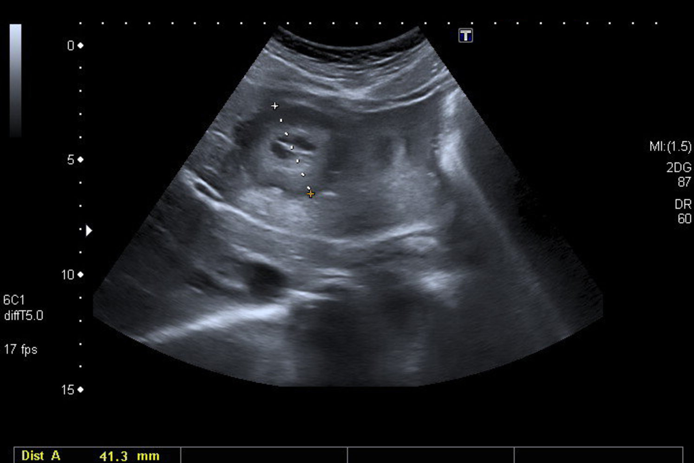
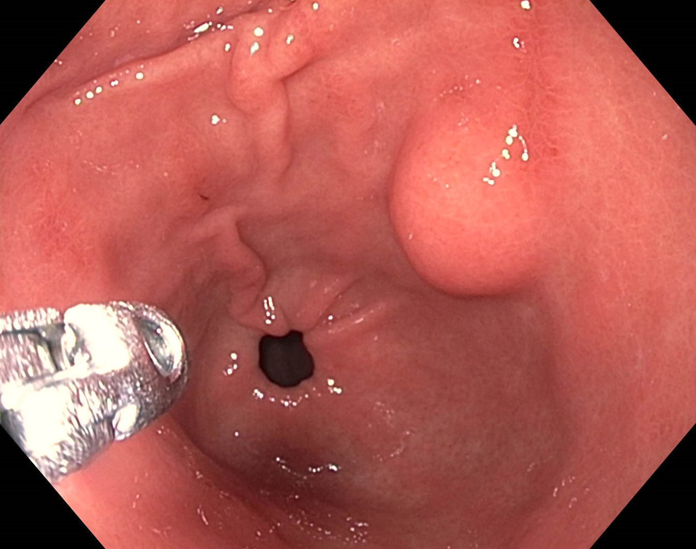
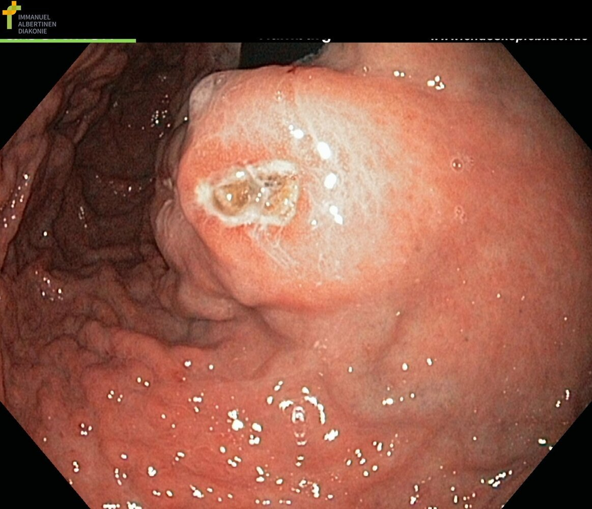

# Gastrointestinal stromal tumor

*Categories: Clinical knowledge > Internal medicine > Gastroenterology > Diseases of the stomach > Gastrointestinal stromal tumor*

[Original Article Link](https://coursology-qbank.com/amboss/article/iv0J-3)

---

## Summary

Gastrointestinal stromal tumors (GISTs) are the most common <u>mesenchymal tumors</u> of the <u>GI tract</u>, which are rare overall. All GISTs have malignant potential, and they most commonly occur in the <u>stomach</u> or <u>small intestine</u>. Clinical presentation includes <u>GI bleeding</u>, abdominal <u>pain</u>, and/or <u>ileus</u>. Initial evaluation typically involves imaging studies (e.g., abdominal <u>ultrasound</u> or CT with contrast). Definitive diagnosis is made by a multidisciplinary team at specialized GIST centers and includes <u>core biopsy</u>. Management is based on <u>tumor</u> size, location, and risk <u>stratification</u> and includes endoscopic surveillance, surgical resection, and <u>tyrosine kinase inhibitors</u>. Factors associated with a poor prognosis include large tumors, high <u>mitotic count</u>, and rectal location.

---

## Epidemiology

* <u>Incidence</u>: 10–15 cases per million worldwide; ∼ 5000 cases per year in the US [[1]](https://coursology-qbank.com/amboss/article/4Hd3qr0)

* Age of onset: ∼ 60 years of age [[2]](https://coursology-qbank.com/amboss/article/P7dWNr0)

Epidemiological data refers to the US, unless otherwise specified.

---

## Pathophysiology

GISTs are malignant <u>mesenchymal</u> <u>neoplasms</u> of the <u>GI tract</u>. [[3]](https://coursology-qbank.com/amboss/article/GMdBJq0)

* Origin: <u>interstitial cells of Cajal</u> or related precursor cells

* Mutations in <u>c-KIT</u> or <u>PDGFRA</u> → constitutive activation of <u>receptor tyrosine kinases</u> due to <u>ligand</u>-independent autophosphorylation → activation of downstream effectors → decreased <u>apoptosis</u> and uncontrolled cellular <u>proliferation</u>

---

## Clinical features

Clinical features of GISTs depend on the size and anatomical location of tumors. [[3]](https://coursology-qbank.com/amboss/article/GMdBJq0)[[4]](https://coursology-qbank.com/amboss/article/PndWtq0)

* Small tumors (< 2 cm): often asymptomatic

* Large tumors (> 2 cm): variable clinical features

* <u>Stomach</u> (∼ 60% of GISTs), <u>small intestine</u> (∼ 35% of GISTs): may manifest with <u>GI bleeding</u> [[3]](https://coursology-qbank.com/amboss/article/GMdBJq0)

* <u>Colon</u> and <u>rectum</u>: may manifest with abdominal <u>pain</u>, <u>bowel obstruction</u>

---

## Diagnosis

* Initial studies [[3]](https://coursology-qbank.com/amboss/article/GMdBJq0)[[4]](https://coursology-qbank.com/amboss/article/PndWtq0)

* <u>Ultrasound</u>: <u>hypoechogenic</u> lesions that may displace surrounding structures and/or intra-abdominal <u>metastases</u>

* CT abdomen (with contrast): mass with clearly defined borders, possibly heterogeneous <u>contrast enhancement</u>

* Specialized studies [[2]](https://coursology-qbank.com/amboss/article/P7dWNr0)[[3]](https://coursology-qbank.com/amboss/article/GMdBJq0)

* Endoscopy or <u>endoscopic ultrasound</u>: esophageal, gastric, or <u>duodenal</u> GISTs < 2 cm

* <u>Core biopsy</u>: molecular <u>genetic testing</u> for <u>CD117</u> (<u>c-KIT</u>) or <u>PDGFRA</u> mutations and <u>immunohistochemistry</u>

* <u>MRI</u>: assessment of rectal GISTs

* CT chest, abdomen, and <u>pelvis</u> with contrast: staging

> [!TIP]
> Refer all patients with suspected GIST to a multidisciplinary team at a specialized reference center for GISTs. [[2]](https://coursology-qbank.com/amboss/article/P7dWNr0)

Liver metastasis of a gastrointestinal stromal tumor (GIST)

Small gastrointestinal stromal tumor

Large gastrointestinal stromal tumor

---

## Treatment

Management should be provided by a multidisciplinary team at a specialized reference center for GISTs and may include: [[2]](https://coursology-qbank.com/amboss/article/P7dWNr0)[[3]](https://coursology-qbank.com/amboss/article/GMdBJq0)

* Surgical resection: for localized disease

* <u>Chemotherapy</u> with <u>tyrosine kinase inhibitors</u> (e.g., <u>imatinib</u>, <u>dasatinib</u>)

* May be considered as adjuvant or <u>neoadjuvant therapy</u>

* Indications: high risk of recurrence (e.g., <u>c-KIT</u> and/or <u>PDGFRA</u> mutations, nonresectable or <u>metastatic</u> GIST)

* <u>Conservative treatment</u> (endoscopic monitoring): may be considered for gastric GISTs < 2 cm with low <u>mitotic count</u>

---