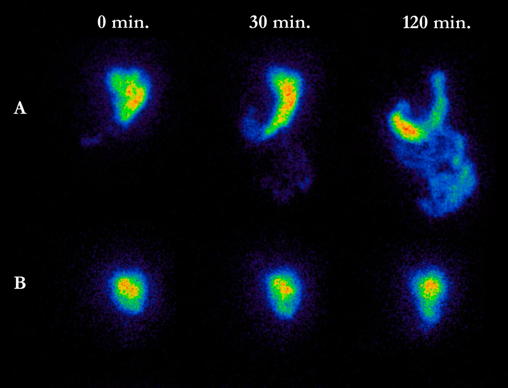

# Gastroparesis

*Categories: Clinical knowledge > Internal medicine > Gastroenterology > Diseases of the stomach > Gastroparesis*

[Original Article Link](https://coursology-qbank.com/amboss/article/4t03d3)

---

## Summary

Gastroparesis is characterized by <u>delayed gastric emptying</u> in the absence of mechanical obstruction. Common etiologies include <u>diabetes mellitus</u>, postsurgical complications, and medication side effects, although many cases are <u>idiopathic</u>. Patients typically present with <u>nausea</u>, <u>vomiting</u>, <u>bloating</u>, upper abdominal <u>pain</u>, and early satiety. Diagnosis requires ruling out mechanical obstruction via <u>esophagogastroduodenoscopy</u> (<u>EGD</u>) and confirming delayed emptying with a 4-hour <u>gastric emptying study</u>. Underlying causes and factors (e.g., <u>diabetes mellitus</u>, medications) should be identified and addressed. Initial management involves dietary modifications, such as consuming small, frequent, low-fat meals, and adjusting medication that delays gastric emptying. Pharmacotherapy includes <u>prokinetics</u> like <u>metoclopramide</u> and <u>erythromycin</u>, and <u>antiemetics</u> for symptom relief. Refractory cases may require procedural interventions, such as gastric peroral endoscopic <u>pyloromyotomy</u>, or <u>enteral nutrition</u> via <u>jejunostomy</u>. Significant complications include <u>malnutrition</u>, <u>electrolyte</u> imbalances, and <u>postprandial hypoglycemia</u> in patients with <u>diabetes</u>.

---

## Etiology

### <u>Causes of gastroparesis</u> [[2]](https://coursology-qbank.com/amboss/article/4iV3780)[[4]](https://coursology-qbank.com/amboss/article/ViVGq80)[[5]](https://coursology-qbank.com/amboss/article/AcVRUt0)

* <u>Idiopathic</u> (most common)

* <u>Diabetes mellitus</u> with poor glycemic control (diabetic gastroparesis)

* Postsurgical (e.g., following bariatric or other <u>foregut</u> <u>surgery</u>)

* Neurological disorders (e.g., <u>Parkinson disease</u>, <u>multiple sclerosis</u>)

* Infiltrative disorders (e.g., <u>amyloidosis</u>)

* <u>Connective tissue disorders</u> (e.g., <u>scleroderma</u>)

### Factors associated with delayed gastric emptying [[2]](https://coursology-qbank.com/amboss/article/4iV3780)[[6]](https://coursology-qbank.com/amboss/article/Z-1ZDj0)

* Medications 

* <u>Opioids</u>

* <u>Tricyclic antidepressants</u>

* <u>Calcium channel blockers</u>

* <u>Clonidine</u>

* <u>Dopamine agonists</u>

* <u>Lithium</u>

* <u>Progesterone</u>

* <u>GLP-1 receptor agonists</u> [[7]](https://coursology-qbank.com/amboss/article/YPVnWu0)

* <u>Pramlintide</u> [[8]](https://coursology-qbank.com/amboss/article/bPVHWu0)

* <u>Recreational substances</u> (e.g., <u>cannabis</u>, <u>nicotine</u>, <u>heavy alcohol use</u>) [[9]](https://coursology-qbank.com/amboss/article/zz1rvj0)[[10]](https://coursology-qbank.com/amboss/article/-z1Dvj0)

* Acute <u>hyperglycemia</u>

* <u>Hypothyroidism</u>

* Acute <u>gastrointestinal infection</u>

---

## Pathophysiology

The pathophysiology of gastroparesis is complex; contributing factors include disordered: [[11]](https://coursology-qbank.com/amboss/article/a4VQ3u0)

* <u>Gastric accommodation</u>

* Nerve conduction (e.g., electrical <u>dysrhythmias</u>, <u>vagal nerve injury</u>)

* Antroduodenal coordination

* <u>Pyloric</u> function

* <u>Visceral</u> sensation

> [!NOTE]
> Chronic <u>hyperglycemia</u> in patients with <u>diabetes</u> leads to <u>vagal</u> and <u>interstitial cell of Cajal</u> dysfunction, resulting in a loss of gastric electrical rhythm and <u>pyloric</u> coordination. This breakdown in neuromuscular control manifests as <u>delayed gastric emptying</u> (gastroparesis), typically presenting with <u>postprandial</u> fullness and the <u>vomiting</u> of undigested food. [[3]](https://coursology-qbank.com/amboss/article/jX1_B20)[[12]](https://coursology-qbank.com/amboss/article/FX1g-20)

---

## Clinical features

* Common symptoms [[4]](https://coursology-qbank.com/amboss/article/ViVGq80)

* <u>Nausea</u> and/or <u>vomiting</u>

* <u>Bloating</u>

* Upper abdominal <u>pain</u>

* Loss of appetite

* Early satiety

* <u>Postprandial</u> fullness

* Examination findings [[13]](https://coursology-qbank.com/amboss/article/j81_mi0)[[14]](https://coursology-qbank.com/amboss/article/Yu1npi0)

* Abdominal distension

* Epigastric tenderness

* <u>Succussion splash</u>

---

## Diagnosis

* Rule out alternative causes of gastrointestinal symptoms.

* Obtain <u>EGD</u> to exclude mechanical <u>gastric outlet obstruction</u>. [[4]](https://coursology-qbank.com/amboss/article/ViVGq80)

* Refer to gastroenterology for one of the following 4-hour studies to confirm delayed gastric emptying:  [[4]](https://coursology-qbank.com/amboss/article/ViVGq80)

* <u>Gastric emptying scintigraphy</u> (preferred): positive if > 10% gastric retention after 4 hours [[4]](https://coursology-qbank.com/amboss/article/ViVGq80)[[15]](https://coursology-qbank.com/amboss/article/8q1OZR0)

* <u>Stable isotope breath test</u>: Results are reported as normal, delayed, or accelerated gastric emptying. [[16]](https://coursology-qbank.com/amboss/article/04Ve3u0)

* Investigate for underlying <u>causes of gastroparesis</u> (e.g., <u>screening for diabetes mellitus</u>, <u>diagnostics of hypothyroidism</u>).

> [!TIP]
> Whenever possible, stop medications that affect gastric emptying at least 48 hours before a <u>gastric emptying study</u> to improve the <u>accuracy</u> of the results. [[15]](https://coursology-qbank.com/amboss/article/8q1OZR0)

Gastroparesis

---

## Management

### Approach [[4]](https://coursology-qbank.com/amboss/article/ViVGq80)

* Address <u>factors associated with delayed gastric emptying</u> (e.g., <u>review medications</u>, counsel on substance use).

* Initiate dietary modifications in consultation with a nutritionist.  [[6]](https://coursology-qbank.com/amboss/article/Z-1ZDj0)[[15]](https://coursology-qbank.com/amboss/article/8q1OZR0)[[18]](https://coursology-qbank.com/amboss/article/ae1Qxf0)

* Small, frequent meals

* Low in fat and fiber

* Small particle size  [[19]](https://coursology-qbank.com/amboss/article/_z15vj0)

* Consider pharmacotherapy if symptoms persist.

* Manage underlying <u>causes of gastroparesis</u> (e.g., <u>diabetes mellitus</u>).

* Refer patients with refractory gastroparesis to gastroenterology for potential procedural interventions.

### Pharmacotherapy [[4]](https://coursology-qbank.com/amboss/article/ViVGq80)

Assess treatment <u>efficacy</u> and tolerance of pharmacotherapy every 4–8 weeks to determine if therapy should be continued or adjusted. [[4]](https://coursology-qbank.com/amboss/article/ViVGq80)

#### <u>Prokinetics</u>

<u>Prokinetics</u> are used to improve symptoms and gastric emptying.

* First line 

* <u>Metoclopramide</u> (<u>off-label</u>) DOSAGE [[4]](https://coursology-qbank.com/amboss/article/ViVGq80)

* Inform patients about the risk of <u>tardive dyskinesia</u> with long-term use.

* Use <u>shared decision-making</u>.

* Low-dose <u>erythromycin</u> (<u>off-label</u>) DOSAGE [[4]](https://coursology-qbank.com/amboss/article/ViVGq80)

* Consider structured treatment interruptions to avoid <u>tachyphylaxis</u>.  [[4]](https://coursology-qbank.com/amboss/article/ViVGq80)

* <u>Azithromycin</u> has similar gastric <u>prokinetic</u> effects (<u>motilin</u> <u>agonism</u>) and may be used as an alternative.

* Alternatives 

* <u>Prucalopride</u>

* <u>Buspirone</u>

* <u>Domperidone</u>  [[4]](https://coursology-qbank.com/amboss/article/ViVGq80)

* Low-dose <u>nortriptyline</u>

#### <u>Antiemetics</u>

These agents reduce <u>nausea and vomiting</u> without affecting gastric emptying and include:

* <u>5-HT3 antagonists</u> (e.g., <u>ondansetron</u>)

* <u>Histamine</u> <u>H1 antagonists</u> (e.g., <u>promethazine</u>)

* <u>Dopamine</u> D2 <u>antagonists</u> (e.g., <u>prochlorperazine</u>)

* NK1 <u>receptors</u> <u>antagonists</u> (e.g., <u>aprepitant</u>)

### Management of diabetic gastroparesis [[4]](https://coursology-qbank.com/amboss/article/ViVGq80)[[15]](https://coursology-qbank.com/amboss/article/8q1OZR0)

Management is similar to that of other gastroparesis etiologies. In addition:

* Optimize glycemic control to achieve <u>glycemic targets for diabetes</u>.

* Prefer <u>DPP-4 inhibitors</u> over <u>GLP-1 receptor agonists</u> and <u>pramlintide</u>.

* <u>Acupuncture</u> may improve gastric emptying and symptoms.

> [!WARNING]
> Avoid or discontinue <u>GLP-1 receptor agonists</u> and <u>pramlintide</u> in patients with gastroparesis; these agents significantly delay gastric emptying and exacerbate symptoms.

### Management of refractory gastroparesis [[4]](https://coursology-qbank.com/amboss/article/ViVGq80)

Refractory gastroparesis refers to persistent symptoms with confirmed <u>delayed gastric emptying</u> and inadequate response to ≥ 2 medical therapies (including <u>prokinetics</u> and <u>antiemetics</u>) after alternative causes have been excluded.

* Use a multidisciplinary team approach, e.g., primary care, gastroenterology, registered dietician, and <u>endocrinology</u>.

* Evaluate the <u>accuracy</u> of the diagnosis.

* Ensure adequate <u>nutritional support</u>.

* Prioritize oral nutrition as tolerated.

* Use <u>enteral nutrition</u> (e.g., via <u>jejunostomy</u>) if necessary.

* Avoid <u>parenteral nutrition</u> when possible due to its high risk of complications (e.g., infection, <u>thrombosis</u>).

* Consider procedural interventions based on <u>shared decision making</u>.  

* Venting gastrostomy: may be used for symptom relief (e.g., <u>bloating</u>, <u>vomiting</u>) [[15]](https://coursology-qbank.com/amboss/article/8q1OZR0)[[20]](https://coursology-qbank.com/amboss/article/d-1owj0)

* <u>Pyloric</u> <u>botulinum toxin</u> injection every 3 months

* Gastric peroral endoscopic <u>pyloromyotomy</u>: indicated for confirmed ≥ 20% retention at 4 hours, with symptoms persisting for 6–12 months [[4]](https://coursology-qbank.com/amboss/article/ViVGq80)

* Gastric electric stimulation: targets <u>nausea and vomiting</u>; generally ineffective for abdominal <u>pain</u>

---

## Complications

* <u>Electrolyte</u> imbalances

* <u>Malnutrition</u>

* Increased risk of <u>postprandial hypoglycemia</u> in patients with <u>diabetes mellitus</u>

* <u>Bezoar</u> formation

We list the most important complications. The selection is not exhaustive.

---