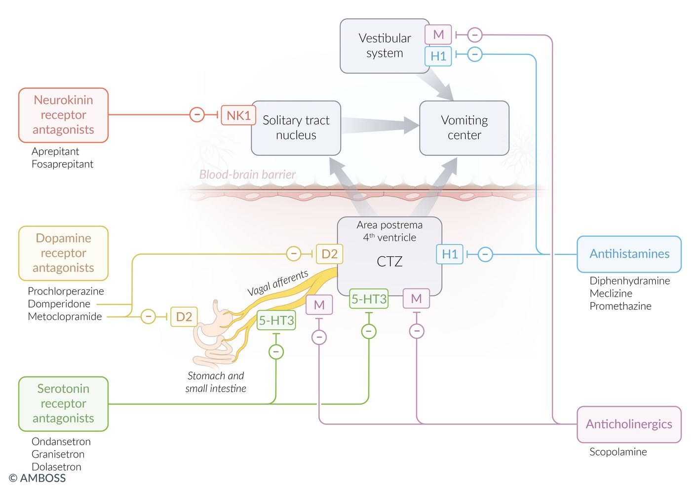

# Antiemetics

*Categories: Clinical knowledge > Internal medicine > Gastroenterology > Relevant pharmacology > Antiemetics*

[Original Article Link](https://coursology-qbank.com/amboss/article/qm0Cgg)

---

## Summary

Antiemetics are a heterogeneous group of drugs used to treat various <u>causes of nausea and vomiting</u>. Different antiemetics act on different <u>receptors</u>, and they may have a peripheral effect, a central effect, or both. Whereas <u>serotonin</u> <u>antagonists</u>, for example, bind 5-HT3 <u>receptors</u> and effectively combat cytotoxic drug <u>nausea</u>, certain <u>anticholinergic drugs</u> target <u>M1receptors</u> and specifically treat <u>motion sickness</u> (kinetosis). Hospitals and clinics commonly use the <u>dopamine</u> D2<u>antagonist</u> <u>metoclopramide</u>. However, because of its strong central effect and possible <u>extrapyramidal side effects</u>, <u>metoclopramide</u> must be used with caution.

---

## Overview

### Antiemetics in adults

| <u>Overview of antiemetics</u> in adults |  |  |  |  |
| --- | --- | --- | --- | --- |
| Antiemetic class | Drug | Mechanism of action | Clinical use | Side effects |
| Dopamine receptor antagonists |  * Prochlorperazine DOSAGE [[1]](https://coursology-qbank.com/amboss/article/iy0JUi)   |   * D2<u>antagonist</u>  * Central antiemetic effect at the <u>area postrema</u>    |   * <u>Antipsychotic</u> agent  * <u>Hyperemesis gravidarum</u>    |   * Gastrointestinal  * <u>Diarrhea</u>  * <u>Pain</u>  * <u>Hyperprolactinemia</u>  * Neurological  * <u>Depression</u>, <u>anxiety</u>  * Fatigue  * Drowsiness  * Restlessness  * Lowering of <u>seizure</u> threshold  * Overdose leads to reversible <u>extrapyramidal syndrome</u> (e.g., <u>dystonia</u>, <u>parkinsonism</u>, <u>tardive dyskinesia</u>, and <u>akathisia</u>) and <u>neuroleptic malignant syndrome</u>  * Do not combine <u>metoclopramide</u> with <u>antipsychotics</u> because this increases the risk of <u>dyskinesia</u>!  * <u>Antidote</u>: <u>benztropine</u>, <u>biperiden</u> (<u>anticholinergic agents</u>)  * Avoid combination with <u>digoxin</u> and <u>antidiabetic drugs</u>.  * Contraindicated in patients with suspected <u>small bowel obstruction</u>    |
|  * Metoclopramide DOSAGE [[2]](https://coursology-qbank.com/amboss/article/Oy0I2i)   |   * D2<u>antagonist</u>, <u>serotonin receptor antagonist</u>  * Central antiemetic effect at the <u>area postrema</u>  * Peripheral antiemetic effect in the <u>gastrointestinal tract</u> (<u>prokinetic</u> effect); causes increase in :  * Gastric contractions  * <u>Duodenal</u> and <u>jejunal</u> motility  * Resting tone of the <u>lower esophageal sphincter</u>  * Together with decreased <u>pylorus</u> sphincter activity allows food to pass more quickly through the <u>stomach</u> and the <u>small intestine</u>  * No influence on <u>colon</u> motility    |   * <u>Prokinetic</u> effect used to treat diabetic and postsurgery <u>gastroparesis</u> (<u>delayed gastric emptying</u>)  * <u>Hyperemesis gravidarum</u>  * Persistent <u>GERD</u>    |  |  |
|  * Domperidone DOSAGE   |   * D2<u>antagonist</u>  * Central antiemetic effect at the <u>area postrema</u>  * <u>Prokinetic</u> effect (due to blockage of peripheral <u>dopamine</u> <u>receptors</u>)    |   * <u>Nausea and vomiting</u>  * <u>Gastrointestinal motility disorders</u>    |   * Gastrointestinal  * <u>Diarrhea</u>  * <u>Pain</u>  * Hyperprolactinema  * <u>Domperidone</u>, in contrast to <u>metoclopramide</u> and <u>prochlorperazine</u>, crosses the <u>blood-brain</u>-barrier only minimally, hence neurological side effects are limited  * May cause <u>cardiac arrhythmias</u>    |  |
|  Serotonin receptor antagonists (<u>5-HT3 antagonists</u>) |   * Ondansetron DOSAGE [[3]](https://coursology-qbank.com/amboss/article/my0Vfi)  * Granisetron DOSAGE  * Dolasetron DOSAGE  * Palonosetron DOSAGE    |   * 5-HT3 <u>antagonist</u>  * Strong central antiemetic effect at the <u>area postrema</u>  * Peripheral antiemetic effect via inhibition of the <u>vagus nerve</u>    |   * <u>Ondansetron</u> is commonly used for generalized <u>nausea</u>.  * <u>Chemotherapy-induced vomiting</u>, radiation-induced <u>vomiting</u>, and <u>postoperative nausea and vomiting</u> (<u>PONV</u>)    |   * <u>Headaches</u>  * <u>Constipation</u> or <u>diarrhea</u>  * <u>QT interval prolongation</u> (<u>torsades de pointes</u>)  * Increase in <u>liver</u> enzymes  * <u>Serotonin syndrome</u>    |
|  <u>Anticholinergic agents</u> [[4]](https://coursology-qbank.com/amboss/article/sXYtzn)  |  * Scopolamine DOSAGE   |   * Nonspecific <u>muscarinic antagonist</u>  * Central antiemetic effect at the <u>area postrema</u> and on the <u>vestibular system</u>  * Peripheral antiemetic effect via inhibition of the <u>vagus nerve</u>    |  * <u>Motion sickness</u>, vestibular-induced <u>nausea</u>, and <u>vomiting</u>   |   * <u>Anticholinergic side effects</u>: dry mouth, <u>mydriasis</u>, <u>tachycardia</u>, <u>urinary retention</u>  * <u>Antidote</u>: <u>physostigmine</u> (<u>cholinesterase inhibitor</u>)    |
| <u>Antihistamines</u> |   * Meclizine DOSAGE  * Dimenhydrinate DOSAGE  * Diphenhydramine DOSAGE  * Doxylamine DOSAGE  * <u>Promethazine</u> DOSAGE    |   * <u>H1antagonist</u>  * Central antiemetic effect at the <u>area postrema</u> and <u>vestibular system</u>    |   * Strong sedative  * <u>Nausea and vomiting</u> due to vestibular causes [[5]](https://coursology-qbank.com/amboss/article/XIY9Yq)  * <u>Hyperemesis gravidarum</u> (also see <u>antiemetics during pregnancy</u>)    |   * <u>Antihistamine</u> effects: drowsiness and confusion  * <u>Anticholinergic side effects</u>: dry mouth, <u>dilated pupils</u>, blurred <u>vision</u>, reduced <u>bowel sounds</u>, and <u>urinary retention</u> (<u>antidote</u>: <u>physostigmine</u>)    |
| Neurokinin receptor antagonists |   * Aprepitant DOSAGE  * Fosaprepitant DOSAGE    |   * <u>NK1 antagonist</u>  * Inhibition of NK1<u>receptors</u> in the <u>solitary nucleus</u> and <u>area postrema</u> → central antiemetic effect  [[6]](https://coursology-qbank.com/amboss/article/T816Ni0)  * Additional inhibition of substance P-induced <u>vomiting</u> due to <u>antagonism</u>    |  * <u>CINV prophylaxis</u>   |   * Gastrointestinal: <u>diarrhea</u>  * Fatigue  * <u>Hypersensitivity reactions</u>  * Infusion site reactions  * Increased levels of other drugs  due to weak <u>CYP3A4</u> <u>enzyme inhibition</u>    |
| <u>Glucocorticoids</u> |   * <u>Dexamethasone</u> DOSAGE  * <u>Methylprednisolone</u> DOSAGE    |   * Exact mechanism unknown  * Central antiemetic effect possibly mediated by interaction with <u>glucocorticoid</u> <u>receptors</u> in the <u>solitary nucleus</u> [[7]](https://coursology-qbank.com/amboss/article/08YeOI)    |   * <u>Dexamethasone</u>  * <u>CINV prophylaxis</u>  * <u>PONV prophylaxis</u>  * <u>PONV</u> treatment  * <u>Methylprednisolone</u>: <u>hyperemesis gravidarum</u>    |   * <u>Cushing syndrome</u>  * <u>Hyperglycemia</u>    |
|  <u>Benzodiazepines</u> [[8]](https://coursology-qbank.com/amboss/article/8rYOQq)[[9]](https://coursology-qbank.com/amboss/article/dFYoSI)  |  * <u>Lorazepam</u> DOSAGE   |   * <u>GABA</u> <u>agonist</u>  * Central antiemetic effect likely due to <u>depression</u> of the chemotrigger zone  [[9]](https://coursology-qbank.com/amboss/article/dFYoSI)    |   * <u>CINV prophylaxis</u>  * <u>CINV</u> treatment    |   * Sedation  * Drowsiness, confusion  * <u>Ataxia</u>  * <u>Dizziness</u>  * <u>Anterograde amnesia</u>  * Can raise <u>IOP</u> and trigger <u>angle-closure glaucoma</u>.  * Respiratory <u>depression</u>    |
|  <u>Atypical antipsychotics</u> [[8]](https://coursology-qbank.com/amboss/article/8rYOQq)[[9]](https://coursology-qbank.com/amboss/article/dFYoSI)[[10]](https://coursology-qbank.com/amboss/article/VFYGSI)[[11]](https://coursology-qbank.com/amboss/article/urYpQq)  |  * <u>Olanzapine</u> DOSAGE   |  * Central antiemetic effect via inhibition of multiple <u>neurotransmitters</u> (e.g., <u>dopamine</u>, <u>serotonin</u>, <u>histamine</u>)   |   * <u>CINV prophylaxis</u>  * <u>CINV</u> treatment    |   * Sedation  * Weight gain  * <u>Diabetes mellitus</u> (prolonged use)  * <u>Hypertriglyceridemia</u>, <u>hypercholesterolemia</u>  * <u>Extrapyramidal adverse effects</u>  * <u>QT interval prolongation</u>    |
|  <u>Cannabinoids</u> [[8]](https://coursology-qbank.com/amboss/article/8rYOQq)[[12]](https://coursology-qbank.com/amboss/article/eFYxSI)[[13]](https://coursology-qbank.com/amboss/article/UFYbhI)  |   * <u>Dronabinol</u> solution DOSAGE  * <u>Dronabinol</u> capsulesDOSAGE  * Nabilone DOSAGE    |   * Cannabinoid (<u>CB1</u> and <u>CB2</u>) <u>agonists</u>  * Central antiemetic effect: <u>CB1</u> <u>agonism</u> in the <u>brain stem</u> suppresses the emetic reflex.  * Peripheral antiemetic effect: <u>CB2</u> <u>agonism</u> in the <u>gastrointestinal tract</u> inhibits gastrointestinal motility.    |   * <u>CINV</u> treatment  * <u>Anorexia</u> causing weight loss in patients with <u>advanced HIV</u>    |   * <u>Ataxia</u>, <u>dizziness</u>, dry mouth  * Euphoria, <u>dysphoria</u>  * <u>Paranoia</u>, <u>hallucinations</u>  * Abdominal <u>pain</u>  * Paradoxical worsening of <u>nausea and vomiting</u> (<u>cannabinoid hyperemesis syndrome</u>)    |

Mechanism of action: antiemetic drugs

### Antiemetics in children [[14]](https://coursology-qbank.com/amboss/article/0rdefr0)

* <u>Ondansetron</u> is commonly used for <u>nausea and vomiting</u> in children, e.g.:

* Acute <u>gastroenteritis</u> with <u>dehydration</u> in ER settings: PO <u>ondansetron</u> (<u>off-label</u>) DOSAGE  [[15]](https://coursology-qbank.com/amboss/article/ZrdZfr0)[[16]](https://coursology-qbank.com/amboss/article/eJdxGI0)[[17]](https://coursology-qbank.com/amboss/article/Yrdnfr0)

* GI emergencies

* IV <u>ondansetron</u> (<u>off-label</u>) DOSAGE [[16]](https://coursology-qbank.com/amboss/article/eJdxGI0)

* PO <u>ondansetron</u> (<u>off-label</u>) DOSAGE [[16]](https://coursology-qbank.com/amboss/article/eJdxGI0)

* <u>Chemotherapy-induced nausea and vomiting</u> (<u>CINV</u>): The dosage and route vary by indication; consult a specialist.

* <u>Postoperative nausea and vomiting</u> prevention: <u>ondansetron</u> DOSAGE

* Alternative agents may be used for specific indications; consult a specialist.

* <u>Motion sickness</u> or <u>vertigo</u>: e.g., <u>diphenhydramine</u> (<u>off-label</u>) DOSAGE, <u>dimenhydrinate</u> [[18]](https://coursology-qbank.com/amboss/article/crdaTr0)

* <u>Migraine</u>: e.g., <u>prochlorperazine</u>, <u>metoclopramide</u> [[19]](https://coursology-qbank.com/amboss/article/Xrd9fr0)

* <u>CINV</u>: e.g., <u>dexamethasone</u>, <u>neurokinin receptor antagonist</u>  [[20]](https://coursology-qbank.com/amboss/article/cFYaSI)

---

## Indications

* Nonspecific <u>nausea and vomiting</u>

* <u>Chemotherapy-induced nausea and vomiting</u>

* <u>Vertigo</u> (e.g., <u>vestibular neuritis</u>, Ménière's disease)

* <u>Motion sickness</u>

* <u>Gastrointestinal motility disorder</u> (e.g., due to <u>diabetic gastroparesis</u>)

* <u>Postoperative nausea and vomiting</u>

References:[[21]](https://coursology-qbank.com/amboss/article/XC09qR)

---

## Contraindications

* <u>Dopamine receptor antagonists</u>

* <u>Intestinal obstruction</u> (<u>ileus</u>)

* <u>Prolactin</u>-dependent tumors

* <u>Parkinson disease</u>: unlike <u>domperidone</u>, <u>metoclopramide</u> and <u>prochlorperazine</u> can cross the <u>blood-brain</u> barrier and exacerbate the pre-existing <u>dopamine</u> deficiency that causes <u>parkinsonism</u>.

* <u>Serotonin receptor antagonists</u>: : severe <u>liver</u> disease, prolonged <u>QT interval</u>

* <u>Anticholinergic agents</u> and <u>antihistamines</u>

* <u>Tachyarrhythmias</u>, <u>heart failure</u>

* <u>Urinary retention</u>, <u>BPH</u>

* <u>Glaucoma</u>

* <u>Pyloric stenosis</u>

References:[[21]](https://coursology-qbank.com/amboss/article/XC09qR)

We list the most important contraindications. The selection is not exhaustive.

---