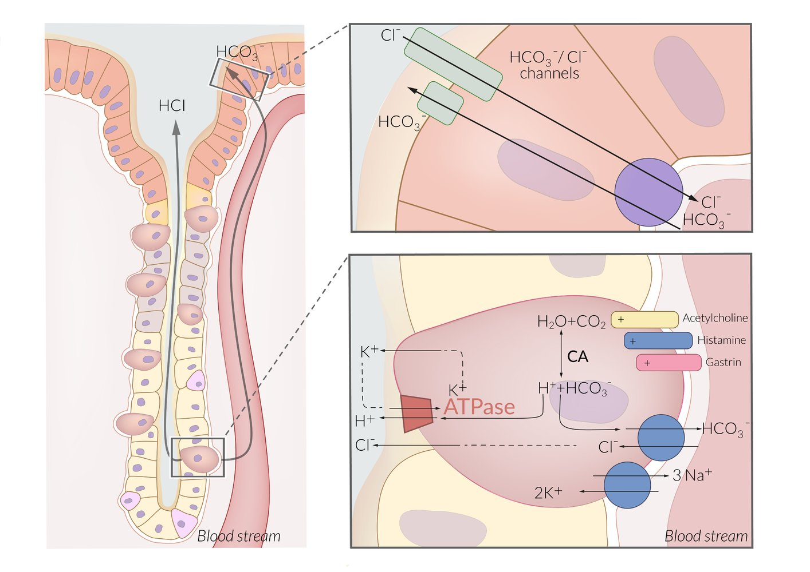
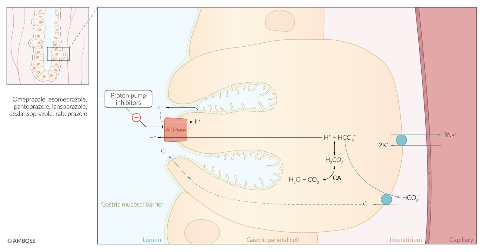
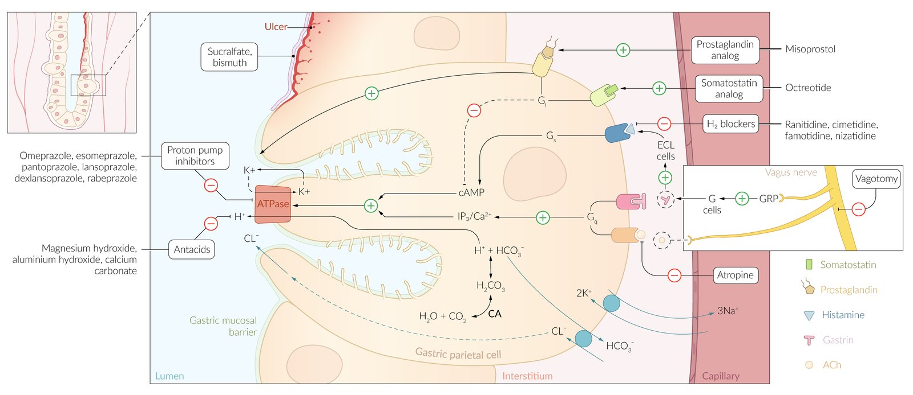

# Proton pump inhibitors

*Categories: Clinical knowledge > Internal medicine > Gastroenterology > Relevant pharmacology > Proton pump inhibitors*

[Original Article Link](https://coursology-qbank.com/amboss/article/rm0fSg)

---

## Summary

Proton pump inhibitors (PPIs) are a group of drugs used primarily to inhibit <u>gastric acid</u> secretion. They have largely replaced <u>H2blockers</u> such as <u>cimetidine</u> in the management of conditions caused by excessive gastroesophageal acidity (e.g., <u>dyspepsia</u>, <u>GERD</u>, <u>Barrett's esophagus</u>, <u>peptic ulcers</u>). PPIs act by completely and irreversibly inhibiting the <u>H+/K+ ATPase</u> enzyme system (gastric proton pump) in the <u>parietal cells</u> of the <u>stomach</u>, resulting in decreased acid production and an increase in gastric <u>pH</u>. PPIs are available in oral and intravenous forms, of which the oral form is more commonly administered. Intravenous PPIs are reserved for management of severe disease, since they can cause irreversible visual disturbances in rare cases. Other side effects are predominantly gastrointestinal, including symptoms such as <u>nausea</u> and abdominal <u>pain</u>, and usually decrease during the course of treatment. Significant <u>drug interactions</u> occur especially with <u>anticoagulants</u> (<u>warfarin</u>, <u>clopidogrel</u>) and should be considered before prescribing PPIs.

---

## Overview

* Commonly used PPIs 

* Omeprazole

* <u>Esomeprazole</u>

* Pantoprazole

* <u>Lansoprazole</u>, dexlansoprazole

* Rabeprazole

* Administration

* 1 Tablet/day taken in the morning on an empty <u>stomach</u>

* Duration

* 1–12 weeks depending on the underlying condition

* Long-term administration for complicated disease, but should generally be avoided (see “Side effects” below)

> [!TIP]
> The individual PPIs differ in their pKa, <u>bioavailability</u>, peak plasma levels, and route of excretion. However, because these differences have not yet proven to be clinically relevant, PPIs are often used interchangeably.
> References:[[1]](https://coursology-qbank.com/amboss/article/XC09qR)[[2]](https://coursology-qbank.com/amboss/article/My0Mfi)[[3]](https://coursology-qbank.com/amboss/article/ny07fi)

---

## Pharmacodynamics

* <u>Irreversible inhibition</u> of <u>H+/K+ATPase</u> in parietal cells → increases <u>stomach</u> <u>pH</u>

* Complete suppression of <u>gastric acid</u> secretion

Gastric acid secretion

Mechanism of action: proton pump inhibitors (PPIs)

Gastroprotective therapy

References:[[1]](https://coursology-qbank.com/amboss/article/XC09qR)

---

## Adverse effects

* Gastrointestinal

* <u>Nausea</u>, <u>diarrhea</u>, abdominal <u>pain</u>, flatulence

* ↑ Risk of <u>C. difficile</u> infection

* Reactive <u>hypergastrinemia</u>  [[4]](https://coursology-qbank.com/amboss/article/iTYJqo)[[5]](https://coursology-qbank.com/amboss/article/RFdl370)

* ↓ Absorption of <u>iron</u> and <u>vitamin B12</u>

* ↓ Absorption of <u>calcium</u> and <u>magnesium</u> → ↑ risk of <u>osteoporosis</u> in long-term use→ ↑ risk of <u>fractures</u> in elderly individuals

* Neurological

* <u>Lightheadedness</u>, <u>headaches</u>

* Possibly increased risk of developing cognitive impairment/<u>dementia</u>  [[6]](https://coursology-qbank.com/amboss/article/oy00Ti)

* Others

* Exanthema

* Visual disturbances (rare)

* ↑ Risk of <u>pneumonia</u>  [[7]](https://coursology-qbank.com/amboss/article/6y0jTi)[[8]](https://coursology-qbank.com/amboss/article/py0LTi)[[9]](https://coursology-qbank.com/amboss/article/Jy0sTi)

* In rare cases, <u>acute interstitial nephritis</u>

References:[[1]](https://coursology-qbank.com/amboss/article/XC09qR)[[6]](https://coursology-qbank.com/amboss/article/oy00Ti)

We list the most important adverse effects. The selection is not exhaustive.

---

## Indications

* <u>Peptic ulcer disease</u> (gastric and <u>duodenal ulcers</u>)

* Prevention of <u>stress ulcers</u>

* <u>Gastroesophageal reflux disease</u>

* <u>Gastritis</u>

* Combination treatment in <u>Helicobacter pylori</u> eradication therapy

* <u>Zollinger-Ellison</u> syndrome (<u>gastrinoma</u>)

* <u>Gastropathy</u> caused by <u>NSAIDs</u>

* Special indication: <u>MALT lymphoma</u> (stages I and II)

References:[[1]](https://coursology-qbank.com/amboss/article/XC09qR)

---

## Interactions

Although several <u>drug interactions</u> are suspected, those with <u>omeprazole</u> and <u>esomeprazole</u> have proven to be of clinical significance, mainly in <u>CYP2C19</u>-mediated interactions (primarily due to <u>CYP2C19</u> inhibition):

* <u>Clopidogrel</u>: ↓ activation

* <u>Warfarin</u>; , <u>phenprocoumon</u>: ↓ clearance

* <u>Phenytoin</u>, <u>carbamazepine</u>: ↑ clearance

* <u>Nifedipine</u>: ↑ absorption, ↓ clearance

* <u>Diazepam</u>: ↓ clearance

References:[[10]](https://coursology-qbank.com/amboss/article/qy0CTi)

---