# General oncology

*Categories: Clinical knowledge > Internal medicine > Hematology and oncology > Basics of hematology and oncology > General oncology*

[Original Article Link](https://coursology-qbank.com/amboss/article/WM0Png)

---

## Summary

Oncology is the science of tumors. This article explains basic concepts relevant to the development, progression, spread, and diagnosis of cancer. Histological analysis helps to determine <u>tumor</u> type and grade, whereas the <u>TNM classification</u> system is used to assess staging. Because it is standardized and used internationally, the <u>TNM classification</u> helps unify oncological research and therapy protocols. <u>Metastasis</u> occurs via different pathways mainly by hematogenous or lymphatic spreading.

<u>Principles of cancer care</u>, <u>paraneoplastic syndromes</u>, and <u>tumor markers</u> are covered in detail in their respective articles.

---

## Nomenclature

### Terminology

| Basic terminology in oncology |  |
| --- | --- |
| Term | Definition |
| Normal cell |   * Cells without <u>atypia</u>, <u>pleomorphism</u>, or <u>dysplasia</u>  * Normal <u>nuclear:cytoplasmic ratio</u>  * Intact cell polarity: <u>Epithelial</u> cells have a specific microscopic structure with different <u>lateral</u>, apical, and basal membrane domains.    |
| Neoplasia |   * Excessive <u>proliferation</u> of cells  * <u>Neoplasms</u> consist of two components:  * <u>Parenchyma</u>: <u>neoplastic</u> cells  * Stroma: <u>connective tissue</u> and <u>blood vessels</u> supporting the <u>parenchyma</u>  * Monoclonal in origin  * Can be either malignant or benign    |
| Tumor |   * Abnormal growth of cells or <u>edema</u> that leads to swelling of tissue  * <u>Tumor</u> does not necessarily mean <u>neoplasia</u>.    |
| Adenoma |  * A <u>benign tumor</u> that arises from glandular <u>epithelial</u> cells.   |
| Carcinoma |  * Malignant cells that arise from <u>epithelium</u> (e.g., <u>squamous cell carcinoma</u>, <u>basal cell carcinoma</u>)   |
| Sarcoma |  * Malignant cells that arise from <u>mesenchyme</u> (e.g., <u>sarcoma botryoides</u>, <u>liposarcoma</u>, <u>leiomyosarcoma</u>)   |
| Hamartoma |   * A benign mass composed of mature cells that are native to the tissue of origin but have abnormal tissue organization (e.g., <u>Peutz-Jeghers</u> syndrome, <u>pulmonary hamartoma</u>, <u>iris hamartoma</u>)  * Low potential to undergo malignant transformation    |
| Choristoma |  * Presence of normal tissue at a site where this type of tissue is not normally found (e.g., the presence of gastric tissue in the <u>ileum</u>, as is sometimes seen in <u>Meckel diverticulum</u>)   |
|  Dysplasia    |   * Presence of <u>pleomorphism</u> (cells of different shape and size)  * Loss of cell orientation  * Increased <u>nuclear:cytoplasmic ratio</u>  * No invasion of the <u>basement membrane</u>    |
|  Carcinoma in situ (<u>CIS</u>)    |   * Irreversible severe <u>dysplasia</u>  * Involves the entire thickness of the <u>epithelium</u>  * No invasion of the <u>basement membrane</u>    |
|  Invasive carcinoma    |   * Invasion of the <u>basement membrane</u>  * Factors that promote invasion  * <u>Metalloproteases</u> (e.g., <u>hydrolases</u>, <u>collagenases</u>)  * Inactivation of <u>E-cadherins</u> → disruption of intercellular adhesions between neighboring cells    |
|  <u>Metastasis</u>    |  * Spread of malignant cells to distant organs, tissues (e.g., <u>colorectal cancer</u> spreading to the <u>liver</u>)  * Lymphatic spread  * Hematogenous spread   |

Pap smear showing severe dysplasia

Ductal carcinoma in situ

Invasive lobular carcinoma of the breast

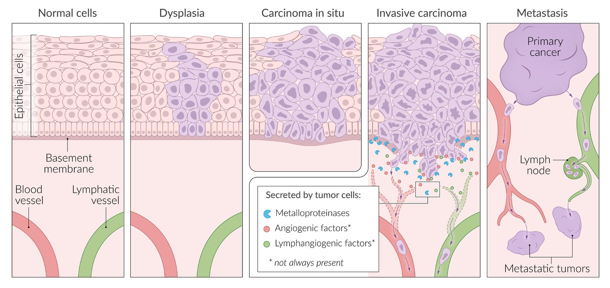

Neoplastic progression

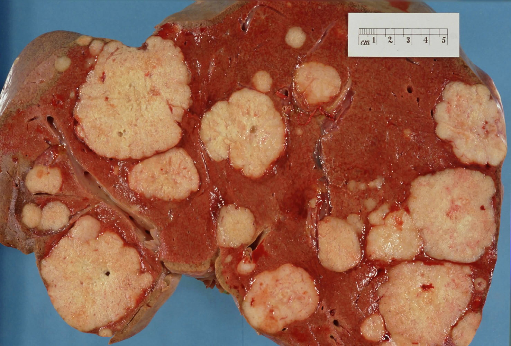

Liver metastasis from pancreatic carcinoma

Invasive breast carcinoma of no special type (invasive ductal carcinoma) 1/3

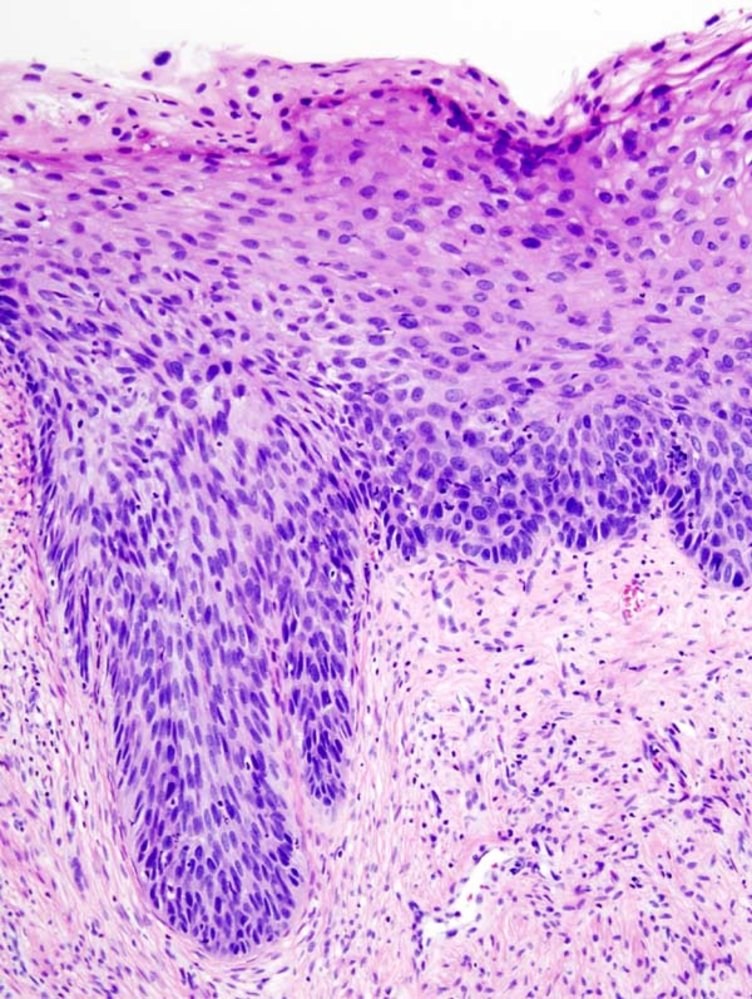

Cervical intraepithelial neoplasia (CIN III)

Invasive ductal carcinoma of the breast

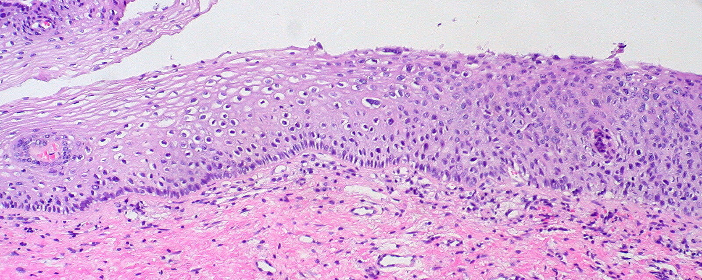

Spectrum of cervical dysplasia

### Benign and <u>malignant tumors</u>

| Overview of benign and <u>malignant tumors</u> |  |  |
| --- | --- | --- |
|  | Benign tumor | Malignant tumor |
| Differentiation(grading) |  * Well-differentiated (low grade)   |  * Poorly differentiated (high grade)   |
| Growth |   * Slow growth with a low rate of cell division (low <u>mitotic</u> activity)  * Mass effect with compression of non-<u>tumor</u> tissue    |   * Unpredictable growth, high rate of cell division (high <u>mitotic</u> activity)  * Suppressed cellular <u>apoptosis</u>  * Locally destructive and invasive    |
| Macroscopy |   * <u>Necrosis</u> is rare.  * Well-demarcated from surrounding tissue    |   * Possible <u>necrosis</u> (e.g., <u>squamous cell carcinoma of the lung</u>)  * Usually no <u>tumor</u> capsule  * Infiltration (invasion) of surrounding tissue  * Bleeding    |
| Microscopy |  * Almost no irregularities of cellular structures   |  * Detection and confirmation of cellular atypia  * <u>Nuclei</u>: Enlargement , <u>polymorphism</u> , <u>polychromasia</u> , increased cell count and/or enlarged nucleoli are all signs of increased activity of <u>nuclei</u>.  * Numerous mitotic figures (increased <u>proliferation</u> of malignant cells with typical and atypical <u>mitoses</u>)   |
| <u>Metastasis</u> and relapse |   * No <u>metastases</u>  * Relapses are rare.    |  * <u>Metastases</u> and relapses are common.   |

### <u>Tumor</u> origin

| Types of tumors based on cell origin |  |  |  |
| --- | --- | --- | --- |
| Type of tumors | Cell origin | <u>Benign tumor</u> | <u>Malignant tumor</u> |
| Epithelial tumors |  * <u>Squamous epithelium</u>   |  * Papilloma   |  * Squamous cell carcinoma (e.g., <u>squamous cell lung cancer</u>, <u>cutaneous SCC</u>, <u>esophageal cancer</u>, <u>pharyngeal cancer</u>, <u>cervical cancer</u>, <u>vulvar and vaginal cancer</u>)   |
|  * <u>Urothelium</u>   |  * <u>Urothelial cancer</u> (<u>transitional cell carcinoma</u>)   |  |  |
|  * Glandular/<u>mucosal</u> <u>epithelium</u>   |  * <u>Adenoma</u>   |  * Adenocarcinoma (e.g., <u>lung adenocarcinoma</u>, <u>gastric cancer</u>, <u>colorectal cancer</u>, <u>breast cancer</u>, <u>prostate cancer</u>)   |  |
|  * <u>Cuboidal epithelium</u>   |  |  * <u>Papillary thyroid carcinoma</u>   |  |
| Mesenchymal tumors |  * <u>Fibrocytes</u>   |  * Fibroma  * Can occur almost anywhere in the body  * Common types: <u>ovarian fibroma</u>, <u>dermatofibroma</u>, <u>nonossifying fibroma</u>   |  * Fibrosarcoma   |
|  * <u>Adipocytes</u>   |  * <u>Lipoma</u>   |  * Liposarcoma: most commonly develop in extremities and <u>retroperitoneum</u>   |  |
|  * <u>Chondrocytes</u>   |  * <u>Chondroma</u>   |  * <u>Chondrosarcoma</u>   |  |
|  * <u>Osteoblasts</u>   |  * <u>Osteoblastoma</u>   |  * <u>Osteosarcoma</u>   |  |
|  * <u>Osteoma</u>   |  |  |  |
|  * <u>Blood vessels</u>   |  * Hemangioma (e.g., <u>cherry hemangioma</u>, <u>hepatic hemangioma</u>, <u>infantile hemangioma</u>)   |  * Hemangiosarcoma (linked to <u>vinyl chloride toxicity</u>)   |  |
|  * Lymphatic vessels   |  * Lymphangioma  * A <u>malformation</u> of <u>the lymphatic system</u> composed of <u>endothelium</u>-lined cysts that contain lymphatic fluid  * Most commonly manifests as a cluster of clear and/or hemorrhagic <u>vesicles</u> on the <u>skin</u>   |  * Lymphangiosarcoma  * A rare cutaneous <u>malignancy</u> that can develop in patients with long-standing chronic <u>lymphedema</u>  * A classic complication of prior <u>radical mastectomy</u> or <u>radiation therapy</u> (<u>Stewart-Treves syndrome</u>)  * Presents with multiple purple-colored <u>macules</u> and/or <u>papules</u>   |  |
|  * Rhabdomyocytes (<u>striated muscle</u> cells)   |  * Rhabdomyoma: may be either <u>neoplastic</u> or a <u>hamartoma</u>   |  * <u>Rhabdomyosarcoma</u>   |  |
|  * Leiomyocytes (<u>smooth muscle cells</u>)   |  * Leiomyoma: <u>uterine leiomyoma</u> (most common type)   |  * Leiomyosarcoma: a rare <u>neoplasm of the small bowel</u>, the <u>uterus</u>, or the <u>skin</u>   |  |
|  * <u>Mesothelium</u>   |  * Benign <u>mesothelioma</u>   |  * Malignant <u>mesothelioma</u>   |  |
|  * <u>Meninges</u>   |  * <u>Meningioma</u>   |  * Malignant <u>anaplastic</u> <u>meningioma</u>   |  |
|  * <u>Neuroectodermal</u> cells   |  * N/A   |  * <u>Ewing sarcoma</u>   |  |
| Special variants of <u>mesenchymal tumors</u> |  * <u>Hematopoietic</u> cells (e.g., <u>B cells</u>, <u>T cells</u>)   |  * N/A   |   * Myelogenous <u>leukemia</u> (<u>AML</u>, <u>CML</u>)  * <u>Acute lymphoblastic leukemia</u>  * <u>Multiple myeloma</u>    |
|  * N/A   |  * Lymphomas  * <u>Hodgkin lymphoma</u>  * <u>Non-Hodgkin lymphoma</u>   |  |  |
| <u>Neuroectodermal</u> tumors |  * <u>Glial cells</u>   |  * Benign <u>glioma</u>   |   * <u>Astrocytoma</u>  * <u>Glioblastoma</u>    |
|  * <u>Melanocytes</u>   |  * <u>Nevus</u>   |  * <u>Malignant melanoma</u>   |  |
| <u>Germ cell tumors</u> |  * Germ cells   |  * Differentiated <u>teratoma</u>   |   * Malignant <u>teratoma</u>  * <u>Seminoma</u>    |
| Embryonal tumors |  * Primitive <u>epithelial</u> cells   |  * N/A   |   * <u>Embryonal carcinoma</u>  * <u>Nephroblastoma</u>  * <u>Neuroblastoma</u>  * <u>Retinoblastoma</u>  * Hepatoblastoma  * A rare childhood <u>tumor</u> of <u>liver</u> precursor tissue  * Usually diagnosed before the age of 3 years  * <u>Choriocarcinoma</u>    |

---

## General epidemiology

In 2020, approximately 1.8 million people will be diagnosed with cancer in the United States. Cancer is the 2nd leading <u>cause of death</u>;  after <u>heart</u> disease. The most common type of cancer in both men and women is <u>skin</u> cancer, with <u>basal cell carcinoma</u> being more common than <u>squamous cell carcinoma</u> and <u>melanoma</u>. [[1]](https://coursology-qbank.com/amboss/article/CmXq3A)

### <u>Epidemiology</u> of common cancer types in 2020 [[2]](https://coursology-qbank.com/amboss/article/2hYTWK)

The following numbers are an estimation of new cancer cases and their mortality in the United States (excluding <u>skin</u> cancer ).

| <u>Epidemiology</u> of most common cancer types |  |  |  |
| --- | --- | --- | --- |
|  Type   | <u>Incidence</u>/year in men | <u>Incidence</u>/year in women | Mortality/year |
| <u>Breast cancer</u> | 2,620 | 276,480 | 42,690 |
| <u>Lung and bronchus cancer</u> | 116,300 | 112,520 | 135,720 |
| <u>Prostate cancer</u> | 191,930 | N/A | 33,330 |
| <u>Colorectal cancer</u> | 78,300 | 69,650 | 53,200 |
| <u>Bladder cancer</u> | 62,100 | 19,300 | 17,980 |
| <u>Kidney cancer</u> | 45,520 | 28,230 | 14,830 |
| Uterine cancer | N/A | 65,620 | 12,590 |
| <u>Pancreatic cancer</u> | 30,400 | 27,200 | 47,050 |
| <u>Thyroid cancer</u> | 12,720 | 40,170 | 2,180 |
| <u>Non-Hodgkin lymphoma</u> | 42,380 | 34,860 | 19,940 |
| <u>Leukemia</u> | 35,470 | 25,060 | 23,100 |

* The most common types of cancer in men (excluding <u>skin</u> cancer)
1. * <u>Prostate cancer</u>
2. * <u>Lung and bronchus cancer</u>
3. * <u>Colorectal cancer</u>

* The most common cancer in women (excluding <u>skin</u> cancer)
1. * <u>Breast cancer</u>
2. * <u>Lung and bronchus cancer</u>
3. * <u>Colorectal cancer</u>

* The types of cancer with the highest <u>mortality rate</u> in both men and women (in descending order)
1. * <u>Cancer of lung and bronchus</u>
2. * <u>Prostate cancer</u> (men), <u>breast cancer</u> (women)
3. * <u>Colorectal cancer</u>

* The most common types of cancer that have the greatest <u>mortality rate</u> in children (< 15 years)
1. * <u>Leukemia</u> (<u>ALL</u>, <u>AML</u>)
2. * <u>Brain</u> and spinal cord tumors
3. * <u>Neuroblastoma</u>

Incidence of cancers in the US (2025 estimates)

Cancer mortality in the US (2025 estimates)

---

## Carcinogenesis

### Overview

* Definition: a multistep process by which normal cells develop and accumulate genetic mutations (inherited or acquired), resulting in a monoclonal expansion of mutated cells that can progress to the development of <u>neoplasia</u>

* Process
1. * Initiation: <u>DNA damage</u>
2. * Promotion: <u>DNA damage</u> passed on
3. * Latency: the time between promotion and progression
4. * Progression: <u>proliferation</u> of the <u>neoplastic</u> cell line with the acquired <u>DNA damage</u>, leading to malignant transformation

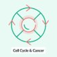

Cell Cycle and Cancer: Phases, Hallmarks, and Development

### Properties of malignant cells

* Sustained proliferative signaling: due to mutation of <u>genes</u> regulating cell division and growth

* (Proto‑)<u>oncogene</u>: See “<u>Proto-oncogene</u>” below.

* Growth factor <u>receptors</u> (e.g., <u>ERBB2</u>, <u>EGFR</u>)

* Signaling molecules (e.g., <u>Ras</u>, <u>B-Raf</u>) [[3]](https://coursology-qbank.com/amboss/article/mYbVpH)

* <u>Transcription factors</u> (e.g., <u>MYC</u>, <u>TP53</u>) [[4]](https://coursology-qbank.com/amboss/article/5YbipH)

* <u>Cell cycle</u> regulators (e.g., <u>cyclins</u>, <u>CDKs</u>)

* Evade growth suppressors [[5]](https://coursology-qbank.com/amboss/article/MYbMpH)

* <u>Tumor suppressor genes</u>: See “<u>Tumor suppressor genes</u>” below.

* Loss of contact inhibition

* Mutated or absent <u>E-cadherin</u> → loss of growth inhibitory signals and contact inhibition of <u>proliferation</u> → excessive cell <u>proliferation</u>

* Due to mutations in <u>genes</u> that regulate contact inhibition (e.g., <u>NF2</u> <u>gene</u>)

* <u>Genome instability</u> and mutations

* Mutations: See “<u>Gene mutations</u>” and “<u>Chromosomal translocation</u>” in the “<u>Basics of human genetics</u>” article.

* <u>Gene amplification</u>: increased <u>gene expression</u> (e.g., overexpression of <u>ERBB2</u> <u>gene</u> in several forms of <u>breast cancer</u>)

* Resist <u>cell death</u> 

* Occurs because of mutations in <u>apoptosis</u> regulatory <u>genes</u>

* Loss of regulatory <u>genes</u> (e.g., <u>Bax</u>, <u>TP53</u>, <u>BCL-2</u>) leads to cell immortality and increased <u>proliferation</u>.

* Enable replicative immortality: <u>telomerase</u> reactivation → ↑ length of <u>telomeres</u> → ↑ number of possible cell replication cycles

* Deregulate cellular energetics: a shift in cellular metabolism from <u>glycolysis</u> and <u>mitochondrial</u> <u>oxidative phosphorylation</u> to <u>glycolysis</u> and preferential <u>lactate</u> generation, regardless of the oxygen supply (Warburg effect)

* In differentiated, non-malignant cells, <u>glycolysis</u> converts <u>glucose</u> to <u>pyruvate</u>, which then undergoes <u>mitochondrial</u> <u>oxidative phosphorylation</u> under aerobic conditions, or <u>anaerobic glycolysis</u> to generate <u>lactate</u> under anaerobic conditions.

* In malignant cells, the so-called <u>Warburg effect</u> occurs, in which <u>pyruvate</u> is preferentially converted to <u>lactate</u>, regardless of the cellular oxygen supply. This mechanism supplies rapidly dividing malignant cells with the necessary carbon to synthesize cellular structures. [[6]](https://coursology-qbank.com/amboss/article/nYb7pH)

* Induce <u>angiogenesis</u> [[5]](https://coursology-qbank.com/amboss/article/MYbMpH)

* <u>Angiogenesis</u> helps maintain an adequate supply of oxygen and <u>nutrients</u> to the <u>neoplastic</u> cells.

* Regulated by angiogenic (e.g., <u>VEGF</u>, FGF) and inhibitory factors that are produced by <u>neoplastic</u> or supporting cells

* Occurs as:

* Vasculogenesis: de novo formation of <u>blood vessels</u> from <u>bone marrow</u>-derived <u>endothelial</u> cells

* Neoangiogenesis: formation of <u>blood vessels</u> from existing <u>blood vessels</u> and <u>capillaries</u>

* Newly formed <u>blood vessels</u> may be dilated or leaky.

* Activate invasion and <u>metastasis</u>: See “<u>Metastasis</u>” below.

* Avoid immune detection: See “<u>Defense mechanisms of malignant cells</u>” below.

* <u>Tumor</u>-promoted inflammation

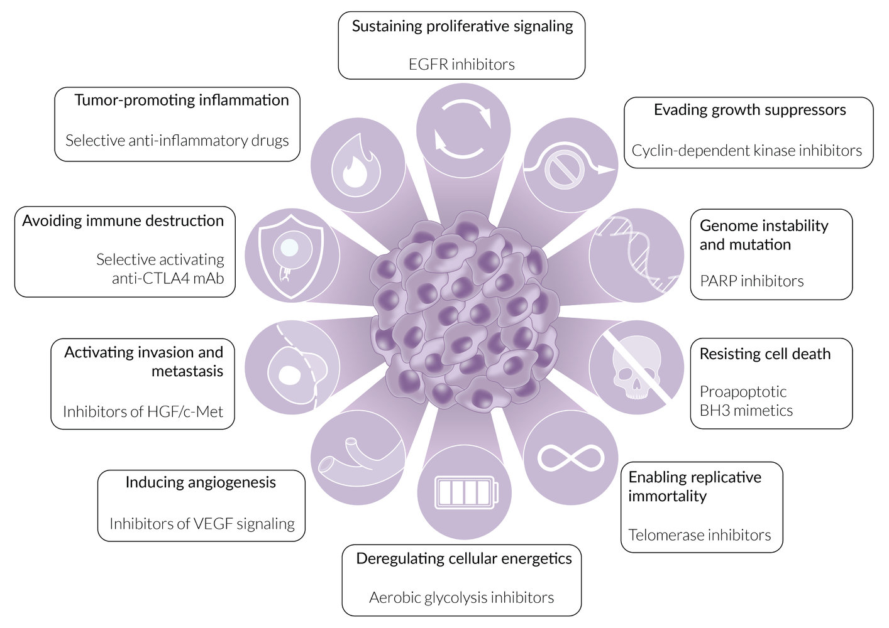

Cancer hallmarks and treatment options

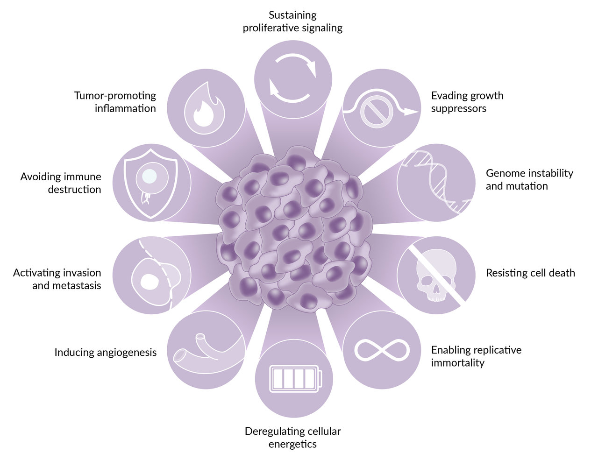

Cancer hallmarks

Philadelphia chromosome and pathophysiological consequences

Chronic myeloid leukemia: t(9;22)(q34;q11) Philadelphia chromosome

### Defense mechanisms of malignant cells [[7]](https://coursology-qbank.com/amboss/article/LYbwpH)

* <u>Immune response</u> modification

* ↓ <u>MHC class I</u> expression on malignant cells → inability of <u>cytotoxic T-cells</u> to recognize and mount an <u>immune response</u> against these cells

* Secretion of <u>immunosuppressive</u> molecules (e.g., <u>TGF-β</u>) → enhanced <u>immune tolerance</u> of malignant cells

* Enhanced regulatory <u>T-cell</u> activity → limited <u>immune response</u>

* <u>Immune checkpoints</u> [[8]](https://coursology-qbank.com/amboss/article/EmX8hA)

* Cytotoxic T-lymphocyte-associated protein 4 (<u>CTLA-4</u>)

* Upregulation of <u>CTLA-4</u> → promotion of binding to <u>B7 protein</u> (surface <u>receptor</u> on <u>antigen-presenting cells</u>, also called <u>CD80</u> or <u>CD86</u>) → <u>T-cell</u> inactivation and simultaneous reduction of costimulation by binding of <u>CD28</u> to <u>B7</u>

* <u>CTLA-4</u> is inhibited by anti-<u>CTLA-4</u> <u>antibody</u> <u>ipilimumab</u>.

* Programmed <u>death</u>-<u>ligand</u> system

* Expression of <u>programmed death-ligand 1</u> (<u>PD-L1</u>) and PD-L2 on <u>tumor</u> cells surface or environment → binding to programmed cell death protein 1 (<u>PD-1</u>) on <u>T-cells</u> → <u>T-cell</u> dysfunction

* <u>PD-L1</u> and <u>PD-L2</u> are inhibited by <u>cancer immunotherapy</u> agents <u>atezolizumab</u>, <u>durvalumab</u>, and <u>avelumab</u>.

* <u>PD-1</u> is inhibited by <u>cancer immunotherapy</u> agents <u>nivolumab</u> and <u>pembrolizumab</u>.

* Development of resistance to <u>chemotherapeutic agents</u>

* Expression of multidrug resistance protein 1 (<u>MDR1</u>; also called <u>P-glycoprotein</u>). [[9]](https://coursology-qbank.com/amboss/article/pYbLJH)

* P-glycoproteins are transmembrane <u>ATP</u>-dependent efflux pump <u>proteins</u> that decrease intracellular concentrations of <u>chemotherapeutics</u>.

* Expressed in <u>adrenocortical carcinoma</u> as well as cancers of the <u>colon</u>, <u>liver</u>, <u>pancreas</u>, <u>kidney</u>, <u>ovary</u>, and <u>breast</u>

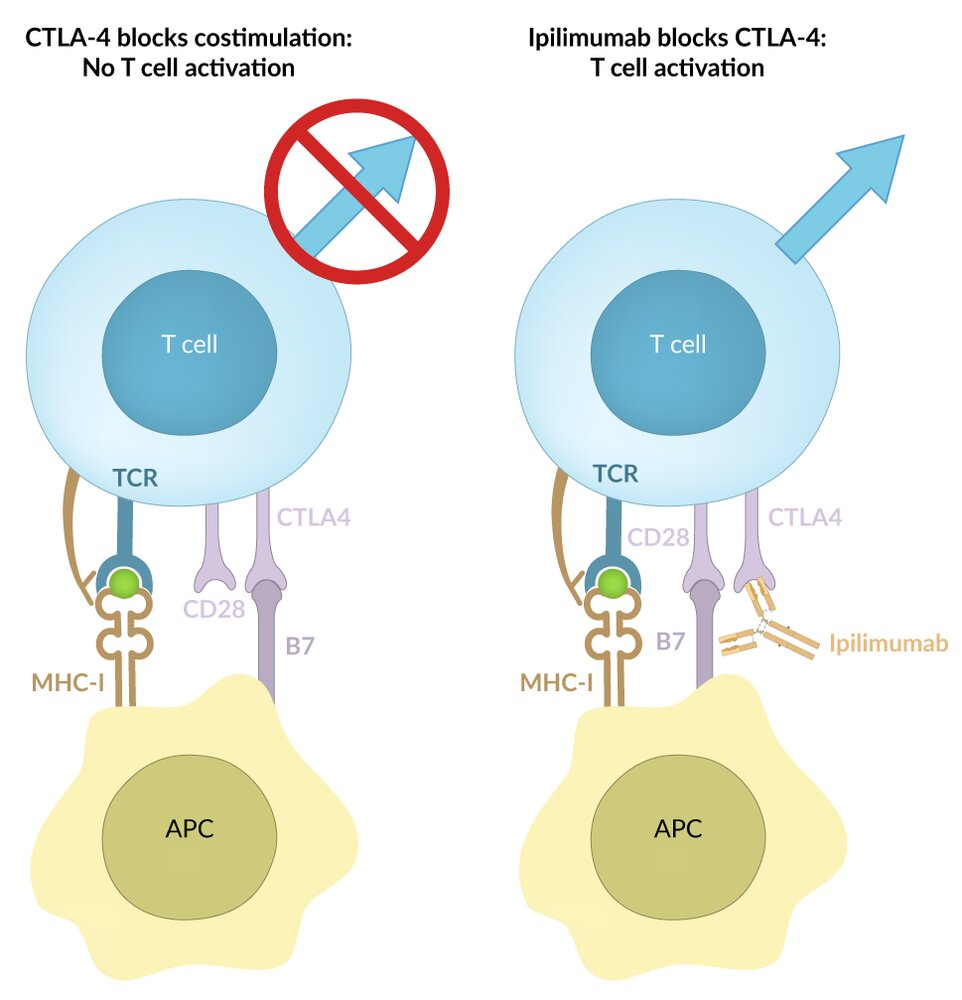

Target of anti-CTLA-4 antibodies

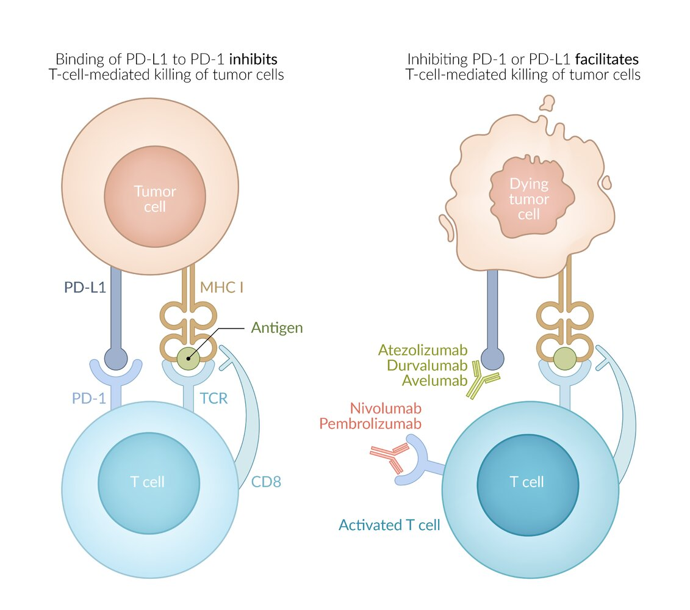

Anti-PD-1 antibodies

### Etiologic field cancerization [[10]](https://coursology-qbank.com/amboss/article/vBWAcL0)

* Definition: a collection of factors (e.g., lifestyle, environmental, microbial, genetic) and their interactions that affect tissues and potentially predispose individuals to the development of disease

* Pathophysiology: <u>carcinogenic</u> exposure → transformation of normal cells → wide area of premalignant cells at the primary site and adjacent areas

* Examples

* Interactions between the <u>immune system</u>, microbiome, and diet influence the development of <u>ulcerative colitis</u> and <u>colorectal cancer</u>.

* Prolonged exposure to <u>tobacco smoke</u>, <u>alcohol</u> consumption, and persistent <u>HPV infection</u> influence the development of <u>head and neck cancer</u>.

* Chronic sun exposure, UV radiation, and genetic predisposition influence the development of <u>skin</u> cancer.

* Exposure to industrial <u>carcinogens</u>, <u>chronic inflammation</u>, and genetic susceptibility influence the development of <u>bladder cancer</u>.

---

## Oncogene

* Oncogene: the product of a <u>gain-of-function mutation</u> in a <u>proto-oncogene</u> which leads to overexpression of signaling <u>proteins</u> and growth factors, and thus, uncontrolled cellular <u>proliferation</u> (e.g., <u>dysplasia</u>, <u>neoplasia</u>)

* Only one <u>allele</u> of the <u>proto-oncogene</u> requires damage to form an <u>oncogene</u>.

* Often present in cancer cells

* Proto-oncogene: <u>Genes</u> that encode <u>proteins</u> that are important in normal cell division and <u>cell differentiation</u>. Examples include:

* Protein <u>kinases</u>, e.g., protein kinase B (<u>PKB</u>)

* <u>PKB</u> activates and inhibits various substrates, regulates <u>apoptosis</u>, activates <u>translation</u> and, indirectly, cell division.

* <u>PKB</u> is activated by <u>phosphatidylinositide 3-kinase</u> (PI3K).

* <u>Ligand</u>-directed <u>transcription factors</u> (intracellular <u>hormone</u> <u>receptors</u>)

* <u>GTP-binding proteins</u>

* <u>G protein-coupled receptors</u>

* Small <u>G-proteins</u> such as <u>Ras</u>

* <u>Tyrosine kinase receptors</u>

* Growth factors and <u>cytokines</u>

|  Overview of proto-oncogenes [[11]](https://coursology-qbank.com/amboss/article/ymXdRA) |  |  |  |
| --- | --- | --- | --- |
| <u>Proto-oncogene</u> | <u>Chromosome</u> | <u>Gene</u> product | Associated malignancies |
| BRAF |  * 7q34   |  * <u>Serine</u>/<u>threonine</u> <u>kinase</u>   |   * <u>Melanoma</u>  * <u>Non-Hodgkin lymphoma</u>  * <u>Papillary thyroid carcinoma</u>  * <u>Hairy cell leukemia</u>    |
| BCR-ABL |  * t(9;22) (q34.1;q11.21), also known as <u>Philadelphia chromosome</u>   |  * <u>Non-receptor tyrosine kinase</u>   |   * <u>CML</u>: t(9;22)  * <u>ALL</u>    |
| JAK2 |  * 9p24.1   |  * <u>Chronic myeloproliferative disorders</u>   |  |
| <u>ERBB2</u> (<u>HER2/neu</u>) |  * 17q12   |  * <u>Receptor tyrosine kinase</u>   |   * <u>Breast cancer</u>  * <u>Gastric cancer</u>    |
| ALK |  * 2p23.2-p23.1   |  * <u>Lung adenocarcinoma</u>   |  |
| RET |  * 10q11.21   |   * <u>Papillary thyroid cancer</u>  * <u>Pheochromocytoma</u>  * <u>MEN 2A</u> and <u>MEN 2B</u>    |  |
| c-KIT |  * 4q12   |  * <u>Cytokine</u> <u>receptor</u>   |   * <u>Gastrointestinal stromal tumors</u>  * <u>Mastocytosis</u>    |
| L-myc-1 (<u>MYCL1</u>) |  * 1p34.2   |  * <u>Transcription factors</u>   |  * <u>Lung cancer</u> (<u>SCLC</u>)   |
| N-myc (<u>MYCN</u>) |  * 2p24.3   |  * <u>Neuroblastoma</u>   |  |
| c-myc |  * 8q24.21   |  * <u>Burkitt lymphoma</u>: t(8;14)   |  |
| KRAS |  * 12p12.1   |  * <u>GTPase</u>   |   * <u>Colorectal cancer</u>  * <u>Lung cancer</u>  * <u>Pancreatic cancer</u>    |
| BCL-2 |  * 18q21.33   |  * Antiapoptotic molecule   |   * <u>Follicular lymphoma</u>: t(14;18)  * <u>Diffuse large B cell lymphoma</u>    |
| CDK4 |  * 12q14.1   |  * <u>Cyclin-dependent kinase</u>   |   * <u>Liposarcoma</u> [[12]](https://coursology-qbank.com/amboss/article/K5XUOA)  * <u>Melanoma</u> [[13]](https://coursology-qbank.com/amboss/article/65XjOA)  * <u>Glioblastoma multiforme</u> (<u>GBM</u>)    |
| CCND1 |  * 11q13.3   |  * <u>Cyclin D</u> (<u>regulatory protein</u> of <u>the cell cycle</u>)   |  * <u>Mantle cell lymphoma</u>: t(11;14)   |
| ERBB1 |  * 7p11.2   |  * <u>Epidermal growth factor receptor</u>   |  * <u>NSCLC</u>   |

> [!NOTE]
> “Adenocarcinoma of Lung Kinase”: Cancer (adenocarcinoma of lung) and the <u>gene</u> product (<u>tyrosine</u> kinase) are associated with <u>ALK</u> mutations.

> [!NOTE]
> L-myc is associated with lung cancer and n-myc with neuroblastoma.

> [!NOTE]
> <u>c-KIT</u> mutations affect Cyto<u>KI</u>ne recepTor production.

> [!NOTE]
> <u>BCL-2</u> mutations are associated with diffuse large B-cell lymphoma.

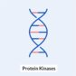

Protein Kinases: Cell Signaling and Phosphorylation

---

## Tumor suppressor genes

* Tumor suppressor gene: a <u>gene</u> that normally controls and suppresses cell <u>proliferation</u>

* Loss of function or inactivation leads to an increased risk of developing cancer.

* Both <u>alleles</u> must be mutated in order for complete loss of function of the <u>gene</u>.

| Overview of tumor suppressor genes |  |  |  |
| --- | --- | --- | --- |
| <u>Gene</u> | <u>Chromosome</u> | <u>Gene</u> product | Associated <u>malignancy</u> |
| TP53 |  * 17p13.1   |  * <u>p53 protein</u>  * Causes cell <u>apoptosis</u>   * Activates proapoptotic <u>genes</u> (e.g., BAX)  * Causes <u>cell cycle</u> arrest at the <u>G1 phase</u> (by activating <u>p21</u>)  * Inhibits entry in the <u>S phase</u> via inhibition of <u>pRb</u> <u>phosphorylation</u>   |   * Most human cancers  * <u>Li-Fraumeni syndrome</u>    |
| Rb |  * 13q14.2   |  * Retinoblastoma protein (<u>Rb protein</u>): causes <u>cell cycle</u> arrest at the <u>G1 phase</u> by inhibiting <u>E2F</u> <u>transcription factor</u>   |   * <u>Retinoblastoma</u>  * <u>Osteosarcoma</u>    |
| CDKN2A |  * 9p21.3   |  * p16 protein, which normally causes <u>cell cycle</u> arrest at the <u>G1 phase</u>   |   * <u>Melanoma</u>  * <u>Pancreatic cancer</u>  * <u>Lung cancer</u>    |
| APC gene |  * 5q22.2   |  * A protein that prevents unregulated cell <u>proliferation</u> by inhibiting <u>β-catenin</u> synthesis → inhibition of the <u>β-catenin</u>/<u>Wnt pathway</u>   |   * <u>Familial adenomatous polyposis</u> (associated with <u>colorectal cancer</u>)  * Sporadic <u>colorectal cancer</u>    |
|  PTEN [[14]](https://coursology-qbank.com/amboss/article/oYb0JH) |  * 10q23   |  * Negatively regulates the PI3k/AKT pathway   |   * <u>Breast cancer</u>  * <u>Prostate cancer</u>  * <u>Endometrial cancer</u>  * <u>Cowden syndrome</u>    |
| <u>BRCA1</u> |  * 17q21.31   |  * <u>DNA repair</u> protein   |   * <u>Breast cancer</u>  * <u>Ovarian cancer</u>  * <u>Pancreatic cancer</u>    |
| <u>BRCA2</u> |  * 13q13.1   |  |  |
|  MMR gene family  |  * Varies depending on the mutated protein   |  * <u>DNA repair</u> <u>proteins</u>   |  * <u>Lynch syndrome</u>   |
|  DCC (Deleted in colorectal cancer) |  * 18q21.2   |  * Transmembrane <u>receptor</u> involved in cell <u>apoptosis</u>   |  * <u>Colorectal cancer</u>   |
|  SMAD4 (<u>DPC4</u>) (Deleted in pancreatic cancer) |  * 18q21.2   |  * A <u>DNA</u> binding protein involved in <u>signal transduction</u> from <u>TGF-β</u> <u>receptors</u>   |  * <u>Pancreatic cancer</u>   |
| MEN 1 |  * 11q13.1   |  * <u>Menin</u>   |  * <u>MEN 1</u>   |
| <u>NF1</u> |  * 17q11.2   |  * <u>Neurofibromin</u> (<u>Ras</u> <u>GTPase</u>-activating protein)   |  * <u>Neurofibromatosis type 1</u>   |
| <u>NF2</u> |  * 22q12.2   |  * Merlin (schwannomin)   |  * <u>Neurofibromatosis type 2</u>   |
|  <u>TSC1</u> (Tuberous sclerosis complex 1) |  * 9q34.13   |  * <u>Hamartin protein</u>   |  * <u>Tuberous sclerosis</u>   |
|  <u>TSC2</u> (Tuberous sclerosis complex 2) |  * 16p13.3   |  * <u>Tuberin protein</u>   |  |
| <u>VHL</u> |  * 3p25.3   |  * Protein involved in the degradation of <u>hypoxia-inducible factor 1a</u>   |  * <u>Von Hippel Lindau disease</u>   |
|  WT1 (Wilms Tumor 1) |  * 11p13   |  * <u>Transcription factor</u> that regulates urogenital development   |  * <u>Nephroblastoma</u> (<u>Wilms tumor</u>)   |
|  WT2 (Wilms Tumor 2) |  * 11p15.5   |  |  |

> [!NOTE]
> Mutations of the Rb (<u>retinoblastoma</u>) <u>gene mutations</u> cause Retinoblastomas and bone cancer (<u>osteosarcoma</u>).

> [!NOTE]
> <u>PTEN</u> mutation is associated with cancers of the Prostate, breasT, and ENdometrium.

> [!NOTE]
> Mutations in <u>MEN 1</u> affect its <u>gene</u> product: MENin.

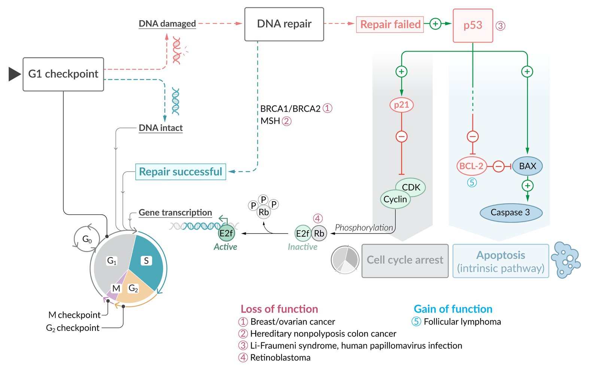

Cell cycle regulation

---

## Carcinogens

### Chemical <u>carcinogens</u>

| Examples of chemical <u>carcinogens</u> |  |  |
| --- | --- | --- |
| Substance | Sources of exposure | <u>Malignancy</u> |
| <u>Aflatoxin</u> |  * Stored nuts and grains (<u>Aspergillus</u> flavus growth)   |  * <u>Hepatocellular carcinoma</u> (<u>HCC</u>)   |
| <u>Alkylating agents</u> |  * <u>Chemotherapeutic agents</u> (e.g., <u>cyclophosphamide</u>, <u>melphalan</u>, <u>busulfan</u>, <u>carmustine</u>)   |   * <u>Leukemia</u>  * <u>Lymphoma</u>    |
|  <u>Aromatic amines</u> (β-naphthylamine, <u>benzidine</u>) |   * <u>Tobacco smoke</u>  * Dyes (<u>occupational exposure</u> in the textile industry)  * Rubber    |  * <u>Bladder cancer</u> (<u>transitional cell carcinoma</u>)   |
| <u>Arsenic</u> |   * Contaminated groundwater (esp. in developing countries)  * Pesticides, herbicides (e.g., vineyard workers)  * Metal smelting    |   * <u>Lung cancer</u>  * <u>Squamous cell carcinoma</u>  * <u>Hepatic angiosarcomas</u>    |
| Asbestos |   * Insulation material (formerly used in construction and shipbuilding)  * <u>Asbestos</u> cement (fibrolite), roofing, and siding    |   * <u>Lung cancer</u> (<u>bronchogenic carcinoma</u>)  * <u>Mesothelioma</u>  * The risk of developing <u>bronchogenic carcinoma</u> is greater than that of developing <u>mesothelioma</u>.    |
| <u>Benzene</u>, benzol |   * Gasoline  * <u>Cigarette smoke</u>    |   * <u>Acute leukemia</u>  * <u>Non-Hodgkin lymphoma</u>    |
| <u>Beryllium</u> |   * Occupations that involve <u>beryllium</u> production and processing, esp.: [[15]](https://coursology-qbank.com/amboss/article/AmXRRA)[[16]](https://coursology-qbank.com/amboss/article/_mX5RA)  * Smelting and founding  * Welding  * Manufacturing  * Industrial ceramics  * Electronics  * Automotive, aerospace, and defense components  * Dental supplies and prostheses  * See also “<u>Beryllium</u>” in “<u>Rare pneumoconioses</u>”.    |  * <u>Lung cancer</u>   |
| <u>Chromium</u> |  * Significant in workers exposed to:  * Galvanization (chrome plating)  * Paint and glass manufacturing  * Tanning leather  * Building materials   |  |
| Cigarette smoke |   * First-hand smoke: smoke inhaled by the smoker  * Second-hand smoke: exhaled smoke that is inhaled by others in the vicinity of the smoker  * Third-hand smoke: smoke particles that adhere to surfaces in the surroundings of the smoker  * All three have been proven to be <u>carcinogenic</u>.    |   * Transitional cell <u>carcinoma of the bladder</u>  * <u>Squamous cell carcinoma</u> (<u>cervix</u>, <u>oropharynx</u>, <u>esophagus</u>, <u>larynx</u>, <u>lung</u>)  * <u>Small cell lung cancer</u>  * <u>Pancreatic adenocarcinoma</u>  * <u>Adenocarcinoma of the esophagus</u>  * <u>Renal cell carcinoma</u>    |
| Ethanol |  * Alcoholic beverages   |   * <u>Squamous cell carcinoma of the esophagus</u>  * <u>Hepatocellular carcinoma</u> (<u>HCC</u>)    |
| <u>Nickel</u> |  * Occupations that involve mining, smelting, welding, and <u>casting</u> of alloys (e.g., in coins, jewelry)   |  * <u>Lung cancer</u>   |
| <u>Nitrosamines</u> |   * Cured meats (e.g. bacon) and fish  * Cold-smoked foods  * Tobacco [[17]](https://coursology-qbank.com/amboss/article/-mXDRA)    |  * <u>Gastric cancer</u>   |
|  <u>Radon</u>  |   * Accumulation in basements  * Uranium mining (extraction of uranium ore from the ground): miners are exposed to <u>radon</u> gas, which is emitted during natural radioactive decay of uranium ore    |  * <u>Lung cancer</u>: <u>Radon</u> is the second most common cause following exposure to <u>cigarette smoke</u>. [[18]](https://coursology-qbank.com/amboss/article/KYbUJH)   |
| Silica |   * Occupations that involve cutting, drilling, chipping, or grinding crystalline silica (e.g., quartz) or materials that contain it (e.g., sand, granite), esp.: [[19]](https://coursology-qbank.com/amboss/article/zmXrRA)  * Sandblasting  * Glass manufacturing  * Construction work  * See also “Etiology” in “<u>Silicosis</u>.”    |  * <u>Lung cancer</u>   |
| <u>Vinyl chloride</u> |  * Production of <u>polyvinyl chloride</u> (<u>PVC</u>) and <u>PVC</u>-related manufacturing (e.g., of <u>PVC</u> pipes, cables)   |   * <u>Lung cancer</u>  * <u>Hepatocellular carcinoma</u>  * <u>Glioblastoma</u>  * <u>Angiosarcoma</u>    |
| Wood dust |  * Woodworking (e.g., sawing, drilling, sanding)   |  * <u>Adenocarcinoma</u> of the nose and <u>paranasal sinuses</u>   |

### Radiation

| Overview of radiation |  |  |
| --- | --- | --- |
| Type | Occurrence | <u>Malignancy</u> |
| Nonionizing radiation |  * UV-B   |  * <u>Skin</u> cancers   |
| Ionizing radiation |   * <u>X-rays</u>  * Gamma rays    |   * <u>Leukemias</u> (especially <u>AML</u> and <u>CML</u>)  * <u>Papillary thyroid cancer</u>  * <u>Osteosarcoma</u>  * <u>Liver angiosarcoma</u>    |

### Oncogenic infections

| Infective agent | Associated malignancies |
| --- | --- |
| <u>DNA viruses</u> |  |
|  <u>EBV</u>  |   * <u>Burkitt lymphoma</u>  * <u>Hodgkin lymphoma</u>  * <u>Nasopharyngeal carcinoma</u>  * <u>Oral hairy leukoplakia</u>  * <u>Primary CNS lymphoma</u> in <u>immunocompromised</u> patients  * <u>Gastric carcinoma</u>    |
| <u>HBV</u> |  * <u>Hepatocellular carcinoma</u>   |
| <u>HHV-8</u> |  * <u>Kaposi sarcoma</u>   |
| <u>HPV 16</u> |   * <u>E6</u> <u>gene</u> product inhibits <u>TP53</u> <u>gene</u>, <u>E7</u> <u>gene</u> product inhibits RB1 <u>gene</u>  * <u>Squamous cell carcinoma</u> of the <u>vulva</u>, <u>vagina</u>, <u>cervix</u>, <u>anus</u>, <u>penis</u>, <u>oropharynx</u>, <u>larynx</u>    |
| <u>HPV 18</u> |  |
| <u>RNA viruses</u> |  |
|  <u>HTLV</u>-1  |  * <u>Adult T-cell leukemia</u>   |
| <u>HCV</u> |  * <u>Hepatocellular carcinoma</u>   |
| Nonviral pathogens |  |
| <u>Schistosoma haematobium</u> |  * Squamous cell <u>carcinoma of the bladder</u>   |
|  <u>Clonorchis sinensis</u> (Chinese <u>liver</u> <u>fluke</u>) |  * <u>Cholangiocarcinoma</u>   |
| <u>H. pylori</u> |   * <u>Gastric adenocarcinoma</u>  * <u>MALT lymphoma</u>    |
| <u>Streptococcus bovis</u> |  * <u>Colorectal cancer</u>   |

---

## Grading and staging

### Tumor grading

* Definition: the process of classifying tumors based on their histological appearance (degree of cell differentiation)

* Indicators of poor differentiation

* High-<u>proliferation</u> index

* Presence of nucleoli

* <u>Giant cells</u> with multiple <u>nuclei</u>

* Hyperchromasia and heterogeneous <u>chromatin</u> distribution

* Abnormal shape of cell or <u>nucleus</u> (nuclear atypia, enlarged nucleoli)

* Different cell polarity

* Different orientation of <u>nuclei</u> belonging to the same group of cells

* Increase in <u>mitotic figures</u>

* <u>Anaplasia</u>: loss of morphological features of malignant cells so that resemblance to normal cells of a particular tissue where <u>tumor</u> cell originated from is lost

#### Grading systems

* AJCC grading system

* Most commonly used grading system for nonhematological malignancies

* Can be applied to a wide range of tumors

* Usually, higher-grade tumors are more aggressive than lower-grade tumors.

| Grading | Differentiation of malignant tissue |
| --- | --- |
| G1 |  Well differentiated (low grade)   |
| G2 | Moderately differentiated (intermediate grade) |
| G3 | Poorly differentiated (high grade) |
| G4 |  Undifferentiated/<u>anaplastic</u> (high grade)   |
| GX | Differentiation cannot be assessed. |

* Cancer-specific grading systems

* <u>Gleason score</u> for <u>prostate cancer</u>

* Nottingham grading system for <u>breast cancer</u>

Gleason grading system

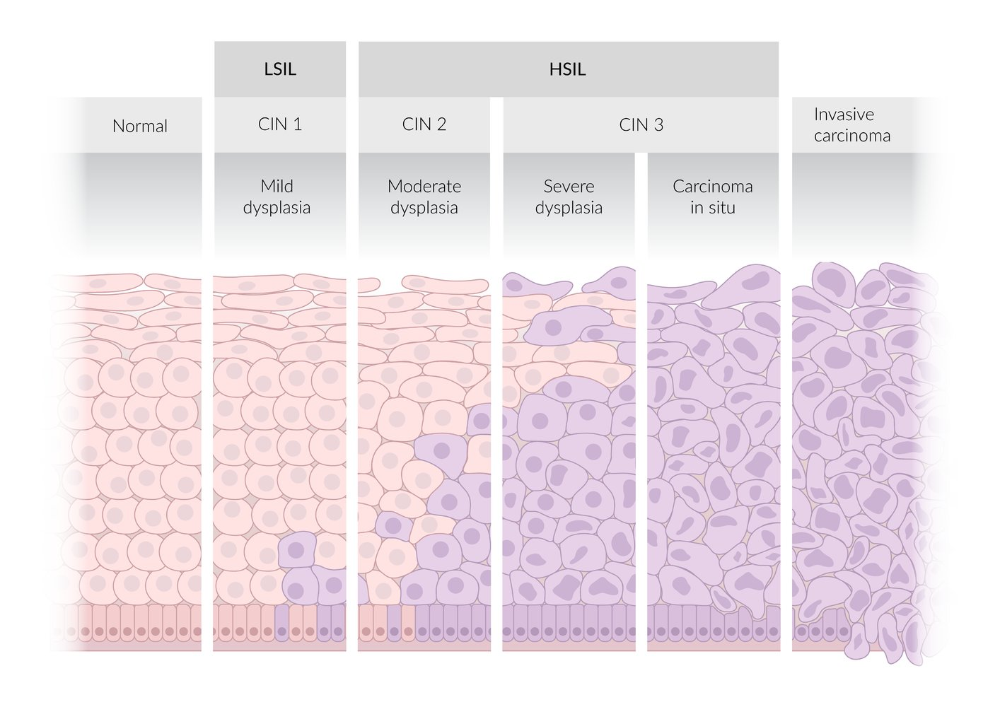

Histopathological grades of cervical cancer

### Tumor staging [[20]](https://coursology-qbank.com/amboss/article/qYbCJH)

* Definition: a method of determining and classifying a <u>tumor</u> according to its spread throughout the body

* Prognosis: The stage of the <u>tumor</u> is typically more important than the grade in determining the prognosis.

> [!NOTE]
> Spread determines Stage, and Stage determines Survival more than grade.

#### <u>TNM classification</u>

* T stage: size or direct extent of the primary <u>tumor</u>  

* Tcis: <u>carcinoma in situ</u> (no <u>basement membrane</u> penetration and no infiltration of <u>submucosa</u>)

* T1–4 based on the size and/or extent of the primary <u>tumor</u> (T4 refers to the infiltration of neighboring organs)

* N stage: involvement of regional <u>lymph</u> nodes

* N0: no <u>lymph node</u> involvement

* N1–3 based on type of <u>tumor</u> and <u>lymph node</u> involvement

* M stage: presence of distant <u>metastasis</u>

* M0: no distant <u>metastasis</u>

* M1: present distant <u>metastasis</u>

* Mx: unknown if distant <u>metastasis</u> present or not

* By adding a "C" to any category, it is possible to express the certainty of the diagnosis:

* C1: routine procedure (<u>clinical examination</u>, <u>x-ray</u>)

* C2: special procedure (e.g. <u>ERCP</u>, CT)

* C3: based on <u>biopsy</u>, <u>cytology</u> or surgical exploration

* C4: based on <u>surgery</u> and additional histopathological workup

* C5: based on <u>autopsy</u> and histopathological workup

* By adding a prefix to <u>TNM</u> it is possible to indicate additional diagnostic or clinical information:

* cTNM: staging based on clinical criteria

* pTNM: histopathological staging

> [!TIP]
> T, N, and M have independent prognostic values. N and M are typically the most important determinants of prognosis.

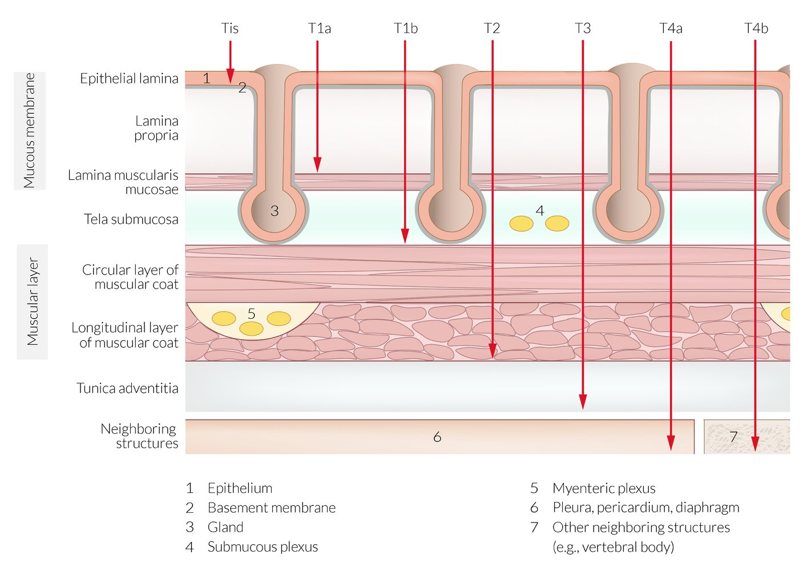

Esophageal cancer

#### AJCC staging system

* Stage 0 (<u>carcinoma</u>-in-situ)

* Stage I–III: <u>Tumor</u> spread into nearby tissues.

* Stage IV: <u>Tumor</u> spread to distant parts of the body.

#### Cancer-specific staging systems

* <u>Lugano staging system</u> for <u>lymphomas</u>

---

## Metastasis

### Definition

* Metastasis: the spread of malignant cells to distant organs, tissues (e.g., <u>colorectal cancer</u> spreads to the <u>liver</u>)

### Types of <u>metastasis</u> [[21]](https://coursology-qbank.com/amboss/article/p30Ljf)

* Lymphatic metastasis

* Dissemination of malignant cells via lymphatic vessels and <u>lymph nodes</u>

* Most common route of <u>metastasis</u> for most <u>carcinomas</u>

* Hematogenous metastasis

* Dissemination of malignant cells via <u>blood vessels</u>

* Venous dissemination is more common than arterial dissemination because thin <u>vein</u> walls facilitate invasion.

* Most common route of <u>metastasis</u> for most <u>sarcomas</u>

* Seeding (oncology): spillage of malignant cells to neighboring structures → implants at a site adjacent to the primary <u>tumor</u> and subsequent growth (e.g., after a <u>biopsy</u> of cancer the cancer cells spill and implant along the <u>biopsy</u> canal)

* Transcoelomic metastasis: spread of malignant cells into body cavities by penetration of surfaces such as the <u>pleura</u>, <u>pericardium</u>, and <u>peritoneum</u> (e.g., <u>ovarian cancer</u> spread to the <u>liver</u> via the <u>peritoneal cavity</u>)

* Canalicular metastasis: spread of malignant cells via canalicular system (e.g. <u>bile</u> ducts, <u>lactiferous ducts</u>, <u>urinary tract</u>, and the <u>subarachnoid space</u>)

* Cavitating pulmonary metastasis [[22]](https://coursology-qbank.com/amboss/article/m5XVkA)[[23]](https://coursology-qbank.com/amboss/article/55XikA)

* Spread of malignant cells that form cavitary lesions in the <u>lungs</u> (e.g., gastrointestinal <u>adenocarcinomas</u>, <u>renal cell carcinoma</u>)

* Cavitary lesions are most commonly caused by <u>squamous cell carcinoma</u> (e.g., <u>lung</u>, head, and neck cancer)

* Cystic pulmonary metastasis: spread of malignant cells that form cystic lesions (contain a thin wall) in the <u>lungs</u> (e.g., <u>colorectal cancer</u>, <u>soft tissue sarcomas</u>, <u>transitional cell carcinoma</u>) [[24]](https://coursology-qbank.com/amboss/article/M5XMkA)[[25]](https://coursology-qbank.com/amboss/article/n5X7kA)

> [!NOTE]
> “Four Carcinomas Route Hematogenously”: Follicular <u>thyroid carcinoma</u>, Choriocarcinoma, Renal cell <u>carcinoma</u>, and Hepatocellular <u>carcinoma</u> spread via the blood, compared to most <u>carcinomas</u> which spread lymphatically.

Peritoneal carcinomatosis

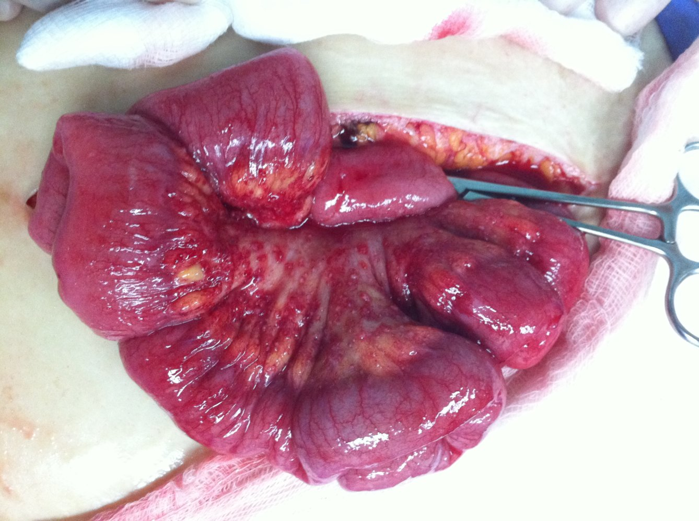

Peritoneal carcinomatosis

### Mechanisms of <u>metastasis</u>

* Complex genetic changes are responsible for the selection of <u>tumor</u> subclones that are capable of <u>metastasis</u>.

* All <u>metastases</u> can be understood as arising from a two-part process: invasion of local extracellular tissue and dissemination and <u>colonization</u>.

* Invasion of extracellular tissue: loss of adhesion to the <u>basement membrane</u> → invasion through <u>basement membrane</u> → passage through extracellular tissue

* Loss of <u>E-cadherin</u> expression is associated with <u>tumor</u> <u>metastatic</u> potential.

* Overproduction of <u>proteases</u> such as <u>collagenase</u> and <u>matrix metalloproteinases</u> degrade the <u>basement membrane</u> and <u>interstitial</u> matrix. <u>Neoplastic</u> cells encounter various <u>chemotactic</u> and angiogenic factors in the newly exposed <u>extracellular matrix</u>.

* <u>Autocrine signaling</u> via <u>tumor</u>-produced <u>cytokines</u> and <u>paracrine signaling</u> by cleaved matrix components and extracellular growth factors stimulate <u>tumor</u> cell locomotion towards vasculature or <u>lymphatics</u>.

* Dissemination and <u>colonization</u>: encountering vascular or lymphatic routes → evasion of host defenses → implantation with distant tissue

* Host defenses destroy the majority of circulating cancer cells. Mechanisms to avoid this include <u>tumor</u> cell aggregation, formation of <u>platelet</u>-<u>tumor</u> complexes, and binding of active <u>coagulation factors</u> to form malignant <u>emboli</u>.

* Disruption of cellular adhesion molecules (<u>laminins</u>, <u>cadherins</u>) enables extravasation at distant tissues.

### Common sites for cancer <u>metastasis</u> [[26]](https://coursology-qbank.com/amboss/article/6YbjJH)

* The target organ for <u>metastasis</u> is usually the first <u>capillary bed</u> encountered by the <u>neoplastic</u> cells during spread.

* Certain types of cancer have a tendency to spread to particular organs (organ tropism; e.g., <u>prostate cancer</u> to bone, <u>lung cancer</u> to <u>adrenal glands</u>)

|  Common origins of cancer metastases   |  |  |
| --- | --- | --- |
| Organ with <u>metastasis</u> | Associated features | Primary <u>tumor</u> location |
|  <u>Liver</u>    |   * Second most common site of <u>metastasis</u> (following regional <u>lymph nodes</u>)  * Usually distributed throughout the <u>liver</u> <u>parenchyma</u>    |   * <u>Colon</u>  * <u>Breast</u>  * <u>Stomach</u>  * <u>Esophagus</u>  * <u>Pancreas</u>  * <u>Lung</u>  * <u>Kidney</u>    |
| Bone |   * Most bone tumors result from <u>metastases</u>.  * Usually involve the <u>axial skeleton</u> (e.g., <u>vertebral column</u>, <u>pelvic girdle</u>)  * <u>Types of bone</u> lesions  * Lytic : <u>NSCLC</u>, <u>kidney</u>, <u>multiple myeloma</u>, <u>thyroid</u>  * Blastic : <u>prostate</u>, <u>SCLC</u>  * Mixed: <u>breast</u>  * For more information on <u>bone metastasis</u>, see “<u>Bone metastases</u>.”    |   * <u>Prostate</u>  * <u>Breast</u>  * <u>Thyroid</u>  * <u>Lung</u>  * <u>Kidney</u>  * <u>Skin</u> (e.g., <u>melanoma</u>)  * <u>Lung</u>  * <u>Multiple myeloma</u>    |
|  <u>Brain</u>    |   * Approximately 50% of <u>brain tumors</u> result from <u>metastases</u>.  * Appear in the white-gray matter junction as multiple well-circumscribed lesions    |   * <u>Lung</u>  * <u>Breast</u>  * <u>Skin</u> (e.g., <u>melanoma</u>)  * <u>Colon</u>  * <u>Kidney</u>    |
| <u>Lungs</u> |   * Most commonly multiple pulmonary <u>nodules</u>  * Usually involves both <u>lungs</u>    |   * <u>Breast</u>  * <u>Colon</u>  * <u>Kidney</u>  * <u>Prostate</u>  * <u>Bladder</u>  * <u>Skin</u> (e.g., <u>melanoma</u>)  * Head and neck    |

> [!TIP]
> Approximately 50% of <u>brain tumors</u> and most bone tumors are not primary tumors but rather result from <u>metastases</u>.

> [!NOTE]
> “Cancers spread progressively to the <u>liver</u>”: Colon, Stomach, and Pancreas cancers <u>metastasize</u> to the <u>liver</u>.

> [!NOTE]
> “<u>BLT</u> with a kosher pickle and mayo on the bun”: Breast, Lung, Thyroid, Kidney, Prostate cancers, and Multiple myeloma <u>metastasize</u> to the bone.

Most common routes of metastasis with TNM classification

Liver metastases from pancreatic neuroendocrine tumor

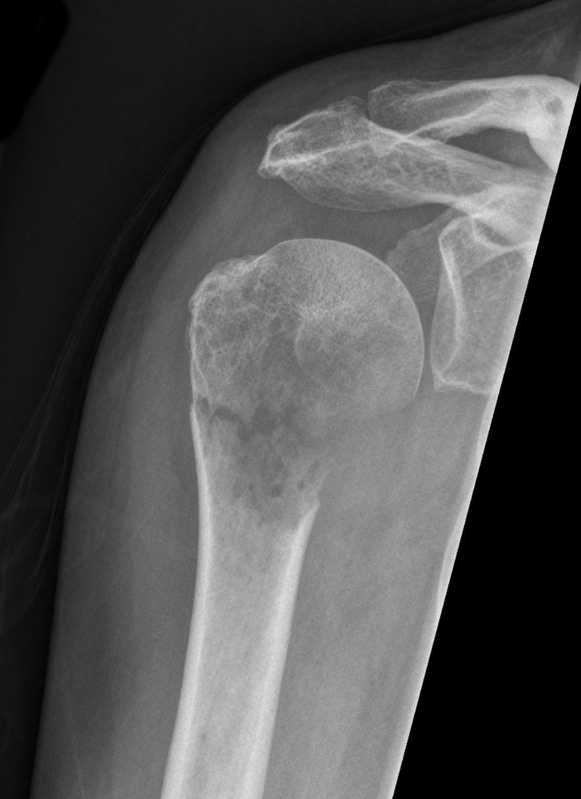

Pathologic fracture

Metastasis in bronchial carcinoma

Osteolytic metastasis

Cerebral metastases

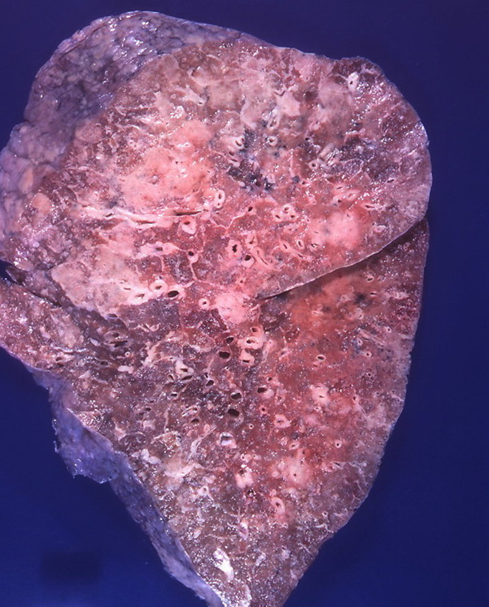

Lung metastases

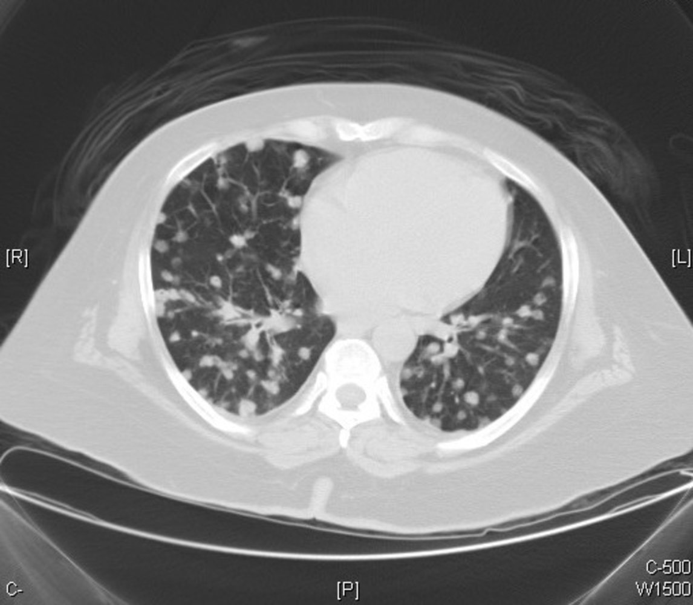

Small pulmonary nodules

Pulmonary nodules

---

## Conditions associated with tumors

### <u>Neurocutaneous syndromes associated with neoplasms</u>

| Overview of neurocutaneous syndromes associated with neoplasms |  |  |  |  |  |
| --- | --- | --- | --- | --- | --- |
| Condition |  | Key features |  | <u>Neoplasms</u> |  |
| <u>Neurofibromatosis type I</u> |  |  * <u>Cafe au lait spots</u>   |   * Axillary/inguinal freckling  * <u>Lisch nodules</u>    |   * Multiple <u>neurofibromas</u>  * <u>Optic glioma</u>  * <u>Pheochromocytoma</u>    |  |
| <u>Neurofibromatosis type II</u> |  |  * Bilateral <u>cataracts</u>   |   * Bilateral <u>vestibular schwannoma</u>  * <u>Meningioma</u>  * <u>Ependymoma</u>    |  |  |
| <u>Tuberous sclerosis</u> |  |   * <u>Ash leaf spots</u>   , <u>shagreen patch</u>   , <u>adenoma sebaceum</u>  * <u>Infantile spasms</u>, <u>intellectual disability</u>    |  |   * <u>Giant cell astrocytoma</u>  * Cardiac <u>rhabdomyoma</u>  * Renal <u>angiomyolipoma</u>    |  |
| <u>von Hippel-Lindau syndrome</u> |  |  * Renal and <u>pancreatic cysts</u>   |  |   * Retinal and <u>CNS</u> <u>hemangioblastoma</u>  * Bilateral <u>renal cell carcinoma</u>  * <u>Pheochromocytoma</u>    |  |
| <u>Sturge-Weber syndrome</u> |  |   * <u>Port-wine stain</u>  * <u>Seizures</u>, <u>intellectual disability</u>    |  |  * <u>Leptomeningeal angioma</u>   |  |
| <u>Ataxia telangiectasia</u> |  |   * <u>Spider angioma</u>  * Ocular teleangiectasia, <u>cerebellar ataxia</u>    |  |   * <u>Lymphoma</u>  * <u>Leukemia</u>  * <u>Gastric carcinoma</u>    |  |

### <u>Gastrointestinal conditions associated with neoplasms</u>

| Overview of gastrointestinal conditions associated with neoplasms |  |  |  |  |  |
| --- | --- | --- | --- | --- | --- |
| Condition |  | Key features |  | <u>Neoplasms</u> |  |
| <u>Inflammatory bowel disease</u> | <u>Ulcerative colitis</u> |  * See “<u>Crohn disease and ulcerative colitis</u>” for details.   |  |   * <u>Cholangiocarcinoma</u>  * <u>Colorectal cancer</u>    |  |
| <u>Crohn disease</u> |   * <u>Small intestine</u>, <u>colon</u>  * <u>Non-Hodgkin lymphoma</u>    |  |  |  |  |
| <u>Plummer-Vinson syndrome</u> |  |  * <u>Iron deficiency anemia</u>, postcricoid <u>dysphagia</u>, and upper esophageal webs   |  |  * <u>Esophageal squamous cell carcinoma</u>   |  |
| <u>Barrett esophagus</u> |  |  * Esophageal <u>squamous epithelium</u> is replaced by <u>columnar epithelium</u> and <u>goblet cells</u> (<u>intestinal metaplasia</u>) due to longterm <u>reflux esophagitis</u>   |  |  * <u>Esophageal adenocarcinoma</u>   |  |
| <u>Atrophic gastritis</u> | <u>Autoimmune atrophic gastritis</u> (<u>AIG</u>) |  * Autoimmune destruction of the <u>parietal cells</u> → <u>achlorhydria</u> → ↑ release of <u>gastrin</u> → <u>hyperplasia</u> of <u>enterochromaffin-like cells</u> → ↑ risk of <u>neuroendocrine tumors</u>   |  |  * <u>Gastric adenocarcinoma</u>   |   * Gastric <u>neuroendocrine tumors</u>  * <u>Esophageal squamous cell carcinoma</u>    |
| <u>Environmental metaplastic atrophic gastritis</u> (<u>EMAG</u>) |  * <u>Colonization</u> by <u>H. pylori</u> → local destruction of <u>mucosa</u> → ↓ production of mucins and <u>atrophy</u> of the gastric glands → <u>hypergastrinemia</u> and <u>epithelial</u> <u>dysplasia</u> → <u>epithelial</u> <u>metaplasia</u> → ↑ risk of <u>gastric cancers</u>   |  |  * Gastric <u>MALT lymphoma</u>   |  |  |
| <u>Liver cirrhosis</u> |  |  * Chronic damage to the <u>liver</u>, most commonly due to <u>excessive alcohol consumption</u> → hepatic <u>parenchymal</u> <u>necrosis</u> and inflammation → <u>fibrosis</u> and abnormal tissue architecture → ↓ <u>liver</u> function   |  |  * <u>Hepatocellular carcinoma</u>   |  |

### Infectious <u>conditions associated with neoplasms</u>

| Overview of infectious conditions associated with neoplasms |  |  |  |  |  |
| --- | --- | --- | --- | --- | --- |
| Condition |  | Key features |  | <u>Neoplasms</u> |  |
| <u>DNA virus</u> infections | <u>EBV infection</u> |   * Acute infection: <u>fever</u>, <u>malaise</u>, and fatigue, followed by <u>acute pharyngitis</u>, <u>tonsillitis</u>, <u>lymphadenopathy</u>, and/or <u>splenomegaly</u> lasting up to a month  * Oncogenic potential; higher risk for <u>immunocompromised individuals</u> (e.g., <u>HIV infection</u>/<u>AIDS</u>)    |  |   * <u>Burkitt lymphoma</u>  * <u>Hodgkin lymphoma</u>  * <u>Nasopharyngeal carcinoma</u>  * <u>Oral hairy leukoplakia</u>  * <u>Primary CNS lymphoma</u> in <u>immunocompromised</u> patients  * <u>Gastric carcinoma</u>    |  |
| <u>HBV infection</u> |   * Acute or <u>chronic inflammation</u> of the <u>liver</u> after an <u>incubation period</u> of 1–6 months  * Can rarely cause <u>acute liver failure</u>    |  |  * <u>Hepatocellular carcinoma</u>   |  |  |
| <u>HHV-8</u> infection |  * Infects <u>endothelial</u> cells causing malignant, multifocal, highly vascularized tumors   |  |  * <u>Kaposi sarcoma</u>   |  |  |
| <u>HPV 16</u> |  * <u>E6</u> <u>gene</u> product inhibits <u>TP53</u> <u>gene</u>, <u>E7</u> <u>gene</u> product inhibits RB1 <u>gene</u>   |  |  * <u>Squamous cell carcinoma</u> of the <u>vulva</u>, <u>vagina</u>, <u>cervix</u>, <u>anus</u>, <u>penis</u>, <u>oropharynx</u>, <u>larynx</u>   |  |  |
| <u>HPV 18</u> |  |  |  |  |  |
| <u>RNA virus</u> infections |  <u>HTLV</u>-1 infection  |   * Has <u>reverse transcriptase</u>  * <u>Endemic</u> to Japan and the Caribbean    |  |   * <u>Adult T-cell leukemia</u>  * <u>HIV</u>: aggressive malignant NHLs    |  |
| <u>HIV infection</u> |   * Acute infection: nonspecific manifestations, including <u>fever</u>, <u>headache</u>, weight loss, <u>lymphadenopathy</u>  * Advanced infection: esophageal or bronchial <u>candidiasis</u>, <u>pneumocystis pneumonia</u>    |  |  |  |  |
| <u>HCV infection</u> |   * Acute or <u>chronic inflammation</u> of the <u>liver</u> after an <u>incubation period</u> of 2 weeks to 6 months  * Can rarely cause <u>acute liver failure</u>  * Often leads to chronic <u>hepatitis</u>    |  |  * <u>Hepatocellular carcinoma</u>   |  |  |
| Nonviral <u>pathogen</u> infections | <u>Schistosoma haematobium</u> |   * Causes <u>schistosomiasis</u>  * <u>Endemic</u> to sub-Saharan Africa, the Middle East, and the southern Arabian Peninsula    |  |  * Squamous cell <u>carcinoma of the bladder</u>   |  |
|  <u>Clonorchis sinensis</u> (Chinese <u>liver</u> <u>fluke</u>) |   * Mostly asymptomatic  * If symptomatic: <u>cholangitis</u>, <u>cholelithiasis</u>, nonspecific symptoms (e.g., abdominal <u>pain</u>, <u>diarrhea</u>, fatigue)    |  |  * <u>Cholangiocarcinoma</u>   |  |  |
| <u>Streptococcus bovis</u> |  * Can cause <u>infective endocarditis</u>   |  |  * <u>Colorectal cancer</u>   |  |  |
| <u>Clostridium septicum</u> |  * Can cause <u>gas gangrene</u>   |  |  |  |  |

### Miscellaneous <u>conditions associated with neoplasms</u>

| Miscellaneous <u>conditions associated with neoplasms</u> |  |  |  |  |  |
| --- | --- | --- | --- | --- | --- |
| Condition |  | Key features |  | <u>Neoplasms</u> |  |
| <u>Down syndrome</u> |  |   * Characteristic appearance that includes upward-slanting <u>palpebral fissures</u> and a single <u>transverse palmar crease</u>  * Organ <u>malformations</u> (e.g., <u>heart</u> defects)  * <u>Intellectual disability</u>.    |  |  * <u>ALL</u>   |  |
| <u>Paget disease of the bone</u> |  |  * Increased <u>bone turnover</u> → replacement of normal <u>lamellar bone</u> with weak, <u>woven bone</u>   |  |  * <u>Osteosarcoma</u>   |  |

### <u>Paraneoplastic conditions</u>

| Overview of <u>paraneoplastic conditions</u> |  |  |  |  |  |
| --- | --- | --- | --- | --- | --- |
| Condition |  | Key features |  | <u>Neoplasms</u> |  |
| Neuromuscular | <u>Lambert-Eaton myasthenic syndrome</u> |  * <u>Anti-VGCC antibodies</u> → <u>proximal</u> <u>muscle weakness</u> and reduced or absent reflexes   |  |  * <u>Small cell lung cancer</u>   |  |
| <u>Myasthenia gravis</u> |  * <u>Autoantibodies</u> against nicotinic <u>AChRs</u> of <u>neuromuscular endplates</u> → fatigable <u>weakness</u> of <u>skeletal muscles</u>   |  |  * <u>Thymoma</u>   |  |  |
| <u>Polymyositis</u> |  * Cell-mediated cytotoxicity against unidentified <u>skeletal muscle</u> <u>antigens</u>   |  * <u>Proximal</u> <u>muscle weakness</u> affecting both sides   |   * <u>Adenocarcinoma</u> (most common)  * <u>Ovarian cancer</u>    |  |  |
| <u>Dermatomyositis</u> |  * <u>Antibody</u>-mediated vasculopathy   |  |  |  |  |
| Neurological | <u>Paraneoplastic encephalomyelitis</u> |  * Immune reaction against neural <u>antigens</u>   |  * <u>Symptoms of encephalitis</u> (e.g., <u>memory</u> deficits, <u>seizures</u>) and <u>myelitis</u> (e.g., limb <u>paresis</u>)   |   * <u>Small cell lung cancer</u>  * <u>Anti-NMDA encephalitis</u>: ovarian <u>teratoma</u>    |  |
| <u>Paraneoplastic cerebellar degeneration</u> |  * <u>Ataxia</u>, <u>vertigo</u>, <u>nystagmus</u>, <u>diplopia</u>   |   * <u>Anti-Yo antibodies</u>: gynecological malignancies  * <u>Anti-Hu antibodies</u>: <u>small cell lung cancer</u>  * <u>Anti-Tr antibodies</u>: <u>Hodgkin lymphoma</u>    |  |  |  |
| <u>Opsoclonus-myoclonus syndrome</u> |  * Cellular immune reaction against onconeural <u>antigens</u> → opsoclonus, <u>myoclonus</u>   |  |   * <u>SCLC</u> (in adults)  * Pediatric cases of <u>neuroblastoma</u>    |  |  |
| Endocrine | <u>Cushing syndrome</u> |  * Ectopically produced <u>ACTH</u> → moon facies, <u>buffalo hump</u>, <u>hirsutism</u>, <u>hyperpigmentation</u>   |  |  * <u>SCLC</u>   |  |
| <u>Syndrome of inappropriate ADH secretion</u> |  * Ectopically produced <u>ADH</u> → <u>anorexia</u>, <u>nausea</u>, <u>vomiting</u>   |  |  |  |  |
| <u>Hypercalcemia of malignancy</u> |  * Various mechanisms → ↑ serum <u>Ca2+</u> → <u>nephrolithiasis</u>, <u>nephrocalcinosis</u>, bone <u>pain</u>, <u>arthralgias</u>, <u>myalgias</u>   |  |   * <u>Squamous cell carcinomas</u>  * <u>Hodgkin lymphoma</u>, <u>NHL</u>  * <u>Multiple myeloma</u>  * Urogenital cancers    |  |  |
| Mucocutaneous | <u>Malignant acanthosis nigricans</u> |  * Ectopically produced <u>TGF-α</u> and <u>EGF</u> → brown to black, <u>intertriginous</u> and/or nuchal <u>hyperpigmentation</u> and <u>dermal</u> thickening   |  |  * <u>Gastric adenocarcinoma</u> and other gastrointestinal cancers   |  |
| <u>Necrolytic migratory erythema</u> |  * Multiple areas of <u>centrifugally</u> spreading <u>erythema</u> that develop into develop into painful and pruritic crusty patches with central areas of bronze-colored induration   |  |  * <u>Glucagonoma</u>   |  |  |
| <u>Paraneoplastic seborrheic keratosis</u> (<u>Leser-Trélat sign</u>) |  * Activation of <u>epidermal growth factor receptors</u> → multiple, sudden-onset <u>seborrheic keratoses</u>   |  |  * Solid cancers (especially gastrointestinal <u>adenocarcinoma</u>)   |  |  |
| Skeletal | <u>Hypertrophic pulmonary osteoarthropathy</u> (<u>Bamberger-Marie syndrome</u>) |  * Ectopically produced growth factors (e.g., <u>VEGF</u>, PDG) → <u>clubbing</u>, <u>joint</u> <u>pain</u>, thickening of tubular bones   |  |  * <u>NSCLC</u> (especially <u>lung adenocarcinoma</u>)   |  |
| Hematological | <u>Polycythemia</u> |  * Ectopically produced <u>EPO</u> → <u>hyperviscosity syndrome</u>, <u>plethora</u>, <u>facial flushing</u>   |  |   * <u>Renal cell carcinoma</u>  * <u>Pheochromocytoma</u>  * <u>Hemangioblastoma</u>  * <u>Leiomyoma</u>    |  |
| <u>Pure red cell aplasia</u> |  * Absence of red cell precursor cells → <u>anemia</u>   |  |  * <u>Thymoma</u>   |  |  |
| <u>Good syndrome</u> |  * <u>Hypogammaglobulinemia</u> → <u>immunodeficiency</u>   |  |  |  |  |
| <u>Trousseau syndrome</u> (<u>thrombophlebitis migrans</u>) |  * <u>Hypercoagulability</u> → recurring, migrating clots   |  |  * <u>Pancreatic cancer</u>   |  |  |
| <u>Nonbacterial thrombotic endocarditis</u> |  * Deposition of noninfectious <u>thrombi</u> on the <u>heart valves</u>   |  |  * <u>Adenocarcinomas</u> (e.g., <u>pancreas cancer</u>, <u>colorectal cancer</u>)   |  |  |
| Miscellaneous | <u>Neoplastic fever</u> |  * <u>Cytokine</u> mediated <u>fever</u>, <u>malaise</u>, weight loss   |  |  * Most cancers   |  |
| <u>Membranous glomerulonephritis</u> |  * <u>MAC</u> forms on <u>glomerular</u> <u>epithelial</u> cells → <u>edema</u>, <u>hypoalbuminemia</u>, <u>hyperlipidemia</u>   |  |   * <u>Lung cancer</u>  * <u>Colon cancer</u>    |  |  |

---