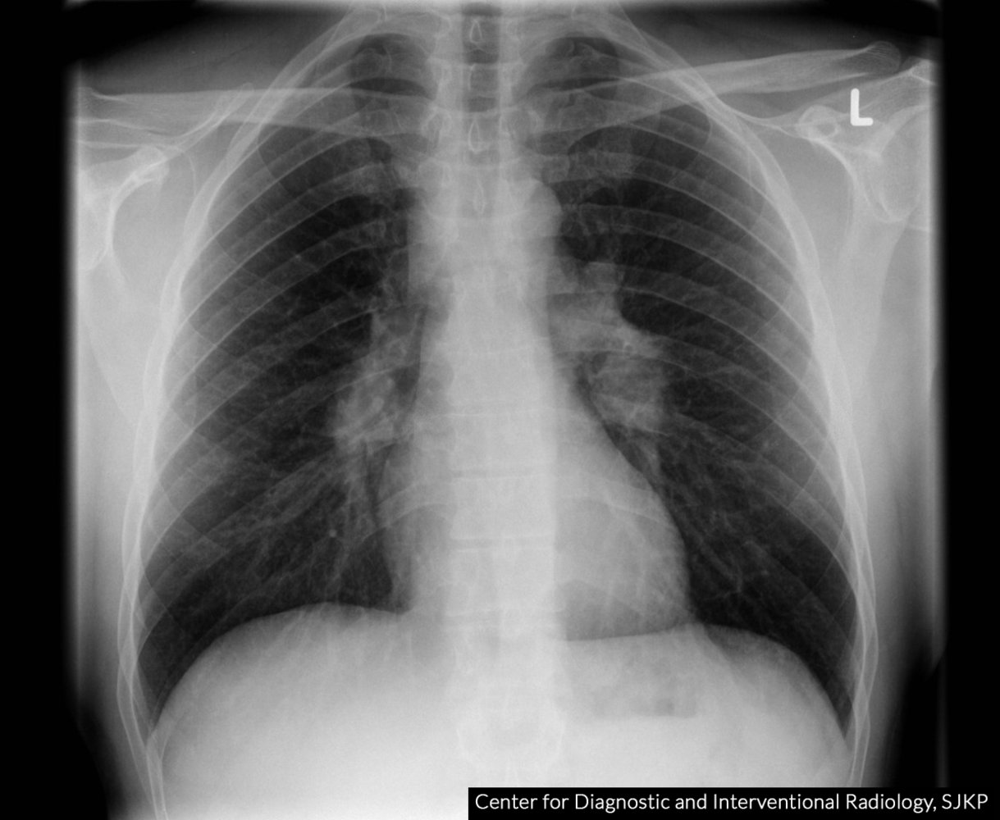

# Lymphadenopathy

*Categories: Clinical knowledge > Internal medicine > Hematology and oncology > Other hemato-oncologic conditions > Lymphadenopathy*

[Original Article Link](https://coursology-qbank.com/amboss/article/iL0Jxg)

---

## Summary

Lymphadenopathy is the enlargement and/or change in consistency of one or more <u>lymph nodes</u>. The most common causes are benign, e.g., <u>self-limited</u> <u>upper respiratory tract infections</u> (<u>URTI</u>). Inflamed (reactive) and enlarged <u>lymph nodes</u> with signs of localized or systemic infection are usually caused by bacterial or viral infection. Hard or rubbery nontender <u>lymph nodes</u> that are fixed to the underlying tissue suggest a <u>metastatic</u> cause of lymphadenopathy. A focused history and examination should be performed to assess the duration, onset, exposures (e.g., medication, travel, <u>sexual activity</u>), associated symptoms, and distribution of lymphadenopathy. Diagnostic testing is unnecessary for patients with a local infection or localized nonprogressive lymphadenopathy. <u>Laboratory studies</u> are indicated if an autoimmune or infectious cause is suspected. <u>Lymph node ultrasound</u> and <u>biopsy</u> are used to assess for <u>malignancy</u>.

See also “<u>Cervical lymphadenopathy</u>.”

---

## Definitions

* Lymphadenopathy: enlargement and/or change in consistency of one or more <u>lymph nodes</u> [[1]](https://coursology-qbank.com/amboss/article/joY_bJ)

* Localized lymphadenopathy involves a single <u>lymph node region</u>.

* <u>Generalized lymphadenopathy</u> involves two or more noncontiguous <u>lymph node regions</u>.

* Lymphadenitis: <u>lymph node</u> inflammation caused by infection or another inflammatory process (most common cause of lymphadenopathy)

* Buboes: significantly enlarged, tender, and inflamed inguinal and/or <u>axillary lymph nodes</u> characteristic of certain infectious diseases (e.g., <u>lymphogranuloma venereum</u>, <u>syphilis</u>, <u>chancroid</u>) [[2]](https://coursology-qbank.com/amboss/article/CSdqbp0)

---

## Etiology

### Localized Lymphadenopathy [[1]](https://coursology-qbank.com/amboss/article/joY_bJ)

See “<u>Lymph node clusters</u>” for potential causes organized by region.

#### Infection

* <u>Self-limited</u> viral infections, e.g.:

* <u>Viral pharyngitis</u>

* <u>Mumps</u>

* <u>Rubella</u> (especially postauricular nodes)

* <u>EBV infection</u> (<u>bilateral cervical lymphadenopathy</u>)

* <u>CMV infection</u>

* <u>Streptococcal</u> or <u>staphylococcal infections</u> (e.g., <u>skin and soft tissue infections</u>, <u>deep neck infections</u>, <u>GAS tonsillopharyngitis</u>)

* <u>Sexually transmitted infections</u>, e.g.:

* Genital <u>HSV infection</u>

* <u>Lymphogranuloma venereum</u> (typically manifests with inguinal <u>buboes</u>)

* <u>Chancroid</u>

* <u>Primary syphilis</u>

* Localized <u>cat-scratch disease</u> (typically cervical or axillary lymphadenopathy)

* <u>Tuberculosis</u> (e.g., <u>tuberculous lymphadenitis</u>) [[3]](https://coursology-qbank.com/amboss/article/MTXMrx)

* <u>Nontuberculous mycobacteria</u> infection

* Early <u>Lyme disease</u> [[4]](https://coursology-qbank.com/amboss/article/f81kNi0)

* <u>Toxoplasmosis</u> (typically <u>cervical lymphadenopathy</u>) [[5]](https://coursology-qbank.com/amboss/article/7414kS0)

* <u>Tularemia</u>

* <u>Sporotrichosis</u>

#### <u>Malignancy</u>

* <u>Metastatic</u> cancer (e.g., <u>breast cancer</u>, <u>lung cancer</u>, <u>colorectal cancer</u>, <u>skin</u> cancer)

* <u>Lymphoma</u> (i.e., <u>non-Hodgkin lymphoma</u>, <u>Hodgkin lymphoma</u>)

#### Other

* Residual lymphadenopathy, e.g., after resolution of <u>URTI</u> (especially cervical)

* <u>Kawasaki disease</u> (usually manifests with <u>unilateral cervical lymphadenopathy</u>)

* <u>Sarcoidosis</u>

* <u>Kikuchi-Fujimoto disease</u>

* Silicone <u>breast implants</u>

* <u>Sjogren syndrome</u> [[6]](https://coursology-qbank.com/amboss/article/CJaqwl)[[7]](https://coursology-qbank.com/amboss/article/ygddB60)

* <u>Rheumatoid arthritis</u>  [[7]](https://coursology-qbank.com/amboss/article/ygddB60)[[8]](https://coursology-qbank.com/amboss/article/BodzVI0)

> [!TIP]
> <u>Sarcoidosis</u> and <u>EBV infection</u> typically manifest initially with localized lymphadenopathy that progresses to <u>generalized lymphadenopathy</u>.

### Generalized lymphadenopathy [[1]](https://coursology-qbank.com/amboss/article/joY_bJ)

<u>Generalized lymphadenopathy</u> is often caused by systemic disease (e.g., infection, autoimmune disease, or <u>malignancy</u>) or medications.

#### Infection

* Viral

* <u>Self-limited</u> viral infections, e.g.:

* <u>EBV infection</u>

* <u>CMV infection</u>

* <u>Influenza</u>

* <u>Mumps</u>

* <u>Measles</u>

* <u>Rubella</u>

* <u>HIV infection</u>

* <u>Shingles</u>

* Bacterial

* <u>Tuberculosis</u>

* <u>Secondary syphilis</u> [[9]](https://coursology-qbank.com/amboss/article/DQd1yp0)

* <u>Scrub typhus</u> [[10]](https://coursology-qbank.com/amboss/article/_VY5CL)

* <u>Brucellosis</u>

* <u>Tularemia</u>

* Fungal

* <u>Histoplasmosis</u>

* <u>Coccidioidomycosis</u>

* <u>Aspergillosis</u>

* <u>Candidiasis</u>

* <u>Cryptococcus</u>

* Parasitic

* <u>Protozoal</u>, e.g.:

* <u>Toxoplasmosis</u>

* <u>Visceral leishmaniasis</u>

* <u>Chagas disease</u>

* <u>Helminthic</u>, e.g.:

* <u>Schistosomiasis</u>

* <u>Lymphatic filariasis</u>

#### <u>Malignancy</u>

* <u>Leukemias</u> (e.g., <u>acute lymphoblastic leukemia</u>)

* <u>Kaposi sarcoma</u>

* Advanced <u>metastatic</u> cancers

* <u>Mycosis fungoides</u> [[11]](https://coursology-qbank.com/amboss/article/JTds760)

#### Autoimmune conditions [[12]](https://coursology-qbank.com/amboss/article/kIYm1q)

* <u>Systemic lupus erythematosus</u> [[7]](https://coursology-qbank.com/amboss/article/ygddB60)

* <u>Autoimmune lymphoproliferative syndrome</u>

* <u>Still disease</u>

* <u>Mixed connective tissue disease</u>

* <u>Dermatomyositis</u>

* <u>IgG4-related disease</u>

* <u>Sjogren syndrome</u>

#### <u>Iatrogenic</u> causes

* Medication-induced, e.g.: 

* <u>Atenolol</u>

* <u>Allopurinol</u>

* <u>Antibiotics</u> (e.g., <u>cephalosporins</u>, <u>penicillins</u>, <u>trimethoprim/sulfamethoxazole</u>)

* <u>Antihypertensives</u> (e.g., <u>hydralazine</u>, <u>captopril</u>)

* <u>Phenytoin</u>

* <u>Vaccine</u>-induced, e.g.: [[13]](https://coursology-qbank.com/amboss/article/1Sd2A60)

* <u>Influenza vaccine</u>

* <u>HPV vaccine</u>

#### Other

* <u>Sarcoidosis</u>  [[7]](https://coursology-qbank.com/amboss/article/ygddB60)

* <u>Langerhans cell histiocytosis</u> [[14]](https://coursology-qbank.com/amboss/article/rzbf8w)

* <u>Castleman disease</u>

* <u>Lysosomal storage diseases</u>, e.g.: [[14]](https://coursology-qbank.com/amboss/article/rzbf8w)

* <u>Fabry disease</u>

* <u>Gaucher disease</u>

* <u>Niemann-Pick disease</u>

* <u>Hyperthyroidism</u> [[14]](https://coursology-qbank.com/amboss/article/rzbf8w)

> [!NOTE]
> To remember the different causes of lymphadenopathy, think “MIAMI”: Malignancy (e.g., <u>lymphomas</u>), Infection (e.g., <u>tuberculosis</u>), Autoimmune disease (e.g., <u>SLE</u>), Miscellaneous (e.g., <u>sarcoidosis</u>), and Iatrogenic (medications).

---

## Pathophysiology

* The pathophysiology of <u>lymph node</u> enlargement varies depending on the cause.

* Enlargement may be due to:

* <u>Proliferation</u> and accumulation of malignant cells (e.g., <u>lymphoma</u> cells or <u>metastases</u> of solid tumors)

* <u>Proliferation</u> of <u>immune cells</u> and formation of <u>clusters</u> as a result of localized and/or systemic inflammation

* Circulating <u>immune complexes</u> (e.g., due to medications or <u>hypersensitivity reactions</u>)

* Accumulation of metabolites due to storage diseases (e.g., <u>ceramide trihexoside</u> in the case of <u>Fabry disease</u>)

---

## Lymph node examination

### <u>Lymph node</u> palpation

* Instruct the patient to relax the area to be examined to facilitate differentiation of the <u>lymph node</u> from the surrounding tissue (e.g., muscles, <u>tendons</u>).

* Gently palpate <u>lymph nodes</u> in each drainage region using your fingertips.

* Assess size, consistency, tenderness, and fixation.

* Assess for <u>red flags for a metastatic cause of lymphadenopathy</u>.

#### Palpation of head and neck lymph nodes

* Instruct the patient to keep the neck relaxed and slightly flexed.

* Palpate bilaterally with one hand on each side.

* Palpate the <u>preauricular lymph nodes</u>, <u>retroauricular lymph nodes</u>, <u>occipital lymph nodes</u>, and <u>deep cervical lymph nodes</u>.

* Move on to the <u>submandibular lymph nodes</u> and <u>submental lymph nodes</u> while also palpating the <u>parotid glands</u>.

* Move on to the <u>lymph nodes of the posterior triangle of the neck</u> and the <u>supraclavicular lymph nodes</u>.

> [!TIP]
> The most common cause of tender regional lymphadenopathy in the head and neck area is <u>URTI</u>.

> [!TIP]
> A palpable, firm <u>lymph node</u> in the left supraclavicular area is called a <u>Virchow node</u> and is classically associated with <u>gastric cancer</u>.

#### Palpation of the axillary lymph nodes

* Support the patient's relaxed arm with your own.

* Warn the patient that the examination might be uncomfortable.

* With one hand, palpate high into the axillary region, pressing your fingers against the <u>chest wall</u> behind the pectoralis muscle and slide your hand downward.

* Palpate the apical, <u>posterior</u>, <u>lateral</u>, <u>anterior</u>, and central <u>axillary lymph nodes</u>.

* Palpate the <u>epitrochlear lymph nodes</u> (∼ 3 cm above the <u>elbow</u>).

> [!TIP]
> The central <u>lymph nodes</u> are typically the most palpable <u>axillary lymph nodes</u>.

> [!TIP]
> A common cause of axillary lymphadenopathy is <u>breast cancer</u>.

#### Palpation of the inguinal lymph nodes

* Instruct the patient to lie <u>supine</u>.

* Palpate the nodes below the <u>inguinal ligament</u> and <u>medial</u> to the <u>femoral artery</u>.

> [!NOTE]
> Common causes of enlarged <u>superficial inguinal lymph nodes</u> are <u>STIs</u> such as <u>chancroid</u> or <u>genital herpes</u>.

### Features of abnormal <u>lymph nodes</u>

* <u>Lymph node</u> size > 1 cm is usually considered abnormal. [[1]](https://coursology-qbank.com/amboss/article/joY_bJ)[[13]](https://coursology-qbank.com/amboss/article/1Sd2A60)

* Exceptions include the following:

* <u>Inguinal lymph nodes</u> may be up to 2 cm. [[12]](https://coursology-qbank.com/amboss/article/kIYm1q)

* <u>Epitrochlear lymph nodes</u> > 0.5 cm and any palpable supraclavicular, popliteal, or iliac <u>lymph nodes</u> are considered abnormal. [[1]](https://coursology-qbank.com/amboss/article/joY_bJ)

| Comparison of features that suggest <u>metastatic</u> vs. nonmetastatic causes of lymphadenopathy |  |  |
| --- | --- | --- |
|  | Features of benign or inflammatory causes | Red flags for a metastatic cause of lymphadenopathy |
| <u>Pain</u> with palpation |  * Tender   |  * Nontender  [[7]](https://coursology-qbank.com/amboss/article/ygddB60)   |
| Consistency |  * Soft   |  * Hard   |
| Fixation |  * Mobile   |  * Fixed to the underlying tissue [[7]](https://coursology-qbank.com/amboss/article/ygddB60)   |
| Region |   * Cervical: <u>anterior</u> to the <u>sternocleidomastoid muscle</u>  * Inguinal    |   * Cervical: <u>dorsal</u> to the <u>sternocleidomastoid muscle</u>  * Supraclavicular  [[1]](https://coursology-qbank.com/amboss/article/joY_bJ)[[7]](https://coursology-qbank.com/amboss/article/ygddB60)  * Axillary (especially in female individuals) [[7]](https://coursology-qbank.com/amboss/article/ygddB60)  * <u>Generalized lymphadenopathy</u> [[1]](https://coursology-qbank.com/amboss/article/joY_bJ)    |
| Progression |   * Acute enlargement without long-term progression  [[1]](https://coursology-qbank.com/amboss/article/joY_bJ)[[13]](https://coursology-qbank.com/amboss/article/1Sd2A60)  * Duration of at least 12 months without change in size or systemic symptoms [[1]](https://coursology-qbank.com/amboss/article/joY_bJ)    |   * Progressive enlargement  * Duration of more than 8–12 weeks [[1]](https://coursology-qbank.com/amboss/article/joY_bJ)    |

> [!TIP]
> Normal <u>inguinal lymph nodes</u> may be up to 2 cm in diameter. [[12]](https://coursology-qbank.com/amboss/article/kIYm1q)

> [!TIP]
> <u>Sarcoidosis</u> and <u>tuberculosis</u> typically manifest with features similar to the lymphadenopathy caused by <u>metastatic</u> disease.

---

## Diagnosis

Most cases of lymphadenopathy are benign and <u>idiopathic</u>. [[1]](https://coursology-qbank.com/amboss/article/joY_bJ)[[12]](https://coursology-qbank.com/amboss/article/kIYm1q)

### Approach

* Obtain routine <u>laboratory studies</u> if an atypical infection, <u>malignancy</u>, or autoimmune disease is suspected.

* Consider targeted <u>laboratory studies</u> based on clinical suspicion.

* <u>Lymph node ultrasound</u> may help differentiate between nonmalignant and malignant <u>lymph nodes</u>.

* Consider <u>lymph node</u> <u>biopsy</u> and/or <u>cross-sectional imaging</u> if the diagnosis remains unclear or <u>malignancy</u> is suspected.

> [!TIP]
> Diagnostic testing is not always indicated (e.g., for patients with local infection or localized nonprogressive lymphadenopathy).

### <u>Laboratory studies</u> [[1]](https://coursology-qbank.com/amboss/article/joY_bJ)[[12]](https://coursology-qbank.com/amboss/article/kIYm1q)

* Routine studies

* <u>CBC with differential</u>

* <u>BMP</u>

* <u>Liver chemistries</u>

* <u>Inflammatory markers</u>: <u>ESR</u>, <u>CRP</u>

* Additional studies

* Infectious disease testing (e.g., <u>monospot test</u>, <u>HIV serology</u>, <u>tuberculosis</u> testing)

* Rheumatologic studies (e.g., <u>rheumatoid factor</u>, <u>ANAs</u>)

### Lymph node ultrasound [[7]](https://coursology-qbank.com/amboss/article/ygddB60)[[15]](https://coursology-qbank.com/amboss/article/ISdYap0)

* Findings suggestive of normal and/or reactive <u>lymph nodes</u> 

* Oval shape  [[15]](https://coursology-qbank.com/amboss/article/ISdYap0)

* <u>Hypoechoic</u>, except for the hilum, which appears contiguous (i.e., echogenic) with surrounding tissue

* Hilar vascularity

* Findings suggestive of malignant <u>lymph nodes</u>  

* Round

* Irregular borders

* <u>Hypoechoic</u>, without an echogenic hilum (absent or eccentric hilum)

* Demarcated echogenic focus in <u>metastatic</u> nodes with cystic or <u>coagulative necrosis</u>

* Eccentric cortical <u>hypertrophy</u> in nodes with <u>tumor</u> infiltration

* Reticulation in lymphomatous nodes

* Abnormal capsular vascularity

### <u>Lymph node</u> <u>biopsy</u> [[1]](https://coursology-qbank.com/amboss/article/joY_bJ)[[13]](https://coursology-qbank.com/amboss/article/1Sd2A60)

* Indications 

* Diagnosis remains unclear after <u>laboratory studies</u> and imaging.

* <u>Malignancy</u> is suspected, e.g.:

* Localized lymphadenopathy and no improvement after 3–4 weeks of observation [[1]](https://coursology-qbank.com/amboss/article/joY_bJ)

* <u>Generalized lymphadenopathy</u>

* Techniques

* <u>Fine-needle aspiration biopsy</u>

* <u>Core needle biopsy</u>

* <u>Excisional biopsy</u> (preferred method in suspected <u>lymphoma</u>)

### Further testing

* <u>Chest x-ray</u>: may reveal hilar and/or <u>mediastinal lymph nodes</u> (e.g., in <u>sarcoidosis</u>)

* CT or <u>MRI</u> with contrast: to better visualize enlarged <u>lymph nodes</u> and/or assess for nonpalpable <u>lymph nodes</u> or other lesions [[7]](https://coursology-qbank.com/amboss/article/ygddB60)

* <u>FDG PET CT</u>: to help differentiate between malignant and nonmalignant lymphadenopathy [[7]](https://coursology-qbank.com/amboss/article/ygddB60)

Bilateral hilar and right paratracheal lymphadenopathy

---