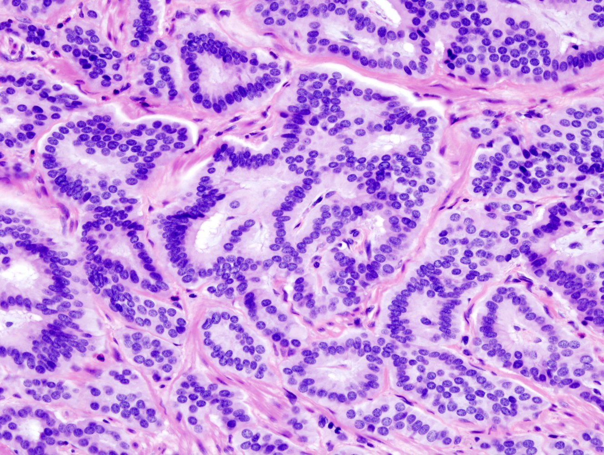
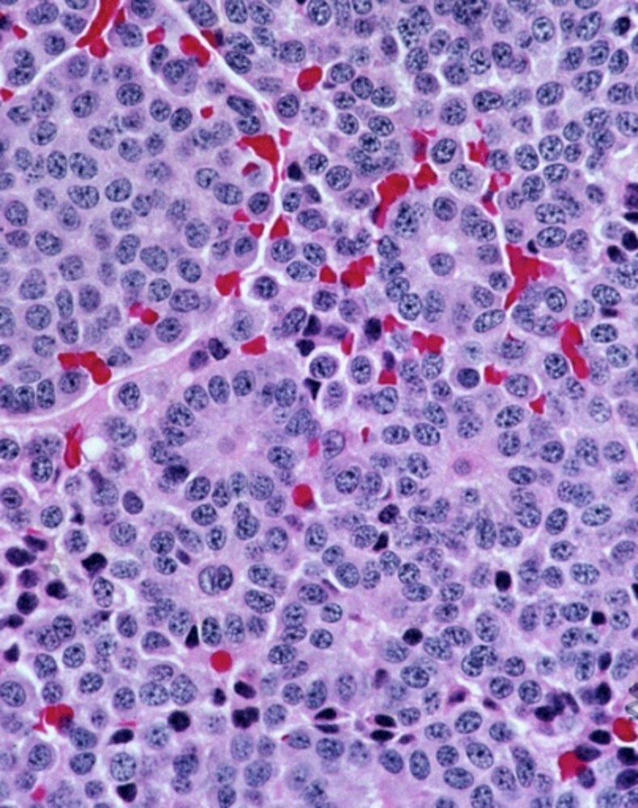

# Neuroendocrine neoplasms

*Categories: Clinical knowledge > Internal medicine > Hematology and oncology > Other hemato-oncologic conditions > Neuroendocrine neoplasms*

[Original Article Link](https://coursology-qbank.com/amboss/article/bu0Hp3)

---

## Summary

Neuroendocrine <u>neoplasms</u> (NENs) are tumors derived from <u>neuroendocrine cells</u> that can produce amines and/or <u>peptide hormones</u>. Well-differentiated <u>epithelial</u> NENs are classified as <u>neuroendocrine tumors</u> (<u>NETs</u>), which typically grow slowly but may <u>metastasize</u>. <u>NETs</u> predominantly arise from the <u>GI tract</u> and the <u>lungs</u>. Poorly differentiated <u>epithelial</u> NENs are classified as <u>neuroendocrine carcinomas</u> (NECs), which are all high-grade and subclassified by cell type (i.e., large or small). <u>NETs</u> and NECs can occur in endocrine and nonendocrine organs throughout the body. NENs originating from neural structures are classified as <u>paragangliomas</u>.

Most <u>NETs</u> are sporadic, but a positive <u>family history</u>, especially of genetic syndromes such as <u>MEN 1</u>, increases the risk. Some NENs cause paraneoplastic syndromes (e.g., <u>carcinoid syndrome</u>, <u>Zollinger-Ellison syndrome</u>) due to excess bioactive amines or <u>peptide hormones</u> (e.g., <u>serotonin</u>, <u>insulin</u>, <u>gastrin</u>). Levels of these <u>hormones</u> and nonspecific neuroendocrine markers (e.g., <u>chromogranin A</u>) are measured to support the diagnosis. Surgical resection is indicated for localized disease and, in some cases, <u>metastatic</u> disease to alleviate <u>pain</u> and/or reduce <u>hormone</u> production. Systemic therapy (e.g., <u>octreotide</u>) can mitigate the hormonal effects of unresectable <u>metastatic</u> disease.

---

## Definitions

* Neuroendocrine <u>neoplasm</u> (NEN): an umbrella term for a heterogeneous group of tumors derived from <u>neuroendocrine cells</u> that share common features (e.g., secretory granules, <u>hormone</u> production)

* Functioning NENs: produce and secrete bioactive substances and are associated with <u>paraneoplastic syndromes</u> (e.g., <u>carcinoid syndrome</u>)

* Nonfunctioning NENs: produce but do not secrete bioactive substances at clinically significant levels

* Carcinoid tumor: historically used interchangeably with “neuroendocrine <u>neoplasm</u>” or to refer to gastrointestinal <u>NETs</u>; currently only used specifically for <u>carcinoid lung tumors</u> and <u>ovarian carcinoid</u> tumors [[3]](https://coursology-qbank.com/amboss/article/_WW5L40)

> [!NOTE]
> <u>Neuroendocrine cells</u> (e.g., <u>pancreatic β-cells</u>, <u>enterochromaffin cells</u>) belong to the <u>APUD cell</u> series and share a common biological function, despite their different embryologic origins, anatomical sites, and secretory products (e.g., <u>serotonin</u>, <u>histamine</u>). [[4]](https://coursology-qbank.com/amboss/article/3P0SeT)

---

## Overview

### Classification [[2]](https://coursology-qbank.com/amboss/article/ZsdZtr0)

The terminology for NENs varies across the literature. The following reflects the 2022 WHO taxonomy. [[2]](https://coursology-qbank.com/amboss/article/ZsdZtr0)

* Neuroendocrine tumors (<u>NETs</u>): well-differentiated <u>epithelial</u> NENs with malignant potential  

* Subtypes vary by <u>tumor</u> location

* <u>Tumor grade</u> (G1-G3) is based on <u>histopathology</u>

* Neuroendocrine carcinomas (NECs): poorly differentiated malignant <u>epithelial</u> NENs

* Subtyped as either large cell or small cell

* High <u>tumor grade</u> by definition

* <u>Paragangliomas</u>: NENs arising from <u>neural crest cells</u> in the autonomic <u>ganglia</u> or <u>adrenal medulla</u>

### <u>Tumor</u> locations [[2]](https://coursology-qbank.com/amboss/article/ZsdZtr0)[[5]](https://coursology-qbank.com/amboss/article/3KdSTI0)

* <u>NETs</u>: endocrine and nonendocrine organs throughout the body

* <u>GI tract</u>, including the <u>pancreas</u> (62–67%) [[5]](https://coursology-qbank.com/amboss/article/3KdSTI0)

* Gastric, <u>small intestine</u>, colorectal, and appendiceal <u>NETs</u>

* <u>Pancreatic NETs</u>, e.g.:

* <u>Insulinoma</u>

* <u>Glucagonoma</u>

* <u>Gastrinoma</u>

* <u>VIPoma</u>

* <u>Somatostatinoma</u>

* Bronchopulmonary system (22–27%), e.g., <u>lung NET</u> [[5]](https://coursology-qbank.com/amboss/article/3KdSTI0)

* Other organs (rare), e.g., <u>ovarian carcinoid</u>

* NECs: endocrine and nonendocrine organs throughout the body

* <u>Small cell lung cancer</u>

* Large cell <u>NEC</u> (e.g., of the <u>lung</u>, <u>thymus</u>)

* <u>Medullary thyroid cancer</u>

* <u>Merkel cell carcinoma</u>

* Other NECs, e.g., gastrointestinal, esophageal, and cervical NECs

* <u>Paragangliomas</u>: : most commonly in the <u>adrenals</u> (i.e., <u>pheochromocytoma</u>)

### Associated genetic syndromes [[1]](https://coursology-qbank.com/amboss/article/-dWDs40)

Genetic syndromes associated with an increased risk of NENs include:

* <u>MEN type 1</u> (e.g., <u>pancreatic</u>, gastric, <u>duodenal</u>, <u>thymic</u>, bronchial NENs)

* <u>Von Hippel-Lindau syndrome</u> (<u>pancreatic</u> NENs)

* <u>Neurofibromatosis type 1</u> (<u>somatostatinomas</u>)

> [!NOTE]
> The Measure of thirds for <u>NETs</u>: one-third are Multiple, one-third are associated with another Malignancy, and one-third Metastasize.

---

## Clinical features

Clinical features vary widely based on mass size, location, and endocrine activity. [[1]](https://coursology-qbank.com/amboss/article/-dWDs40)

* Asymptomatic: e.g., with nonfunctioning <u>incidentalomas</u>

* Endocrine activity (in functioning tumors, including tumors of unknown origin), e.g.:

* <u>Carcinoid syndrome</u>

* <u>Zollinger-Ellison syndrome</u>

* Clinical features of <u>somatostatinoma</u> (e.g., <u>glucose intolerance</u>, <u>cholelithiasis</u>, <u>steatorrhea</u>)

* <u>Mass effect</u>, e.g.:

* <u>Pain</u> (e.g., abdominal <u>pain</u>)

* Change in bowel habits or <u>clinical features of bowel obstruction</u> (rare)

* Symptoms of local compression (e.g., <u>airway</u> compression in <u>lung</u> NENs)

---

## Diagnostics

### <u>Biopsy</u> [[6]](https://coursology-qbank.com/amboss/article/Z6dZjI0)

<u>Biopsy</u> is typically performed to confirm the diagnosis and obtain tissue for further characterization (e.g., grading, <u>receptor</u> status).

* <u>Histopathology</u>: nests of cells with round or oval <u>nuclei</u> with “salt-and-pepper” <u>chromatin</u>

* <u>Immunohistochemistry</u>: <u>immunostaining</u> for <u>synaptophysin</u>, <u>chromogranin A</u>, and <u>neuron-specific enolase</u> to confirm neuroendocrine origin

* Grading

* All NECs are high-grade (G3)

* <u>NET</u> grading is based on the <u>Ki-67 index</u> and/or <u>mitotic rate</u> (whichever is higher) as determined by a pathologist

* G1: low-grade, consistent with indolent growth

* G2: intermediate-grade, variable growth (can be aggressive)

* G3: high-grade, aggressive growth

Neuroendocrine tumor of colon

Neuroendocrine tumor

### <u>Laboratory studies</u> [[7]](https://coursology-qbank.com/amboss/article/X6d9jI0)

* Analyze secretory products (nonspecific) in consultation with a specialist to support the diagnosis or monitor treatment response.

* <u>Chromogranin A</u>

* <u>Neuron-specific enolase</u>

* <u>Synaptophysin</u>

* <u>Serotonin</u>

* <u>Histamine</u>

* <u>Calcitonin</u>

* See also “<u>Common tumor markers in peripheral blood</u>.”

* <u>Diagnostics for carcinoid syndrome</u> (e.g., 24-hour urinary excretion of <u>5-hydroxyindoleacetic acid</u>)

* Targeted testing for suspected <u>paraneoplastic syndromes</u> (e.g., <u>fasting</u> serum <u>gastrin</u> and gastric <u>pH</u> for <u>gastrinomas</u>)

### Imaging [[8]](https://coursology-qbank.com/amboss/article/YeWnx40)[[9]](https://coursology-qbank.com/amboss/article/c6daPI0)[[10]](https://coursology-qbank.com/amboss/article/dbWosP0)

* <u>Cross-sectional imaging</u>

* Modalities: CT with contrast, <u>MRI</u>

* Uses: location and assessment of primary and <u>metastatic</u> NENs

* <u>Somatostatin</u>-<u>receptor</u> imaging 

* Modalities: PET/CT (preferred), <u>scintigraphy</u>

* Uses: whole-body staging, detection of small tumors and <u>metastases</u>

* Conventional imaging (not standard for NEN workup)

* Modalities: <u>ultrasound</u>, <u>chest x-ray</u>

* Uses: may detect a mass when performed for another indication (low <u>sensitivity</u>)

> [!TIP]
> Approx. 27% of patients with <u>NETs</u> have distant <u>metastasis</u> at diagnosis. [[5]](https://coursology-qbank.com/amboss/article/3KdSTI0)

---

## Treatment

Treatment is based on the grade and stage of the <u>tumor</u> and should be guided by appropriate specialists (e.g., oncology, gastroenterology). [[8]](https://coursology-qbank.com/amboss/article/YeWnx40)[[11]](https://coursology-qbank.com/amboss/article/b6dHjI0)

* <u>Expectant management</u>

* Consider for patients without a <u>paraneoplastic syndrome</u>, including those with small, indolent <u>metastases</u>.

* Monitor <u>NETs</u> with imaging (e.g., for <u>midgut</u> <u>NETs</u>, every 3–4 months initially, then every 6 months). [[12]](https://coursology-qbank.com/amboss/article/Y6dnjI0)

* Surgical resection

* For localized disease

* For <u>metastatic</u> disease to alleviate <u>pain</u> and/or reduce <u>hormone</u> production

* Systemic therapy, e.g.:

* <u>Somatostatin analogues</u> (e.g., <u>octreotide</u>) for treatment of <u>carcinoid syndrome</u>

* <u>Palliative chemotherapy</u> to slow <u>tumor</u> progression

* Radiolabeled <u>somatostatin analogues</u> for <u>NETs</u> expressing <u>somatostatin</u> <u>receptors</u>

* Additional interventional therapies on a case-by-case basis, e.g.:

* Hepatic <u>arterial embolization</u>

* <u>Radiofrequency ablation</u>

* Surgical <u>debulking</u>

---