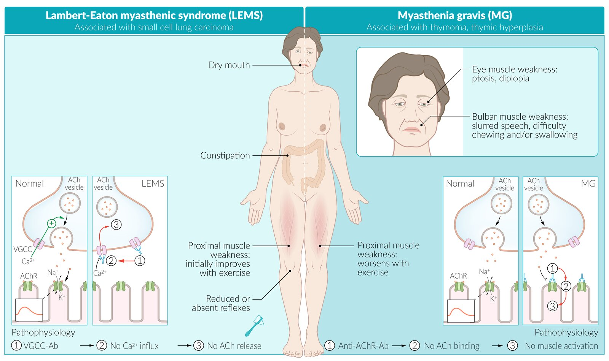
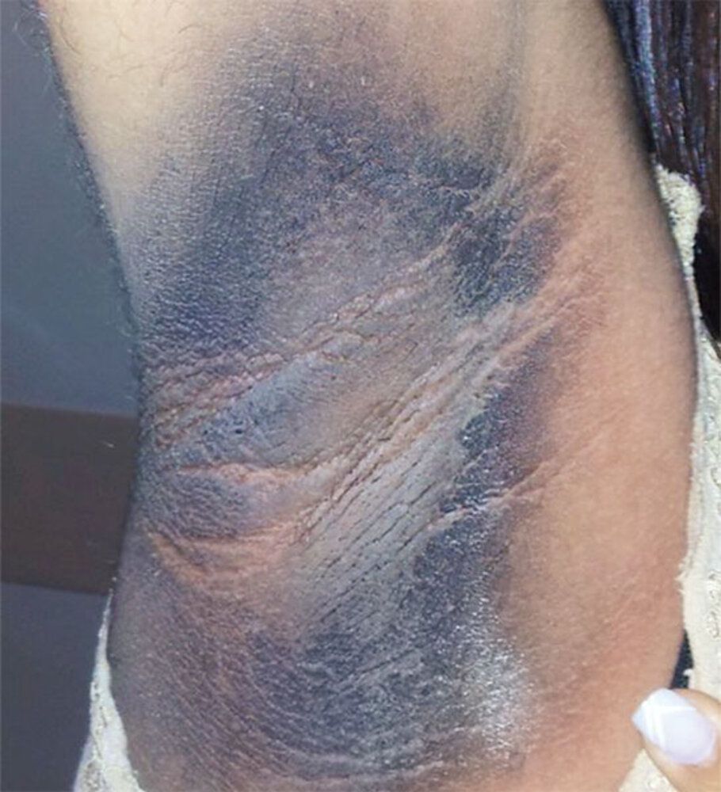
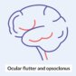
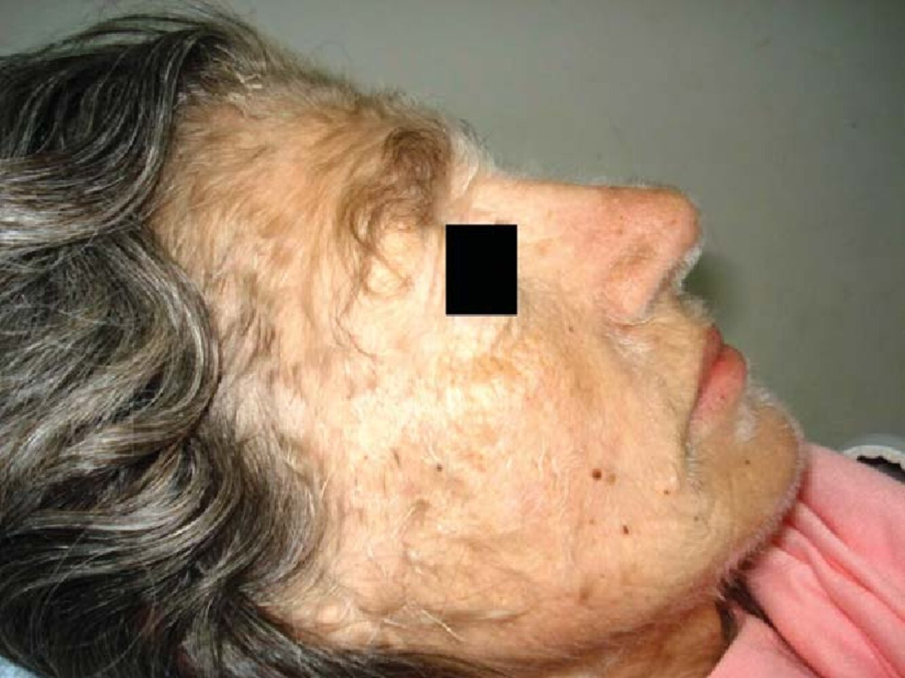

# Paraneoplastic syndromes

*Categories: Clinical knowledge > Internal medicine > Hematology and oncology > Other hemato-oncologic conditions > Paraneoplastic syndromes*

[Original Article Link](https://coursology-qbank.com/amboss/article/lk0vLT)

---

## Summary

Paraneoplastic syndromes are a set of clinical features that are caused by either an altered <u>immune response</u> to a systemic <u>malignancy</u> or because of substances (e.g., <u>hormones</u>, cellular <u>proteins</u>) produced by tumors. They are caused neither by the local <u>mass effect</u> nor by <u>metastasis</u> of the associated cancer. Paraneoplastic syndromes present with a wide range of findings and are most commonly associated with <u>lung</u>, ovarian, lymphatic, and <u>breast cancers</u>. <u>Small cell lung cancer</u> is especially notorious for its numerous and distinct paraneoplastic syndromes. Some paraneoplasias are associated with many different malignancies, such as <u>tumor</u>-induced <u>hypercalcemia</u>, which is caused by <u>parathyroid hormone-related protein</u> (<u>PTHrP</u>) produced from <u>tumor</u> cells. Other paraneoplasias (e.g., <u>malignant acanthosis nigricans</u>) are almost <u>pathognomonic</u> for specific malignancies and their presence demands an immediate search for the underlying <u>tumor</u>. A general <u>overview of the most common paraneoplastic syndromes</u> and their associations is presented here. Further details for individual syndromes can be found in articles of associated conditions.

---

## Overview

Common paraneoplastic manifestations are <u>cachexia</u>, <u>hyperthermia</u>, and increased risk of <u>thrombosis</u>. [[1]](https://coursology-qbank.com/amboss/article/o4004T)

|  Overview of the most common paraneoplastic syndromes [[1]](https://coursology-qbank.com/amboss/article/o4004T)[[2]](https://coursology-qbank.com/amboss/article/K40U4T)  |  |  |  |  |
| --- | --- | --- | --- | --- |
| Type |  | Etiology | Associated cancer(s) | Characteristic features |
| Neuromuscular |  <u>Lambert-Eaton myasthenic syndrome</u>    |  * Presynaptic <u>voltage</u>-gated <u>calcium</u> channels (<u>VGCC</u>) (P/Q-type) <u>autoantibodies</u>   |  * <u>Small cell lung cancer</u> (<u>SCLC</u>)   |   * <u>Proximal</u> <u>muscle weakness</u>  * Reduced or absent reflexes  * Autonomic symptoms (e.g., dry mouth, <u>constipation</u>)  * See “<u>Lambert-Eaton myasthenic syndrome</u>.”    |
|  <u>Myasthenia gravis</u>    |  * <u>Autoantibodies</u> against nicotinic <u>AChRs</u> of <u>neuromuscular endplates</u>   |  * <u>Thymoma</u>   |   * Fatigable <u>weakness</u> of <u>skeletal muscles</u>  * <u>Eye muscle</u> <u>weakness</u>  * <u>Bulbar muscle</u> <u>weakness</u>  * <u>Proximal</u> limb <u>weakness</u>  * <u>Respiratory muscle weakness</u>  * Possibly <u>cough</u>, <u>dysphagia</u>, <u>dyspnoea</u>, <u>hoarseness</u>  * See “<u>Clinical features of myasthenia gravis</u>.”    |  |
| <u>Stiff person syndrome</u> |  * <u>Anti-GAD</u> or <u>anti-amphiphysin antibodies</u>   |   * <u>Breast cancer</u>  * <u>Lung cancer</u>  * <u>Lymphoma</u>    |   * Generalized increase in skeletal muscle rigidity  * Lumbar or cervical <u>hyperlordosis</u>  * Gait abnormalities  * Episodic painful muscle spasms    |  |
| <u>Polymyositis</u> |  * Cell-mediated cytotoxicity against unidentified <u>skeletal muscle</u> <u>antigens</u>, chiefly affecting the <u>endomysium</u>   |   * <u>Adenocarcinoma</u> (most common)  * <u>Ovarian cancer</u>  * <u>Cervix cancer</u>  * <u>Lung cancer</u>  * <u>Pancreas cancer</u>  * <u>Stomach cancer</u>  * <u>Bladder cancer</u>    |   * <u>Proximal</u> <u>muscle weakness</u> affecting both sides (progresses within weeks to months)  * Muscle tenderness    |  |
| <u>Dermatomyositis</u> |  * Paraneoplastic <u>antibody</u>-mediated vasculopathy   |  |  |  |
| Neurological | Paraneoplastic encephalomyelitis |  * Immune reaction against neural <u>antigens</u> (e.g., Hu <u>antigens</u>, <u>NMDA glutamate receptors</u>)   |   * <u>Small cell lung cancer</u> (<u>SCLC</u>)  * <u>Anti-NMDA encephalitis</u>: ovarian <u>teratoma</u>    |   * <u>Symptoms of encephalitis</u>  * Cognitive defects (e.g., <u>memory</u> deficits, speech impairment, psychiatric manifestations)  * <u>Seizures</u>  * <u>Dyskinesias</u>  * Symptoms of <u>myelitis</u> (different patterns of limb <u>paresis</u> and sensory loss depending on area affected)  * <u>Autonomic instability</u>  * <u>CSF</u> <u>pleocytosis</u>    |
| Paraneoplastic cerebellar degeneration |  * Immune reaction against neural <u>antigens</u> in the <u>cerebellum</u> (e.g., Yo <u>antigens</u> of Purkinje cells, Tr <u>antigens</u>, Hu <u>antigens</u>)   |   * <u>Anti-Yo antibodies</u>: gynecological malignancies (<u>breast</u>, ovarian, or <u>endometrial cancer</u>)  * <u>Anti-Hu antibodies</u>: <u>small cell lung cancer</u>  * <u>Anti-Tr antibodies</u>: <u>Hodgkin lymphoma</u>    |   * <u>Ataxia</u>, <u>vertigo</u>  * <u>Nystagmus</u>, <u>diplopia</u>  * <u>Dysmetria</u>, <u>dysarthria</u>    |  |
| Opsoclonus-myoclonus syndrome |  * Cellular immune reaction against onconeural <u>antigens</u> → disinhibition of the <u>fastigial nucleus</u> of the <u>cerebellum</u> [[3]](https://coursology-qbank.com/amboss/article/FfXgLx)   |   * <u>SCLC</u> (in adults)  * Pediatric cases of <u>neuroblastoma</u>  * <u>Ovarian cancer</u>  * <u>Breast cancer</u>    |   * Rapid, multidirectional, involuntary movements of the eyes (opsoclonus ) and muscles (<u>myoclonus</u>)  * <u>Ataxia</u>  * Irritability, <u>sleep</u> disturbance    |  |
|  <u>Limbic encephalitis</u> [[4]](https://coursology-qbank.com/amboss/article/lkcvLc0)  |  * Thought to be caused by an autoimmune reaction with <u>antibodies</u> directed against <u>antigens</u> richly expressed in the <u>limbic system</u>   |   * <u>SCLC</u> (most common)  * <u>Breast cancer</u>  * <u>Testicular cancer</u>    |   * Severe short-term <u>memory</u> impairment  * <u>Seizures</u>  * Confusion  * Psychiatric symptoms (e.g., <u>depression</u>, <u>hallucinations</u>, <u>anxiety</u>)    |  |
|  Paraneoplastic pure sensory neuropathy  |  * Immune reaction (often with anti-Hu <u>autoantibodies</u>) against intracellular <u>antigens</u> present in the primary sensory <u>dorsal root ganglion</u> cells   |   * <u>SCLC</u> (most common) [[5]](https://coursology-qbank.com/amboss/article/KkcUKc0)  * <u>Bronchial carcinoma</u>  * <u>Hodgkin lymphoma</u>  * <u>Breast cancer</u>    |   * Subacute onset  * Painful <u>paresthesias</u> and <u>dysesthesias</u>  * Loss of <u>proprioception</u>  * Progressive numbness/ <u>weakness</u> of feet and hands  * Sensory <u>gait ataxia</u>    |  |
| Endocrine |  <u>Cushing syndrome</u>    |  * <u>Neoplastic</u> tissue produces <u>ectopic</u> <u>ACTH</u> (occasionally with <u>CRH</u>) → increased <u>cortisol</u> in the <u>adrenal glands</u>   |   * <u>SCLC</u>  * <u>Pancreas cancer</u>  * <u>CNS tumors</u>    |   * Moon facies, <u>buffalo hump</u>  * <u>Hirsutism</u>, <u>hyperpigmentation</u>  * <u>Lethargy</u>, <u>depression</u>, <u>sleep</u> disturbance  * <u>Osteopenia</u>, <u>osteoporosis</u>  * Muscle <u>atrophy</u>/<u>weakness</u>    |
| <u>Syndrome of inappropriate ADH secretion</u> |  * <u>Neoplastic</u> tissue produces <u>ectopic</u> <u>ADH</u> (<u>endogenous</u>) → increased free-water reabsorption and retention and <u>hyponatremia</u>   |   * <u>SCLC</u>  * <u>CNS tumors</u>    |   * <u>Anorexia</u>, <u>nausea</u>, <u>vomiting</u>  * <u>Headache</u>  * Muscle cramps, <u>muscle weakness</u>  * <u>Lethargy</u>, confusion    |  |
| Hypercalcemia of malignancy |  * Humoral hypercalcemia of malignancy (<u>pseudohyperparathyroidism</u>): PTHrP secretion by the <u>tumor</u>   |   * <u>Squamous cell carcinomas</u> (<u>lung</u>, head, and neck)  * <u>Renal cancer</u>  * <u>Bladder cancer</u>  * <u>Breast cancer</u>  * <u>Ovarian cancer</u>    |   * <u>Nephrolithiasis</u>, <u>nephrocalcinosis</u>  * Bone <u>pain</u>, <u>arthralgias</u>, <u>myalgias</u>  * <u>Constipation</u>, abdominal <u>pain</u>  * <u>Nausea</u>, <u>vomiting</u>, <u>anorexia</u>    |  |
|  * <u>Ectopic</u> <u>vitamin D</u> production due to <u>1α-hydroxylase</u> activity in <u>tumor</u> cells   |   * <u>Hodgkin lymphoma</u>  * <u>NHL</u>    |  |  |  |
|  * Local osteolytic hypercalcemia: <u>osteolytic</u> activity at sites of <u>skeletal metastases</u>   |   * <u>Multiple myeloma</u>  * <u>Breast cancer</u>    |  |  |  |
| Mucocutaneous |  Malignant acanthosis nigricans |  * <u>Ectopic</u> transforming growth factor <u>TGF-α</u> and <u>epidermal growth factor</u> (<u>EGF</u>)   |   * <u>Gastric adenocarcinoma</u> and other gastrointestinal cancers  * <u>Lung cancer</u>  * <u>Ovarian cancer</u>  * <u>Breast cancer</u>    |   * Brown to black, <u>intertriginous</u> and/or nuchal <u>hyperpigmentation</u> and <u>dermal</u> thickening  * Can turn into itching, papillomatous, poorly-defined <u>rash</u>  * Rapid growth and <u>verrucous</u> or papulous surface  * Most commonly localized in the <u>axilla</u>, groin, neck, and genital/anal region    |
|  Leser-Trélat sign    |  * Activation of <u>epidermal growth factor receptors</u>   |  * Solid cancers (especially gastrointestinal <u>adenocarcinoma</u>)   |  * Multiple, sudden-onset <u>seborrheic keratoses</u>   |  |
| <u>Necrolytic migratory erythema</u> |  * Not fully understood   |  * <u>Glucagonoma</u>   |   * Multiple areas of <u>centrifugally</u> spreading <u>erythema</u>  * Predominantly face, <u>perineum</u>, and lower extremities affected  * Develop into painful and pruritic crusty patches with central areas of bronze-colored induration  * Tend to resolve and reappear in a different location    |  |
|  Hypertrichosis lanuginosa acquisita  |  * Response to substances or <u>hormones</u> released by the <u>tumor</u>   |   * <u>Colorectal cancer</u>  * <u>Lung cancer</u>  * <u>Breast cancer</u>    |  * Rapid growth of unpigmented, fine <u>hair</u> (<u>lanugo hair</u>) on face, trunk, extremities, and <u>axillae</u>   |  |
| Skeletal |  <u>Hypertrophic pulmonary osteoarthropathy</u> (<u>Bamberger-Marie syndrome</u>) |  * Likely <u>ectopic</u> vascular <u>endothelial</u> GF, <u>platelet</u>-derived GF, and/or <u>prostaglandin E2</u> → increased <u>angiogenesis</u> as well as <u>fibroblast</u> and <u>osteoblast</u> activity → connective-tissue matrix and bone synthesis   |  * <u>NSCLC</u> (especially <u>lung adenocarcinoma</u>)   |  * Features include <u>digital clubbing</u>, <u>joint</u> <u>pain</u>, thickening of tubular bones, <u>periostosis</u>, and <u>joint effusions</u>   |
| Tumor-induced osteomalacia |  * Caused by the secretion of <u>fibroblast growth factor-23</u> (FGF-23)   |  * Slow-growing <u>mesenchymal tumors</u> of the limbs, <u>nasopharynx</u>, and/or sinuses   |  * Features of <u>hypophosphatemic</u> <u>rickets</u>/<u>osteomalacia</u>   |  |
| Hematological | <u>Polycythemia</u> |  * <u>EPO</u> produced by <u>tumor</u>   |   * <u>Renal cell carcinoma</u>  * <u>Pheochromocytoma</u>  * <u>Hemangioblastoma</u>  * <u>Leiomyoma</u>  * <u>Hepatocellular carcinoma</u>  * <u>Cerebellar</u> <u>hemangioma</u>    |   * <u>Hyperviscosity syndrome</u>  * <u>Plethora</u>  * <u>Facial flushing</u>  * <u>Pruritus</u>  * <u>Dizziness</u>, <u>headache</u>  * <u>Hypertension</u>    |
| <u>Pure red cell aplasia</u> |  * Absence of red cell precursor cells → <u>anemia</u> (with low <u>reticulocyte</u>)   |  * <u>Thymoma</u>   |   * <u>Pallor</u>  * Fatigue  * <u>Exertional dyspnea</u>  * Possibly <u>cough</u>, <u>dysphagia</u>, <u>dyspnoea</u>, <u>hoarseness</u>    |  |
| Good syndrome |  * ↓ <u>B-cell</u> counts → <u>hypogammaglobulinemia</u> → <u>immunodeficiency</u>   |  * <u>Thymoma</u>   |  * Possibly <u>cough</u>, <u>dysphagia</u>, <u>dyspnoea</u>, <u>hoarseness</u>   |  |
| <u>Trousseau syndrome</u> (<u>thrombophlebitis migrans</u>) |  * <u>Malignancy</u>-related <u>hypercoagulability</u> → recurring clots that resolve and appear again elsewhere in the body (migrans)   |   * <u>Pancreatic cancer</u>  * <u>Lung cancer</u>  * <u>Gliomas</u>    |  * <u>Pain</u>, tenderness, induration, and <u>erythema</u> overlying the affected <u>vein</u>   |  |
| <u>Nonbacterial thrombotic endocarditis</u> |  * Deposition of noninfectious <u>thrombi</u> on the <u>heart valves</u>   |  * Commonly associated with <u>adenocarcinomas</u> (e.g., <u>pancreas cancer</u>, <u>colorectal cancer</u>)   |   * <u>Fever</u>, chills  * General <u>malaise</u>, <u>weakness</u>, night sweats, weight loss  * <u>Dyspnea</u>, <u>cough</u>, <u>pleuritic chest pain</u>  * <u>Arthralgias</u>, <u>myalgias</u>  * New <u>heart murmur</u>    |  |
| Miscellaneous | <u>Neoplastic fever</u> |  * Likely <u>cytokine</u>-mediated   |  * Most cancers   |  * <u>Fever</u>, general <u>malaise</u>, weight loss   |
| <u>Membranous glomerulonephritis</u> |  * <u>Membrane attack complex</u> (<u>MAC</u>) that forms on <u>glomerular</u> <u>epithelial</u> cells   |   * <u>Lung cancer</u>  * <u>Colon cancer</u>    |   * <u>Edema</u> (<u>periorbital edema</u> and(or <u>peripheral edema</u>)  * <u>Hypoalbuminemia</u>, <u>hyperlipidemia</u>  * <u>Hypercoagulable state</u> (increased risk of <u>thrombosis</u>)  * Increased susceptibility to infection  * Possibly <u>hypertension</u>  * Possibly frothy urine    |  |

> [!NOTE]
> “Rising or high hematocrit levels are paraneoplastic!” Renal cell <u>carcinoma</u>, Hepatocellular <u>carcinoma</u>, Hemangioblastoma, Leiomyoma, and Pheochromocytoma are associated with <u>polycythemia</u>.

> [!NOTE]
> Patients with <u>OMS</u> are described as having “dancing eyes” (opsoclonus) and “dancing feet” (<u>myoclonus</u>).

Comparison between myasthenia gravis and Lambert-Eaton syndromes

Acanthosis nigricans

Acanthosis nigricans

Leser–Trélat sign

Cushing syndrome (hypercortisolism) fact sheet

Ocular Flutter and Opsoclonus

Hypertrichosis lanuginosa acquisita

---