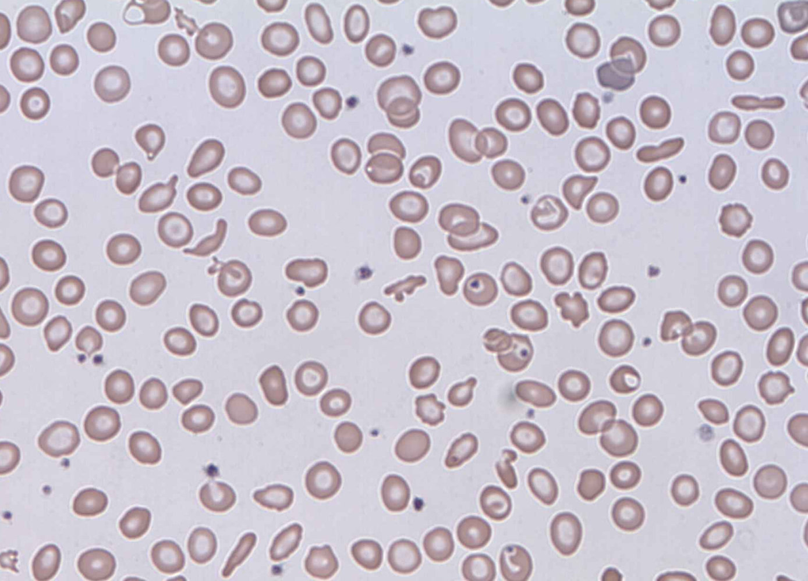
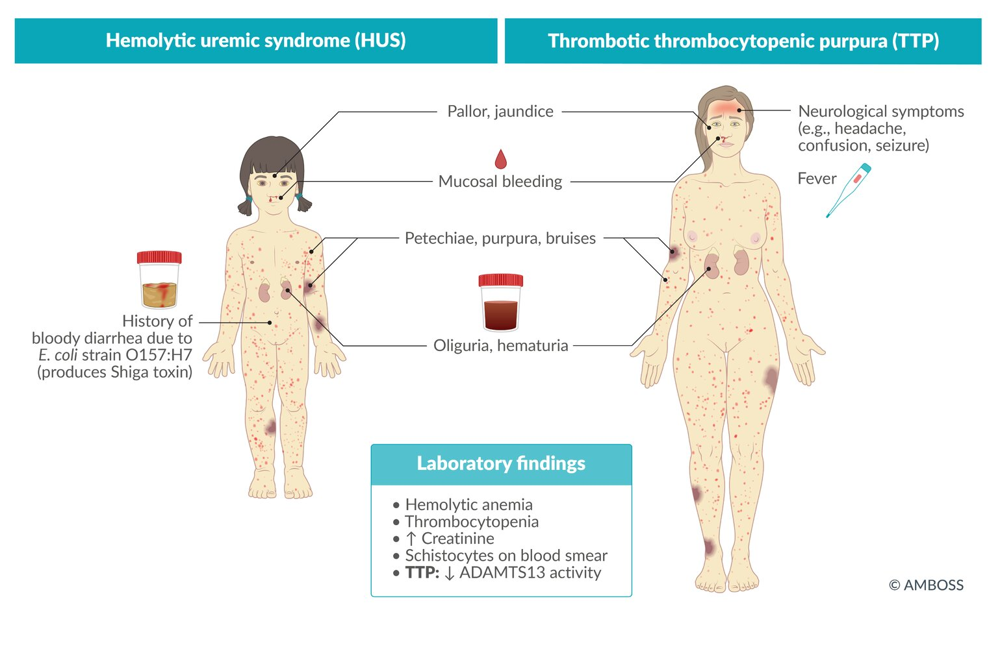
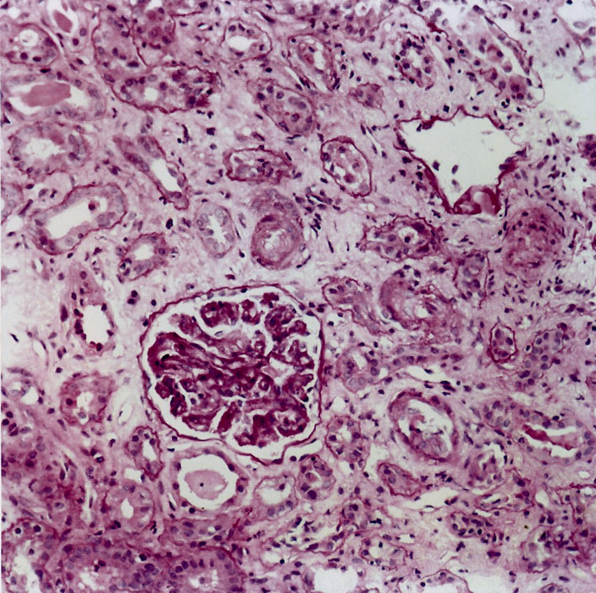

# Hemolytic uremic syndrome

*Categories: Clinical knowledge > Internal medicine > Hematology and oncology > Platelet and coagulation disorders > Hemolytic uremic syndrome*

[Original Article Link](https://coursology-qbank.com/amboss/article/rL0f_g)

---

## Summary

Hemolytic uremic syndrome (HUS) is a thrombotic microangiopathy, a condition in which microthrombi, consisting primarily of <u>platelets</u>, form and occlude the <u>microvasculature</u>. HUS is characterized by <u>microangiopathic hemolytic anemia</u> (<u>MAHA</u>), <u>thrombocytopenia</u>, and <u>acute kidney injury</u> (<u>AKI</u>), referred to as the <u>HUS triad</u>. <u>Shiga toxin-associated HUS</u> (ST-HUS) is the most common form and predominantly affects children. It is most often caused by <u>Shiga toxin-producing Escherichia coli</u> (<u>STEC</u>) <u>O157:H7</u> and usually manifests with <u>diarrhea</u> 5–14 days before the onset of HUS. <u>Non-Shiga toxin-associated HUS</u> (non-ST-HUS) is caused by <u>complement</u> pathway dysregulation (in <u>complement-mediated HUS</u>), infection, medication, transplant, or autoimmune disease. Diagnosis is made with <u>laboratory studies</u> that confirm the <u>HUS triad</u> and exclude <u>disseminated intravascular coagulation</u> (<u>DI</u>C) and <u>thrombotic thrombocytopenic purpura</u> (TTP). In patients with suspected HUS, stool studies should be performed to assess for <u>STEC</u> and <u>Shiga toxin</u>. Management is primarily supportive and includes administration of <u>IV fluids</u>, <u>packed RBC</u> <u>transfusions</u>, and <u>renal replacement therapy</u> as needed. Pharmacotherapy with <u>complement</u> inhibitors (<u>eculizumab</u> or <u>ravulizumab</u>) is recommended for <u>complement-mediated HUS</u>. Early <u>management of STEC-positive illness</u> that avoids <u>antibiotics</u> and antimotility agents can decrease the risk of developing HUS.

<u>Thrombotic thrombocytopenic purpura</u> (<u>TTP</u>) is discussed separately.

---

## Epidemiology

* <u>ST-HUS</u>

* Causes ∼ 90% of HUS cases in children [[1]](https://coursology-qbank.com/amboss/article/UHdbpr0)

* Most common in children 6 months to 5 years of age [[1]](https://coursology-qbank.com/amboss/article/UHdbpr0)[[2]](https://coursology-qbank.com/amboss/article/KmdUgq0)[[3]](https://coursology-qbank.com/amboss/article/wmdh3q0)[[4]](https://coursology-qbank.com/amboss/article/fGdkAr0)

* <u>Non-ST-HUS</u>

* Causes 10% of HUS cases in children; more common in adults [[1]](https://coursology-qbank.com/amboss/article/UHdbpr0)[[4]](https://coursology-qbank.com/amboss/article/fGdkAr0)[[5]](https://coursology-qbank.com/amboss/article/UGdbAr0)

* Can manifest at any age, depending on the underlying cause [[6]](https://coursology-qbank.com/amboss/article/_md5Rq0)

Epidemiological data refers to the US, unless otherwise specified.

---

## Etiology

### Shiga toxin-associated HUS [[1]](https://coursology-qbank.com/amboss/article/UHdbpr0)[[2]](https://coursology-qbank.com/amboss/article/KmdUgq0)[[3]](https://coursology-qbank.com/amboss/article/wmdh3q0)

ST-HUS is caused by bacterial production of <u>Shiga toxin</u> (i.e., verotoxin).

* <u>Enterohemorrhagic E. coli</u> (<u>EHEC</u>) subset of <u>STEC</u>

* <u>Serotype</u> O157:H7 is the primary cause;  of HUS in North America.  [[2]](https://coursology-qbank.com/amboss/article/KmdUgq0)[[7]](https://coursology-qbank.com/amboss/article/r6dfmI0)

* Usually transmitted via undercooked beef, raw fruits, leafy vegetables, and unpasteurized dairy products

* <u>Shigella dysenteriae</u> type 1

> [!TIP]
> Up to 20% of children with <u>STEC O157:H7</u> infection will develop HUS. [[1]](https://coursology-qbank.com/amboss/article/UHdbpr0)

### Non-Shiga toxin-associated HUS [[1]](https://coursology-qbank.com/amboss/article/UHdbpr0)[[8]](https://coursology-qbank.com/amboss/article/5Ldiyq0)[[9]](https://coursology-qbank.com/amboss/article/HKdK3I0)

Non-ST-HUS, sometimes called “atypical HUS,” is unrelated to <u>Shiga-toxin</u>.  [[6]](https://coursology-qbank.com/amboss/article/_md5Rq0)[[9]](https://coursology-qbank.com/amboss/article/HKdK3I0)[[10]](https://coursology-qbank.com/amboss/article/7Kd43I0)[[11]](https://coursology-qbank.com/amboss/article/tlXXAy)

* <u>Complement-mediated HUS</u>: <u>complement</u> pathway dysregulation from genetic mutations and/or anti-<u>complement</u> <u>antibodies</u>

* Non-<u>Shiga toxin</u> infections: <u>S. pneumoniae</u>, <u>influenza</u>, <u>HIV</u>

* Other causes

* Autoimmune diseases (e.g., <u>SLE</u>, <u>antiphospholipid syndrome</u>)

* Organ or <u>bone marrow transplant</u>

* Cytotoxic drugs (e.g., <u>chemotherapeutic agents</u>, <u>calcineurin inhibitors</u>)

> [!TIP]
> S. pneumoniae-associated HUS mainly occurs in children < 2 years of age with invasive <u>pneumococcal</u> infections (e.g., <u>meningitis</u>, <u>sepsis</u>, complicated <u>pneumonia</u>). [[1]](https://coursology-qbank.com/amboss/article/UHdbpr0)[[12]](https://coursology-qbank.com/amboss/article/qmdCgq0)[[13]](https://coursology-qbank.com/amboss/article/rmdfSq0)

---

## Pathophysiology

HUS is a thrombotic microangiopathy, a condition characterized by the formation of microthrombi that occlude the <u>microvasculature</u>. The other main <u>thrombotic microangiopathy</u> is <u>TTP</u>. The two conditions have some pathophysiology and clinical findings in common but different etiologies. HUS in children is most commonly caused by <u>bacterial toxins</u>. [[14]](https://coursology-qbank.com/amboss/article/GSaBa4)

1. * Infection with <u>enterohemorrhagic E. coli</u> (<u>EHEC</u>) or another causative organism
2. * <u>Mucosal</u> inflammation facilitates <u>bacterial toxins</u>;   entering <u>systemic circulation</u>.
3. * Toxins cause <u>endothelial</u> cell damage (especially in the <u>glomerulus</u> ).
4. * Damaged <u>endothelial</u> cells secrete <u>cytokines</u> that promote <u>vasoconstriction</u> and <u>platelet</u> microthrombus formation at the site of damage (<u>intravascular</u> <u>coagulopathy</u>) → <u>thrombocytopenia</u> (consumption of <u>platelets</u>)
5. * <u>RBCs</u> are mechanically destroyed as they pass through the <u>platelet</u> microthrombi occluding <u>small blood vessels</u> (i.e., <u>arterioles</u>, <u>capillaries</u>) → <u>hemolysis</u> (<u>schistocytes</u>), and end-organ <u>ischemia</u> and damage, especially in the <u>kidneys</u> → decreased <u>glomerular filtration rate</u> (<u>GFR</u>)

> [!NOTE]
> <u>STEC O157:H7</u> infection → <u>Shiga toxin</u> in <u>systemic circulation</u> → toxin-mediated <u>endothelial</u> injury → microthrombus formation → blockage of small vessels → <u>RBC</u> fragmentation (<u>hemolysis</u>) and <u>end-organ damage</u>

---

## Clinical features

See “Complications” for additional clinical features.

### Gastrointestinal <u>prodrome</u> [[1]](https://coursology-qbank.com/amboss/article/UHdbpr0)[[2]](https://coursology-qbank.com/amboss/article/KmdUgq0)[[15]](https://coursology-qbank.com/amboss/article/H6dKmI0)

* Abdominal <u>pain</u>, <u>nausea</u>, <u>vomiting</u>, and/or <u>diarrhea</u> that typically progresses from watery to bloody

* Usually precedes the onset of HUS by 5–14 days [[2]](https://coursology-qbank.com/amboss/article/KmdUgq0)[[15]](https://coursology-qbank.com/amboss/article/H6dKmI0)

* <u>Fever</u> is usually absent (low-grade if present).

* Often absent in <u>non-ST-HUS</u>

### Symptoms of the <u>HUS triad</u> [[1]](https://coursology-qbank.com/amboss/article/UHdbpr0)[[2]](https://coursology-qbank.com/amboss/article/KmdUgq0)[[15]](https://coursology-qbank.com/amboss/article/H6dKmI0)

* <u>Clinical features of anemia</u>: fatigue, <u>weakness</u>, <u>dyspnea</u>, <u>pallor</u>, <u>jaundice</u>

* <u>Clinical features of AKI</u>

* <u>Hypertension</u> (often severe)

* <u>Oliguria</u> or <u>anuria</u> (typically within 10 days of onset) [[1]](https://coursology-qbank.com/amboss/article/UHdbpr0)

* <u>Clinical features of thrombocytopenia</u> (may be asymptomatic)

* <u>Petechiae</u>, <u>purpura</u>

* <u>Mucosal</u> bleeding

* Prolonged bleeding after minor cuts

> [!NOTE]
> The <u>typical HUS</u> patient is a <u>preschooler</u> who has had a <u>diarrheal</u> illness within the past 5–14 days and presents with <u>petechiae</u>, <u>jaundice</u>, and <u>oliguria</u>.

> [!TIP]
> The classic <u>TTP pentad</u> includes the <u>HUS triad</u> plus <u>fever</u> and neurological signs. [[16]](https://coursology-qbank.com/amboss/article/Pe1W_f0)

---

## Diagnosis

### Approach [[1]](https://coursology-qbank.com/amboss/article/UHdbpr0)[[3]](https://coursology-qbank.com/amboss/article/wmdh3q0)[[17]](https://coursology-qbank.com/amboss/article/uqbpZE)

Simultaneously begin diagnostic evaluation and <u>management of HUS</u> in consultation with nephrology and <u>hematology</u>.

* Obtain initial studies to:

* Confirm the <u>HUS triad</u> with <u>CBC</u>, <u>BMP</u>, <u>hemolytic indices</u>, and <u>urinalysis</u>.

* Assess for <u>end-organ damage</u> with <u>liver</u> enzymes, <u>troponin</u>, <u>lactate</u>, and <u>lipase</u>.

* Exclude <u>DIC</u> and <u>TTP</u> with <u>coagulation studies</u> and <u>ADAMTS13</u> testing.

* Once the diagnosis is confirmed, determine the underlying cause.

* All patients: Collect stool studies to assess for <u>Shiga-toxin</u>. [[1]](https://coursology-qbank.com/amboss/article/UHdbpr0)[[2]](https://coursology-qbank.com/amboss/article/KmdUgq0)

* Clinical <u>signs of meningitis</u>, <u>sepsis</u>, and/or <u>pneumonia</u>: Evaluate for <u>S. pneumoniae</u> infection.

* Specialists may recommend additional studies to assess for other causes.

### Confirmation of HUS triad [[1]](https://coursology-qbank.com/amboss/article/UHdbpr0)[[3]](https://coursology-qbank.com/amboss/article/wmdh3q0)[[17]](https://coursology-qbank.com/amboss/article/uqbpZE)

* <u>Thrombocytopenia</u>: typically the earliest laboratory abnormality and rapidly progresses [[2]](https://coursology-qbank.com/amboss/article/KmdUgq0)

* <u>Microangiopathic hemolytic anemia</u> with <u>laboratory evidence of intravascular hemolysis</u>

* ↓ <u>Hemoglobin</u> (typically < 8 g/dL) [[1]](https://coursology-qbank.com/amboss/article/UHdbpr0)

* ↓ <u>Haptoglobin</u>

* ↑ <u>Indirect bilirubin</u>

* ↑ <u>Reticulocytes</u>

* ↑ <u>LDH</u>

* ↑ <u>Schistocytes</u> on <u>blood smear</u>

* <u>Direct Coombs test</u>: negative

* <u>Acute kidney injury</u>

* ↑ <u>BUN</u>, ↑ <u>creatinine</u>, and <u>electrolyte</u> abnormalities

* <u>Hemoglobinuria</u> and/or <u>proteinuria</u> on <u>urinalysis</u>

> [!TIP]
> The <u>HUS triad</u> includes <u>thrombocytopenia</u>, <u>microangiopathic hemolytic anemia</u>, and <u>AKI</u>, often manifesting in that order. [[1]](https://coursology-qbank.com/amboss/article/UHdbpr0)[[2]](https://coursology-qbank.com/amboss/article/KmdUgq0)[[3]](https://coursology-qbank.com/amboss/article/wmdh3q0)

Schistocytes in hemolytic uremic syndrome

Schistocytes in hemolytic uremic syndrome

Schistocytes

### Exclusion of <u>differential diagnoses of HUS</u> [[1]](https://coursology-qbank.com/amboss/article/UHdbpr0)[[2]](https://coursology-qbank.com/amboss/article/KmdUgq0)[[3]](https://coursology-qbank.com/amboss/article/wmdh3q0)

* <u>Coagulation studies</u> to distinguish HUS from <u>DIC</u> [[18]](https://coursology-qbank.com/amboss/article/WQbPEt)

* <u>PT</u>, <u>aPTT</u>, <u>fibrin degradation products</u>, and <u>D-dimer</u> levels are usually normal in HUS.

* See also “<u>Differential diagnoses of DIC by laboratory findings</u>.”

* <u>ADAMTS13</u> testing to distinguish HUS from <u>TTP</u>

* <u>ADAMTS13</u> activity: > 10% in HUS  [[3]](https://coursology-qbank.com/amboss/article/wmdh3q0)

* <u>ADAMTS13</u> <u>antibodies</u>: absent in HUS  [[18]](https://coursology-qbank.com/amboss/article/WQbPEt)

### Stool studies [[2]](https://coursology-qbank.com/amboss/article/KmdUgq0)[[15]](https://coursology-qbank.com/amboss/article/H6dKmI0)[[19]](https://coursology-qbank.com/amboss/article/xMYEIp)

* Sample collection: stool sample (preferred) or rectal swab (alternative)  [[2]](https://coursology-qbank.com/amboss/article/KmdUgq0)[[19]](https://coursology-qbank.com/amboss/article/xMYEIp)

* Tests

* <u>Stool culture</u> to assess for <u>STEC O157:H7</u> and <u>S. dysenteriae</u> pathogens

* Immunoassay for <u>Shiga-toxin</u>

* <u>NAAT</u> (e.g., with <u>GI PCR</u>) for <u>Shiga-toxin</u> <u>genes</u>

### Additional studies for underlying cause [[2]](https://coursology-qbank.com/amboss/article/KmdUgq0)[[3]](https://coursology-qbank.com/amboss/article/wmdh3q0)

* Infectious studies based on clinical presentation

* Negative stool studies: <u>Serological testing</u> for <u>STEC O157:H7</u> may be considered.

* Signs of invasive <u>S. pneumoniae</u> infection

* Obtain infectious studies (e.g., <u>NAATs</u>, cultures, and/or imaging).

* See “<u>Diagnostics for pediatric CAP</u>” and “<u>Diagnostics for meningitis</u>.”

* Other: <u>influenza</u> testing, <u>HIV tests</u>

* Advanced studies are typically ordered by specialists.

* <u>Suspected complement-mediated HUS</u>: <u>complement</u> studies (e.g., C3 levels or <u>genetic testing</u> for <u>complement</u> <u>gene</u> variants)

* Other studies (e.g., <u>SLE diagnostics</u>) are obtained based on clinical presentation.

> [!WARNING]
> <u>STEC</u> infection and post-diarrheal HUS are nationally <u>notifiable diseases</u> in the US. Notify the <u>CDC</u> for suspected or confirmed cases. [[20]](https://coursology-qbank.com/amboss/article/rHdf7r0)[[21]](https://coursology-qbank.com/amboss/article/t6dX5I0)

---

## Differential diagnoses

* Other causes of <u>microangiopathic hemolytic anemia</u> and <u>platelet destruction</u> include:

* <u>TTP</u>  [[1]](https://coursology-qbank.com/amboss/article/UHdbpr0)[[22]](https://coursology-qbank.com/amboss/article/je1_Af0)

* <u>DIC</u>

* For additional information, see:

* “<u>Differential diagnosis of platelet disorders</u>”

* “<u>Workup for underlying causes of MAHA</u>”

Hemolytic uremic syndrome and thrombotic thrombocytopenic purpura

The differential diagnoses listed here are not exhaustive.

---

## Management

### Initial management [[1]](https://coursology-qbank.com/amboss/article/UHdbpr0)[[2]](https://coursology-qbank.com/amboss/article/KmdUgq0)[[3]](https://coursology-qbank.com/amboss/article/wmdh3q0)

All patients with HUS should be admitted to a facility with dialysis support in consultation with nephrology and <u>hematology</u>. [[23]](https://coursology-qbank.com/amboss/article/AN1Rdh0)[[24]](https://coursology-qbank.com/amboss/article/OC1IHQ0)

* Provide <u>IV fluid therapy</u>;  with <u>isotonic saline</u> (see “<u>Hemodynamic support in patients with AKI</u>”).

* <u>Replete serum electrolytes</u> and correct <u>acid-base disorders</u>.

* Administer <u>transfusions</u> if clinically indicated.

* <u>Indications for pRBC transfusion</u>: <u>packed RBC</u> <u>transfusions</u> (multiple may be required)

* Hemodynamically significant bleeding: <u>platelet transfusions</u>

* <u>Indications for renal replacement therapy</u>: Initiate <u>RRT</u>.

* Assess for and manage <u>complications of HUS</u> (e.g., <u>hypertension</u>) as needed.

> [!WARNING]
> Avoid <u>platelet transfusions</u> unless patients have significant bleeding or require an invasive procedure, as <u>transfusions</u> can exacerbate microangiopathy. [[2]](https://coursology-qbank.com/amboss/article/KmdUgq0)

### Cause-specific management [[1]](https://coursology-qbank.com/amboss/article/UHdbpr0)[[2]](https://coursology-qbank.com/amboss/article/KmdUgq0)[[3]](https://coursology-qbank.com/amboss/article/wmdh3q0)

* <u>ST-HUS</u>

* Does not require additional management

* Avoid <u>antibiotics</u>.

* S. pneumoniae-associated HUS [[12]](https://coursology-qbank.com/amboss/article/qmdCgq0)[[13]](https://coursology-qbank.com/amboss/article/rmdfSq0)

* Treat ongoing <u>S. pneumoniae</u> infection with <u>antibiotics</u> (e.g., <u>ceftriaxone</u>, <u>vancomycin</u>).

* See “<u>Empiric antibiotic therapy for pediatric CAP</u>” and “<u>Treatment for meningitis in children</u>.”

* Complement-mediated HUS

* Preferred treatment: terminal <u>complement</u> inhibitors (<u>eculizumab</u> or <u>ravulizumab</u>)

* Alternative treatment: plasma exchange therapy

> [!WARNING]
> Terminal <u>complement</u> inhibitors increase the risk of <u>meningococcal infection</u>; coordinate appropriate prophylaxis (e.g., <u>immunization</u>, <u>antibiotics</u>) as indicated. [[8]](https://coursology-qbank.com/amboss/article/5Ldiyq0)[[25]](https://coursology-qbank.com/amboss/article/v6dA5I0)

### Ongoing management [[1]](https://coursology-qbank.com/amboss/article/UHdbpr0)[[2]](https://coursology-qbank.com/amboss/article/KmdUgq0)[[3]](https://coursology-qbank.com/amboss/article/wmdh3q0)[[19]](https://coursology-qbank.com/amboss/article/xMYEIp)

* Continue serial monitoring until symptoms resolve and laboratory parameters normalize.

* Inform patients with <u>ST-HUS</u> about the ongoing risk for transmission to others. Recommend:

* <u>Hand hygiene</u> to prevent transmission

* Monitoring of household contacts for symptoms

* Follow up throughout childhood to monitor for long-term renal complications (e.g., <u>hypertension</u>, <u>chronic kidney disease</u>).

---

## Complications

Microthrombus formation in HUS can result in <u>end-organ damage</u> that affects various organs. [[2]](https://coursology-qbank.com/amboss/article/KmdUgq0)

* <u>CNS</u>  [[26]](https://coursology-qbank.com/amboss/article/E6d85I0)

* <u>Seizures</u>

* <u>Paresis</u>

* <u>Stroke</u>

* <u>Coma</u>

* <u>GI tract</u>

* Hemorrhagic <u>colitis</u>

* Bowel <u>necrosis</u>, perforation, stricture

* <u>Peritonitis</u>

* <u>Intussusception</u>

* <u>Heart</u>: <u>cardiomyopathy</u>, <u>heart failure</u>, <u>pericardial effusion</u> [[27]](https://coursology-qbank.com/amboss/article/u6dp5I0)

* <u>Lung</u>: <u>respiratory distress</u> syndrome, pulmonary hemorrhage, <u>pleural effusion</u>

* <u>Pancreas</u>: <u>pancreatitis</u>, <u>insulin</u>-dependent <u>hyperglycemia</u>

* <u>Liver</u>: <u>hepatomegaly</u>, <u>elevated transaminases</u>

* <u>Kidney</u> 

* <u>Hypertension</u>

* <u>Chronic kidney disease</u>

* <u>End-stage renal disease</u>

Nephrosclerosis following hemolytic-uremic syndrome (HUS)

We list the most important complications. The selection is not exhaustive.

---

## Prognosis

The prognosis depends primarily on prompt initiation of treatment. Timely treatment can prevent acute complications (<u>AKI</u>, <u>coma</u>, and <u>death</u>) as well as progression to <u>chronic renal failure</u>.

* With treatment, the <u>mortality rate</u> of HUS is < 5%. [[1]](https://coursology-qbank.com/amboss/article/UHdbpr0)

* Renal involvement in children [[28]](https://coursology-qbank.com/amboss/article/dNXoZA)[[29]](https://coursology-qbank.com/amboss/article/VNXGZA)

* During the acute phase, up to 50% of patients require <u>RRT</u>. [[1]](https://coursology-qbank.com/amboss/article/UHdbpr0)

* Up to 50% of patients develop long-term renal sequelae, with 5% becoming dialysis-dependent.  [[1]](https://coursology-qbank.com/amboss/article/UHdbpr0)

* <u>Non-ST-HUS</u> has a less favorable prognosis and a higher risk of progressing to <u>end-stage renal disease</u>. [[30]](https://coursology-qbank.com/amboss/article/eNXxZA)

---

## Prevention

* Optimize management of STEC-positive illness, especially in patients with <u>Shiga toxin</u> 2 infection, to prevent progression to HUS.  [[1]](https://coursology-qbank.com/amboss/article/UHdbpr0)[[2]](https://coursology-qbank.com/amboss/article/KmdUgq0)[[19]](https://coursology-qbank.com/amboss/article/xMYEIp)

* Avoid <u>antibiotics</u>, narcotics, and antimotility agents.  [[2]](https://coursology-qbank.com/amboss/article/KmdUgq0)[[3]](https://coursology-qbank.com/amboss/article/wmdh3q0)[[19]](https://coursology-qbank.com/amboss/article/xMYEIp)

* Provide early isotonic <u>IV fluids</u>. [[19]](https://coursology-qbank.com/amboss/article/xMYEIp)

* Reassess daily with clinical evaluation and <u>laboratory studies</u> until symptoms improve and laboratory parameters stabilize. [[2]](https://coursology-qbank.com/amboss/article/KmdUgq0)[[3]](https://coursology-qbank.com/amboss/article/wmdh3q0)[[19]](https://coursology-qbank.com/amboss/article/xMYEIp)

> [!WARNING]
> Avoid <u>antibiotics</u> and antimotility agents in patients with <u>diarrhea</u> and <u>STEC</u> infection as they can increase the risk of HUS. [[2]](https://coursology-qbank.com/amboss/article/KmdUgq0)[[3]](https://coursology-qbank.com/amboss/article/wmdh3q0)

---