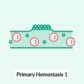
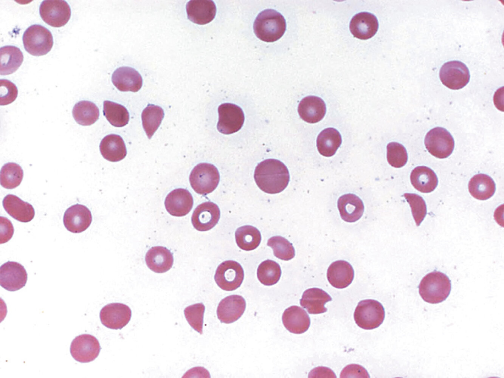

# Thrombotic thrombocytopenic purpura

*Categories: Clinical knowledge > Internal medicine > Hematology and oncology > Platelet and coagulation disorders > Thrombotic thrombocytopenic purpura*

[Original Article Link](https://coursology-qbank.com/amboss/article/xT0EG2)

---

## Summary

<u>Thrombotic</u> <u>thrombocytopenic purpura</u> (TTP) is a <u>thrombotic microangiopathy</u>, a condition in which microthrombi, consisting primarily of <u>platelets</u>, form and occlude the <u>microvasculature</u> (i.e., the <u>arterioles</u> and <u>capillaries</u>). TTP occurs primarily in adults and is typically due to acquired <u>autoantibodies</u> against a <u>proteolytic enzyme</u> (<u>ADAMTS13</u>) that cleaves <u>von Willebrand factor</u> (<u>vWF</u>). The classic pentad of findings (<u>fever</u>, neurological abnormalities, <u>thrombocytopenia</u>, <u>microangiopathic hemolytic anemia</u>, and impaired renal function) is seen in a minority of patients. TTP is a hematologic emergency. If TTP is strongly suspected and initial laboratory tests support the diagnosis, treatment with plasma exchange should begin immediately, as the condition may be fatal if left untreated.

---

## Epidemiology

* Primarily adult individuals (median age at diagnosis: ∼ 40 years)

* More common in women and in Black populations

Epidemiological data refers to the US, unless otherwise specified.

---

## Etiology

* <u>ADAMTS13</u> deficiency/inhibition [[1]](https://coursology-qbank.com/amboss/article/KoaU1l)

* Acquired TTP (∼ 95%): <u>autoantibodies</u> against <u>ADAMTS13</u> (see “Pathophysiology” below)

* Congenital TTP (∼ 5%): <u>gene mutations</u> resulting in deficiency of <u>ADAMTS13</u>

* <u>Risk factors</u> [[1]](https://coursology-qbank.com/amboss/article/KoaU1l)

* Systemic disease: cancer, <u>HIV</u>, <u>SLE</u>, infections

* <u>Pregnancy</u>

* Drugs

---

## Pathophysiology

TTP is a thrombotic microangiopathy, a condition in which microthrombi form and occlude the <u>microvasculature</u>. The other main <u>thrombotic microangiopathy</u> is <u>hemolytic uremic syndrome</u> (<u>HUS</u>). Although TTP and <u>HUS</u> share similarities in both pathophysiological findings and clinical features, these conditions differ in etiology; TTP, unlike <u>HUS</u>, is caused by a deficiency of <u>ADAMTS13</u>.

1. * <u>Autoantibodies</u> or <u>gene mutations</u> → deficiency of ADAMTS13;   (a metalloprotease that cleaves <u>von Willebrand factor</u>)
2. * ↓ Breakdown of <u>vWF</u> multimers → <u>vWF</u> multimers accumulate on <u>endothelial</u> cell surfaces
3. * <u>Platelet adhesion</u> and microthrombosis
4. * Microthrombi → fragmentation of <u>RBCs</u> with <u>schistocyte</u> formation → <u>hemolytic anemia</u>
5. * Arteriolar and <u>capillary</u> microthrombosis → end-organ <u>ischemia</u> and damage, especially in the <u>brain</u> and <u>kidneys</u> (potentially resulting in <u>acute kidney injury</u> or <u>stroke</u>)

> [!NOTE]
> <u>ADAMTS13</u> deficiency → excess <u>vWF</u> → microthrombus formation → blockage of small vessels → <u>RBC</u> fragmentation (<u>hemolysis</u>) and <u>end-organ damage</u>

Primary Hemostasis - Part 1: Platelet Adhesion

---

## Clinical features

TTP patients are typically previously healthy adults. <u>Microangiopathic hemolytic anemia</u> and <u>thrombocytopenia</u> may be the only presenting signs. However, the classic pentad of clinical findings consists of:  [[2]](https://coursology-qbank.com/amboss/article/poaL1l)[[3]](https://coursology-qbank.com/amboss/article/Pe1W_f0)[[4]](https://coursology-qbank.com/amboss/article/ke1m_f0)

* <u>Fever</u>

* Neurological signs and symptoms

* <u>Altered mental status</u>, <u>delirium</u>

* <u>Seizure</u>, focal defects, <u>stroke</u>

* <u>Headache</u>, <u>dizziness</u>

* <u>Low platelet count</u> (i.e. <u>thrombocytopenia</u>)

* <u>Petechiae</u>, <u>purpura</u>

* <u>Mucosal</u> bleeding

* Prolonged bleeding after minor cuts

* <u>Microangiopathic hemolytic anemia</u>

* Fatigue, <u>dyspnea</u>, and <u>pallor</u>

* <u>Jaundice</u>

* Impaired renal function

* <u>Hematuria</u>, <u>proteinuria</u>

* <u>Oliguria</u>, <u>anuria</u> (uncommon)

> [!NOTE]
> The typical patient is a previously healthy adult presenting with mental status changes, <u>fever</u>, <u>petechiae</u>, fatigue, and <u>pallor</u>. Laboratory tests will then indicate <u>hemolytic anemia</u> and possibly <u>acute kidney injury</u> (<u>AKI</u>). Impaired <u>kidney function</u> may not be present, and only a minority of patients will present with all five clinical findings.

> [!NOTE]
> “Nasty Fever Ruined My Tubes:” Neurological symptoms, Fever, Renal function impairment, Microangiopathic <u>hemolytic anemia</u>, Thrombocytopenia are the clinical features of TTP.

---

## Diagnosis

### Approach [[4]](https://coursology-qbank.com/amboss/article/ke1m_f0)

* Suspect TTP in patients with <u>microangiopathic hemolytic anemia</u> and <u>thrombocytopenia</u>.

* Obtain <u>laboratory studies</u> and targeted clinical history to:

* Calculate <u>PLASMIC score</u>

* Assess disease severity

* Confirm diagnosis (with <u>ADAMTS13</u> testing)

* Obtain further diagnostic studies as indicated to identify a secondary cause and rule out <u>thrombotic</u> complications.

### <u>Laboratory studies</u> [[4]](https://coursology-qbank.com/amboss/article/ke1m_f0)[[5]](https://coursology-qbank.com/amboss/article/Ze1Zxf0)

#### Initial tests [[3]](https://coursology-qbank.com/amboss/article/Pe1W_f0)[[6]](https://coursology-qbank.com/amboss/article/je1_Af0)[[7]](https://coursology-qbank.com/amboss/article/4e13_f0)

* <u>CBC</u>

* ↓ <u>Platelets</u> (typically < 30,000/mm³)

* ↓ <u>Hemoglobin</u>

* <u>Peripheral blood smear</u>  

* Large number of <u>schistocytes</u> (up to 4–8% of <u>RBCs</u>)

* Low number of <u>platelets</u>

* <u>Hemolysis studies</u>

* ↑ <u>Reticulocytes</u>

* ↓ <u>Haptoglobin</u>

* ↑ <u>LDH</u>

* Negative direct <u>Coombs test</u>

* <u>Coagulation studies</u> 

* Normal or mildly prolonged <u>prothrombin time</u> (<u>PT</u>) and <u>activated partial thromboplastin time</u> (<u>aPTT</u>)

* Normal or mildly elevated <u>fibrin degradation products</u> and <u>D-dimer</u> levels

* <u>Liver chemistries</u>: ↑ indirect <u>bilirubin</u>

* <u>BMP</u>: ↑ <u>BUN</u> and ↑ <u>creatinine</u> may be seen.

* <u>Troponin</u>: to rule out cardiac <u>ischemia</u>  [[4]](https://coursology-qbank.com/amboss/article/ke1m_f0)

* <u>Urinalysis</u>: <u>hematuria</u>, <u>proteinuria</u>

> [!NOTE]
> While <u>PT</u> and <u>aPTT</u> are normal or only mildly elevated in TTP and <u>HUS</u> (no <u>consumption coagulopathy</u>), they are markedly elevated in <u>disseminated intravascular coagulation</u> (consumption of <u>platelets</u> and all <u>coagulation factors</u>).

Schistocytes

Schistocytes

#### <u>Confirmatory tests</u> [[5]](https://coursology-qbank.com/amboss/article/Ze1Zxf0)[[6]](https://coursology-qbank.com/amboss/article/je1_Af0)

Obtain <u>ADAMTS13</u> activity and inhibitor testing in all patients.

* <u>ADAMTS13</u> activity 

* < 10%: positive (severe deficiency)

* 10–20%: borderline

* > 20%: negative

* <u>ADAMTS13</u> inhibitor or anti-<u>ADAMTS13</u> <u>IgG</u>

* Positive: immune-mediated TTP

* Negative: Further testing (e.g., <u>genetic testing</u>) may be indicated to assess for congenital TTP.

> [!WARNING]
> Obtain <u>ADAMTS13</u> testing before the initiation of plasma exchange or administration of <u>blood products</u>; do not delay treatment waiting for results. [[4]](https://coursology-qbank.com/amboss/article/ke1m_f0)

### <u>PLASMIC score</u>

The <u>PLASMIC score</u> is a clinical risk assessment tool, based on easily attainable clinical information, that is used to predict the likelihood of severe <u>ADAMTS13</u> deficiency in patients with suspected TTP. The total score helps direct further management.

| PLASMIC score [[5]](https://coursology-qbank.com/amboss/article/Ze1Zxf0)[[8]](https://coursology-qbank.com/amboss/article/vh1Afg0) |  |  |
| --- | --- | --- |
| Criteria |  | Points |
| <u>Platelet count</u> < 30,000/mm³ |  | 1 |
|  <u>Hemolysis</u>   * <u>Indirect bilirubin</u> > 2 mg/dL  * OR <u>reticulocyte count</u> > 2.5%  * OR undetectable <u>haptoglobin</u>     |  | 1 |
| No active <u>malignancy</u> in the past year |  | 1 |
| No history of <u>stem cell</u> or <u>solid organ transplant</u> |  | 1 |
| <u>MCV</u> < 90 μm³ |  | 1 |
| <u>INR</u> < 1.5 |  | 1 |
| Serum <u>creatinine</u> < 2.0 mg/dL |  | 1 |
|  Likelihood of severe <u>ADAMTS13</u> activity deficiency (activity level < 10%) [[5]](https://coursology-qbank.com/amboss/article/Ze1Zxf0)   * Total score 0–4 points: 0–4% (low risk)  * Total score 5 points: 5–24% (intermediate risk)  * Total score 6–7 points: 62–82% (high risk)     |  |  |

PLASMIC Score for TTP

> [!TIP]
> <u>PLASMIC score</u> criteria include Platelets, hemoLysis, no Active <u>malignancy</u>, no Solid or Stem-cell transplant, MCV, INR, Creatinine.

### Additional testing [[3]](https://coursology-qbank.com/amboss/article/Pe1W_f0)

Consider the following studies as indicated to identify serious complications and secondary causes of TTP.

* Studies to identify secondary causes (e.g., <u>pregnancy</u>, <u>SLE</u>, <u>HIV</u>, <u>malignancy</u>)

* <u>ECG</u>: to assess for <u>myocardial infarction</u>; may show <u>repolarization</u> abnormalities

* CT or <u>MRI</u> <u>brain</u>: to assess for <u>stroke</u>

---

## Differential diagnoses

See “<u>Differential diagnosis of platelet disorders</u>”, “<u>Diagnostic studies for hemolytic anemia</u>”, and “<u>Diagnostics in suspected MAHA</u>.”

The differential diagnoses listed here are not exhaustive.

---

## Treatment

### Approach [[4]](https://coursology-qbank.com/amboss/article/ke1m_f0)[[5]](https://coursology-qbank.com/amboss/article/Ze1Zxf0)

* Admit all patients with suspected or confirmed TTP to an <u>ICU</u>.

* Obtain prompt <u>central venous access</u>.

* Provide <u>supportive care</u> for all patients.

* Consult <u>hematology</u> for guidance.

* Initiate empiric treatment with:

* Plasma exchange therapy

* <u>Glucocorticoids</u>

* Provide targeted treatment if <u>ADAMTS13</u> activity levels are available.

> [!WARNING]
> TTP requires urgent diagnosis and treatment. Do not delay treatment while awaiting test results to confirm <u>ADAMTS13</u> deficiency.

### <u>Supportive care</u> [[4]](https://coursology-qbank.com/amboss/article/ke1m_f0)

* Monitoring

* Continuous <u>pulse oximetry</u> and <u>cardiac telemetry</u>

* Serial <u>neurological examination</u>s

* Fluids and <u>electrolytes</u>

* Correct <u>electrolyte</u> disturbances.

* Provide <u>intravenous fluid therapy</u> as indicated.

* Identify and correct <u>acid-base disorders</u>.

* <u>Transfusions</u>

* Avoid prophylactic <u>platelet transfusions</u>.

* Consider therapeutic <u>platelet transfusions</u> for patients who are bleeding or require an invasive procedure.

* <u>RBC</u> <u>transfusions</u>: Follow a restrictive <u>transfusion</u> strategy (consider <u>pRBC transfusion</u> if <u>Hb</u> is ≤ 7 g/dL). [[9]](https://coursology-qbank.com/amboss/article/Z31ZSg0)

* <u>VTE prophylaxis</u>

* <u>Mechanical VTE prophylaxis</u>: if <u>platelet</u> level is < 50,000/mm³

* <u>Pharmacological VTE prophylaxis</u>: if <u>platelet</u> level is ≥ 50,000/mm³

### Empiric therapy [[4]](https://coursology-qbank.com/amboss/article/ke1m_f0)

* Initiate treatment in consultation with <u>hematology</u>.

* Prompt initiation of plasma exchange therapy (PEX)

* High-dose <u>glucocorticoids</u> (<u>off label</u>) 

* <u>Prednisone</u> DOSAGE [[4]](https://coursology-qbank.com/amboss/article/ke1m_f0)

* OR <u>methylprednisolone</u> DOSAGE [[4]](https://coursology-qbank.com/amboss/article/ke1m_f0)

* Patients with a high <u>pretest probability</u> of TTP (based on clinical judgment or PLASMIC score ≥ 6)

* Consider early caplacizumab if <u>ADAMTS13</u> activity testing is available.  [[10]](https://coursology-qbank.com/amboss/article/h21chT0)

* Humanized bivalent variable-domain <u>antibody</u> used in the treatment of acquired or immune-mediated TTP

* Prevents <u>microvascular</u> <u>thrombosis</u> by inhibiting the interaction of <u>vWF</u> and <u>platelets</u>

* Consider <u>rituximab</u> if <u>ADAMTS13</u> activity testing is not available.

> [!WARNING]
> Do not start <u>caplacizumab</u> if there is no access to <u>ADAMTS13</u> activity testing, regardless of the <u>pretest probability</u> of TTP. [[5]](https://coursology-qbank.com/amboss/article/Ze1Zxf0)

### Response to treatment [[11]](https://coursology-qbank.com/amboss/article/S21yST0)

Clinical signs of response include : [[7]](https://coursology-qbank.com/amboss/article/4e13_f0)

* <u>Platelet</u> level: sustained ≥ 150,000/mm³

* <u>LDH</u>: < 1.5× the <u>ULN</u>

* No signs of new or worsening <u>ischemic</u> organ injury

---

## Complications

TTP can result in microthrombus formation and complications in many organs of the body. [[12]](https://coursology-qbank.com/amboss/article/G_aBpM)

* <u>CNS</u>: <u>seizures</u>, <u>coma</u>, <u>stroke</u>, <u>paresis</u>

* <u>GI tract</u>: hemorrhagic <u>colitis</u>; bowel <u>necrosis</u>, perforation, stricture; <u>peritonitis</u>; <u>intussusception</u>

* <u>Heart</u>: <u>ischemia</u> and <u>fluid overload</u>

* <u>Pancreas</u>: transient or permanent <u>diabetes mellitus</u>

* <u>Liver</u>: <u>hepatomegaly</u>, <u>transaminase</u> elevations

* <u>Kidney</u>: <u>hypertension</u>, <u>chronic kidney disease</u> (<u>CKD</u>), end-stage renal disease (<u>ESRD</u>)

We list the most important complications. The selection is not exhaustive.

---

## Prognosis

The prognosis depends primarily on prompt initiation of treatment. Timely treatment can prevent acute complications (<u>AKI</u>, <u>coma</u>, and <u>death</u>), as well as progression to <u>chronic renal failure</u>.

* The <u>mortality rate</u> of TTP is favorable with treatment: 10–20%

---