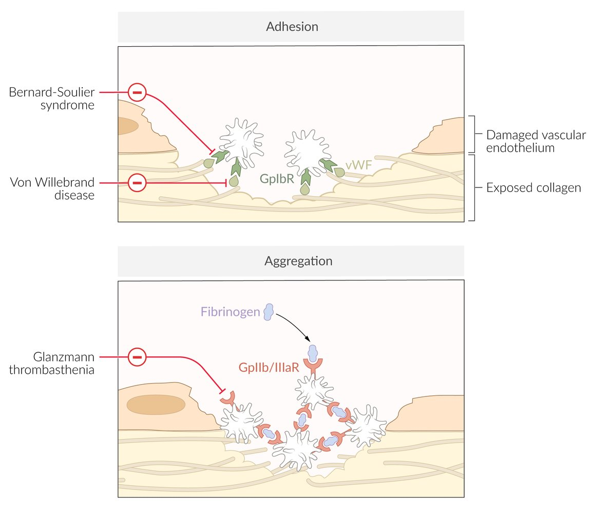

# von Willebrand disease

*Categories: Clinical knowledge > Internal medicine > Hematology and oncology > Platelet and coagulation disorders > von Willebrand disease*

[Original Article Link](https://coursology-qbank.com/amboss/article/Fr0gQh)

---

## Summary

Von Willebrand disease (vWD) is a <u>bleeding disorder</u> characterized by a deficiency or dysfunction of <u>von Willebrand factor</u> (<u>vWF</u>). vWD is the most common congenital <u>bleeding disorder</u>, affecting approximately 1% of the US population. <u>vWF</u> is involved in <u>platelet adhesion</u> and prevents degradation of <u>factor VIII</u>; therefore, <u>vWF</u> deficiency or dysfunction impairs <u>primary hemostasis</u> as well as the <u>intrinsic pathway of secondary hemostasis</u>. In most cases, vWD is an inherited disorder caused by mutations in the <u>vWF</u> <u>gene</u>. Acquired vWD (aVWD) is rare and often occurs due to an underlying condition (e.g., <u>malignancy</u>, autoimmune disease, cardiovascular disorder). vWD may be asymptomatic or manifest with abnormal bleeding (e.g., <u>epistaxis</u>, <u>heavy menstrual bleeding</u>, prolonged bleeding after surgical procedures). Diagnosis is confirmed by low <u>vWF</u> <u>antigen</u> and/or activity levels. Pharmacological treatment is indicated for active bleeding, pre-procedure prophylaxis, and management of <u>heavy menstrual bleeding</u>. Treatment options for vWD include <u>desmopressin</u> and <u>vWF</u>/<u>factor VIII</u> concentrates. Management for <u>avWD</u> additionally includes investigations for the underlying cause and treatment based on the underlying cause.

Bleeding disorders USMLE-style question walkthrough

---

## Epidemiology

* Most common congenital <u>bleeding disorder</u>  [[1]](https://coursology-qbank.com/amboss/article/gLbFC8)

* <u>Prevalence</u>: estimated to affect approx. 1% of the US population [[1]](https://coursology-qbank.com/amboss/article/gLbFC8)

Epidemiological data refers to the US, unless otherwise specified.

---

## Etiology

|  Variants of von Willebrand disease [[2]](https://coursology-qbank.com/amboss/article/yvddcH0)[[3]](https://coursology-qbank.com/amboss/article/jDd_VH0)  |  |  |  |  |
| --- | --- | --- | --- | --- |
| Type |  | Description | Etiology | Mechanism |
|  Inherited von Willebrand disease 13576 |  Type 1 (60–70%) [[2]](https://coursology-qbank.com/amboss/article/yvddcH0)  |  * vWD caused by mutations in the <u>vWF</u> <u>gene</u>   |  * <u>Autosomal dominant inheritance</u>   |  * Mild to moderate deficiency of <u>vWF</u> and <u>factor VIII</u>   |
|  Type 2 (20–30%) [[2]](https://coursology-qbank.com/amboss/article/yvddcH0)   |  * <u>Autosomal dominant inheritance</u>   |  * Dysfunctional <u>vWF</u>   |  |  |
|  Type 3 (5–10%) [[2]](https://coursology-qbank.com/amboss/article/yvddcH0)  |  * <u>Autosomal recessive inheritance</u>   |  * Complete absence of <u>vWF</u> and <u>factor VIII</u>   |  |  |
| Acquired von Willebrand disease (<u>avWD</u>) |  |  * <u>vWF</u> deficiency that occurs secondary to other medical conditions [[3]](https://coursology-qbank.com/amboss/article/jDd_VH0)   |   * Lymphoproliferative and <u>myeloproliferative disorders</u> (e.g., <u>multiple myeloma</u>, <u>MGUS</u>, <u>lymphoma</u>, <u>essential thrombocythemia</u>)  * Solid organ cancers  * Autoimmune diseases (e.g., <u>SLE</u>)  * Cardiovascular disorders (e.g., <u>ventricular septal defect</u>, <u>aortic stenosis</u>)  * <u>Uremia</u>  * <u>Hypothyroidism</u>  * Adverse effects of certain drugs (e.g., <u>valproic acid</u>)    |  * Unknown   |

---

## Pathophysiology

Deficiency or dysfunction of <u>vWF</u> leads to:

* Dysfunctional <u>platelet adhesion</u> → impaired <u>primary hemostasis</u>

* Reduced binding of <u>factor VIII</u> → increased degradation → ↓ <u>factor VIII</u> activity → impaired <u>intrinsic pathway of secondary hemostasis</u>

Congenital disorders affecting primary hemostasis

---

## Clinical features

Symptom severity varies between the different types of vWD. Type 1 and <u>avWD</u> usually have milder manifestations; type 3 is the most severe form. [[2]](https://coursology-qbank.com/amboss/article/yvddcH0)[[4]](https://coursology-qbank.com/amboss/article/VLbG98)

* May be asymptomatic

* Symptomatic individuals may develop the following symptoms: 

* Mucocutaneous bleeding

* <u>Ecchymoses</u>, easy <u>bruising</u>

* <u>Epistaxis</u>

* Bleeding of <u>gingiva</u> and <u>gums</u>

* <u>Petechiae</u>

* Prolonged bleeding from minor injuries

* Bleeding after surgical procedures or <u>tooth</u> extraction

* <u>GI bleeding</u> (can be caused by <u>angiodysplasia</u>)

* <u>Heavy menstrual bleeding</u> (affects up to 92% of women with vWD) [[5]](https://coursology-qbank.com/amboss/article/XKb9Uu)

* <u>Postpartum hemorrhage</u>

* Severe cases: large <u>hematomas</u>, <u>hemarthrosis</u>, life-threatening bleeding (e.g., during <u>childbirth</u>)

---

## Diagnosis

See also “<u>Diagnostic workup of bleeding disorders</u>” for a general workup of patients presenting with <u>bleeding diathesis</u>.

### Approach [[6]](https://coursology-qbank.com/amboss/article/OvdIZH0)

* Suspect vWD in patients with:

* Abnormal bleeding

* A positive <u>family history</u>

* <u>Bleeding assessment tools</u> (BATs) can help assess the likelihood of vWD.

* Refer patients to <u>hematology</u> if there is high clinical suspicion for a <u>bleeding disorder</u>, even if BAT score is normal. [[2]](https://coursology-qbank.com/amboss/article/yvddcH0)

* Routine <u>laboratory studies</u> (e.g., <u>CBC</u>, <u>coagulation studies</u>) may show supportive findings.

* vWD studies are required to confirm the diagnosis.

> [!TIP]
> Inherited vWD typically manifests with recurrent bleeding episodes from childhood.

### Initial studies

#### Routine <u>laboratory studies</u> [[6]](https://coursology-qbank.com/amboss/article/OvdIZH0)[[7]](https://coursology-qbank.com/amboss/article/SpbyKu)

* <u>CBC</u>

* <u>Platelet count</u>: normal or ↓

* <u>Hb</u>: normal or ↓ (due to prolonged bleeding, e.g., heavy <u>menses</u>) [[2]](https://coursology-qbank.com/amboss/article/yvddcH0)

* <u>Coagulation studies</u>

* <u>aPTT</u>: normal or ↑ (due to <u>factor VIII</u> deficiency)

* <u>PT</u>: normal

* <u>Mixing study</u> (rarely performed in practice): In inherited vWD, a prolonged <u>aPTT</u> will normalize. [[7]](https://coursology-qbank.com/amboss/article/SpbyKu)

* <u>Ferritin</u>: normal or ↓ (due to prolonged bleeding) [[2]](https://coursology-qbank.com/amboss/article/yvddcH0)

> [!TIP]
> Normal <u>CBC</u> and <u>coagulation studies</u> do not rule out vWD. [[6]](https://coursology-qbank.com/amboss/article/OvdIZH0)

#### vWD studies [[2]](https://coursology-qbank.com/amboss/article/yvddcH0)[[6]](https://coursology-qbank.com/amboss/article/OvdIZH0)

* Diagnosis requires the assessment of both:

* <u>vWF</u> <u>antigen</u> levels using a <u>vWF</u> <u>antigen</u> assay

* <u>Platelet</u>-dependent <u>vWF</u> activity, e.g., using:

* <u>vWF:GpIbR</u>

* <u>Ristocetin cofactor assay</u> (measures <u>platelet</u> agglutination)

* vWD is diagnosed if <u>vWF</u> <u>antigen</u> levels and/or <u>vWF</u> activity are low (i.e., < 30 IU/dL;  without bleeding or < 50 IU/dL with abnormal bleeding).

* Further studies can help confirm the diagnosis and identify the subtype.

* <u>Factor VIII</u> activity: may be low, e.g., in type 3 vWD, or normal

* <u>Platelet</u>-dependent <u>vWF</u> activity/<u>vWF</u> <u>antigen</u> <u>ratio</u>: may be low (< 0.7), e.g., in type 2 vWD, or normal

> [!TIP]
> Factors such as <u>pregnancy</u>, hormonal therapy, and illness can affect vWD study results. If clinical suspicion for vWD is high, these studies should be repeated once the patient is back to their baseline. [[2]](https://coursology-qbank.com/amboss/article/yvddcH0)

### Advanced studies [[2]](https://coursology-qbank.com/amboss/article/yvddcH0)[[6]](https://coursology-qbank.com/amboss/article/OvdIZH0)

Subsequent studies are specialist-guided.

* Studies to confirm subtype of inherited vWD, e.g.: 

* <u>vWF</u> multimer analysis

* <u>vWF</u> <u>collagen</u> binding/<u>vWF</u> <u>antigen</u> <u>ratio</u>

* <u>Genetic testing</u>

* Studies for <u>avWD</u> [[3]](https://coursology-qbank.com/amboss/article/jDd_VH0)

* Anti-<u>vWF</u> <u>antibody</u>: to help assess severity

* Evaluation for the underlying cause (e.g., <u>malignancy</u>, autoimmune diseases) based on the clinical picture

---

## Management

### General principles [[2]](https://coursology-qbank.com/amboss/article/yvddcH0)[[8]](https://coursology-qbank.com/amboss/article/lvdvZH0)

* Management is specialist-guided; consult <u>hematology</u>.

* The treatment approach is shaped by the clinical context, type of vWD, and vWD severity.

* Advise patients to avoid contact sports and/or activities with a high risk of <u>head injury</u>.

* Identify and treat the underlying cause of <u>avWD</u>.  [[3]](https://coursology-qbank.com/amboss/article/jDd_VH0)

* Indications for pharmacological treatment for vWD include:  [[9]](https://coursology-qbank.com/amboss/article/AvdRcH0)

* Active bleeding

* Pre-procedure prophylaxis

* Manage complications (e.g., <u>iron deficiency anemia</u>).

* For patients with <u>heavy menstrual bleeding</u>: Consider hormonal treatment (e.g., <u>oral contraceptives</u>, <u>progestin intrauterine device</u>).

> [!WARNING]
> <u>Platelet aggregation</u> inhibitors (e.g., <u>aspirin</u>, <u>NSAIDs</u>, <u>clopidogrel</u>) should be used with caution in vWD because they further increase the risk of bleeding. [[8]](https://coursology-qbank.com/amboss/article/lvdvZH0)

### Pharmacological treatment for vWD [[2]](https://coursology-qbank.com/amboss/article/yvddcH0)[[8]](https://coursology-qbank.com/amboss/article/lvdvZH0)

#### Inherited vWD

* <u>Desmopressin</u>

* Preferred initial agent in type 1 vWD and some individuals with type 2 vWD for:  

* Mild to moderate active bleeding

* Prophylaxis for minor <u>surgery</u> or procedure

* Consider a <u>desmopressin</u> trial to confirm adequate response.

* <u>vWF</u>/<u>factor VIII</u> concentrate

* Used for: [[2]](https://coursology-qbank.com/amboss/article/yvddcH0) 

* <u>Major bleeding</u> or major <u>surgery</u> in any type of vWD

* Any active bleeding or pre-procedure prophylaxis when <u>desmopressin</u> is not effective or contraindicated

* May be considered as long-term prophylaxis for patients with severe, frequent bleeding

* <u>Antifibrinolytics</u> (e.g., <u>tranexamic acid</u>) [[8]](https://coursology-qbank.com/amboss/article/lvdvZH0)[[9]](https://coursology-qbank.com/amboss/article/AvdRcH0)

* Often used as an adjunct to <u>desmopressin</u> or <u>vWF</u>/<u>factor VIII</u> concentrate

* May be used alone as prophylaxis for very minor procedures or <u>heavy menstrual bleeding</u> [[2]](https://coursology-qbank.com/amboss/article/yvddcH0)[[8]](https://coursology-qbank.com/amboss/article/lvdvZH0)

> [!NOTE]
> <u>Desmopressin</u> stimulates the release of stored <u>vWF</u> from <u>endothelial</u> cells and is therefore not effective for type 3 vWD because there is no <u>vWF</u> to be released. [[8]](https://coursology-qbank.com/amboss/article/lvdvZH0)

#### Acquired vWD [[3]](https://coursology-qbank.com/amboss/article/jDd_VH0)

* Treatment of the underlying cause

* <u>Desmopressin</u> or <u>vWF</u>/<u>factor VIII</u> concentrate can be used, but they are often less effective than in inherited vWD.

* Consider immunomodulatory interventions (e.g., if the underlying disorder cannot be treated) [[3]](https://coursology-qbank.com/amboss/article/jDd_VH0)

* <u>IVIg</u>

* <u>Plasmapheresis</u>

### Approach to active bleeding [[2]](https://coursology-qbank.com/amboss/article/yvddcH0)[[8]](https://coursology-qbank.com/amboss/article/lvdvZH0)

* For patients with severe bleeding: See "<u>Hemorrhagic shock</u>."

* Start pharmacological treatment for vWD.

* Identify and treat the source of bleeding (e.g., with <u>upper endoscopy</u>).

* For patients with <u>heavy menstrual bleeding</u>:

* Consider underlying gynecologic conditions.

* See also "<u>Diagnosis of abnormal uterine bleeding</u>."

---