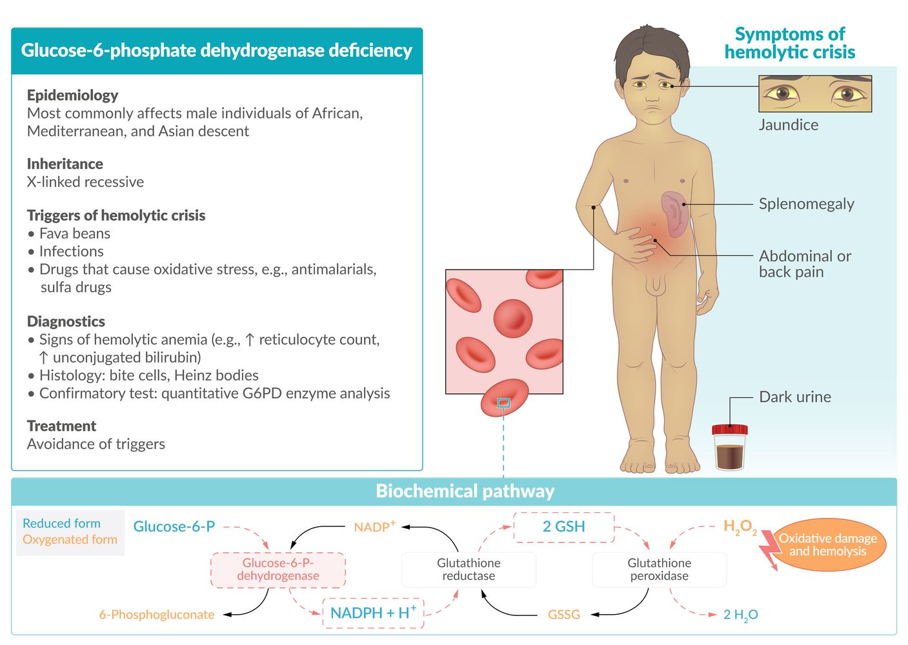
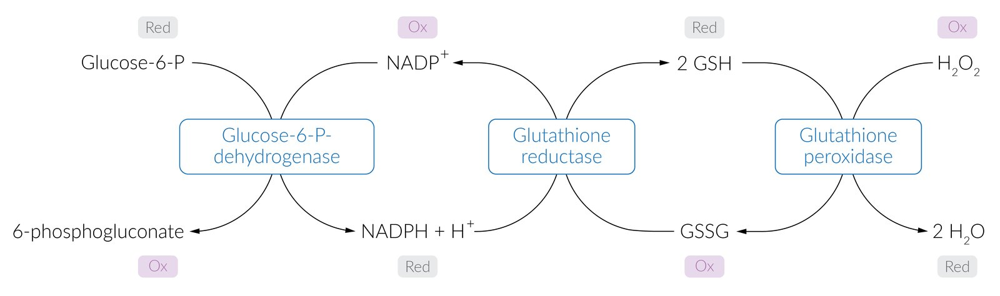
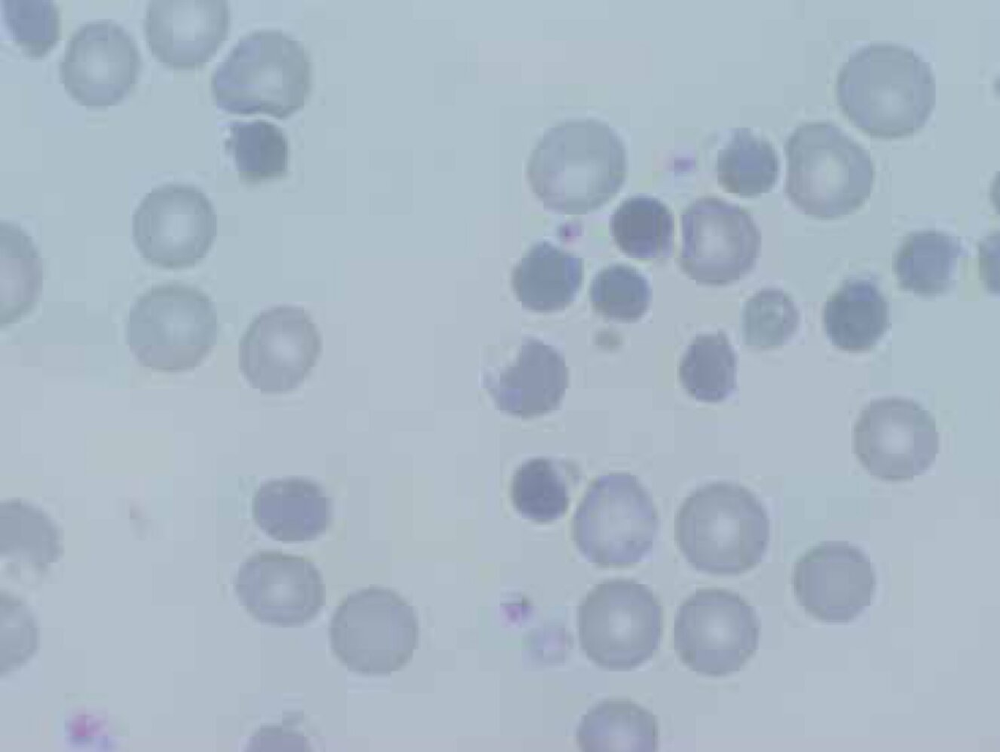

# Glucose-6-phosphate dehydrogenase deficiency

*Categories: Clinical knowledge > Internal medicine > Hematology and oncology > Red blood cell disorders > Glucose-6-phosphate dehydrogenase deficiency*

[Original Article Link](https://coursology-qbank.com/amboss/article/HT0KH2)

---

## Summary

<u>Glucose-6-phosphate dehydrogenase</u> (<u>G6PD</u>) deficiency leads to an impaired <u>regeneration</u> of <u>reduced glutathione</u>, an important antioxidant, which makes <u>RBCs</u> more susceptible to oxidative <u>stress</u> and can result in episodic <u>hemolytic anemia</u>. The condition is inherited in an <u>X-linked recessive</u> pattern and is the most common human enzyme deficiency worldwide. It primarily affects males of African, Asian, and Mediterranean descent. <u>G6PD</u> deficiency is usually asymptomatic, but a sudden surge in oxidative <u>stress</u> (e.g., after infection, consumption of fava beans, or various drugs) may lead to a life-threatening <u>hemolytic crisis</u>. Diagnostic findings include signs of <u>intravascular hemolysis</u> (e.g., <u>normocytic anemia</u>, ↑ <u>LDH</u>, and ↓ <u>haptoglobin</u>), <u>Heinz bodies</u>, and <u>bite cells</u> on <u>blood smear</u>. Management mainly consists of preventing <u>hemolysis</u> by avoiding triggers.

Glucose-6-phosphate dehydrogenase (G6PD) deficiency fact sheet

---

## Epidemiology

* <u>G6PD</u> deficiency is the most common human enzyme deficiency.

* <u>Prevalence</u>: ∼ 400 million worldwide  [[1]](https://coursology-qbank.com/amboss/article/hoacbl)

* Affects primarily males of African, Mediterranean, and Asian descent [[2]](https://coursology-qbank.com/amboss/article/ioaJbl)

Epidemiological data refers to the US, unless otherwise specified.

---

## Pathophysiology

* <u>X-linked recessive</u> inheritance

* G6PD is the <u>rate-limiting enzyme</u> of the <u>pentose phosphate pathway</u> (also known as the <u>hexose monophosphate shunt</u>). This pathway yields <u>NADPH</u>, which is essential for converting oxidized glutathione back to its reduced form. Reduced glutathione is capable of neutralizing <u>reactive oxygen species</u> (<u>ROS</u>) and <u>free radicals</u> and therefore protecting <u>RBCs</u> from oxidative damage.

* In the absence of <u>reduced glutathione</u> (e.g., due to <u>G6PD</u> deficiency), <u>RBCs</u> become susceptible to oxidative <u>stress</u> that can damage <u>erythrocyte</u> membranes, resulting in <u>intravascular</u> and <u>extravascular hemolysis</u>.

* Causes of increased oxidative <u>stress</u> are triggers of <u>hemolytic crisis</u> and include:

* Fava beans

* Drugs: <u>antimalarial drugs</u> (e.g., <u>chloroquine</u>, <u>primaquine</u>), <u>sulfa drugs</u> (e.g., <u>trimethoprim-sulfamethoxazole</u>), <u>nitrofurantoin</u>, <u>isoniazid</u>, <u>dapsone</u>, <u>NSAIDs</u>, <u>ciprofloxacin</u>, <u>chloramphenicol</u>

* Bacterial and viral infections (most common cause): Severe enzymatic deficiency can inhibit <u>respiratory burst</u> activity due to reduced <u>NADPH</u> production in <u>phagocytes</u>.

* Inflammation: During an inflammatory reaction <u>free radicals</u> are produced and can diffuse into <u>RBCs</u>.

* <u>Metabolic acidosis</u>

Reduction and oxidation reactions of glutathione

---

## Clinical features

* Most patients are asymptomatic.

* Recurring <u>hemolytic crises</u> may occur, especially following triggers

* Arise within 2–3 days after increased oxidative <u>stress</u> [[3]](https://coursology-qbank.com/amboss/article/gpXFK_)

* Sudden onset of back or abdominal <u>pain</u>

* <u>Jaundice</u>

* Dark urine

* Transient <u>splenomegaly</u>

* Recurrent severe infections causing symptoms of <u>chronic granulomatous disease</u>

---

## Diagnosis

* <u>Blood smear</u>

* <u>Heinz bodies</u>: Oxidative <u>stress</u> causes <u>hemoglobin</u> <u>denaturation</u>. <u>Hemoglobin</u> then precipitates as small <u>inclusions</u> within the <u>erythrocytes</u>.

* <u>Bite cells</u>: due to <u>macrophages</u> selectively removing the denatured <u>hemoglobin</u> <u>inclusions</u> of <u>RBCs</u>

* Signs of <u>intravascular</u> <u>hemolysis</u>

* <u>Normocytic anemia</u>

* ↑ <u>Reticulocyte count</u>

* ↑ <u>Unconjugated bilirubin</u>

* ↑ <u>LDH</u>

* ↓ <u>Haptoglobin</u>

* <u>Hemoglobinuria</u> [[2]](https://coursology-qbank.com/amboss/article/ioaJbl)

* <u>Screening test</u>: fluorescent spot test

* Add <u>glucose-6-phosphate</u> and <u>NADP</u> → measure <u>NADPH</u> fluorescence

* Normal <u>G6PD</u> activity produces fluorescent <u>NADPH</u> out of <u>NADP</u>, while in <u>G6PD</u> deficiency a lack of fluorescence is seen.

* Semi-quantitative

* <u>Confirmatory test</u>: : quantitative <u>G6PD</u> enzyme analysis

Ideally, both the screening and confirmatory tests should be performed during remission.

> [!TIP]
> <u>Stress</u> makes me want to bite into some Heinz ketchup: ↑ Oxidative <u>stress</u> in patients with <u>G6PD</u> deficiency may lead to the detection of <u>Heinz bodies</u> and <u>bite cells</u> on the <u>peripheral blood smear</u>.

Heinz bodies

Heinz bodies

Bite cells in glucose-6-phosphate dehydrogenase (G6PD) deficiency

---

## Treatment

* Avoid triggers (see “Pathophysiology” above)

* <u>Blood transfusions</u> should be performed only in rare, severe cases.

---

## Miscellaneous

* Selective advantage in areas of <u>endemic</u> <u>malaria</u>: : As with <u>sickle cell anemia</u>, carriers of the <u>G6PD</u> deficiency may be less severely affected by <u>malaria</u>, especially if the disease is caused by <u>Plasmodium falciparum</u>.  [[4]](https://coursology-qbank.com/amboss/article/Qoaubl)

---