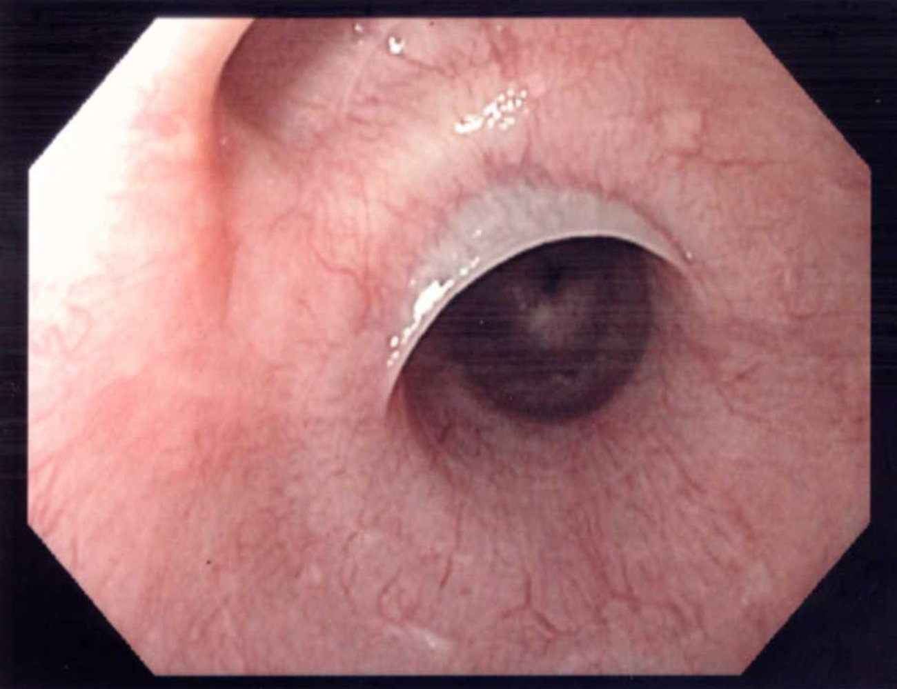
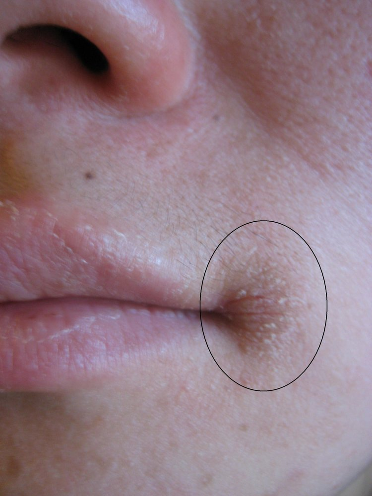
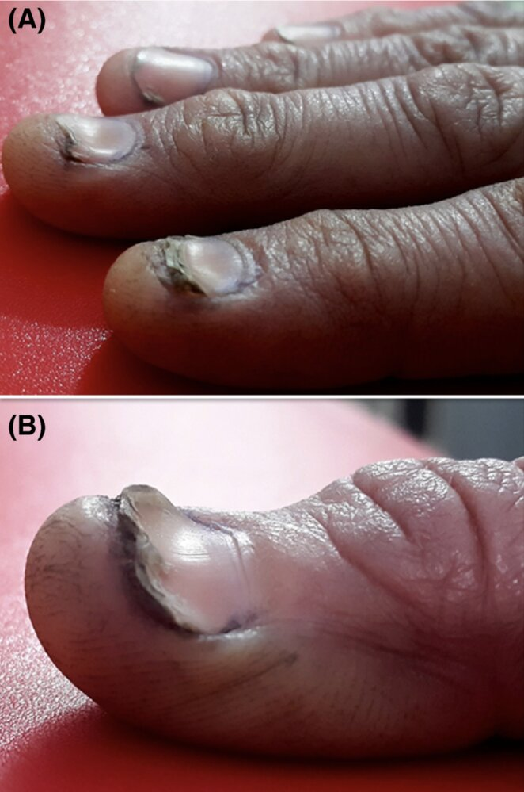
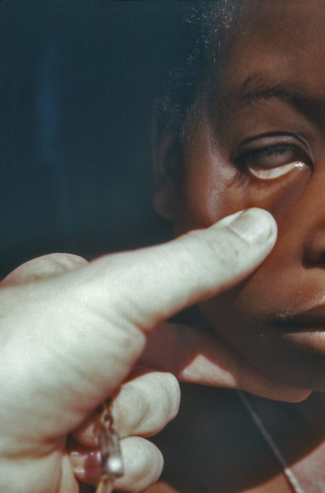
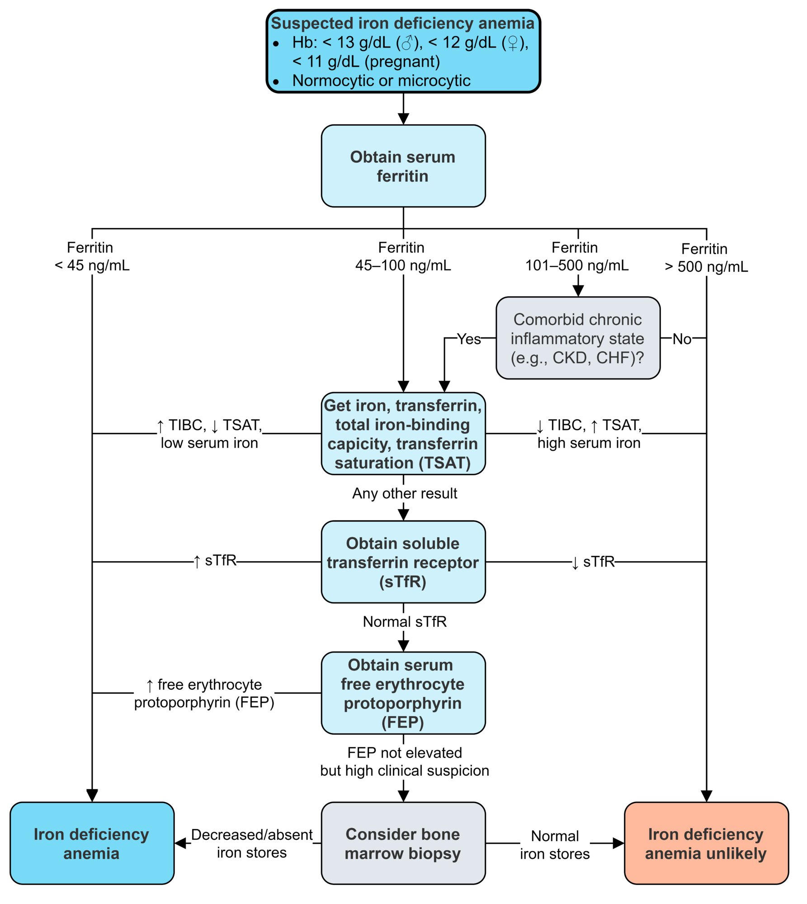
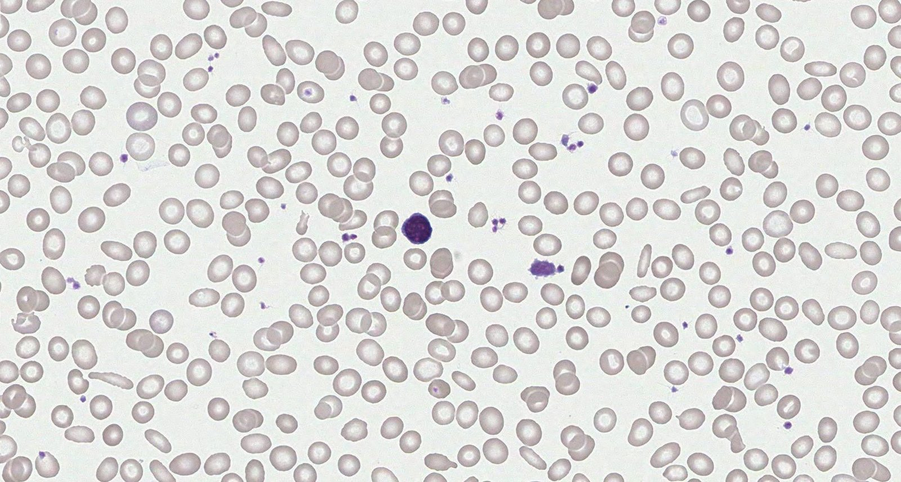
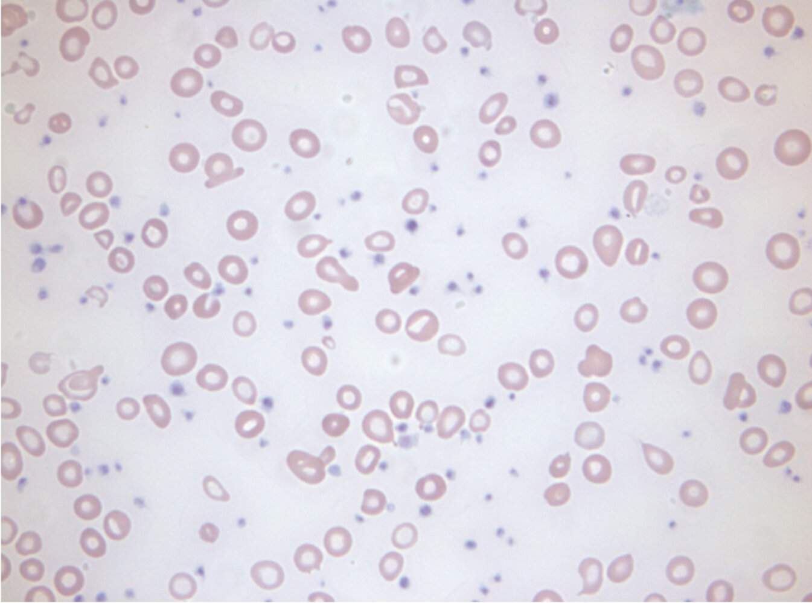
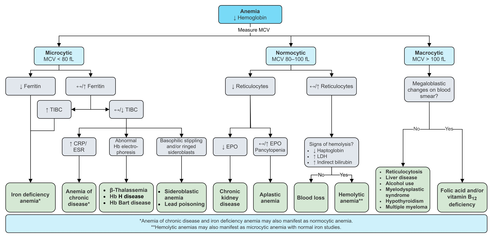

# Iron deficiency anemia

*Categories: Clinical knowledge > Internal medicine > Hematology and oncology > Red blood cell disorders > Iron deficiency anemia*

[Original Article Link](https://coursology-qbank.com/amboss/article/pT0L72)

---

## Summary

<u>Iron</u> deficiency <u>anemia</u> (IDA) is the most common form of <u>anemia</u> worldwide and is caused by inadequate intake, decreased absorption (e.g., <u>atrophic gastritis</u>, <u>inflammatory bowel disease</u>), increased demand (e.g., during <u>pregnancy</u>), or increased loss (e.g., <u>gastrointestinal bleeding</u>, <u>menorrhagia</u>) of <u>iron</u>. Prolonged deficiency depletes <u>iron stores</u> in the body, resulting in decreased <u>erythropoiesis</u> and <u>anemia</u>. Symptoms are nonspecific and include fatigue, <u>pallor</u>, <u>lethargy</u>, <u>hair</u> loss, <u>brittle nails</u>, and <u>pica</u>. Routine screening is only recommended for certain groups. IDA typically manifests as <u>hypochromic</u>, <u>microcytic anemia</u>, but it may also be <u>normocytic</u>. If diagnostic confirmation is needed, a low <u>ferritin</u> level indicates an <u>iron</u> deficiency, but additional <u>iron studies</u> may be necessary. Once IDA is confirmed, the underlying cause must be determined. In adults, this typically involves a <u>gastroscopy</u> and <u>colonoscopy</u> or, in women with <u>abnormal uterine bleeding</u>, a gynecologic workup. In children, a thorough history and review of symptoms, including a comprehensive dietary history, can help direct any further diagnostic evaluation. Patients with <u>anemia</u> severe enough to cause cardiopulmonary instability, or pregnant patients with a <u>Hb</u> < 6 g/dL, require <u>blood transfusions</u>. All other patients can be managed with oral or parenteral <u>iron</u> supplementation.

See also “<u>Anemia</u>.”

Iron deficiency anemia fact sheet

---

## Epidemiology

* Most common form of <u>anemia</u> worldwide [[1]](https://coursology-qbank.com/amboss/article/ImYYSp)

* ∼ 3% of the general population in the US is affected. [[2]](https://coursology-qbank.com/amboss/article/Y0aneQ)

* African American and Mexican American populations in the US are at increased risk.

* <u>Prevalence</u> is highest in: [[3]](https://coursology-qbank.com/amboss/article/WUYPXo)

* Children up to 5 years of age (see “<u>IDA in children and adolescents</u>”)

* <u>Adolescent</u> and <u>premenopausal</u> adult females (due to menstrual blood loss)

* Pregnant women (see “<u>IDA in pregnancy</u>”)

Epidemiological data refers to the US, unless otherwise specified.

---

## Etiology

### Based on age [[1]](https://coursology-qbank.com/amboss/article/ImYYSp)[[4]](https://coursology-qbank.com/amboss/article/wmYh3p)

The most common causes of IDA in different age groups include:

* Older adults > 50 years

* Resource-rich countries: <u>colon polyps</u>/<u>carcinoma</u>

* Resource-limited countries: <u>hookworm infections</u>, e.g., <u>Ancylostoma duodenale</u>, <u>Necator americanus</u>

* Adults < 50 years

* Female individuals: <u>menorrhagia</u>, <u>pregnancy</u> (see “<u>IDA in pregnancy</u>”)

* Male individuals: <u>peptic ulcer disease</u>

* Children: See “<u>Risk factors for pediatric IDA</u>.”

> [!TIP]
> In resource-rich countries, adults aged > 50 years who present with IDA should have <u>colon polyps</u>/<u>carcinoma</u> ruled out as a potential underlying etiology.

### Based on underlying mechanism [[4]](https://coursology-qbank.com/amboss/article/wmYh3p)[[5]](https://coursology-qbank.com/amboss/article/V0aGUQ)[[6]](https://coursology-qbank.com/amboss/article/VUYGXo)

#### <u>Iron</u> losses

* Bleeding

* <u>Gastrointestinal bleeding</u>

* Occult gastrointestinal <u>malignancy</u> (e.g., <u>colon cancer</u>)

* <u>Hookworm</u> <u>infestation</u> (e.g., Ancylostoma spp., <u>N. americanus</u>)

* <u>Peptic ulcer disease</u>

* Increased risk with <u>NSAID</u> use [[7]](https://coursology-qbank.com/amboss/article/1NY2Zp)

* <u>Menstruation</u>, particularly for individuals with <u>heavy menstrual bleeding</u>

* <u>Hemorrhagic diathesis</u> (e.g., <u>hemophilia</u>, <u>von Willebrand disease</u>)

* <u>Meckel diverticulum</u>

* Dialysis-dependent <u>renal failure</u>

* Frequent blood donation

#### Decreased <u>iron</u> intake

* Chronic <u>undernutrition</u>

* Cereal-based diet

* Strict <u>vegan diet</u> [[1]](https://coursology-qbank.com/amboss/article/ImYYSp)

#### Decreased <u>iron absorption</u>

* <u>Achlorhydria</u>/hypochlorhydria (e.g., due to autoimmune or <u>Helicobacter pylori</u> infection-induced <u>atrophic gastritis</u>)

* <u>Inflammatory bowel disease</u>, <u>celiac disease</u>

* Surgical resection of the <u>duodenum</u>

* <u>Bariatric surgery</u>

#### Increased demand

* <u>Pregnancy</u>

* Lactation

* <u>Growth spurt</u>

* <u>Erythropoietin</u> (<u>EPO</u>) therapy

---

## Pathophysiology

* <u>Iron</u> deficiency → ↓ binding of <u>iron</u> to <u>protoporphyrin</u> (last reaction in <u>heme synthesis</u>) → ↓ production of <u>hemoglobin</u>

* For more information about the different physiological roles of <u>iron</u> and associated laboratory parameters, see “<u>Iron</u>” in “<u>Trace elements</u>” and “<u>Iron studies</u>” in “<u>Laboratory medicine</u>.”

---

## Clinical features

* Frequently asymptomatic

* Fatigue, <u>lethargy</u>

* <u>Pallor</u> (primarily seen in highly vascularized <u>mucosa</u>, e.g., the <u>conjunctiva</u>)

* Cardiac: <u>tachycardia</u>, <u>angina</u>, <u>dyspnea on exertion</u>, pedal <u>edema</u>, and <u>cardiomyopathy</u> in severe cases

* <u>Brittle nails</u>, koilonychia (spoon-like <u>nail</u> deformity) , <u>hair</u> loss

* <u>Pica</u>, <u>dysphagia</u>

* <u>Angular cheilitis</u>: inflammation and fissuring of the corners of the mouth  [[8]](https://coursology-qbank.com/amboss/article/m0aVgQ)

* <u>Atrophic glossitis</u>: <u>erythematous</u>, <u>edematous</u>, painful <u>tongue</u> with loss of <u>tongue papillae</u> (smooth, bald appearance)

* IDA can be associated with <u>Plummer-Vinson syndrome</u> (triad of <u>iron</u> deficiency <u>anemia</u>, postcricoid <u>dysphagia</u>, and upper esophageal webs)  [[9]](https://coursology-qbank.com/amboss/article/N0a-TQ)

Iron deficiency anemia fact sheet

Esophageal web

Angular cheilitis

Koilonychia (spoon nails)

Pallor

References:[[1]](https://coursology-qbank.com/amboss/article/ImYYSp)[[10]](https://coursology-qbank.com/amboss/article/UUYbco)

---

## Screening

### Indications [[1]](https://coursology-qbank.com/amboss/article/ImYYSp)[[11]](https://coursology-qbank.com/amboss/article/0s1etR0)

* Recommendations for screening vary between medical bodies.  [[1]](https://coursology-qbank.com/amboss/article/ImYYSp)[[11]](https://coursology-qbank.com/amboss/article/0s1etR0)[[12]](https://coursology-qbank.com/amboss/article/FH1gHR0)[[13]](https://coursology-qbank.com/amboss/article/1Oc2rc0)[[14]](https://coursology-qbank.com/amboss/article/sjdtbJ0)

* Consider screening in the following circumstances:

* Individuals with a history of IDA.

* Individuals with <u>risk factors for IDA</u>

* Anticipated high blood loss <u>surgery</u>  [[15]](https://coursology-qbank.com/amboss/article/45c3410)

* <u>Infants</u> and children (see “<u>IDA in children</u>”)

* Pregnant individuals (see “<u>IDA in pregnancy</u>”)

### Method [[11]](https://coursology-qbank.com/amboss/article/0s1etR0)

* Measure <u>capillary</u> or venous <u>Hb</u> level (with a <u>Hb</u> or <u>CBC</u> test).

* Assess whether <u>Hb</u> levels match the <u>WHO definition of anemia</u>.

* In patients with <u>anemia</u>, verify <u>capillary</u> samples with a venous <u>CBC</u> and proceed to <u>diagnostic studies for IDA</u>.

### Recommended intervals [[11]](https://coursology-qbank.com/amboss/article/0s1etR0)

* Nonpregnant women:

* With any <u>risk factor for IDA</u> (excluding <u>menstruation</u>) or previous IDA: annually [[11]](https://coursology-qbank.com/amboss/article/0s1etR0)

* Without <u>risk factors for IDA</u> (excluding <u>menstruation</u>): every 5–10 years

* Pregnant individuals and children: See “Special patient groups.”

* Men with <u>risk factors for IDA</u> or previous IDA: periodically  [[1]](https://coursology-qbank.com/amboss/article/ImYYSp)[[11]](https://coursology-qbank.com/amboss/article/0s1etR0)

> [!TIP]
> Screening for IDA is not recommended in asymptomatic men and <u>postmenopausal</u> women if they have no <u>risk factors</u>. [[1]](https://coursology-qbank.com/amboss/article/ImYYSp)

---

## Diagnosis

### Approach

Evaluation of suspected iron deficiency anemia

* Initial investigations

* Routine studies: <u>CBC</u> (± <u>blood smear</u>) to check <u>Hb</u> and <u>Hct</u>

* <u>Iron studies</u>: to confirm the <u>diagnosis of iron deficiency</u>

* <u>Evaluation for underlying causes of iron deficiency</u>: recommended in the majority of patients

* Empiric <u>iron</u> therapy can be initiated if:

* The patient's history points to a clear explanation for IDA (e.g., history of multiple blood donations or inadequate nutritional <u>iron</u> intake)

* No pathology is found in a young, otherwise healthy patient after the initial investigations

* Advanced studies (e.g., <u>capsule endoscopy</u>, angiographic or scintigraphic studies): Consider in older symptomatic patients with negative initial workup and no response to empiric <u>iron</u> therapy. [[16]](https://coursology-qbank.com/amboss/article/FVXgwC)

### Routine studies [[1]](https://coursology-qbank.com/amboss/article/ImYYSp)[[16]](https://coursology-qbank.com/amboss/article/FVXgwC)[[17]](https://coursology-qbank.com/amboss/article/WLXP9A)

* <u>CBC</u>

* ↓ <u>Hemoglobin</u>: The <u>WHO definition of anemia</u> is a <u>hemoglobin</u> level less than two <u>standard deviations</u> below the mean (adjusted for age and sex), i.e.: [[1]](https://coursology-qbank.com/amboss/article/ImYYSp)[[17]](https://coursology-qbank.com/amboss/article/WLXP9A)

* Men: < 13 g/dL

* Nonpregnant women: < 12 g/dL

* Pregnant women: depends on trimester; see “<u>Diagnostic Hb levels for anemia during pregnancy</u>.”

* Children: See “<u>IDA in children and adolescents</u>.”

* ↓ <u>Hematocrit</u>

* ↑ <u>Platelet count</u> (<u>reactive thrombocytosis</u>)  [[18]](https://coursology-qbank.com/amboss/article/LfXw5x)[[19]](https://coursology-qbank.com/amboss/article/ofX0Mx)

* <u>Red blood cell indices</u>  [[16]](https://coursology-qbank.com/amboss/article/FVXgwC)

* <u>RBC</u>: initially normal (decreased with prolonged deficiency)

* <u>Mean corpuscular volume</u>

* Typically ↓ (<u>microcytic</u>)

* May be normal (<u>normocytic</u>)

* Children: age-specific <u>lower limit of normal</u> for <u>MCV</u> values is (70 + age in years)

* <u>Mean corpuscular hemoglobin</u>

* Typically ↓ (<u>hypochromic</u>)

* May be normal (normochromic)

* Normal or ↓ <u>reticulocyte count</u>

* <u>Red cell distribution width</u> (<u>RDW</u>) 

* Increases in established IDA

* Can help distinguish IDA from <u>anemia of chronic disease</u> and certain types of <u>thalassemia</u> (in which the <u>RDW</u> is usually normal)  [[20]](https://coursology-qbank.com/amboss/article/eoYxaJ)

* See also “<u>Serum laboratory findings in microcytic anemia</u>.”

* <u>Peripheral blood smear</u>: : <u>anisocytosis</u> and <u>hypochromasia</u> (increased zone of central <u>pallor</u>)  [[21]](https://coursology-qbank.com/amboss/article/RLXlxA)

Iron deficiency anemia

Iron deficiency anemia

### Diagnosis of iron deficiency [[1]](https://coursology-qbank.com/amboss/article/ImYYSp)[[4]](https://coursology-qbank.com/amboss/article/wmYh3p)[[17]](https://coursology-qbank.com/amboss/article/WLXP9A)[[22]](https://coursology-qbank.com/amboss/article/3LXSxA)

* <u>Iron studies</u>

* Best initial test: ↓ serum <u>ferritin</u>  [[1]](https://coursology-qbank.com/amboss/article/ImYYSp)

* < 45 ng/mL: IDA highly likely  [[11]](https://coursology-qbank.com/amboss/article/0s1etR0)[[22]](https://coursology-qbank.com/amboss/article/3LXSxA)

* 45–100 ng/mL: Consider further evaluation (e.g., <u>transferrin</u>, <u>TSAT</u>).

* Comorbid chronic inflammatory conditions, <u>CKD</u>, <u>CHF</u>: further evaluation even if <u>ferritin</u> is normal

* Further evaluation

* ↓ Serum <u>iron</u>  [[1]](https://coursology-qbank.com/amboss/article/ImYYSp)

* ↑ Serum <u>transferrin</u> and <u>total iron binding capacity</u> (<u>TIBC</u>)

* ↓ <u>Transferrin</u> saturation (<u>TSAT</u>)  [[4]](https://coursology-qbank.com/amboss/article/wmYh3p)[[17]](https://coursology-qbank.com/amboss/article/WLXP9A)

* ↑ Serum <u>soluble transferrin receptor</u> (<u>sTfR</u>)  [[21]](https://coursology-qbank.com/amboss/article/RLXlxA)

* Additional tests to consider

* Serum <u>free erythrocyte protoporphyrin</u>: elevated

* <u>EPO</u>: normal or elevated  [[23]](https://coursology-qbank.com/amboss/article/tlWXAl0)

* <u>Bone marrow biopsy</u> [[1]](https://coursology-qbank.com/amboss/article/ImYYSp)[[21]](https://coursology-qbank.com/amboss/article/RLXlxA)

* <u>Gold standard</u>, but only indicated in patients with suspected IDA and equivocal <u>iron studies</u>.

* Findings: decreased or absent stainable <u>iron stores</u>  [[16]](https://coursology-qbank.com/amboss/article/FVXgwC)

> [!TIP]
> In combination with an elevated <u>TIBC</u>, low <u>ferritin</u> and <u>iron</u> levels are diagnostic of <u>iron</u> deficiency <u>anemia</u>.

> [!TIP]
> Increased <u>ferritin</u> does not rule out <u>iron</u> deficiency <u>anemia</u>. It can be increased in response to simultaneous inflammation.

### Evaluation for underlying cause [[1]](https://coursology-qbank.com/amboss/article/ImYYSp)[[22]](https://coursology-qbank.com/amboss/article/3LXSxA)

|  Evaluation for underlying causes of iron deficiency [[16]](https://coursology-qbank.com/amboss/article/FVXgwC)[[22]](https://coursology-qbank.com/amboss/article/3LXSxA)  |  |  |
| --- | --- | --- |
| Suspected etiology | Indications | Studies |
|  Gastrointestinal pathologies   |   * All men  * Nonmenstruating women  * Menstruating women without:  * Symptoms  * Identifiable gynecologic etiology  * History or signs of bleeding (e.g., <u>melena</u>, epigastric <u>pain</u>, <u>hematochezia</u>)  * Signs of <u>malabsorption</u>  * Risk of GI <u>malignancy</u>  [[22]](https://coursology-qbank.com/amboss/article/3LXSxA)  * Age > 50 years  * History of polyps or <u>inflammatory bowel disease</u>    |   * All patients: <u>colonoscopy</u> with <u>EGD</u>  * Consider <u>celiac serology</u>.  * Normal endoscopy or endoscopy declined  * <u>H. pylori</u> (<u>urea breath test</u>)  * Select patients  * <u>Video capsule endoscopy</u>  * Fecal occult blood/<u>fecal immunochemical test</u>    |
|   * Origin from or recent travel to resource-limited subtropical or tropical area  * <u>Eosinophilia</u> on <u>CBC</u>    |  * Examination of stool for <u>ova</u> and <u>parasites</u> (see “<u>Hookworm infections</u>”)  [[24]](https://coursology-qbank.com/amboss/article/qLXCAA)   |  |
| Gynecologic pathologies |  * Menstruating women with <u>abnormal uterine bleeding</u>   |   * Gynecologic workup for <u>menorrhagia</u>  * See “Diagnosis” in “<u>Abnormal uterine bleeding</u>” for more information.    |
| Renal pathologies |   * <u>Hematuria</u>  * <u>Clinical features of nephrotic syndrome</u>    |   * <u>Urinalysis</u>  * Renal and <u>urinary tract</u> <u>ultrasound</u>  * See “Diagnosis” in “<u>Nephrotic syndrome</u>” for more information.    |
|  Pulmonary pathologies  |   * <u>Hemoptysis</u>  * Ongoing productive <u>cough</u>    |   * <u>Iron</u>-staining of <u>sputum</u> sample  * Chest imaging as appropriate    |

---

## Treatment

### Treatment of the underlying condition

Examples include:

* <u>Abnormal uterine bleeding</u>: e.g., hormonal therapy (<u>OCPs</u>), <u>tranexamic acid</u>, gynecologic <u>surgery</u>

* GI pathology

* <u>H. pylori eradication therapy</u>

* <u>GI bleeding</u>: e.g., polypectomy, treatment of GI <u>malignancy</u> (e.g., <u>colon cancer</u>)

* See also “Treatment” in “<u>PUD</u>,” “<u>IBD</u>,” “<u>Celiac disease</u>.”

* <u>Hookworm infection</u>: <u>antihelminthics</u>

* <u>Malnutrition</u> or <u>malabsorption</u>: Identification and treatment of underlying causes (e.g., <u>eating disorders</u>) and nutritional supplementation

### Dietary modifications for IDA

* Encourage the consumption of:

* <u>Iron-rich foods</u> (especially <u>heme</u> <u>iron</u>) to meet the <u>recommended daily dietary iron intake</u>  [[25]](https://coursology-qbank.com/amboss/article/mv1V0Q0)

* Foods with <u>vitamin C</u> (to enhance <u>oral iron</u> absorption) [[26]](https://coursology-qbank.com/amboss/article/us1p9R0)

* Counsel patients to limit intake of substances that reduce <u>iron absorption</u>. [[1]](https://coursology-qbank.com/amboss/article/ImYYSp)[[17]](https://coursology-qbank.com/amboss/article/WLXP9A)

* Select foods, e.g., tea, cereals, dairy products, some soy products [[27]](https://coursology-qbank.com/amboss/article/Cr1qjR0)

* Select medications, e.g., <u>calcium</u>, <u>antacids</u>, <u>PPIs</u>

* See “<u>Prevention of IDA in children</u>” for the additional dietary recommendations for <u>infants</u> and children.

### <u>Iron</u> therapy

<u>Oral iron therapy</u> is effective, inexpensive, and is typically the initial treatment for most patients with IDA. Parenteral <u>iron</u> therapy is beneficial in certain cases.

| Iron therapy for iron deficiency anemia |  |  |
| --- | --- | --- |
|  | <u>Oral iron therapy</u> |  Parenteral <u>iron</u> therapy [[1]](https://coursology-qbank.com/amboss/article/ImYYSp)[[17]](https://coursology-qbank.com/amboss/article/WLXP9A)  |
| Indications |  * Individuals with asymptomatic IDA who do not have indications for parenteral <u>iron</u> therapy   |   * Intolerance, nonadherence, or contraindications to <u>oral iron therapy</u>  [[4]](https://coursology-qbank.com/amboss/article/wmYh3p)  * Intestinal <u>malabsorption</u>  * Patients who decline indicated <u>blood transfusions</u>  * Chronic bleeding refractory to oral therapy  * Patients with <u>renal anemia</u> who are on <u>EPO</u> treatment  [[1]](https://coursology-qbank.com/amboss/article/ImYYSp)[[28]](https://coursology-qbank.com/amboss/article/pLXLAA)  * Need for rapid <u>iron</u> correction [[4]](https://coursology-qbank.com/amboss/article/wmYh3p)  * <u>Severe anemia</u> in the second or third trimesters; see “<u>Iron deficiency anemia in pregnancy</u>.” [[13]](https://coursology-qbank.com/amboss/article/1Oc2rc0)    |
|  Dosage and administration [[17]](https://coursology-qbank.com/amboss/article/WLXP9A)  |   * Dosage is based on elemental <u>iron</u> equivalents.  * Children and <u>adolescents</u>: 3–6 mg/kg/day elemental <u>iron</u> (see “<u>IDA in children and adolescents</u>”)  [[12]](https://coursology-qbank.com/amboss/article/FH1gHR0)[[26]](https://coursology-qbank.com/amboss/article/us1p9R0)  * Nonpregnant adults  * Historically, 100–200 mg/day elemental <u>iron</u> in divided doses [[4]](https://coursology-qbank.com/amboss/article/wmYh3p)  * Newer evidence supports lower doses given less frequently.  [[17]](https://coursology-qbank.com/amboss/article/WLXP9A)  * Pregnant individuals: 60–120 mg/day elemental <u>iron</u> (see “<u>IDA in pregnancy</u>”) [[29]](https://coursology-qbank.com/amboss/article/jPd_eJ0)  * Common agents include:  * Ferrous sulfate DOSAGE [[17]](https://coursology-qbank.com/amboss/article/WLXP9A)  * Ferrous <u>fumarate</u> DOSAGE [[17]](https://coursology-qbank.com/amboss/article/WLXP9A)  * Ferrous gluconate  DOSAGE[[17]](https://coursology-qbank.com/amboss/article/WLXP9A)  * Enhance absorption of <u>oral iron</u> by giving it: [[17]](https://coursology-qbank.com/amboss/article/WLXP9A)[[26]](https://coursology-qbank.com/amboss/article/us1p9R0)  * On an empty <u>stomach</u>  * Simultaneously with <u>vitamin C</u>, e.g., with orange juice (see “<u>Dietary modifications for IDA</u>”)    |   * Use the Ganzoni formula to calculate the total <u>iron</u> deficit for IV <u>iron</u> dosing.  * Total <u>iron</u> deficit in mg = subject weight in kg × (target <u>hemoglobin</u> in g/dL - current <u>hemoglobin</u> in g/dL) × 2.4 + <u>iron stores</u> in mg  * Adults and children > 35 kg: Use 500 mg for estimated <u>iron stores</u>.  * Children < 35 kg: Use 15 mg/kg for estimated <u>iron stores</u>.  * Common agents include:  * <u>Iron</u> <u>dextran</u> DOSAGE  [[17]](https://coursology-qbank.com/amboss/article/WLXP9A)  * <u>Iron</u> <u>sucrose</u> DOSAGE [[17]](https://coursology-qbank.com/amboss/article/WLXP9A)  * Ferrous gluconate DOSAGE  * Ferumoxytol DOSAGE  * Administer in one or several sittings until the calculated <u>iron</u> deficit is replaced.  [[17]](https://coursology-qbank.com/amboss/article/WLXP9A)    |
|  Adverse effects [[1]](https://coursology-qbank.com/amboss/article/ImYYSp)[[30]](https://coursology-qbank.com/amboss/article/JLXsAA)  |  * Gastrointestinal discomfort, <u>nausea</u>, <u>constipation</u>, black discoloration of stool   |   * <u>Thrombophlebitis</u>  * <u>Myalgia</u>, <u>arthralgia</u>, and <u>headaches</u> within 1–2 days of infusion  * Rare: <u>anaphylaxis</u> (typically from <u>iron</u> <u>dextran</u>)   [[31]](https://coursology-qbank.com/amboss/article/njW7al0)    |

### <u>Blood transfusion</u> [[32]](https://coursology-qbank.com/amboss/article/FtYg2I)[[33]](https://coursology-qbank.com/amboss/article/lLXvBA)

See “<u>Transfusion</u>” for further information.

* Consider <u>pRBCs</u> in:

* <u>Hemodynamically unstable</u> patients with <u>anemia</u>

* <u>Severe anemia</u> (<u>Hb</u> ≤ 7 g/dL)

* Select patients with <u>Hb</u> ≤ 8 g/dL

* Avoid <u>pRBCs</u> in: hemodynamically stable patients with mild or moderate IDA.

### Ongoing management of IDA [[1]](https://coursology-qbank.com/amboss/article/ImYYSp)[[4]](https://coursology-qbank.com/amboss/article/wmYh3p)

* Obtain monitoring studies to assess response to treatment. [[1]](https://coursology-qbank.com/amboss/article/ImYYSp)[[17]](https://coursology-qbank.com/amboss/article/WLXP9A)

* Check <u>CBC</u>:

* Monthly until in normal range

* Then every 3 months for one year

* Then repeat once after another year

* Adequate response: After one month, <u>hemoglobin</u> should have increased by ≥ 1 g/dL.

* <u>Reticulocyte count</u> may also be used for monitoring.  [[21]](https://coursology-qbank.com/amboss/article/RLXlxA)

* Patients receiving <u>oral iron therapy</u>: Continue treatment for 3–6 months to replenish <u>iron stores</u>. [[1]](https://coursology-qbank.com/amboss/article/ImYYSp)[[4]](https://coursology-qbank.com/amboss/article/wmYh3p)[[17]](https://coursology-qbank.com/amboss/article/WLXP9A)

---

## Differential diagnoses

Diagnosis of anemia

See "Diagnosis" in “<u>Anemia</u>.”

* <u>Normocytic anemia</u>

* <u>Acute blood loss anemia</u>

* Occult bleeding

* <u>Anemia of chronic disease</u>

* <u>Hemolytic anemia</u>

* <u>Chronic kidney disease</u>

* <u>Aplastic anemia</u>

* <u>Microcytic anemia</u>

* <u>Thalassemia</u>

* <u>Laboratory studies</u> reveal <u>hemolysis</u>: ↓ <u>haptoglobin</u>, ↑ <u>indirect bilirubin</u>, ↑ <u>reticulocytes</u>

* Confirmed on <u>Hb-electrophoresis</u>

* Mentzer index (<u>MCV</u>/<u>RBC</u> <u>ratio</u>): a <u>ratio</u> < 13 suggests <u>thalassemia</u>; a <u>ratio</u> > 13 suggests IDA

* <u>Sideroblastic anemia</u>: Serum <u>ferritin</u> levels and <u>transferrin saturation</u> levels are normal or increased.

* <u>Lead poisoning</u> (esp. in children) 

* <u>Erythrocytes</u> show characteristic <u>basophilic stippling</u> on <u>peripheral smear</u>.

* High levels of lead in blood

* <u>Anemia of chronic disease</u> (may co-exist with IDA): Serum <u>ferritin</u> levels and <u>transferrin saturation</u> levels are usually normal.

|  | <u>Iron</u> deficiency <u>anemia</u> | <u>Anemia of chronic disease</u> |
| --- | --- | --- |
| <u>Ferritin</u> | ↓ | Normal to ↑ |
| <u>Iron</u> | ↓ | normal to ↓ |
| <u>Transferrin</u>/<u>TIBC</u> | ↑ | Slightly ↓ |
| <u>Transferrin saturation</u> | ↓ | Normal to slightly ↓ |
| <u>RDW</u> | ↑ | normal |
|  <u>Soluble transferrin receptor</u> (<u>sTfR</u>) | ↑ | normal |

References:[[34]](https://coursology-qbank.com/amboss/article/X0a9eQ)

The differential diagnoses listed here are not exhaustive.

---

## Complications

* <u>Heart failure</u>

* Increased infections

* <u>Restless leg syndrome</u>

* In <u>pregnancy</u>:

* Increased maternal and neonatal mortality

* <u>Preterm labor</u>

* <u>Low birth weight</u>

* In children:

* <u>Developmental delay</u>

* Low educational attainment

We list the most important complications. The selection is not exhaustive.

---

## Special patient groups

Certain patient groups are at increased risk of both developing IDA and complications resulting from it.

---

## Iron deficiency anemia in children and adolescents

Rapid periods of growth increase the body's demand for <u>iron</u>, putting children and <u>infants</u> at risk of <u>anemia</u>. Children who develop <u>anemia</u> have a higher risk of <u>developmental delay</u> and infections. [[4]](https://coursology-qbank.com/amboss/article/wmYh3p)

### Risk factors for pediatric IDA [[11]](https://coursology-qbank.com/amboss/article/0s1etR0)[[26]](https://coursology-qbank.com/amboss/article/us1p9R0)[[27]](https://coursology-qbank.com/amboss/article/Cr1qjR0)

* <u>Prematurity</u>  [[40]](https://coursology-qbank.com/amboss/article/jkW_nl0)

* <u>Small for gestational age</u> (i.e., <u>low birth weight</u>)

* Poor dietary intake of <u>iron</u>-fortified or <u>iron-rich foods</u>, e.g.:

* Exclusively breastfed <u>infants</u> > 4 months of age not receiving <u>iron</u> prophylaxis

* Early (i.e., < 12 months of age) and excessive (> 700 mL (> 24 oz) per day) intake of nonfortified cow's milk

* Restrictive diets: <u>malnutrition</u> (mainly in resource-limited countries), <u>eating disorders</u> (including <u>pica</u>), <u>picky eating</u>

* <u>GI bleeding</u> (e.g., <u>Meckel diverticulum</u>)

* <u>Heavy menstrual bleeding</u>

* <u>Intellectual disability</u>

* Low <u>socioeconomic status</u>, including living in areas with a high <u>prevalence</u> of IDA

> [!TIP]
> IDA is a risk factor for pediatric <u>lead toxicity</u>. [[26]](https://coursology-qbank.com/amboss/article/us1p9R0)

> [!TIP]
> Cow's milk has a very low concentration of <u>iron</u> and also disrupts <u>iron absorption</u>. [[41]](https://coursology-qbank.com/amboss/article/vlWAAl0)

### Clinical features

* <u>Clinical features of IDA</u> in children are similar to those in adults.

* Commonly asymptomatic  [[42]](https://coursology-qbank.com/amboss/article/Rc1lXf0)

* Young children can present with irritability or <u>pica</u>. [[42]](https://coursology-qbank.com/amboss/article/Rc1lXf0)

* Children with <u>anemia</u> have an increased risk of infections and <u>developmental delay</u>. [[4]](https://coursology-qbank.com/amboss/article/wmYh3p)

### Screening [[12]](https://coursology-qbank.com/amboss/article/FH1gHR0)

* Guidelines on screening children for IDA vary regarding which children to screen and the frequency of screening.

* Screen children with <u>risk factors for pediatric IDA</u> at set intervals.  [[12]](https://coursology-qbank.com/amboss/article/FH1gHR0)[[27]](https://coursology-qbank.com/amboss/article/Cr1qjR0)[[43]](https://coursology-qbank.com/amboss/article/W71PkR0)

* Consider screening all <u>infants</u> at the 12-month <u>well-child visit</u>.  [[12]](https://coursology-qbank.com/amboss/article/FH1gHR0)

* Method [[27]](https://coursology-qbank.com/amboss/article/Cr1qjR0)

* Obtain a <u>Hb</u> level (<u>capillary</u> or venous).

* Assess whether <u>Hb</u> levels meet <u>criteria for anemia</u> (see “Diagnosis”).

* Next steps: If <u>anemia</u> is present, verify <u>capillary</u> samples with venous samples and proceed to diagnostics studies.

### Diagnostics [[12]](https://coursology-qbank.com/amboss/article/FH1gHR0)[[27]](https://coursology-qbank.com/amboss/article/Cr1qjR0)

* Serum <u>CBC</u> to confirm <u>anemia</u> (according to the <u>WHO definition of anemia</u>). 

* < 6 months of age: varies depending on age  [[44]](https://coursology-qbank.com/amboss/article/5kWiol0)

* 6–59 months: < 11 g/dL

* 5–11 years: < 11.5 g/dL

* 12–14 years: < 12.0 g/dL

* <u>Iron studies</u> to confirm a <u>diagnosis of IDA</u> (recommended for most patients), e.g.:   [[1]](https://coursology-qbank.com/amboss/article/ImYYSp)[[27]](https://coursology-qbank.com/amboss/article/Cr1qjR0)

* ↓ serum <u>ferritin</u> with a normal <u>C-reactive protein</u> (<u>CRP</u>)  [[27]](https://coursology-qbank.com/amboss/article/Cr1qjR0)

* ↓ <u>reticulocyte</u> <u>hemoglobin</u> content (CHr)  [[27]](https://coursology-qbank.com/amboss/article/Cr1qjR0)

* ↑ <u>soluble transferrin receptor</u>  [[45]](https://coursology-qbank.com/amboss/article/PkWWLl0)

> [!TIP]
> In children with mild <u>microcytic</u> or <u>normocytic anemia</u> and a history of poor dietary <u>iron</u> intake, IDA can be presumed and empirically treated. The diagnosis can be confirmed with either a 1 g/dL increase in <u>hemoglobin concentration</u> after 1 month of <u>iron</u> therapy or with <u>confirmatory testing</u> for IDA. [[27]](https://coursology-qbank.com/amboss/article/Cr1qjR0)

### Management [[1]](https://coursology-qbank.com/amboss/article/ImYYSp)[[4]](https://coursology-qbank.com/amboss/article/wmYh3p)[[26]](https://coursology-qbank.com/amboss/article/us1p9R0)

* <u>Severe anemia</u> 

* Consult <u>hematology</u>.

* Significant symptoms (e.g., hemodynamic compromise): <u>PRBC transfusion</u>, admission

* All other patients: IV <u>iron</u> or 3–6 mg/kg/day of oral elemental <u>iron</u>   [[26]](https://coursology-qbank.com/amboss/article/us1p9R0)[[46]](https://coursology-qbank.com/amboss/article/4hW3VO0)[[47]](https://coursology-qbank.com/amboss/article/oLY0Ap)

* Mild or <u>moderate anemia</u>: 3–6 mg/kg/day of oral elemental <u>iron</u> [[1]](https://coursology-qbank.com/amboss/article/ImYYSp)[[4]](https://coursology-qbank.com/amboss/article/wmYh3p)

* See “<u>Treatment for IDA</u>” for more information on:

* <u>Evaluation for underlying causes of IDA</u>

* <u>Dietary modifications for iron deficiency</u>

* <u>Ongoing management of IDA</u>

### Prevention of IDA in children [[11]](https://coursology-qbank.com/amboss/article/0s1etR0)[[26]](https://coursology-qbank.com/amboss/article/us1p9R0)

* All children: Encourage the <u>recommended daily dietary intake of iron</u>. [[26]](https://coursology-qbank.com/amboss/article/us1p9R0)[[27]](https://coursology-qbank.com/amboss/article/Cr1qjR0)

* Ensure formula or <u>breastmilk</u> until 12 months of age.  [[26]](https://coursology-qbank.com/amboss/article/us1p9R0)[[48]](https://coursology-qbank.com/amboss/article/yjWd1l0)

* At around 4–6 months of age, introduce age-appropriate <u>iron-rich foods</u> (e.g., <u>iron</u>-fortified cereal, pureed meats).

* At ≥ 12 months of age, limit low-<u>iron</u> milk (e.g., cow's milk) to 16–24 oz (470–710 mL) per day.

* In children with <u>risk factors for pediatric IDA</u>, start <u>iron</u> supplementation, e.g., in: [[11]](https://coursology-qbank.com/amboss/article/0s1etR0)[[26]](https://coursology-qbank.com/amboss/article/us1p9R0)[[27]](https://coursology-qbank.com/amboss/article/Cr1qjR0)

* Term breastfed <u>infants</u> ≥ 4 months of age:  1 mg/kg/day of elemental <u>iron</u> until there is an adequate intake of <u>iron-rich foods</u> (e.g., <u>iron</u>-fortified cereal)  [[26]](https://coursology-qbank.com/amboss/article/us1p9R0)[[27]](https://coursology-qbank.com/amboss/article/Cr1qjR0)

* <u>Premature infants</u> have increased <u>iron</u> requirements, e.g., 2–4 mg/kg/day, in the first year of life; tailor <u>iron</u> supplementation to their specific needs.   [[26]](https://coursology-qbank.com/amboss/article/us1p9R0)[[27]](https://coursology-qbank.com/amboss/article/Cr1qjR0)

* Children living in regions with a high <u>prevalence</u> of IDA : Consider <u>oral iron</u> supplementation.  [[37]](https://coursology-qbank.com/amboss/article/pFbLQv)

> [!WARNING]
> Do not introduce low-<u>iron</u> milk (e.g., cow's milk) before 12 months of age. [[27]](https://coursology-qbank.com/amboss/article/Cr1qjR0)

> [!WARNING]
> Do not routinely start <u>iron</u> prophylaxis in children who receive frequent <u>blood transfusions</u>, because of the risk of <u>iron overload</u>. [[27]](https://coursology-qbank.com/amboss/article/Cr1qjR0)

---

## Iron deficiency anemia in pregnancy

<u>Iron deficiency anemia in pregnancy</u> is associated with <u>preterm labor</u>, <u>low birth weight</u>, and increased mortality for both the mother and <u>neonate</u>. <u>Diagnostic Hb levels for anemia during pregnancy</u> should be used when assessing for IDA as there is an expected physiological decrease in <u>hemoglobin</u> during <u>pregnancy</u> because of increased plasma volume (known as <u>dilutional anemia</u>). [[4]](https://coursology-qbank.com/amboss/article/wmYh3p)[[13]](https://coursology-qbank.com/amboss/article/1Oc2rc0)

### <u>Epidemiology</u>

* 30–50% of pregnant individuals worldwide have an <u>iron</u> deficiency. [[31]](https://coursology-qbank.com/amboss/article/njW7al0)[[49]](https://coursology-qbank.com/amboss/article/5fXi5x)

* IDA is the most common type of <u>anemia</u> during <u>pregnancy</u>. [[31]](https://coursology-qbank.com/amboss/article/njW7al0)

### Etiology

* Increased fetal <u>iron</u> requirements for <u>RBC</u> production and fetoplacental growth

* Increased <u>RBC mass</u>  [[50]](https://coursology-qbank.com/amboss/article/KPWUfl0)

* See also “Etiology of IDA.”

### Clinical features

* <u>Clinical features of IDA</u> do not significantly differ in pregnant individuals.

* For effects on the fetus, see “Complications” below.

### Screening for IDA in pregnancy  [[13]](https://coursology-qbank.com/amboss/article/1Oc2rc0)[[14]](https://coursology-qbank.com/amboss/article/sjdtbJ0)[[51]](https://coursology-qbank.com/amboss/article/KjWUYl0)

* Recommended screening times:  [[13]](https://coursology-qbank.com/amboss/article/1Oc2rc0)[[14]](https://coursology-qbank.com/amboss/article/sjdtbJ0)

* First prenatal visit and again at 24–28 weeks' <u>gestational age</u>

* Consider screening once during each trimester.

* Method: Obtain a <u>CBC</u> to assess for <u>diagnostic Hb levels for anemia during pregnancy</u>.

* Next steps: If <u>anemia</u> is present, proceed to diagnostics.

### Diagnostics [[4]](https://coursology-qbank.com/amboss/article/wmYh3p)[[13]](https://coursology-qbank.com/amboss/article/1Oc2rc0)

* Routine studies

* <u>CBC</u> ± <u>blood smear</u> to confirm <u>anemia</u> (if not already obtained during screening)  [[13]](https://coursology-qbank.com/amboss/article/1Oc2rc0)[[14]](https://coursology-qbank.com/amboss/article/sjdtbJ0)[[21]](https://coursology-qbank.com/amboss/article/RLXlxA)

* <u>Iron studies</u> to confirm the <u>diagnosis of IDA</u> (recommended), e.g., <u>ferritin</u> level < 30 ng/mL   [[1]](https://coursology-qbank.com/amboss/article/ImYYSp)[[13]](https://coursology-qbank.com/amboss/article/1Oc2rc0)

* Diagnostic Hb levels for anemia during pregnancy [[13]](https://coursology-qbank.com/amboss/article/1Oc2rc0)

* <u>First trimester</u>: <u>Hb</u> < 11 g/dL

* <u>Second trimester</u>: <u>Hb</u> < 10.5 g/dL

* <u>Third trimester</u>: <u>Hb</u> < 11 g/dL

> [!TIP]
> In pregnant individuals with nonsevere <u>microcytic</u> or <u>normocytic anemia</u> and nothing to suggest an alternative <u>cause of anemia</u>, IDA can be presumed and empirically treated. The diagnosis is confirmed with an appropriate increase in <u>hemoglobin concentration</u> within 2–4 weeks of initiating <u>iron</u> therapy or with <u>confirmatory testing</u> for IDA. [[1]](https://coursology-qbank.com/amboss/article/ImYYSp)[[13]](https://coursology-qbank.com/amboss/article/1Oc2rc0)[[52]](https://coursology-qbank.com/amboss/article/xjWEcl0)

### Management [[11]](https://coursology-qbank.com/amboss/article/0s1etR0)[[13]](https://coursology-qbank.com/amboss/article/1Oc2rc0)[[47]](https://coursology-qbank.com/amboss/article/oLY0Ap)

* Severe anemia (< 7 g/dL)

* Consult <u>hematology</u> and <u>OB/GYN</u>. [[13]](https://coursology-qbank.com/amboss/article/1Oc2rc0)[[47]](https://coursology-qbank.com/amboss/article/oLY0Ap)

* Significant symptoms (e.g., hemodynamic compromise) or <u>Hb</u> < 6 g/dL: <u>PRBC transfusion</u>, admission  [[13]](https://coursology-qbank.com/amboss/article/1Oc2rc0)

* Asymptomatic patients: parenteral <u>iron</u> therapy (avoid in the <u>first trimester</u>) or <u>oral iron therapy</u>   [[13]](https://coursology-qbank.com/amboss/article/1Oc2rc0)

* For asymptomatic mild or moderate anemia (<u>Hb</u> ≥ 7 g/dL): 60–120 mg/day of oral elemental <u>iron</u> [[29]](https://coursology-qbank.com/amboss/article/jPd_eJ0)

* See “<u>Treatment for IDA</u>” for more information on:

* <u>Iron therapy for IDA</u>

* <u>Evaluation for underlying causes of IDA</u>

* <u>Dietary modifications for iron deficiency</u>

* <u>Ongoing management of IDA</u>

### Complications [[4]](https://coursology-qbank.com/amboss/article/wmYh3p)

* Increased risk of adverse maternal/fetal outcomes (e.g., <u>low birth weight</u>, neonatal <u>anemia</u>, <u>premature labor</u>)

* Impaired fetal neurodevelopment

### Prevention [[13]](https://coursology-qbank.com/amboss/article/1Oc2rc0)[[53]](https://coursology-qbank.com/amboss/article/uH1pHR0)

* Encourage patients to consume the <u>recommended daily dietary intake of iron</u> (i.e., 27 mg). [[11]](https://coursology-qbank.com/amboss/article/0s1etR0)[[13]](https://coursology-qbank.com/amboss/article/1Oc2rc0)

* Consider routine supplementation with low-dose <u>iron</u> (i.e., 27 mg/day) starting at the first prenatal visit.  [[11]](https://coursology-qbank.com/amboss/article/0s1etR0)[[13]](https://coursology-qbank.com/amboss/article/1Oc2rc0)[[14]](https://coursology-qbank.com/amboss/article/sjdtbJ0)

> [!WARNING]
> Avoid <u>iron supplements</u> in pregnant individuals with conditions that increase <u>iron</u> levels in the body (e.g., <u>hemochromatosis</u>) without first consulting the patient's hematologist. [[13]](https://coursology-qbank.com/amboss/article/1Oc2rc0)

---