# Acute leukemia

*Categories: Clinical knowledge > Internal medicine > Hematology and oncology > White blood cell and bone marrow disorders > Acute leukemia*

[Original Article Link](https://coursology-qbank.com/amboss/article/iT0Jq2)

---

## Summary

Acute <u>leukemias</u> are malignant <u>neoplastic</u> diseases that arise from either the lymphoid or <u>myeloid cell line</u>. <u>Acute lymphoblastic leukemia</u> (<u>ALL</u>) is the most common childhood <u>malignancy</u>, whereas <u>acute myeloid leukemia</u> (<u>AML</u>) primarily affects adults. The underlying cause of acute <u>leukemia</u> is rarely identifiable, but <u>risk factors</u> include prior <u>chemotherapy</u> and <u>radiation therapy</u>, and hereditary syndromes such as <u>Down syndrome</u>. <u>AML</u> is also associated with preexisting hematologic disorders (e.g., myelodysplastic disorder, <u>myeloproliferative disorders</u>). Acute <u>leukemias</u> are characterized by the <u>proliferation</u> of immature, nonfunctional <u>WBCs</u> (blasts) in the <u>bone marrow</u>, which impairs normal <u>hematopoiesis</u>. This leads to <u>pancytopenia</u>, which manifests with symptoms and <u>signs of anemia</u> (decreased <u>RBCs</u>), clotting disorders (decreased <u>platelets</u>), and <u>immunocompromise</u> (decreased fully functional, mature <u>WBCs</u>). Patients with acute <u>leukemia</u>, especially those with <u>AML</u>, may develop extremely high <u>WBC</u> counts, increasing the risk of <u>leukostasis</u> and <u>disseminated intravascular coagulation</u> (<u>DIC</u>). <u>Leukemic</u> cells can also infiltrate extramedullary organs, resulting in <u>hepatosplenomegaly</u>, renal impairment, <u>meningeal leukemia</u>, and, less commonly, involvement of the <u>skin</u> and/or <u>testicles</u>. The first diagnostic steps include a <u>complete blood count</u> and <u>peripheral blood smear</u> to determine the patient's <u>WBC count</u> and assess for the presence of blasts. <u>Bone marrow aspiration and biopsy</u> are typically used to confirm the diagnosis, and subsequent cytogenetic analysis and <u>immunophenotyping</u> are used to identify subtypes and specific mutations. A <u>chemotherapy</u> regimen consisting of high-dose (induction) and low-dose (consolidation and maintenance) cycles is the mainstay of treatment. Additional measures, such as <u>allogeneic stem cell transplantation</u>, may be indicated in patients with poor prognostic factors (e.g., unfavorable cytogenetics) or if initial <u>chemotherapy</u> fails.

Acute leukemia factsheet

---

## Epidemiology

* <u>Acute lymphoblastic leukemia</u> [[1]](https://coursology-qbank.com/amboss/article/gLaFCO)

* Peak <u>incidence</u>: 2–5 years

* Most common malignant disease in children

* ∼ 80% of acute <u>leukemias</u> during childhood are lymphoblastic.

* <u>♂</u> > <u>♀</u>

* <u>Acute myeloid leukemia</u> [[2]](https://coursology-qbank.com/amboss/article/TLa6CO)

* Peak <u>incidence</u>: 65 years

* 80% of acute <u>leukemias</u> during adulthood are myelogenous.

Epidemiological data refers to the US, unless otherwise specified.

---

## Etiology

### <u>Acute lymphoblastic leukemia</u> (<u>ALL</u>)

* No identifiable cause or <u>risk factors</u> in most cases

* Prior <u>bone marrow</u> damage due to alkylating <u>chemotherapy</u> or <u>ionizing radiation</u>

* Adult <u>T-cell</u> <u>leukemia</u>/<u>lymphoma</u> is linked to infection with <u>HTLV</u>. [[3]](https://coursology-qbank.com/amboss/article/SLayCO)[[4]](https://coursology-qbank.com/amboss/article/hLacxO)[[5]](https://coursology-qbank.com/amboss/article/3LaSxO)

* Genetic or <u>chromosomal</u> factors

* <u>Down syndrome</u>: Risk of <u>ALL</u> is, like that of <u>AML</u>, 10–20 times higher in patients with <u>Down syndrome</u> compared to the general population. [[6]](https://coursology-qbank.com/amboss/article/RLalxO)[[7]](https://coursology-qbank.com/amboss/article/4La3BO)

* <u>Neurofibromatosis type 1</u>

* <u>Ataxia telangiectasia</u> [[1]](https://coursology-qbank.com/amboss/article/gLaFCO)

### <u>Acute myeloid leukemia</u> (<u>AML</u>)

* No identifiable cause or <u>risk factors</u> in most cases

* Pre-existing <u>hematopoietic</u> disorder (most common identifiable cause) ;  [[8]](https://coursology-qbank.com/amboss/article/AmYRRp)

* <u>Myelodysplastic syndromes</u>

* <u>Aplastic anemia</u>

* <u>Myeloproliferative disorders</u> (e.g., <u>osteomyelofibrosis</u>; , <u>CML</u>)

* Environmental factors [[2]](https://coursology-qbank.com/amboss/article/TLa6CO)

* Alkylating <u>chemotherapy</u>

* <u>Ionizing radiation</u>

* <u>Benzene</u> exposure

* Tobacco

* Genetic or <u>chromosomal</u> factors

* <u>Down syndrome</u>: The risk of <u>AML</u> is, like that of <u>ALL</u>, 10–20 times higher in patients with <u>Down syndrome</u> compared to the general population. [[7]](https://coursology-qbank.com/amboss/article/4La3BO)

* <u>Fanconi anemia</u>

Hematological malignancies – Part 1a: Hematopoeisis, Acute Leukemia, and Lymphomas

Hematological malignancies – Part 1b: Myeloproliferative Neoplasms and Myelodysplastic Syndromes

Hematological Malignancies – Part 2A: FAB Classification and Lymphomas

References:[[9]](https://coursology-qbank.com/amboss/article/GyaBgM)[[10]](https://coursology-qbank.com/amboss/article/9LaN-O)

---

## Classification

### <u>ALL</u> [[11]](https://coursology-qbank.com/amboss/article/CKdqiI0)

* French-American-British (FAB) historical classification of <u>ALL</u>

* L1 <u>ALL</u> with small cells (20–30%)

* L2 <u>ALL</u> with heterogeneous large cells (70%)

* L3 <u>ALL</u> with large cells, i.e., <u>Burkitt lymphoma</u> (1–2%)

* The WHO Classification of Haematolymphoid Tumours (2022) organizes <u>ALL</u> into subtypes based on <u>immunophenotypic</u>, cytogenetic, and molecular factors. [[11]](https://coursology-qbank.com/amboss/article/CKdqiI0)

* <u>B-cell</u> lymphoblastic <u>leukemias</u>/<u>lymphomas</u>: B-cell ALL (∼ 80–85% of <u>ALL</u> cases)

* <u>B-ALL</u> categorized by cytogenetic or molecular genetic findings, e.g.:

* <u>B-ALL</u> with high <u>hyperdiploidy</u>

* <u>B-ALL</u> with <u>BCR-ABL1</u>

* <u>B-ALL</u> with <u>ETV6-RUNX1</u>

* <u>B-ALL</u> with other defined genetic abnormalities

* <u>B-ALL</u> not otherwise specified

* T-lymphoblastic <u>leukemias</u>/<u>lymphomas</u>: T-cell ALL (∼ 15–20% of <u>ALL</u> cases),e.g., early T-precursor <u>ALL</u>

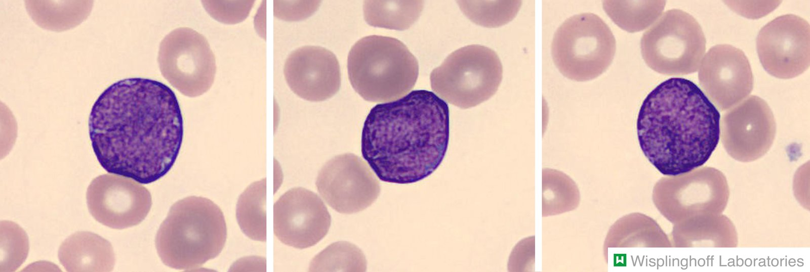

B-cell acute lymphoblastic leukemia

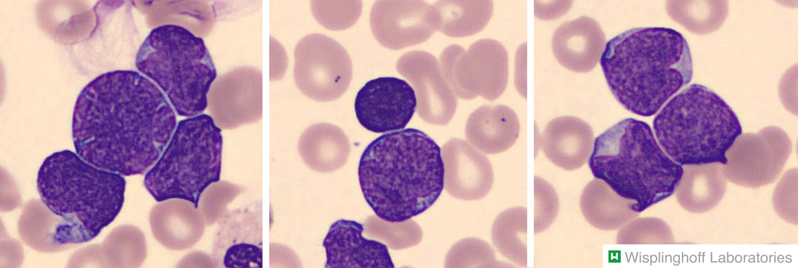

T-cell acute lymphoblastic leukemia

### <u>AML</u> [[12]](https://coursology-qbank.com/amboss/article/ELW8zN0)

* The French-American-British (FAB) classification distinguishes between eight subtypes of <u>AML</u>, according to the histopathological appearance of the cells.

| FAB classification for <u>AML</u> |  |
| --- | --- |
| M0-<u>AML</u>  | Acute myeloblastic <u>leukemia</u> without maturation |
| M1-<u>AML</u>  | Acute myeloblastic <u>leukemia</u> with minimal <u>granulocyte</u> maturation |
| M2-<u>AML</u>  | Acute myeloblastic <u>leukemia</u> with <u>granulocyte</u> maturation |
| <u>M3-AML</u> | Acute promyelocytic leukemia (APL) |
| M4-<u>AML</u>  | Acute myelomonocytic leukemia |
| M5-<u>AML</u>  | Acute <u>monocytic</u> <u>leukemia</u>  |
| M6-<u>AML</u>  | Acute erythroid <u>leukemia</u>  |
| M7-<u>AML</u>  | Acute megakaryoblastic leukemia |

* The WHO Classification of Haematolymphoid Tumours (2022) is based on the presence of defining genetic abnormalities or, in their absence, morphological differentiation. [[12]](https://coursology-qbank.com/amboss/article/ELW8zN0)

* <u>AML</u> with defining genetic abnormalities

* <u>AML</u>, defined by differentiation

* <u>AML</u>, myelodysplasia-related

* <u>Myeloid sarcoma</u>

* Diagnostic qualifiers for secondary myeloid <u>neoplasms</u>:

* Myeloid <u>neoplasm</u> post cytotoxic therapy

* Myeloid <u>neoplasm</u> associated with <u>germline</u> predisposition

* Myeloid <u>proliferation</u> associated with <u>Down syndrome</u>

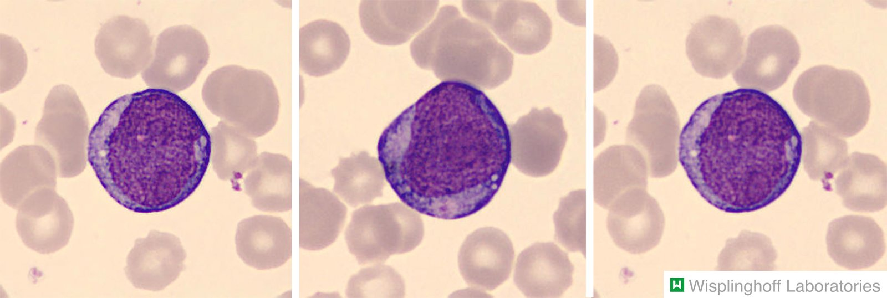

Acute monocytic leukemia

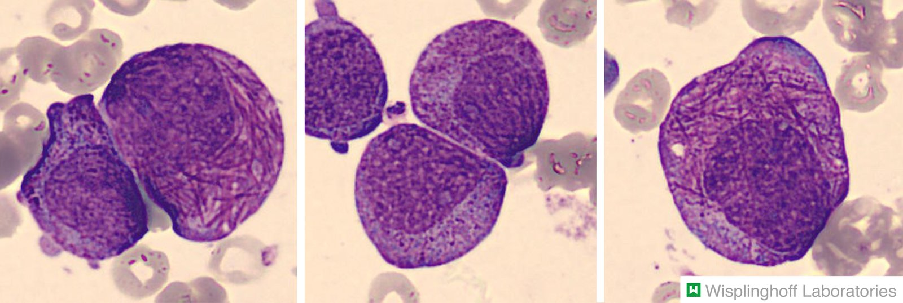

Acute promyelocytic leukemia

Hematopoiesis

References:[[8]](https://coursology-qbank.com/amboss/article/AmYRRp)

---

## Pathophysiology

* Acquired <u>somatic mutations</u> (<u>chromosomal translocations</u> and other genetic abnormalities) in early <u>hematopoietic</u> precursors ;   → clonal <u>proliferation</u> of a lymphoid or myeloid <u>stem cell</u> line ;   and arrest in <u>cell differentiation</u> and maturation in early stages of <u>hematopoiesis</u> → ; rapid <u>proliferation</u> of abnormal and dysfunctional blasts (with impaired <u>apoptosis</u> pathways) → accumulation of <u>leukemic</u> <u>white blood cells</u> in the bone marrow → disrupted normal <u>hematopoiesis</u> → <u>leukopenia</u> (↑ risk of infections), <u>thrombocytopenia</u> (↑ bleeding), ; and <u>anemia</u>

* Immature blasts enter the bloodstream → infiltration of other organs (particularly the <u>CNS</u>, <u>testes</u>, <u>liver</u>, and <u>skin</u>)

Hematopoiesis

References:[[8]](https://coursology-qbank.com/amboss/article/AmYRRp)[[13]](https://coursology-qbank.com/amboss/article/MLaMyO)[[14]](https://coursology-qbank.com/amboss/article/U5Ybjp)

---

## Clinical features

Clinical features are either related to <u>bone marrow</u> failure, infiltration of organs by <u>leukemic</u> cells, or a combination of both.

| General features of acute <u>leukemia</u> |  |
| --- | --- |
|   * Sudden onset of symptoms and rapid progression (days to weeks)  * <u>Anemia</u>: fatigue, <u>pallor</u>, <u>weakness</u>  * <u>Thrombocytopenia</u>: <u>epistaxis</u>, bleeding <u>gums</u>, <u>petechiae</u>, <u>purpura</u>  * Immature <u>leukocytes</u>: frequent infections, <u>fever</u>  * <u>Hepatosplenomegaly</u> (caused by <u>leukemic</u> infiltration)  [[2]](https://coursology-qbank.com/amboss/article/TLa6CO)  * <u>Oncologic emergencies</u> can be the first sign of <u>leukemia</u>, e.g., an elderly patient presenting with <u>priapism</u> or <u>DIC</u> may have <u>leukostasis</u> (more common in <u>AML</u> than <u>ALL</u>): See <u>oncologic emergencies</u> for further details.    |  |
| Clinical features of <u>ALL</u> | Clinical features of <u>AML</u> |
|   * <u>Fever</u>, night sweats, unexplained weight loss  * Painless <u>lymphadenopathy</u>  * Bone <u>pain</u> (presenting as limping or refusal to bear weight in children)  * <u>Airway obstruction</u> (<u>stridor</u>, difficulty breathing) due to <u>mediastinal</u> or <u>thymic</u> infiltration (primarily in <u>T-cell ALL</u>) [[15]](https://coursology-qbank.com/amboss/article/LLawyO)[[16]](https://coursology-qbank.com/amboss/article/mfYV5o)  * Features of <u>SVC syndrome</u>  * <u>Meningeal leukemia</u> (or <u>leukemic meningitis</u>) → <u>headache</u>, neck stiffness, <u>visual field</u> changes, or other <u>CNS</u> symptoms (caused by <u>CNS</u> involvement) [[1]](https://coursology-qbank.com/amboss/article/gLaFCO)[[16]](https://coursology-qbank.com/amboss/article/mfYV5o)  * Testicular enlargement (rare finding)    |   * Leukemia cutis (or <u>myeloid sarcoma</u>): nodular <u>skin</u> lesions with a purple or gray-blue color  * <u>Gingival hyperplasia</u> (<u>AML</u> subtype M4 and M5)  * Signs of <u>CNS</u> involvement, e.g., <u>headache</u>, <u>visual field</u> changes (uncommon)    |

> [!NOTE]
> <u>Fever</u> and <u>lymphadenopathy</u> are rare in <u>AML</u>, but can be common first signs in <u>ALL</u>!

> [!WARNING]
> <u>Fever</u> in a patient with acute <u>leukemia</u> must always be treated as a sign of infection until proven otherwise!

> [!NOTE]
> Remember <u>metastasis</u> for <u>ALL</u> by thinking of the following: <u>ALL</u> metaStaSizeS to the CNS and teSteS.

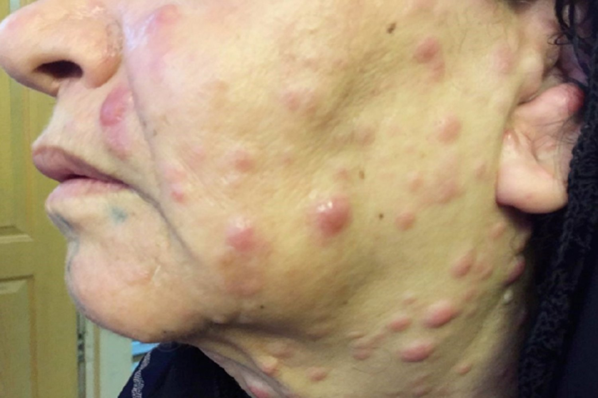

Leukemia cutis

Acute leukemia factsheet

References:[[1]](https://coursology-qbank.com/amboss/article/gLaFCO)[[15]](https://coursology-qbank.com/amboss/article/LLawyO)[[16]](https://coursology-qbank.com/amboss/article/mfYV5o)[[17]](https://coursology-qbank.com/amboss/article/S30y3f)

---

## Diagnosis

### Approach

* Initial evaluation

* Suspect acute <u>leukemia</u> in patients with suggestive clinical or laboratory features.

* Confirm the diagnosis with a morphological assessment.

* Further diagnostic studies: <u>Immunophenotype</u>, cytogenetics, and molecular <u>genetic testing</u> should be obtained in order to identify the subtype of acute <u>leukemia</u>.

> [!TIP]
> In order to choose the best treatment strategy, the morphological assessment, <u>immunophenotype</u>, and genetic studies should be as comprehensive as possible.

### Initial studies [[18]](https://coursology-qbank.com/amboss/article/kIYm1q)[[19]](https://coursology-qbank.com/amboss/article/Lzbwtw)[[20]](https://coursology-qbank.com/amboss/article/FVXgwC)

#### Routine <u>laboratory studies</u>

Findings on initial <u>laboratory studies</u> are usually nonspecific but may help to identify potentially life-threatening acute complications.

* <u>Complete blood count</u> and <u>peripheral blood smear</u>

* <u>Leukocytes</u>: The <u>white blood cell count</u> (<u>WBC</u>) may be elevated, normal, or low and is not a reliable diagnostic marker.

* <u>Platelets</u>; : typically mild to severe <u>thrombocytopenia</u>

* <u>Hemoglobin</u>: typically <u>anemia</u>

* <u>Peripheral blood smear</u>: presence of blasts (immature <u>WBCs</u>)

* <u>Liver chemistries</u> and <u>renal function tests</u>: may be abnormal (e.g., secondary to disease infiltration)

* <u>Comprehensive metabolic panel</u> and other metabolic studies

* Often abnormal due to increased cell lysis (see also “<u>Tumor lysis syndrome</u>”)

* Common findings include derangements of:

* <u>Sodium</u>: <u>hyponatremia</u>  OR <u>hypernatremia</u>  [[21]](https://coursology-qbank.com/amboss/article/h7Xclz)[[22]](https://coursology-qbank.com/amboss/article/R7Xllz)

* <u>Potassium</u>; : <u>hypokalemia</u>  OR <u>hyperkalemia</u>  [[20]](https://coursology-qbank.com/amboss/article/FVXgwC)

* <u>Calcium</u>: <u>hypocalcemia</u>  OR <u>hypercalcemia</u>  [[20]](https://coursology-qbank.com/amboss/article/FVXgwC)[[23]](https://coursology-qbank.com/amboss/article/lrXvhz)

* <u>Phosphate</u>; : <u>hypophosphatemia</u>  OR <u>hyperphosphatemia</u>  [[24]](https://coursology-qbank.com/amboss/article/35YSPp)

* ↑ <u>LDH</u>

* ↑ <u>Uric acid</u>

* <u>Coagulation studies</u>: Mild <u>coagulopathy</u> may be present. Studies may also help to identify features of <u>DIC</u>.

> [!WARNING]
> The identification of <u>DIC</u> suggests APL, which is a <u>medical emergency</u>. Consult <u>hematology</u> and/or oncology immediately and transfer the patient to a critical care unit.

#### Confirmatory diagnostic tests [[18]](https://coursology-qbank.com/amboss/article/kIYm1q)[[20]](https://coursology-qbank.com/amboss/article/FVXgwC)[[25]](https://coursology-qbank.com/amboss/article/_uY5FI)

Histopathological features should be assessed using <u>bone marrow aspiration and biopsy</u>. If unavailable, a <u>peripheral blood smear</u> may be sufficient.

| Histopathological features of acute <u>leukemia</u> |  |  |  |  |
| --- | --- | --- | --- | --- |
|  |  |  <u>ALL</u>  |  <u>AML</u>  |  |
|  Blasts (in <u>bone marrow</u> or peripheral blood) [[18]](https://coursology-qbank.com/amboss/article/kIYm1q)[[26]](https://coursology-qbank.com/amboss/article/gVcFFY0)  |  |  * > 20% lymphoblasts   |   * ≥ 20% <u>myeloblasts</u>  * Presence of <u>AML-defining genetic abnormalities</u> regardless of blast percentage [[12]](https://coursology-qbank.com/amboss/article/ELW8zN0)    |  |
|  Cell morphology [[25]](https://coursology-qbank.com/amboss/article/_uY5FI)  |  |   * Small- to intermediate-sized blasts [[27]](https://coursology-qbank.com/amboss/article/rbbfEH)  * Blasts with large, irregular <u>nuclei</u> (high <u>nuclear-cytoplasmic ratio</u>)  * Inconspicuous nucleoli  * Coarse granules  * No <u>Auer rods</u>    |   * Large blasts (2–4 times the size of an <u>RBC</u>)  * Blasts with round or <u>kidney</u>-shaped <u>nuclei</u> that contain more <u>cytoplasm</u> than the blasts in <u>ALL</u>  * Prominent nucleoli  * Fine granules  * Leukemic hiatus: the presence of blasts and mature <u>leukocytes</u> but no intermediate forms  * Some subtypes (especially <u>M3</u>, or APL) exhibit Auer rods   * Pink-red, rod-shaped granular <u>cytoplasmic</u> <u>inclusion bodies</u> in malignant immature <u>myeloblasts</u> or <u>promyelocytes</u>  * <u>Myeloperoxidase</u> (<u>MPO</u>) positive    |  |

> [!TIP]
> Cell morphology can confirm the diagnosis of acute <u>leukemia</u>, but in most cases, it is necessary to complete <u>immunophenotype</u> and genetic studies before selecting a treatment.

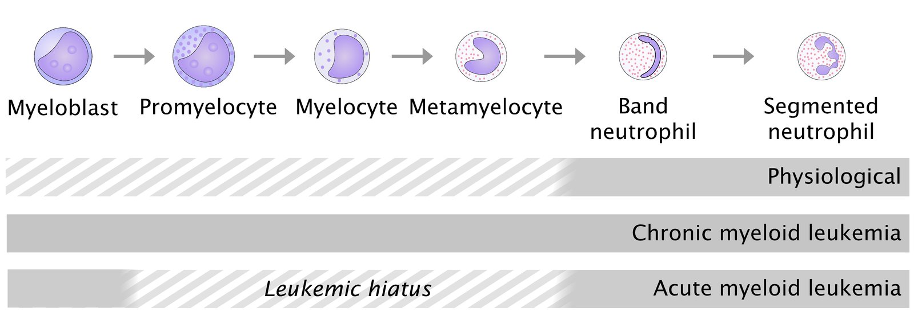

Leukemic hiatus

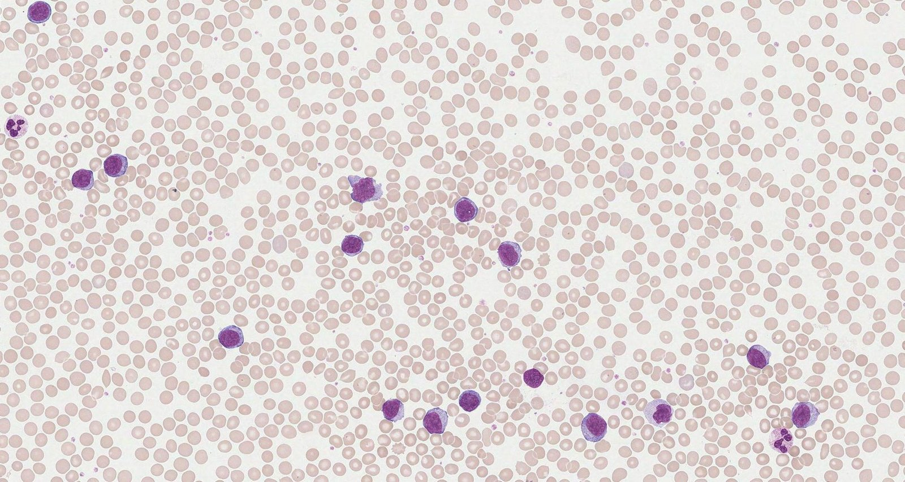

Acute lymphoblastic leukemia

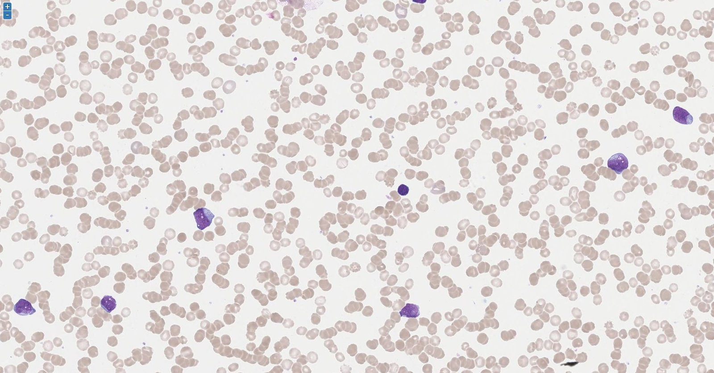

Acute myeloid leukemia

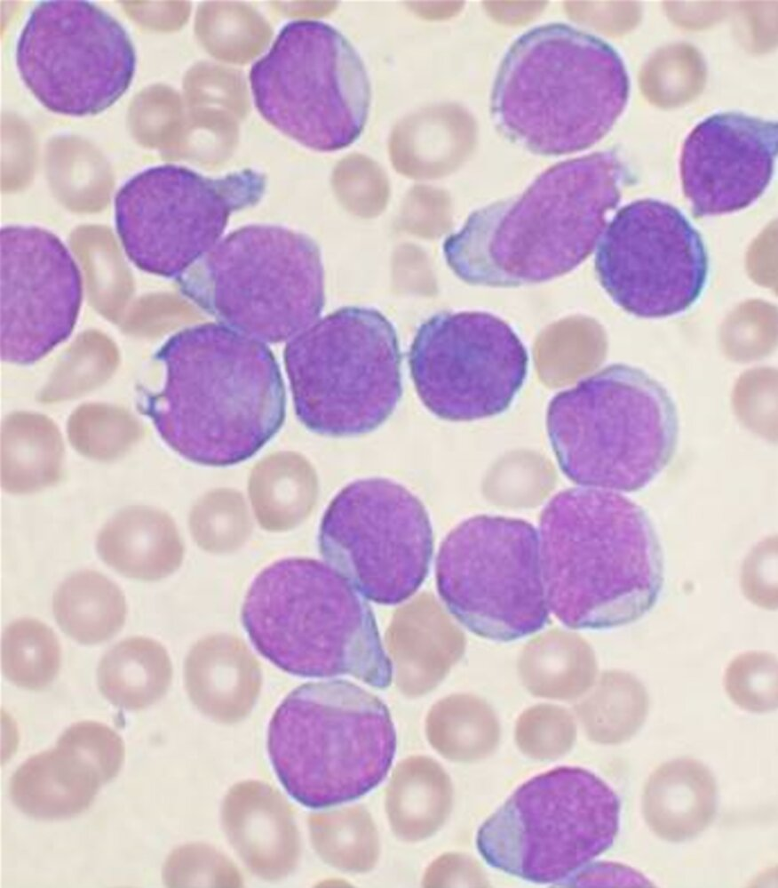

Acute lymphoblastic leukemia (ALL)

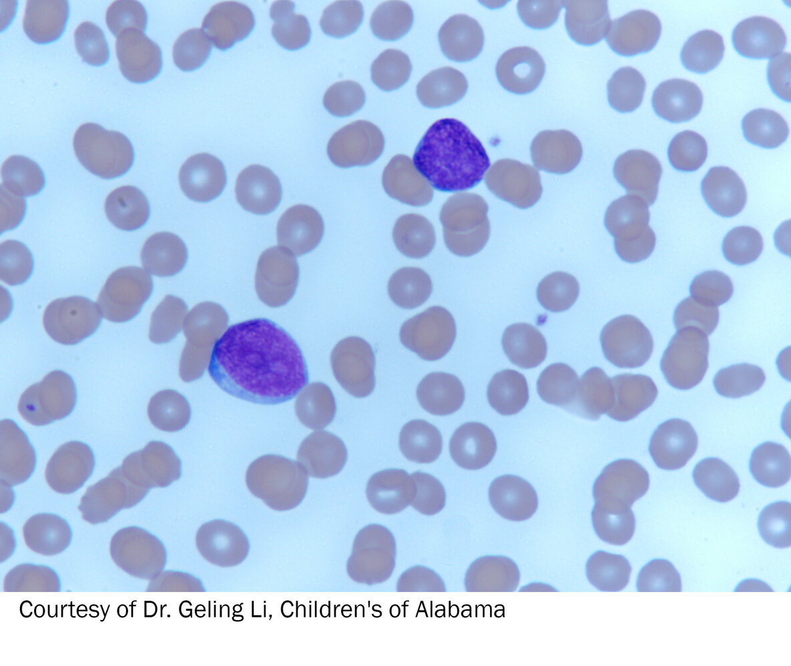

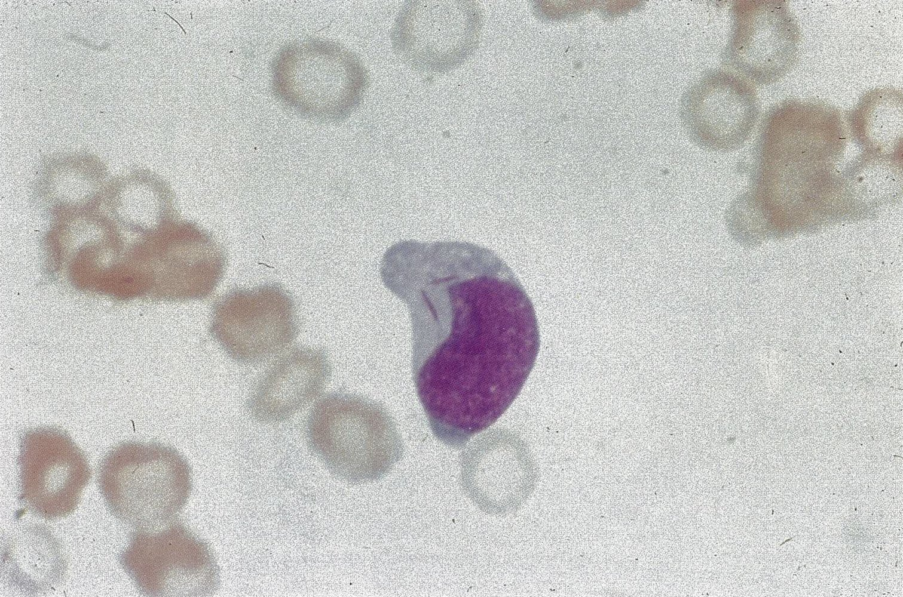

Auer rods

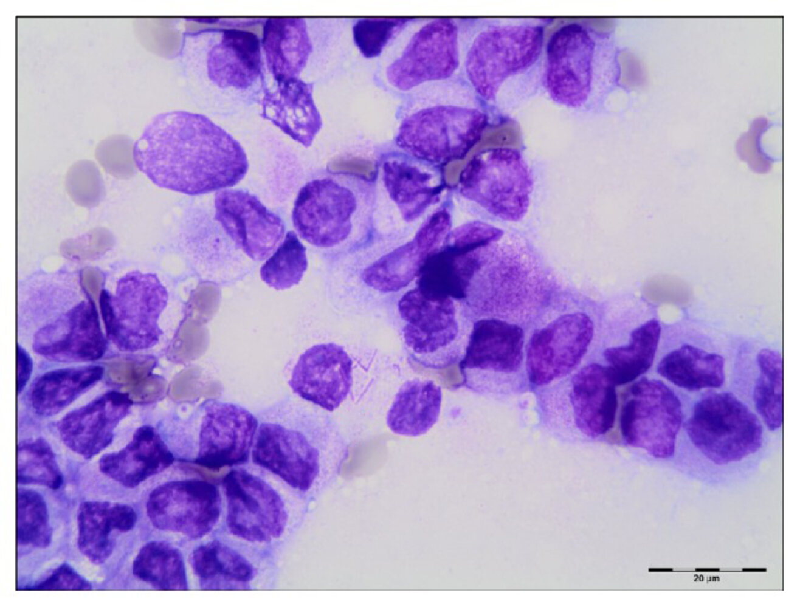

Auer rods in acute promyelocytic leukemia (APL)

Acute promyelocytic leukemia

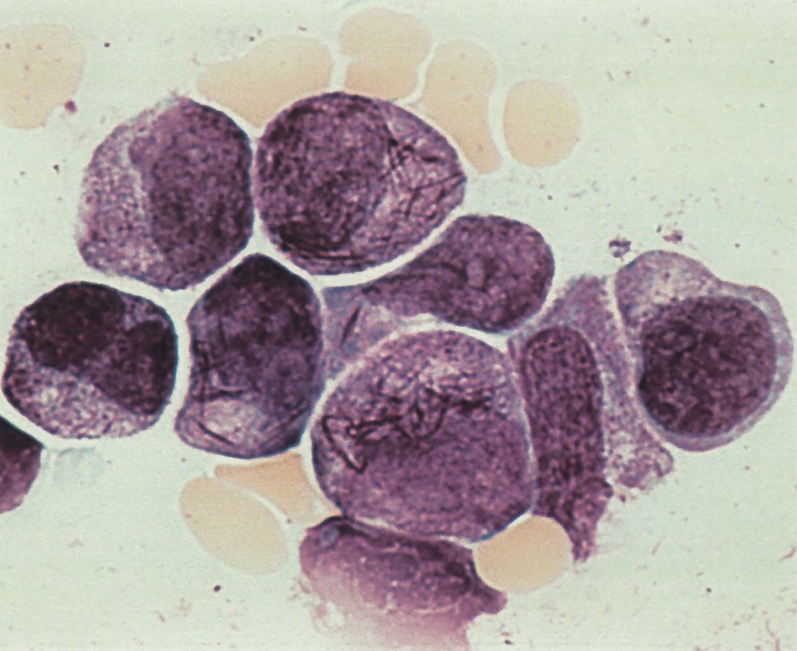

Acute promyelocytic leukemia

Acute monocytic leukemia

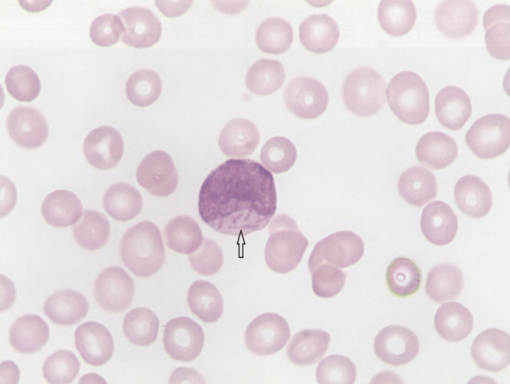

Auer rods in acute myeloblastic leukemia

### Specialized studies

These studies are used to further characterize <u>the cell</u> line involved; some characteristics may be associated with a better response to certain therapies. These studies should be ordered in consultation with a specialist.

#### <u>Immunophenotype</u> and genetic studies [[19]](https://coursology-qbank.com/amboss/article/Lzbwtw)[[20]](https://coursology-qbank.com/amboss/article/FVXgwC)[[25]](https://coursology-qbank.com/amboss/article/_uY5FI)[[28]](https://coursology-qbank.com/amboss/article/nzb7tw)

| <u>Immunophenotype</u> and genetic studies in acute <u>leukemias</u> |  |  |  |
| --- | --- | --- | --- |
|  |  | Findings in <u>ALL</u> | Findings in <u>AML</u> |
|  <u>Immunophenotype</u> [[28]](https://coursology-qbank.com/amboss/article/nzb7tw)  | <u>Immunohistochemistry</u> |   * <u>MPO</u> negative  * Terminal deoxynucleotidyl transferase (<u>TdT</u>) positive  * <u>Periodic acid-Schiff</u> (<u>PAS</u>): often positive    |   * <u>MPO</u> positive  * <u>TdT</u> negative  * <u>PAS</u> negative    |
| <u>Flow cytometry</u> |   * Assess <u>leukemic</u> cell origin and maturity.  * <u>B-ALL</u> is usually positive for:  * CD10 (<u>CALLA</u>): marker for immature <u>B lymphocytes</u> (pre-B)  * <u>CD19</u>  * <u>CD20</u>  * <u>T-ALL</u> is usually positive for CD2–<u>CD8</u>, especially <u>CD3</u>    |  * The majority of subtypes are positive for CD13, CD33, <u>CD34</u>, <u>CD117</u>, and <u>HLA-DR</u>   |  |
| Genetic studies | Cytogenetics (<u>karyotype</u>, <u>FISH</u>) |   * <u>Hyperdiploidy</u> (common in pre-<u>B-ALL</u>)  * <u>Philadelphia translocation</u>: present in ∼ 20–30% of adults with <u>ALL</u> but only ∼ 5% of children with <u>ALL</u>   [[29]](https://coursology-qbank.com/amboss/article/vrXAQz)  * Childhood <u>B-ALL</u>  * t(12;21): most common specific abnormality  * <u>Trisomy</u> 4 and 10: associated with a good prognosis    |   * t(15:17), especially in <u>acute promyelocytic leukemia</u> (<u>M3 AML</u>)  * <u>Philadelphia translocation</u> (rare)  [[30]](https://coursology-qbank.com/amboss/article/DrX1jz)    |
|  Molecular testing (<u>PCR</u>, <u>NGS</u>)   |  * Findings may include  * <u>BCR-ABL1</u>: associated with less favorable prognosis  * <u>ETV6-RUNX1</u> : seen in ∼ 25% cases of pediatric <u>B-ALL</u>   |   * Disease-defining genetic abnormalities, e.g.: [[12]](https://coursology-qbank.com/amboss/article/ELW8zN0)  * APL: <u>PML-RARA</u>  * <u>AML</u>-defining, e.g., NPM1  * <u>MDS</u>-related changes, e.g., ASXL1  * Prognostic markers, e.g., FLT3-associated with poor prognosis    |  |

> [!NOTE]
> Myelogenous <u>leukemias</u> are myeloperoxidase positive.

#### Screening for extramedullary disease [[18]](https://coursology-qbank.com/amboss/article/kIYm1q)[[19]](https://coursology-qbank.com/amboss/article/Lzbwtw)[[31]](https://coursology-qbank.com/amboss/article/6zbjFw)

Consider the following studies to detect extramedullary disease based on the subtype of acute <u>leukemia</u> and clinical evaluation of the patient:

* <u>CNS</u> infiltration (common in <u>ALL</u>)  [[20]](https://coursology-qbank.com/amboss/article/FVXgwC)

* Perform a <u>lumbar puncture</u> and obtain <u>CSF flow</u> cytometry.

* Consider <u>brain</u> and <u>spine</u> CT or <u>MRI</u>.

* Testicular infiltration (relatively common in <u>ALL</u>): testicular <u>ultrasound</u>

* <u>Thymic</u> infiltration (primarily in <u>T-cell ALL</u>): <u>Chest x-ray</u> or CT chest may show a <u>mediastinal mass</u>.

* Hepatosplenic infiltration: Abdominal CT or <u>ultrasound</u> may show organ enlargement.

* Other forms of extramedullary disease: Consider <u>PET-CT</u> and/or <u>lymph node</u> <u>biopsy</u>.

> [!TIP]
> All patients with <u>ALL</u> should undergo screening for <u>CNS</u> infiltration.

---

## Treatment

### Approach [[25]](https://coursology-qbank.com/amboss/article/_uY5FI)[[32]](https://coursology-qbank.com/amboss/article/vZXAW9)[[33]](https://coursology-qbank.com/amboss/article/EZX8W9)

The <u>treatment of acute leukemia</u> is decided by a hematologist-oncologist specialist depending on the specific subtype and results of molecular testing.

* Pretreatment: All patients should have <u>prechemotherapy screening</u> as part of <u>preparation for cancer treatment</u>.

* <u>Chemotherapy</u>

* Systemic <u>chemotherapy</u>: The regimen of choice is based on individual patient and disease factors.

* <u>Intrathecal chemotherapy</u> (commonly used): Consider adding for patients with or at high risk of <u>CNS</u> infiltration (e.g., all patients with <u>ALL</u>).

* Targeted <u>chemotherapy</u>: Consider adding for <u>leukemias</u> with specific <u>immunophenotype</u> and genetic profiles, e.g., <u>Philadelphia translocation</u>.

* Adjunctive treatment, e.g., <u>radiation therapy</u>, immunotherapy, or <u>stem cell transplantation</u> (SCT): Consider based on individual evaluation.

* <u>Supportive care</u>: Provide holistic care to reduce symptoms and support patients and carers (see “<u>Principles of cancer care</u>”).

* Management of complications: initiate monitoring, prevention, and early aggressive treatment as needed for infection, bleeding, <u>pancytopenia</u>, and <u>oncologic emergencies</u> (see “Management of complications”).

* Relapse or refractory <u>leukemia</u>: Consider re-<u>induction chemotherapy</u>, <u>autologous SCT</u>, or enrollment in a clinical trial in consultation with hematologist-oncologist.

> [!TIP]
> Early and aggressive <u>chemotherapy</u> improves the prognosis, e.g., 80–90% of patients with <u>ALL</u> achieve complete remission with <u>chemotherapy</u>. [[25]](https://coursology-qbank.com/amboss/article/_uY5FI)

### Systemic <u>chemotherapy</u> [[32]](https://coursology-qbank.com/amboss/article/vZXAW9)[[33]](https://coursology-qbank.com/amboss/article/EZX8W9)

Regimens vary depending on the subtype of <u>leukemia</u>, the age of the patient, and <u>immunophenotype</u> and genetic study results.

* <u>Induction chemotherapy</u> 

* Average duration for an adult with <u>ALL</u> is 4–8 weeks

* Reinduction therapy may be required in case of relapse or failure of primary induction

* <u>Consolidation chemotherapy</u>: average duration for an adult with <u>ALL</u> is 4–8 months

* <u>Maintenance chemotherapy</u>: average duration for an adult with <u>ALL</u> is 2–3 years

|  Common agents used in <u>chemotherapy</u> regimens for acute <u>leukemia</u> [[18]](https://coursology-qbank.com/amboss/article/kIYm1q)[[20]](https://coursology-qbank.com/amboss/article/FVXgwC)[[25]](https://coursology-qbank.com/amboss/article/_uY5FI)[[32]](https://coursology-qbank.com/amboss/article/vZXAW9)[[33]](https://coursology-qbank.com/amboss/article/EZX8W9)  |  |
| --- | --- |
| <u>ALL</u> |   * <u>Alkylating agents</u>: e.g., <u>cyclophosphamide</u>  * <u>Anthracyclines</u>: e.g., <u>daunorubicin</u>, <u>doxorubicin</u>  * <u>Antimetabolites</u>: e.g., <u>cytarabine</u>, <u>methotrexate</u>, <u>6-mercaptopurine</u>  * Enzyme therapy: e.g., <u>L-asparaginase</u>  * Alkaloids: e.g., <u>vincristine</u>  * <u>Glucocorticoids</u>: e.g., <u>prednisone</u>, <u>dexamethasone</u>    |
| <u>AML</u> |   * <u>Anthracyclines</u> (e.g., <u>idarubicin</u>, high-dose <u>daunorubicin</u>)  * <u>Antimetabolites</u> (e.g., <u>cytarabine</u>, <u>methotrexate</u>)  * <u>Hypomethylating agents</u> (e.g., azacitidine)    |
| APL |   * Differentiation agents: to induce the maturation of immature malignant <u>WBCs</u>  * ATRA (<u>All-trans retinoic acid</u>)  * <u>Arsenic</u> trioxide  * <u>Chemotherapy</u> with <u>anthracyclines</u> (e.g., <u>idarubicin</u>)    |

> [!TIP]
> A <u>chemotherapy</u> regimen commonly used to treat <u>ALL</u> is hyper-CVAD: Cyclophosphamide, Vincristine, <u>daunorubicin</u> (or Adriamycin), and Dexamethasone.

> [!WARNING]
> If APL is suspected, start treatment early with a differentiation agent (e.g., <u>ATRA</u>) without waiting for immunotype or genetic confirmation. Treatment may be adjusted later depending on the results. [[25]](https://coursology-qbank.com/amboss/article/_uY5FI)

> [!NOTE]
> In APL, the t(15;17) translocation and subsequent formation of the <u>PML-RARA</u> fusion <u>gene</u> can inhibit <u>myeloblast</u> differentiation under physiological levels of <u>retinoic acid</u>. High doses of <u>ATRA</u> (a <u>vitamin A</u> derivative) may induce <u>myeloblast</u> differentiation and promote remission.

### Management of <u>CNS</u> infiltration [[32]](https://coursology-qbank.com/amboss/article/vZXAW9)[[33]](https://coursology-qbank.com/amboss/article/EZX8W9)[[34]](https://coursology-qbank.com/amboss/article/szbt8w)

* Intrathecal chemotherapy: administration of <u>chemotherapeutic agents</u> (e.g., triple therapy with <u>methotrexate</u>, <u>cytarabine</u>, and <u>hydrocortisone</u>) directly into the <u>subarachnoid space</u> via <u>lumbar puncture</u> or using an intraventricular catheter with a reservoir placed under the scalp

* Indications in <u>ALL</u>: Prevention of <u>leukemic meningitis</u> in all patients at the time of diagnosis   [[18]](https://coursology-qbank.com/amboss/article/kIYm1q)[[20]](https://coursology-qbank.com/amboss/article/FVXgwC)[[33]](https://coursology-qbank.com/amboss/article/EZX8W9)

* Indications in <u>AML</u>

* Treatment of patients with confirmed <u>CNS</u> infiltration

* Prevention in patients with high-risk APL  [[35]](https://coursology-qbank.com/amboss/article/-ScDXX0)

* <u>CNS</u> <u>radiotherapy</u>: Consider directed <u>radiation therapy</u> alongside <u>intrathecal chemotherapy</u> in select patients.

> [!TIP]
> Intrathecal prophylaxis should be initiated early, as prevention of <u>CNS</u> <u>leukemia</u> is usually effective. Patients with <u>CNS</u> infiltration are at higher risk of relapse than those without <u>CNS</u> infiltration.

### Advanced therapies [[25]](https://coursology-qbank.com/amboss/article/_uY5FI)[[31]](https://coursology-qbank.com/amboss/article/6zbjFw)

* <u>Targeted therapy</u>: Nonstandard <u>chemotherapy</u> or immunotherapy is indicated if certain mutations or markers are detected.

* <u>Tyrosine kinase inhibitors</u> (<u>TKIs</u>) 

* <u>Philadelphia chromosome</u>-positive <u>ALL</u>: <u>BCR-ABL</u><u>TKIs</u>, e.g., <u>imatinib</u>, ponatinib)

* FLT3-ITD <u>AML</u>: Consider midostaurin [[36]](https://coursology-qbank.com/amboss/article/nVc7EY0)

* <u>Monoclonal antibodies</u>: e.g., <u>rituximab</u> for <u>CD20</u>-positive <u>Philadelphia chromosome</u>-negative <u>ALL</u>, gemtuzumab ozogamicin for CD33-positive <u>AML</u>

* <u>Chimeric antigen receptor T-cell therapy</u>: may be used in <u>ALL</u>

* <u>Autologous</u> or allogeneic <u>stem cell transplantation</u>: Indications include patients with poor prognostic factors (e.g., unfavorable cytogenetics) and those who do not achieve remission with <u>chemotherapy</u> (see “<u>Transplantation</u>” for more information). [[25]](https://coursology-qbank.com/amboss/article/_uY5FI)

### Management of complications  [[25]](https://coursology-qbank.com/amboss/article/_uY5FI)

* <u>Oncologic emergencies</u>

* <u>Tumor lysis syndrome</u> (<u>TLS</u>) 

* Management: typically includes <u>fluid therapy</u> (oral or IV) and <u>rasburicase</u>

* Prophylaxis: Consider hydration, and <u>urate-lowering therapy</u> (i.e., <u>allopurinol</u> or <u>rasburicase</u>).

* <u>Leukostasis</u> (e.g., due to <u>hyperleukocytosis</u>): Consider <u>IV fluid resuscitation</u> and/or <u>cytoreductive therapy</u>.

* See “<u>Oncologic emergencies</u>” for details and dosages.

* Treatment-related complications

* <u>Anticancer therapy-induced myelosuppression</u>: <u>anemia</u> , <u>thrombocytopenia</u> , and <u>neutropenia</u>  [[37]](https://coursology-qbank.com/amboss/article/lVcvuY0)[[38]](https://coursology-qbank.com/amboss/article/Xhc9cX0)

* <u>Mucositis</u> [[39]](https://coursology-qbank.com/amboss/article/ZhcZcX0)

* See “<u>Anticancer treatment-related complications</u>” and “<u>Neutropenic fever</u>” for details and dosages.

* <u>Secondary hyperuricemia</u>

* Can lead to <u>acute gout</u>, <u>uric acid stones</u>, and <u>urate nephropathy</u>

* Consider hydration, fluid administration, and <u>urate-lowering therapy</u> (e.g., <u>allopurinol</u> and <u>rasburicase</u>) as prophylaxis prior to <u>chemotherapy</u>.

* Specific <u>chemotherapy</u> toxicity

* See “<u>Chemotherapeutic agents</u>.”

* Differentiation agents

* <u>ATRA</u>: See “Side effects” of <u>retinoids</u>.

* <u>Arsenic</u> trioxide: <u>ECG</u> monitoring for <u>QTc prolongation</u> and discontinuation of other <u>QTc-prolonging drugs</u>. [[40]](https://coursology-qbank.com/amboss/article/MVcMEY0)

---

## Prognosis

### 5-year survival rate following treatment

* <u>ALL</u>: The 5-year survival rate is generally higher compared to <u>AML</u> (varies from ∼ 20% in elderly patients to ∼ 80% in children and <u>adolescents</u>)

* <u>AML</u>: ∼ 30%, but it varies according to the patient's age. The survival time has increased more recently due to improvements in treatment.

### Unfavorable prognostic factors

|  | <u>ALL</u> | <u>AML</u> |
| --- | --- | --- |
| Age |  * < 1 year or > 10 years   |  * > 60 years   |
| Disease features |   * <u>WBC count</u> > 50,000/mm³  * <u>CNS</u> involvement at diagnosis    |   * ↑ <u>LDH</u>  * FAB M7 (acute megakaryocytic <u>leukemia</u>)    |
| Cytogenetics |  |  |
|   * <u>Philadelphia chromosome</u> t(9;22)  * <u>Hypoploidy</u>  * Complex pattern of aberrations (> 3 aberrations)    |   * Various translocations, e.g., t(6;9)  * <u>Karyotype</u> abnormalities (e.g., <u>trisomy</u> 8, <u>monosomy</u> 5 or 7)  * FLT3 <u>gene</u> mutation  * Complex pattern of aberrations (i.e., > 3 aberrations)    |  |
| Immunotyping |   * Mature <u>B-cell ALL</u>  * Precursor <u>T-cell ALL</u>    |   * <u>CD34</u>  * <u>MDR1</u>    |

### Favorable prognostic factors

| <u>ALL</u> | <u>AML</u> |
| --- | --- |
|   * < 50,000/mm³  * No <u>CNS</u> involvement  * t(12;21)  * <u>Hyperploidy</u>    |   * t(8;21)  * <u>Acute promyelocytic leukemia</u> (APL) with t(15;17)    |

> [!NOTE]
> To remember that translocation t(12;21) commonly manifests with pediatric <u>B-ALL</u> and usually has a favorable outcome, think: “Kids flip back to health!” (the number 12 is 21 flipped around).

References:[[41]](https://coursology-qbank.com/amboss/article/mKaVSl)[[42]](https://coursology-qbank.com/amboss/article/5KaiSl)[[43]](https://coursology-qbank.com/amboss/article/MKaMSl)[[44]](https://coursology-qbank.com/amboss/article/h30cRf)[[45]](https://coursology-qbank.com/amboss/article/j5Y_Pp)[[46]](https://coursology-qbank.com/amboss/article/1LY29p)

---