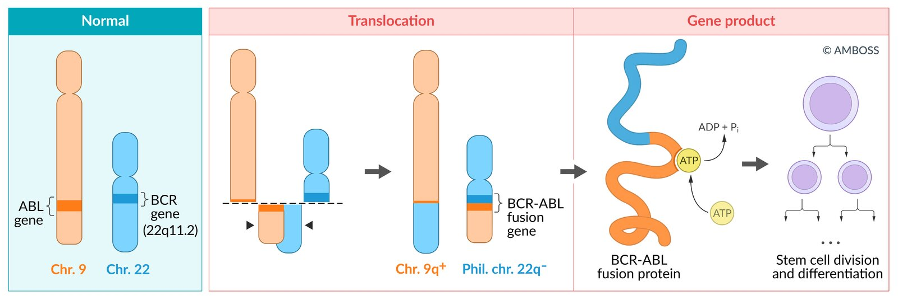
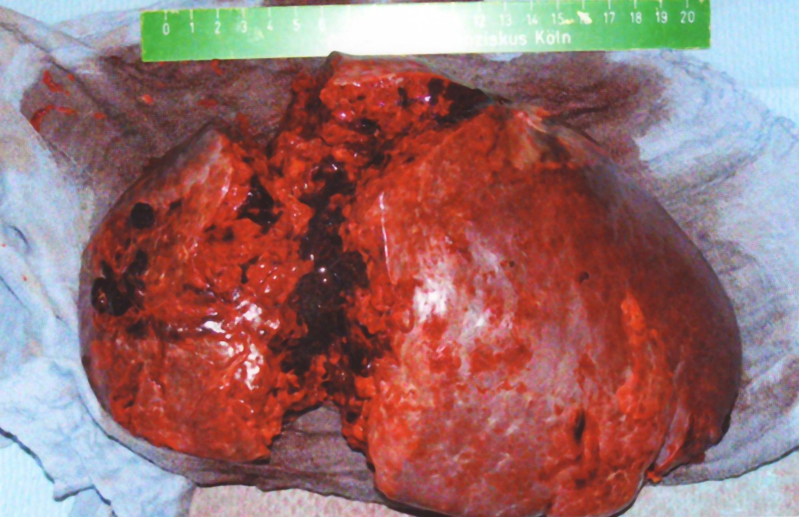
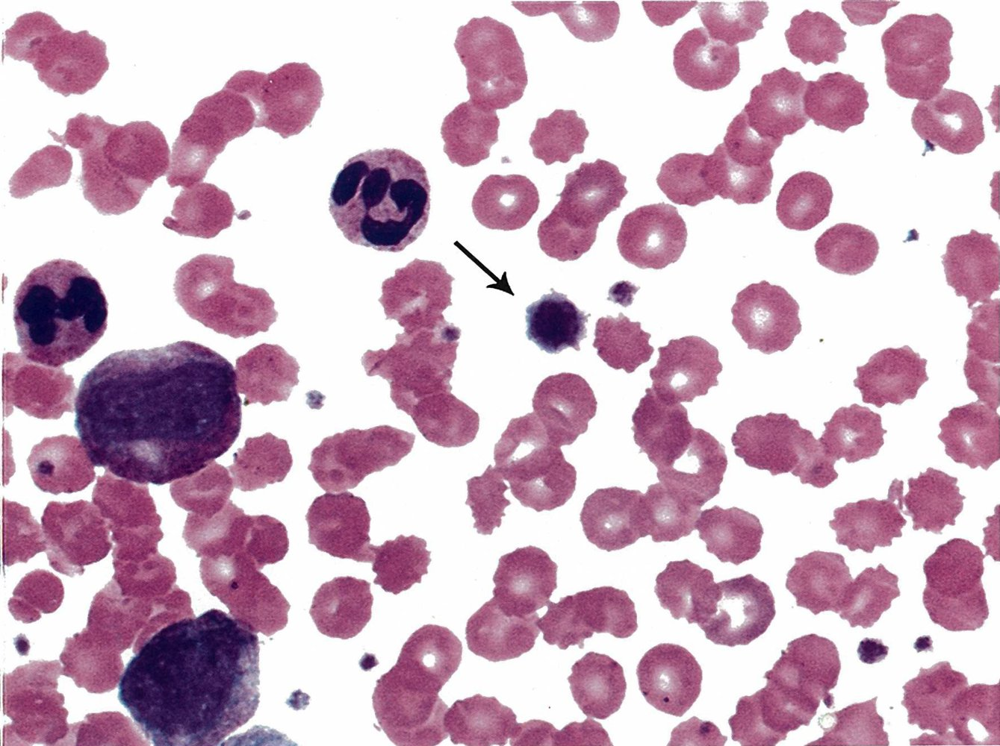
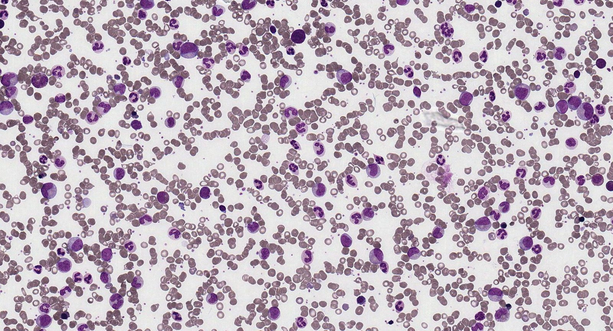
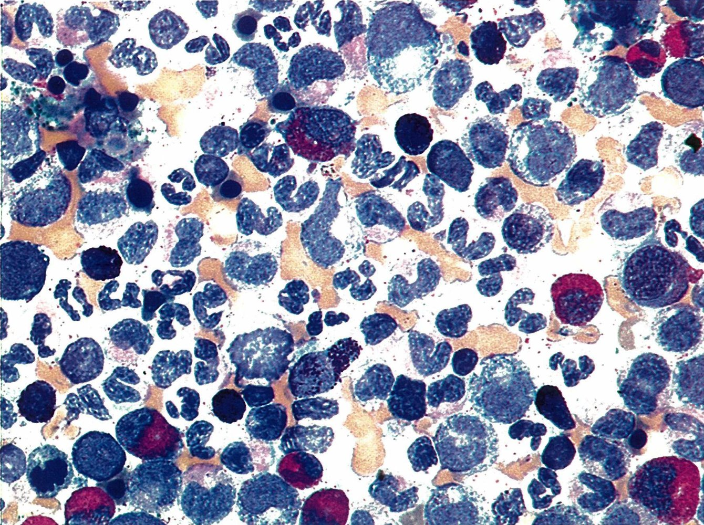

# Chronic myeloid leukemia

*Categories: Clinical knowledge > Internal medicine > Hematology and oncology > White blood cell and bone marrow disorders > Chronic myeloid leukemia*

[Original Article Link](https://coursology-qbank.com/amboss/article/PT0WI2)

---

## Summary

Chronic myeloid <u>leukemia</u> (CML) is a type of <u>myeloproliferative neoplasm</u> involving <u>hematopoietic stem cells</u> that results in overexpression of cells of myeloid lineage, especially <u>granulocytes</u>. It is caused by a <u>reciprocal translocation</u> between <u>chromosomes</u> 9 and 22, resulting in the formation of the <u>Philadelphia chromosome</u>, which contains the <u>BCR-ABL1</u> fusion <u>gene</u>. The <u>BCR-ABL1</u> fusion <u>gene</u> encodes a hybrid <u>tyrosine kinase</u> with increased enzymatic activity that leads to unregulated <u>proliferation</u> of <u>hematopoietic stem cells</u>. These cells subsequently differentiate into mature myeloid cells, resulting in CML. CML has three distinct phases: the chronic phase (CP-CML), the accelerated phase (AP-CML), and the blast phase (BP-CML, also referred to as <u>blast crisis</u>. Patients with CP-CML may be asymptomatic or present with nonspecific symptoms (e.g., <u>fever</u>, weight loss, night sweats) and <u>splenomegaly</u>. AP-CML is characterized by complications secondary to the suppression of other hematologic cell lines (e.g., <u>thrombocytopenia</u>, <u>anemia</u>, recurrent infections), and the clinical picture of BP-CML is similar to that of <u>acute leukemia</u>. Important diagnostic features in BP-CML are severe <u>leukocytosis</u> (with <u>leukocyte</u> counts as high as 500,000/mm³), <u>basophilia</u>, and <u>massive splenomegaly</u>. The most effective treatment for CML is <u>targeted therapy</u> with <u>tyrosine kinase inhibitors</u> (<u>TKIs</u>). This class of drug has revolutionized the <u>efficacy</u> of treatment and greatly improved the prognosis of patients with CML.

---

## Epidemiology

* Sex: <u>♂</u> > <u>♀</u>

* <u>Incidence</u>: : peak <u>incidence</u> is 50–60 years

Epidemiological data refers to the US, unless otherwise specified.

---

## Etiology

* <u>Idiopathic</u> (in most cases)

* <u>Ionizing radiation</u> (e.g., secondary to therapeutic radiation)

* <u>Aromatic hydrocarbons</u> (especially <u>benzene</u>)

---

## Pathophysiology

### Philadelphia chromosome

* <u>Reciprocal translocation</u> between <u>chromosome</u> 9 and <u>chromosome</u> 22 → formation of the <u>Philadelphia chromosome</u> t(9;22) → fusion of the ABL1 gene (<u>chromosome</u> 9) with the BCR gene (<u>chromosome</u> 22) → formation of the BCR-ABL <u>gene</u> → encodes a <u>BCR-ABL</u> non-<u>receptor</u> <u>tyrosine kinase</u> with increased enzyme activity

* Result: inhibits physiologic <u>apoptosis</u> and increases <u>mitotic</u> activity → uncontrolled <u>proliferation</u> of functional <u>granulocytes</u>

| <u>Malignancy</u> | Detection of <u>Philadelphia translocation</u> |
| --- | --- |
| CML |  * > 90% of patients   |
| <u>ALL</u> |   * ∼ 20% of adults  * ∼ 5% of children    |
| <u>AML</u> |  * < 2% of patients   |

Philadelphia chromosome and pathophysiological consequences

Hematological malignancies – Part 1a: Hematopoeisis, Acute Leukemia, and Lymphomas

Hematological malignancies – Part 1b: Myeloproliferative Neoplasms and Myelodysplastic Syndromes

Hematological Malignancies – Part 2B: Myeloproliferative Neoplasms and Leukemic Hiatus

### Genetic changes and clinical course

* Additional <u>chromosomal</u> changes and mutations of <u>tumor suppressor genes</u> and <u>oncogenes</u> (<u>p53</u>, Rb1, or <u>Ras</u>), which emerge during the course of the disease, are responsible for the progression from chronic to accelerated phase and, ultimately, the transition to <u>acute leukemia</u>.

References:[[1]](https://coursology-qbank.com/amboss/article/U30b3f)

---

## Clinical features

### Chronic phase

* Can persist for up to 10 years and is often subclinical

* When symptomatic, features include:

* Weight loss, <u>fever</u>, night sweats, fatigue

* <u>Splenomegaly</u>: abdominal discomfort in the <u>left upper quadrant</u>

* <u>Lymphadenopathy</u> is not typical in CML.

> [!TIP]
> Unlike <u>AML</u>, CML is not characterized by recurrent infections during early stages, since the <u>granulocytes</u> are still fully functional.

### Accelerated phase

* Erythrocytopenia: <u>anemia</u>

* <u>Neutropenia</u>: infection and <u>fever</u>

* Extreme <u>pleocytosis</u> 

* Infarctions: splenic and <u>myocardial infarctions</u>, <u>retinal vessel occlusion</u>

* <u>Leukemic</u> <u>priapism</u>

* Terminal phase: <u>myelofibrosis</u>

* <u>Extreme splenomegaly</u> : palpable in lower left quadrant or <u>pelvic cavity</u>

Splenic rupture due to splenomegaly

### Blast crisis

The <u>blast crisis</u> is the terminal stage of CML.

* Symptoms resemble those of <u>acute leukemia</u>.

* Rapid progression of <u>bone marrow</u> failure → <u>pancytopenia</u>, bone <u>pain</u>

* Severe <u>malaise</u>

* Subtypes :

* Myeloid <u>blast crisis</u> → <u>AML</u> (⅔ of cases)

* Lymphoid <u>blast crisis</u> → <u>ALL</u> (⅓ of cases)

References:[[2]](https://coursology-qbank.com/amboss/article/OyaI2M)

---

## Diagnosis

### Approach [[3]](https://coursology-qbank.com/amboss/article/35YSPp)[[4]](https://coursology-qbank.com/amboss/article/_uY5FI)[[5]](https://coursology-qbank.com/amboss/article/YcXnaC)

* Clinicians should maintain a high index of suspicion if patients present with the following: 

* Severe <u>leukocytosis</u> on routine laboratory testing

* <u>Splenomegaly</u>

* <u>Constitutional symptoms</u> (e.g., <u>malaise</u>, fatigue) with nonspecific signs of <u>bone marrow suppression</u> (e.g., <u>anemia</u>, <u>thrombocytopenia</u>)

* Initial diagnostic workup should include:

* <u>CBC</u>

* <u>Peripheral blood smear</u>

* <u>Bone marrow aspiration and biopsy</u>

* Diagnostic confirmation: identification of the <u>Philadelphia chromosome</u> and/or the <u>BCR-ABL1</u> fusion <u>gene</u>.

* Evaluate patients without the <u>Philadelphia chromosome</u> or the <u>BCR-ABL1</u> fusion <u>gene</u> for other <u>myeloproliferative disorders</u>.

> [!TIP]
> CML can cause extreme <u>leukocytosis</u> (often > 100,000/mm³) and is frequently associated with <u>basophilia</u>. [[5]](https://coursology-qbank.com/amboss/article/YcXnaC)[[6]](https://coursology-qbank.com/amboss/article/ecXxYC)

### Initial evaluation [[5]](https://coursology-qbank.com/amboss/article/YcXnaC)[[6]](https://coursology-qbank.com/amboss/article/ecXxYC)[[7]](https://coursology-qbank.com/amboss/article/fcXkbC)

* <u>CBC</u> and <u>peripheral blood smear</u>

* <u>Leukocytosis</u> with midstage progenitor cells (e.g., <u>myelocytes</u>, <u>metamyelocytes</u>) and mature cells (e.g., <u>neutrophils</u>)

* <u>Thrombocytosis</u>

* <u>Basophilia</u> and <u>eosinophilia</u>

* Blast cells in peripheral blood can indicate the transition to AP-CML.

* <u>Anemia</u>

* Further <u>laboratory studies</u>

* <u>Leukocyte alkaline phosphatase</u> (<u>LAP</u>): Low <u>LAP</u> is a typical finding and can help distinguish CML from other types of <u>leukemia</u> and <u>leukemoid reactions</u>  [[3]](https://coursology-qbank.com/amboss/article/35YSPp)[[4]](https://coursology-qbank.com/amboss/article/_uY5FI)

* <u>Flow cytometry</u>: can be used to assess the type and maturity of <u>leukocytes</u> in order to detect progression to advanced phases of CML  [[7]](https://coursology-qbank.com/amboss/article/fcXkbC)[[8]](https://coursology-qbank.com/amboss/article/M6XMl_)

Left shift to promyelocyte stage in chronic myeloid leukemia (CML)

Megakaryocyte in chronic myeloid leukemia (CML)

Chronic myeloid leukemia (peripheral blood smear)

* <u>Bone marrow aspiration</u> and <u>biopsies</u>

* Indications: all patients with suspected CML

* Supportive findings: <u>hyperplastic</u> <u>myelopoiesis</u> (predominantly <u>granulocytosis</u>) with elevated granulocytic precursor cells, especially <u>myelocytes</u> and <u>promyelocytes</u>

Eosinophilia in chronic myeloid leukemia (CML)

### Diagnostic confirmation [[5]](https://coursology-qbank.com/amboss/article/YcXnaC)[[7]](https://coursology-qbank.com/amboss/article/fcXkbC)[[9]](https://coursology-qbank.com/amboss/article/YYYnnn)[[10]](https://coursology-qbank.com/amboss/article/l6XvO_)

Diagnostic confirmation relies on the detection of the <u>Philadelphia chromosome</u> and/or the <u>BCR-ABL1</u> <u>gene</u> or its transcripts in the <u>bone marrow</u> or peripheral blood. These tests are usually repeated to assess response to treatment.

* Cytogenetic testing: used to confirm the presence of the <u>BCR-ABL1</u> fusion <u>gene</u> and/or the <u>Philadelphia chromosome</u>, and identify additional genetic mutations 

* Conventional <u>karyotyping</u>: for confirmation of the <u>Philadelphia chromosome</u>, which contains the <u>BCR-ABL1</u> fusion <u>gene</u>

* <u>FISH</u> analysis: for confirmation of the <u>BCR-ABL1</u> fusion <u>gene</u>

* Molecular testing: quantitative <u>RT-PCR</u>  [[4]](https://coursology-qbank.com/amboss/article/_uY5FI)

* Highly sensitive detection and quantification of cells with <u>BCR-ABL1</u> transcripts

* Especially useful to assess treatment response and remission status

> [!TIP]
> Identification of the <u>BCR-ABL1</u> fusion <u>gene</u> is the hallmark of CML and confirms the diagnosis. [[7]](https://coursology-qbank.com/amboss/article/fcXkbC)[[9]](https://coursology-qbank.com/amboss/article/YYYnnn)

### Definitions of CML phases [[9]](https://coursology-qbank.com/amboss/article/YYYnnn)[[11]](https://coursology-qbank.com/amboss/article/v6XA5_)

AP-CML and BP-CML have characteristic laboratory parameter values (e.g., the <u>proportion</u> of blast cells in peripheral blood or <u>bone marrow</u>). Some definitions also include further genetic mutations and responsiveness to treatment.

* Accelerated phase

* Significantly increased <u>proportion</u> of blast cells

* Additional genetic mutations are often present.

* Blast phase

* Higher <u>proportion</u> of blast cells compared with AP-CML

* Extramedullary blast <u>proliferation</u>

* Often resistant to <u>targeted therapy</u> due to the presence of multiple genetic mutations

> [!TIP]
> The presence of additional mutations is associated with more advanced stages of CML (i.e., AP-CML or BP-CML) and can cause resistance to <u>targeted therapy</u>. [[9]](https://coursology-qbank.com/amboss/article/YYYnnn)

> [!WARNING]
> BP-CML is a life-threatening condition that is clinically similar to <u>acute leukemia</u>. It should be recognized early and treated immediately.

---

## Treatment

### Approach [[4]](https://coursology-qbank.com/amboss/article/_uY5FI)

* Pretreatment 

* Perform <u>prechemotherapy screening</u> in consultation with a hematologist-oncologist

* Initiate prophylaxis and <u>management of tumor lysis syndrome</u> (e.g., <u>IV fluid therapy</u>, <u>allopurinol</u>).

* Chronic phase

* <u>TKIs</u>: first-line and second-line treatment

* Adjunctive medical treatment or <u>hematopoietic stem cell transplantation</u> (<u>HSCT</u>) may be considered if other treatments fail.

* Accelerated phase

* Begin treatment with <u>TKIs</u>.

* Consider systemic <u>chemotherapy</u> or <u>HSCT</u>, if the patient is eligible.

* Blast phase: Treatment is similar to that of <u>acute leukemia</u>.

* Aggressive systemic <u>chemotherapy</u> in combination with a <u>TKI</u>

* <u>HSCT</u>, if the patient is eligible

### <u>Targeted therapy</u>: <u>tyrosine kinase inhibitors</u> [[4]](https://coursology-qbank.com/amboss/article/_uY5FI)[[7]](https://coursology-qbank.com/amboss/article/fcXkbC)[[10]](https://coursology-qbank.com/amboss/article/l6XvO_)

* Indication: all patients with CML, regardless of the phase

* Agents

* First-generation <u>TKIs</u> (<u>imatinib</u>): indicated in low-risk CP-CML, patients with comorbidities, or older patients

* Second-generation <u>TKIs</u> (e.g., <u>dasatinib</u>, <u>nilotinib</u>): usually indicated in AP-CML

* Third-generation <u>TKIs</u> (e.g., ponatinib): especially effective in patients with additional mutations

* Mechanism of action

* Selective inhibition of <u>tyrosine kinase</u> (e.g., by blocking its <u>ATP</u> binding site): inhibits <u>tyrosine</u> <u>phosphorylation</u> of downstream signaling <u>proteins</u> (no <u>phosphate</u> transfer from <u>ATP</u> to <u>tyrosine</u> residues)

* Disruption of the <u>BCR-ABL1</u> pathway: inhibits <u>proliferation</u> and induces <u>apoptosis</u> in <u>BCR-ABL1</u>-positive cells

* Special considerations

* Second-generation and third-generation <u>TKIs</u> are more effective in patients with certain additional mutations than first-generation <u>TKIs</u>, but are also associated with more <u>adverse events</u>.

* <u>TKIs</u> can interact with many common medications and herbal supplements (e.g., <u>antacids</u>, <u>antidepressants</u>, turmeric, green tea)

* <u>Teratogenic</u>, therefore, they should not be used during <u>pregnancy</u>.  [[12]](https://coursology-qbank.com/amboss/article/_Y15720)

> [!TIP]
> <u>TKIs</u> are the primary drug class used to treat CML.

### Further treatment options [[4]](https://coursology-qbank.com/amboss/article/_uY5FI)[[10]](https://coursology-qbank.com/amboss/article/l6XvO_)

* Adjunctive medical treatment 

* Omacetaxine may be used in addition to <u>TKIs</u> in <u>TKI</u>-resistant CML to improve treatment response.

* <u>Hydroxyurea</u> or <u>IFN-α</u> may be used to reduce <u>leukocyte</u> counts and control symptoms associated with extreme <u>leukocytosis</u> or <u>thrombocytosis</u>. [[7]](https://coursology-qbank.com/amboss/article/fcXkbC)

* Systemic <u>chemotherapy</u>: indicated in BP-CML and certain cases of AP-CML

* <u>Allogeneic HSCT</u>: Should be considered in patients with <u>TKI</u>-resistant CML and certain patients in advanced phases (AP-CML or BP-CML)

---

## Differential diagnoses

| Differential diagnosis between leukemoid reaction and myeloproliferative neoplasms |  |  |  |
| --- | --- | --- | --- |
| Disease | <u>CBC</u> and <u>peripheral blood smear</u> | <u>LAP score</u> | Genetics/cause |
| <u>Polycythemia vera</u> |   * <u>Erythrocytosis</u>  * <u>Thrombocytosis</u>  * <u>Leukocytosis</u>    |  * ↑   |  * <u>JAK2</u> mutation in 95% of cases   |
| <u>Primary myelofibrosis</u> |   * Progressive <u>pancytopenia</u>  * <u>Dacryocytes</u>    |  * ↑   |  * <u>JAK2</u> mutation in up to 60% of cases   |
| <u>Essential thrombocythemia</u> |  * Isolated <u>thrombocytosis</u>   |  * ↑   |  * <u>JAK2</u> mutation in 50% of cases   |
| Chronic myeloid <u>leukemia</u> |   * Extreme <u>leukocytosis</u>  * <u>Basophilia</u>  * <u>Neutrophils</u> may have the <u>Pseudo-Pelger-Huet anomaly</u>    |  * ↓   |  * <u>Philadelphia chromosome</u>   |
|  <u>Leukemoid reaction</u> [[13]](https://coursology-qbank.com/amboss/article/7Ba4XM) |   * <u>Leukocytosis</u>  * Fewer granulocytic precursors, <u>basophils</u>, and <u>eosinophils</u> compared to CML  * <u>Neutrophils</u> have toxic granulation, toxic vacuolation, and <u>Dohle bodies</u>    |  * ↑   |   * No mutation  * Typically secondary to infections or drugs (e.g., <u>steroids</u>)  * Associated with certain solid tumors (e.g., <u>lung</u> and <u>kidney cancer</u>)    |

The differential diagnoses listed here are not exhaustive.

---

## Prognosis

* Survival rate without treatment:

* Chronic phase: 3.5–5 years

* Blast phase: 3–6 months

* In most patients, <u>life expectancy</u> can be markedly improved through <u>targeted therapy</u> with <u>imatinib</u>. In some cases, it even results in molecular remission.

---