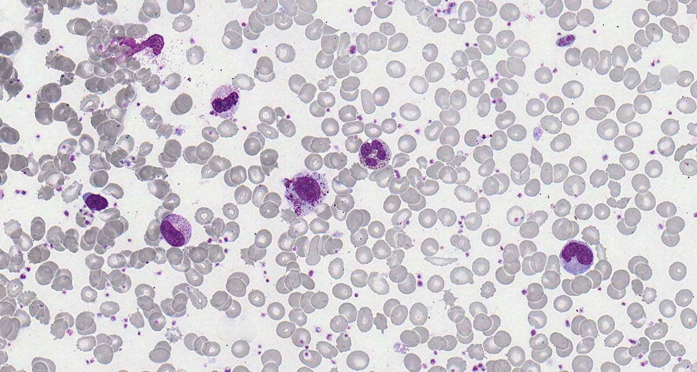
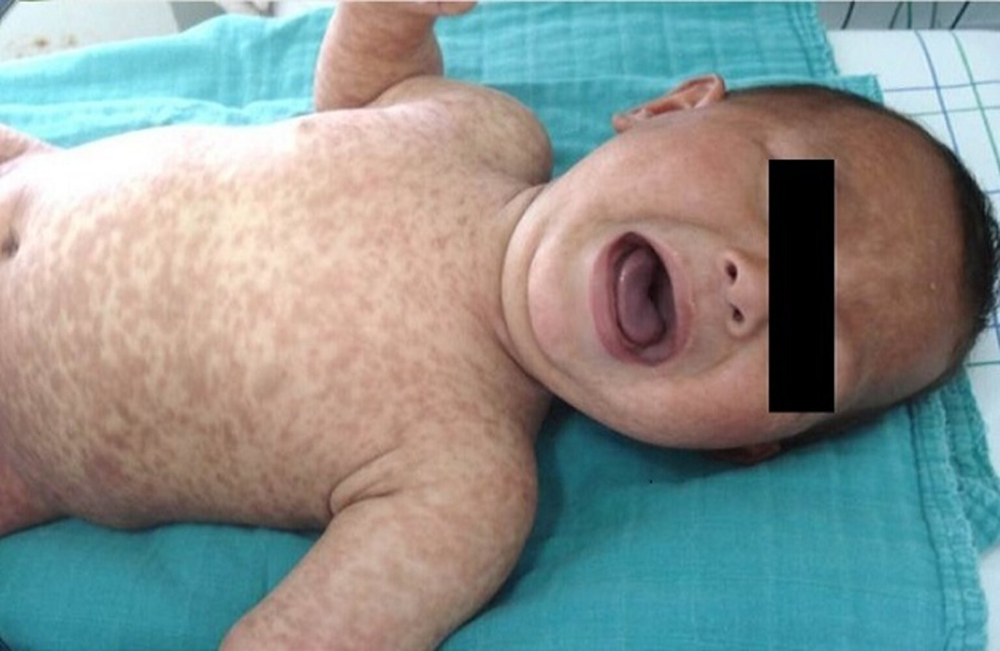

# Mastocytosis

*Categories: Clinical knowledge > Internal medicine > Hematology and oncology > White blood cell and bone marrow disorders > Mastocytosis*

[Original Article Link](https://coursology-qbank.com/amboss/article/x80EK3)

---

## Summary

Mastocytosis is a group of rare disorders characterized by abnormal <u>mast cell</u> <u>proliferation</u> and accumulation in tissues. It is associated with mutations in the <u>KIT</u> <u>gene</u>. <u>Systemic mastocytosis</u> is a group of disorders that affect organs such as the <u>bone marrow</u>, <u>GI tract</u>, and/or bone, with or without <u>skin</u> involvement. <u>Systemic mastocytosis</u> predominantly occurs in adults. Diagnosis is usually confirmed by typical histopathological findings on, e.g., a <u>bone marrow biopsy</u> sample. Treatment is focused on prevention of <u>anaphylaxis</u>, symptomatic therapy, and management of <u>osteopenia</u> and <u>osteoporosis</u>. In advanced disease, treatment also involves <u>targeted therapy</u> (e.g., <u>avapritinib</u> or <u>imatinib</u>), and, in selected cases, <u>allogeneic bone marrow transplantation</u>. <u>Cutaneous mastocytosis</u> is a group of disorders that are limited to the <u>skin</u> and most commonly affect children. <u>Maculopapular cutaneous mastocytosis</u> (<u>urticaria pigmentosa</u>) is the most common type of <u>cutaneous mastocytosis</u> and manifests with red-brown <u>papules</u> or <u>macules</u>; other types include mastocytoma (a single raised lesion) and diffuse <u>cutaneous mastocytosis</u>, which is rare and most commonly occurs in early <u>infancy</u>. Diagnosis is based on the presence of typical <u>skin</u> lesions, <u>skin biopsy</u> findings, and exclusion of <u>systemic mastocytosis</u>. Treatment is primarily supportive, and most cases resolve before <u>adolescence</u>.

---

## Pathophysiology

Mastocytosis is a group of rare disorders associated with mutations in the <u>KIT</u> <u>gene</u> → abnormal;  monoclonal <u>mast cell</u> <u>proliferation</u> and accumulation in tissues;  with <u>end-organ damage</u> (e.g., <u>skin</u>, <u>bone marrow</u>, <u>GI tract</u>) → ↑ serum <u>tryptase</u>, ↑ <u>histamine</u>, and ↑ <u>leukotriene</u> levels [[1]](https://coursology-qbank.com/amboss/article/kIYm1q)

---

## Systemic mastocytosis

### Definition [[2]](https://coursology-qbank.com/amboss/article/ENd81q0)

<u>Systemic mastocytosis</u> is a group of disorders of <u>mast cell</u> <u>proliferation</u> and organ involvement (e.g., <u>bone marrow</u>, <u>GI tract</u>), with or without <u>skin</u> manifestations.

### <u>Epidemiology</u> [[2]](https://coursology-qbank.com/amboss/article/ENd81q0)

<u>Systemic mastocytosis</u> mainly affects adults.

### Clinical features [[2]](https://coursology-qbank.com/amboss/article/ENd81q0)

* Features of increased <u>mast cell</u> mediators ; , e.g., ↑ <u>histamine</u> (can also occur in <u>cutaneous mastocytosis</u>)

* <u>Anaphylaxis</u> (may be recurrent) in response to triggers (e.g., <u>Hymenoptera stings</u>, medications, food)

* Neurological: <u>headache</u>, <u>depression</u>, <u>sleep</u> disturbances

* Cutaneous: <u>hives</u>, <u>pruritus</u>, flushing

* Gastrointestinal: abdominal <u>pain</u>, <u>diarrhea</u>, <u>gastric ulcers</u> (due to increased <u>gastric acid</u> secretion)

* Cardiovascular: <u>hypotension</u>, <u>palpitations</u>, <u>syncope</u>

* Bone: <u>osteopenia</u> or <u>osteoporosis</u>, <u>pathologic fractures</u>

* Features of organ infiltration: e.g., <u>lymphadenopathy</u>, <u>hepatomegaly</u>, <u>splenomegaly</u>, <u>osteolytic bone lesions</u>

* <u>Constitutional symptoms</u>: e.g., <u>weakness</u>, <u>myalgia</u>, <u>arthralgia</u>

### Diagnosis [[2]](https://coursology-qbank.com/amboss/article/ENd81q0)

* Diagnostic confirmation: presence of <u>mast cell</u> aggregates in the <u>bone marrow</u> and/or extracutaneous organs on <u>histopathology</u>

* Additional supportive findings  [[2]](https://coursology-qbank.com/amboss/article/ENd81q0)

* Serum <u>tryptase</u> levels persistently > 20 ng/mL

* <u>Mast cell</u> <u>CD25</u>, CD2, and/or CD30 expression

* Activating <u>KIT</u> mutations

* > 25% of <u>mast cells</u> with atypical morphology

Mastocytosis (bone marrow smear)

### Treatment [[2]](https://coursology-qbank.com/amboss/article/ENd81q0)

Treatment is specialist-guided and includes:

* Prevention of <u>anaphylaxis</u>: e.g., <u>H1 antihistamines</u> and avoidance of triggers of <u>mast cell</u> <u>degranulation</u> (e.g., <u>alcohol</u> consumption, <u>aspirin</u>)

* Symptomatic therapy

* <u>Pruritus</u> and flushing: e.g., <u>H1 antihistamines</u>, <u>leukotriene</u> <u>antagonists</u>, <u>aspirin</u> (<u>off-label</u>)

* GI symptoms: e.g., <u>H2 antihistamines</u> such as <u>famotidine</u>, <u>PPIs</u>

* Treatment of <u>osteopenia</u> and <u>osteoporosis</u>: e.g., <u>bisphosphonates</u>

* Additional therapy for advanced disease (i.e., <u>mast cell</u> <u>leukemia</u> , aggressive <u>systemic mastocytosis</u> , or manifesting with an associated hematologic <u>neoplasm</u> )

* <u>Targeted therapy</u>: e.g., <u>avapritinib</u> (first line) or <u>imatinib</u>

* <u>Allogeneic bone marrow transplantation</u>

---

## Cutaneous mastocytosis

### Definition [[3]](https://coursology-qbank.com/amboss/article/ylddzJ0)

<u>Cutaneous mastocytosis</u> is a group of disorders of <u>mast cell</u> <u>proliferation</u> that are limited to the <u>skin</u>.

### <u>Epidemiology</u> [[3]](https://coursology-qbank.com/amboss/article/ylddzJ0)

<u>Cutaneous mastocytosis</u> most commonly affects children.

### Clinical features [[3]](https://coursology-qbank.com/amboss/article/ylddzJ0)

* Features of increased <u>mast cell</u> mediators: See “Clinical features” in “<u>Systemic mastocytosis</u>.”

* Cutaneous features vary based on the type.

* <u>Maculopapular cutaneous mastocytosis</u> (<u>urticaria pigmentosa</u>) 

* Most common type

* Red-brown <u>papules</u> or <u>macules</u> (rarely, <u>plaques</u>, <u>nodules</u>, or <u>bullae</u>), usually on the extremities and/or trunk

* Mastocytoma: a single raised brown or yellow <u>plaque</u> or <u>nodule</u>, typically on the limbs  [[3]](https://coursology-qbank.com/amboss/article/ylddzJ0)

* Diffuse <u>cutaneous mastocytosis</u>

* Rare type that typically manifests at <u>birth</u> or in early <u>infancy</u>

* Diffuse <u>erythema</u>, <u>pachyderma</u>, <u>dermographism</u>  [[3]](https://coursology-qbank.com/amboss/article/ylddzJ0)

Cutaneous mastocytosis

### Diagnosis [[3]](https://coursology-qbank.com/amboss/article/ylddzJ0)

Diagnosis is based on the following:

* Clinical features

* Typical <u>skin</u> lesions (vary based on the type)

* Darier sign: <u>erythema</u> and <u>urticaria</u> after mechanical irritation (e.g., rubbing, scratching) of the <u>skin</u> or <u>skin</u> lesions  [[3]](https://coursology-qbank.com/amboss/article/ylddzJ0)

* <u>Skin biopsy</u> with ↑ <u>mast cells</u> on <u>histopathology</u>; <u>KIT</u> mutation may be present

* Exclusion of <u>systemic mastocytosis</u> and other hematologic conditions, e.g., normal <u>CBC</u>, <u>PBS</u>, and <u>bone marrow</u> studies: See “<u>Systemic mastocytosis</u>.”  [[3]](https://coursology-qbank.com/amboss/article/ylddzJ0)

> [!WARNING]
> Use caution when examining the <u>skin</u> of patients with diffuse <u>cutaneous mastocytosis</u> to prevent a massive release of <u>mast cell</u> mediators (<u>Darier sign</u>). [[3]](https://coursology-qbank.com/amboss/article/ylddzJ0)

> [!TIP]
> <u>Cutaneous mastocytosis</u> is diagnosed based on the presence of typical <u>skin</u> lesions (e.g., <u>papules</u> with positive <u>Darier sign</u>), <u>skin biopsy</u> findings, and exclusion of <u>systemic mastocytosis</u>. [[3]](https://coursology-qbank.com/amboss/article/ylddzJ0)

### Treatment [[3]](https://coursology-qbank.com/amboss/article/ylddzJ0)

Treatment is supportive only; there are no curative treatments available. <u>Cutaneous mastocytosis</u> often spontaneously resolves.

* Avoidance of triggers of <u>mast cell</u> <u>degranulation</u>

* <u>Antihistamines</u> and <u>corticosteroids</u> to control <u>histamine</u>-related symptoms

* Single lesion: intralesional <u>corticosteroids</u>

* Extensive lesions: <u>PUVA</u>, <u>imatinib</u> (<u>off-label</u>), or <u>omalizumab</u> (<u>off-label</u>)

### Prognosis

* Low risk of progression to <u>systemic mastocytosis</u> [[3]](https://coursology-qbank.com/amboss/article/ylddzJ0)

* In children, lesions often resolve spontaneously before <u>adolescence</u>. [[1]](https://coursology-qbank.com/amboss/article/kIYm1q)

---