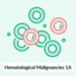
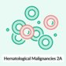
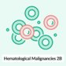
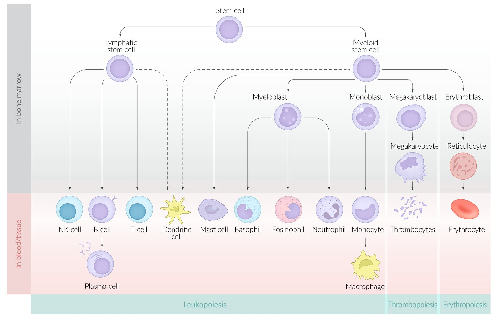
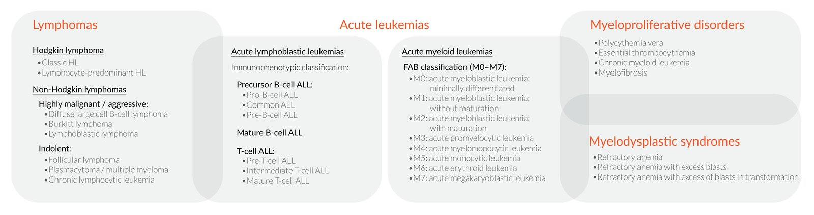
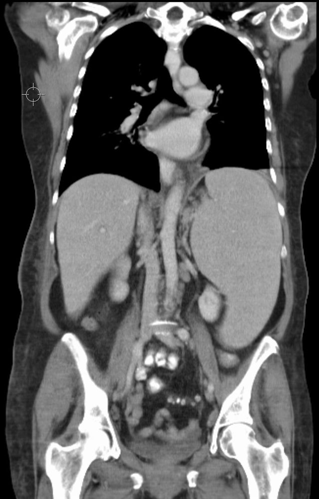
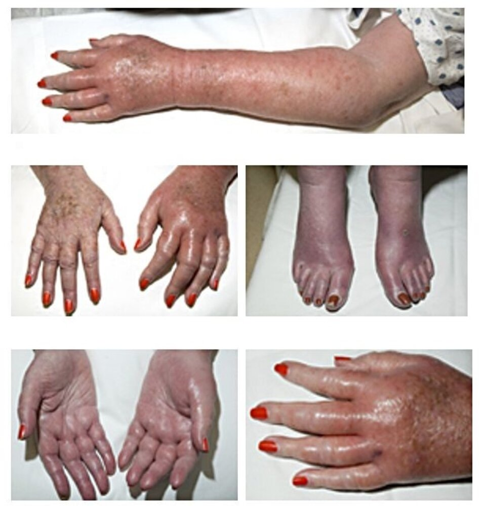
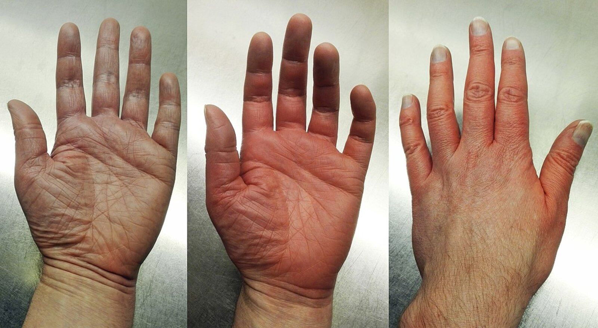
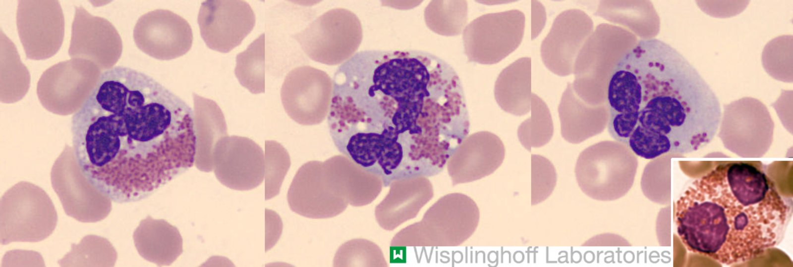

# Myeloproliferative neoplasms

*Categories: Clinical knowledge > Internal medicine > Hematology and oncology > White blood cell and bone marrow disorders > Myeloproliferative neoplasms*

[Original Article Link](https://coursology-qbank.com/amboss/article/lT0vI2)

---

## Summary

Myeloproliferative <u>neoplasms</u> (MPNs) are a group of disorders characterized by a <u>proliferation</u> of normally developed (nondysplastic) <u>multipotent</u> <u>hematopoietic stem cells</u> from the <u>myeloid cell line</u>. The most common (classic) MPNs are <u>chronic myeloid leukemia</u> (<u>CML</u>), <u>essential thrombocythemia</u> (ET), <u>polycythemia vera</u> (PV), and <u>primary myelofibrosis</u> (PMF). Clinical findings overlap significantly between these conditions and the initial diagnostic workup is the same, including blood work (e.g., <u>CBC</u>, <u>peripheral smear</u>), <u>genetic testing</u>, and, if needed, <u>bone marrow</u> studies. Blood tests demonstrate myeloid cell <u>proliferation</u>: <u>Granulocytes</u> are increased in <u>CML</u>, <u>thrombocytes</u> in ET, and all three myeloid lines are increased in PV. PMF has an initial hyperproliferative phase often followed by <u>pancytopenia</u> as a result of progressive <u>bone marrow</u> failure. Elevated <u>uric acid</u> levels and <u>gout</u> may be seen in all MPNs as a result of increased cellular breakdown. <u>Genetic markers</u> can provide further information for diagnosis and also help guide treatment. The <u>Philadelphia chromosome</u> is present in almost all cases of <u>CML</u>. Driver mutations (e.g., <u>JAK2</u>, CALR, MPL) affecting the <u>JAK-STAT signaling pathway</u> are the main diagnostic markers for the remaining classic MPNs. Less common MPNs, which are not associated with the driver mutations, include <u>chronic eosinophilic leukemia</u> (CEL), <u>chronic neutrophilic leukemia</u>, and myeloproliferative <u>neoplasm</u>, unclassifiable. Treatments for all MPNs primarily focus on the prevention of known complications (e.g., <u>thrombohemorrhagic events</u>) and the alleviation of symptoms with combinations of medications and/or procedures including <u>platelet inhibitors</u>, <u>cytoreduction</u>, <u>phlebotomy</u>, <u>targeted therapy</u>, <u>transfusions</u> of <u>blood products</u>, and <u>splenectomy</u>. Patients are kept under close observation because of the risk of developing <u>acute myeloid leukemia</u> (<u>AML</u>). <u>Allogeneic hematopoietic stem cell transplantation</u> is the only curative treatment.

See also ”<u>Polycythemia vera</u>” and ”<u>Chronic myeloid leukemia</u>” for further detail on these conditions.

---

## Overview of myeloproliferative neoplasms

### Conditions [[1]](https://coursology-qbank.com/amboss/article/YYYnnn)

According to the WHO classification, the following disorders are myeloproliferative <u>neoplasms</u>:

* Common (classic)

* <u>Essential thrombocythemia</u>

* <u>Polycythemia vera</u>

* <u>Primary myelofibrosis</u>

* <u>Chronic myeloid leukemia</u>

* Less common

* <u>Chronic eosinophilic leukemia</u>

* <u>Chronic neutrophilic leukemia</u>

* Myeloproliferative <u>neoplasms</u>, unclassifiable

> [!TIP]
> All MPNs can potentially progress to <u>AML</u>. [[2]](https://coursology-qbank.com/amboss/article/okc0Kc0)

Hematological malignancies – Part 1a: Hematopoeisis, Acute Leukemia, and Lymphomas

Hematological malignancies – Part 1b: Myeloproliferative Neoplasms and Myelodysplastic Syndromes

Hematological Malignancies – Part 2A: FAB Classification and Lymphomas

Hematological Malignancies – Part 2B: Myeloproliferative Neoplasms and Leukemic Hiatus

Hematopoiesis

Overview of hematologic neoplasms

### Clinical features [[3]](https://coursology-qbank.com/amboss/article/FVXgwC)

These can occur with varying frequency, depending on the underlying MPN.

* <u>Constitutional symptoms</u>, especially fatigue

* Abdominal <u>pain</u>

* <u>Hepatosplenomegaly</u>

* <u>Thrombohemorrhagic events</u>

* Features of <u>hyperuricemia</u>, e.g., <u>gouty arthritis</u>

### Diagnostics [[1]](https://coursology-qbank.com/amboss/article/YYYnnn)[[4]](https://coursology-qbank.com/amboss/article/MeYMzL)

* Indications include:

* Characteristic clinical symptoms

* Abnormal <u>physical examination</u> findings (e.g., <u>hepatosplenomegaly</u>)

* MPNs may also be seen incidentally when routine blood work shows abnormal cell counts on <u>CBC</u>.

#### Initial studies

* <u>CBC</u>: detects elevated or decreased <u>myeloid cell lines</u>

* <u>Peripheral smear</u>: detects morphological changes in <u>myeloid cell lines</u>

* Elevated <u>LDH</u>, <u>uric acid</u>, and/or <u>leukocyte alkaline phosphatase</u>: indicates high <u>disease burden</u> and high cell turnover

* CT or <u>ultrasound</u> abdomen: <u>Hepatosplenomegaly</u> may be present.

Massive splenomegaly

#### Confirmatory studies [[5]](https://coursology-qbank.com/amboss/article/neY7zL)[[6]](https://coursology-qbank.com/amboss/article/WjcPzX0)[[7]](https://coursology-qbank.com/amboss/article/MPcM2c0)

* <u>Genetic testing</u>: required to diagnose MPNs

* Initial mutation screening

* <u>Philadelphia chromosome</u> (<u>BCR-ABL</u>): present in almost all cases of <u>CML</u>

* Driver mutations (e.g., <u>JAK2</u>, CALR, MPL): associated with PV, ET, and PMF

* Subsequent mutation testing: Extended panels may detect atypical driver mutations, nondriver mutations (e.g., CSF3R), and high-molecular risk mutations.  [[7]](https://coursology-qbank.com/amboss/article/MPcM2c0)

* <u>Bone marrow biopsy</u>: often required to definitively confirm a diagnosis

> [!TIP]
> With the exception of <u>CML</u>, all of the classic MPNs have varying degrees of <u>JAK2</u> mutations, which can be used as a diagnostic marker. [[7]](https://coursology-qbank.com/amboss/article/MPcM2c0)[[8]](https://coursology-qbank.com/amboss/article/nPc72c0)

### Diagnostic comparison of classic MPNs [[1]](https://coursology-qbank.com/amboss/article/YYYnnn)[[4]](https://coursology-qbank.com/amboss/article/MeYMzL)

The WHO has established diagnostic criteria for each of the MPNs (See “Tips and links” for full criteria). Laboratory findings seen in classic MPNs are included in the following table.

|  Comparison of classic myeloproliferative <u>neoplasms</u> [[1]](https://coursology-qbank.com/amboss/article/YYYnnn)[[4]](https://coursology-qbank.com/amboss/article/MeYMzL)[[6]](https://coursology-qbank.com/amboss/article/WjcPzX0)  |  |  |  |
| --- | --- | --- | --- |
|  | Clinical and <u>laboratory studies</u> |  Percentage of patients with mutations [[7]](https://coursology-qbank.com/amboss/article/MPcM2c0)[[8]](https://coursology-qbank.com/amboss/article/nPc72c0)  | <u>Bone marrow</u> |
| <u>Essential thrombocythemia</u> |   * Isolated ↑ <u>platelets</u> (thrombocythemia)  * <u>Peripheral smear</u>: large hypogranular <u>platelets</u>    |   * <u>JAK2</u>: 50–60%  * CALR: 26%  * MPL: 4%    |   * ↑ Large mature <u>megakaryocytes</u>  * No increase of granulocytic or erythroid precursors    |
| <u>Polycythemia vera</u> |   * ↑ <u>Hgb</u>, HCT, and/or <u>red cell mass</u> (as a result of ↑ <u>RBCs</u>)  * ↓ <u>Erythropoietin</u>  * Patients may also have: [[9]](https://coursology-qbank.com/amboss/article/6kcjKc0)  * ↑ <u>Platelets</u>  * ↑ <u>WBCs</u>  * ↑ <u>Leukocyte alkaline phosphatase</u>  * <u>Peripheral smear</u>: normal morphology    |  * <u>JAK2</u>: ∼ 98%   |   * Hypercellularity  * Trilinear <u>hematopoietic</u> <u>proliferation</u> (panmyelosis)  * <u>Pleomorphic</u> mature <u>megakaryocytes</u>    |
| <u>Primary myelofibrosis</u> |   * Palpable <u>splenomegaly</u>  * ↓↓ <u>Hgb</u>  * ↑ <u>WBC</u>  * ↑ <u>LDH</u>  * <u>Peripheral smear</u>  * <u>Leukoerythroblastosis</u>  * <u>Dacrocytes</u> (<u>teardrop cells</u>)    |   * <u>JAK2</u>: 50–60%  * CALR: 18–32%  * MPL: 5–9%    |   * All stages: ↑ atypical <u>megakaryocytes</u>  * Proliferative stage: hypercellularity  * ↑ <u>Granulopoiesis</u>  * May include ↓ <u>erythropoiesis</u>  * <u>Fibrotic</u> stage  * Severe <u>fibrosis</u>  * “<u>Dry tap</u>” on <u>aspiration</u>    |
| <u>Chronic myeloid leukemia</u> |   * <u>Splenomegaly</u>  * ↑↑↑ <u>WBCs</u>  * ↑ <u>Platelets</u>  * ↓ <u>RBCs</u>  * ↓ <u>Leukocyte alkaline phosphatase</u>  * <u>Peripheral smear</u> [[10]](https://coursology-qbank.com/amboss/article/JkcsKc0)  * ↑ <u>Basophils</u>  * <u>Pseudo-Pelger-Huet anomaly</u>    |  * <u>Philadelphia chromosome</u> (<u>BCR</u>-ABL): > 95%   |   * Hypercellularity  * ↑ Myeloid:erythroid <u>ratio</u>    |

> [!TIP]
> MPNs have overlapping presenting features, mutations, and diagnostic findings. A patient's diagnosis may change if their condition progresses over time (e.g., PV may transform into <u>myelofibrosis</u>; PMF may transform into <u>AML</u>). [[4]](https://coursology-qbank.com/amboss/article/MeYMzL)[[11]](https://coursology-qbank.com/amboss/article/7kc46c0)

### Treatment overview [[8]](https://coursology-qbank.com/amboss/article/nPc72c0)[[12]](https://coursology-qbank.com/amboss/article/LPcw2c0)

The choice of treatment depends on the underlying diagnosis, the presence of <u>risk factors</u>, and any comorbidities.  [[8]](https://coursology-qbank.com/amboss/article/nPc72c0)

* Low-risk MPNs are often managed with observation.

* High-risk or symptomatic MPNs are managed with a combination of symptomatic management, treatment to delay disease progression, and, in rare cases, <u>allogeneic stem cell transplantation</u>.

#### <u>Supportive care</u>

* <u>Thromboembolism</u> prevention

* <u>Antiplatelet drugs</u> (e.g., <u>aspirin</u>)

* <u>Therapeutic phlebotomy</u>: to decrease <u>hematocrit</u> and blood viscosity for high <u>RBC counts</u>

* <u>Symptomatic splenomegaly</u> [[13]](https://coursology-qbank.com/amboss/article/mPcV2c0)

* <u>Splenectomy</u>, splenic <u>irradiation</u>

* <u>JAK2 inhibitors</u>

* <u>Cytoreduction</u>: Options include <u>hydroxyurea</u>, <u>cladribine</u>, and <u>interferon alpha</u>. [[8]](https://coursology-qbank.com/amboss/article/nPc72c0)

* Symptomatic <u>cytopenias</u> (e.g., bleeding from <u>thrombocytopenia</u>, <u>symptomatic anemia</u>)

* <u>Transfusions</u> (e.g., blood, <u>platelets</u>)

* <u>Erythropoietin</u> and its analogs (e.g., <u>darbepoetin</u>)

* <u>Androgenic steroids</u> (e.g., <u>danazol</u>)  [[14]](https://coursology-qbank.com/amboss/article/ZkcZmc0)[[15]](https://coursology-qbank.com/amboss/article/h6cckW0)

* <u>Prednisone</u>

* Immunomodulators: <u>thalidomide</u> and analogs (e.g., <u>lenalidomide</u>, <u>pomalidomide</u>)  [[14]](https://coursology-qbank.com/amboss/article/ZkcZmc0)

* <u>Splenectomy</u> for refractory <u>transfusion</u>-dependent <u>anemia</u>

* Relief of associated symptoms

* <u>Gouty arthritis</u>: <u>allopurinol</u>

* <u>Pruritus</u>: <u>antihistamines</u>

#### Disease-specific therapy

* <u>Targeted therapy</u>: <u>JAK2 inhibitors</u> (e.g., <u>ruxolitinib</u>) for PV and <u>myelofibrosis</u>  [[8]](https://coursology-qbank.com/amboss/article/nPc72c0)

* <u>Allogeneic hematopoietic stem cell transplantation</u>: potentially curative  [[8]](https://coursology-qbank.com/amboss/article/nPc72c0)

---

## Primary myelofibrosis

### Background

* Description: : any MPN leading to <u>bone marrow</u> <u>fibrosis</u>, <u>extramedullary hematopoiesis</u>, and <u>splenomegaly</u>

* <u>Primary myelofibrosis</u> (also known as <u>agnogenic myeloid metaplasia</u>): occurs spontaneously

* Secondary <u>myelofibrosis</u>: occurs as a result of disease progression in patients previously diagnosed with another MPN, e.g., <u>polycythemia vera</u> (PV), <u>essential thrombocythemia</u> (ET).

* <u>Epidemiology</u>: : Peak <u>incidence</u> is between 50 and 74 years of age. [[16]](https://coursology-qbank.com/amboss/article/nkc7oc0)

* Pathophysiology: genetic mutations → <u>hyperplasia</u> of atypical <u>megakaryocytes</u> → ↑ <u>TGF-β</u> → ↑ <u>fibroblast</u> activity → <u>bone marrow</u> obliteration due to <u>fibrosis</u> → displacement of <u>hematopoietic stem cells</u> → <u>extramedullary hematopoiesis</u>

### Clinical features [[3]](https://coursology-qbank.com/amboss/article/FVXgwC)

* <u>Constitutional symptoms</u>

* <u>Anemia</u>

* <u>Symptomatic splenomegaly</u>  [[13]](https://coursology-qbank.com/amboss/article/mPcV2c0)

* <u>Thromboembolic events</u>

* <u>Petechial</u> bleeding

* Increased infections

### Diagnostics [[1]](https://coursology-qbank.com/amboss/article/YYYnnn)[[4]](https://coursology-qbank.com/amboss/article/MeYMzL)

PMF is a diagnosis of exclusion, while secondary <u>myelofibrosis</u> is typically diagnosed as part of the monitoring of the preceding MPN (e.g., PV, ET). Other causes of <u>bone marrow</u> <u>fibrosis</u> must be ruled out before the diagnosis can be made; see “Differential diagnoses.” [[8]](https://coursology-qbank.com/amboss/article/nPc72c0)

* Initial studies

* <u>CBC</u> [[3]](https://coursology-qbank.com/amboss/article/FVXgwC)

* Classic presentation: <u>anemia</u>, <u>thrombocytosis</u>, and <u>leukocytosis</u>

* Patients may additionally present with:

* <u>Thrombocytopenia</u> (33%)

* <u>Pancytopenia</u> (10%)

* ↑ <u>Leukocyte alkaline phosphatase</u>, <u>LDH</u>, and <u>uric acid</u>

* <u>Peripheral blood smear</u>: : <u>dacrocytes</u> (<u>teardrop cells</u>)   and <u>leukoerythroblastosis</u> (overt <u>fibrotic</u> stage)

* <u>Genetic marker</u> studies [[7]](https://coursology-qbank.com/amboss/article/MPcM2c0)

* <u>JAK2</u> mutation: 50–60% of patients

* CALR mutation: 18–32% of patients

* MPL mutation: 5–9% of patients

* <u>Bone marrow</u> studies

* <u>Aspiration</u> often fails (dry tap) because of severe marrow <u>fibrosis</u>.

* <u>Biopsy</u>

* Atypical <u>megakaryocytes</u>

* Prefibrotic stage: hypercellularity (↑ <u>granulopoiesis</u>), possibly ↓ <u>erythropoiesis</u>

* <u>Fibrotic</u> stage: severe <u>fibrosis</u>

> [!TIP]
> As PMF progresses (i.e., overt <u>fibrotic</u> phase), <u>extramedullary hematopoiesis</u> becomes more prominent with signs of <u>pancytopenia</u> and <u>splenomegaly</u>. [[1]](https://coursology-qbank.com/amboss/article/YYYnnn)[[4]](https://coursology-qbank.com/amboss/article/MeYMzL)

> [!NOTE]
> In <u>myelofibrosis</u>, <u>RBCs</u> shed tears (<u>teardrop cells</u>) because they have been forced out of the <u>fibrosed</u> <u>bone marrow</u> (<u>extramedullary hematopoiesis</u>).

Dacrocytes

### Differential diagnoses [[17]](https://coursology-qbank.com/amboss/article/B4czlc0)

* <u>Neoplastic</u> conditions

* Other MPNs (e.g., <u>CML</u>, PV, ET)

* <u>Myelodysplastic syndromes</u>

* <u>Lymphomas</u> and <u>leukemias</u>

* Infections (e.g., <u>tuberculosis</u>)

* Endocrine abnormalities (e.g., <u>hyperparathyroidism</u>, <u>vitamin D deficiency</u>)

* Autoimmune diseases (e.g., <u>SLE</u>, <u>Sjogren syndrome</u>, <u>systemic sclerosis</u>, primary autoimmune <u>myelofibrosis</u>)

* Medication side effects (e.g., <u>thrombopoietin</u> <u>receptor</u> <u>agonist</u> toxicity)

### Treatment [[8]](https://coursology-qbank.com/amboss/article/nPc72c0)[[12]](https://coursology-qbank.com/amboss/article/LPcw2c0)[[18]](https://coursology-qbank.com/amboss/article/NPc-Uc0)

Risk scores and screening for high-risk features are used to <u>stratify</u> risk and determine treatment.  [[19]](https://coursology-qbank.com/amboss/article/x4cElc0)

* Consider observation for low-risk patients.

* Start treatment in patients with:

* Moderate to high-risk features

* <u>Symptomatic anemia</u>

* <u>Symptomatic splenomegaly</u>

* Secondary <u>myelofibrosis</u> is typically treated with a combination of therapies targeting <u>primary myelofibrosis</u> as well as the preceding MPN (e.g., PV, ET).

#### High-risk features [[19]](https://coursology-qbank.com/amboss/article/x4cElc0)[[20]](https://coursology-qbank.com/amboss/article/5Pci2c0)

* Patient features

* Age ≥ 65 years

* <u>Constitutional symptoms</u>

* <u>Transfusion</u> dependency

* Laboratory findings

* <u>Anemia</u> (<u>Hgb</u> < 10 g/dL)

* <u>WBC</u> > 25,000/mm³

* Circulating blasts ≥ 1%  [[13]](https://coursology-qbank.com/amboss/article/mPcV2c0)

* <u>Thrombocytopenia</u> (<u>platelets</u> < 100,000/mm³)

* Unfavorable <u>karyotype</u>

#### <u>Supportive care</u>

* <u>Thromboembolism</u> prevention: Consider <u>low-dose aspirin</u> DOSAGE  [[21]](https://coursology-qbank.com/amboss/article/z4crNc0)

* <u>Symptomatic splenomegaly</u>: Options include <u>ruxolitinib</u> and <u>hydroxyurea</u> (see “Treatment overview” for further information).

* Symptomatic <u>cytopenias</u>: <u>Transfusions</u> are the mainstay of treatment; other options, including <u>thalidomide</u>, may be considered (see “Treatment overview” for further information). [[3]](https://coursology-qbank.com/amboss/article/FVXgwC)

#### Disease-specific therapy

* <u>Targeted therapy</u>: <u>JAK2 inhibitors</u> (e.g., <u>ruxolitinib</u>)  [[8]](https://coursology-qbank.com/amboss/article/nPc72c0)[[22]](https://coursology-qbank.com/amboss/article/d4coRc0)

* <u>Allogeneic hematopoietic stem cell transplantation</u>: potentially curative;  (typically performed in younger patients with high-risk features and/or a poor prognosis) [[8]](https://coursology-qbank.com/amboss/article/nPc72c0)

### Complications [[8]](https://coursology-qbank.com/amboss/article/nPc72c0)

* Progressive <u>bone marrow</u> failure

* <u>Portal hypertension</u> due to <u>splenomegaly</u>

* <u>Pulmonary hypertension</u>

* Transformation to <u>acute leukemia</u>

---

## Essential thrombocythemia

### Background

* Description: isolated uncontrolled <u>proliferation</u> of <u>platelets</u> not caused by another condition (e.g., <u>reactive thrombocytosis</u>, another MPN)

* <u>Epidemiology</u> [[23]](https://coursology-qbank.com/amboss/article/MkcMoc0)

* Median age at diagnosis: 60 years

* <u>♀</u> > <u>♂</u> (2:1)

* Pathophysiology: genetic mutations → activation of the <u>thrombopoietin</u> <u>receptor</u> → <u>proliferation</u> of <u>platelets</u> [[6]](https://coursology-qbank.com/amboss/article/WjcPzX0)

### Clinical features [[8]](https://coursology-qbank.com/amboss/article/nPc72c0)

* Commonly asymptomatic

* <u>Thromboembolic events</u>

* Increased risk of fetal loss  [[3]](https://coursology-qbank.com/amboss/article/FVXgwC)

* <u>Vasomotor symptoms</u> (<u>headache</u>, visual disturbances, acral <u>paresthesias</u>, ocular <u>migraines</u>)

* <u>Acute gouty arthritis</u>

* <u>Petechial</u> bleeding

* <u>Erythromelalgia</u>

Erythromelalgia in polycythemia vera

Erythromelalgia in hereditary small fiber neuropathy

### Diagnostics [[1]](https://coursology-qbank.com/amboss/article/YYYnnn)[[4]](https://coursology-qbank.com/amboss/article/MeYMzL)

ET is a diagnosis of exclusion and requires ruling out other causes of elevated <u>platelets</u>, such as <u>reactive thrombocytosis</u> and other MPNs (e.g., prefibrotic <u>myelofibrosis</u>, PV). [[8]](https://coursology-qbank.com/amboss/article/nPc72c0)

* Initial studies

* <u>CBC</u>: isolated sustained <u>thrombocytosis</u> (> 450,000/mm³)

* ↑ <u>LDH</u> and <u>uric acid</u>

* <u>Pseudohyperkalemia</u>  [[8]](https://coursology-qbank.com/amboss/article/nPc72c0)

* <u>Peripheral blood smear</u>: large hypogranular <u>platelets</u>

* <u>Genetic marker</u> studies [[7]](https://coursology-qbank.com/amboss/article/MPcM2c0)

* <u>JAK2</u> mutation: 50–60% of patients

* CALR mutation: 26% of patients

* MPL mutation: 4% of patients

* <u>Bone marrow</u> studies: <u>hyperplasia</u> of mature <u>megakaryocytes</u>

> [!TIP]
> Isolated <u>thrombocytosis</u> is characteristic of ET; however, it may be also seen in early PV and early PMF. [[8]](https://coursology-qbank.com/amboss/article/nPc72c0)

### Differential diagnoses

* <u>Reactive thrombocytosis</u>

* Other MPNs with elevated <u>platelets</u> (e.g., prefibrotic PMF, PV, <u>CML</u>)

* <u>Hereditary thrombocytosis</u>

* See also “<u>Thrombocytosis</u>.”

### Treatment [[8]](https://coursology-qbank.com/amboss/article/nPc72c0)[[12]](https://coursology-qbank.com/amboss/article/LPcw2c0)[[24]](https://coursology-qbank.com/amboss/article/OPcIUc0)

Risk scores and screening for high-risk features are used to <u>stratify</u> risk and determine treatment.  [[19]](https://coursology-qbank.com/amboss/article/x4cElc0)[[25]](https://coursology-qbank.com/amboss/article/-pcDHW0)

#### Low and intermediate-risk patients

* Observation

* Consider <u>low-dose aspirin</u>. [[8]](https://coursology-qbank.com/amboss/article/nPc72c0)

#### High-risk patients

Treat in order to prevent <u>thrombohemorrhagic events</u>.

* Start <u>low-dose aspirin</u> DOSAGE  [[8]](https://coursology-qbank.com/amboss/article/nPc72c0)[[26]](https://coursology-qbank.com/amboss/article/W4cPRc0)

* Reduce <u>platelet count</u> with one or more of the following: 

* <u>Hydroxyurea</u>

* Anagrelide  [[27]](https://coursology-qbank.com/amboss/article/lPcvUc0)

* <u>Interferon alpha</u>

* Features that increase the risk of <u>thrombohemorrhagic events</u> include: [[19]](https://coursology-qbank.com/amboss/article/x4cElc0)[[28]](https://coursology-qbank.com/amboss/article/_Pc5hc0)

* <u>Thrombotic</u> <u>risk factors</u>

* Age ≥ 60 years

* History of <u>thrombosis</u>

* Presence of <u>JAK2</u> V617F mutation

* <u>Cardiovascular risk factors</u>, e.g., <u>diabetes</u>, <u>hypertension</u>, history of smoking  [[28]](https://coursology-qbank.com/amboss/article/_Pc5hc0)

* <u>Leukocytosis</u> > 11,000/mm³

* Bleeding <u>risk factors</u>

* <u>Platelet count</u> 1,000,000–1,500,000 /mm³ is associated with <u>acquired von Willebrand disease</u> (AVWD). [[29]](https://coursology-qbank.com/amboss/article/zPcrhc0)

* History of <u>major bleeding</u>

### Complications [[8]](https://coursology-qbank.com/amboss/article/nPc72c0)

* Venous or arterial clots

* AVWD [[30]](https://coursology-qbank.com/amboss/article/FmXghA)[[31]](https://coursology-qbank.com/amboss/article/8mXOhA)

* Transformation to:

* <u>Myelofibrosis</u>

* <u>Acute myeloid leukemia</u>

---

## Chronic eosinophilic leukemia

* Description: <u>leukemia</u> with <u>monoclonal proliferation</u> of eosinophilic <u>granulocytes</u> that causes peripheral <u>eosinophilia</u> and tissue damage

* Etiology: various associated cytogenetic mutations, particularly translocations of <u>chromosome</u> 5 and <u>trisomy</u> 8 [[3]](https://coursology-qbank.com/amboss/article/FVXgwC)

* Clinical features [[3]](https://coursology-qbank.com/amboss/article/FVXgwC)

* <u>Hepatosplenomegaly</u>

* <u>Anemia</u>;  and/or <u>coagulation disorders</u>

* Cardiac, pulmonary, hepatic, splenic, and <u>CNS</u> involvement

* Diagnosis

* <u>CBC</u>: ↑↑↑ <u>eosinophils</u> (> 1,500/mm³) [[4]](https://coursology-qbank.com/amboss/article/MeYMzL)

* <u>Peripheral blood smear</u> and <u>bone marrow aspiration</u>: monoclonal blast cells or cytogenetically abnormal <u>eosinophils</u>

* Treatment [[3]](https://coursology-qbank.com/amboss/article/FVXgwC)

* <u>Tyrosine kinase inhibitors</u>, e.g., <u>imatinib</u>

* <u>Allogeneic stem cell transplantation</u>

* Symptomatic relief to decrease <u>eosinophil</u> counts, e.g., <u>glucocorticoids</u>, <u>hydroxyurea</u>, or antiinterleukin-5 therapy

Chronic eosinophilic leukemia

---