# Non-Hodgkin lymphomas

*Categories: Clinical knowledge > Internal medicine > Hematology and oncology > White blood cell and bone marrow disorders > Non-Hodgkin lymphomas*

[Original Article Link](https://coursology-qbank.com/amboss/article/NT0-I2)

---

## Summary

<u>Lymphomas</u> are malignancies that arise from <u>lymphocytes</u> and are classified as either <u>Hodgkin lymphomas</u> (characterized by <u>Reed-Sternberg</u> cells) or non-Hodgkin <u>lymphomas</u> (NHLs), which comprise all other types of <u>lymphoma</u>. NHLs are further classified according to cell type, i.e., <u>B cells</u>, <u>T cells</u>, and <u>natural killer (NK) cells</u>; location (nodal or extranodal); and <u>tumor grade</u>. Low-grade tumors originate from mature cells that have a slow growth rate and an indolent clinical course. The most common low-grade <u>B-cell lymphoma</u> is <u>follicular lymphoma</u>, while the most common low-grade <u>T-cell lymphomas</u> are cutaneous <u>T-cell lymphomas</u>, such as <u>mycosis fungoides</u>. High-grade tumors have a rapid growth rate and an aggressive clinical course. Certain subtypes of NHL, such as <u>Burkitt lymphoma</u>, are more common in children and young adults than in older adults. NHL is diagnosed by obtaining a <u>biopsy</u> of the affected tissue and carrying out a detailed assessment, including <u>immunophenotyping</u>, genetics, and molecular testing. These studies allow for the identification of specific NHL subtypes, which guides treatment. Generally, treatment involves a combination of <u>chemotherapy</u> and <u>radiation therapy</u>. Patients with high-grade NHLs and those with low-grade tumors and limited disease are treated with curative intent. Patients with advanced, low-grade tumors who experience symptoms usually receive <u>palliative treatment</u>.

---

## Epidemiology

* <u>Incidence</u>: NHL is the most common <u>hematopoietic</u> <u>neoplasm</u>.  [[1]](https://coursology-qbank.com/amboss/article/HbXKE9)

* Age

* The <u>incidence</u> of all NHLs increases with age; the peak <u>incidence</u> is in those aged > 50 years.

* High-grade <u>lymphomas</u> are most common in children and young adults (20–40 years).

Epidemiological data refers to the US, unless otherwise specified.

---

## Etiology

* <u>Chromosomal translocations</u>: most commonly t(14;18)

* Infections [[2]](https://coursology-qbank.com/amboss/article/ebXxs9)

* <u>EBV</u>

* <u>HIV</u>

* <u>HTLV</u>-1

* <u>HCV</u>

* <u>Helicobacter pylori</u>: associated with <u>gastric lymphoma</u>, e.g., <u>MALT lymphoma</u>, <u>diffuse large B-cell lymphoma</u> (<u>DLBCL</u>)

* Autoimmune diseases: <u>Hashimoto thyroiditis</u>, <u>rheumatoid arthritis</u>

* <u>Immunodeficiency</u>: <u>congenital immunodeficiencies</u>, <u>AIDS</u>, history of <u>chemotherapy</u> and/or <u>immunosuppressive therapy</u>

* Environmental factors: <u>aromatic hydrocarbons</u> (e.g., <u>benzene</u>), radiation

---

## Overview

### <u>B-cell lymphomas</u> (85% of all NHLs)

| B-cell lymphomas |  |  |
| --- | --- | --- |
| Grade | <u>Lymphoma</u> | Features |
| Indolent (low-grade) | Follicular lymphoma |   * Most common low-grade <u>lymphoma</u> in adults  * Slowly progressive and painless course with an alternating (waxing and waning) pattern of <u>lymphadenopathy</u> and <u>splenomegaly</u>  * Translocation t(14;18), which involves the heavy-chain Ig (<u>chromosome</u> 14) and Bcl-2 <u>gene</u> (<u>chromosome</u> 18) → overexpression of Bcl-2 → dysregulation of <u>apoptosis</u> (normally inhibited by Bcl-2)  * Centrocyte: nodular, small cells with cleaved <u>nuclei</u>    |
| Hairy cell leukemia |   * <u>Epidemiology</u>  * Most common in middle-aged men  * <u>♂</u> > <u>♀</u> (4:1)  * Pathology: mature <u>B-cell</u> <u>tumor</u>; <u>BRAF</u> mutations are common  * Clinical features  * Symptomatic <u>pancytopenia</u>  * <u>Massive splenomegaly</u>  * No <u>lymphadenopathy</u>  * <u>B symptoms</u> are rare.  * Diagnostics  * Usually tartrate-resistant acid <u>phosphatase</u> (<u>TRAP</u>) stain positive  * <u>Flow cytometry</u> (preferred over <u>TRAP</u> stain): CD11c marker  * <u>CBC</u>: <u>Leukopenia</u> is common, but up to 20% of patients have <u>leukocytosis</u>.  * <u>Peripheral blood smear</u>: Hairy cells have irregular <u>cytoplasmic</u> projections that cause the characteristic “hairy” appearance.  * <u>Bone marrow aspiration</u>: often yields a <u>dry tap</u> due to <u>bone marrow</u> involvement with subsequent <u>fibrosis</u>  * For more information on management, see the “Treatment” section below.    |  |
|  Marginal zone B-cell lymphomas (MZLs): a group of <u>lymphomas</u> that arise from postgerminal center <u>B cells</u>  |   * Most common in adults  * Associated with autoimmune diseases (e.g., <u>Sjogren syndrome</u>, <u>Hashimoto thyroiditis</u>)  * Types  * <u>Extranodal MZL</u>: gastric <u>MALT lymphoma</u> (most common) and nongastric <u>MALT lymphoma</u> (e.g., <u>thyroid</u>, <u>salivary gland</u>)  * Nodal MZL (or monocytoid <u>B-cell lymphoma</u>)  * Splenic MZL  * Gastric <u>MALT lymphoma</u>: associated with translocation t(11;18)(q21;q21) and <u>H. pylori</u> infection    |  |
| <u>Waldenstrom macroglobulinemia</u> |  * <u>IgM</u> <u>antibodies</u>   |  |
|  Small lymphocytic lymphoma (<u>SLL</u>) [[3]](https://coursology-qbank.com/amboss/article/Wn0PHg)  |  * <u>SLL</u> shares histological features with <u>chronic lymphocytic leukemia</u> (<u>CLL</u>); however, the <u>neoplastic</u> cells are primarily located in the lymphatic tissue rather than circulating in peripheral blood.   |  |
| Aggressive (high-grade) |  Diffuse large B-cell lymphoma   |   * Most common NHL in adults  * Caused by mutations in Bcl-2, Bcl-6, and <u>p53</u> [[4]](https://coursology-qbank.com/amboss/article/iXbJBH)[[5]](https://coursology-qbank.com/amboss/article/QXbuBH)  * <u>Primary CNS lymphoma</u> (subtype of <u>DLBCL</u>)   * Associated with <u>EBV</u> and <u>AIDS</u>  * <u>Focal neurologic deficits</u>, neuropsychiatric symptoms  * Solitary <u>ring-enhancing</u> lesion on <u>MRI</u>    |
|  Mantle cell lymphoma  [[6]](https://coursology-qbank.com/amboss/article/ubXpv9)  |   * Most common in adult men  * Translocation t(11;14) involving <u>cyclin</u> D1 (<u>chromosome</u> 11) and heavy-chain Ig (<u>chromosome</u> 14) → increased levels of <u>cyclin</u> D1 → promotes the transition of cells to <u>S phase</u>  * CD5+  * Spreads rapidly; most patients are diagnosed with advanced disease (stage IV)    |  |
|  Burkitt lymphoma   [[7]](https://coursology-qbank.com/amboss/article/dn0oHg)  |   * Most common in children  * Translocation t(8;14) in 75% of cases: <u>reciprocal translocation</u> involving the <u>c-myc</u> <u>gene</u> (<u>chromosome</u> 8) and heavy-chain Ig <u>locus</u> (<u>chromosome</u> 14) → overactivation of <u>c-myc</u> <u>proto-oncogene</u> → activation of <u>transcription</u>  * Forms  * Sporadic: typically located in the abdomen or <u>pelvis</u>  * <u>Endemic</u>: associated with <u>EBV</u> (most prevalent in equatorial Africa and South America) and is typically located in the maxillary and mandibular bones  * <u>Immunodeficiency</u>-associated: e.g. <u>HIV infection</u>  * Starry sky pattern    * Microscopic finding that resembles a starry sky  * <u>Tingible body macrophages</u> (containing many phagocytized <u>tumor</u> cells) are scattered diffusely within a sheet of uniform <u>neoplastic</u> cells (<u>lymphocytes</u>).  * <u>Bowel obstruction</u> due to an abdominal mass    |  |
|  Precursor <u>B-cell</u> lymphoblastic <u>lymphoma</u>  |  * Most common in <u>adolescents</u> and young adults   |  |

> [!NOTE]
> <u>Burkitt lymphoma</u> is most common in kids.

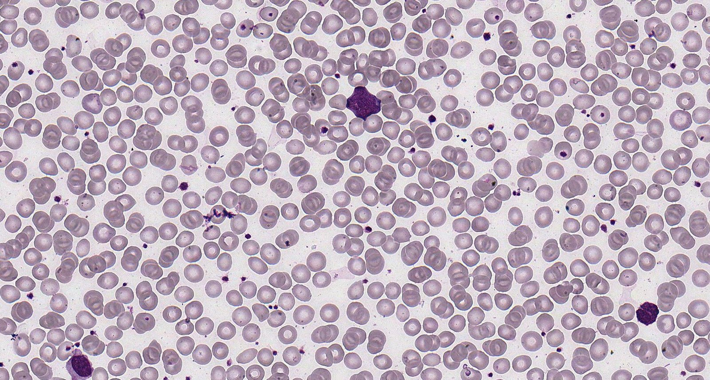

Follicular lymphoma (peripheral blood smear)

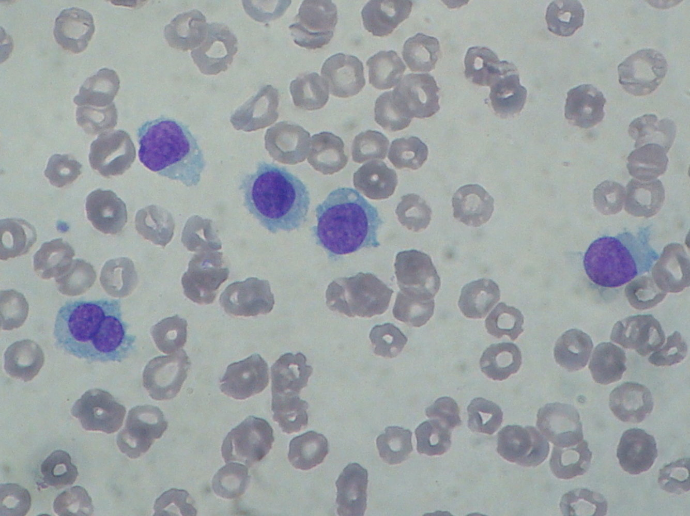

Hairy cell leukemia

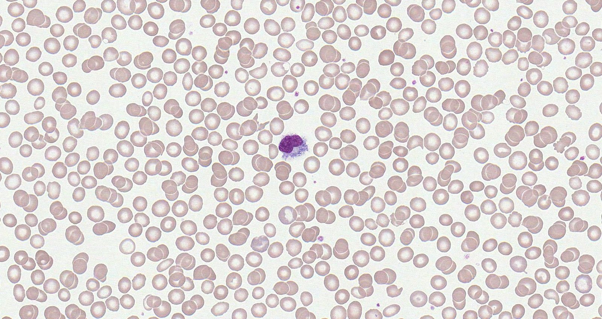

Hairy cell leukemia

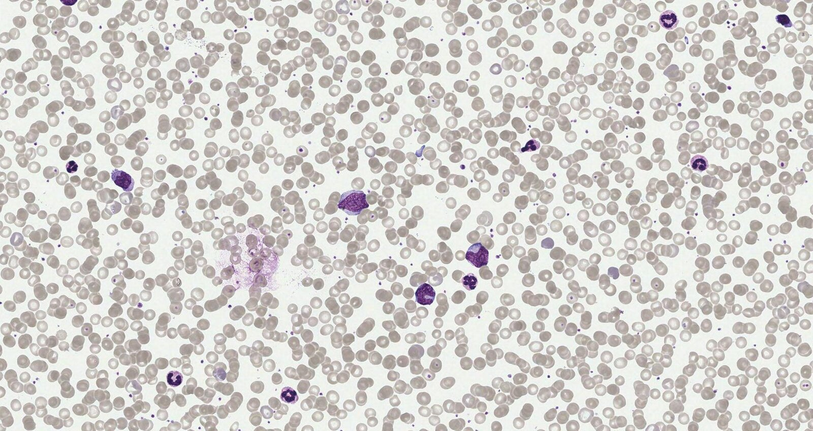

Diffuse large B-cell lymphoma

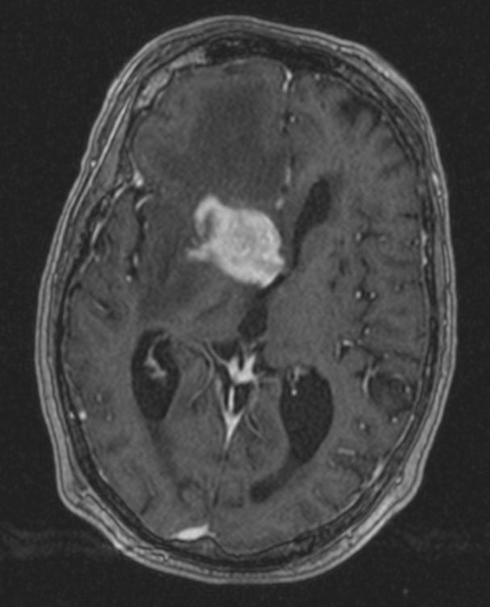

Intracerebral mass with midline shift

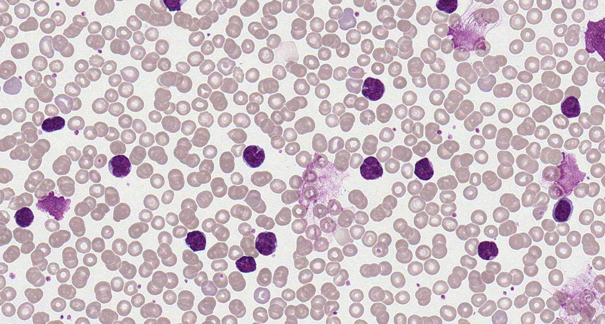

Mantle cell lymphoma (peripheral blood smear)

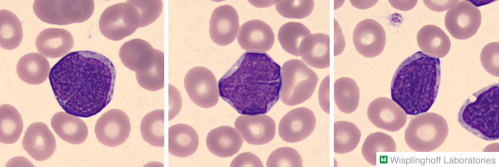

Mantle cell lymphoma

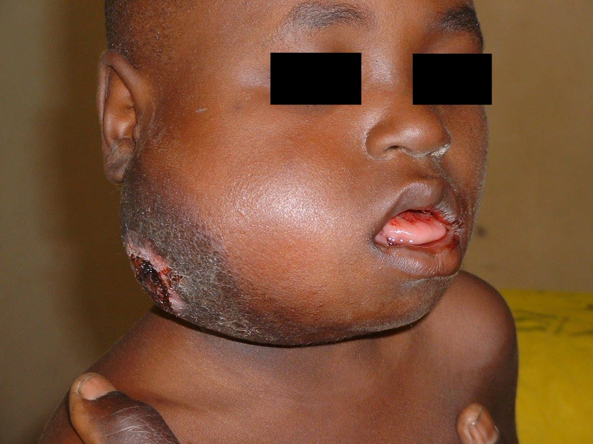

Burkitt lymphoma

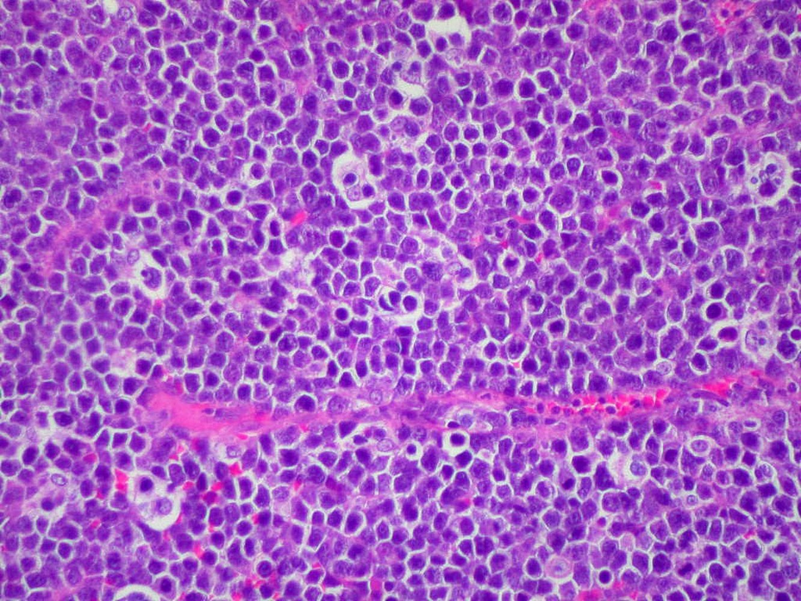

Burkitt lymphoma

### <u>T-cell lymphomas</u> (15% of all NHL)

| T-cell lymphomas |  |  |
| --- | --- | --- |
| Grade | <u>Lymphoma</u> | Features |
| Indolent (low-grade) |  <u>Mycosis fungoides</u>: most common form of cutaneous T-cell lymphoma (a type of <u>lymphoma</u> characterized by malignant <u>T-cell</u> infiltration of the <u>skin</u>)     |  * Only <u>skin</u> involvement   * Pruritic <u>cutaneous plaques</u> and patches that develop brownish <u>nodules</u>  * <u>Pautrier microabscesses</u>   |
| Aggressive (high-grade) |  <u>Sezary syndrome</u> (<u>leukemic</u> form of <u>cutaneous T-cell lymphoma</u>) [[8]](https://coursology-qbank.com/amboss/article/1n02Hg)  |  * Cutaneous involvement and development of true <u>T-cell</u> <u>leukemia</u>  * Can result from progression of <u>mycosis fungoides</u> or as de novo disease  * <u>Peripheral blood smear</u> shows <u>CD4+ T-cells</u> with profoundly grooved (<u>cerebriform</u>) <u>nuclei</u> termed <u>Sézary cells</u>.   |
|  <u>Adult T-cell lymphoma</u> [[9]](https://coursology-qbank.com/amboss/article/hiYcrK)  |   * Occurs almost exclusively in adults  * Caused by the <u>human T-cell lymphotropic virus</u> (<u>HTLV</u>)  * Associated with IV drug use  * Acute presentation: typically <u>leukemic</u>, most common  * <u>Hepatosplenomegaly</u>, <u>lymphadenopathy</u>,  * Variable morphology cutaneous lesions  * <u>Hypercalcemia</u> (abdominal <u>pain</u>, <u>nephrocalcinosis</u>, bone <u>pain</u>/lytic lesions, <u>psychosis</u>)  * Elevated <u>lactate dehydrogenase</u>  * Chronic presentation: less common  * Mild <u>lymphadenopathy</u>  * <u>Lymphocytosis</u>    |  |
|  Aggressive NK-cell leukemia [[10]](https://coursology-qbank.com/amboss/article/LbXw89)  |   * Associated with <u>EBV infection</u>  * Common features: <u>fever</u>, <u>liver</u> failure, <u>disseminated intravascular coagulation</u>  * Poor prognosis    |  |
|  Angioimmunoblastic T-cell lymphoma [[11]](https://coursology-qbank.com/amboss/article/6bXju9)  |   * Associated with <u>EBV infection</u>  * Characterized by autoimmune disorders (e.g., <u>AIHA</u>)    |  |
| Precursor <u>T-cell</u> lymphoblastic <u>lymphoma</u> |   * Predominantly <u>adolescents</u> and young adults (<u>♂</u>:<u>♀</u> = 2:1)  * <u>Shortness of breath</u> and <u>superior vena cava syndrome</u> due to <u>mediastinal mass</u>    |  |

> [!NOTE]
> Think of an aggressive man to remember that the occurrence of mantle cell <u>lymphoma</u> is greater in men and that the disease has an aggressive course.

> [!NOTE]
> <u>Hair</u> can get <u>TRAP</u>ped in the <u>hair</u>dryer: hairy cell <u>leukemia</u>, <u>TRAP</u> stain, dry tap.

Cutaneous T-cell lymphoma

Sézary Cell

Hematological malignancies – Part 1a: Hematopoeisis, Acute Leukemia, and Lymphomas

Hematological malignancies – Part 1b: Myeloproliferative Neoplasms and Myelodysplastic Syndromes

Hematological Malignancies – Part 2A: FAB Classification and Lymphomas

Hematological Malignancies – Part 2B: Myeloproliferative Neoplasms and Leukemic Hiatus

---

## Clinical features

* Nodal disease: typically painless <u>lymphadenopathy</u> associated with fatigue and <u>weakness</u> (multiple noncontiguous <u>lymph nodes</u> may be involved) ;  [[12]](https://coursology-qbank.com/amboss/article/nVX7EC)[[13]](https://coursology-qbank.com/amboss/article/_uY5FI)

* High grade

* Rapidly growing mass/nodes

* <u>Constitutional symptoms</u> or <u>B symptoms</u> (i.e., weight loss, <u>fever</u>, night sweats)

* Low grade

* Slow-growing or undulant <u>lymphadenopathy</u> (over months or years)

* <u>Hepatosplenomegaly</u>

* <u>Cytopenias</u>: Patients may present with <u>anemia</u> or bleeding, or have an increased susceptibility to infections.

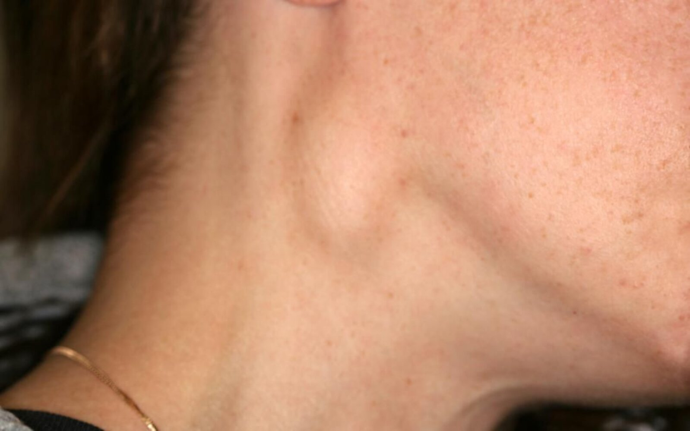

Lymphadenopathy

* Extranodal disease (primary or secondary): The symptoms are highly dependent on the affected tissue; <u>B symptoms</u> are common. [[12]](https://coursology-qbank.com/amboss/article/nVX7EC)[[13]](https://coursology-qbank.com/amboss/article/_uY5FI)

* <u>GI tract</u>: e.g., early satiety, <u>GI bleeding</u>

* Neurological involvement: e.g., <u>headache</u>, <u>focal neurologic symptoms</u>

* Primary cutaneous NHL or secondary <u>skin</u> infiltration: e.g., <u>rash</u>, <u>plaques</u>, tumors, <u>ulcers</u>

* <u>Thyroid</u> involvement (rare): e.g., <u>nodules</u>, <u>goiter</u>

* <u>Oncologic emergencies</u>/<u>paraneoplastic syndromes</u>  [[12]](https://coursology-qbank.com/amboss/article/nVX7EC)[[13]](https://coursology-qbank.com/amboss/article/_uY5FI)

* Examples include <u>tumor lysis syndrome</u>, <u>hypercalcemia</u>, <u>spinal cord compression</u>, <u>superior vena cava syndrome</u>, <u>cardiac tamponade</u>, <u>lymphomatous meningitis</u>, and a <u>CNS</u> mass.

* See “<u>Oncologic emergencies</u>” for detailed information on the management of these conditions.

Mycosis fungoides

Mycosis fungoides

Cutaneous T-cell lymphoma

---

## Differential diagnoses

See ”Differential diagnosis of <u>B symptoms</u>”, “<u>Enlarged lymph nodes</u>”, and “<u>Differential diagnosis of granulomatous disease</u>” for more information.

### Extranodal masses

* <u>Thymoma</u>

* <u>Teratoma</u> (and other <u>germ cell tumors</u>)

* <u>Thyroid</u> <u>neoplasm</u>

> [!NOTE]
> The 4 T's of <u>anterior</u> <u>mediastinal masses</u>: Thymoma, Teratoma (and other <u>germ cell tumors</u>), Thyroid <u>neoplasm</u>, and Terrible <u>lymphoma</u>.

### Necrotizing lymphadenitis (<u>Kikuchi-Fujimoto disease</u>) [[14]](https://coursology-qbank.com/amboss/article/TbX6G9)

* Etiology: unknown

* <u>Epidemiology</u>

* Rare; most commonly reported in Asian population

* Sex: <u>♀</u> > <u>♂</u>

* Mean age: 30 years

* Clinical features: painful <u>cervical lymphadenopathy</u> and <u>fever</u>

* Diagnostics: <u>Lymph node</u> <u>biopsy</u> shows single or multiple <u>necrotic</u> foci, histiocytic cellular infiltration, without granulocytic involvement.

* Treatment: typically resolves spontaneously within 1–4 months of onset without treatment

The differential diagnoses listed here are not exhaustive.

---

## Diagnosis

### Approach [[15]](https://coursology-qbank.com/amboss/article/Lwawj5)[[16]](https://coursology-qbank.com/amboss/article/kIYm1q)[[17]](https://coursology-qbank.com/amboss/article/NKX-g_)

* Suspect NHL in patients with suggestive clinical or laboratory features.

* Confirm the diagnosis and determine the subtype via <u>lymph node</u> and/or tissue <u>biopsies</u>.

* Stage and classify the disease (see “<u>Staging of NHL</u>”), e.g.:

* Imaging studies: to determine the extent of the disease and detect possible <u>CNS</u> involvement

* <u>Bone marrow aspiration and biopsy</u>: to detect <u>bone marrow</u> involvement

> [!TIP]
> The clinical presentation of patients with NHL varies (e.g., nodal symptoms, extranodal symptoms, <u>oncologic emergencies</u>, or <u>paraneoplastic syndromes</u>); therefore, clinicians must maintain a high index of suspicion to facilitate early diagnosis.

### <u>Laboratory studies</u> [[16]](https://coursology-qbank.com/amboss/article/kIYm1q)

* Routine <u>laboratory studies</u>

* <u>CBC</u>: may show <u>anemia</u>, <u>thrombocytopenia</u>; <u>WBC count</u> may be high or low (commonly <u>leukopenia</u>, <u>lymphocytosis</u>)

* <u>BMP</u>: may show abnormal renal function  [[18]](https://coursology-qbank.com/amboss/article/y6Xdn_)

* Serum <u>calcium</u>: may show <u>hypercalcemia</u>

* <u>Liver chemistries</u>: may be abnormal in patients with <u>liver</u> infiltration or <u>primary hepatic lymphoma</u>  [[19]](https://coursology-qbank.com/amboss/article/F6Xg5_)

* Markers of disease activity [[16]](https://coursology-qbank.com/amboss/article/kIYm1q)[[20]](https://coursology-qbank.com/amboss/article/DUc12b0)

* <u>Uric acid</u>: usually elevated

* <u>LDH</u>: usually elevated

* Serum <u>β2-microglobulin</u>: may be elevated

* Others: <u>CRP</u>, <u>ESR</u>

* Viral <u>serologies</u>

* <u>HIV screening</u>

* Additional studies can be suggestive of the underlying etiology (e.g., <u>hepatitis B</u> and C, <u>EBV</u>, <u>HTLV</u>-1).

### Confirmatory diagnostics tests [[13]](https://coursology-qbank.com/amboss/article/_uY5FI)[[15]](https://coursology-qbank.com/amboss/article/Lwawj5)[[17]](https://coursology-qbank.com/amboss/article/NKX-g_)

<u>Histopathological studies</u> are required to diagnose <u>lymphoma</u>. Large samples are preferred as intact tissue architecture is required to classify the subtype. If initial <u>biopsy</u> results are negative in patients with symptoms that are highly suggestive of <u>lymphoma</u>, consider obtaining a larger <u>biopsy</u> sample and repeating the studies.

#### Selection of <u>biopsy</u> sample

* Nodal disease

* Select the most appropriate node for <u>biopsy</u> (e.g., a node with significant, progressive, and persistent enlargement).

* Imaging methods such as CT and <u>PET-CT</u> may be used to select a site (see “<u>Staging of NHL</u>”).

* Techniques [[17]](https://coursology-qbank.com/amboss/article/NKX-g_)

* Preferred: excisional <u>lymph node</u> <u>biopsy</u> or <u>core needle biopsy</u>

* Alternative: incisional <u>lymph node</u> <u>biopsy</u>

* Avoid <u>fine-needle aspiration biopsy</u>.

* Extranodal disease

* Excisional tissue <u>biopsies</u> are recommended.

* <u>Biopsies</u> frequently require guidance, e.g., with endoscopy   or using <u>ultrasound</u>.

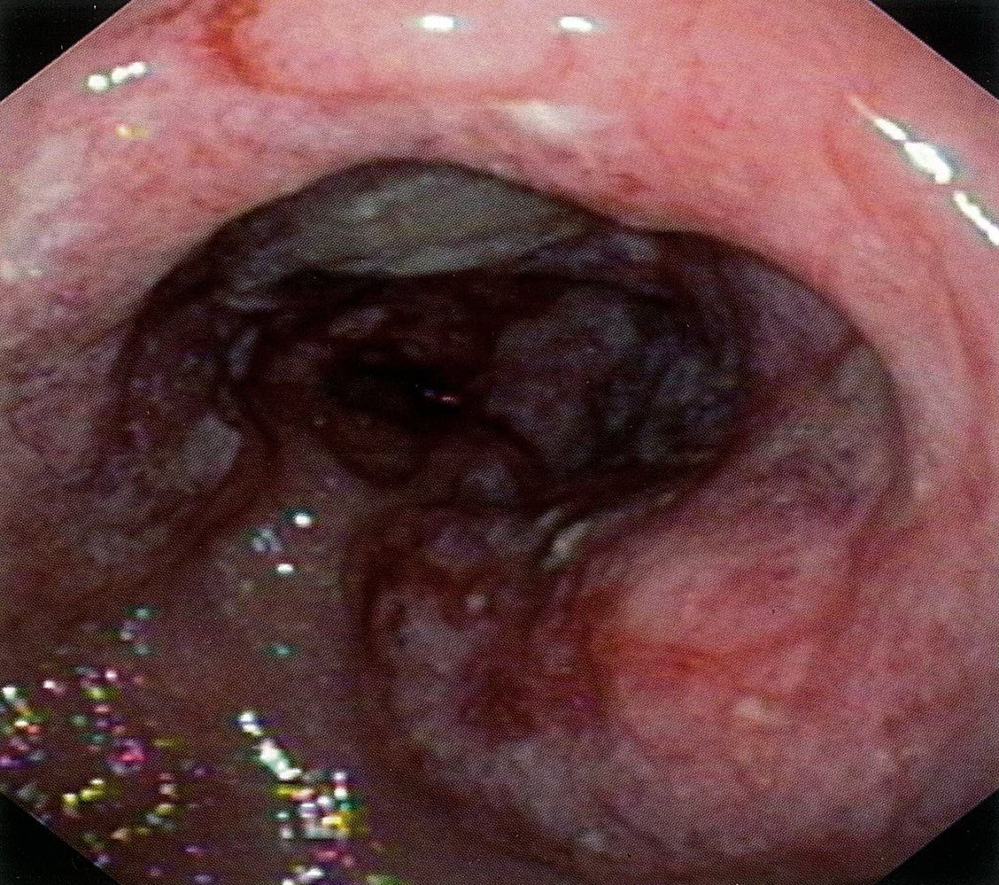

B-cell non-Hodgkin lymphoma of the stomach

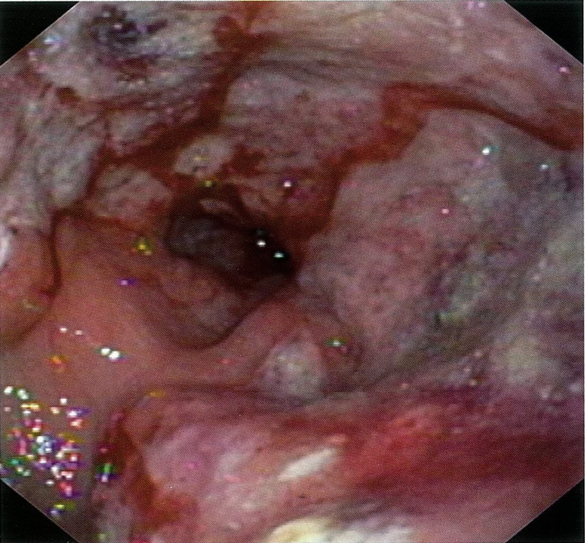

B-cell non-Hodgkin lymphoma of the stomach

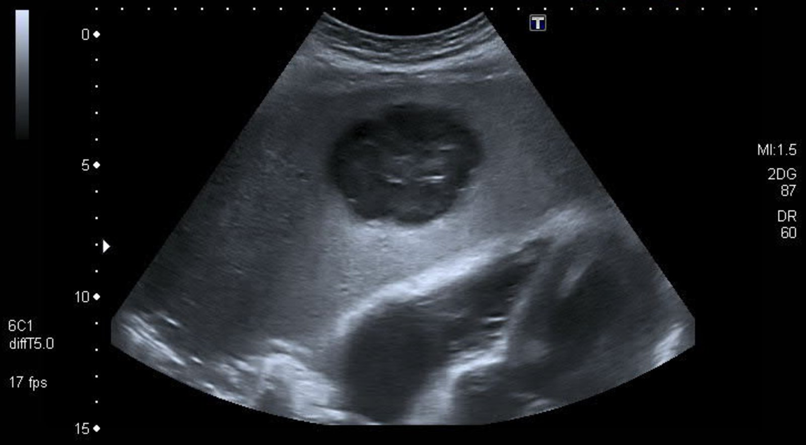

Mixed echogenicity liver mass

#### <u>Histopathology</u> and specialized studies

These studies help determine the subtype of NHL.

* <u>Histopathology</u>: provides a detailed morphology of individual proliferating cells and a description of the pattern of <u>lymph node</u> (or tissue) infiltration (e.g., nodular, diffuse)

* <u>Immunophenotype</u> (e.g., <u>flow cytometry</u>, <u>immunohistochemistry</u>)

* Detects surface <u>antigens</u>, determines the specific cell type (<u>B cell</u>/<u>T cell</u>), and identifies specific markers

* Possible findings include:

* <u>B-cell lymphomas</u>: <u>CD20</u> positive

* <u>T-cell lymphomas</u>: <u>CD3</u> positive

* Genetic studies

* Cytogenetics (<u>karyotype</u>, <u>FISH</u>): can identify <u>chromosomal abnormalities</u>, e.g., t(14;18) in <u>follicular lymphoma</u>

* Molecular testing (e.g., <u>PCR</u>): can detect clonality, e.g., in <u>B-cell receptors</u> or <u>T-cell receptors</u>

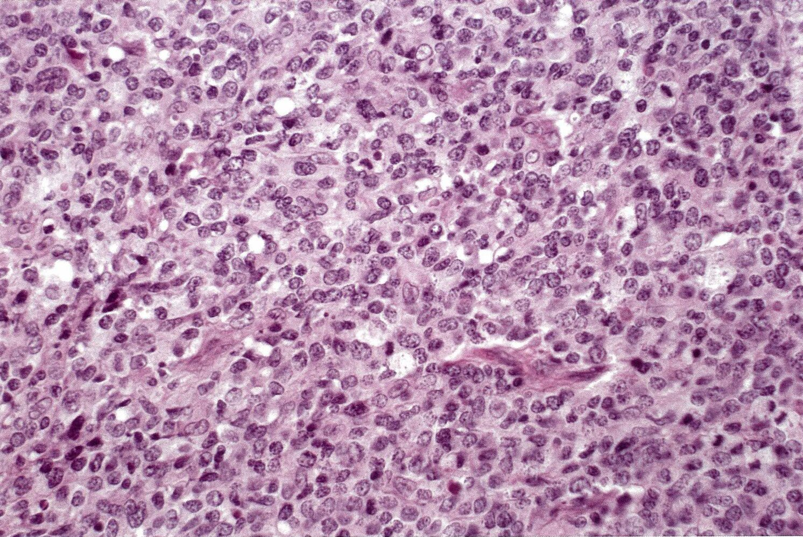

Non-Hodgkin lymphoma

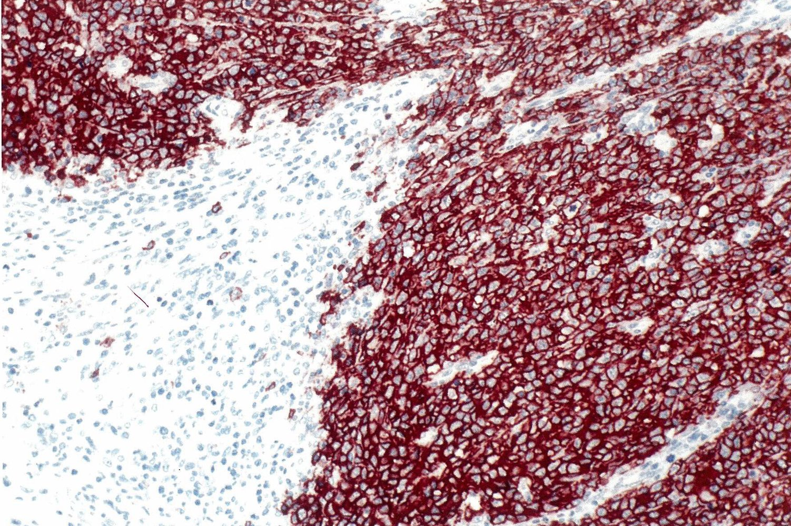

B-cell Non-Hodgkin lymphoma

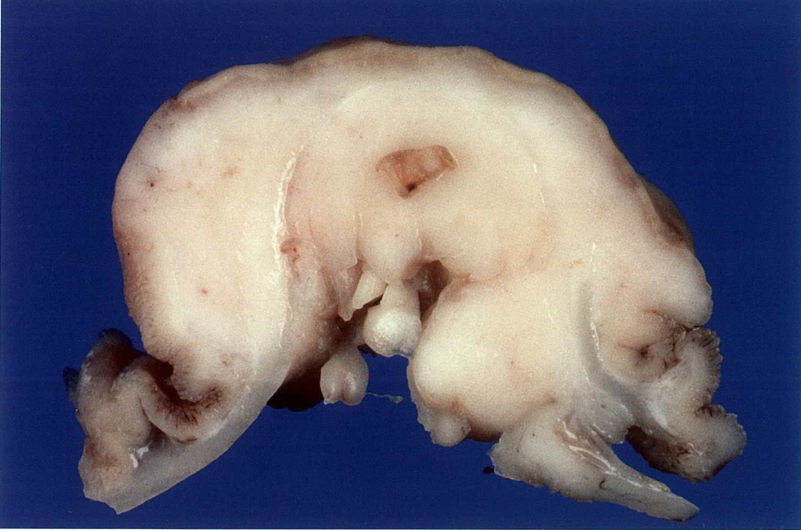

Non-Hodgkin lymphoma

> [!TIP]
> It is important to identify <u>CD20</u>-positive <u>lymphomas</u>, as patients may benefit from <u>targeted therapy</u> with <u>CD20</u> <u>antibodies</u> (e.g., <u>rituximab</u>).

---

## Staging and classification

### Staging [[15]](https://coursology-qbank.com/amboss/article/Lwawj5)

* Imaging

* Indicated in all patients for staging and to assess response to therapy

* Choice of imaging modality depends on the suspected subtype of NHL (uptake of <u>FDG</u> varies between subtypes)

* <u>FDG</u>-avid NHLs (most subtypes): <u>PET-CT</u>

* Non-<u>FDG</u>-avid NHLs : <u>CT whole body</u> with contrast

* <u>Bone marrow aspiration and biopsy</u>: indicated in most newly diagnosed patients with NHL

* Assessment of <u>CNS</u> involvement

* Indications

* Patients considered high-risk for <u>CNS</u> involvement  [[21]](https://coursology-qbank.com/amboss/article/u6Xp5_)

* <u>Primary CNS lymphoma</u>

* Patients with neurological signs and symptoms

* Patients with <u>HIV</u>

* Recommended modalities include:

* Imaging (<u>MRI</u> or CT <u>brain</u>)

* <u>Lumbar puncture</u> with <u>CSF</u> assessment (<u>cytology</u>; detection of <u>EBV</u> <u>DNA</u>)

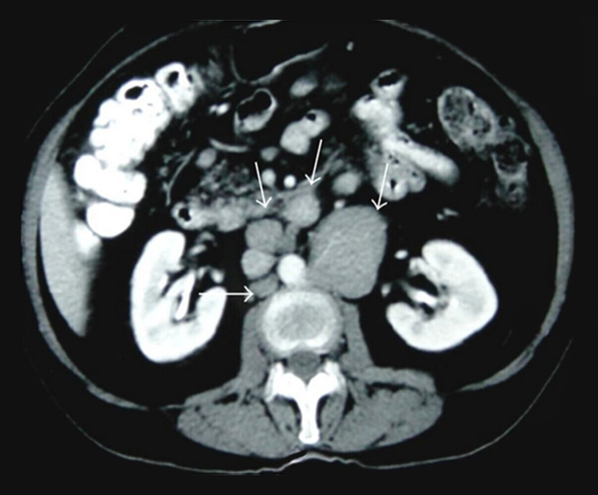

Enlarged retroperitoneal lymph nodes

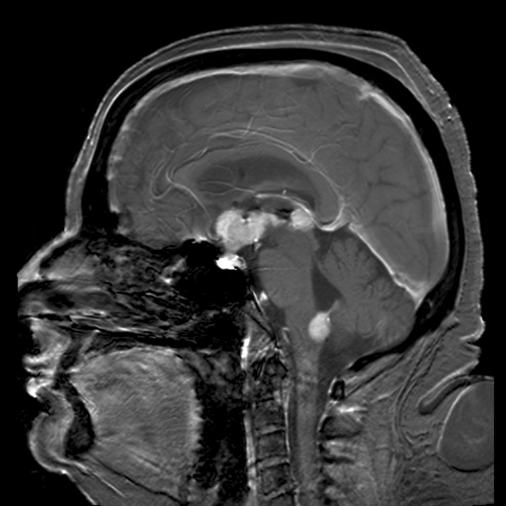

Intracranial masses

Intracerebral mass with midline shift

### Classification [[15]](https://coursology-qbank.com/amboss/article/Lwawj5)

* Lugano classification is the preferred classification method for primary nodal NHL. 

* Imaging is used to assess the number and location of affected <u>lymph nodes</u>, <u>tumor</u> bulk, and <u>liver</u> and <u>spleen</u> involvement.

* <u>Bone marrow biopsy</u> to assess <u>bone marrow</u> involvement

* The disease is then classified as either:

* Limited disease (stage I + II): one node or conglomerate (stage I), or ≥ 2 nodes or conglomerates on one side of the <u>diaphragm</u> (stage II)

* Advanced disease (stage III + IV): nodes on both sides of the <u>diaphragm</u> or supradiaphragmatic nodes with splenic involvement (stage III), or diffuse or disseminated disease (stage IV)

* See “<u>Lugano classification of lymphomas</u>” for more information.

* Previously, a version of the <u>Cotswolds-modified Ann Arbor system</u> was used, excluding the presence of <u>B symptoms</u>.

---

## Treatment

Most patients with newly diagnosed NHL require <u>chemotherapy</u>, <u>radiotherapy</u>, or both. In some patients with indolent NHLs, such as <u>follicular lymphoma</u>, occasionally a <u>watch and wait</u> strategy can be used. Consultation with a hematologist-oncologist is essential for planning and initiating treatment.

### Approach [[16]](https://coursology-qbank.com/amboss/article/kIYm1q)[[22]](https://coursology-qbank.com/amboss/article/FVXgwC)

* Perform <u>prechemotherapy screening</u>.

* Select treatment based on the subtype of NHL, staging, and prognosis 

* Most patients will receive treatment with systemic <u>chemotherapy</u> and/or <u>radiotherapy</u>.

* Low-grade NHL (initial stages): Consider <u>radiotherapy</u> with curative intent.

* Low-grade NHL (advanced stages): usually <u>palliative chemotherapy</u>

* High-grade NHL: usually <u>chemotherapy</u> with curative intent

* Select patients may benefit from additional interventions, including <u>splenectomy</u> and <u>hematopoietic stem cell transplantation</u> (<u>HSCT</u>).

* Provide supportive treatment: see also “<u>Principles of cancer care</u>.”

* Adequate hydration and nutrition

* Management of <u>chemotherapy-induced nausea and vomiting</u> and other side effects of <u>chemotherapy</u>

* <u>DVT prophylaxis</u>

* Consider prophylaxis for <u>tumor lysis syndrome</u>.  [[23]](https://coursology-qbank.com/amboss/article/wUch2b0)

> [!TIP]
> <u>Prechemotherapy screening</u> is essential in all patients receiving <u>chemotherapy</u> for NHL to adequately adjust chemotherapeutic doses according to patients' hepatic, renal, and cardiac function.

### Medical therapy

#### Treatment options [[22]](https://coursology-qbank.com/amboss/article/FVXgwC)

* <u>Radiotherapy</u>

* May be curative or palliative

* Can be conventional or in form of radioimmunotherapy, in which engineered <u>monoclonal antibodies</u> that are specific for <u>tumor</u> <u>antigens</u> are bound to radioactive <u>nucleotides</u>, which results in higher doses of radiation reaching the target cancer cells and less off-target effects.

* Systemic <u>chemotherapy</u>: Regimens usually include combinations of <u>chemotherapeutic agents</u>, <u>steroids</u>, and immunotherapy.

* <u>Antifolates</u>: high-dose <u>methotrexate</u> ; (in combination with <u>leucovorin</u>) for <u>primary CNS lymphoma</u>

* <u>Alkylating agents</u>: e.g., <u>cyclophosphamide</u> (C)

* <u>Topoisomerase II inhibitors</u>: e.g., <u>etoposide</u> (E), <u>doxorubicin</u>/hydroxydaunorubicin (H)

* Alkaloids: e.g., <u>vincristine</u>/oncovin (V/O)

* <u>Steroids</u>: e.g., <u>prednisolone</u> (P), <u>dexamethasone</u>

* Immunotherapy: e.g., <u>rituximab</u> (R)

* <u>Intrathecal chemotherapy</u>: Intrathecal <u>methotrexate</u> can be considered for <u>leptomeningeal</u> involvement.

#### Specific regimens [[16]](https://coursology-qbank.com/amboss/article/kIYm1q)[[22]](https://coursology-qbank.com/amboss/article/FVXgwC)

Below is a summary of some of the common treatment regimens found in the literature for select NHL subtypes; these regimens are intended to provide an overview only and treatment decisions should be tailored to the patient and the features of the disease (e.g., specific mutations, location, extent).

> [!TIP]
> CHOP is the most common regimen in NHL, with the addition of <u>rituximab</u> (<u>CD20</u> <u>antibody</u>) for <u>B-cell</u> <u>neoplasms</u> (<u>R-CHOP</u>).

|  Treatment regimens for non-Hodgkin lymphomas [[16]](https://coursology-qbank.com/amboss/article/kIYm1q)[[22]](https://coursology-qbank.com/amboss/article/FVXgwC)  |  |  |
| --- | --- | --- |
|  | Subtype | Frequently used treatment |
| Mature <u>B-cell</u> <u>neoplasms</u> |  * <u>Burkitt lymphoma</u>   |   * Aggressive systemic <u>chemotherapy</u> with multiple non-cross-resistant drugs over a short period of time (e.g., <u>cyclophosphamide</u>, <u>methotrexate</u>)  * <u>CNS</u> prophylaxis (may be systemic or intrathecal)    |
|  * <u>DLBCL</u>   |  * Systemic <u>chemotherapy</u> with <u>R-CHOP</u> combined with:  * <u>Radiotherapy</u> (for localized disease)  * <u>CNS</u> prophylaxis if there is a high risk of <u>CNS</u> disease (e.g., <u>intrathecal chemotherapy</u> with <u>methotrexate</u>)   |  |
|  * <u>Follicular lymphoma</u>   |   * Early disease  * Often, no treatment is required.  * <u>Radiotherapy</u> (if the disease is in one radiation field)  * Advanced disease  * <u>Chemotherapy</u> (e.g., <u>R-CHOP</u>, R-CVP)  * <u>Radioimmunotherapy</u>    |  |
|  * <u>Mantle cell lymphoma</u>   |  * <u>R-CHOP</u>-<u>cytarabine</u> or <u>bendamustine</u>-<u>rituximab</u>   |  |
|  * <u>Hairy cell leukemia</u>   |  * <u>Chemotherapy</u> with <u>cladribine</u> or <u>pentostatin</u>   |  |
|  * <u>MALT lymphoma</u>   |   * Treatment can include <u>surgery</u>, <u>radiotherapy</u>, and eradication of <u>H. pylori</u>  * See “Treatment” in “<u>MALT lymphoma</u>” for more information on this condition.    |  |
| Mature <u>T-cell</u> <u>neoplasms</u> |  * Peripheral <u>T-cell lymphoma</u>   |  * <u>CHOP</u>-based <u>chemotherapy</u>   |
|  * <u>Angioimmunoblastic T-cell lymphoma</u>   |  |  |
|  * <u>Anaplastic large cell lymphoma</u>   |  |  |
| <u>Cutaneous T-cell lymphoma</u> |  * Includes <u>mycosis fungoides</u> and <u>Sézary syndrome</u>   |   * <u>Skin</u>-directed therapies (especially at early stages): Consider <u>phototherapy</u>, topical <u>chemotherapy</u> (e.g., mechlorethamine), <u>topical corticosteroids</u>, and <u>topical retinoids</u>.  * Systemic therapy (especially at advanced stages): Consider <u>histone deacetylase inhibitors</u> (e.g., <u>vorinostat</u>), <u>combination chemotherapy</u>, or immunotherapy.    |

> [!TIP]
> Some new therapies are emerging as part of the management of certain types of NHLs, including <u>targeted therapies</u> (e.g., <u>ibrutinib</u>) and <u>monoclonal antibodies</u> (e.g., mogamulizumab). If available, a specialist may choose to use them depending on the individual evaluation of each patient.

### Additional therapies [[22]](https://coursology-qbank.com/amboss/article/FVXgwC)[[24]](https://coursology-qbank.com/amboss/article/JKXsh_)

* <u>Surgery</u>

* <u>Splenectomy</u>: Consider in select patients with <u>B-cell lymphomas</u> with splenic involvement (e.g., splenic MZL, <u>hairy cell leukemia</u>).

* Surgical resection: Consider in select patients with specific NHL subtypes.

* <u>HSCT</u>
* Consider in relapsing or refractory disease for some NHL subtypes, e.g., <u>DLBCL</u>, <u>mantle cell lymphoma</u>, mature <u>T-cell lymphoma</u>.

---

## Prognosis

* Typically, the prognosis of NHL is worse than that of <u>Hodgkin lymphoma</u>.  [[25]](https://coursology-qbank.com/amboss/article/JbXsu9)

* Low-grade <u>lymphomas</u>: median survival of 6–10 years

* High-grade <u>lymphomas</u>: survival typically several months (years in less aggressive variants)

* Indicators of poor prognosis: old age, number of involved nodal and extranodal sites, ↑ <u>LDH</u>, ↑ <u>beta2 microglobulin</u> [[26]](https://coursology-qbank.com/amboss/article/M0XMg9)

---