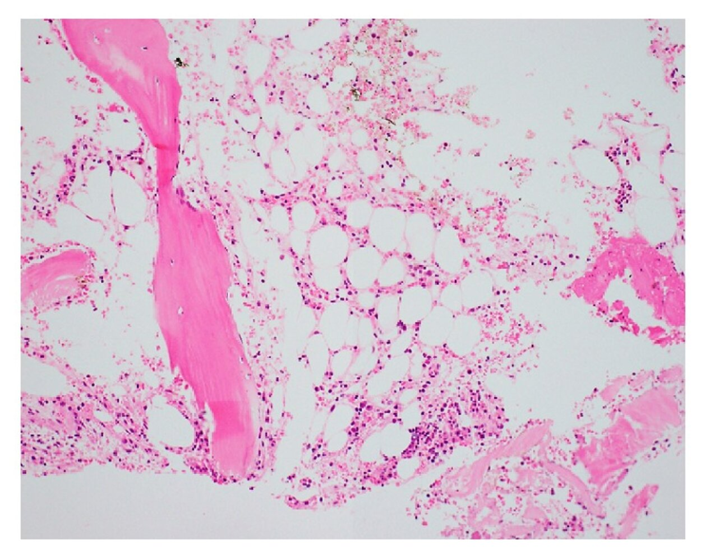

# Pancytopenia

*Categories: Clinical knowledge > Internal medicine > Hematology and oncology > White blood cell and bone marrow disorders > Pancytopenia*

[Original Article Link](https://coursology-qbank.com/amboss/article/DF0143)

---

## Summary

Pancytopenia is a decrease in all blood cell lineages, leading to <u>anemia</u>, <u>thrombocytopenia</u>, and <u>leukopenia</u>. Causes are divided into impaired blood cell production (e.g., due to nutritional deficiencies, <u>aplastic anemia</u>, or <u>bone marrow</u> infiltration) and increased cell destruction (e.g., autoimmune-mediated or <u>splenic sequestration</u>). Clinical manifestations arise from the <u>cytopenias</u> themselves, resulting in fatigue, bleeding, and infections, and from underlying conditions that may manifest with <u>constitutional symptoms</u>, <u>hypersplenism</u>, and/or <u>lymphadenopathy</u>. <u>Laboratory studies</u> to narrow the differential diagnosis include standard chemistries and a <u>peripheral blood smear</u>. Further testing may include <u>bone marrow biopsy</u>, imaging, and/or autoimmune screening. Management is tailored to the underlying cause and may involve <u>blood product</u> support and infection treatment.

<u>Aplastic anemia</u> is a type of pancytopenia caused by <u>bone marrow</u> insufficiency with reduced cellularity. <u>Aplastic anemia</u> is most often <u>idiopathic</u>; other causes include radiation exposure and inherited <u>bone marrow</u> failure syndromes. Diagnosis is confirmed with a <u>bone marrow biopsy</u> revealing <u>hypocellular</u> marrow with prominent fat spaces, and treatment typically includes <u>immunosuppressive therapy</u>, sometimes with <u>allogeneic stem cell transplantation</u>.

---

## Aplastic anemia

### Definition

* Pancytopenia caused by <u>bone marrow</u> insufficiency with reduced <u>bone marrow</u> cellularity [[41]](https://coursology-qbank.com/amboss/article/GLYB_p)

* Should not be confused with <u>aplastic crisis</u>, a condition in which <u>erythropoiesis</u> is temporarily suppressed (e.g., due to <u>parvovirus B19 infection</u> in patients with <u>hemolytic anemias</u>)

### Etiology of aplastic anemia [[1]](https://coursology-qbank.com/amboss/article/zjdr1J0)[[2]](https://coursology-qbank.com/amboss/article/xjdEcJ0)[[3]](https://coursology-qbank.com/amboss/article/BjdzcJ0)

* <u>Idiopathic</u> in > 50% of cases

* Possibly immune-mediated

* May follow acute <u>hepatitis</u> (<u>hepatitis</u>-associated <u>aplastic anemia</u>)

* Medications, e.g.: <u>carbamazepine</u>, <u>methimazole</u>, <u>NSAIDs</u>, <u>chloramphenicol</u>, <u>propylthiouracil</u>, <u>sulfa drugs</u>, cytotoxic drugs (esp. <u>alkylating agents</u> and <u>antimetabolites</u>)

* Exposure

* Toxins: <u>benzene</u>, cleaning solvents, insecticides, <u>toluene</u>

* <u>Ionizing radiation</u>

* <u>Alcohol use disorder</u>

* Infections

* Viral infections: e.g., <u>HBV</u>, <u>EBV</u>, <u>CMV</u>, <u>HIV</u>, <u>parvovirus B-19</u>, <u>HHV-6</u>, <u>dengue virus</u>

* Bacterial infections: e.g., <u>leptospirosis</u>

* <u>Sepsis</u>

* Fanconi anemia ;  [[47]](https://coursology-qbank.com/amboss/article/6LYjAp)[[48]](https://coursology-qbank.com/amboss/article/tLYXzp)

* Hereditary <u>autosomal recessive</u> disorder due to a DNA crosslink repair defect resulting in <u>bone marrow</u> failure

* Skeletal and organ abnormalities: <u>short stature</u>, hypo- and <u>hyperpigmentation</u>, <u>cafe-au-lait spots</u>, <u>microcephaly</u>, <u>developmental delay</u>, thumb and forearm <u>malformations</u>, <u>kidney</u>, GI, <u>heart</u>, <u>eye</u>, and <u>ear</u> abnormalities

* Laboratory tests show pancytopenia and <u>normocytic</u> or <u>macrocytic anemia</u>.

* ∼ 50% of patients with <u>Fanconi anemia</u> will develop <u>AML</u> or <u>MDS</u> in early adulthood. [[49]](https://coursology-qbank.com/amboss/article/9waNO5)

> [!NOTE]
> Agents that can cause <u>aplastic anemia</u>: Can't Make New Blood Cells Properly = Carbamazepine, Methimazole, NSAIDs, Benzenes, Chloramphenicol, Propylthiouracil

### Clinical features [[41]](https://coursology-qbank.com/amboss/article/GLYB_p)

* <u>Malaise and fatigue</u>

* <u>Pallor</u>

* <u>Purpura</u>, <u>petechiae</u>, <u>mucosal</u> bleeding

* Infection

### Diagnosis of aplastic anemia [[41]](https://coursology-qbank.com/amboss/article/GLYB_p)[[50]](https://coursology-qbank.com/amboss/article/dPdodJ0)

Obtain a complete <u>pancytopenia workup</u> to exclude other causes. Findings consistent with <u>aplastic anemia</u> include:

* <u>Laboratory studies</u>, e.g.:

* <u>CBC</u>: pancytopenia (in contrast to <u>aplastic crisis</u> characterized by <u>anemia</u> only), or <u>normocytic</u> or <u>macrocytic anemia</u>

* <u>Reticulocyte count</u>: low

* <u>Erythropoietin</u> level: high

* <u>Bone marrow</u> findings: <u>hypocellular</u> with prominent fat spaces (“empty marrow” appearance)  [[41]](https://coursology-qbank.com/amboss/article/GLYB_p)

* Further specialist studies may include:

* Testing for inherited <u>bone marrow</u> failure disorders

* <u>HLA</u> typing

* Screening for a <u>PNH</u> clone.  [[41]](https://coursology-qbank.com/amboss/article/GLYB_p)

> [!TIP]
> <u>Aplastic anemia</u> is classified as severe or very severe based on the severity of <u>cytopenias</u> and the degree of <u>bone marrow</u> cellularity [[41]](https://coursology-qbank.com/amboss/article/GLYB_p)

Aplastic anemia

### Treatment of aplastic anemia [[41]](https://coursology-qbank.com/amboss/article/GLYB_p)[[50]](https://coursology-qbank.com/amboss/article/dPdodJ0)

* Consider need for <u>supportive care</u>, e.g.: 

* <u>Platelet transfusions</u>, and/or <u>blood transfusions</u>

* <u>Bone marrow</u> stimulants (e.g., <u>GM-CSF</u>; , <u>eltrombopag</u>)

* Manage the underlying cause (e.g., cessation of the causative agent, or treatment of infections)

* If no cause is identified, treatment for <u>idiopathic</u> <u>aplastic anemia</u> may include:  [[41]](https://coursology-qbank.com/amboss/article/GLYB_p)

* <u>Immunosuppressive therapy</u> to prevent further autoimmune marrow destruction

* <u>Cyclosporine</u>

* Antithymocyte globulin

* <u>Tacrolimus</u>

* <u>Alemtuzumab</u>

* <u>Prednisolone</u>

* Consider <u>hematopoietic stem cell transplantation</u> in patients under 50 years of age with a suitable <u>stem cell</u> donor. [[51]](https://coursology-qbank.com/amboss/article/sLYt_p)

> [!TIP]
> Prophylactic <u>platelet transfusions</u> for nonbleeding patients with <u>aplastic anemia</u> are not recommended. [[42]](https://coursology-qbank.com/amboss/article/pCdLGH0)

---