# Adaptive immune system

*Categories: Clinical knowledge > Internal medicine > Infectious diseases > Basics of infectious diseases > Adaptive immune system*

[Original Article Link](https://coursology-qbank.com/amboss/article/x50Emg)

---

## Summary

Adaptive (acquired) <u>immunity</u> is a part of the <u>immune system</u> that provides an <u>antigen</u>-specific response following exposure to a microbial <u>pathogen</u> or foreign substance (e.g., <u>antigen</u>). The adaptive <u>immune system</u> primarily involves <u>B cells</u>, <u>T cells</u>, and circulating <u>antibodies</u>, all of which mount a targeted <u>immune response</u> to a particular <u>antigen</u>/invading <u>pathogen</u>. An important component of adaptive <u>immunity</u> is <u>immunologic memory</u>, a mechanism by which the <u>immune system</u> forms <u>memory B cells</u> and <u>memory T cells</u>. These cells are able to trigger a more rapid and extensive response following subsequent <u>antigen</u> exposure. Adaptive <u>immunity</u> can be conferred via <u>vaccination</u>, which induces <u>immunity</u> through selective exposure to <u>antigens</u> that have been rendered innocuous. <u>Autoimmunity</u> is a disorder of the adaptive <u>immune system</u> and is characterized by <u>immune responses</u> to the body's own tissue. <u>Immunodeficiency</u> conditions, in which a compromised <u>immune system</u> leaves the body highly susceptible to infections, can be either congenital (see “<u>Congenital immunodeficiency disorders</u>” for more information) or acquired (e.g., <u>HIV infection</u>, <u>iatrogenic</u> <u>immunosuppression</u>).

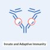

Innate and Adaptive Immunity: Types of Immune Responses (Full version)

---

## T cells (T lymphocytes)

### Overview [[1]](https://coursology-qbank.com/amboss/article/XJ09sS)[[2]](https://coursology-qbank.com/amboss/article/GgaB9P)[[3]](https://coursology-qbank.com/amboss/article/QHbuJE)

* A major component of the adaptive <u>immune response</u>

* Essential for cell-mediated immunity

* Directly involves <u>cytotoxic T cells</u> and other <u>phagocytes</u>, but not <u>B cells</u> or <u>antibodies</u>

* Important in the recognition and destruction of intracellular pathogens (e.g., <u>viruses</u>, intracellular bacteria)

* All mature <u>T cells</u> express specific surface <u>proteins</u> that distinguish them from other <u>lymphocytes</u> and allow them to recognize <u>antigens</u> presented by <u>MHC</u> molecules of <u>antigen-presenting cells</u>.

#### T-cell receptors (<u>TCRs</u>)

* Complex of <u>proteins</u> of the <u>immunoglobulin</u> superfamily

* Each <u>T cell</u> expresses a <u>TCR</u> variant that binds to one specific <u>antigen</u>. 

* Binding of a <u>TCR</u> to its specific <u>antigen</u> initiates <u>T cell activation</u> (see “T-activation” below).

* The <u>antigen</u> fragment has to be presented by a <u>MHC</u> molecule of an <u>antigen-presenting cell</u> in order to be recognized by the <u>TCR</u>.

* Important for positive and negative selection during <u>T-cell development</u>

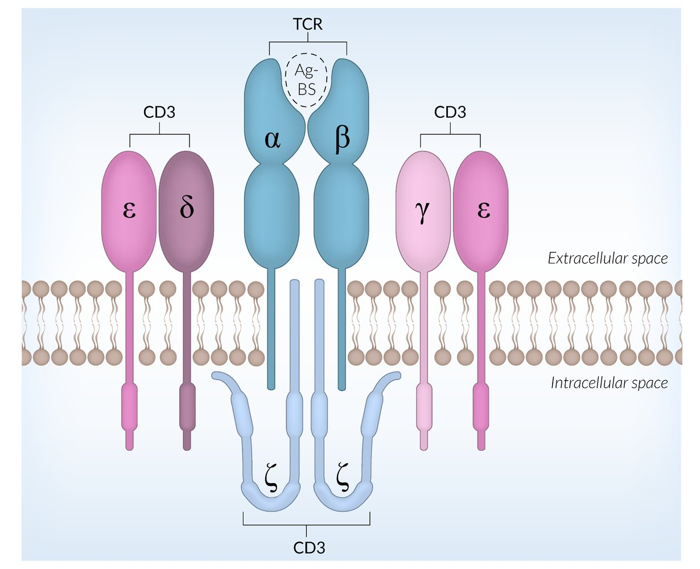

T-cell receptor (TCR)

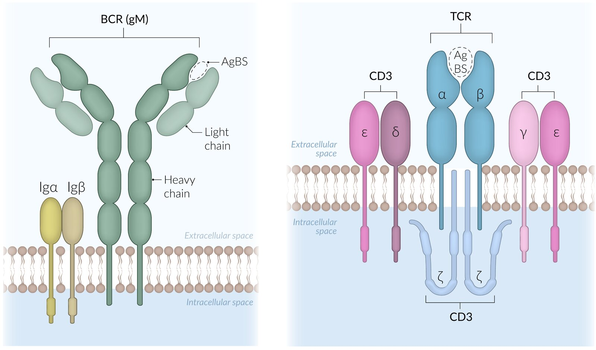

Comparison of B-cell and T-cell receptors

> [!NOTE]
> The cells of the acquired <u>immune system</u> (<u>B cells</u>, <u>T cells</u>) are activated upon <u>antigen</u> recognition.

### T-cell development [[4]](https://coursology-qbank.com/amboss/article/EYY8In)

<u>T cells</u> originate from lymphoid progenitor cells in the <u>bone marrow</u> and mature in the <u>thymus</u>.

* Positive selection of T cells: ensures that the <u>thymus</u> produces functional <u>T cells</u>

* Location: <u>thymic cortex</u>

* <u>Thymic</u> cortical cells express <u>MHC class I</u> and <u>MHC class II</u> <u>antigens</u>.

* Tests if <u>T-cell receptors</u> can bind to <u>MHC</u> appropriately (not too strongly or too weakly)

* <u>T cells</u> (<u>CD4+</u>/<u>CD8+</u>, double-positive <u>thymocytes</u>) receive survival signal.

* Dysfunctional <u>T cells</u> then undergo <u>apoptosis</u>.

* Negative selection of T cells: ensures that the <u>thymus</u> does not produce self-reacting <u>T cells</u>

* Location: <u>thymic medulla</u>

* Tests if <u>T cells</u> bind to tissue-restricted self-antigens presented on <u>MHC</u> by <u>thymic</u> medullary cells

* <u>T cells</u> that do not bind receive survival signal.

* <u>T cells</u> that bind self-<u>antigens</u> undergo <u>apoptosis</u>, except for a few that become regulatory <u>T cells</u>.

* Self-<u>antigen</u> presentation is mediated by the <u>autoimmune regulator protein</u> (<u>AIRE protein</u>), dysfunction of which can lead to:

* <u>Adrenal insufficiency</u>

* <u>Chronic mucocutaneous candidiasis</u>

* <u>Hypoparathyroidism</u>

* In addition, <u>T cells</u> bind with their cluster of differentiation (CD).
* The type of CD that the <u>T cell</u> has a higher affinity for is kept, while the other is downregulated to either (<u>CD4+</u>/<u>CD8</u>-) or (<u>CD4</u>-/<u>CD8+</u>). 

* <u>CD4</u> binds to <u>MHC II</u>.

* <u>CD8</u> binds to <u>MHC I</u>.

* Immunocompetent, but still naive <u>T cells</u> leave the <u>thymus</u> and migrate within and between peripheral tissues, <u>blood vessels</u>, and <u>secondary lymphoid organs</u> (e.g., <u>lymph nodes</u>, <u>spleen</u>, <u>MALT</u>).

> [!NOTE]
> Defective negative <u>T-cell</u> selection can cause autoimmune disorders (e.g., <u>type 1 autoimmune polyendocrine syndrome</u>).

> [!NOTE]
> “Life is ACHe without <u>AIRE</u>”: <u>Autoimmune regulator protein</u> (<u>AIRE</u>) dysfunction can lead to Adrenal insufficiency, chronic mucocutaneous Candidiasis, and Hypoparathyroidism.

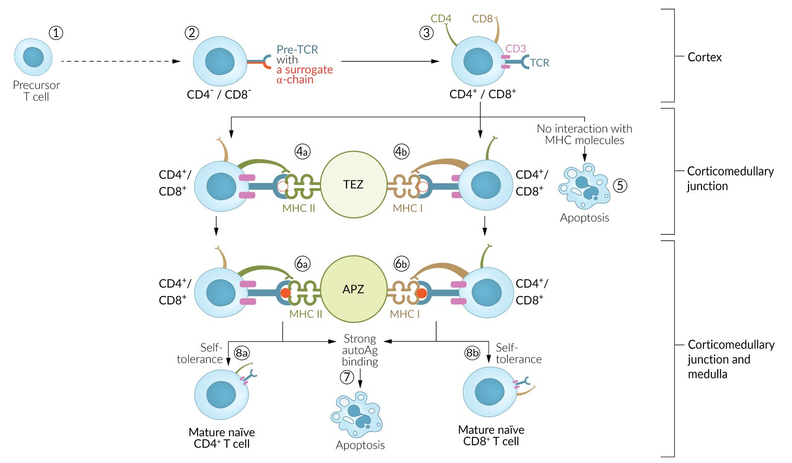

Maturation of T cells in the thymus

### T-cell activation

#### Overview

* <u>Antigens</u> are processed by antigen-presenting cells (i.e., <u>macrophages</u>, <u>monocytes</u>, <u>B cells</u>, <u>Langerhans cells</u>, and <u>dendritic cells</u>).

* <u>Dendritic cells</u> travel through different tissues, <u>phagocytize</u> and process <u>antigens</u>;   and then migrate through afferent lymphatic vessels to a <u>lymph node</u> to present these <u>antigens</u> via <u>MHC I</u> and II.

* <u>T cell</u> activation (“priming”);   mainly occurs in <u>secondary lymphoid organs</u>, such as <u>lymph nodes</u>.

* Activation requires an initial signal, followed by a second, costimulatory signal.

#### Mechanism

1. * <u>Antigen</u> presentation

* Performed by <u>antigen-presenting cells</u>

* <u>Exogenous</u> <u>antigens</u> are presented via <u>MHC II</u> to <u>TCR</u>/<u>CD4</u>.

* <u>Endogenous</u> <u>antigens</u> are presented via <u>MHC I</u> to <u>TCR</u>/<u>CD8</u> (cross-presentation of <u>antigens</u>).
2. * Costimulatory signal: mediates survival and proliferation of T cells

* B7 protein (<u>CD80</u> or <u>CD86</u>) on the <u>dendritic cell</u>: interacts with CD28 on the naive <u>T cell</u>.

* <u>Antigen</u> presentation without this co-stimulatory signal will lead to <u>T-cell</u> <u>anergy</u>:

* Important <u>self-tolerance</u> mechanism

* <u>The cell</u> will not be activated even though it is exposed to its <u>antigen</u>

* Superantigens (e.g., <u>toxic shock syndrome toxin 1</u>, <u>enterotoxin B</u>) link <u>MHC II</u> <u>antigen-presenting cells</u> and <u>T-cell receptors</u> on <u>T cells</u> and lead to <u>activation of T cells</u> without a costimulatory signal.
3. * Effect

* <u>T-helper cell</u>: activation of NFAT (<u>nuclear factor of activated T cells</u>) → <u>cytokine</u> production → activation of other cells, e.g., <u>B cells</u>, <u>macrophages</u>, and cytotoxic <u>T cells</u>

* Cytotoxic <u>T cell</u>: recognizes and destroys cells that possess <u>antigens</u> (signals <u>malignancy</u> or viral infection)

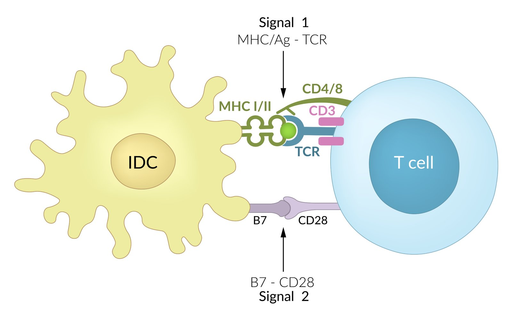

T cell activation

### <u>T cell</u> effects

1. * <u>T cells</u> (<u>CD8</u>+): direct cell lysis or induction of <u>apoptosis</u> via <u>perforin</u> and <u>proteases</u>

* Activated via <u>antigen</u> presentation by <u>MHC class I</u> <u>receptors</u>

* Induce <u>apoptosis</u> of <u>virus</u>-infected or malignant cells using mechanisms as those used by <u>NK cells</u>: release of granules that contain <u>perforin</u>, <u>granzyme B</u>, <u>granulysin</u>

* Release <u>cytokines</u> (including <u>IFN‑γ</u>, TNF, and <u>lymphotoxin-α</u>) → <u>macrophage</u> activation

* Clinical relevance: involved in organ rejection (acute and chronic), induce <u>apoptosis</u> of donor graft cells
2. * <u>Th1 cell</u> (<u>CD4</u>+): cell‑mediated response

* Activated via <u>antigen</u> presentation by <u>MHC class II</u> <u>receptors</u>

* <u>Immune response</u> to intracellular pathogens (<u>viruses</u>, intracellular bacteria)

* Release <u>cytokines</u> (including <u>IFN‑γ</u>, IL‑2, and TNF) → stimulation of <u>macrophages</u> (positive feedback) and <u>CD8+</u> cytotoxic <u>T cells</u>;   ; effect is amplified by binding of <u>T-cell</u> <u>CD40L</u> to <u>CD40</u> <u>receptors</u> on <u>macrophages</u>

* <u>IFN‑γ</u>, <u>IL-2</u>, and TNF‑α induce <u>granuloma</u> formation against foreign bodies that cannot be eliminated by the <u>immune cells</u>.

* Clinical significance:

* <u>Tuberculosis</u> in <u>HIV infection</u>

* Delayed cell-mediated <u>type IV hypersensitivity</u> reactions (see the corresponding section in ”<u>Hypersensitivity reactions</u>”)
3. * <u>Th2 cell</u> (<u>CD4+</u>): cell‑mediated response

* Activated via <u>antigen</u> presentation by <u>MHC class II</u> <u>receptors</u>

* <u>Immune response</u> to extracellular pathogens (bacteria, <u>parasites</u>)
* Release <u>cytokines</u> (including <u>IL-4</u>, <u>IL-5</u>, <u>IL-13</u>) which stimulate <u>eosinophils</u>, <u>basophils</u>, and <u>mast cells</u>

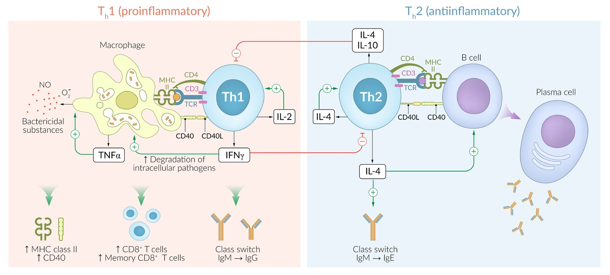

Effects of T-helper cells in secondary lymphatic organs

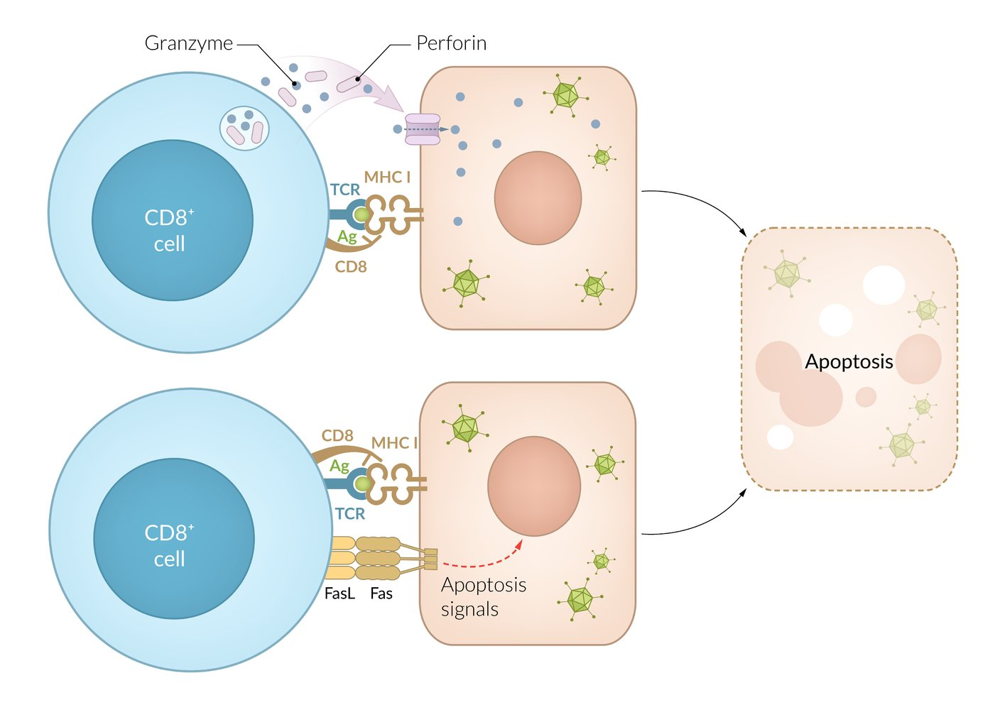

CD8+ effector cells

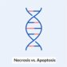

Necrosis vs. Apoptosis: Cell Death

### T cell subtypes

* <u>T cells</u> are largely divided into <u>cytotoxic T cells</u> (<u>CD8+</u>), <u>T helper cells</u> (<u>CD4+</u>), and regulatory <u>T cells</u>.

* Other subtypes include <u>memory T cells</u> and <u>natural killer T cells</u>.

| Overview of <u>T cell subtypes</u> |  |  |  |  |  |
| --- | --- | --- | --- | --- | --- |
| Cell type |  | Important surface markers | Function | Stimulate/activate | Clinical significance |
|  Cytotoxic T cells (<u>killer T cells</u>)  |  |  * <u>CD8</u>   |   * Important component of <u>cell-mediated immunity</u>  * Recognize and kill cells infected with intracellular pathogens (esp. <u>viruses</u>) and <u>neoplastic</u> cells  * Interact with foreign <u>antigens</u> that are presented via <u>MHC I</u>  * Induce <u>apoptosis</u> or cell lysis of the presenting cell    |  * <u>Macrophages</u>   |   * <u>HIV</u>  * <u>Hepatitis B</u>  * <u>Adult T cell lymphoma</u>    |
| T-helper cells (<u>Th cells</u>) | Th1 cells |   * <u>CD4</u>  * <u>CD40L</u>    |   * Promote cellular <u>immune response</u>  * Fight intracellular pathogens    |   * <u>Macrophages</u>  * Cytotoxic <u>T cells</u>  * <u>NK cells</u>  * <u>B cells</u> → production of <u>IgG</u>    |   * Infections with intracellular pathogens (e.g., <u>Mycobacteria</u>, <u>Salmonella</u>)  * <u>IL-12 receptor deficiency</u>  * <u>Type I diabetes</u>  * <u>Rheumatoid arthritis</u>  * <u>Multiple sclerosis</u>    |
| Th2 cells |   * Initiate <u>humoral immune response</u> in cooperation with <u>B lymphocytes</u>  * Fight extracellular pathogens (esp. <u>parasites</u>)    |   * <u>Eosinophils</u>  * <u>Mast cells</u>  * <u>Basophils</u>  * <u>B cells</u> → production of <u>IgE</u>    |   * <u>Helminth infections</u>  * <u>Type 1 hypersensitivity</u> (<u>asthma</u>, <u>allergic rhinitis</u>)    |  |  |
| Th17 cells |   * Regulate tissue inflammation (both proinflammatory and antiinflammatory effects)  * Fight extracellular pathogens    |  * <u>Neutrophils</u>   |  * <u>Hyper IgE syndrome</u>   |  |  |
| T follicular helper cells (<u>TFHcells</u>) |  * Support <u>B cell</u> activation and maturation in lymphoid follicles   |  * <u>B cell</u> <u>isotype switching</u> and <u>antibody production</u>   |  * Autoimmune diseases   |  |  |
|  Regulatory T cells (Treg, suppressor <u>T cells</u>) |  |   * <u>CD4</u>  * <u>CD25</u>    |   * Limit and protect against excessive <u>immune response</u>  * Promote immune <u>self-tolerance</u>  * Prevent formation of <u>autoantibodies</u>    |  * Stimulate or suppress <u>CD4+</u> and <u>CD8+</u>T effector cells   |  * sIPEX syndrome   |

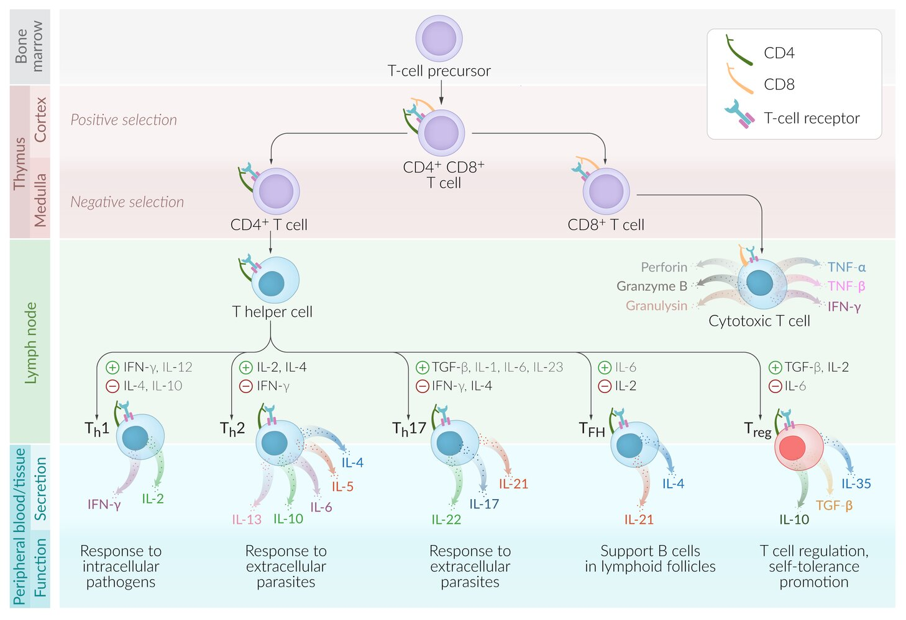

#### Surface markers

Surface protein expression determines the specific function of <u>T cell subtypes</u>.

* General <u>T cell</u> markers

* All <u>T cells</u> carry membrane-bound marker <u>proteins</u> that distinguish them from other <u>lymphocytes</u>.

* These general <u>T-cell</u> markers are <u>CD3</u>, <u>CD28</u>, and the <u>T-cell receptor</u> (<u>TCR</u>).

* Specific markers of <u>T cell</u> subtypes

* <u>T cells</u> are largely divided into <u>CD8+ T cells</u> (<u>cytotoxic T cells</u>) and <u>CD4+ T cells</u> (<u>T helper cell</u> subpopulations).

* Besides <u>CD4</u>, <u>T helper cells</u> express <u>CD40L</u>, <u>CXCR4</u>, and <u>CCR5</u>.

* See also “<u>CD4/CD8 ratio</u>.”

* Subtypes within the group of <u>CD4+ T cells</u> may be identified by the <u>cytokines</u> they secrete and/or by their specific surface markers (see table below; the list is not exhaustive).

| Differentiation of <u>T helper cell</u> subtypes |  |  |  |  |
| --- | --- | --- | --- | --- |
| Cell type | Surface marker | Stimulated by | <u>Cytokines</u> produced | Inhibited by |
| <u>Th1 cell</u> |   * CXCR3  * <u>CCR5</u>  * <u>CXCR4</u>    |   * <u>IFN‑γ</u>  * <u>IL-12</u>    |   * <u>IFN‑γ</u>  * <u>IL-2</u>    |  * <u>IL-4</u>, <u>IL-10</u> (from <u>Th2 cells</u>)   |
| <u>Th2 cell</u> |   * CRTH2  * CCR4  * CCR3    |   * <u>IL-2</u>  * <u>IL-4</u>    |   * <u>IL-4</u>  * <u>IL-5</u>  * <u>IL-10</u>  * <u>IL-13</u>    |  * <u>IFN‑γ</u> (from <u>Th1 cells</u>)   |
| <u>Th17 cell</u> |   * CCR6+  * CCR4+    |   * <u>TGF-β</u>  * <u>IL-1</u>  * IL-23  * <u>IL-6</u>  * IL-22    |   * <u>IL-17</u>  * <u>IL-21</u>  * IL-22    |   * <u>IFN‑γ</u>  * <u>IL-4</u>    |
| <u>TFHcell</u> |   * CXCR5  * <u>PD-1</u>    |  * <u>IL-6</u>   |   * <u>IL-21</u>  * <u>IL-4</u>    |  * <u>IL-2</u>   |
| Treg cell |   * <u>CD3</u>  * <u>CD4</u>  * CD25  * FOXP3    |   * <u>TGF-β</u>  * <u>IL-2</u>    |   * TGF-ß  * <u>IL-10</u>  * IL-35    |  * <u>IL-6</u>   |

> [!NOTE]
> <u>CD8</u> <u>proteins</u> on the surface of cytotoxic <u>T cells</u> interact with <u>MHC I</u> <u>receptors</u>, while <u>CD4</u> <u>proteins</u> on the surface of <u>T-helper cells</u> interact with <u>MHC II</u> <u>receptors</u>.

> [!NOTE]
> Rule of 8: <u>MHC</u> I x CD 8 = 8. <u>MHC</u> II x CD 4 = 8.

---

## B cells (B lymphocytes)

### Overview [[1]](https://coursology-qbank.com/amboss/article/XJ09sS)[[2]](https://coursology-qbank.com/amboss/article/GgaB9P)[[3]](https://coursology-qbank.com/amboss/article/QHbuJE)[[5]](https://coursology-qbank.com/amboss/article/2gYTuo)

* Major component of the adaptive <u>immune system</u>: The humoral immune response of the adaptive <u>immune system</u> mainly consists of <u>B cells</u> and <u>antibodies</u>.

### B-cell development

* Originate and mature in the <u>bone marrow</u>

* Naive <u>B cell</u>: a mature <u>B cell</u> that has not come in contact with <u>antigens</u> yet

* Express numerous surface <u>proteins</u>

* <u>CD19</u>, <u>CD20</u>  , <u>CD21</u> (used by <u>EBV</u>), and <u>CD40</u>

* <u>MHC II</u>

* <u>B7</u>

* <u>B cell receptor</u> with <u>immunoglobulin</u> component (binds <u>antigens</u>)

* Mature <u>B cells</u> circulate between the blood and <u>secondary lymphatic organs</u> (e.g., <u>lymph nodes</u>, <u>spleen</u>, <u>MALT</u>).

* After activation, <u>B cells</u> differentiate into plasma cells that produce and secrete <u>antibodies</u> (see “Immunoglobulins” below).

> [!NOTE]
> “Mr. Epstein, you have to be 21 to Be in this Barr!”: The Epstein-Barr <u>virus</u> uses the <u>CD21</u> <u>receptor</u> to invade B cells.

#### B-cell receptors (<u>BCRs</u>)

* Type I <u>transmembrane proteins</u> on the <u>B cell</u> surface that are composed of <u>immunoglobulins</u>  and signal-transmitting subunits

* Necessary for <u>B cell</u> activation and maturation

* The <u>immunoglobulin</u> parts of mature <u>BCRs</u> are highly specific to certain <u>antigens</u>.

* Naive <u>BCR</u>: a <u>BCR</u> that has not interacted with an <u>antigen</u> yet

### B cell activation

<u>B cell activation</u> and <u>class switching</u> require an initial signal, as well as a costimulatory signal. Activated <u>B cells</u> migrate to <u>germinal centers</u> of <u>secondary lymphoid organs</u>.

* T cell-dependent activation of B cells

* Requires activation of <u>CD4+</u> <u>T-helper cells</u>, which, in turn, requires prior <u>antigen</u> presentation via <u>MHC II</u> by the <u>B cell</u>

* Initiated as a response to protein or <u>peptide</u> <u>antigens</u> (<u>thymus</u>-dependent <u>antigens</u>), e.g.:

* <u>Pneumococcal conjugate vaccines</u>

* <u>Diphtheria toxin</u>-like protein with conjugated <u>polysaccharides</u>

* <u>B lymphocytes</u> recognize <u>antigens</u> via their <u>B-cell</u> <u>receptors</u> (membrane‑bound <u>immunoglobulins</u>, <u>IgD</u> or <u>IgM</u>) → <u>B cell</u> <u>receptor</u>-mediated <u>endocytosis</u> of the <u>BCR</u>/<u>antigen</u> complex → breakdown of <u>antigen</u> into small fragments by <u>lysosomal</u> <u>proteases</u> → presentation of <u>antigen</u> fragment via <u>MHC class II</u> <u>receptors</u> on <u>B cell</u> surface to <u>Th cells</u> ;   plus costimulation of <u>B cell</u> <u>CD40</u> <u>receptor</u> by <u>Th cell</u> <u>CD40L</u> → T cell‑dependent activation of <u>B cells</u> (<u>plasma cells</u>) → immunoglobulin production

* T cell-independent activation of B cells

* Initiated as an immediate response to nonprotein <u>antigens</u> (<u>thymus</u>-independent <u>antigens</u>; e.g., gram-negative <u>lipopolysaccharide</u>)

* Leads to production of <u>IgM</u> <u>antibodies</u>

* No prior <u>T-cell</u> activation since <u>MHC</u> are unable to present nonprotein <u>antigens</u> to <u>T cells</u>

* <u>Thymus</u> independent <u>antigens</u> are considered to be only weakly immunogenic, which is why <u>vaccines</u> containing nonprotein <u>antigens</u> need adjuvants (like the <u>PPSV23</u> <u>Streptococcus pneumoniae</u> <u>vaccine</u>, containing a capsular <u>polysaccharide</u> subunit) and boosters.

T cell activation

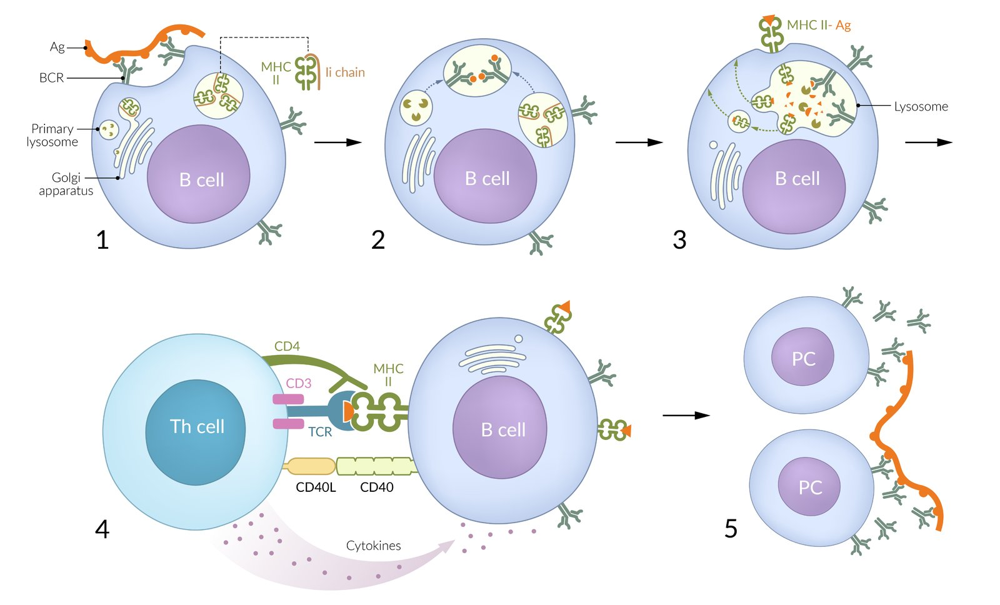

B cell activation

#### Affinity maturation

* Definition: : A process in which <u>B cells</u> interact with <u>Th cells</u> within the <u>germinal center</u>;  of secondary lymphoid tissue in order to secrete <u>immunoglobulins</u> with higher affinity for specific <u>antigens</u>.

* Mechanisms

* Somatic hypermutation: <u>point mutations</u> that create random alterations in the variable region of the <u>antibody</u> <u>gene</u>

* Clonal selection: <u>B cells</u> that possess <u>antibodies</u> with higher affinity for the <u>antigen</u> have a survival advantage through a positive selection that allows them to proliferate and predominate within the follicle.

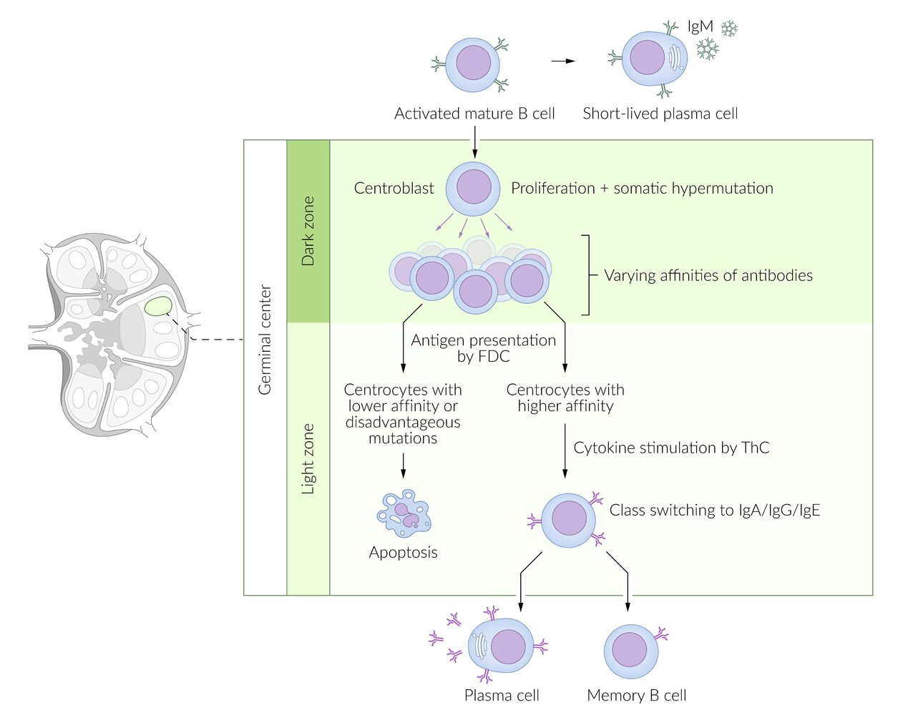

B cell affinity maturation

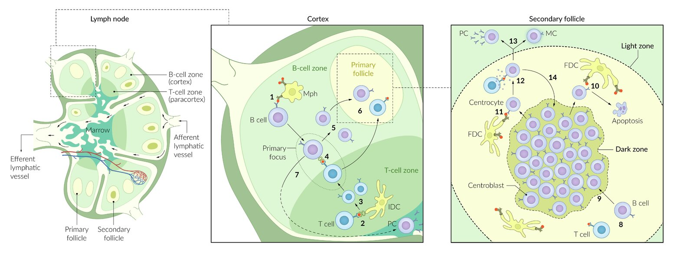

Lymphocyte activation in secondary lymphatic organs

#### Isotype switching (<u>class switching</u>)

Within the <u>germinal centers</u> of <u>lymph nodes</u>, activated <u>B cells</u> change the <u>antibody isotype</u> in response to specific <u>cytokines</u> that are released by <u>Th cells</u>. <u>IgM</u>, the primary <u>antibody</u> on <u>B cells</u> before getting activated, is switched to <u>IgA</u>, <u>IgE</u>, or <u>IgG</u>. <u>IgM</u> is also secreted by <u>plasma cells</u> (stimulated by <u>IL-6</u>).

* <u>B cell</u> <u>class switching</u> occurs via two signaling mechanisms:

* First signal = activation: <u>Antigen</u> bound to <u>MHC II</u> molecule binds to <u>T-cell receptor</u> on the surface of <u>T-helper cells</u>.

* Second signal = costimulation: CD40 <u>membrane receptor</u> on the <u>B cell</u> binds to CD40 ligand (<u>CD40L</u>) on the surface of <u>CD4+ T cell</u> (CD40L/CD40) → <u>cytokine</u> release → <u>gene</u> rearrangement, resulting in <u>class switching</u>

* <u>IL-4</u>, <u>IL-13</u>: stimulate <u>class switching</u> to <u>IgE</u>.

* <u>IL-5</u>, <u>TGF-β</u>: stimulate <u>class switching</u> to <u>IgA</u>.

* <u>IFN-γ</u>, <u>IL-4</u>, <u>IL-21</u>: stimulate <u>class switching</u> to <u>IgG</u>.

* The resulting <u>antibody</u> has the same affinity for the <u>antigen</u> but a different function.

* <u>Isotype switching</u> is irreversible.

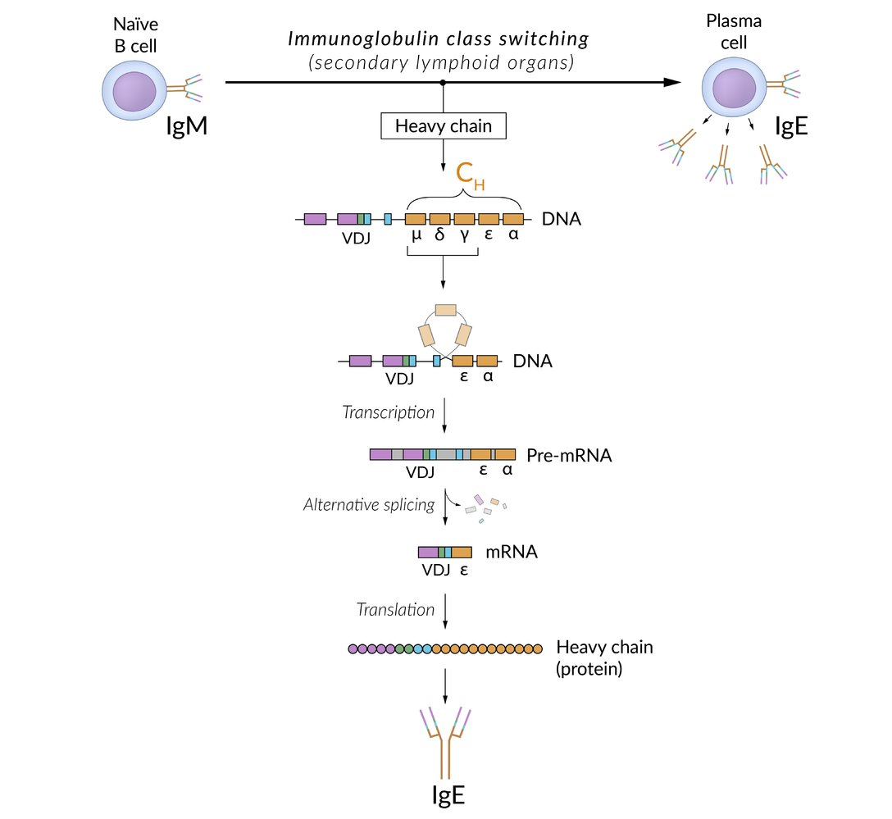

Immunoglobulin class switching

> [!NOTE]
> <u>Class switching</u> occurs with AGE: IgA, IgG, IgE.

---

## Immunoglobulins

### Overview

<u>Immunoglobulins</u> (<u>antibodies</u>) have two functional parts: the <u>Fc region</u> and the <u>Fab region</u>; . The two enzymes papain and <u>pepsin</u> can be used to identify the different functional parts. Every <u>immunoglobulin</u> can have monomeric structure. In context of <u>immunoglobulins</u>, the term affinity refers to individual interaction of <u>antibody</u> and <u>antigen</u>, whereas avidity characterizes the accumulated binding strength of all <u>antigen</u>-binding sites combined.

* Fc region  

* Contains the constant region

* Formed by <u>heavy (H) chains</u>

* Determines the antibody isotype (e.g., <u>IgA</u>, <u>IgG</u>, <u>IgM</u>)

* Binds <u>complement</u> (<u>IgG</u>, <u>IgM</u>)

* Binds various immunological cells, such as <u>macrophages</u>, to stimulate phagocytic or cytotoxic activity (<u>opsonization</u>)

* Contains the carboxyl terminal

* Has many <u>carbohydrate</u> side chains

* Fab region

* Contains the variable/hypervariable region

* Formed by <u>light (L) chains</u> and <u>heavy (H) chains</u>

* Recognizes and binds to <u>antigens</u> via epitope

* Determines the idiotype

* Binding site with <u>specificity</u> for one particular kind of <u>antigen</u>

* Every <u>B cell</u> expresses exactly one <u>antigenic</u> <u>specificity</u>

> [!NOTE]
> Fc → Complement, Constant, Carboxy terminal, Carbohydrate side chains
> Fab → Antigen binding

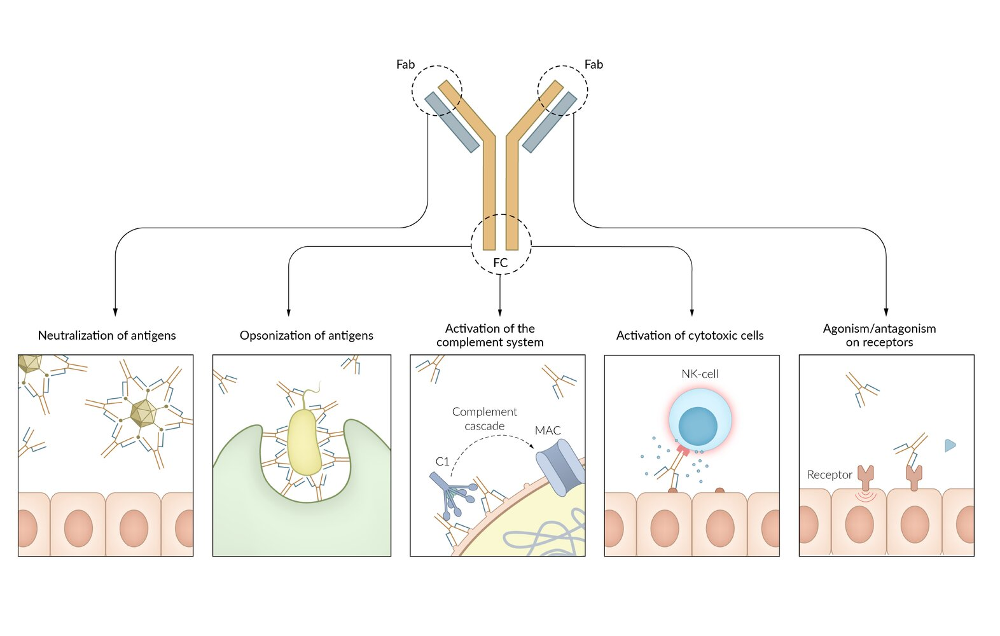

Antibody function overview

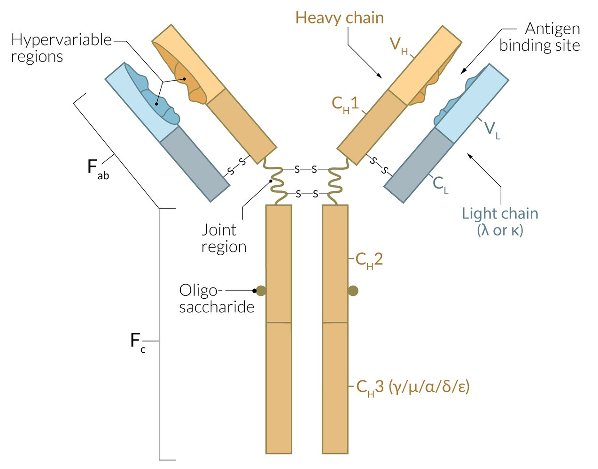

General structure of immunoglobulins exemplified by IgG

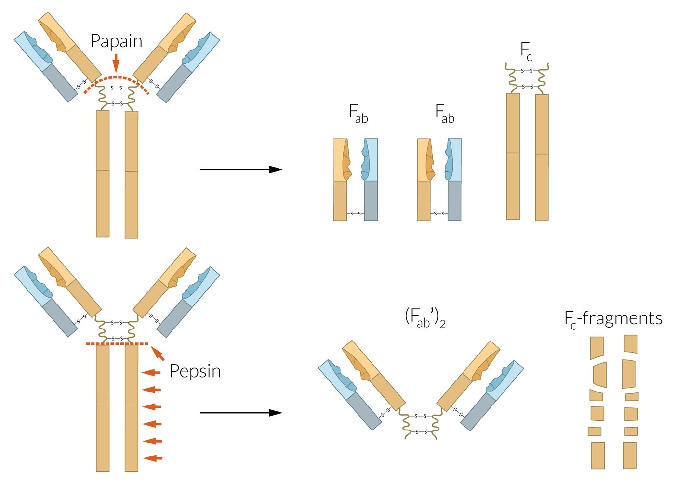

Cleavage of immunoglobulins by papain and pepsin

### Immunoglobulin properties

#### <u>Specificity</u>

* Requires <u>antigens</u>

* Occurs by <u>somatic hypermutation</u> and <u>affinity maturation</u>

* Alterations take place in the variable region.

* Normal response to <u>antigenic</u> stimulation: <u>B lymphocytes</u> with varying <u>immunoglobulin</u> <u>alleles</u> (i.e., polyclonal proliferation)

* Malignant <u>lymphocyte</u> <u>proliferation</u>: predominance of <u>B lymphocytes</u> with a single <u>immunoglobulin</u> variable domain (i.e., monoclonal proliferation)

* <u>Class switching</u> (e.g., <u>IgA</u>, <u>IgM</u>, <u>IgG</u>)
* Alterations take place in the sequence of the <u>heavy chain</u> constant domain.

#### Diversity

* Does not require <u>antigens</u>

* Recombination-activating genes (<u>RAG</u>): a set of <u>genes</u> that encode <u>RAG</u> <u>proteins</u> 1 and 2, which together form V(D)J recombinase, an enzyme required for <u>V(D)J recombination</u> in <u>T cells</u> and <u>B cells</u>

* Random recombination of certain <u>genes</u> during <u>B cell</u> maturation in <u>bone marrow</u>

* Light chain: VJ <u>genes</u>

* Heavy chain: V(D)J <u>genes</u>

* <u>Autosomal recessive</u> <u>RAG1</u> and <u>RAG2</u> <u>loss-of-function mutations</u> are a rare cause of <u>severe combined immunodeficiency</u>.

* <u>Terminal deoxynucleotidyl transferase</u> (<u>TdT</u>) randomly adds <u>nucleotides</u> to the <u>DNA</u>.

* Recombination of <u>light chains</u> with <u>heavy chains</u> occurs randomly

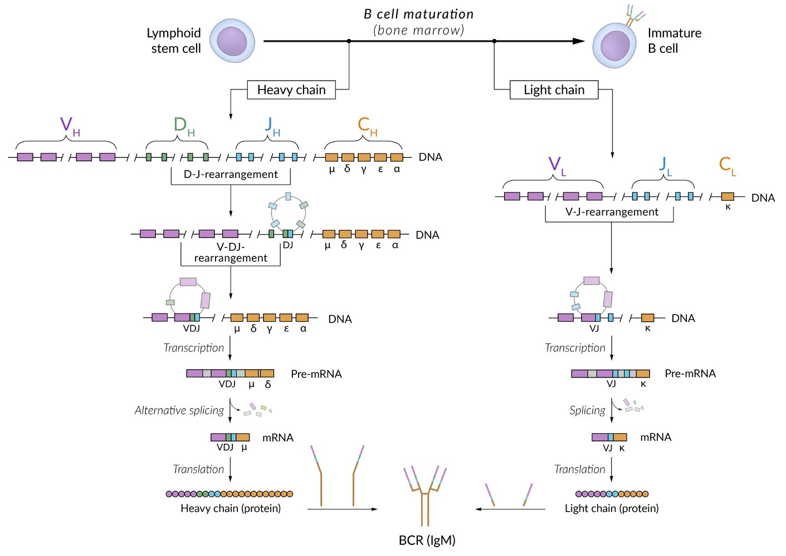

V(D)J recombination (generation of immunoglobulin diversity)

### <u>Immunoglobulin</u> types

|  Overview of <u>immunoglobulins</u>   |  |  |  |
| --- | --- | --- | --- |
| Type | Structure | Characteristics | Examples and clinical relevance |
| IgM |  * Pentamer   |   * Largest <u>antibody</u> , located on the surface of mature <u>B cells</u> as a monomer and circulating as pentamer (with J chain)  * Formed early (evidence of recent infection) as the first response to <u>antigen</u> contact  * Binds and activates <u>complement</u>  * Pentameric structure allows strong <u>antigen</u> binding while <u>humoral immune response</u> is initiated    |   * <u>Blood group</u> <u>antibodies</u>  * <u>Immune response</u> (early reaction) <u>antibodies</u>, e.g., anti-HBc (<u>hepatitis C</u> core) <u>IgM antibody</u>    |
| IgG |  * Monomer   |   * Most abundant <u>immunoglobulin</u> in blood serum  * Delayed formation during the course of infection (<u>IgM</u>-<u>IgG</u> switch); ensures long‑term <u>immunity</u>; main <u>antibody</u> in subsequent exposure  * <u>Titer</u> determination for follow‑up: high affinity and <u>specificity</u>  * Can be free-floating in serum or bound to the surface of <u>lymphocytes</u>  * The only <u>immunoglobulin</u> that can cross the <u>placenta</u> and thus conveys transient <u>passive immunity</u> to the child  * Activates <u>complement</u>  * <u>Opsonization</u> of bacteria  * Neutralization of <u>viruses</u> and <u>bacterial toxins</u>    |   * Rhesus <u>antibodies</u>  * <u>Immune response</u> (late reaction) <u>antibodies</u>, e.g., anti‑Hbc <u>IgG</u>  * <u>Allergy</u>: mediation of <u>type II hypersensitivity</u>, <u>type III hypersensitivity</u>    |
| IgA |  * Monomer or dimer   |   * Most abundant <u>immunoglobulin</u> in the body but has a low serum concentration  * Monomer in circulation and dimer when secreted (then containing J chain)  * Uses transcytosis to cross <u>epithelial</u> borders  * Found especially on <u>mucosal</u> surfaces and in bodily fluids like saliva, mucus, tears and <u>breast milk</u>  * Prevents binding of pathogens to <u>mucous membranes</u> of host cells  * A secretory component acquired from <u>epithelial</u> cells protects <u>IgA</u> from luminal <u>proteases</u> (e.g., in the <u>gastrointestinal tract</u>)  * No <u>complement</u> fixation    |   * <u>IgA antibodies</u> to <u>tissue transglutaminase</u> are present in gluten‑sensitive enteropathy (<u>celiac disease</u>)  * Production by gut associated lymphoid tissue (e.g. <u>Peyer patches</u>) leads to protection against intestinal infections (e.g., <u>giardiasis</u>)  * <u>Selective IgA deficiency</u>    |
| IgE |  * Monomer   |   * Binds to <u>mast cells</u> → cross-linking upon <u>allergen</u> exposure → release of <u>histamine</u> (involved in <u>allergic diseases</u>)  * Binds to <u>basophils</u>    |   * <u>Allergy</u>: mediation of immediate‑type reaction (<u>type I hypersensitivity</u> - e.g., <u>anaphylaxis</u>)  * Involved in defense against <u>parasites</u> by stimulating <u>eosinophils</u>    |
| IgD |  * Monomer   |  * Found in blood serum and on the surface of mature, naive <u>B lymphocytes</u>   |  * Function is not completely understood   |

> [!NOTE]
> To memorize the timing of IgM formation, think of IgM as forming iMmediately!

> [!NOTE]
> To remember that <u>IgG</u> can cross the <u>placenta</u> and conveys transient <u>passive immunity</u>, think of “IgG Grants <u>immunity</u> to the Growing fetus”

> [!NOTE]
> <u>IgA</u> is an Intra-gut Antibody (mainly found in the gastrointestinal <u>mucosa</u>).

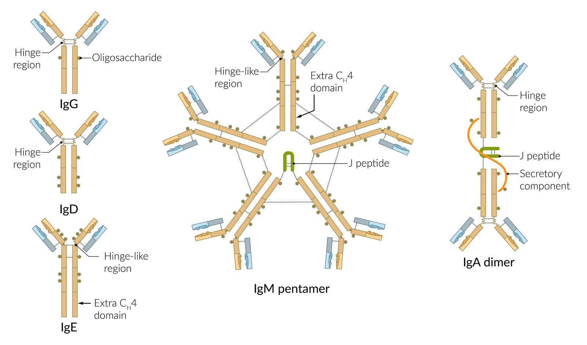

Immunoglobulin classes

### Antibody-dependent cell-mediated cytotoxicity (<u>ADCC</u>) [[6]](https://coursology-qbank.com/amboss/article/sc1tdf0)

* Definition: an <u>immune response</u> in which <u>Fc receptor-bearing</u> immune effector cells (e.g., <u>NK cells</u>, <u>eosinophils</u>) bind to and lyse <u>target cells</u> that have specific <u>antibodies</u> attached to their surface <u>antigens</u> (<u>pathogen</u> or <u>tumor</u>-derived)

* Characteristics

* Allows innate <u>immune cells</u> to recognize pathogens that do not express <u>pathogen-associated molecular patterns</u> (<u>PAMPs</u>)

* Part of the <u>immune response</u> to <u>parasites</u>

* Effector cells

* <u>NK cells</u> (most common): interact with <u>IgG</u>-coated <u>target cells</u> and subsequently release cytotoxic substances (<u>perforins</u>, <u>granzymes</u>)

* <u>Eosinophils</u>: interact with <u>IgE</u>-coated <u>helminths</u> and subsequently release <u>major basic proteins</u> and other cytotoxic substances

* Other: <u>monocytes</u>, <u>macrophages</u>, <u>neutrophils</u>

* Mechanism

* Binding of <u>antibodies</u> (e.g., <u>IgG</u> or <u>IgE</u>) produced by <u>B-cells</u> to <u>antigens</u> on <u>target cells</u> (e.g., <u>tumor</u> cells, <u>viruses</u>, or <u>parasites</u>)

* Recognition and binding of the <u>Fc</u> portion of bound <u>IgG</u> or <u>IgE</u> by <u>Fc receptors</u> expressed on the surface of effector cells (e.g., CD16 <u>Fc receptors</u> on <u>NK cells</u>)

* Activation of signaling pathways in the effector cell (e.g., <u>NK cell</u>), leading to cytotoxic granule release

* Destruction of the <u>target cell</u> (e.g., via the <u>perforin</u>/<u>granzyme</u> <u>cell death</u> pathway)

* Clinical significance: <u>monoclonal antibody</u> therapy

> [!TIP]
> Anticancer <u>monoclonal antibodies</u> (e.g., <u>trastuzumab</u>, <u>rituximab</u>) act by neutralizing extracellular targets (e.g., <u>membrane receptors</u>, channels) or promoting <u>immune system</u> recognition via <u>ADCC</u> by <u>NK cells</u>.

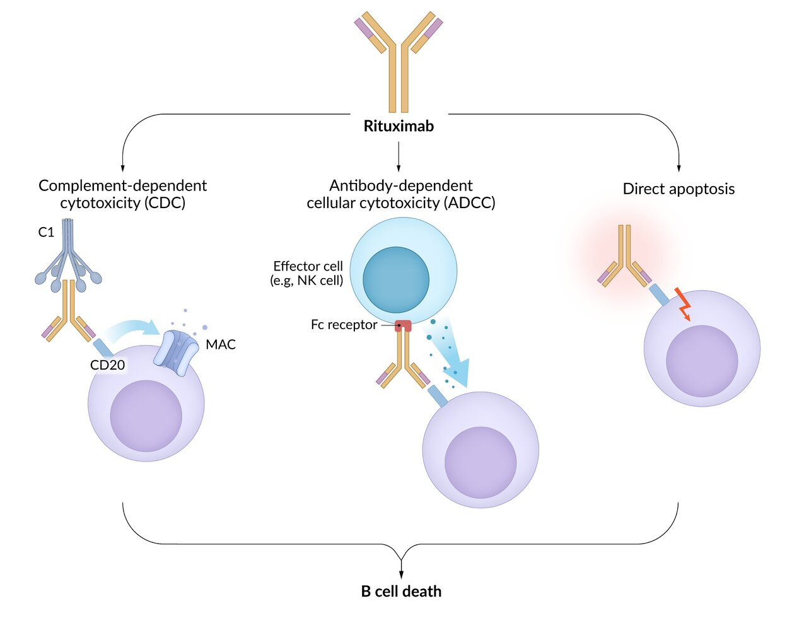

Rituximab mechanisms of action

---

## Immunologic memory

* Definition

* The ability of the <u>immune system</u> to recognize <u>antigens</u> after an initial exposure and to quickly and efficiently mount an <u>immune response</u> in subsequent exposures.

* Allows for the conservation of a specific acquired <u>immune response</u>

* Process
1. * Initial exposure to a foreign <u>antigen</u>
2. * Primary <u>immune response</u>: activation of <u>B cells</u> and <u>T cells</u> (see the sections on <u>B cells</u> and <u>T cells</u> above)
3. * Formation of memory B cells and <u>memory T cells</u>

* Memory B cells: specialized <u>plasma cells</u> that have the ability to persist for decades following the elimination of an <u>antigen</u> and produce high-affinity <u>antibodies</u> throughout their lifespan [[7]](https://coursology-qbank.com/amboss/article/7MY4Jp)[[8]](https://coursology-qbank.com/amboss/article/HMYKJp)

* Undergo <u>proliferation</u>, <u>somatic hypermutation</u>, <u>clonal selection</u>, and <u>immunoglobulin class switching</u> (see T cell‑dependent <u>B cell activation</u>)

* Arrested in their differentiation and persist in the marginal zone of follicles

* Memory T cells: specialized <u>T cells</u> that persist following a primary <u>immune response</u> to an <u>antigen</u> and have the ability to elicit an immediate and more potent <u>immune response</u> in the event of subsequent exposures to the same <u>antigen</u> [[8]](https://coursology-qbank.com/amboss/article/HMYKJp)[[9]](https://coursology-qbank.com/amboss/article/uMYpqp)

* Following a primary <u>immune response</u>, ∼ 90% of effector <u>T cells</u> die via <u>apoptosis</u>; a small fraction of the effector <u>T cells</u> survive to become <u>memory T cells</u>.

* Can be <u>CD4+</u> or <u>CD8+</u>

* Effector <u>memory</u> <u>T cells</u> (TEM cells, <u>CCR7</u> negative cells): <u>CD4+ T cells</u> or <u>CD8+ T cells</u> that persist in the circulation and peripheral tissue.

* <u>CD4+</u> TEM cells produce <u>proinflammatory cytokines</u> (e.g., <u>IFN-γ</u>).

* <u>CD8+</u> TEM cells contain preformed <u>perforin</u> granules for immediate cytotoxicity.

* Central <u>memory</u> <u>T cells</u> (CCR7 positive cells): Persist in secondary lymphoid tissue and are able to differentiate into effector <u>memory T cells</u> upon activation.

* Subsequent <u>immune response</u>: Re-exposure to the <u>antigen</u> activates the <u>memory</u> cells.

* <u>Memory B cells</u> secrete high-affinity <u>antibodies</u> and accelerate the <u>secondary immune response</u> to the <u>antigen</u>.

* <u>Memory T cells</u> mature to TEM cells and trigger an immediate release of <u>cytokines</u> or cytotoxicity.

* Repeated exposure to the <u>antigen</u> leads to more efficient <u>immune responses</u>.

> [!NOTE]
> <u>Memory</u> cells are a large pool of <u>antigen</u>-specific <u>lymphocytes</u> that can respond faster and more efficiently than naive <u>lymphocytes</u> when re-exposed to the <u>antigen</u>. These cells form the basis for the immunologic response to <u>vaccinations</u>.

---

## Immune tolerance and autoimmunity

### Immune tolerance [[4]](https://coursology-qbank.com/amboss/article/EYY8In)[[10]](https://coursology-qbank.com/amboss/article/hnccG10)

The unresponsiveness of an organism’s <u>immune system</u> to <u>antigens</u> in an effort to prevent harmful over-reactivity is called <u>immune tolerance</u>.

#### Central tolerance

* Overview

* A type of <u>immune tolerance</u> that occurs at an early stage of lymphoid cell development

* Ensures that <u>T cells</u> and <u>B cells</u> that recognize self-<u>antigens</u> (i.e., <u>antigens</u> expressed by the organism's own cells) are identified before they develop into fully immunocompetent cells

* Mechanisms

* Negative selection of <u>T cells</u>;  and <u>B cell</u> clonal deletion: <u>Lymphocytes</u> that express <u>receptors</u> with a high affinity for self-<u>antigens</u> will undergo <u>apoptosis</u>.

* Development of <u>regulatory T cells</u> (<u>CD4+</u>)

* <u>Receptor</u> editing: <u>B-cell</u> <u>specificity</u> is reprogrammed through secondary recombination of <u>antibody</u> <u>genes</u>

#### Peripheral tolerance

* Overview

* A type of <u>immune tolerance</u> that occurs in the immune periphery (e.g., <u>spleen</u>, <u>lymph nodes</u>) following the egression of <u>T cells</u> and <u>B cells</u> from their <u>primary lymphoid organs</u>

* Ensures the deletion of or induction of <u>anergy</u> in autoreactive T and <u>B cells</u> that <u>escape</u> into the periphery

* Mechanisms  [[11]](https://coursology-qbank.com/amboss/article/3ncSG10)

* Anergy: a lack of a normal <u>immune response</u> to particular <u>antigens</u>, <u>cytokines</u>, and <u>allergens</u>, usually due to the absence of costimulatory signals

* Deletion of autoreactive <u>T cells</u> through <u>apoptosis</u>

* Suppression: blocking activation by inducing <u>regulatory T cells</u> through exposure to <u>TGF-β</u> in peripheral tissues

* Inhibitory <u>receptors</u>: recognition of self-<u>antigens</u> prevents <u>B-cell</u> activation by triggering inhibitory <u>receptors</u>

### Autoimmunity

<u>Autoimmunity</u> refers to an immune reaction against the body's own cells that occurs as a result of a loss of <u>immune tolerance</u>. Women have a disproportionately higher <u>incidence</u> of autoimmune diseases than men.

#### Presumed pathogenesis

* Autoreactive <u>B cells</u> are physiologically eliminated in the <u>bone marrow</u>, <u>spleen</u>, and <u>lymph nodes</u>.

* <u>T cells</u> that attack the body's own cells undergo negative selection in the <u>thymus</u> or undergo <u>apoptosis</u> in peripheral lymphoid tissues (e.g, <u>lymph nodes</u>, <u>adenoids</u>, <u>Peyer's patches</u>) due to a lack of stimulation.

* If the selection mechanisms fail, <u>immune cells</u> can attack the body's own cells, which leads to autoimmune inflammation.

#### Causes of autoimmune conditions

* Mostly <u>idiopathic</u>

* Sometimes elicited by a previous infection (e.g., <u>Guillain-Barré syndrome</u>, <u>rheumatic fever</u>).
* The underlying pathomechanism is molecular mimicry (the <u>antigenic</u> resemblance between molecules on some pathogens and those of normal cells in the body)

* Persistent <u>antigenic</u> stimuli

* Breach of <u>central tolerance</u>

* Genetic predisposition, e.g.:

* HLA-B8, e.g., <u>myasthenia gravis</u>, <u>Graves disease</u>, <u>Addison disease</u>

* HLA‑B27, e.g., <u>ankylosing spondylitis</u>, <u>reactive arthritis</u>, <u>psoriatic arthritis</u>, <u>ulcerative colitis</u>

* HLA-DR4, e.g., <u>rheumatoid arthritis</u>, <u>type 1 diabetes</u>, <u>pemphigus vulgaris</u>, <u>Addison disease</u>

* HLA-DR3, e.g., <u>type 1 diabetes</u>, <u>SLE</u>, <u>Hashimoto thyroiditis</u>, <u>Graves disease</u>

* HLA-DR2, e.g., <u>SLE</u>, <u>Goodpasture syndrome</u>, <u>multiple sclerosis</u>

* HLA‑DQ2 and <u>HLA-DQ8</u>, e.g., <u>gluten‑sensitive enteropathy</u>

* <u>HLA</u>-DR5, e.g., <u>Hashimoto thyroiditis</u>

* <u>HLA-A3</u>, e.g., <u>hemochromatosis</u>

#### Consequences

* The presence of autoreactive <u>B cells</u> results in the production of irregular <u>antibodies</u>, which can trigger various diseases.

* <u>Autoantibodies</u> can also be used as a diagnostic tool (see the table below).

* In <u>T-cell</u> mediated autoimmune reactions, there are usually no detectable specific <u>antibodies</u> (e.g., in <u>multiple sclerosis</u>).

### Autoantibodies

| Overview of autoantibodies |  |  |
| --- | --- | --- |
| Name | Target | Potentially associated conditions |
| <u>Antinuclear antibodies</u> (<u>ANAs</u>) |  * Nuclear <u>antigens</u>   |   * Nonspecific <u>antibody</u> used for screening that is found in various <u>connective tissue diseases</u> (particularly <u>SLE</u>)  * <u>Rheumatoid arthritis</u>  * <u>Vasculitis</u>  * <u>Borreliosis</u>    |
| <u>Perinuclear antineutrophil cytoplasmic antibodies</u> (<u>p-ANCAs</u>, <u>MPO-ANCAs</u>) |  * Perinuclear <u>antigens</u>   |   * <u>Eosinophilic granulomatosis with polyangiitis</u>  * <u>Microscopic polyangiitis</u>  * Gastrointestinal conditions  * <u>Crohn disease</u>  * <u>Ulcerative colitis</u>    |
| <u>Cytoplasmic antineutrophil cytoplasmic antibodies</u> (c-<u>ANCAs</u>, PR3-<u>ANCAs</u>) |  * <u>Cytoplasmic</u> <u>antigens</u>   |  * <u>Granulomatosis with polyangiitis</u>   |
| <u>Antithyroglobulin antibodies</u> |  * <u>Thyroglobulin</u> protein   |   * <u>Hashimoto thyroiditis</u>  * <u>Thyroid cancer</u>  * <u>Graves disease</u>    |
| <u>Thyroid peroxidase antibodies</u> (<u>TPO</u> Abs) |  * <u>Thyroid peroxidase</u>   |   * <u>Hashimoto thyroiditis</u>  * <u>Graves disease</u>    |
| <u>TSH receptor antibodies</u> |  * <u>TSH receptor</u>   |   * <u>Graves disease</u>  * <u>Hashimoto thyroiditis</u>    |
| <u>Antiendomysial antibodies</u> (<u>EMA</u>; <u>IgA</u>) |  * Intermyofibril substance of <u>smooth muscle</u> [[12]](https://coursology-qbank.com/amboss/article/UWbbks)   |  * <u>Gluten-sensitive enteropathy</u>   |
| <u>Transglutaminase antibodies</u> (<u>IgA</u>) |  * <u>Tissue transglutaminase</u> in the bowel   |  * <u>Gluten‑sensitive enteropathy</u>   |
| Antigliadin <u>antibodies</u> (<u>DGP IgG</u>, <u>DGP IgA</u>) |  * <u>Deaminated</u> <u>gliadin</u> <u>peptide</u>   |  * <u>Gluten-sensitive enteropathy</u>, especially in patients with <u>IgA</u> deficiency   |
| <u>Acetylcholine receptor antibodies</u> |  * <u>Acetylcholine receptor</u>   |  * <u>Myasthenia gravis</u>   |
| <u>Anti-glomerular basement membrane antibodies</u> |  * <u>Type IV collagen</u> on <u>glomerular basement membrane</u>   |  * <u>Goodpasture syndrome</u>   |
| <u>Anti-β2 glycoprotein antibodies</u> |  * Glycoprotein   |   * <u>Antiphospholipid syndrome</u>  * <u>SLE</u>    |
| <u>Anticardiolipin antibodies</u> |  * <u>Cardiolipin</u>   |   * <u>Antiphospholipid syndrome</u>  * <u>SLE</u>    |
| <u>Rheumatoid factor</u> |  * <u>IgM</u> against <u>Fc region</u> of <u>IgG</u>   |  * <u>Rheumatoid arthritis</u>   |
| <u>Anti-CCP antibodies</u> |  * <u>Citrullinated</u> <u>peptides</u>   |  * <u>Rheumatoid arthritis</u> (more specific for <u>rheumatoid arthritis</u> than <u>rheumatoid factor</u>)   |
| <u>Lupus anticoagulant</u> |  * <u>Cell membrane</u> phospholipids   |   * <u>Antiphospholipid syndrome</u>  * <u>SLE</u>    |
| <u>Anticentromere antibodies</u> |  * <u>Centromeres</u>   |  * <u>CREST syndrome</u> (<u>limited scleroderma</u>)   |
| <u>Antidesmoglein antibodies</u> |  * <u>Desmosomes</u>   |  * <u>Pemphigus vulgaris</u>   |
| <u>Anti-glutamic acid decarboxylase antibodies</u> |  * <u>Glutamic acid decarboxylase</u>   |  * <u>Type I diabetes</u>   |
| <u>Islet cell cytoplasmic antibodies</u> |  * <u>Islet cell</u> <u>cytoplasm</u>   |  |
| <u>Antihemidesmosome antibodies</u> |  * <u>Hemidesmosomes</u>   |  * <u>Bullous pemphigoid</u>   |
| <u>Antisynthetase antibodies</u> (<u>anti-Jo-1 antibodies</u>) |  * <u>tRNA synthetase</u>   |   * <u>Polymyositis</u>  * <u>Dermatomyositis</u>    |
| <u>Anti-SRP antibodies</u> |  * <u>Signal recognition particle</u>   |  |
| <u>Anti-Mi-2 antibodies</u> (antihelicase <u>antibodies</u>) |  * <u>Helicase</u>   |  |
| Antimitochondrial antibodies |  * <u>Liver</u> cells <u>mitochondria</u>   |  * <u>Primary biliary cirrhosis</u>   |
| <u>Anti-intrinsic factor antibodies</u> |  * <u>Intrinsic factor</u>   |  * <u>Pernicious anemia</u>   |
| <u>Anti-parietal cell antibodies</u> |  * <u>Parietal cells</u>   |  |
| <u>Anti-phospholipase A2 receptor antibodies</u> |  * <u>Phospholipase A2 receptor</u>   |  * Primary <u>membranous nephropathy</u>   |
| <u>Anti-Scl-70 antibodies</u> |  * <u>DNA</u> <u>topoisomerase I</u>   |  * <u>Scleroderma</u> (diffuse)   |
| <u>Anti-smooth muscle antibodies</u> |  * <u>Smooth muscle</u>   |  * <u>Autoimmune hepatitis</u> type 1   |
| <u>Anti-liver-kidney-microsomal antibodies</u> type 1 |  * <u>Cytochrome P450</u> enzyme <u>CYP2D6</u>   |  * <u>Autoimmune hepatitis</u> type 2   |
|  <u>Anti-SSA</u> (<u>anti-Ro</u>) <u>antibodies</u> <u>Anti-SSB</u> (<u>anti-La</u>) <u>antibodies</u>  |  * Intracellular autoantigens   |   * <u>Sjogren syndrome</u>  * <u>SLE</u>    |
| Anti-presynaptic <u>calcium</u> channel <u>antibodies</u> |  * <u>Voltage-gated calcium channel</u>   |  * <u>Lambert-Eaton syndrome</u>   |
| <u>Antihistone antibodies</u> |  * <u>Histones</u>   |  * <u>Drug-induced lupus erythematosus</u>   |
| <u>Anti-dsDNA antibodies</u> |  * Double-stranded <u>DNA</u>   |  * <u>SLE</u>   |
| <u>Anti-Smith antibodies</u> |  * Nonhistone nuclear <u>proteins</u>   |  * <u>SLE</u>   |
| <u>Anti-U1 RNP antibodies</u> |  * Ribonucleoprotein   |  * <u>Mixed connective tissue disease</u>   |

---

## Immune deficiency

* <u>Epidemiology</u>

* <u>Primary immunodeficiency</u> diseases are rare

* Approx. 1–2/1,000 general population are immune deficient.

* Most common types 

* Primary

* <u>Fanconi anemia</u>

* <u>Selective IgA deficiency</u>

* <u>Wiskott-Aldrich syndrome</u>

* <u>Ataxia telangiectasia</u>

* <u>DiGeorge syndrome</u>

* See “<u>Congenital immunodeficiency disorders</u>” for more information.

* Secondary

* <u>HIV</u>/<u>AIDS</u>

* <u>Iatrogenic</u> immune suppression

* Clinical findings

* The main symptom of <u>primary immunodeficiency</u> is a pathological susceptibility to infection.

* The type of susceptibility is characterized by the invading <u>pathogen</u>, localization, course, severity, and number of infections.

* Not all <u>immune deficiencies</u> are clinically apparent.

* <u>B-cell</u> deficiencies (decreased number of <u>B cells</u> and/or impaired <u>B-cell</u> function) typically results in recurrent bacterial infections.

* <u>T-cell</u> deficiencies typically result in recurrent viral and <u>fungal infections</u>.

| Overview of immune deficiency and infections |  |  |  |
| --- | --- | --- | --- |
| Defective <u>immune system</u> component | Bacteria | <u>Viruses</u> | Fungi/<u>parasites</u> |
| ↓ <u>T cells</u> |  * <u>Sepsis</u>   |  * Recurrent infections with:  * <u>CMV</u>  * <u>VZV</u>  * <u>EBV</u>  * <u>JC virus</u>   |   * Local <u>candidiasis</u>  * <u>Cryptococcus</u> infection  * <u>Pneumocystis pneumonia</u>    |
| ↓ <u>B cells</u> |  * Elevated susceptibility to <u>encapsulated bacteria</u>  * <u>Streptococcus pneumoniae</u>  * Group B <u>streptococci</u>  * <u>Pseudomonas aeruginosa</u>  * <u>Haemophilus influenza</u> type b  * <u>Salmonella</u>  * <u>Neisseria meningitidis</u>  * <u>Escherichia coli</u>  * <u>Klebsiella pneumoniae</u>   |   * ↑ Risk of enteroviral infection (may lead to <u>encephalitis</u>)  * Affected individuals have an increased susceptibility to viral infections. Therefore, live <u>vaccination</u> against <u>poliovirus</u> is contraindicated.    |  * <u>IgA</u> deficiency increases the risk of gastrointestinal <u>giardiasis</u>   |
| ↓ <u>Complement</u> |   * Early <u>complement deficiencies</u>: ↑ susceptibility to <u>encapsulated pathogens</u>  * Late <u>complement deficiencies</u> (C5-C9): <u>Neisseria</u>    |  * N/A   |  * N/A   |
| ↓ <u>Granulocytes</u> |   * Staphylococcus  * Pseudomonas aeruginosa  * Nocardia  * Serratia  * Burkholderia cepacia    |  * N/A   |   * <u>Systemic candidiasis</u>  * <u>Mucor</u>  * <u>Aspergillus</u>    |

> [!NOTE]
> Common pathogens of recurrent infections in <u>granulocyte</u>-deficient individuals (Staphyloccocus, Pseudomonas aeruginosa, Nocardia, Serratia, Burkholderia cepacia): Some Pathogens Need Strong anti-Biotics.

---