# General virology

*Categories: Clinical knowledge > Internal medicine > Infectious diseases > Basics of infectious diseases > General virology*

[Original Article Link](https://coursology-qbank.com/amboss/article/Pn0Wtg)

---

## Summary

A <u>virus</u> is an obligate intracellular <u>parasite</u>, meaning that it can only survive within a host cell and depends on it for replication and metabolic processes, e.g., <u>protein synthesis</u>. <u>Viruses</u> can be classified based on their <u>genome</u> (<u>DNA</u> or <u>RNA</u>) or other structural components, such as the <u>capsid</u>, the envelope, and the viral <u>receptor</u> <u>proteins</u> (spikes). The <u>viral replication cycle</u> occurs within the host cell and involves attachment to and penetration of the host cell, uncoating of the <u>nucleic acid</u>, replication of the <u>nucleic acid</u>, synthesis of <u>virus</u> <u>proteins</u>, assembly of the components, and release of new <u>viruses</u> via <u>budding</u> or cell lysis. The process of <u>nucleic acid</u> replication differs between <u>DNA</u> and <u>RNA viruses</u>. The host body has various physical and immunological <u>defense mechanisms</u> to inactivate and eliminate <u>viruses</u>. However, some <u>viruses</u> have the ability to persist in a dormant state within the host's body (e.g., <u>Herpesviridae</u>) after an active infection has resolved. The most important diagnostic tools in virology are <u>serological testing</u> and <u>nucleic acid</u> detection. This article provides an overview of the most common enveloped and <u>nonenveloped RNA viruses</u> and <u>DNA viruses</u>. For more details regarding the individual <u>viruses</u>, please see the corresponding articles.

Immune Response to Viruses: How the Body Reacts

---

## Basics of virology

### Definition

* A <u>virus</u> is an obligate intracellular <u>parasite</u>. Accordingly, it can only survive within a host cell and depends on it for replication and metabolic processes.

* Virion: The infective form of a <u>virus</u> when present outside of cells, which consists of <u>DNA</u> or <u>RNA</u>, a protein <u>capsid</u>, and sometimes an envelope.

### Viral structure

The most important viral components include:

#### Viral genome

* <u>DNA viruses</u>

* Double-stranded <u>DNA</u> genomes (dsDNA): most <u>DNA viruses</u>

* Single-stranded <u>DNA</u> genomes (ssDNA): e.g., <u>Parvoviridae</u>

* Linear: most <u>DNA viruses</u>

* Circular: e.g., <u>Papillomaviridae</u>, <u>Polyomaviridae</u> (supercoiled), <u>Hepadnaviridae</u> (incomplete)

* <u>RNA viruses</u>

* Double-stranded <u>RNA</u> genomes (dsRNA): <u>Reoviridae</u>

* Single-stranded <u>RNA</u> genomes (ssRNA): most <u>RNA viruses</u>

* <u>Positive-sense RNA</u> <u>viruses</u> (<u>+ssRNA</u>): e.g., <u>Retroviridae</u>, <u>Togaviridae</u>, <u>Flaviviridae</u>, <u>Coronaviridae</u>, <u>Hepeviridae</u>, <u>Caliciviridae</u>, <u>Picornaviridae</u>

* <u>Negative-sense RNA</u> <u>viruses</u> (<u>-ssRNA</u>): e.g., <u>Arenaviridae</u>, <u>Bunyaviridae</u>, <u>Paramyxoviridae</u>, <u>Orthomyxoviridae</u>, <u>Filoviridae</u>, <u>Rhabdoviridae</u>

* Linear: most <u>RNA viruses</u>

* Circular: e.g., <u>Arenaviridae</u>, <u>Deltaviridae</u>

* Segmented RNA viruses: A segmented <u>genome</u> facilitates the exchange of <u>genome</u> segments between different <u>virus</u> strains during <u>coinfection</u> of a single host cell (i.e., <u>viral reassortment</u>).

* <u>Bunyavirus</u>: 3 segments

* <u>Orthomyxovirus</u>: 8 segments

* <u>Arenavirus</u>: 2 segments

* <u>Reovirus</u>: 10–12 segments

> [!NOTE]
> To remember that REO<u>virus</u> has a double-stranded RNA <u>genome</u>, think: “Double Rhymes are REOccuring all the time”

> [!NOTE]
> “A <u>vegan</u> INFLUENCER ate (8) 3 <u>BUN</u>nies and upset 10–12 REaders in 2 AREas: ”INFLUENZA <u>virus</u> has 8 segments, <u>BUN</u>yavirus has 3, REoviruses has 10–12, and AREnaviruses has 2.

#### Capsid

Protein coat composed of capsomeres (aggregations of protomer subunits) that encloses the <u>genome</u>

* Helical <u>capsid</u> structure in <u>enveloped viruses</u>

* Icosahedral <u>capsid</u> structure in <u>nonenveloped viruses</u> and <u>enveloped viruses</u> (all <u>DNA viruses</u> are icosahedral except <u>poxvirus</u>, which has a complex <u>capsid</u>)

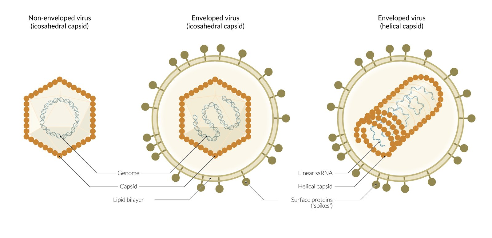

General structures of different virus particles

#### Envelope

* <u>Lipid bilayer</u> around the <u>capsid</u> that contains viral glycoproteins and host cell <u>proteins</u>

* The presence of the <u>lipid bilayer</u> makes nearly all enveloped viruses vulnerable to rapid inactivation by organic solvents (e.g., <u>alcohol</u>), <u>detergents</u>, and dry heat

* Usually originates from host cell's plasma membrane when the <u>virion</u> exits the host cell (except <u>Herpesviridae</u>, which acquire their primary envelope from host cell <u>nuclear membranes</u>).

* Some <u>viruses</u> do not possess envelopes. These are referred to as nonenveloped viruses (<u>naked viruses</u>)

* <u>DNA viruses</u>, e.g., <u>Papillomaviridae</u>, <u>Adenoviridae</u>, <u>Parvoviridae</u>, <u>Polyomaviridae</u>

* <u>RNA viruses</u>, e.g., <u>Caliciviridae</u>, <u>Picornaviridae</u>, <u>Reoviridae</u>, <u>Hepeviridae</u>

#### Other

* Spikes: viral <u>receptor</u> <u>proteins</u> (enables adhesion to host cell)

* Sheath and tail fibers: present in <u>bacteriophages</u>

> [!NOTE]
> To remember the <u>+ssRNA</u> <u>viruses</u> (TOGavirus, RETRovirus, HEPevirus, PICornavirus, CAlicivirus, FLAVivirus, and CORonavirus), think “2 Golden Retrievers are Heppily Picturing Cauliflower-Flavoured Corn dogs.”

> [!NOTE]
> To remember the RNA <u>viruses</u> that are naked (Picornaviridae, Reoviridae, Caliciviridae, and Hepeviridae), think: ”Don't Run around naked, put on some PRetty ClotHes.”

> [!NOTE]
> To remember that <u>ADE</u>novirus, <u>PAP</u>illomavirus, POLyomavirus, and <u>PAR</u>vovirus are DNA <u>viruses</u> without an envelope, think of “Without <u>ADE</u>quate <u>PAP</u>ers, the POLice will Deny <u>PAR</u>ole.”

> [!NOTE]
> To remember that pOX<u>virus</u>, <u>hepatitis</u> B <u>virus</u> and HERpesvirus are enveloped DNA <u>viruses</u>, think of “A bOXer Dog will never B a HERbivore.”

Viruses - Part 1: Enveloped and Non-Enveloped Viruses

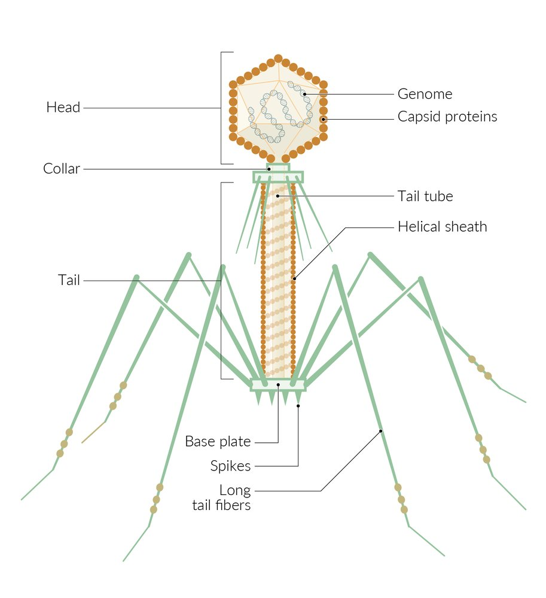

Structure of a bacteriophage

### Viral life cycle

<u>Viruses</u> replicate by synthesizing and assembling their individual components within the host cell.

1. * Attachment to the host cell: <u>viruses</u> use host cell surface <u>proteins</u> and <u>receptors</u> for entry (see <u>receptors used by viruses</u> below)
2. * Penetration into the host cell

* <u>Nonenveloped viruses</u>: via <u>endocytosis</u> or transmembrane transport

* <u>Enveloped viruses</u>: via <u>endocytosis</u> or fusion with host cell'<u>s cell</u> membrane
3. * Uncoating of the <u>nucleic acid</u>
4. * Replication of the <u>nucleic acid</u> and formation of <u>virus</u> <u>proteins</u> by <u>transcription</u> and <u>translation</u> (in <u>retroviruses</u>, <u>RNA</u> is initially transcribed into <u>DNA</u>)

* Early <u>mRNA</u> is for the synthesis of

* <u>Proteins</u> to shut down host cell <u>defense mechanisms</u>

* <u>Proteins</u> for <u>genome</u> replication (e.g., viral <u>RNA polymerase</u>)

* Late <u>mRNA</u> is for the synthesis of viral structural <u>proteins</u>
5. * Assembly of <u>virus</u> components
6. * Viral release

* Enveloped <u>viruses</u>: released via <u>budding</u>

* Nonenveloped <u>viruses</u>: released via host cell lysis

The period between uncoating in the host cell and production of recognizable <u>virus</u> particles is known as the eclipse period.

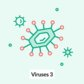

Viruses - Part 3:  Viral Replication Process

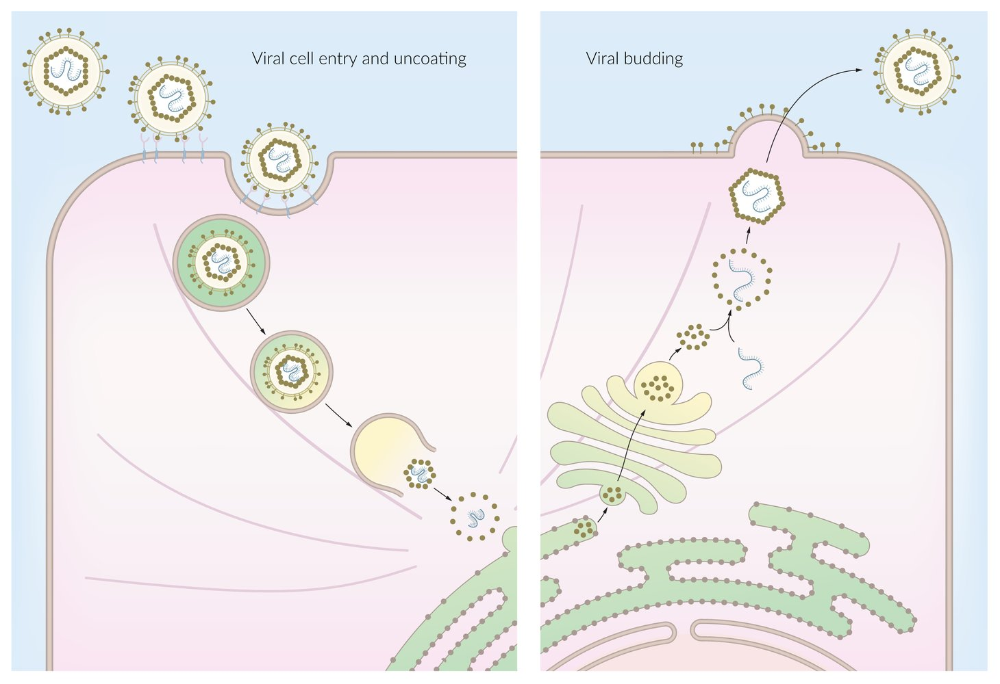

Viral life cycle

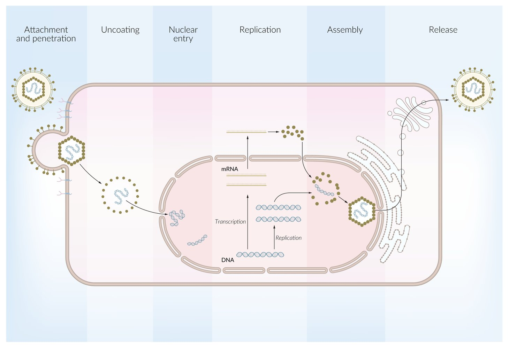

Intracellular viral replication cycle of a DNA virus

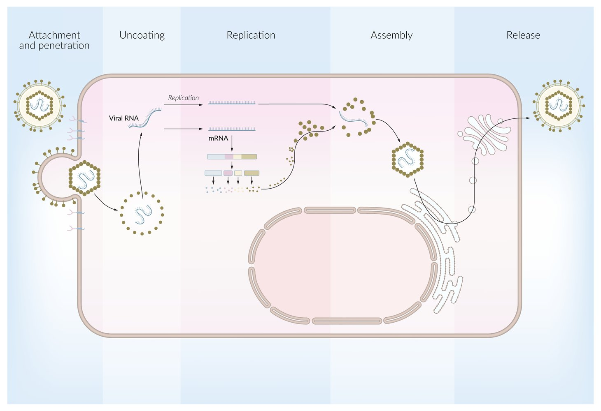

Intracellular viral replication cycle of a RNA virus

#### <u>Receptors used by viruses</u>

<u>Viruses</u> use host cell surface <u>proteins</u> and <u>receptors</u> to attach and penetrate the cells.

| Receptors used by viruses |  |
| --- | --- |
| <u>Viruses</u> | <u>Receptors</u> |
| <u>CMV</u> | <u>Integrins</u> (e.g., <u>heparan sulfate</u>) |
| <u>EBV</u> | <u>CD21</u> |
| <u>HIV</u> | <u>CD4</u>, <u>CXCR4</u>, <u>CCR5</u> |
| <u>Parvovirus B19</u> | <u>P antigen</u> on <u>erythrocytes</u> |
| <u>Rabies virus</u> | <u>Nicotinic acetylcholine receptor</u> |
| <u>Rhinovirus</u> | <u>ICAM-1</u> |
| <u>SARS-CoV-2</u> | ACE2 |

> [!NOTE]
> “The rhino knocked over mI <u>CAM</u>era”: rhino<u>virus</u> enters cells via ICAM-1.

### <u>Pathogenicity</u>

Mechanisms by which <u>viruses</u> cause infection in the host:

* Cytolysis: viral replication results in the destruction of host cell → release of <u>virus</u> 

* Seen with nonenveloped <u>viruses</u>

* Some <u>enveloped viruses</u>

* Immunopathological host reactions: cellular <u>immune response</u> to the invading <u>virus</u> is triggered by <u>cytotoxic T cells</u> → destruction of infected cells (e.g., <u>HBV</u>); the <u>virus</u>, however, is not cytopathogenic

* Transfer of genetic material: <u>bacteriophages</u> may transfer <u>virulence factors</u> (e.g., <u>exotoxins</u>)

### Course of viral infection

* Abortive (no viral replication or cell damage)

* Acute

* Chronic

* Persistent

* Latent viral infection (<u>virus</u> is inactive; no replication): <u>virus</u> remains dormant in infected cells

* Productive viral infection (viral replication occurs, dormant infection with few or no signs of infection)

* Transforming viral infection (<u>virus</u> may or may not replicate): triggers malignant transformation (e.g., <u>EBV</u>, <u>HPV</u>)

### <u>Host defense mechanisms</u>

The body has multiple <u>defense mechanisms</u> to inactivate and eliminate <u>viruses</u>. See “<u>Innate immune system</u>” and “<u>Adaptive immune system</u>.”

* <u>Innate immune response</u>

* Physical, biological, and chemical defenses

* <u>Keratinocytes</u> are impermeable to <u>viruses</u>

* <u>Mucociliary clearance</u> of respiratory tract (transports <u>viruses</u> towards the throat)

* Production of acid and viral replication inhibitors by <u>commensal organisms</u>

* <u>RNA interference</u> (only against <u>RNA viruses</u>)

* <u>Natural killer cells</u>

* <u>Complement system</u>

* <u>Interferon</u>: <u>IFN-alpha</u> and <u>IFN-beta</u>

* Produced by infected cells

* Triggers damage and <u>death</u> of infected cells

* Inhibit viral replication and viral <u>protein synthesis</u>

* <u>RNA</u> <u>endonucleases</u>: cleave phosphodiester bonds between <u>nucleotides</u>

* <u>Phosphorylation</u> of protein <u>kinases</u> → inactivation of <u>eIF2</u> → inhibition of <u>protein synthesis</u>

* <u>Adaptive immune response</u>

* <u>Immunoglobulins</u>

* <u>T cells</u>

> [!NOTE]
> <u>Interferon</u> can be used to treat active <u>hepatitis B</u> and <u>hepatitis C</u>.

---

## Viral genetics

### Viral genome replication

Viral genomic replication depends on the <u>viral genome</u> of the progenitor <u>virus</u>.

#### <u>Viruses</u> with <u>DNA</u> genomes (DNA viruses)

<u>DNA viruses</u> replicate in the <u>nucleus</u> of host cells (except <u>Poxviridae</u>, which carry their own <u>DNA-dependent RNA polymerase</u>).

* Double-stranded <u>DNA</u> (dsDNA)

* Without <u>reverse transcriptase</u> (almost all <u>viruses</u>): viral negative <u>DNA</u> strand is transcribed to <u>mRNA</u> using host cell's <u>RNA polymerase</u> → viral <u>proteins</u> and progeny dsDNA are formed

* With <u>reverse transcriptase</u>: <u>hepadnavirus</u> (only <u>HBV</u>, which is a reverse transcribing <u>virus</u>)

* <u>Transcription</u> of progeny <u>DNA</u> requires an <u>RNA-dependent DNA polymerase</u> (acts as a <u>reverse transcriptase</u>)

* Viral <u>DNA</u> is transcribed via host cell <u>RNA polymerase</u> to viral <u>mRNA</u> → viral protein synthesis → <u>HBV</u> <u>RNA-dependent DNA polymerase</u> then reverse transcribes viral <u>RNA</u> to form progeny <u>DNA</u>

* Single-stranded <u>DNA</u> (ssDNA): only <u>Parvoviridae</u>
* Host cell <u>DNA polymerase</u> converts ssDNA <u>viral genome</u> to dsDNA → negative <u>DNA</u> strand serves as template for <u>mRNA</u> (using host cell's <u>RNA polymerase</u>) → viral <u>proteins</u> and progeny ssDNA are formed

> [!NOTE]
> To remember that HERpes, ADeno, POLyoma, POx, <u>PAR</u>vo, HEPadna, and <u>PAP</u>illoma are DNA <u>viruses</u>, think: “I saw HER AD about a POLtergeist and POkemon <u>PAR</u>ty for HEPcats in the DAily <u>PAP</u>er.

#### <u>Viruses</u> with <u>RNA</u> genomes (RNA viruses)

<u>RNA viruses</u> replicate in <u>cytoplasm</u> of host cells (except <u>Retroviridae</u> and <u>influenza viruses</u>).

* Single-stranded <u>RNA</u> (ssRNA)

* Positive-sense single-stranded RNA (<u>+ssRNA</u>): can be translated directly to form <u>proteins</u> using host <u>ribosome</u>

* Without <u>reverse transcriptase</u>: <u>viral genome</u> codes for <u>RNA polymerase</u> → forms <u>-ssRNA</u> → template for progeny <u>+ssRNA</u>

* With <u>reverse transcriptase</u>: <u>retroviruses</u> (e.g., <u>HIV</u>, <u>HTLV</u>)

* <u>Reverse transcriptase</u> transcribes viral ssRNA to dsDNA

* Negative <u>DNA</u> strand serves as template for <u>mRNA</u> → viral <u>proteins</u> and progeny <u>+ssRNA</u> are synthesized

* Negative-sense single-stranded RNA (<u>-ssRNA</u>)

* A <u>negative strand</u> must be transcribed into <u>positive strand</u> first

* <u>Viral genome</u> codes for viral polymerase → <u>mRNA</u> → new viral <u>proteins</u> and progeny <u>-ssRNA</u>

* Includes <u>orthomyxovirus</u>, <u>paramyxovirus</u>, <u>arenavirus</u>, <u>filovirus</u>, <u>bunyavirus</u>, and <u>rhabdovirus</u>

* Double-stranded <u>RNA</u> (dsRNA): <u>Reoviridae</u>

> [!NOTE]
> To remember that <u>poxvirus</u> is the only <u>DNA virus</u> that replicates outside the <u>nucleus</u>, think: “POX, Progeny is Outside the boX.”

> [!NOTE]
> To remember that every <u>RNA virus</u> replicates in the cytoplasm (except influenza and retro<u>virus</u>), think: “aRe NA-VI RUS<u>tics</u> CYTy slickers? Yes, except if INFLUENced by RETRO fashion!”

> [!NOTE]
> To remember that <u>orthomyxovirus</u>, <u>paramyxovirus</u>, <u>arenavirus</u>, <u>filovirus</u>, <u>bunyavirus</u>, and <u>rhabdovirus</u> are <u>-ssRNA</u> <u>viruses</u>, think: “ORTHOpedics PARAglide into an ARENA FILled with <u>BUN</u>nies that have <u>RAB</u>ies.”

Viruses - Part 2: DNA vs. RNA Viruses

Intracellular viral replication cycle of a RNA virus

### Viral <u>infectivity</u> of <u>nonenveloped viruses</u>

The <u>infectivity</u> of <u>naked viruses</u> is determined by the <u>genome</u>.

* Purified <u>nucleic acids</u> of dsDNA <u>viruses</u> and <u>+ssRNA</u> <u>viruses</u> are infectious

* <u>+ssRNA</u> <u>viruses</u>: equivalent to <u>eukaryotic</u> <u>mRNA</u> → host cell <u>translation</u> machinery produces viral <u>proteins</u> → construction of <u>virions</u>

* dsDNA <u>viruses</u>: viral <u>DNA</u> transcribed to <u>mRNA</u> → viral protein production by host cell → perpetuation of <u>viral life cycle</u> without intact <u>virions</u>

* Exceptions: <u>HBV</u>, <u>poxvirus</u>

* <u>-ssRNA</u> and dsRNA <u>viruses</u> are not infectious without the polymerases required for replication.

### Genetic diversification

| Viral genetic exchange mechanisms |  |
| --- | --- |
| Process | Mechanism |
|  Recombination (viral)    |  * <u>Gene</u> exchange between two <u>chromosomes</u>  * Crossover between two regions of homologous base sequences  * Results in progeny with genetic material from two parental viral strains   |
|  Reassortment (viral)    |   * Occurs in <u>viruses</u> with segmented genomes (e.g., <u>influenza virus</u>, <u>rotavirus</u>)  * Exchange of genetic material between segments of two (or more) <u>viruses</u> from the same strain (e.g., the <u>influenza A</u> subtype <u>H1N1</u> 2009 <u>pandemic</u> was caused by <u>reassortment</u> of <u>genes</u> from human, swine, and <u>avian influenza</u> <u>viruses</u>)  * Can result in <u>antigenic shift</u>, which significantly increases the potential of a <u>virus</u> to cause <u>pandemics</u>    |
|  Complementation (viral)   |  * Occurs in two different scenarios  * Scenario 1: two mutated <u>viruses</u> from same/different family infect the same cell  * Scenario 2  * Mutated <u>viral genome</u> codes for a nonfunctional protein, a nonmutated <u>viral genome</u> codes for a functional protein.  * The functional protein can be used by both mutated and nonmutated <u>virus</u>.  * E.g., <u>HBV</u> codes for <u>HBsAg</u>, which is used by <u>hepatitis D virus</u> (<u>HDV</u>) as an envelope protein → <u>HDV</u> infection (without <u>HBsAg</u>, <u>HDV</u> cannot cause infection)   |
|  Phenotypic mixing (viral)    |  * Occurs with <u>coinfection</u> of a cell with two related <u>viruses</u> (<u>virus</u> A and <u>virus</u> B) → <u>genome</u> of <u>virus</u> A is partially or completely coated by surface <u>proteins</u> of <u>virus</u> B → pseudovirion formation (viral hybrid)  * <u>Virus</u> A determines genetic material of progeny <u>viruses</u> (including surface <u>proteins</u>)  * Surface <u>proteins</u> from <u>virus</u> B determine <u>host tropism</u> (<u>infectivity</u> of the hybrid <u>virus</u>)  * Future generations lose their <u>infectivity</u> and return to their previous state (future <u>virions</u> will have the coat from <u>virus</u> A)   |
| Phenotypic masking (<u>transcapsidation</u>) |   * Related <u>viruses</u> infect the same cell  * <u>Capsid</u> of one <u>virus</u> envelopes <u>genome</u> of another <u>virus</u>    |
| <u>Point mutations</u> |   * In <u>hemagglutinin</u> or <u>neuraminidase</u> <u>genes</u>  * Causes <u>antigenic drift</u>, which significantly increases the potential of a <u>virus</u> to cause <u>epidemics</u>    |

> [!NOTE]
> Some <u>viruses</u> are DESParate: <u>antigenic</u> Drift → Epidemics, <u>antigenic</u> Shift → Pandemic.

---

## Diagnostics

The most important diagnostic tools in virology are <u>serological testing</u> and <u>nucleic acid</u> detection. To identify specific, localized increase in viral production, different biological materials should be analyzed and compared.

* <u>Antibody</u> detection

* Viral hemagglutination inhibition test: used in the diagnosis of viral infections (e.g., <u>influenza</u>, <u>mumps</u>, and <u>measles</u>) 

* Patient serum is added to infected cells.

* If <u>antibodies</u> are present in the serum:

* A progression of infection in cell culture is inhibited (neutralization of <u>viruses</u>).

* <u>Hemagglutination</u> will not be observed.

* <u>ELISA</u> or <u>direct immunofluorescence</u> (e.g., <u>HSV</u>).

* <u>PCR</u>: quantitative detection of viral load (e.g., <u>HIV</u>, <u>HCV</u>)

* <u>Virus</u> isolation: a prerequisite for resistance testing (e.g., <u>HIV</u>)

* Time-consuming and <u>labor</u>-intensive methods

* Cell culture

* <u>Electron microscopy</u>

* Not typically used for clinical diagnostics

---

## Enveloped DNA viruses

| Overview of <u>enveloped DNA viruses</u> |  |  |  |  |  |
| --- | --- | --- | --- | --- | --- |
| Viral family | <u>Capsid</u> | Genetic structure | Important examples |  | Diseases |
| Herpesviridae |  * Icosahedral   |   * dsDNA  * Linear    |  * <u>Herpes simplex virus-1</u> (<u>HHV-1</u>)   |  |   * <u>Herpes labialis</u>  * <u>Gingivostomatitis</u>  * <u>Keratoconjunctivitis</u>  * <u>Herpetic whitlow</u>  * <u>Encephalitis</u>  * <u>Esophagitis</u>  * <u>Erythema multiforme</u>    |
|  * <u>Herpes simplex virus-2</u> (<u>HHV-2</u>)   |  |   * <u>Genital herpes</u>  * Neonatal herpes  * <u>Viral meningitis</u>    |  |  |  |
|  * <u>Varicella</u>-Zoster <u>virus</u> (<u>HHV-3</u>)   |  |   * <u>Chickenpox</u> and <u>shingles</u>  * <u>Encephalitis</u>  * <u>Pneumonia</u>    |  |  |  |
|  * <u>Epstein-Barr virus</u> (<u>HHV-4</u>)   |  |   * <u>Infectious mononucleosis</u>  * Associated with <u>lymphomas</u>   * <u>Burkitt lymphoma</u>  * <u>Nasopharyngeal carcinoma</u>  * Lymphoproliferative disease in transplant patients    |  |  |  |
|  * <u>Cytomegalovirus</u> (<u>HHV-5</u>)   |  |   * <u>CMV retinitis</u> (especially in individuals with <u>HIV infection</u>)  * <u>Congenital CMV infection</u>  * <u>Heterophile-negative mononucleosis</u>  * <u>CMV pneumonia</u>  * <u>CMV esophagitis</u>    |  |  |  |
|  * <u>Human herpes viruses</u> 6 and 7 (<u>HHV-6</u> and 7)   |  |  * <u>Roseola</u>   |  |  |  |
|  * <u>Human herpes virus 8</u> (<u>HHV-8</u>)   |  |   * <u>Kaposi sarcoma</u>  * See <u>herpes virus infections</u>    |  |  |  |
|  Hepadnaviridae  |  * Icosahedral   |   * Partially dsDNA  * Circular    |  * Hepatitis B virus (<u>HBV</u>)    * Highest <u>prevalence</u> among all <u>hepatitis</u> <u>viruses</u>  * Chronicity possible: viral persistence in ∼ 5% of all <u>HBV infections</u>  * Possesses <u>reverse transcriptase</u>: transcribes progeny <u>DNA</u> from <u>RNA</u> copies made from progenitor <u>DNA</u>  * Oncogenic potential: <u>liver</u> <u>cirrhosis</u> → <u>hepatocellular carcinoma</u>  * Prevention and treatment  * <u>Active immunization</u> with <u>inactivated vaccine</u>  * Virostatic agents (e.g., <u>lamivudine</u>, <u>IFN-α</u>)   |  |  * Hepatitis B (acute or chronic)   |
| Poxviridae |  * Complex   |   * dsDNA  * Linear (largest <u>DNA virus</u>)    |  * Molluscipoxvirus genus   |  * <u>Molluscum contagiosum virus</u>   |  * <u>Molluscum contagiosum</u>   |
|  * Orthopoxvirus genus   |  * Variola virus   |  * <u>Smallpox</u>: declared eradicated in 1980. The <u>virus</u> was eradicated by 1980 through widespread <u>immunization</u> with a <u>live-attenuated vaccine</u> and is no longer found outside of laboratories.   |  |  |  |
|  * <u>Cowpox</u> <u>virus</u>   |  * Cowpox   |  |  |  |  |
|  * <u>Monkeypox virus</u>   |  * <u>Monkeypox</u>   |  |  |  |  |

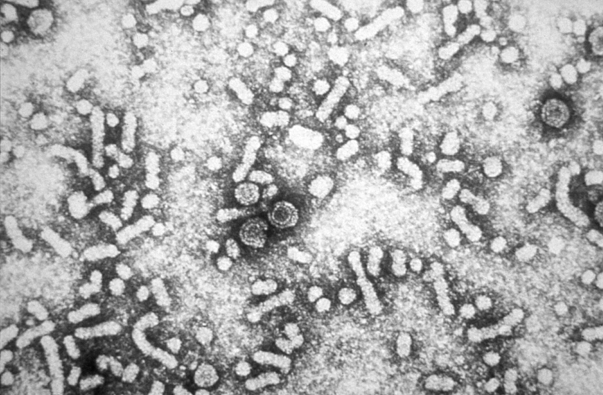

Hepatitis B virus

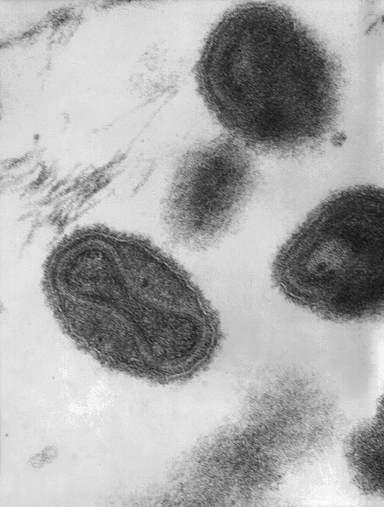

Poxvirus virion

Hepatitis B Virus: Serology

---

## Nonenveloped DNA viruses

| Overview of <u>nonenveloped DNA viruses</u> |  |  |  |  |
| --- | --- | --- | --- | --- |
| Viral family | <u>Capsid</u> | Genetic structure | Important examples | Diseases |
| Adenoviridae |  * Icosahedral   |   * dsDNA  * Linear    |  * Adenovirus    * More than 50 <u>serotypes</u>  * Transmission via contaminated water or fecal-oral route  * Different <u>serotypes</u> infect various cells  * May persist after primary infection   |   * Respiratory and <u>gastrointestinal infections</u>   * <u>Febrile</u> <u>pharyngitis</u>  * <u>Conjunctivitis</u>  * <u>Pharyngoconjunctival fever</u>  * <u>Pneumonia</u>  * Acute <u>hemorrhagic cystitis</u>  * <u>Gastroenteritis</u>  * <u>Myocarditis</u>  * <u>Epidemic keratoconjunctivitis</u>  * <u>Meningitis</u>    |
| Papillomaviridae |   * dsDNA  * Circular    |  * <u>Human papillomavirus</u> (<u>HPV</u>)  * Comprised of ∼ 100 <u>genotypes</u>  * Low-risk subtypes: include <u>HPV</u> 1, 2, 6 and 11  * High-risk subtypes: include <u>HPV 16</u>, 18, 31, and 33  * Transmission mainly via sexual intercourse  * Persistent after primary infection  * Active <u>HPV vaccination</u> recommended for individuals 9–45 years of age   |   * <u>Verruca vulgaris</u> (<u>common warts</u>): especially <u>HPV</u> 1 and 2  * <u>Condyloma acuminata</u>: especially <u>HPV</u> 6 and 11  * <u>Flat condylomata</u>: especially <u>HPV 16</u> and 18  * <u>Giant condylomata</u>: especially <u>HPV</u> 6 and 11  * Malignant transformation (especially infection with high-risk subtypes)  * <u>Cervical cancer</u>/<u>CIN</u> (<u>HPV 16</u> and 18)  * <u>Vulvar carcinoma</u>  * <u>Vaginal carcinoma</u>  * <u>Penile cancer</u>  * <u>Anal cancer</u>  * Squamous cell <u>laryngeal carcinoma</u>  * Squamous cell <u>pharyngeal cancer</u>    |  |
| Polyomaviridae |   * dsDNA  * Circular    |  * JC virus  * Transmission usually occurs during childhood  * Persistent after primary infection   |  * <u>Progressive multifocal leukoencephalopathy</u> in <u>HIV</u> infection   |  |
|  * BK virus   * Route of transmission unclear but likely through exposure to respiratory secretions  * Persistent after primary infection   |  * Polyomavirus-associated nephropathy under <u>immunosuppression</u>: occurs in up to 10% of all <u>kidney transplant</u> patients  [[1]](https://coursology-qbank.com/amboss/article/7zb48w)   |  |  |  |
| Parvoviridae |   * ssDNA  * Linear (smallest <u>DNA virus</u> )    |  * Parvovirus B19  * <u>Droplet transmission</u> and <u>vertical transmission</u>  * Primarily infects progenitor cells of <u>erythrocytes</u> in <u>bone marrow</u> and <u>endothelial</u> cells  * Attaches to <u>P antigen</u> on <u>RBCs</u> and <u>endothelial</u> cells → cell destruction   |   * <u>Fifth disease</u>  * Congenital <u>parvovirus B19 infection</u> → <u>hydrops fetalis</u>  * <u>Aplastic crisis</u> in patients with <u>hemolytic anemias</u> (e.g. <u>sickle cell disease</u>, <u>thalassemias</u>)  * <u>Parvovirus B19-associated arthritis</u> (most commonly in adults)  * <u>Pure red blood cell aplasia</u> in adults    |  |

> [!NOTE]
> To remember the diseases associated with <u>polyomaviruses</u>, think: “JC <u>virus</u> leads to a Junky Cerebrum (<u>PML</u>) and BK <u>virus</u> leads to Bad Kidneys (nephropathy in <u>immunocompromised</u> patients).”

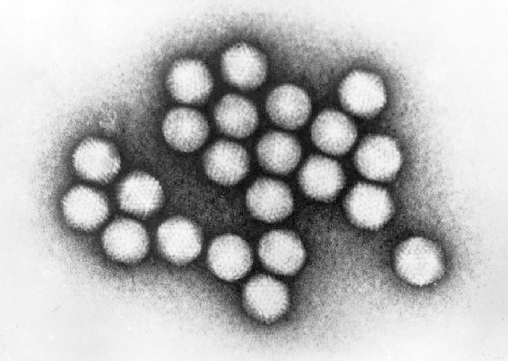

Adenovirus

---

## Enveloped RNA viruses

### <u>Pneumoviridae</u>

| Overview of <u>Pneumoviridae</u> |  |  |  |  |
| --- | --- | --- | --- | --- |
| Viral family | <u>Capsid</u> | Genetic structure | Important examples | Diseases |
| Pneumovirus |  * Helical   |   * Linear  * <u>-ssRNA</u>  * Nonsegmented  * Fusion protein (F protein) on surface: special <u>virulence factor</u> that causes fusion of respiratory <u>epithelial</u> cells → formation of multinucleated cells    |  * Respiratory syncytial virus (<u>RSV</u>)    * Primarily <u>droplet transmission</u> and <u>fomites</u>  [[2]](https://coursology-qbank.com/amboss/article/okW0Kl0)  * Highly contagious  * Infects <u>ciliated epithelial cells</u> of the respiratory tract  * Humans are sole host  * Most commonly causes severe illness in <u>infants</u>, young children, and older adults  * See also “<u>RSV infection</u>.”   |   * <u>Upper respiratory tract infections</u>  * <u>Bronchiolitis</u>  * <u>Pneumonia</u>    |
|  * Human metapneumovirus  * <u>Droplet transmission</u> and <u>fomites</u>  * Most commonly infects <u>infants</u>   |  * <u>Bronchiolitis</u>, <u>pneumonia</u>   |  |  |  |

> [!TIP]
> Pneumoviruses, e.g., <u>RSV</u> and <u>human metapneumovirus</u>, are no longer members of the <u>Paramyxoviridae</u> family. [[3]](https://coursology-qbank.com/amboss/article/0sWet50)

### Paramyxoviridae

| Overview of <u>Paramyxoviridae</u> |  |  |  |  |
| --- | --- | --- | --- | --- |
| Viral family | <u>Capsid</u> | Genetic structure | Important examples | Diseases |
| Morbillivirus |  * Helical   |   * Linear  * <u>-ssRNA</u>  * Nonsegmented  * Fusion protein (F protein) on surface: special <u>virulence factor</u> that causes fusion of respiratory <u>epithelial</u> cells → formation of multinucleated cells    |  * Measles virus    * Primarily <u>airborne transmission</u>  * Highly contagious  * Lymphotropic  * Humans are the sole host.  * <u>Active immunization</u> with attenuated <u>vaccine</u>  * See “<u>Immunization schedule</u>.”   |  * <u>Measles</u>   |
| Rubulavirus |  * Mumps virus  * <u>Droplet transmission</u> and <u>contact transmission</u>  * Highly contagious  * Lymphotropic  * Humans are the sole host.  * Prevention: <u>active immunization</u> with attenuated <u>vaccine</u>  * See “<u>Immunization schedule</u>.”   |  * <u>Mumps</u>   |  |  |
| Paramyxovirus |  * Parainfluenza virus  * <u>Droplet transmission</u> and <u>contact transmission</u>  * Infects <u>upper respiratory tract</u>  * Young children and <u>infants</u> are commonly affected  * Relevant in both human and veterinary medicine   |   * <u>Upper respiratory infections</u>  * Lower respiratory infections  * <u>Croup</u>    |  |  |
| Henipavirus |  * Hendra virus  * Natural reservoir: flying fox  * Transmission: via direct contact with bodily fluids of infected domestic animals (e.g., horses)   |  * <u>Hendra virus disease</u>   |  |  |

> [!NOTE]
> ParaMyxovirus includes Parainfluenza and Measles/Mumps/(human).

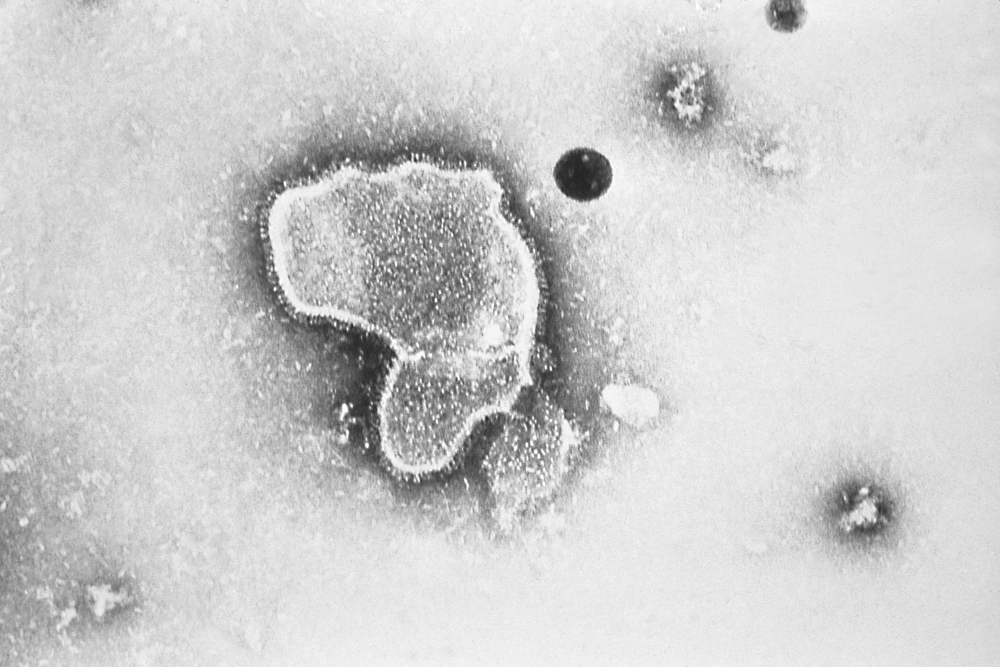

Respiratory syncytial virus

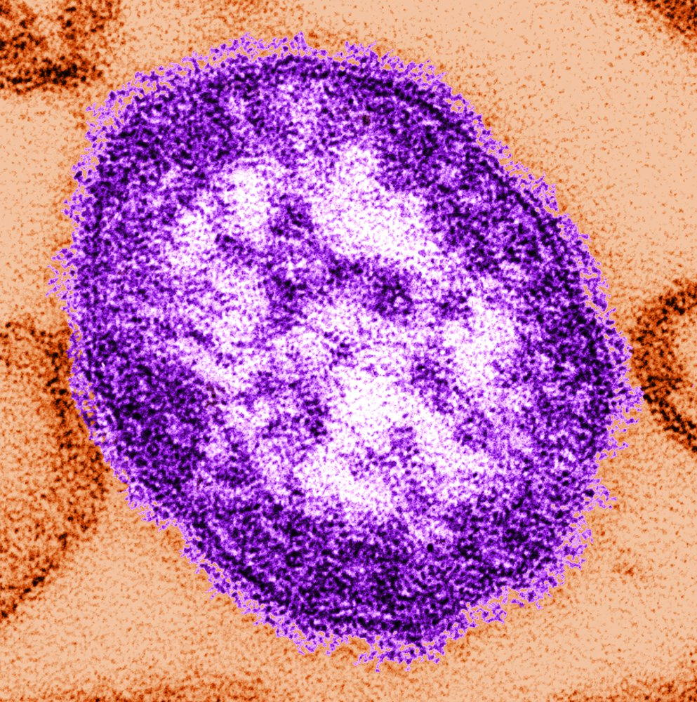

Measles virus

### Flaviviridae

| Overview of <u>Flaviviridae</u> |  |  |  |  |
| --- | --- | --- | --- | --- |
| <u>Virus</u> genus | <u>Capsid</u> | Genetic structure | Important examples | Diseases |
| Hepacivirus |  * Icosahedral   |   * <u>+ssRNA</u>  * Linear    |  * Hepatitis C virus (<u>HCV</u>)  * Humans are sole natural host  * Parenteral transmission  * Chronicity: only <u>RNA virus</u> that can persist despite absence of <u>reverse transcriptase</u>  * Oncogenic potential: <u>liver</u> <u>cirrhosis</u> → <u>hepatocellular carcinoma</u>   |  * <u>Hepatitis C</u>   |
|  Flavivirus (Belong to the arboviruses) |  * Icosahedral   |   * <u>+ssRNA</u>  * Linear    |  * Tick-borne encephalitis virus  * Animal reservoirs (e.g., rodents)  * <u>Vector</u>: ticks (replication occurs in <u>salivary glands</u> of <u>vector</u>)  * <u>Vaccination</u> of persons at risk of exposure (e.g., forestry workers)   |  * <u>Tick-borne encephalitis</u>   |
|  * Yellow fever virus  * Reservoir: primary monkeys  * <u>Vector</u>: mosquito (after <u>inoculation</u>, the <u>virus</u> replicates in <u>dendritic cells</u>)  * Predominant occurrence in Africa and South America  * <u>Vaccination</u> of persons at risk of exposure (e.g., travelers)   |  * <u>Yellow fever</u>   |  |  |  |
|  * Dengue virus  * Reservoir: humans  * <u>Vector</u>: mosquitoes  * Predominant occurrence in the Caribbean, South America, Southeast Asia, and Oceania   |  * <u>Dengue fever</u>   |  |  |  |
|  * Zika virus  * Sexual transmission, <u>vector-borne transmission</u>, and <u>vertical transmission</u>  * Reservoir: primarily African monkeys and other primates  * During <u>outbreaks</u>, human-to-<u>vector</u>-to-human transmission occurs  * <u>Vectors</u>: mosquitoes (<u>Aedes aegypti</u> and Aedes albopictus)  * Found predominantly in South America, Africa, and Southeast Asia   |   * <u>Zika fever</u>  * <u>Congenital Zika syndrome</u>    |  |  |  |
|  * West Nile virus   |  * <u>West Nile fever</u>   |  |  |  |
|  * St. Louis encephalitis virus   |  * St. Louis encephalitis   |  |  |  |
|  * Murray Valley encephalitis virus   |  * <u>Murray Valley encephalitis</u>   |  |  |  |

> [!NOTE]
> ARBO<u>virus</u> is an acronym for <u>AR</u>thropod BOrne <u>virus</u>.

### Orthomyxoviridae

| Overview of <u>Orthomyxoviridae</u> |  |  |  |  |
| --- | --- | --- | --- | --- |
| Viral genus | <u>Capsid</u> | Genetic structure | Important examples | Diseases |
|  Influenza viruses    |  * Helical   |   * <u>-ssRNA</u> (8 segments)  * Linear    |   * Three pathogenic types  * Influenzavirus A  * Influenzavirus B  * Influenzavirus C  * Subtypes are differentiated by cell surface <u>antigens</u> <u>hemagglutinin</u> and <u>neuraminidase</u> (e.g., <u>H1N1</u> is "<u>swine flu</u>")   [[4]](https://coursology-qbank.com/amboss/article/GjYBb6)  * <u>Hemagglutinin</u> (H): promotes viral entry by binding to <u>sialic acid residues</u>  * <u>Neuraminidase</u> (N): promotes the release of <u>virion</u> progeny from host cells by cleaving terminal <u>sialic acid residues</u>  * High <u>antigen</u> variability through <u>antigenic drift</u> and <u>antigenic shift</u>  * Two forms of <u>vaccines</u> against <u>influenza virus A</u> and B: inactivated and live attenuated    |  * <u>Influenza</u> (the "<u>flu</u>")   |

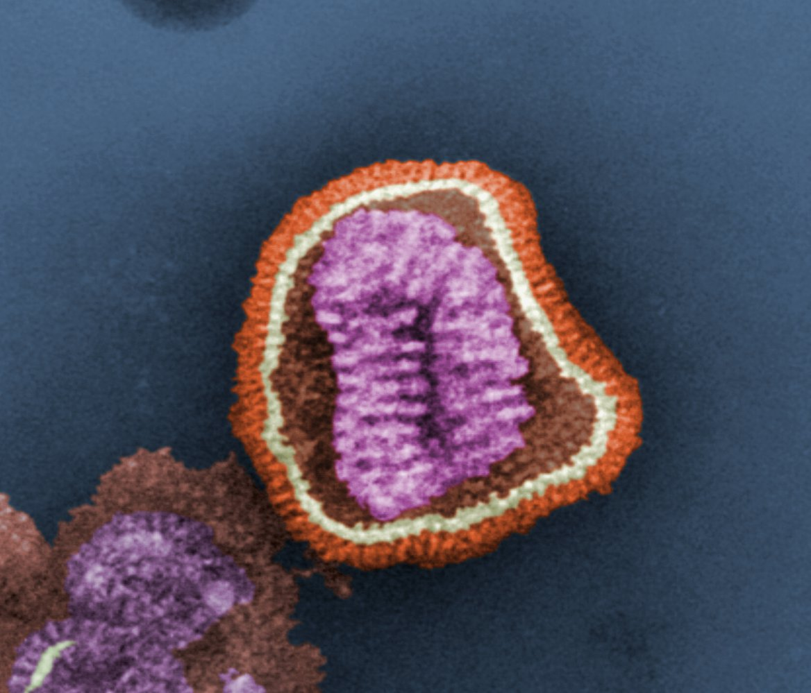

Influenza virion

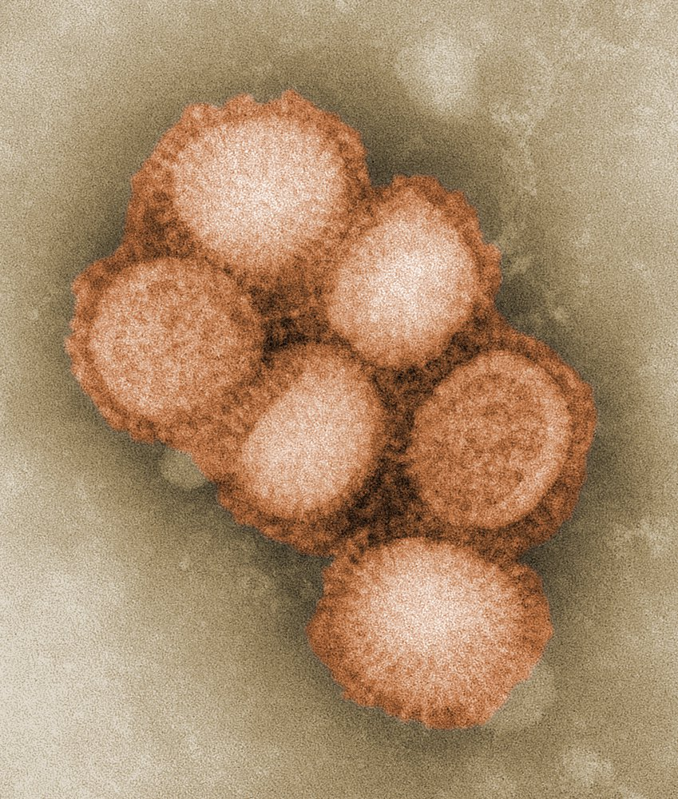

Influenza virus (subtype H1N1)

### Other <u>enveloped RNA viruses</u>

| Overview of other <u>enveloped RNA viruses</u> |  |  |  |  |  |
| --- | --- | --- | --- | --- | --- |
| <u>Virus</u> family | <u>Capsid</u> | Genetic structure | Important examples |  | Diseases |
| Rhabdoviridae |  * Helical   |   * <u>-ssRNA</u>  * Linear    |  * Lyssavirus   |  * Rabies virus  * Infection via the saliva of infected animals  * <u>Virus</u> attaches to <u>nicotinic acetylcholine receptors</u>  * Infected cells form <u>Negri bodies</u>   |  * <u>Rabies</u>   |
|  * Australian bat lyssavirus: closely related to the <u>rabies virus</u>   |  * <u>Australian bat lyssavirus</u> infection   |  |  |  |  |
| Coronaviridae |  * Helical   |   * <u>+ssRNA</u>  * Linear    |  * Coronavirus  * Important subtypes  * SARS-CoV  * MERS-CoV  * <u>SARS-CoV2</u>: attaches to ACE2 <u>receptors</u>  * Reservoir: bats  * Respiratory <u>droplet transmission</u>   |  |   * Mild upper respiratory and <u>gastrointestinal tract</u> infection  * Severe Acute Respiratory Syndrome (SARS; <u>outbreak</u> 2002)  * Middle East Respiratory syndrome (MERS; <u>outbreak</u> 2012)  * <u>Coronavirus</u> Disease 2019 (<u>COVID-19</u>; <u>outbreak</u> 2019/20)    |
| Retroviridae |   * Complex and conical (<u>HIV</u>)  * Icosahedral (<u>HTLV</u>)    |   * <u>+ssRNA</u> (2 copies)  * Linear  * Express <u>reverse transcriptase</u>    |  * <u>HIV</u>  * Parenteral transmission  * Important <u>virulence factors</u>  * Infects cells that carry <u>CD4</u> surface <u>antigen</u>  * Attaches to <u>CCR5</u> and <u>CXCR4</u>   |  |  * <u>AIDS</u>   |
|  * HTLV (<u>human T-cell lymphotropic viruses</u>): has <u>reverse transcriptase</u>   |  |   * <u>Adult T-cell leukemia</u>  * <u>Non-Hodgkin lymphoma</u>    |  |  |  |
|  Bunyaviridae: recently reclassified as the order <u>Bunyavirales</u>   |  * Helical   |   * <u>-ssRNA</u> (3 segments)  * Pseudocircular    |  * Hantavirus   * Different subtypes depending on geographical region  * Reservoir: rodents  * Routes of transmission  * Aerogens by contaminated dust  * Bite from an infected animal   |  |   * <u>Acute tubulointerstitial nephritis</u>  * <u>Hemorrhagic fever</u>    |
|  * Crimean-Congo hemorrhagic fever virus  * Reservoir: animals, e.g., birds  * <u>Vector</u>: ticks   |  |  * <u>Hemorrhagic fever</u>   |  |  |  |
|  * La Crosse virus   |  |  * La Crosse encephalitis   |  |  |  |
|  * California encephalitis virus   |  |  * California encephalitis   |  |  |  |
|  * Rift Valley fever virus   |  |  * Rift Valley fever   |  |  |  |
|  Arenaviridae   |  * Helical   |   * <u>+ssRNA</u> and -ssRNA (2 segments)  * Circular    |  * Lassa virus   * Occurs mainly in West Africa  * Reservoir: rats   |  |  * Lassa fever   |
|  * Lymphocytic choriomeningitis virus  * Occurs mainly in Europe, Australia, Japan, North America, and South America  * Reservoir: rats   |  |  * Lymphocytic choriomeningitis or <u>encephalitis</u>   |  |  |  |
| Togaviridae |  * Icosahedral   |   * <u>+ssRNA</u>  * Linear    |  * Chikungunya virus  * Mainly occurs in tropical and subtropical regions  * Reservoir: nonhuman or human primates  * <u>Vector</u>: mosquito (<u>Aedes aegypti</u>, Aedes albopuctis)   |  |  * <u>Chikungunya fever</u>  (<u>co-infection</u> with <u>dengue</u> possible) [[5]](https://coursology-qbank.com/amboss/article/zzbrvw)   |
|  * Eastern Equine Encephalitis virus (EEEV)   |  |  * <u>Eastern equine encephalitis</u>   |  |  |  |
|  * Western Equine Encephalitis virus (<u>WEEV</u>)   |  |  * <u>Western equine encephalitis</u>   |  |  |  |
|  * Venezuelan equine encephalitis virus (VEEV)   |  |  * <u>Venezuelan equine encephalitis</u>   |  |  |  |
|  * Ross River virus (<u>RRV</u>)   |  |  * <u>Ross River fever</u>   |  |  |  |
|  * Barmah Forest virus (BFV)   |  |  * <u>Barmah Forest virus disease</u>   |  |  |  |
| Filoviridae |  * Helical   |   * <u>-ssRNA</u>  * Linear    |  * Ebolavirus/Marburgvirus   * Occurs in Central and West Africa  * Reservoir: most likely fruit bats and monkeys  * Infects <u>endothelial</u> cells, <u>phagocytes</u>, and <u>hepatocytes</u>   |  |  * <u>Hemorrhagic fever</u> (often fatal)   |
| Deltaviridae |  * Unknown   |   * <u>-ssRNA</u>  * Circular    |  * <u>Hepatitis D virus</u> (<u>HDV</u>)  * Incomplete <u>RNA virus</u> that can only replicate in the presence of <u>HBV</u>  * Transmission: sexual, parenteral, <u>perinatal</u>  * <u>Endemic</u> in Africa and South America   |  |  * <u>Hepatitis D</u>   |
| Matonaviridae |  * Icosahedral   |   * <u>+ssRNA</u>  * Linear    |  * Rubella virus  * Only affects humans  * <u>Droplet transmission</u>, <u>contact transmission</u>, and <u>vertical transmission</u>  * Special features in <u>virus</u> transmission: early viral shedding by the infected individual  * <u>Active vaccination</u> with attenuated <u>vaccine</u>  * See “<u>Immunization schedule</u>.”   |  |   * <u>Rubella</u>  * <u>Congenital rubella syndrome</u>    |

> [!NOTE]
> To remember that <u>HDV</u> can only replicate in the presence of <u>HBV</u>, think: “HDV is Deficient without a Buddy (HBV).”

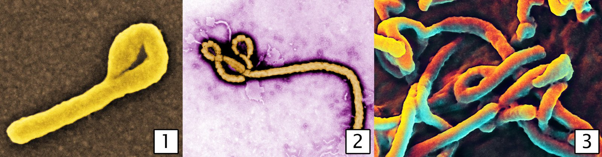

Ebola virus

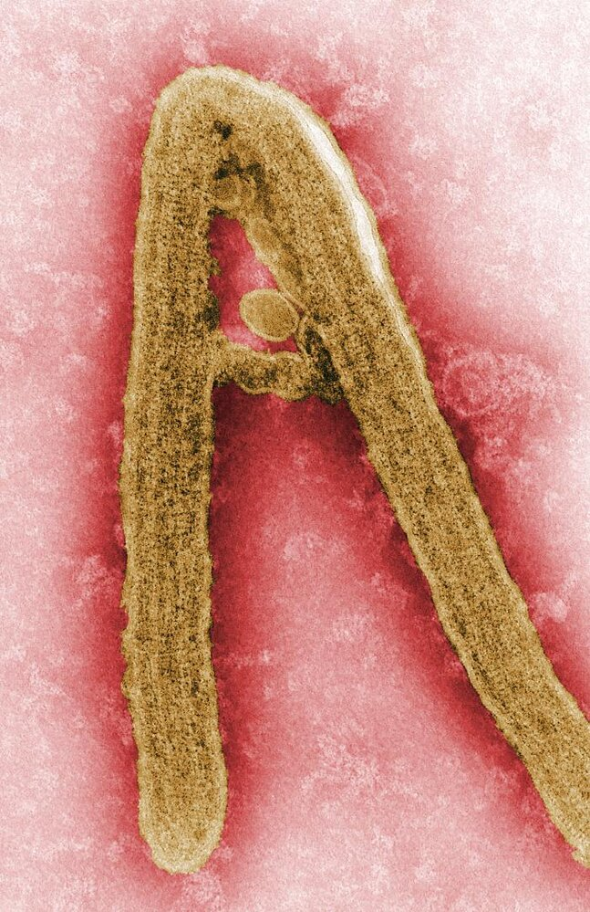

Marburg virus

---

## Nonenveloped RNA viruses

### Picornaviridae

| Overview of <u>Picornaviridae</u> |  |  |  |  |
| --- | --- | --- | --- | --- |
| Viral family | <u>Capsid</u> | Genetic structure | Important examples | Diseases |
| Enterovirus |  * Icosahedral   |   * <u>+ssRNA</u>  * Linear    |  * Coxsackievirus   * <u>Coxsackie A</u> <u>virus</u>  * <u>Coxsackie B</u> <u>virus</u>   |   * <u>Coxsackie A</u>  * <u>Herpangina</u>  * <u>Hand, foot, and mouth disease</u>  * <u>Pericarditis</u> , <u>myocarditis</u>  * <u>Aseptic meningitis</u>  * <u>Coxsackie B</u>  * <u>Myocarditis</u>  * <u>Dilated cardiomyopathy</u>  * <u>Bornholm disease</u>  * <u>Pericarditis</u>  * <u>Aseptic meningitis</u>    |
|  * Echovirus   |  * Wide spectrum of diseases  * <u>Aseptic meningitis</u>  * <u>Conjunctivitis</u>  * <u>Myocarditis</u>  * <u>Hepatitis</u>  * Severe neonatal <u>diarrhea</u>   |  |  |  |
|  * Poliovirus  * <u>Neurotropic</u> <u>virus</u>  * Almost eradicated (cases have been reported in Pakistan and Afghanistan)  * Prevention: inactivated <u>vaccine</u>  * Salk <u>polio</u> <u>vaccine</u> (IM administration)  * Sabin <u>polio</u> <u>vaccine</u> (oral administration)  * See “<u>Immunization schedule</u>.”   |  * <u>Poliomyelitis</u>   |  |  |  |
|  * Rhinovirus   * More than 110 <u>serotypes</u>  * Very high <u>incidence</u>  * Primarily <u>droplet transmission</u> and <u>fomites</u>  [[2]](https://coursology-qbank.com/amboss/article/okW0Kl0)  * Attaches to <u>ICAM-1</u> <u>receptors</u> (CD54) on respiratory <u>epithelial</u> cells  * Acid labile (inactivated by <u>gastric acid</u>): <u>proliferation</u> is limited to local portals of entry (<u>nasopharyngeal</u> <u>epithelium</u>, not <u>GI tract</u>)   |   * <u>Rhinitis</u>  * <u>Common cold</u>    |  |  |  |
| Hepatovirus |  * Hepatitis A virus (<u>HAV</u>)  * High infection rate from infected water and food, particularly in subtropical and tropical regions  * Transmission: fecal-oral  * No chronicity  * Prevention: <u>inactivated vaccine</u> for persons at risk and travelers to <u>endemic</u> regions.   |  * <u>Hepatitis A</u>   |  |  |

> [!NOTE]
> To remember that COxsackie <u>virus</u>, <u>HAV</u>, POLiovirus, RHInovirus, and <u>ECHO</u><u>virus</u> are PICornaviridae, think: “The COps <u>HAV</u>e a POLice RHINO that ECHOS any song they PICk.”

### Other <u>nonenveloped RNA viruses</u>

| Overview of other <u>nonenveloped RNA viruses</u> |  |  |  |  |
| --- | --- | --- | --- | --- |
| Viral genus | <u>Capsid</u> | Genetic structure | Important examples | Diseases |
| Astroviridae |  * Icosahedral   |   * <u>+ssRNA</u>  * Linear    |  * Astrovirus  * Infectious one day before and one day after clinical manifestation of disease  * Transmission: fecal-oral   |  * <u>Diarrhea</u>   |
| Reoviridae |  * Icosahedral (double or triple layer)   |   * dsRNA  * Multisegmented (10–12 segments)  * Linear    |  * Rotavirus  * Transmission: fecal-oral  * Prevention: attenuated <u>vaccine</u> for children  * See “<u>Immunization schedule</u>.”  * Reservoir: humans, calves, and pigs   |  * <u>Rotavirus infection</u> (especially infantile <u>gastroenteritis</u>)   |
|  * Coltivirus   |  * <u>Colorado tick fever</u>   |  |  |  |
| Hepeviridae |  * Icosahedral   |   * <u>+ssRNA</u>  * Linear    |  * Hepatitis E virus (<u>HEV</u>)  * Reservoir: wild boars, domestic pigs  * Transmission: fecal-oral   |  * <u>Hepatitis E</u>   |
| Caliciviridae |  * Icosahedral   |   * <u>+ssRNA</u>  * Linear    |  * Norovirus  * Only occurs in humans  * Transmission: fecal-oral and aerosols (e.g., during <u>vomiting</u>)  * Highly contagious   |  * <u>Norovirus infection</u>   |

> [!NOTE]
> COLTI<u>virus</u> causes COLorado TIck <u>fever</u>.

---