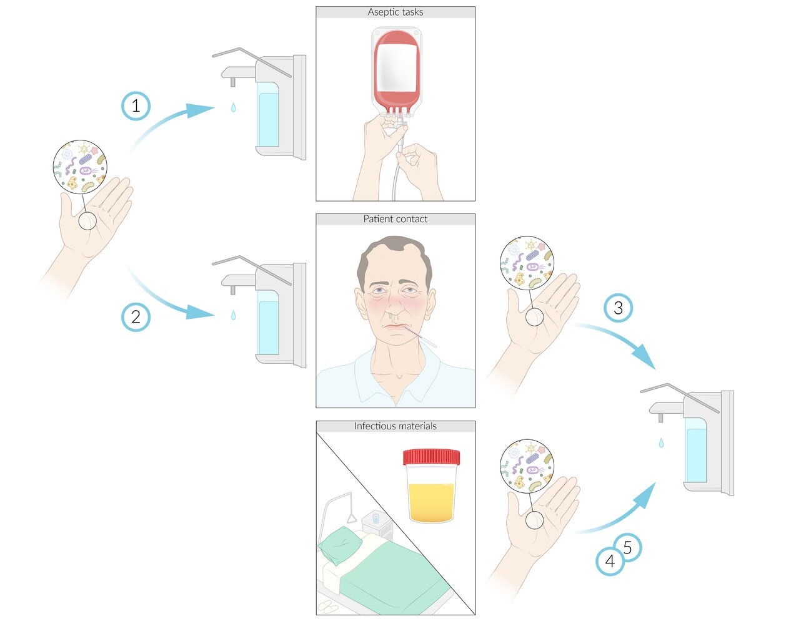
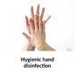

# Infection prevention and control

*Categories: Clinical knowledge > Internal medicine > Infectious diseases > Basics of infectious diseases > Infection prevention and control*

[Original Article Link](https://coursology-qbank.com/amboss/article/WQ0PEf)

---

## Summary

Health care-based infection prevention and control programs aim to reduce the spread of infections between patients and <u>health care personnel</u> (<u>HCP</u>). The most commonly used methods include <u>standard precautions</u>, which are a universal set of precautions that should be taken with all patients, and <u>isolation precautions</u>, which are designed to break the chain of infection for specific infectious diseases. <u>Standard precautions</u> include <u>hand hygiene</u> and routine cleaning and <u>disinfection</u> of devices and surfaces. Community-based precautions are utilized for <u>notifiable diseases</u> and during <u>epidemic</u> and <u>pandemic</u> disease <u>outbreaks</u>. <u>HCP</u> may be exposed to infectious pathogens, either through insufficient use of <u>isolation precautions</u> or a breach of <u>personal protective equipment</u> (e.g., a <u>needlestick injury</u>). Any <u>HCP</u> who have been exposed to an infectious <u>pathogen</u> should seek immediate advice from their occupational health department to prevent the development of infection and/or reduce the risk of further transmission. Specific protocols exist to reduce the risk of <u>health care-associated infections</u> (<u>HAIs</u>), which are often associated with the use of indwelling devices such as urinary catheters. Some of the recommendations outlined in this article to prevent specific <u>HAIs</u> may differ depending on local infection patterns and between institutions. Therefore, hospital-specific protocols should always be consulted.

---

## Standard precautions

* Definition: standard practices that should be used for all patients to minimize the spread of infectious material, whether an infection is suspected or not

* Includes the following: [[1]](https://coursology-qbank.com/amboss/article/wfchob0)

* Hand and <u>respiratory hygiene</u>

* <u>Personal protective equipment</u> (<u>PPE</u>): use of gloves, gowns, masks, and <u>eye</u> protection as needed

* Aseptic and <u>safe injection techniques</u>

* Routine cleaning, <u>disinfection</u>, and/or sterilization of devices, instruments, and surfaces

---

## Health care hygiene

### Hand hygiene [[2]](https://coursology-qbank.com/amboss/article/0jbe_t)[[3]](https://coursology-qbank.com/amboss/article/eVcxtY0)[[4]](https://coursology-qbank.com/amboss/article/UVcbFY0)[[5]](https://coursology-qbank.com/amboss/article/lpcvpW0)

* Definition: practices used to minimize pathogens on the hands of <u>HCP</u>

* Options

* <u>Antiseptic</u> (most often <u>alcohol</u> based) hand rub: preferred method for unsoiled hands

* Handwashing with soap and water: preferred method for soiled hands

* Basic precautions

* <u>Nails</u>: cut short, no artificial <u>nails</u>

* No jewelry on the hands or forearms

* Avoid touching the face.

* General indications

* If hands are not soiled, use <u>alcohol-based hand rub</u> before and after the following: 

* Work shifts and breaks

* Contact with each patient and/or their immediate environment

* Moving from contaminated to clean body sites on the same patient

* Handling medication, syringes, invasive equipment, and infusions

* Putting on and removing gloves

* Wash hands with plain soap and water:

* If hands are visibly soiled

* Following exposure to <u>spore-forming</u> bacteria

* Before eating and after using the restroom

* If hand rub is not available

* Barriers to <u>hand hygiene</u> compliance

* Work overload and time constraints

* Poor <u>situational awareness</u> of the instances when <u>hand hygiene</u> should be performed

* Intolerance or aversion to certain <u>disinfectant</u> formulations

* Lack of a <u>safety culture</u> at the workplace

* Measures to increase <u>hand hygiene</u> compliance: The most effective measures to increase <u>hand hygiene</u> compliance are based on <u>human factors engineering</u> strategies.

* Implement <u>real-time feedback loops</u>, in which designated <u>hand hygiene</u> observers or <u>electronic hand hygiene systems</u> monitor compliance and provide immediate feedback (e.g., verbal feedback on improper technique, real-time data visualization of each hospital floor's <u>hand hygiene</u> <u>process measures</u>).

* Repeat training sessions on <u>hand hygiene</u> frequently to increase <u>situational awareness</u>.

* Increase the number of <u>hand hygiene</u> stations and visual reminders (e.g., posters) and provide them at easily accessible locations.

* Provide <u>alcohol-based hand rubs</u> at <u>hand hygiene</u> stations.

* Hand care: to prevent occupational <u>irritant contact dermatitis</u>

* Use <u>alcohol</u>-based rubs when possible to minimize handwashing.

* Avoid using hot water.

* Use <u>skin</u> care products (e.g., moisturizers, <u>emollients</u>) regularly.

|  Hand antisepsis and handwashing [[2]](https://coursology-qbank.com/amboss/article/0jbe_t)[[3]](https://coursology-qbank.com/amboss/article/eVcxtY0)  |  |  |  |
| --- | --- | --- | --- |
|  |  <u>Hygienic hand rub</u> (<u>antiseptic hand rub</u>)  |  |  |
| Hygienic hand wash (<u>antiseptic</u> handwashing) | Handwashing |  |  |
| Mechanism |  * Reduces the number of live bacteria and inhibits further growth on the hands   |   * Reduces the number of <u>transient flora</u> and inhibits further growth on the hands  [[2]](https://coursology-qbank.com/amboss/article/0jbe_t)  * Physically removes contaminants from the hands    |  * Physically removes contaminants from hands   |
|  <u>Efficacy</u> [[3]](https://coursology-qbank.com/amboss/article/eVcxtY0)  |  * Most effective   |  * Second most effective   |  * Least effective   |
| Cleaning agent used |  * Hand rubs containing 60–95% <u>alcohol</u>  [[3]](https://coursology-qbank.com/amboss/article/eVcxtY0)   |  * <u>Antiseptic</u> soap or hand wash   |  * Plain soap (nonantiseptic and nonantimicrobial)   |
| Technique |   * Apply a palmful of <u>alcohol-based hand rub</u> onto dry <u>skin</u>.  * Cover all surfaces of the hands and rub them together for at least 20–30 seconds until dry.    |   * Wet hands with water.  * Apply enough soap or hand wash to cover all surfaces of the hands.  * Rub the hands together vigorously for at least 15–20 seconds before rinsing. [[3]](https://coursology-qbank.com/amboss/article/eVcxtY0)  * Dry the hands completely with a disposable towel.  * Use the towel or <u>elbows</u> to turn off the sink faucets.    |  |

> [!TIP]
> When using any <u>hand hygiene</u> method, pay particular attention to the fingertips, thumbs, and the spaces between the fingers.

> [!TIP]
> <u>Alcohol-based hand rubs</u> are preferred unless hands are visibly soiled or if there has been contact with <u>spore-forming</u> pathogens. Hand rubs are quicker to use, more effective, and less irritating to the <u>skin</u> than handwashing. [[2]](https://coursology-qbank.com/amboss/article/0jbe_t)

Indications for hand disinfection

Hygienic hand rub (antiseptic hand rub)

Hygienic hand disinfection | AMBOSS tutorial

### Respiratory hygiene [[6]](https://coursology-qbank.com/amboss/article/7Wc45Y0)

* Definition: practices used to control the transmission of respiratory infections (e.g., <u>influenza</u>, <u>COVID-19</u>)

* Methods

* Place a mask on <u>coughing</u> patients.

* Cover the mouth when <u>coughing</u> or sneezing.

* Maintain a distance of 3–6 ft from others while <u>coughing</u> or sneezing.

* Dispose of tissues after use.

* Perform <u>hand hygiene</u> after <u>coughing</u> or sneezing or coming into contact with respiratory secretions.

* See also “<u>COVID-19</u>: Infection control.”

---

## Disinfectants, antiseptics, and sterilization

### Common disinfectants and antiseptics [[10]](https://coursology-qbank.com/amboss/article/VQYGEK)[[11]](https://coursology-qbank.com/amboss/article/eQYxEK)

<u>Disinfectants</u> and <u>antiseptics</u> equally destroy microorganisms or inhibit their growth and the terms are often used interchangeably. The difference is that <u>disinfectants</u> are used on nonliving surfaces, whereas <u>antiseptics</u> are used on living tissue.

|  Most common disinfectants and antiseptics [[10]](https://coursology-qbank.com/amboss/article/VQYGEK)[[11]](https://coursology-qbank.com/amboss/article/eQYxEK)  |  |  |  |  |
| --- | --- | --- | --- | --- |
| Agent |  | Mechanism of action | Active against | Sporicidal |
|  Alcohol-based disinfectants (e.g., <u>isopropyl alcohol</u> and ethyl <u>alcohol</u>) |  |  * Causes membrane damage and <u>denaturation</u> of <u>proteins</u>   |   * Bacteria  * <u>Enveloped viruses</u>  * Fungi    |  * No   |
|  Bisbiguanides (e.g., chlorhexidine)  |  |   * At low concentrations: leakage of intracellular components due to <u>cell membrane</u> disruption  * At high concentrations: cause precipitation of intracellular <u>proteins</u> and <u>nucleic acids</u>    |  |  |
|  Phenol (e.g., orthophenylphenol and ortho-benzyl-para-chlorophenol) |  |   * At low concentrations: inactivates essential enzymes and induces leakage of metabolites  * At high concentrations: disrupts <u>cell wall</u> and precipitates cell <u>proteins</u>    |  |  |
| Halogen-releasing agents |  <u>Iodine</u> and iodophors (e.g., povidone-iodine and poloxamer-<u>iodine</u>) |  * Halogenation of <u>RNA</u>, <u>DNA</u>, and <u>proteins</u>   |   * Bacteria  * Enveloped and <u>nonenveloped viruses</u>  * Fungi    |  * Yes (with prolonged contact time)   |
|  Chlorine-releasing agents (e.g., <u>sodium</u> <u>hypochlorite</u> and <u>chlorine</u> dioxide)  |  * Highly active oxidizing agents that denature <u>proteins</u> and <u>nucleic acids</u> and disrupt <u>oxidative phosphorylation</u>   |  * Yes (e.g., effective against highly resistant spores of <u>Clostridium</u> species)   |  |  |
| Hydrogen peroxide |  |  * An oxidant that produces hydroxyl <u>free radicals</u> (•OH), which damage essential cell components, including lipids, <u>proteins</u>, and <u>DNA</u>   |  * Yes (only at higher concentrations and longer contact times)   |  |
| Aldehydes (e.g., glutaraldehyde) |  |  * Microbicidal effect is mediated by alkylation of sulfhydryl, hydroxyl, carboxyl, and <u>amino groups</u> of <u>RNA</u>, <u>DNA</u>, and <u>proteins</u>.   |  * Yes   |  |
|  Quaternary ammonium compounds (e.g., <u>benzalkonium chloride</u>)   |  |  * Induces inactivation of energy-producing enzymes, <u>denaturation</u> of essential cell <u>proteins</u>, and disruption of <u>the cell</u> membrane   |   * Bacteria (not <u>mycobacteria</u>)  * <u>Enveloped viruses</u>  * Fungi    |  * No   |

### <u>Skin</u> and/or <u>mucous membrane</u> <u>disinfection</u> [[10]](https://coursology-qbank.com/amboss/article/VQYGEK)[[11]](https://coursology-qbank.com/amboss/article/eQYxEK)

* Commonly used agents: alcohols (e.g., ethanol) , <u>biguanides</u>, <u>phenols</u> [[3]](https://coursology-qbank.com/amboss/article/eVcxtY0)

* Mechanism of action: protein <u>denaturation</u>

* Advantage: rapid onset of action and generally well-tolerated

* Disadvantages

* Ineffective against bacterial spores and <u>nonenveloped viruses</u>

* <u>Antiseptic</u> <u>efficacy</u> is reduced after it comes into contact with protein (e.g., blood).

* Alternative: <u>iodine</u> preparations

### Surface disinfection [[10]](https://coursology-qbank.com/amboss/article/VQYGEK)[[11]](https://coursology-qbank.com/amboss/article/eQYxEK)

* Commonly used agents: aldehyde, halogens, ammonium compounds, oxidants (e.g., <u>hydrogen peroxide</u>)

* Mechanism of action: <u>denaturation</u> of various structures (<u>proteins</u>, <u>nucleic acids</u>, <u>cell nuclei</u>)

* Advantage: high <u>efficacy</u> also against spores and <u>nonenveloped viruses</u>, minimal decrease in <u>antiseptic</u>/disinfecting <u>efficacy</u> after contact with <u>proteins</u> (e.g., blood)

* Disadvantage: poorly tolerated

* Alternative

* <u>Quaternary ammonium compounds</u>

* Disadvantage

* Ineffective against gram-negative bacteria, <u>mycobacteria</u>, and <u>mycoplasma</u>

* Decreased <u>efficacy</u> after contact with <u>proteins</u>

### Sterilization (microbiology) [[10]](https://coursology-qbank.com/amboss/article/VQYGEK)[[12]](https://coursology-qbank.com/amboss/article/UQYbvK)

* Definition: the process of destroying all microbial life, including spores, on a surface or in a fluid.

* Aim

* Medical equipment that has come into contact with sterile tissue or fluids must also be sterilized.

* Heat-stable equipment is sterilized mainly using steam (<u>autoclave</u>).

* Heat- and moisture-sensitive equipment (plastics, electrical devices, and corrosion-susceptible metal alloys) require low-temperature sterilization using, e.g., ethylene oxide, <u>hydrogen peroxide</u> gas plasma, peracetic acid.

#### Sterilization techniques for heat-stable equipment

* Steam sterilization (autoclave)

* Exposing equipment to direct steam at a certain temperature and pressure for a specified period of time

* Mechanism of action: irreversible coagulation and <u>denaturation</u> of enzymes and structural <u>proteins</u>

* Active against bacteria, fungi, <u>viruses</u>, and spores

* Treated at > 121°C: typically uses 134°C for 3 minutes or 121°C for 15 min

* <u>Prions</u> are not destroyed by standard <u>autoclaving</u>. They must be sterilized at 249.8–269.6 °F for 60 min (not a standardized method).

* Dry air sterilization

* Exposing equipment to dry heat, which gets absorbed by the external layer and transferred inward to the interior layer by a process called conduction

* Denatures and oxidizes <u>proteins</u> and other cell components

* Commonly uses 170°C (338°F) for 60 min, 160°C (320°F) for 120 min, and 150°C (302°F) for 150 min

#### Sterilization techniques for heat- and moisture-sensitive equipment

* Ethylene oxide gas sterilization

* Ethylene oxide: flammable and explosive gas

* The sterilization process includes preconditioning and humidification, gas introduction, exposure, evacuation, and air washes.

* Mechanism of action: alkylation of protein, <u>DNA</u>, and <u>RNA</u>

* Microbicidal against all microorganisms, with limited sporicidal effect due to spores resistance.

* Disadvantages: lengthy cycle time, costly, and hazardous

* Hydrogen peroxide gas plasma sterilization

* <u>Hydrogen peroxide</u> <u>diffusion</u> and gas plasma generation → formation of <u>free radicals</u> → damage enzymes, <u>nucleic acid</u>, and disrupt cellular metabolism

* Active against bacteria (including <u>mycobacteria</u>), <u>yeasts</u>, fungi, <u>viruses</u>, and bacterial spores

### Pasteurization [[10]](https://coursology-qbank.com/amboss/article/VQYGEK)[[12]](https://coursology-qbank.com/amboss/article/UQYbvK)

* Aim: <u>pathogen</u> destruction through brief heating, especially of milk and other protein-containing products

* Procedure: treated with mild heat (< 100°C)

* <u>Efficacy</u> spectrum: destruction of a broad spectrum of bacteria but not heat-resistant spores

---

## Isolation precautions

<u>Isolation precautions</u> (also known as <u>transmission-based precautions</u>) provide additional protection against the spread of suspected or confirmed highly contagious infections, and are used in addition to <u>standard precautions</u>.

### General principles  [[6]](https://coursology-qbank.com/amboss/article/7Wc45Y0)

* Minimize interactions with the patient.

* Coordinate tasks to minimize the number of patient encounters.

* Perform tasks (e.g., imaging, procedures) inside the patient's room, if possible.

* Place patients in single-patient rooms, if possible.

* Absolute indications: patients on <u>airborne precautions</u> and/or in protective environments

* Consider for patients on <u>droplet precautions</u> and those with infectious gastrointestinal disorders.

* Utilize cohorts

* <u>Patient cohorts</u>: grouping patients (e.g., by room or floor) with the same or similar medical condition

* Provider cohorts: a single provider cares for patients with the same medical condition

### Types of <u>isolation precautions</u>

* Contact precautions

* Transmission method: direct contact with body fluids or <u>fomites</u>.

* Commonly used in hospitals to prevent the transmission of:

* Drug-resistant pathogens (e.g., <u>MRSA</u>, <u>VRE</u>)

* <u>Enteric</u> infections (including <u>Clostridioides difficile</u>, <u>Escherichia coli</u> <u>O157:H7</u>)

* <u>Skin</u> conditions, including <u>scabies</u>, <u>impetigo</u>, <u>varicella</u>, and draining <u>abscesses</u>

* Required <u>HCP</u> <u>PPE</u>: gloves and gowns, even when direct contact with the patient or infected material is not expected

* Medical equipment should be dedicated to a single patient; if this is not possible, <u>disinfect</u> before reuse.

* Droplet precautions ;  [[13]](https://coursology-qbank.com/amboss/article/UedbyK0)

* Transmission method: large respiratory <u>droplet spread</u> (typically droplets > 5 micrometers in size) via <u>coughing</u>, sneezing, or talking
* E.g., <u>Neisseria meningitidis</u>, <u>Bordetella pertussis</u>, <u>Influenza</u>, <u>Parainfluenza</u>, <u>Adenovirus</u>, <u>Haemophilus influenzae</u> type B, <u>Mycoplasma pneumoniae</u>, and <u>Rubella</u>

* Required <u>HCP</u> <u>PPE</u>: a mask when within 6 feet of the patient. The patient should also wear a mask during transport.

* Airborne precautions

* Transmission method: aerosolized particles (particulates and aerosols < 5 micrometers in size) that remain suspended in the air (e.g., <u>tuberculosis</u>, <u>varicella</u>)

* Goal: Prevent contaminated air from escaping the patient's room.

* Airborne infection isolation rooms (<u>AIIRs</u>) can provide the following:

* Constant negative air pressure compared to the hallway

* Frequent air changes (6–12 air cycles/hour)

* <u>HEPA filtration</u> of outgoing air

* Required <u>HCP</u> <u>PPE</u>: a fitted <u>N95 respirator</u> or <u>PAPR</u> when entering the patient's room

* If patient transport is necessary, the patient should wear a <u>surgical mask</u>.

> [!TIP]
> <u>Isolation precautions</u>, when indicated, are used in addition to <u>standard precautions</u>. A combination of <u>isolation precautions</u> may be indicated for patients with particular infections (e.g., <u>varicella</u>) and those with certain conditions.

### Protective environment for immunosuppressed patients [[6]](https://coursology-qbank.com/amboss/article/7Wc45Y0)

* Indication: <u>allogeneic hematopoietic stem cell transplantation</u> (<u>HSCT</u>) recipients

* Goals: Keep potentially infectious air out of the patient's room and prevent exposure to fungal spores (<u>reverse isolation</u>).

* Precautions

* Positive pressure rooms 

* Constant positive air pressure compared to the hallway

* Frequent air changes

* <u>HEPA filtration</u> of incoming air

* Keep no carpet or upholstery, flowers, or potted plants in the patient's room.

* Special room cleaning

* Daily <u>surface disinfection</u>

* Avoid dispersal of dust (e.g., damp dusting cloth, HEPA filtered vacuum).

* Patients should only leave their room for diagnostic and therapeutic procedures.

* Required <u>HCP</u> <u>PPE</u>: Only wear <u>PPE</u> as indicated by <u>standard precautions</u> or <u>isolation precautions</u>.

* During periods of hospital construction work, patients should wear <u>N95 respirators</u> when outside their room.

---

## Prevention of common health care-associated infections

<u>Healthcare-associated infections</u> (<u>HAIs</u>) or <u>nosocomial infections</u> are avoidable infections acquired within a medical setting. A number of <u>health care quality</u> improvement initiatives focus on reducing the number of <u>HAIs</u>. [[15]](https://coursology-qbank.com/amboss/article/xecEab0)[[16]](https://coursology-qbank.com/amboss/article/yecdYb0)

### General infection control measures

* Follow <u>standard precautions</u>.

* Ensure patients are screened for common <u>causes of HAIs</u>, e.g., <u>MRSA</u>, and isolated appropriately.

* Use <u>antibiotics</u> judiciously to prevent the spread of <u>antimicrobial resistance</u> and <u>antibiotic</u>-associated infections, e.g., <u>C. difficile</u>.

* Ensure health care staff do not work if they are ill and that they are up to date on their <u>vaccinations</u> (see “Preventing <u>health care personnel</u> infections”).

### General precautions for indwelling devices

* Only insert medical devices and perform medical procedures when clearly indicated.

* Consider alternative, less invasive options.

* Inspect devices daily and provide proper care.

* Assess daily whether the device is still needed and remove it as soon as it is no longer required.

* Consider using hospital bundles to automate prevention steps.

* Do not routinely use systemic prophylactic <u>antibiotics</u>.

### Prevention of common <u>healthcare-associated infections</u>

* The following prevention steps should be used in addition to the general precautions listed above.

* For further information on definitions, <u>risk factors</u>, and management steps for each condition, see “Overview of <u>nosocomial infections</u>” in “<u>Nosocomial infections</u>.”

#### Prevention of catheter-associated urinary tract infections (CAUTIs) [[15]](https://coursology-qbank.com/amboss/article/xecEab0)[[16]](https://coursology-qbank.com/amboss/article/yecdYb0)[[17]](https://coursology-qbank.com/amboss/article/vjXAXy)[[18]](https://coursology-qbank.com/amboss/article/xdcEHY0)

* Procedural

* Consider whether routine catheterization is necessary.

* Consider alternative options

* <u>Clean intermittent catheterization</u> (<u>CIC</u>)

* <u>Condom</u> catheters

* Select the smallest catheter necessary.

* Use <u>sterile technique</u> during insertion.

* The use of antimicrobial catheters is not routinely recommended.  [[17]](https://coursology-qbank.com/amboss/article/vjXAXy)[[19]](https://coursology-qbank.com/amboss/article/WfcPOb0)

* Postprocedural

* Perform daily maintenance for indwelling catheters.

* Clean the genital area, including the meatal area, with soap and water.  [[17]](https://coursology-qbank.com/amboss/article/vjXAXy)

* Ensure unobstructed urine flow.

* Maintain a sterile closed system.

* Systemic prophylactic <u>antibiotics</u> are not recommended.  [[17]](https://coursology-qbank.com/amboss/article/vjXAXy)

#### Prevention of intravascular catheter-related infections (<u>CLABSIs</u> and CRBSIs) [[15]](https://coursology-qbank.com/amboss/article/xecEab0)[[16]](https://coursology-qbank.com/amboss/article/yecdYb0)[[20]](https://coursology-qbank.com/amboss/article/6aXjl9)

* Procedural

* Consider a peripherally inserted <u>central line</u> (<u>PICC</u>).

* Choose a catheter with:

* The fewest ports or lumens required.

* <u>Antiseptic</u> or antimicrobial properties  [[15]](https://coursology-qbank.com/amboss/article/xecEab0)

* Avoid femoral lines in adults if possible.

* For the procedure:

* Perform <u>skin preparation</u> with <u>chlorhexidine</u> and <u>alcohol</u>.

* Follow <u>hand hygiene</u> and strict <u>aseptic technique</u>.

* Place the line under <u>ultrasound</u> guidance.

* Postprocedural

* Replace lines that were inserted emergently within 2 days.

* Perform regular maintenance.

* Inspect the catheter daily.

* Daily <u>chlorhexidine</u> bath for patients in the <u>ICU</u>

* Change dressings regularly. [[15]](https://coursology-qbank.com/amboss/article/xecEab0)

* Use antimicrobial lumen locks and <u>antiseptic</u> covers.  [[15]](https://coursology-qbank.com/amboss/article/xecEab0)

#### Prevention of ventilator-associated infections [[15]](https://coursology-qbank.com/amboss/article/xecEab0)[[16]](https://coursology-qbank.com/amboss/article/yecdYb0)[[21]](https://coursology-qbank.com/amboss/article/Beczab0)

* Procedural

* Consider alternatives, e.g., <u>NIPPV</u>

* Oral rather than nasal <u>intubation</u>, if possible

* Postprocedural

* <u>Oral care</u> with sterile water

* Use a ventilator bundle protocol that includes:

* The lowest level of sedation possible

* Early exercise and mobilization

* Minimizing secretion pooling

* Elevation of the head of the bed to 30–45°

* Maintain the <u>ventilator circuit</u>.

* Further measures may be utilized in high-risk groups.

#### Prevention of surgical site infections (SSIs) [[16]](https://coursology-qbank.com/amboss/article/yecdYb0)[[22]](https://coursology-qbank.com/amboss/article/jrX_Sz)

* Procedural

* Use <u>alcohol</u>-based surgical <u>skin preparation</u>.

* Follow local or national guidelines for IV antimicrobial prophylaxis.  [[23]](https://coursology-qbank.com/amboss/article/v9YA6r)

* Prior to elective operations:

* Advise <u>smoking cessation</u> one month prior to <u>surgery</u>.

* Treat all infections.

* Advise patients to bathe or shower the night before <u>surgery</u>.

* Perioperatively, maintain: [[22]](https://coursology-qbank.com/amboss/article/jrX_Sz)

* Blood <u>glucose</u> levels < 200 mg/dL

* <u>Normothermia</u>

* ↑ <u>FiO2</u> when under <u>general anesthesia</u> and immediately post <u>extubation</u>

* Postprocedural

* Do not apply antimicrobial agents to the <u>incision</u>.

* Inspect dressings regularly and change as needed.

* Minimize blood loss to avoid the need for <u>transfusion</u>, however, do not withhold necessary <u>blood transfusions</u> to prevent SSIs.  [[22]](https://coursology-qbank.com/amboss/article/jrX_Sz)[[24]](https://coursology-qbank.com/amboss/article/Xfc9kb0)[[25]](https://coursology-qbank.com/amboss/article/cfcaOb0)

---