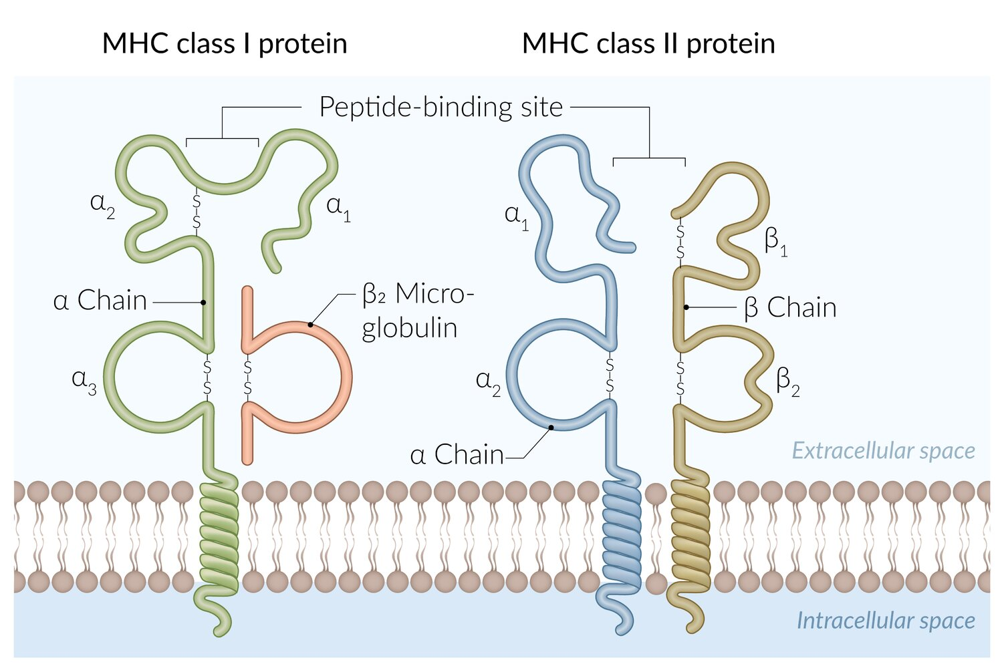
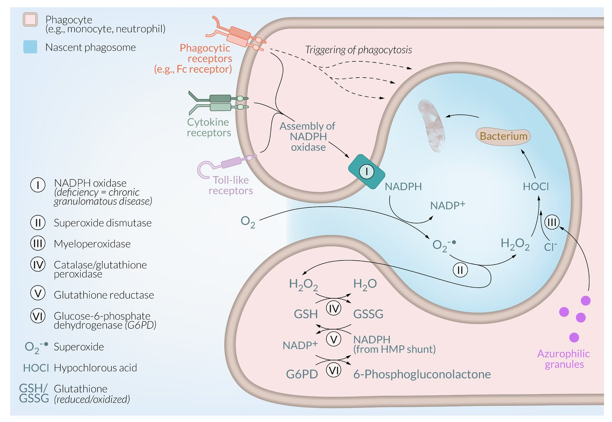
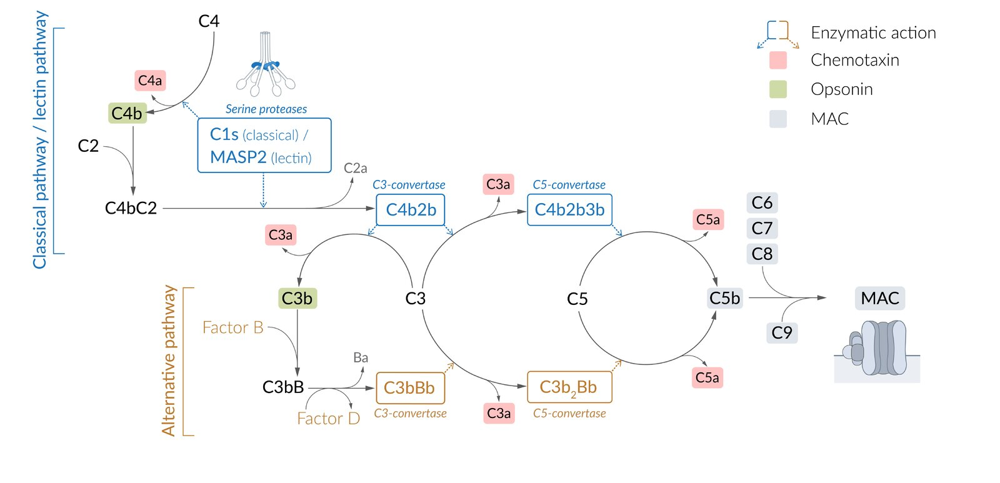
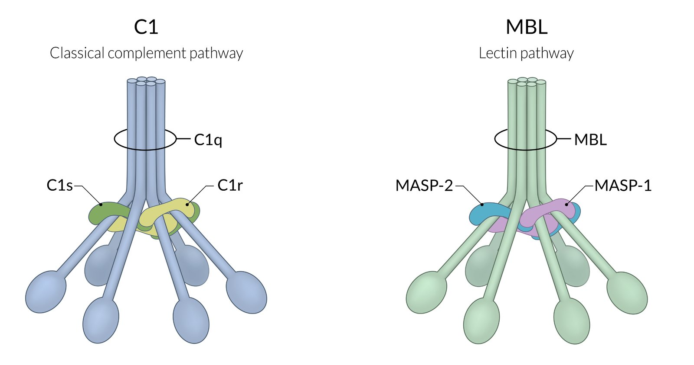
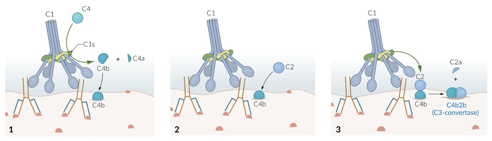
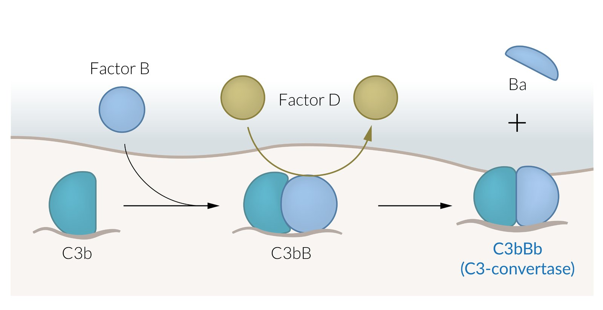
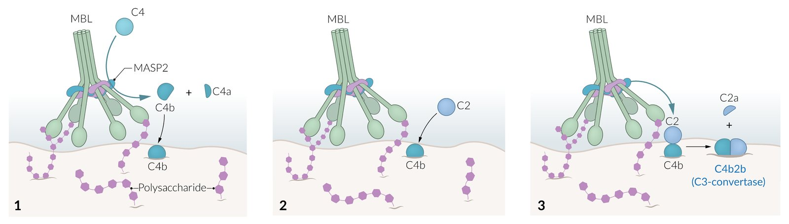

# Innate immune system

*Categories: Clinical knowledge > Internal medicine > Infectious diseases > Basics of infectious diseases > Innate immune system*

[Original Article Link](https://coursology-qbank.com/amboss/article/1K022S)

---

## Summary

The innate <u>immune system</u> provides an immediate, nonspecific first line of defense against pathogens. It operates based on inherited cellular <u>receptors</u> that respond to broad <u>pathogen</u>-related patterns and common threat signals. The innate <u>immune system</u> develops in utero and, unlike the adaptive (acquired) <u>immune system</u>, does not require <u>imprinting</u> or adaptation to specific <u>antigens</u> nor does it provide permanent <u>pathogen</u>-specific <u>immunity</u>. For this reason, it is also referred to as “nonspecific <u>immunity</u>.” Response to pathogens is rapid, occurring within minutes to hours of exposure. The innate <u>immune system</u> comprises physical, chemical, and biological barriers (e.g., the <u>skin</u>, <u>gastric acid</u>, <u>commensal organisms</u>) and both cellular (e.g., <u>granulocytes</u>, <u>natural killer cells</u>, <u>mast cells</u>) and <u>humoral</u> (<u>complement system</u>) <u>defense mechanisms</u>.

Innate and Adaptive Immunity: Types of Immune Responses (Full version)

---

## Overview

### General

* The innate <u>immune system</u> comprises the following host defense mechanisms:

* <u>Immune cells</u> (<u>granulocytes</u>, <u>natural killer cells</u>, <u>mast cells</u>)

* Physical and biochemical barriers

* <u>Humoral</u> defenses (e.g., <u>complement</u>)

* Develops in utero: does not require <u>imprinting</u> or adaptation to specific <u>antigens</u>

* Response to pathogens is rapid but nonspecific

### <u>Immune cells</u>

* <u>Granulocytes</u>

* <u>Neutrophils</u>

* <u>Eosinophils</u>

* <u>Basophils</u>

* <u>Natural killer cells</u>

* <u>Mast cells</u>

* <u>Antigen-presenting cells</u> (<u>APCs</u>)

* <u>Mononuclear phagocyte system</u>

* <u>Monocytes</u>

* <u>Macrophages</u>

* <u>Dendritic cells</u>

### <u>Host barriers to infection</u>

* Physical barriers (e.g., <u>skin</u> and <u>mucous membranes</u>)

* Biochemical barriers (e.g., body secretions, exocytosis of cytotoxic molecules and <u>proteins</u>)

### <u>Humoral</u> defenses

* <u>Acute phase proteins</u>

* <u>Complement system</u>

* See “<u>Humoral mechanisms</u>” below.

---

## Innate vs. adaptive immunity

| Key features of innate and adaptive immune systems |  |  |
| --- | --- | --- |
|  | Innate <u>immune system</u> | <u>Adaptive immune system</u> |
| Key components |   * Physical barriers: <u>epithelium</u> (e.g., <u>skin</u>, <u>mucous membranes</u>)  * Secreted effector <u>proteins</u> and <u>complement</u>  * Cells  * <u>Antigen-presenting cells</u>  * <u>Natural killer cells</u>  * <u>Granulocytes</u>    |   * <u>B cells</u>  * <u>T cells</u>  * <u>Immunoglobulins</u>    |
| Genetics |   * <u>Germline</u> encoded  * Does not change over the course of a lifetime    |  * Encoded as <u>V(D)J recombination</u> and hypervariation   |
| Inheritance |  * Inherited   |  * Not inherited   |
| Response time |  * Fast: within minutes to hours   |  * Slower (longer lag between <u>antigen</u> exposure and full effect)   |
| <u>Specificity</u> |  * Nonspecific   |  * Highly specific, constant expansion over time   |
| <u>Memory response</u> |  * Absent   |   * Present  * <u>Memory response</u> becomes more potent and faster after subsequent exposures to an <u>antigen</u>.    |
| Effector <u>proteins</u> |   * <u>Lysozyme</u>  * <u>Defensins</u>  * <u>Cytokines</u>  * <u>Complement</u>  * <u>CRP</u>    |   * Five types of <u>immunoglobulin</u> (<u>IgA</u>, <u>IgM</u>, <u>IgG</u>, <u>IgD</u>, and <u>IgE</u>)  * Bridge the innate and <u>adaptive immune responses</u> (particularly <u>IgA</u>)    |
| Recognition |  * <u>PRRs</u> (<u>pattern recognition receptors</u>)   |  * Activated <u>B cells</u> and <u>memory T cells</u> can recognize specific <u>antigens</u> on pathogens.   |

---

## Physical barriers

* <u>Coughing</u> and sneezing (reflex)

* Irritation of <u>receptors</u> in nose, sinuses, and lower and upper <u>airways</u> triggers <u>coughing</u> and/or sneezing.

* Protective mechanisms that serve to remove irritants (e.g., dust) and pathogens through expulsion of air and mucus from the <u>lungs</u> and nasal cavity

* Intact <u>skin</u> and <u>mucous membranes</u> (e.g., respiratory tract, genitourinary system, digestive tract)

* <u>Tight junctions</u> between <u>epithelial</u> cells

* Ciliary function of <u>ciliated epithelium</u> in the respiratory tract

* <u>Symbiosis</u> with microorganisms: imbalances can lead to various diseases (e.g., <u>oral thrush</u>, <u>bacterial vaginosis</u>, <u>pseudomembranous colitis</u>)

* <u>Mucosa-associated lymphoid tissue</u> (<u>MALT</u>)

* Found in various <u>submucosal</u> membrane sites of the body (e.g., <u>gastrointestinal tract</u>, <u>nasopharynx</u>, <u>lung</u>, <u>skin</u>, and <u>conjunctiva</u>)

* Populated by <u>lymphocytes</u>, <u>plasma cells</u>, and <u>macrophages</u> protecting the body from invasion

* Gut-associated lymphoid tissue (GALT): lymphoid follicles and <u>Peyer patches</u> embedded in the walls of the gut

* <u>Inducible bronchus-associated lymphoid tissue</u> (<u>iBALT</u>): lymphoid follicles embedded in the walls of the <u>lungs</u> and <u>bronchus</u>; appears only after infection or inflammation

---

## Biochemical barriers

* Production of mucus and body secretions: Mucus and body secretions contain nonspecific and specific protective substances against infections.

* Enzymes

* Lysozyme: enzyme formed from <u>neutrophils</u>, <u>granulocytes</u>, and <u>macrophages</u> that can lyse bonds in <u>peptidoglycans</u> (e.g., <u>cell walls</u> of certain, especially <u>gram‑positive</u>, bacteria)

* Lactoferrin

* Has enzyme activity (e.g., <u>protease</u>, ATPase, <u>phosphatase</u>) [[1]](https://coursology-qbank.com/amboss/article/K8XUn-)

* Contained in <u>neutrophils</u> and secretory fluids

* <u>Iron</u> chelation → suppression of microbial growth

* Acid <u>hydrolases</u>

* RNases

* <u>Peptides</u>: <u>defensins</u>

* Acids: <u>gastric acid</u> and vaginal flora with acidic <u>pH</u>

* Exocytosis of cytotoxic molecules and <u>proteins</u>

* Major basic protein: a protein secreted by <u>eosinophils</u> that is involved in host defense (especially against <u>parasites</u>)

* Produced by <u>eosinophils</u> in response to <u>antibody</u>-dependent processes (e.g., <u>IgE</u>, <u>antibody</u>-dependent cell-mediated cytotoxicity)

* Recognition of <u>IgE</u>-coated pathogens by <u>Fc receptor-bearing</u> <u>granulocytes</u> (<u>eosinophils</u>) → release of <u>major basic protein</u> → destruction of <u>pathogen</u> (e.g., <u>helminths</u>)

* Toxic products of <u>respiratory burst</u>

* Superoxide (O2‑)

* Hypochlorite (HOCl)

* <u>Hydrogen peroxide</u>

* Hydroxyl radicals

* <u>Nitric oxide</u> (NO)

* See also “<u>Respiratory burst</u>” below.

---

## Cellular mechanisms

### <u>HLA system</u>

* The human leukocyte antigen (<u>HLA</u>) is a <u>gene</u> complex that encodes the major histocompatibility complex (<u>MHC</u>) <u>proteins</u>.

* <u>MHC</u> <u>proteins</u> play a vital role in initiating <u>immune responses</u> as they present <u>antigen</u> fragments to <u>T cells</u> and bind <u>T-cell receptors</u>.

* During their maturation process in the <u>thymus gland</u>, <u>T cells</u> (<u>T lymphocytes</u>) that recognize self-derived <u>peptides</u> (including <u>peptides</u> derived from self-<u>MHC</u> molecules) are selected and undergo <u>apoptosis</u> to prevent <u>autoimmunity</u>.

| Overview of <u>MHC</u> molecules |  |  |
| --- | --- | --- |
|  |  MHC class I (<u>MHC I</u>)  |  MHC class II (<u>MHC II</u>) |
| <u>Loci</u> |   * HLA‑A  * HLA‑B  * HLA‑C    |   * HLA‑DP  * HLA‑DQ  * HLA-DR    |
| Structure |  * Two <u>polypeptide</u> chains of different length    * Long-chain contains the alpha domains (α1, α2, α3).  * Short-chain (β2-microglobulin, <u>B2M</u>) contains the β2 domain.   |   * Two <u>polypeptide</u> chains of equal length (α and β) * Invariant chain: involved in the formation of the <u>peptide</u>-binding groove of <u>MHC class II</u> molecules and in the subsequent export of <u>MHC class II</u> molecules from the <u>endoplasmic reticulum</u>  * Each contain two domains (α1, α2 and β1, β2)    |
| Expression |   * Surface of all nucleated cells, <u>platelets</u>, and <u>APCs</u>  * Not expressed on <u>RBCs</u>    |  * Surface of <u>APCs</u> (e.g., <u>dendritic cells</u>, <u>monocytes</u>/<u>macrophages</u>, <u>B lymphocytes</u>)   |
| Function |  * Intracellular pathway: Presentation of intracellular <u>antigens</u> to <u>CD8+ T cells</u> → cytotoxic T‑cell reaction → destruction of cells that are infected with intracellular pathogens (<u>endogenous</u>, e.g., <u>viruses</u>) and/or produce atypical <u>proteins</u> (e.g., malignant cells).   |  * Extracellular pathway: Presentation of extracellular <u>antigens</u> (<u>exogenous</u>, e.g., bacterial <u>proteins</u>) to <u>CD4+</u> <u>helper T cells</u> → activation of <u>CD4+ T cells</u> → activation of <u>B lymphocytes</u>.   |
| <u>Antigen</u> presentation |   * <u>Endogenous</u> <u>antigens</u> (e.g., viral and <u>cytosolic</u> <u>proteins</u>) are broken down by <u>proteasomes</u>.  * <u>Antigens</u> (<u>peptides</u>, lipids, or <u>polysaccharides</u>) are transported to the <u>RER</u> via <u>transporters associated with antigen processing</u> (TAPs).  * <u>MHC I</u>-<u>antigen</u> complexes are assembled in the <u>RER</u>.  * Polymorphic zone: has a cleft/groove for presentation of <u>antigens</u> derived from within <u>the cell</u>  * Nonpolymorphic zone: binds <u>CD8+ T lymphocytes</u>  * Cross-presentation of extracellular <u>antigens</u>: <u>APCs</u> (e.g., <u>dendritic cells</u>) present extracellular <u>antigens</u> together with <u>MHC I</u> molecules to <u>CD8+ T cells</u> → activation of <u>CD8+ T cells</u>.  [[2]](https://coursology-qbank.com/amboss/article/nHY7Iq)  * Several <u>viruses</u> prevent the expression of <u>MHC I</u> on <u>the cell</u> surface (e.g., <u>herpes simplex virus</u>). [[2]](https://coursology-qbank.com/amboss/article/nHY7Iq)  * Absence of <u>MHC class I</u> <u>receptors</u> on infected or malignant cells is recognized by <u>natural killer cells</u> (<u>NK cells</u>).    |  * <u>APCs</u> ingest <u>exogenous</u> material (e.g., bacterial <u>proteins</u>) via <u>phagocytosis</u> → <u>protein degradation</u> in the <u>lysosome</u> → assembly of <u>MHC II</u>-<u>antigen</u> complexes in acidified endosomes after the release of the <u>invariant chain</u> → presentation of the <u>MHC II</u>-<u>antigen</u> complex on <u>the cell</u> surface   |
| HLA and disease association |   * A3: <u>hemochromatosis</u>  * B8  * <u>Addison disease</u>  * <u>Myasthenia gravis</u>  * <u>Graves disease</u>  * B27  * <u>Psoriatic arthritis</u>  * <u>Ankylosing spondylitis</u>  * <u>IBD</u>-associated <u>arthritis</u>  * <u>Reactive arthritis</u>  * C: <u>psoriasis</u>    |   * DQ2/DQ8: <u>celiac disease</u>  * DR2  * <u>Multiple sclerosis</u>  * <u>Systemic lupus erythematosus</u>  * <u>Goodpasture syndrome</u>  * <u>Hay fever</u>  * DR3  * <u>Diabetes mellitus type 1</u>  * <u>Systemic lupus erythematosus</u>  * <u>Graves disease</u>  * <u>Hashimoto thyroiditis</u>  * <u>Addison disease</u>  * DR4  * <u>Rheumatoid arthritis</u>  * <u>Diabetes mellitus type 1</u>  * <u>Addison disease</u>  * DR5: <u>Hashimoto thyroiditis</u>  * DR7: <u>steroid</u>-responsive <u>nephrotic syndrome</u>    |
|  * Bare lymphocyte syndrome  * A <u>congenital immunodeficiency</u> disorder characterized by deficiencies in <u>major histocompatibility complex</u> I or II, which are usually expressed on <u>lymphocytes</u>  * Typically results in recurrent respiratory, gastrointestinal, and <u>urinary tract infections</u>   |  |  |

Structure of MHC molecules

> [!NOTE]
> <u>MHC I</u>-associated <u>loci</u> (<u>HLA</u>-A/-B/-C) only have 1 letter after the hyphen, while <u>MHC</u> II-associated <u>loci</u> (<u>HLA</u>‑DR/‑DP/‑DQ) have 2 letters.
> <u>HLA</u> A3: Fe3+ is increased in HE3mochromatosis.
> <u>HLA</u> B8: If you go fishing for <u>HLA</u>, use MAGgots (Myasthenia gravis, Addison disease, Graves disease) for b8 (bait).
> <u>HLA</u> B27: They are Both 27 and a PAIR (Psoriatic <u>arthritis</u>, Ankylosing <u>spondylitis</u>, IBD-associated <u>arthritis</u>, Reactive <u>arthritis</u>).
> <u>HLA</u> C: <u>Psoriasis</u> is a Cutaneous Condition.

> [!NOTE]
> <u>HLA DQ2</u>/DQ8: I 8 2 (ate too) much <u>gluten</u> at Dairy Queen.
> <u>HLA</u> DR2: At DooR 2, they sell multiple good hay products (<u>SLE</u>, Multiple <u>sclerosis</u>, Goodpasture syndrome, hay <u>fever</u>).
> <u>HLA</u> DR2/<u>DR3</u>: 2, 3, S-L-E.
> <u>HLA</u> <u>DR3</u>/DR4: 3,4 – sugar no more (DM type 1).
> <u>HLA</u> DR4: 4 walls make 1 “rheum” (room).
> <u>HLA</u> <u>DR3</u>/DR5: DR. Hashimoto is odd (odd numbers: 3, 5).

### Pattern recognition receptors (<u>PRRs</u>)

* Definition: <u>receptors</u> on the surface of cells of the innate <u>immune system</u> that recognize <u>pathogen</u>-related molecules and activate an <u>immune response</u>

* Recognized molecules

* Pathogen-associated molecular patterns: a group of molecules expressed by pathogens that are recognized by <u>PRRs</u> as foreign to the host

* Viral <u>nucleic acids</u>

* <u>LPS</u> of <u>gram-negative bacteria</u>

* Bacterial flagellin

* Damage-associated molecular patterns (<u>DAMPs</u>): <u>endogenous</u> molecules that are released from damaged host cells and trigger a noninfectious inflammatory response

* Types of <u>PRRs</u>

* Toll-like receptors (TLRs): <u>pattern recognition receptors</u> that bind to <u>pathogen</u>-associated molecular patterns (<u>PAMPs</u>) and activate the <u>NF-κB</u> pathway

* Nucleotide-binding oligomerization domain-like receptors (<u>NLRs</u>): a family of intracellular <u>PRR</u> that can recognize both <u>pathogen-associated molecular patterns</u> (<u>PAMPs</u>) and <u>damage-associated molecular patterns</u> (<u>DAMPs</u>)

* Play a crucial role in innate immune signaling: activation of <u>NOD-like receptors</u> → upregulation of NF-κB → ↑ <u>transcription</u> of <u>proinflammatory cytokines</u> (e.g., IL-1β, IL-18).

* Defects in NOD2 <u>receptor</u> activity alter <u>NF-κB</u> activity, leading to a dysfunctional innate <u>immune response</u> and have been linked to <u>Crohn disease</u>, <u>sarcoidosis</u>, and <u>graft-versus-host disease</u>.

### Respiratory burst (<u>oxidative burst</u>)

* Description 

* <u>Phagocytes</u> (e.g., <u>neutrophils</u>, <u>monocytes</u>) ingest pathogens

* Activation of the <u>NADPH oxidase</u> complex generates and releases ; reactive oxygen species (<u>ROS</u>; <u>free radicals</u>) that destroy the pathogens in <u>phagosomes</u>

* Mechanism

* NADPH oxidase complex 

* Can generate oxygen radicals (•O2–) from O2, but also to neutralize them

* Defective <u>NADPH oxidase</u> leads to <u>chronic granulomatous disease</u>.

* Superoxide dismutase: generates <u>hydrogen peroxide</u> (<u>H2O2</u>) from •O2–

* Myeloperoxidase: an enzyme in <u>neutrophil granulocytes</u>

* Generates hydroxyl-halide radicals (HCl•O) from <u>H2O2</u> and <u>Cl-</u>

* Contains <u>heme</u> pigment responsible for the occasionally blue-green color of <u>pus</u> and <u>sputum</u>

* Release of <u>oxidative burst</u> causes <u>K+</u> influx, which triggers secretion of <u>lysosomal</u> enzymes into the <u>phagosome</u>.

* Clinical significance

* <u>Respiratory burst</u> is a vital component of innate <u>immune response</u>

* Impaired <u>respiratory burst</u> leads to an elevated risk of infection with <u>catalase-positive</u> pathogens (e.g., <u>Aspergillus</u>, <u>S. aureus</u>).

* Normally, <u>phagocytes</u> can transform <u>H2O2</u> generated by invading pathogens into <u>ROS</u>.

* <u>Catalase-positive</u> organisms can degrade their own <u>H2O2</u>, leaving <u>phagocytes</u> without substrate to convert.

* <u>P. aeruginosa</u> uses <u>pyocyanin</u>;   to form <u>ROS</u> and eliminate competing organisms.

> [!NOTE]
> <u>Catalase-positive organisms</u> can degrade <u>H2O2</u> into H2O and O2 and prevent the formation of hydroxyl-halide radicals.

Respiratory (oxidative) burst

### Immune privilege

* The ability of certain tissues or organs to tolerate foreign-tissue grafts without eliciting an inflammatory <u>immune response</u>

* <u>Allografts</u> (and their <u>antigens</u>) placed in an immune-privileged site are not rejected.

* Examples include the <u>cornea</u>, <u>CNS</u>, <u>placenta</u>, and <u>testis</u>

---

## Humoral mechanisms

The <u>humoral mechanisms</u> of innate <u>immunity</u> are mediated by <u>proteins</u> that are secreted into bodily fluids or the bloodstream. These <u>proteins</u> often initiate <u>immune responses</u> via:

* <u>Vasodilation</u> and increasing vascular permeability → ↑ blood flow

* Activation, <u>proliferation</u>, and attraction (<u>chemotaxis</u>) of <u>immune cells</u>

### <u>Acute phase proteins</u>

* Set of biomarkers whose plasma concentration increases (positive markers, e.g., <u>CRP</u>) or decreases (negative markers, e.g., <u>transferrin</u>) in response to an ongoing inflammatory process.

* See “<u>Acute phase reaction</u>.”

### Complement system

* Group of <u>plasma proteins</u> (e.g., C1, C2, C3)

* Synthesized in the <u>liver</u> as inactive precursors

* Activation (e.g., via <u>immunoglobulins</u>, enzymes) triggers an amplifying cascade of reactions that leads to inflammation, activation of <u>membrane attack complex</u> (<u>MAC</u>), and enhanced <u>phagocytosis</u> of pathogens and foreign material.

* Both <u>decay-accelerating factor</u> (<u>DAF</u>, aka <u>CD55</u>) and C1 esterase inhibitor prevent <u>complement</u> activation.

#### Activation pathways

* Classical pathway  

* Activated by <u>IgM</u> or <u>IgG</u> complexes binding to the <u>pathogen</u>

* C1q, C1r, and C1s activation → C1 complex → split of C4 into C4a and C4b and C2 into C2a and C2b → formation of <u>C3 convertase</u> (C4b2b) from C4b and C2b

* Activation of this pathway can be assessed via the <u>total complement activity</u> test (also called <u>CH50</u> test).

* Alternative pathway

* Activated directly by <u>pathogen</u> surface molecules rather than by <u>antigen</u>-<u>antibody</u> complexes

* C3 is split into <u>C3a</u> and C3b → binding of <u>factor B</u> → formation of <u>C3 convertase</u> (C3bBb).

* Lectin pathway  

* Activated by <u>mannose</u> or other sugars on <u>pathogen</u> surface

* <u>Mannose-binding lectin</u> (<u>MBL</u>) binds to <u>mannose</u> → formation of the C1-like complex, which cleaves C4 into C4a and C4b → C4b binding C2 and splitting of C2 into C2a and C2b → formation of <u>C3 convertase</u> (C4b2b).

* Common end phase

* <u>C3-convertase</u> (C4b2b or C3bBb) cleaves complement component 3 (C3) to factor C3a (chemotaxin) → creation of C5-convertase (C4b2b3b or C3b2Bb), which can cleave factor C5.

* C5a acts as <u>anaphylatoxin</u>, while C5b binds factors C6–9 to form the <u>membrane attack complex</u> (<u>MAC</u>), which induces the lysis of the <u>target cell</u>.

* Anaphylatoxins are fragments of <u>complement proteins</u> (e.g., <u>C3a</u>, C4a, C5A) that cause proinflammatory responses (e.g., <u>cytokine</u> release, <u>neutrophil</u> and <u>macrophage</u> activation, <u>platelet activation</u>).

The complement cascade

Initiator molecules of the classical (C1) and the lectin complement pathway (MBL)

Classical pathway of the complement system

Alternative pathway of the complement system

Lectin pathway of the complement system

> [!NOTE]
> IgG and IgM activate the classic pathway: General Motors (GM) makes classic cars.

#### Effect

* Opsonization

* Increases the susceptibility of target particles (e.g., bacteria) to <u>phagocytosis</u>

* Attachment of opsonins (e.g., <u>immunoglobulins</u>) causes structural changes that facilitate interaction with <u>immune cells</u>.

* C3b and <u>IgG</u> are the two main opsonins for bacteria

* C3b is also involved in eliminating <u>immune complexes</u>.

* Membrane attack complex (<u>MAC</u>)

* Formed by C5b–C9

* Lysis of bacteria (especially <u>gram‑negative</u> bacteria) by perforation of <u>the cell</u> wall

* <u>Anaphylaxis</u>: activation of <u>mast cells</u> and <u>granulocytes</u> via <u>C3a</u>/C4a/<u>C5a</u>

* <u>Chemotaxis</u>: attraction of <u>neutrophils</u> via <u>C5a</u>

> [!NOTE]
> C3b binds to bacteria.

> [!NOTE]
> C3a, C4a, C5a lead to mast-cell activation and anaphylaxis.

#### <u>Complement receptors</u> [[3]](https://coursology-qbank.com/amboss/article/mJaVul)[[4]](https://coursology-qbank.com/amboss/article/qp0CqS)

* Membrane-bound <u>receptors</u> that bind <u>complement protein</u> fragments produced in the plasma during an <u>acute inflammatory response</u>

* Activation contributes to inflammation regulation, <u>leukocyte extravasation</u>, and <u>phagocytosis</u>

| Overview of complement receptors |  |  |  |  |
| --- | --- | --- | --- | --- |
| <u>Receptor</u> | Major <u>ligands</u> | CD number | Cell types | Function |
|  <u>Complement receptor</u> type 1 (CR1) |   * C3b  * C4b    |  * CD35   |   * <u>Erythrocytes</u>  * <u>Polymorphonuclear leukocytes</u> (<u>PMNs</u>)  * <u>B cells</u>  * <u>Follicular dendritic cells</u> (<u>FDCs</u>)  * <u>Monocytes</u>/<u>macrophages</u>    |   * <u>Immune complex</u> transport and clearance  * Promotes cleavage of <u>cofactors</u> C3b and C4b (blocks formation of <u>C3 convertase</u>)  * Promotes <u>phagocytosis</u>  * <u>Plasmodium falciparum</u> <u>receptor</u>    |
|  <u>Complement receptor type 2</u> (CR2) |   * <u>iC3b</u>  * C3d/<u>EBV</u>  * C3dg    |  * <u>CD21</u>   |   * <u>B cells</u>  * <u>FDCs</u>  * <u>Epithelial</u> cells of upper <u>airways</u>    |   * <u>B cell activation</u>  * <u>EBV receptor</u>    |
|  <u>Complement receptor</u> type 3 (CR3) |  * <u>iC3b</u>   |  * CD11b/CD18   |   * <u>Monocytes</u>/<u>macrophages</u>  * <u>PMNs</u>  * <u>Dendritic cells</u>    |   * Promotes <u>phagocytosis</u> of <u>iC3b</u>-coated molecules  * <u>Leukocyte adherence</u>  * CR3 deficiency results in <u>leukocyte adhesion deficiency type 1</u>    |
|  <u>Complement receptor</u> type 4 (CR4) |  * CD11c/CD18   |   * Promotes <u>phagocytosis</u> of <u>iC3b</u>-coated molecules  * <u>Leukocyte adherence</u>  * <u>Neutrophil</u> and <u>monocyte</u> adherence    |  |  |
| <u>C3a</u> <u>receptor</u> |  * <u>C3a</u>   |  * –   |   * <u>Neutrophils</u>, <u>eosinophils</u>, <u>basophils</u>  * <u>Mast cells</u> and <u>monocytes</u>/<u>macrophages</u>  * <u>Astrocytes</u>, <u>neurons</u>, <u>glial cells</u>    |   * Activates <u>G protein</u> by binding <u>C3a</u>  * <u>Leukocyte</u> chemoattraction and <u>degranulation</u>  * Generation of cytotoxic oxygen radicals    |
| <u>C5a</u> <u>receptor</u> |  * <u>C5a</u>   |  * CD88   |   * <u>Neutrophils</u>, <u>eosinophils</u>, <u>basophils</u>  * <u>Mast cells</u> and <u>monocytes</u>/<u>macrophages</u>  * <u>T cells</u>  * <u>Dendritic cells</u>, <u>glial cells</u>  * <u>Endothelial</u>, <u>epithelial</u>, and blood vessel <u>smooth muscle cells</u>    |   * Activates <u>G protein</u> by binding <u>C5a</u>  * <u>Leukocyte</u> chemoattraction and <u>degranulation</u>  * Generation of cytotoxic oxygen radicals  * <u>Receptor</u> binding of <u>C5a</u> may play a role in organ damage in <u>sepsis</u>    |

---

## Defects of innate immunity

|  Overview of innate immune defects [[5]](https://coursology-qbank.com/amboss/article/w0XhR9)[[6]](https://coursology-qbank.com/amboss/article/90XNR9)  |  |  |
| --- | --- | --- |
| Defective element/<u>complement</u> | Associated conditions | Increased susceptibility to |
| <u>Granulocytes</u> |   * <u>Chronic granulomatous disease</u>  * <u>Chemotherapy</u>  * <u>Fanconi anemia</u> [[7]](https://coursology-qbank.com/amboss/article/LHYwIq)    |   * Recurrent, severe infections with <u>pyogenic</u> <u>catalase-positive</u> bacteria (e.g., <u>S. aureus</u>, <u>Pseudomonas</u>)  * <u>Fungal infections</u>: especially <u>Candida</u>, <u>Aspergillus</u>    |
|  * <u>Leukocyte adhesion deficiency type 1</u>   |  * Recurrent nonsuppurative bacterial infections of <u>skin</u> and <u>mucosa</u>   |  |
|  * <u>Severe congenital neutropenia</u>   |  * Recurrent bacterial (especially <u>Streptococcus</u> and <u>Staphylococcus</u>) infections (e.g., <u>gingivitis</u>, <u>otitis media</u>, respiratory infections, <u>cellulitis</u>)   |  |
| <u>Phagosomes</u> |  * <u>Chediak-Higashi syndrome</u>   |  * Recurrent bacterial infections: especially with <u>pyogenic</u> <u>gram-positive bacteria</u> (<u>S. pyogenes</u>, <u>S. aureus</u>, and <u>Pseudomonas</u>)   |
|  * <u>Myeloperoxidase deficiency</u>   |  * Recurrent <u>Candida</u> infections (e.g., <u>oral thrush</u>, <u>vulvovaginitis</u>)   |  |
| <u>Complement</u> |   * <u>C3 deficiency</u>  * <u>Terminal complement deficiency</u>    |  * Recurrent, severe infections with <u>encapsulated bacteria</u>, especially <u>Pneumococcus</u> and <u>Meningococcus</u>   |

---