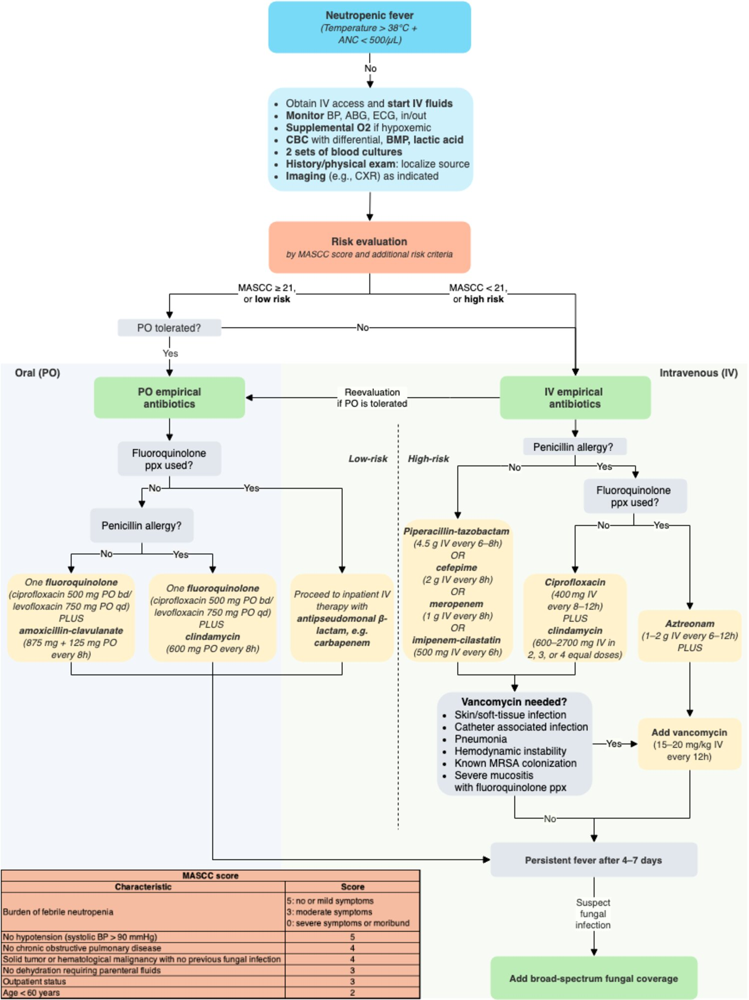

# Neutropenic fever

*Categories: Clinical knowledge > Internal medicine > Infectious diseases > Fever and sepsis > Neutropenic fever*

[Original Article Link](https://coursology-qbank.com/amboss/article/KJ0UES)

---

## Summary

<u>Neutropenic</u> <u>fever</u> is an <u>oncologic emergency</u> common in patients receiving <u>chemotherapy</u>. A decrease in a patient's <u>absolute neutrophil count</u> (<u>ANC</u>) can lead to potentially life-threatening infections, and the risk of serious infection is directly associated with the extent and duration of <u>neutropenia</u>. Because the <u>immune response</u> is impaired in <u>neutropenia</u>, symptoms can be mild and even a low-grade temperature (38°C) should be considered a <u>fever</u>. Initial workup should consist of peripheral and, if applicable, <u>central line</u> <u>blood cultures</u>; further investigation is guided by localization of clinical signs. <u>Empiric antibiotic therapy</u> should be started within the first hour of onset to minimize mortality risk. Treatment should be adjusted as soon as further findings are available.

See also “<u>Fever</u>.”

---

## Definition

* <u>Neutropenia</u>: <u>ANC</u> 1,000–1,500 /mm³  [[2]](https://coursology-qbank.com/amboss/article/0qYeCJ)

* Severe <u>neutropenia</u>: <u>ANC</u> < 500/mm³ OR expected to decrease to < 500/mm³ within 48 hours  [[3]](https://coursology-qbank.com/amboss/article/0Q1eug0)[[4]](https://coursology-qbank.com/amboss/article/1f12OT0)

* <u>Neutropenic</u> <u>fever</u>: temperature ≥ 38.0°C (≥ 100.4°F) for ≥ 1 hour or ≥ 38.3°C (≥ 101°F) once in a patient with <u>ANC</u> < 500/mm³ (or expected to decrease to < 500/mm³ within 48 hours)  [[2]](https://coursology-qbank.com/amboss/article/0qYeCJ)[[3]](https://coursology-qbank.com/amboss/article/0Q1eug0)[[4]](https://coursology-qbank.com/amboss/article/1f12OT0)[[5]](https://coursology-qbank.com/amboss/article/0A0eRi)

---

## Management

### Approach   [[2]](https://coursology-qbank.com/amboss/article/0qYeCJ)[[5]](https://coursology-qbank.com/amboss/article/0A0eRi)

* All patients

* Start <u>neutropenia precautions</u> upon clinical evaluation.

* <u>Risk stratify patients with neutropenic fever</u>, e.g., using the <u>MASCC score</u>.  [[2]](https://coursology-qbank.com/amboss/article/0qYeCJ)

* <u>Establish IV access</u> and obtain <u>blood cultures</u> and routine diagnostic studies: See “Diagnostics.”

* Start <u>empiric antibiotic therapy for neutropenic fever</u> as soon as two sets of <u>blood cultures</u> have been obtained.  [[6]](https://coursology-qbank.com/amboss/article/PDcWee0)

* Consult the patient's oncologist and, when appropriate, infectious disease specialists.

* Provide <u>supportive care</u>, e.g., <u>IV fluids</u>, <u>antipyretics</u>, <u>pain management</u>, <u>antiemetics</u>

* High-risk patients

* Admit to the hospital for treatment.

* Consider <u>ICU</u> <u>level of care</u> for patients who are <u>hemodynamically unstable</u> or need <u>sepsis management</u>.

* Give broad-spectrum IV <u>antibiotics</u> to avoid <u>sepsis</u> and life-threatening complications.

* Consider narrowing <u>antibiotics</u> once the patient is clinically stable and a source of infection has been determined.

* Consider the need for empiric fungal therapy for <u>neutropenic</u> <u>fever</u>.

* If <u>fever</u> persists after 4–7 days, reassess for fungal or viral infection and adapt treatment accordingly.

* Low-risk patients: Consider outpatient oral <u>antibiotics</u> if oral intake is tolerated and there is adequate access to a caregiver, telephone, and transportation (see “<u>Outpatient therapy for neutropenic fever</u>” for details).

> [!TIP]
> Plan treatment for <u>neutropenic</u> <u>fever</u> in consultation with the patient's oncologist.

> [!WARNING]
> <u>Neutropenic</u> <u>fever</u> is an emergency! Mortality risk increases if no <u>empiric antibiotic therapy</u> has been initiated after one hour.

Management of neutropenic fever

### Risk <u>stratification</u>

* There are several methods of assessing risk of mortality in patients with <u>neutropenic</u> <u>fever</u>, including evaluating clinical <u>risk factors</u> and using a validated risk assessment tool.

* Risk assessment can help determine appropriate clinical therapy (e.g., high-risk patients should be treated as inpatients with IV <u>antibiotics</u>, while select low-risk patients may be considered for outpatient therapy).

#### Clinical risk assessment in patients with neutropenic fever [[5]](https://coursology-qbank.com/amboss/article/0A0eRi)

The presence of even one high-risk feature is enough to consider inpatient therapy.

* High-risk features

* Inpatient status at the time of <u>fever</u> onset

* Anticipated prolonged (> 7 days) <u>neutropenia</u>

* Profound (<u>ANC</u> < 100/mm³) <u>neutropenia</u>

* Clinical instability (e.g., <u>hypotension</u>, <u>altered mental status</u>)

* <u>Acute abdominal pain</u>, <u>nausea</u>/<u>vomiting</u>, and/or <u>diarrhea</u>

* New pulmonary infiltrate and/or <u>hypoxemia</u>

* <u>Intravascular catheter infection</u>

* Hepatic insufficiency

* <u>Renal insufficiency</u>

* Uncontrolled cancer

* <u>Induction chemotherapy</u> for <u>acute myelogenous leukemia</u> or in preparation for <u>allogeneic HCT</u>

* Presence of oral and/or gastrointestinal <u>mucositis</u>

* Underlying <u>chronic obstructive pulmonary disease</u>

* Poor functional status

* Advanced age

* <u>Alemtuzumab</u> use [[7]](https://coursology-qbank.com/amboss/article/rqYf-J)

* Low-risk features 

* Anticipated brief (≤ 7 days) <u>neutropenia</u>

* Clinical stability

* No hepatic or <u>renal insufficiency</u>

* No or few comorbidities

#### MASCC score  [[8]](https://coursology-qbank.com/amboss/article/zJYr9J)

A standardized and validated tool for evaluating risk in patients with <u>neutropenic</u> <u>fever</u>.

| Patient characteristics | Points |
| --- | --- |
|  Clinical burden of symptoms   |   * 5 = mild  * 3 = moderate  * 0 = severe    |
|  Absence of <u>hypotension</u>   |  * 5   |
|  Absence of <u>COPD</u>   |  * 4   |
|  Solid <u>tumor</u> or hematologic <u>malignancy</u> with no previous fungal infection   |  * 4   |
|  Absence of <u>severe dehydration</u>   |  * 3   |
| Patient status when <u>fever</u> occurred |   * 3 = outpatient  * 0 = inpatient    |
| Age < 60 years |  * 2   |
|  Interpretation   * <u>MASCC score</u> < 21: high risk of serious medical complications and <u>death</u>  * <u>MASCC score</u> ≥ 21: low risk of serious medical complications     |  |

> [!TIP]
> In general, any patient who does not strictly fulfill the criteria for being at low risk should be treated as a high-risk patient.

> [!TIP]
> For patients with solid tumors scored as low risk according to the <u>MASCC score</u>, consider additionally calculating the <u>clinical index of stable febrile neutropenia</u> score to determine the likelihood of complications if treated at home. [[2]](https://coursology-qbank.com/amboss/article/0qYeCJ)

MASCC Febrile Neutropenia Risk

### Outpatient therapy for neutropenic fever [[2]](https://coursology-qbank.com/amboss/article/0qYeCJ)[[5]](https://coursology-qbank.com/amboss/article/0A0eRi)[[9]](https://coursology-qbank.com/amboss/article/-JYD9J)

* Start <u>empiric antibiotic therapy for neutropenic fever</u> in low-risk patients.

* Give the first dose of <u>antibiotics</u> in a hospital or other monitored care setting.

* Observe the patient for at least 4 hours prior to discharge.

* Recommended follow-up

* At least 3 days of symptom monitoring with frequent in-person visits

* Daily temperature checks

* Blood tests: regular <u>ANC</u>, <u>platelet count</u>

* Tailor <u>antimicrobial therapy</u> to culture results.

* Advise returning for hospital admission if any of the following are present:

* <u>Fever</u> persisting despite 48–72 hours of <u>antibiotic therapy</u>

* Recurrence of <u>fever</u> after initial improvement

* New signs of infection

* IV <u>antibiotics</u> are needed.

---

## Antimicrobial therapy

See “<u>Management of neutropenic fever</u>” for a general approach.

### Empiric antibiotic therapy for neutropenic fever

<u>Antibiotics</u> are generally continued until an appropriate treatment course is completed (usually 7–14 days depending on site of infection) and the <u>ANC</u> is at least 500/mm³. [[5]](https://coursology-qbank.com/amboss/article/0A0eRi)

#### Low-risk patients (MASCC ≥ 21) [[2]](https://coursology-qbank.com/amboss/article/0qYeCJ)[[5]](https://coursology-qbank.com/amboss/article/0A0eRi)[[9]](https://coursology-qbank.com/amboss/article/-JYD9J)

|  | Recommended empiric oral <u>antibiotic</u> regimens |
| --- | --- |
| No <u>penicillin</u> <u>allergy</u> and not taking <u>fluoroquinolone</u> prophylaxis |   * One of the following <u>fluoroquinolones</u>  * <u>Ciprofloxacin</u> DOSAGE  * <u>Levofloxacin</u> DOSAGE  * PLUS <u>amoxicillin/clavulanate</u> DOSAGE    |
| <u>Penicillin</u> <u>allergy</u> and not taking <u>fluoroquinolone</u> prophylaxis |   * One of the following <u>fluoroquinolones</u>  * <u>Ciprofloxacin</u> DOSAGE  * <u>Levofloxacin</u> DOSAGE  * PLUS <u>clindamycin</u> DOSAGE    |
| Taking <u>fluoroquinolone</u> prophylaxis |  * No longer low-risk, proceed to high-risk recommendations.   |

#### High-risk patients (<u>MASCC score</u> < 21) [[2]](https://coursology-qbank.com/amboss/article/0qYeCJ)[[5]](https://coursology-qbank.com/amboss/article/0A0eRi)[[9]](https://coursology-qbank.com/amboss/article/-JYD9J)

> [!TIP]
> Monotherapy with an antipseudomonal <u>beta-lactam</u> (e.g., <u>piperacillin/tazobactam</u>, <u>cefepime</u>, <u>meropenem</u>, or <u>imipenem</u>) is recommended for patients without <u>penicillin</u> <u>allergy</u> or <u>risk factors</u> for other specific infections (e.g. <u>MRSA</u>, <u>VRE</u>, <u>ESBL</u> organisms).

| Recommended empiric IV <u>antibiotic</u> regimens |  |  |
| --- | --- | --- |
| No <u>penicillin</u> <u>allergy</u> |  |  * Monotherapy with one of the following antipseudomonal <u>beta-lactams</u>:   * <u>Piperacillin/tazobactam</u> DOSAGE  * <u>Cefepime</u> DOSAGE  * <u>Meropenem</u> DOSAGE  * <u>Imipenem</u> DOSAGE   |
| <u>Penicillin</u> <u>allergy</u>  and not taking <u>fluoroquinolone</u> prophylaxis |  |   * <u>Ciprofloxacin</u> DOSAGE  * PLUS <u>clindamycin</u> DOSAGE    |
| <u>Penicillin</u> <u>allergy</u>  and taking <u>fluoroquinolone</u> prophylaxis |  |   * <u>Aztreonam</u> DOSAGE  * PLUS <u>vancomycin</u> DOSAGE    |
|  Suspected necrotizing or intraabdominal infection  |  |  * Add anaerobic coverage, e.g., <u>metronidazole</u>. DOSAGE   |
|  <u>Risk factors for MRSA</u> and/or a complication associated with a high risk of <u>MRSA</u> infection  |  |  * Add <u>vancomycin</u> DOSAGE   |
| <u>Risk factors</u> for <u>VRE</u> |  |  * Add one of the following (instead of <u>vancomycin</u>):  * <u>Linezolid</u> DOSAGE  * <u>Daptomycin</u> DOSAGE   |
| <u>Risk factors</u> for <u>ESBL</u> |  |  * Use one of the following <u>carbapenems</u> (instead of <u>cephalosporin</u> or <u>penicillin</u>) :  * <u>Meropenem</u> DOSAGE  * <u>Imipenem</u> DOSAGE   |
| <u>Risk factors</u> for <u>CPE</u> |  |  * Add one of the following:  * <u>Polymyxin</u> B DOSAGE  [[10]](https://coursology-qbank.com/amboss/article/1wY23r)  * <u>Colistin</u> DOSAGE  * <u>Tigecycline</u> DOSAGE [[11]](https://coursology-qbank.com/amboss/article/AJYR9J)   |
|  <u>Risk factors</u> for a suspected infection include previous infection and <u>colonization</u> or treatment in a hospital with high rates of endemicity. |  |  |

> [!WARNING]
> Any <u>recurrent fever</u> should be considered a new episode of infection.

> [!WARNING]
> Only consider <u>fluoroquinolones</u> for treatment in patients not previously taking <u>fluoroquinolones</u> as prophylaxis. Treat patients who develop <u>neutropenic</u> <u>fever</u> while on <u>fluoroquinolone</u> prophylaxis as high-risk and start an antipseudomonal <u>beta-lactam</u>.

### Empiric antifungal therapy for neutropenic fever [[5]](https://coursology-qbank.com/amboss/article/0A0eRi)[[9]](https://coursology-qbank.com/amboss/article/-JYD9J)

* Low-risk patients: Empiric <u>antifungal</u> therapy is not routinely recommended.

* High-risk patients: Consider empiric <u>antifungal</u> therapy in the following situations.

* Persistent or <u>recurrent fever</u> after 4 days of intravenous <u>antibiotic therapy</u> and expected duration of <u>neutropenia</u> > 7 days

* Reassessment does not yield a cause.

* Clinically unstable and suspected fungal infection (e.g., positive <u>galactomannan</u>, 1,3-β-d-Glucan assay, and/or imaging concerning for invasive fungal infection)

* Options for empiric <u>antifungal</u> therapy regimens include any of the following:

* <u>Caspofungin</u> DOSAGE

* <u>Micafungin</u> DOSAGE

* <u>Anidulafungin</u> DOSAGE

* <u>Voriconazole</u> DOSAGE

* <u>Amphotericin B</u> DOSAGE

> [!TIP]
> Give patients who received <u>antifungal</u> prophylaxis a different <u>antifungal agent</u> effective against <u>molds</u> (e.g., from <u>voriconazole</u> to <u>amphotericin B</u>).

### Other therapeutic measures

* Empiric antiviral treatment: only recommended for patients with clinical or laboratory evidence of active viral disease and in patients with possible <u>influenza</u> exposure.

* <u>Leukocyte</u> growth factors: <u>G-CSF</u> (e.g., <u>filgrastim</u>, <u>pegfilgrastim</u>) or <u>GM-CSF</u> (e.g., <u>sargramostim</u>) [[5]](https://coursology-qbank.com/amboss/article/0A0eRi)[[12]](https://coursology-qbank.com/amboss/article/Rlcl9c0)

* Not routinely recommended  [[12]](https://coursology-qbank.com/amboss/article/Rlcl9c0)

* Consider for patients at high risk for complications.  [[12]](https://coursology-qbank.com/amboss/article/Rlcl9c0)

* See also “<u>Infection prevention in cancer therapy-induced neutropenia</u>.”

* Indications for indwelling catheter removal in patients with suspected <u>CLABSI</u> [[5]](https://coursology-qbank.com/amboss/article/0A0eRi)

* <u>Bacteremia</u> with <u>S. aureus</u>, <u>P. aeruginosa</u>, fungi, or <u>mycobacteria</u>

* Diagnosis of <u>septic</u> <u>thrombosis</u>

* Tunnel or port pocket site infection

* <u>Endocarditis</u>

* <u>Sepsis</u> with <u>hemodynamic instability</u>

* <u>Bloodstream infection</u> that persists despite > 72 hours of appropriate <u>antibiotic therapy</u>.

---