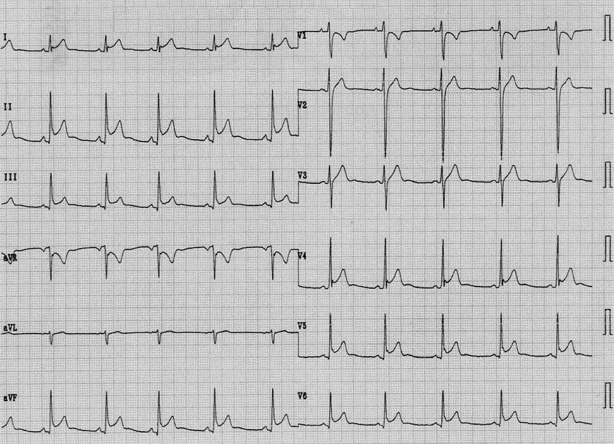
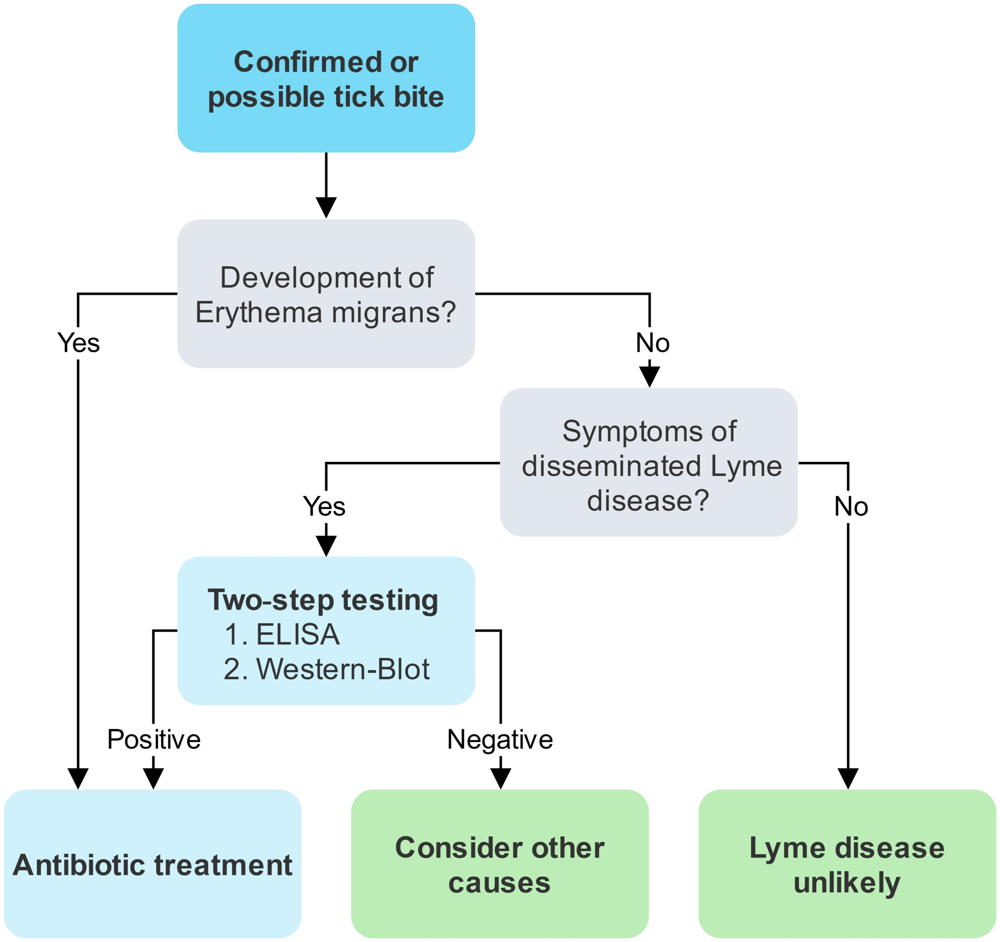
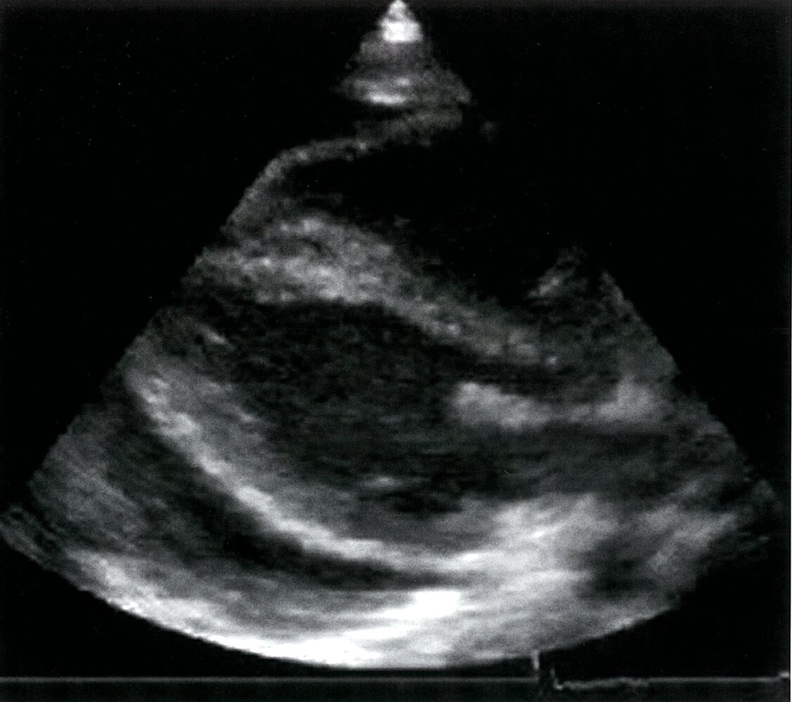
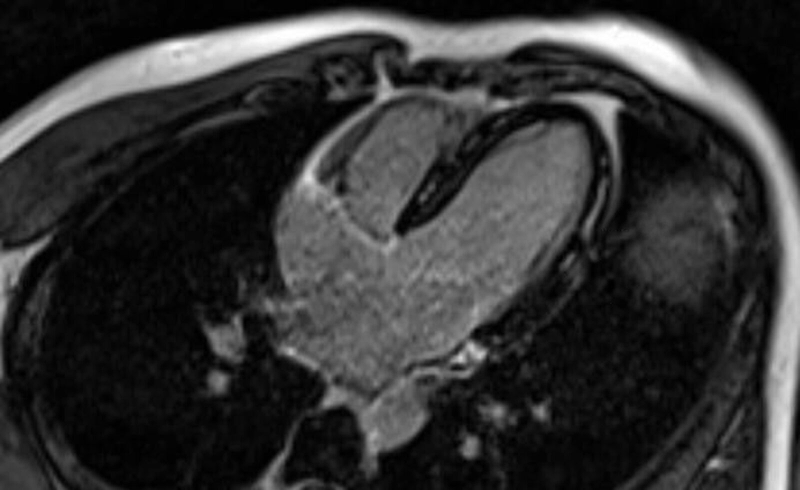
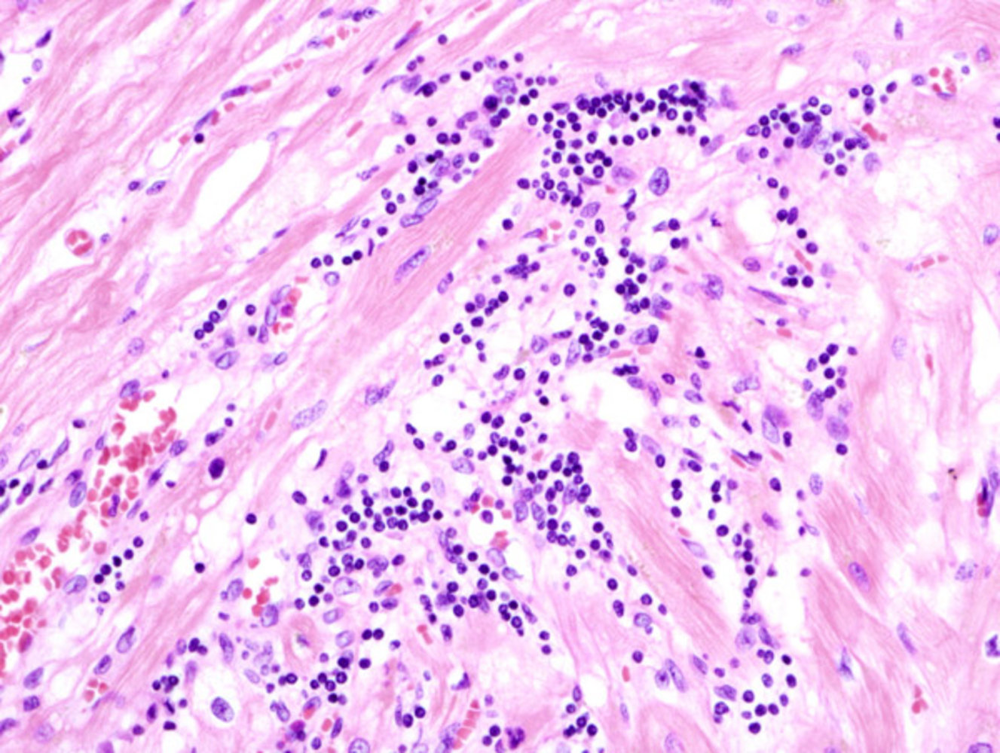

# Myocarditis

*Categories: Clinical knowledge > Internal medicine > Infectious diseases > Infections of the cardiovascular system > Myocarditis*

[Original Article Link](https://coursology-qbank.com/amboss/article/xS0Ebf)

---

## Summary

Myocarditis is inflammation of the <u>myocardium</u> and is most commonly caused by a viral infection (e.g., <u>parvovirus B19</u>, <u>coxsackievirus infection</u>) but can also occur in patients with <u>acute rheumatic fever</u> or autoimmune diseases (e.g., <u>systemic lupus erythematosus</u>, <u>vasculitis</u>). Myocarditis most commonly occurs in <u>infants</u>, <u>adolescents</u> 15–18 years of age, and young adults. Patients may be asymptomatic or present with new-onset <u>chest pain</u>, <u>arrhythmias</u>, and/or <u>new-onset heart failure</u>. <u>Fulminant myocarditis</u> is a rare and life-threatening manifestation of severe <u>myocardial</u> inflammation characterized by <u>hemodynamic instability</u> and/or electrical instability (e.g., <u>ventricular arrhythmia</u>, <u>high-grade atrioventricular block</u>). Initial diagnostic studies involve 12-lead <u>ECG</u>, <u>inflammatory markers</u>, <u>cardiac biomarkers</u>, and <u>transthoracic echocardiography</u> (<u>TTE</u>). A definitive diagnostic study (i.e., <u>cardiac MRI</u> and/or <u>endomyocardial biopsy</u>) should be performed if myocarditis cannot be confirmed on initial diagnostic workup or to determine the underlying cause. Management involves inpatient care with ongoing monitoring, symptomatic treatment (e.g., for <u>heart failure</u>), and treatment of the underlying cause. Transfer to a facility with advanced cardiac care capacity may be necessary. Patients with <u>fulminant myocarditis</u> may also require circulatory support (e.g., <u>inotropic</u> agents, <u>mechanical circulatory support</u>) and/or <u>arrhythmia</u> management (e.g., <u>temporary pacing</u>). Most adults with viral myocarditis make a full recovery, but there is a small risk of progression to <u>dilated cardiomyopathy</u>. Affected children are at risk for ongoing <u>heart failure</u>, <u>transplantation</u>, and <u>death</u>.

---

## Epidemiology

The exact <u>incidence</u> is unknown.

* 1–5% of viral infections are estimated to have cardiac involvement.

* Often occurs in young patients (average age ∼ 40 years)

* In ∼ 10% of sudden deaths in young adults, myocarditis is diagnosed in the post-mortem examination. [[1]](https://coursology-qbank.com/amboss/article/IQ0Yxf)

Epidemiological data refers to the US, unless otherwise specified.

---

## Etiology

### Infectious [[2]](https://coursology-qbank.com/amboss/article/UJdbtI0)[[3]](https://coursology-qbank.com/amboss/article/Drd1jr0)

* Viral 

* Most commonly implicated: <u>enterovirus</u> (e.g., <u>coxsackie</u> B1-B5 <u>virus</u>), <u>parvovirus B19</u>, <u>human herpesvirus 6</u>, <u>adenovirus</u>, <u>HCV</u>, <u>HIV</u>

* Other <u>viruses</u>: <u>EBV</u>, <u>CMV</u>, <u>echovirus</u>, <u>influenza A</u> <u>H1N1</u>, <u>SARS-CoV-2</u>

* Bacterial

* <u>Acute rheumatic fever</u> due to <u>group A β‑hemolytic streptococcus</u>

* <u>Corynebacterium diphtheriae</u> (<u>diphtheria</u>)

* <u>Borrelia burgdorferi</u> (<u>Lyme disease</u>)

* <u>Mycobacterium tuberculosis</u>

* <u>Mycoplasma pneumoniae</u>

* Fungal

* <u>Candida</u> spp.

* <u>Aspergillus</u> spp.

* Parasitic

* <u>Protozoan</u>: <u>Toxoplasma gondii</u>, <u>Trypanosoma cruzi</u> (<u>Chagas disease</u>, which is common in South America)

* <u>Helminthic</u>: <u>Trichinella</u> spp., <u>Echinococcus</u> spp.

> [!TIP]
> Myocarditis is a rare complication of <u>mRNA</u> <u>vaccination</u> (e.g., <u>COVID-19 vaccination</u>); however, the <u>incidence</u> of myocarditis is higher following <u>SARS-CoV-2 infection</u> than after <u>COVID-19 vaccination</u>. [[4]](https://coursology-qbank.com/amboss/article/uudpG70)[[5]](https://coursology-qbank.com/amboss/article/oFd0Q70)

### Noninfectious [[2]](https://coursology-qbank.com/amboss/article/UJdbtI0)[[6]](https://coursology-qbank.com/amboss/article/zfXrKx)

* <u>Connective tissue diseases</u>;  (e.g., <u>systemic lupus erythematosus</u>, <u>sarcoidosis</u>, <u>dermatomyositis</u>, <u>polymyositis</u>)

* <u>Vasculitis</u> (e.g., <u>Kawasaki disease</u>)

* Toxic myocarditis

* Toxic substances (e.g., <u>carbon monoxide</u>, <u>black widow venom</u>)

* Medications (e.g., <u>sulfonamides</u>; , <u>immune checkpoint inhibitors</u>), <u>chemotherapy</u> (e.g., <u>anthracycline</u>, <u>doxorubicin</u>)

* <u>Alcohol</u>, <u>cocaine</u>

* <u>Radiation therapy</u>

* Genetic variants associated with myocarditis (e.g., DSP variants) [[2]](https://coursology-qbank.com/amboss/article/UJdbtI0)

* <u>Thymoma</u>

* <u>Vaccines</u> (e.g., <u>smallpox</u>, <u>SARS-CoV-2</u>)

> [!TIP]
> Patients with myocarditis typically have no <u>ASCVD risk factors</u>.

---

## Clinical features

* Myocarditis is often asymptomatic.

* Development of symptoms may be acute (e.g., in <u>fulminant myocarditis</u>) or chronic.

* Features of upper respiratory or gastrointestinal viral infection (e.g., <u>flu-like symptoms</u>, <u>fever</u>, <u>vomiting</u>; ) may have been present in the preceding 1–2 weeks. [[2]](https://coursology-qbank.com/amboss/article/UJdbtI0)

### Classic features of symptomatic myocarditis [[2]](https://coursology-qbank.com/amboss/article/UJdbtI0)

* <u>Chest pain</u>

* <u>Clinical features of acute coronary syndrome</u>

* Possible <u>clinical features of pericarditis</u> (e.g., <u>pleuritic chest pain</u>, <u>pericardial friction rub</u>)

* <u>Clinical features of acute heart failure</u>

* <u>Dyspnea</u>, exercise intolerance, fatigue, <u>S3 gallop</u>

* Clinical features of <u>dilated cardiomyopathy</u> (e.g., systolic <u>murmur</u>)

* Symptoms of <u>cardiac arrhythmias</u>

* <u>Palpitations</u>, <u>syncope</u>, or <u>presyncope</u>

* <u>Arrhythmias</u> include <u>sinus tachycardia</u> (often disproportionately high relative to body temperature), ventricular extrasystoles, and <u>heart block</u> with <u>bradyarrhythmia</u>.

> [!TIP]
> Clinical manifestations of myocarditis are heterogeneous and nonspecific, ranging from asymptomatic myocarditis to <u>fulminant myocarditis</u>.

> [!TIP]
> High-risk features include <u>symptomatic heart failure</u>, <u>ventricular arrhythmias</u>, and/or <u>heart block</u>.

### Features of fulminant myocarditis [[2]](https://coursology-qbank.com/amboss/article/UJdbtI0)

Classic features of myocarditis, plus either of the following requiring intervention:

* <u>Hemodynamic instability</u> (e.g., <u>cardiogenic shock</u>)

* Electrical instability (e.g., <u>Mobitz type II</u>, <u>ventricular tachycardia</u>)

---

## Diagnosis

Suspect myocarditis in patients with classic clinical features and <u>risk factors</u> (e.g., recent infection, young age, no <u>ASCVD risk factors</u>).

### Approach [[2]](https://coursology-qbank.com/amboss/article/UJdbtI0)

* Admit to hospital.

* Consult specialists (e.g., cardiology, critical care) early.

* Transfer urgently to an <u>advanced heart failure</u> center if <u>fulminant myocarditis</u> or high-risk features are present. [[2]](https://coursology-qbank.com/amboss/article/UJdbtI0)

* Order initial diagnostics.

* 12-lead <u>ECG</u>

* <u>Laboratory studies</u> (e.g., <u>high-sensitivity troponin</u>)

* <u>TTE</u>

* <u>Coronary angiography</u> if indicated to rule out <u>differential diagnoses of chest pain</u>.

* Obtain a definitive diagnostic study (i.e., <u>cardiac MRI</u> and/or <u>endomyocardial biopsy</u>) if myocarditis cannot be confirmed on initial diagnostic workup or to determine the underlying cause. [[2]](https://coursology-qbank.com/amboss/article/UJdbtI0)

* Consider additional studies to determine the underlying cause (e.g., <u>HIV testing</u>, <u>diagnostics for Lyme disease</u>).

> [!TIP]
> Maintain a high index of suspicion for myocarditis in young adults and in patients with a relevant history (e.g., exposure to cardiotoxic agents or a recent viral infection). [[2]](https://coursology-qbank.com/amboss/article/UJdbtI0)

> [!WARNING]
> Arrange urgent transfer to an <u>advanced heart failure</u> center for patients with <u>fulminant myocarditis</u> or high-risk features. [[2]](https://coursology-qbank.com/amboss/article/UJdbtI0)

### Diagnostic confirmation of symptomatic myocarditis [[2]](https://coursology-qbank.com/amboss/article/UJdbtI0)

* ≥ 1 of the following:

* <u>Chest pain</u>

* <u>Heart failure</u> and/or <u>cardiogenic shock</u>

* <u>Arrhythmias</u>

* AND ≥ 1 of the following:

* Elevated <u>high-sensitivity troponin</u> with supportive evidence (e.g., <u>echocardiography</u> findings consistent with myocarditis)

* <u>Endomyocardial biopsy</u> findings consistent with myocarditis

* <u>Cardiac MRI</u> findings consistent with myocarditis

### Initial diagnostic workup

#### 12-lead <u>ECG</u> [[2]](https://coursology-qbank.com/amboss/article/UJdbtI0)[[7]](https://coursology-qbank.com/amboss/article/BvczXe0)

<u>ECG</u> findings in myocarditis are often abnormal but nonspecific. [[2]](https://coursology-qbank.com/amboss/article/UJdbtI0)

* <u>Sinus tachycardia</u>

* <u>Arrhythmias</u>

* Frequent atrial or <u>ventricular premature beats</u>

* <u>Supraventricular arrhythmia</u>, e.g., <u>atrial fibrillation</u>

* <u>Ventricular arrhythmia</u>, e.g., <u>ventricular fibrillation</u>

* Conduction abnormalities, e.g., <u>AV block</u>, <u>bundle branch block</u>

* <u>Repolarization</u> abnormalities 

* Nonspecific <u>ST-segment</u> changes

* Diffuse, <u>concave</u> <u>ST elevations</u>

* <u>T-wave</u> changes, e.g., <u>T-wave inversion</u>

* <u>Low QRS voltage</u> due to <u>pericardial effusion</u> or <u>myocardial</u> <u>edema</u>

* Abnormal <u>Q waves</u>

ECG in (peri)myocarditis

#### <u>Laboratory studies</u> [[2]](https://coursology-qbank.com/amboss/article/UJdbtI0)[[8]](https://coursology-qbank.com/amboss/article/vrdAQr0)

Obtain routine studies for all patients. Additional studies to determine the underlying cause should be guided by clinical suspicion.

* Routine studies

* ↑ <u>Cardiac biomarkers</u>

* <u>High-sensitivity troponin</u>  [[2]](https://coursology-qbank.com/amboss/article/UJdbtI0)

* CK, <u>CK-MB</u>

* <u>BNP</u>, <u>NT-proBNP</u>

* ↑ <u>ESR</u>, ↑ <u>CRP</u>

* <u>CBC</u>: <u>leukocytosis</u> (<u>eosinophilia</u>)

* Additional studies  [[7]](https://coursology-qbank.com/amboss/article/BvczXe0)[[9]](https://coursology-qbank.com/amboss/article/9vcNXe0)

* For infectious causes, e.g.:

* <u>Blood cultures</u> in patients with <u>fever</u>

* <u>HIV testing</u>

* <u>Viral hepatitis panel</u>

* <u>Diagnostics for Lyme disease</u>

* For noninfectious causes, e.g.:

* <u>ANAs</u> for suspected <u>connective tissue diseases</u>

* Screening for toxic substances for suspected <u>toxic myocarditis</u>

Diagnosis of Lyme disease

#### Initial imaging [[2]](https://coursology-qbank.com/amboss/article/UJdbtI0)

* <u>Transthoracic echocardiography</u>

* Obtain for all patients with suspected myocarditis.  [[2]](https://coursology-qbank.com/amboss/article/UJdbtI0)

* Supportive findings  

* <u>Global</u> or regional wall motion abnormality (systolic or <u>diastolic</u>)

* Reduced <u>ejection fraction</u>

* Ventricular dilation

* Increased wall thickness

* <u>Pericardial effusion</u>

* Complications (e.g., endocavitary <u>thrombus</u>)

* May also reveal alternative noninflammatory <u>causes of acute heart failure</u> (e.g., <u>valvular dysfunction</u>)

* <u>Coronary angiography</u> (invasive or CT)

* Consider in all patients to exclude differential diagnoses (e.g., <u>coronary artery disease</u>, <u>spontaneous coronary artery dissection</u>). [[2]](https://coursology-qbank.com/amboss/article/UJdbtI0)

* Alternative: <u>Cardiac MRI</u> with <u>stress</u> <u>perfusion</u> study can be used to rule out significant <u>ischemic heart disease</u>. [[2]](https://coursology-qbank.com/amboss/article/UJdbtI0)

* <u>X-ray</u> and/or CT chest

* Commonly ordered to evaluate <u>chest pain</u>

* <u>Chest x-ray</u> is often performed as an initial test in patients with suspected <u>fulminant myocarditis</u>. [[9]](https://coursology-qbank.com/amboss/article/9vcNXe0)

* Findings are nonspecific (e.g., <u>cardiac enlargement</u>, <u>pulmonary edema</u>, <u>pleural effusions</u>).

* Advanced imaging 

* May be considered by specialists in specific situations (e.g., in patients with <u>arrhythmias</u>)

* Options include resting <u>FDG PET-CT scan</u>, PET-<u>MRI</u>, and <u>SPECT</u>.

Pericardial effusion

Bilateral air space and interstitial disease in acute pulmonary edema

### Definitive diagnostic studies [[2]](https://coursology-qbank.com/amboss/article/UJdbtI0)

Obtain a definitive diagnostic study (i.e., <u>cardiac MRI</u> and/or <u>endomyocardial biopsy</u>) if myocarditis cannot be confirmed on initial diagnostic workup or to determine the underlying cause.

#### <u>Cardiac MRI</u> [[2]](https://coursology-qbank.com/amboss/article/UJdbtI0)

* Used for stable patients

* Can be used to confirm myocarditis but cannot determine the underlying cause

* Used to identify sites for <u>endomyocardial biopsy</u>

* Findings  

* Functional and structural abnormalities similar to <u>TTE</u> findings

* <u>Myocardial</u> <u>edema</u>, <u>capillary</u> <u>hyperemia</u>

* <u>Pericardial effusion</u> or inflammation

* Diffuse, <u>late gadolinium enhancement</u>

> [!WARNING]
> Proceed directly to <u>endomyocardial biopsy</u> for patients with suspected <u>fulminant myocarditis</u> and patients who do not responded to standard care for <u>arrhythmia</u> and/or <u>congestive heart failure</u> within 1–2 weeks. [[9]](https://coursology-qbank.com/amboss/article/9vcNXe0)

Late gadolinium enhancement in myocarditis

#### <u>Endomyocardial biopsy</u> [[2]](https://coursology-qbank.com/amboss/article/UJdbtI0)

<u>Endomyocardial biopsy</u> can be used to establish the underlying <u>cause of myocarditis</u> and guide treatment (e.g., <u>antiviral therapy</u>, <u>systemic immunomodulators</u>).

* Indications

* <u>Fulminant myocarditis</u>

* Symptomatic myocarditis with:

* Impaired <u>left ventricular</u> function or <u>symptomatic heart failure</u>

* <u>Arrhythmias</u> (e.g., <u>high-degree atrioventricular block</u>, <u>ventricular arrhythmias</u>)

* Peripheral <u>eosinophilia</u>

* Patients with asymptomatic myocarditis receiving <u>immune checkpoint inhibitors</u>

* Procedure: <u>cardiac catheterization</u> with ≥ 3 samples collected [[9]](https://coursology-qbank.com/amboss/article/9vcNXe0)

* Findings [[2]](https://coursology-qbank.com/amboss/article/UJdbtI0)

* <u>Histopathology</u> 

* <u>Myocyte</u> <u>necrosis</u> (may be focal)

* Inflammatory cell infiltrate (e.g., <u>lymphocytic</u>)

* <u>Immunohistochemistry</u> (e.g., presence of <u>CD3</u>+<u>T cells</u>) increases <u>sensitivity</u>.

* Viral <u>PCR</u>: possible detection of viral <u>DNA</u> or <u>RNA</u> (e.g., <u>parvovirus B19</u>, <u>HSV</u>)  [[7]](https://coursology-qbank.com/amboss/article/BvczXe0)[[10]](https://coursology-qbank.com/amboss/article/5Ccise0)

> [!TIP]
> In addition to confirming the <u>diagnosis of myocarditis</u>, <u>endomyocardial biopsy</u> can be used to identify the underlying cause. [[2]](https://coursology-qbank.com/amboss/article/UJdbtI0)

Lymphocytic myocarditis

---

## Differential diagnoses

* See “<u>Differential diagnosis of chest pain</u>.”

* <u>Pericarditis</u>

* <u>Acute coronary syndrome</u> (e.g., <u>myocardial infarction</u>)

* <u>Arrhythmia-induced cardiomyopathy</u>

* Cardiac <u>amyloidosis</u>

The differential diagnoses listed here are not exhaustive.

---

## Management

For <u>hemodynamically unstable</u> patients, see “<u>Management of fulminant myocarditis</u>.”

### Approach [[2]](https://coursology-qbank.com/amboss/article/UJdbtI0)

* Admit for inpatient management (e.g., <u>continuous cardiac monitoring</u>).

* Consult relevant specialist teams (e.g., cardiology, rheumatology).

* Urgently transfer to an <u>advanced heart failure</u> center if high-risk features are present (e.g., <u>hemodynamic instability</u>, life-threatening <u>arrhythmias</u>, <u>symptomatic heart failure</u>).

* Start symptomatic treatment as needed.

* Treat the underlying cause.

### Symptomatic treatment [[2]](https://coursology-qbank.com/amboss/article/UJdbtI0)[[11]](https://coursology-qbank.com/amboss/article/mCcVse0)

* <u>Pain management</u>

* Consider <u>NSAIDs</u> and <u>colchicine</u> or patients with <u>pericardial</u>-type <u>chest pain</u> without <u>heart failure</u> or <u>shock</u>.

* See “<u>Treatment of pericarditis</u>” for dosages.

* <u>Management of acute heart failure</u>

* Management of <u>arrhythmias</u>

* Life-threatening <u>arrhythmias</u> can occur at any stage but often resolve after several weeks.

* Temporary measures may be necessary (e.g., temporary pacemaker, <u>wearable cardioverter-defibrillator</u>).

* Consider indications for a permanent <u>cardiac implantable electronic device</u> only after resolution of the acute phase.

* See “<u>Management of tachycardia</u>” and “<u>Management of bradycardia</u>” for details.

> [!WARNING]
> Use <u>NSAIDs</u> with caution as they can increase <u>sodium</u> retention, exacerbate renal <u>hypoperfusion</u>, and may increase mortality in patients with myocarditis. [[1]](https://coursology-qbank.com/amboss/article/IQ0Yxf)[[9]](https://coursology-qbank.com/amboss/article/9vcNXe0)

> [!WARNING]
> Immediately consult cardiology for patients with <u>fulminant myocarditis</u>. Maintain a low threshold for starting <u>treatment of refractory acute heart failure</u> (e.g., with <u>mechanical circulatory support</u>). See also “<u>Management of fulminant myocarditis</u>.” [[9]](https://coursology-qbank.com/amboss/article/9vcNXe0)

### Treatment of the underlying cause   [[1]](https://coursology-qbank.com/amboss/article/IQ0Yxf)[[11]](https://coursology-qbank.com/amboss/article/mCcVse0)

* Consider under specialist guidance  and tailor to the patient.

* Review and consider stopping medications that can cause <u>toxic myocarditis</u>. [[9]](https://coursology-qbank.com/amboss/article/9vcNXe0)[[12]](https://coursology-qbank.com/amboss/article/jTX_qx)

* Treatment may include:

* <u>Systemic immunomodulators</u> (e.g., for <u>giant cell myocarditis</u>, <u>cardiac sarcoidosis</u>): <u>glucocorticoids</u> (e.g., <u>methylprednisolone</u>), <u>calcineurin inhibitors</u>, <u>IV immunoglobulin</u>

* <u>Antiviral therapy</u>

* <u>Antibiotic therapy</u> (e.g., for <u>Lyme carditis</u>)

> [!TIP]
> All treatment should be guided by a specialist.

### Management of fulminant myocarditis [[2]](https://coursology-qbank.com/amboss/article/UJdbtI0)[[9]](https://coursology-qbank.com/amboss/article/9vcNXe0)

<u>Fulminant myocarditis</u> is a rare and life-threatening manifestation of severe <u>myocardial</u> inflammation.

* Follow the <u>ABCDE approach</u>.

* Urgently transfer to an <u>advanced heart failure</u> center with a specialist myocarditis team.

* Admit to a cardiac or <u>intensive care unit</u> for <u>management of cardiogenic shock</u> (e.g., <u>inotropic</u> agents) or <u>arrhythmia</u> management (e.g., <u>temporary pacing</u>, <u>wearable cardioverter-defibrillator</u>).

* Obtain markers of <u>end-organ damage</u>.

* <u>ABG</u> or <u>VBG</u>, <u>lactate</u>

* <u>LFTs</u>

* <u>BMP</u>

* Specific treatment depends on the cause and may include high-dose <u>glucocorticoids</u>.

* Consider consultation for durable interventions (e.g., <u>permanent pacemaker</u>, durable <u>left ventricular assist device</u>, <u>heart transplantation</u>) if there is no response to treatment.

### Long-term management [[2]](https://coursology-qbank.com/amboss/article/UJdbtI0)

* Recommend avoiding aerobic activity for 3–6 months after diagnosis.  [[2]](https://coursology-qbank.com/amboss/article/UJdbtI0)

* Follow-up at regular intervals; visits should include:

* Clinical assessment

* <u>ECG</u>

* <u>TTE</u>

* Recommend <u>genetic testing</u> of <u>first-degree relatives</u> for patients with a causative genetic variant.

---

## Complications

* Progression to <u>dilated cardiomyopathy</u> (∼ 15% of cases)

* <u>Heart failure</u> or <u>sudden cardiac death</u>; : probably due to <u>ventricular tachycardia</u> or fibrillation (common in adults < 40 years old)

* Acute and/or persistent <u>arrhythmias</u>

* <u>Atrioventricular block</u>

* Intracardiac <u>thrombi</u> formation, which can result in systemic embolization

* Concurrent <u>pericarditis</u> (<u>perimyocarditis</u>) that may lead to <u>cardiac tamponade</u> (associated with large <u>pericardial effusions</u>)

References:[[2]](https://coursology-qbank.com/amboss/article/UJdbtI0)

We list the most important complications. The selection is not exhaustive.

---