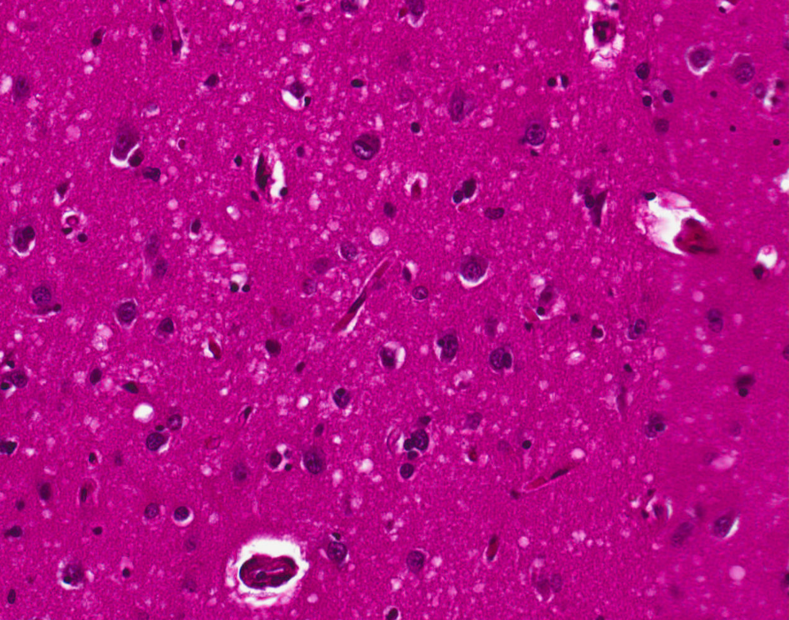
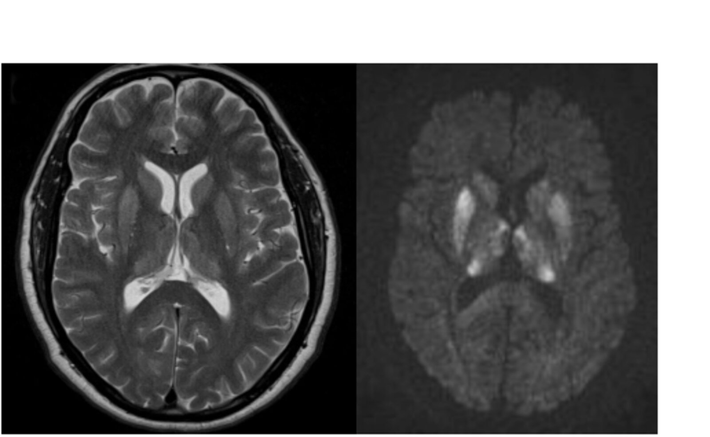

# Creutzfeldt-Jakob disease

*Categories: Clinical knowledge > Internal medicine > Infectious diseases > Infections of the central nervous system > Creutzfeldt-Jakob disease*

[Original Article Link](https://coursology-qbank.com/amboss/article/cR0aNf)

---

## Summary

Creutzfeldt-Jakob disease (CJD) is a <u>neurodegenerative condition</u> that is caused by misfolded protein particles (<u>prions</u>). <u>Prion diseases</u> are very rare overall. CJD is the most common <u>prion disease</u> in humans. In most cases, no direct cause of CJD can be established. However, there are also familial forms due to <u>gene</u> mutation or acquired forms as <u>prion</u> particles can be transmitted between individuals, making CJD an infectious disease. Accumulation of <u>prion</u> particles in the <u>brain</u> eventually leads to neuronal degeneration and clinical onset of the disease. The cardinal symptoms of CJD are <u>rapidly progressive dementia</u> and <u>myoclonus</u>. Most patients die within 12 months following disease manifestation. Imaging, <u>EEG</u>, and <u>cerebrospinal fluid</u> (<u>CSF</u>) tests provide diagnostic evidence, although a definite diagnosis can only be made via <u>biopsy</u> or <u>autopsy</u>. To date, no curative treatment is available.

---

## Etiology

CJD is caused by misfolded <u>proteins</u> (prions, PrPSc) that are either produced by affected individual themselves, or taken up from an <u>exogenous</u> source. [[4]](https://coursology-qbank.com/amboss/article/U30b3f)[[5]](https://coursology-qbank.com/amboss/article/4ja30k)[[6]](https://coursology-qbank.com/amboss/article/OjaI0k)

* Sporadic (∼ 85%): no identifiable source

* Familial (∼ 10–15%): associated with various mutations (e.g., deletions, insertions, nonsense or missense variants) affecting the <u>prion protein gene</u> (PRNP <u>gene</u>) [[7]](https://coursology-qbank.com/amboss/article/dXXoC9)

* Acquired (< 1%) 

* <u>Iatrogenic</u> CJD: transmission during medical procedures, such as:

* <u>Brain</u> <u>surgery</u> (surgical equipment)

* <u>Organ transplantation</u> (e.g., corneal transplant)

* <u>Blood transfusion</u>

* <u>Variant CJD</u> (<u>vCJD</u>)

* Occurs due to ingestion of beef infected with bovine spongiform encephalopathy (<u>BSE</u>)

* <u>BSE</u> is a transmissible <u>prion disease</u> occurring in cattle also known as “<u>mad cow disease</u>”

---

## Pathophysiology

* Conversion of normal cellular <u>prion</u> <u>proteins</u> with <u>alpha-helical</u> structure (PrPc) to <u>prions</u> that demonstrate an increase in beta-pleated sheet structure (PrPSc) → conformational change of physiological PrPc;   → PrPSc accumulation and <u>plaque</u> formation → neuronal cell <u>death</u> → progression to spongiform <u>encephalopathy</u> [[8]](https://coursology-qbank.com/amboss/article/bSYHyo)[[9]](https://coursology-qbank.com/amboss/article/cSYaAo)[[10]](https://coursology-qbank.com/amboss/article/1SY2Ao)

* Since misfolded <u>prions</u> are insoluble, they deposit as <u>plaques</u> resistant to <u>proteases</u> and standard <u>autoclaving</u>, thus contributing to the formation of more PrPSc.

---

## Clinical features

The <u>latency period</u> until symptom onset varies greatly with the type of exposition (e.g., between 5 and 30 years in some cases of <u>iatrogenic</u> CJD). [[11]](https://coursology-qbank.com/amboss/article/LXXwA9)

* <u>Prodromal</u> symptoms

* <u>Sleep disorders</u>

* <u>Headaches</u>

* Fatigue

* Neurological symptoms

* <u>Cerebellar</u> disturbances (e.g., gait instability) and extrapyramidal deficits

* <u>Myoclonus</u>

* Often triggered by startling (e.g., loud noises)

* Also associated with metabolic abnormalities found in <u>liver</u> and <u>renal failure</u>

* <u>Ataxia</u>

* <u>Seizures</u>

* Neuropsychiatric symptoms

* Rapidly progressing <u>dementia</u> (weeks to months)

* <u>Personality</u> changes

* <u>Akinetic mutism</u> [[12]](https://coursology-qbank.com/amboss/article/ljav0k)

* <u>Visual hallucinations</u>

* <u>Depression</u>

* <u>Autonomic nervous system</u> dysregulation (e.g., sweating)

> [!TIP]
> <u>Rapidly progressive dementia</u> and <u>myoclonic</u> jerks are the hallmarks of Creutzfeldt-Jakob disease.

---

## Diagnosis

### Instrumental diagnostics [[3]](https://coursology-qbank.com/amboss/article/Nja-0k)

* <u>CSF analysis</u> [[13]](https://coursology-qbank.com/amboss/article/UXXbx9)

* ↑ <u>Neuron specific enolase</u>

* ↑ <u>S100 protein</u>

* ↑ <u>Tau protein</u>

* ↑ <u>14-3-3 protein</u>

* RT-QuIC: a diagnostic tool for sporadic Creutzfeldt-Jakob disease [[14]](https://coursology-qbank.com/amboss/article/gXXFx9)

* Involves mixing of <u>CSF</u> taken from an individual with suspected CJD with recombinant <u>prion</u> protein (rPrP) and thioflavin T.

* If <u>CSF</u> contains PrPSc, PrPSc will induce conformation changes in rPrP.

* Aggregated rPrP fibrils bind to thioflavin T, which will start to fluoresce.

* Fluorescence can be measured and shows a characteristic sigmoidal curve.

* The whole process can take up to 90 hours.

* Imaging: : <u>MRI</u> frequently shows <u>hyperintensity</u> in the <u>basal ganglia</u>, <u>insular cortices</u>, and the frontal cortices

* <u>EEG</u>: : triphasic periodic sharp wave complexes with a frequency of 1–2 Hz

* <u>Brain biopsy</u>

* Diagnosis can only be confirmed by <u>biopsy</u>/<u>autopsy</u> and subsequent neuropathological examination.

* Microscopic findings include spongiform degeneration (e.g., intracytoplasmic <u>vacuoles</u> within the <u>neurons</u> of cerebral and <u>cerebellar cortex</u> that can be seen on H&E), <u>gliosis</u> and, in rare cases, <u>amyloid plaques</u>.

Creutzfeldt-Jakob disease

MRI in Creutzfeldt-Jakob disease

---

## Differential diagnoses

Other diseases commonly associated with the development of <u>dementia</u>:

* Other <u>prion diseases</u>

* <u>Gerstmann-Sträussler-Scheinker syndrome</u>

* <u>Kuru</u>: found initially in tribes that practice cannibalism

* <u>Fatal familial insomnia</u>

* <u>Huntington disease</u>

* <u>Encephalopathy</u> due to <u>mitochondrial myopathy</u> (e.g., <u>MELAS</u>)

* <u>Encephalitis</u>

* <u>Wilson disease</u>

* See “<u>Differential diagnosis of subtypes of dementia</u>.”

The differential diagnoses listed here are not exhaustive.

---

## Treatment

* No curative therapy available: Sporadic CJD typically leads to <u>death</u> within one year of symptom onset.  [[1]](https://coursology-qbank.com/amboss/article/QjauZk)[[2]](https://coursology-qbank.com/amboss/article/PjaW0k)

* Symptomatic treatment and eventually <u>palliative care</u>

> [!TIP]
> Following disease manifestation, most individuals with sporadic CJD die within 12 months, usually from complications such as <u>pneumonia</u>.

---