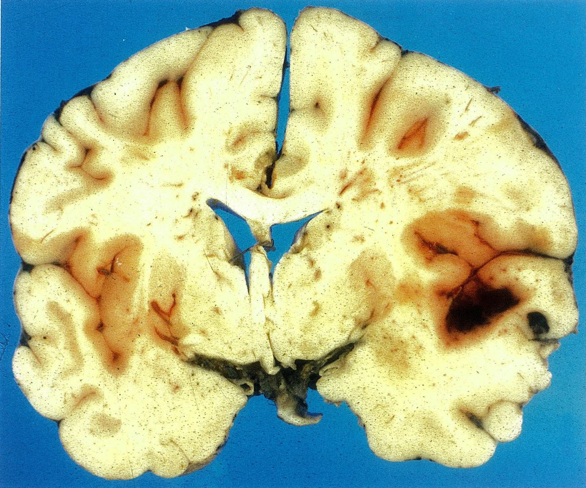
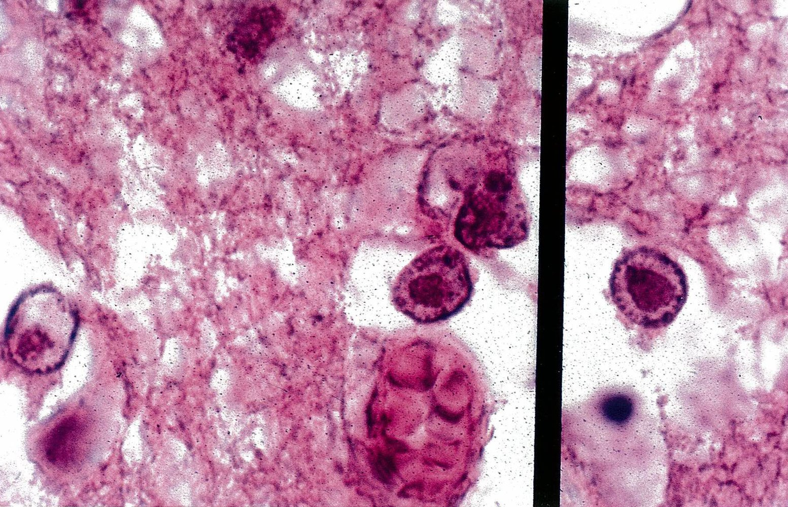

# Herpes simplex encephalitis

*Categories: Clinical knowledge > Internal medicine > Infectious diseases > Infections of the central nervous system > Herpes simplex encephalitis*

[Original Article Link](https://coursology-qbank.com/amboss/article/YR0nlf)

---

## Summary

<u>Herpes simplex</u> <u>encephalitis</u> (HSE) is an inflammation of the <u>brain</u> <u>parenchyma</u>, typically in the <u>medial</u> <u>temporal lobe</u>, that is caused by either <u>herpes simplex virus 1</u> (<u>HSV-1</u>) or <u>herpes simplex virus 2</u> (<u>HSV-2</u>). It is the most common cause of fatal sporadic <u>encephalitis</u> in the US. HSE has a <u>bimodal distribution</u>, commonly affecting patients younger than 20 years of age and older than 50 years of age. Patients with HSE typically present with a <u>prodrome</u> of <u>headaches</u> and <u>fever</u>, followed by sudden <u>focal neurological deficits</u>, <u>altered mental status</u>, and possible <u>seizures</u>. Characteristic clinical findings and <u>brain</u> imaging showing temporal lesions should raise suspicion for HSE. <u>Lumbar puncture</u> often reveals <u>lymphocytic</u> <u>pleocytosis</u>. The diagnosis is best confirmed with <u>polymerase chain reaction</u> (<u>PCR</u>) testing of <u>cerebrospinal fluid</u>. Because HSE has a rapidly progressive and potentially fatal course, treatment with <u>acyclovir</u> should begin as soon as the disease is suspected. The <u>mortality rate</u> is as high as 70% if left untreated, and relapse is possible but uncommon.

---

## Etiology

* <u>Pathogen</u>: <u>herpes simplex virus</u>

* <u>Neonates</u>: both <u>HSV-1</u> and <u>HSV-2</u>

* Adult: usually <u>HSV-1</u>

* Transmission: See “<u>Herpes simplex virus infections</u>.”

* <u>Infectivity</u>: highly contagious

References:[[2]](https://coursology-qbank.com/amboss/article/iS0Jz2)

---

## Clinical features

### <u>Prodromal</u> phase

* Duration: a few hours to days

* Nonspecific symptoms

* <u>Fever</u>

* <u>Headache</u>

* <u>Nausea and vomiting</u>

* <u>Malaise</u>

### Acute or subacute <u>encephalopathy</u>

* <u>Focal neurological deficits</u> (primarily affects the <u>medial</u> <u>temporal lobe</u>) [[5]](https://coursology-qbank.com/amboss/article/PS0W-2)

* Altered <u>sense of smell</u> and loss of <u>vision</u>

* <u>Aphasia</u>

* <u>Memory</u> loss

* <u>Hemiparesis</u>

* <u>Ataxia</u>

* <u>Hyperreflexia</u>

* <u>Seizures</u> (focal or generalized)

* <u>Altered mental status</u> (e.g., confusion, <u>disorientation</u>, lowered <u>level of consciousness</u>)

* Behavioral changes (e.g., hypersexuality, <u>hypomania</u>, <u>agitation</u>)

* <u>Meningeal signs</u> (e.g., <u>nuchal rigidity</u>, <u>photophobia</u>) may occur.

* <u>Coma</u>

> [!NOTE]
> HSE may resemble <u>bacterial meningitis</u>, but the combination of <u>altered mental status</u>, <u>seizures</u>, and <u>focal neurological deficits</u> is more common for HSE!

References:[[6]](https://coursology-qbank.com/amboss/article/QS0uz2)

---

## Diagnosis

### Approach [[7]](https://coursology-qbank.com/amboss/article/R9YlMr)[[8]](https://coursology-qbank.com/amboss/article/kIYm1q)

* Strongly suspected HSE: Start immediate treatment prior to investigations (see “Antimicrobial <u>treatment of herpes simplex encephalitis</u>”).

* All patients require:

* <u>Lumbar puncture</u> (<u>LP</u>) with <u>CSF analysis</u> and <u>HSV</u> <u>PCR</u>; Do not delay empiric treatment if <u>LP</u> is delayed.

* <u>MRI</u> head

* <u>EEG</u>

* Initial negative <u>PCR</u> with high clinical and/or radiological <u>probability</u>: Continue empiric treatment and repeat <u>HSV</u> <u>PCR</u> after 3–7 days. [[9]](https://coursology-qbank.com/amboss/article/CxbqAD)

* Further testing (e.g., <u>brain biopsy</u>) is not routinely required; consider if there are <u>contraindications for LP</u> or uncertain diagnosis in treatment-refractory patients.

> [!TIP]
> Empiric treatment should be initiated while awaiting the definitive diagnosis, as the progression of HSE is very rapid. [[7]](https://coursology-qbank.com/amboss/article/R9YlMr)[[10]](https://coursology-qbank.com/amboss/article/yxbd_D)

### <u>Laboratory studies</u> [[7]](https://coursology-qbank.com/amboss/article/R9YlMr)[[11]](https://coursology-qbank.com/amboss/article/35YSPp)

#### Blood studies

* Prior to <u>LP</u> [[7]](https://coursology-qbank.com/amboss/article/R9YlMr)[[11]](https://coursology-qbank.com/amboss/article/35YSPp)[[12]](https://coursology-qbank.com/amboss/article/kybm2w)

* <u>CBC</u>

* <u>Liver chemistries</u>

* <u>BMP</u>

* <u>Coagulation parameters</u>

* Simultaneous to <u>LP</u>: serum <u>glucose</u>

* Additional testing

* Consider serum <u>HSV</u> <u>PCR</u> and <u>HSV</u> <u>antibodies</u>.  [[8]](https://coursology-qbank.com/amboss/article/kIYm1q)

* Blood and throat cultures

#### <u>CSF</u> studies [[7]](https://coursology-qbank.com/amboss/article/R9YlMr)[[8]](https://coursology-qbank.com/amboss/article/kIYm1q)

* <u>CSF</u> <u>PCR</u> for <u>HSV-1</u> and <u>HSV-2</u>: <u>Gold standard test</u>

* Allows for early detection of the <u>pathogen</u>  [[10]](https://coursology-qbank.com/amboss/article/yxbd_D)

* High <u>sensitivity</u>  and <u>specificity</u>

* <u>CSF analysis</u> 

* May be normal in <u>immunocompromised</u> patients

* For a comparison to other <u>CNS</u> infections see “<u>CSF analysis in meningitis</u>.”

|  CSF analysis in herpes simplex encephalitis [[7]](https://coursology-qbank.com/amboss/article/R9YlMr)[[10]](https://coursology-qbank.com/amboss/article/yxbd_D)  |  |
| --- | --- |
| <u>CSF</u> parameters | Findings |
| Cell count and differential |   * ↑ <u>Lymphocytes</u> (<u>lymphocytic</u> <u>pleocytosis</u> )  * <u>Erythrocytes</u>: may be detected in hemorrhagic <u>encephalitis</u>    |
| <u>Opening pressure</u> |  * Normal or ↑   |
| <u>Lactate</u> |  * Variable, normal to mild ↑   |
| Protein |  * Mild ↑   |
| <u>Glucose</u> |  * Normal (or similar to serum <u>glucose</u>)   |

* Additional testing

* <u>CSF</u> <u>antibody</u> detection

* <u>CSF</u> cultures  [[10]](https://coursology-qbank.com/amboss/article/yxbd_D)

### <u>Neuroimaging</u> [[7]](https://coursology-qbank.com/amboss/article/R9YlMr)

* <u>MRI</u> head: most sensitive and specific imaging modality  [[10]](https://coursology-qbank.com/amboss/article/yxbd_D)

* Indication: all patients with suspected HSE

* Findings

* Characteristic features include signs of unilateral or bilateral <u>temporal lobe</u> <u>edema</u> and/or hemorrhage.

* T1 sequence: <u>hypointense</u> <u>temporal lobe</u> areas

* T2/<u>FLAIR sequence</u>: <u>hyperintense</u> <u>temporal lobe</u> lesions and signal abnormalities [[8]](https://coursology-qbank.com/amboss/article/kIYm1q)

* The <u>frontal lobe</u> or <u>insular cortex</u> may also be affected.

* CT head with and without intravenous contrast [[11]](https://coursology-qbank.com/amboss/article/35YSPp)

* Indications

* Suspected <u>raised intracranial pressure</u> (see “<u>Criteria for imaging prior to LP in suspected meningitis</u>” for further information)

* Exclusion of differential diagnoses

* Patients with <u>contraindications to MRI</u>

* Findings

* Early stages : often no detectable abnormalities [[12]](https://coursology-qbank.com/amboss/article/kybm2w)[[13]](https://coursology-qbank.com/amboss/article/Sybyew)

* Later stages: unilateral or bilateral <u>hypodense</u> zones in the <u>temporal lobe</u>

> [!TIP]
> Always consider HSE when imaging suggests potential <u>meningoencephalitis</u> and <u>temporal lobe</u> involvement; bilateral <u>temporal lobe</u> abnormality is a <u>pathognomic</u> sign of HSE. [[7]](https://coursology-qbank.com/amboss/article/R9YlMr)

### <u>Electroencephalography</u> (<u>EEG</u>) [[7]](https://coursology-qbank.com/amboss/article/R9YlMr)

* Indication: all patients with suspected HSE

* Findings

* Abnormal in > 80% of patients  [[10]](https://coursology-qbank.com/amboss/article/yxbd_D)

* Characteristic finding: periodic lateralized epileptiform discharges from the affected <u>temporal lobe</u>

---

## Pathology

* Macroscopic: typical <u>temporal lobe</u> distribution with visible <u>necrosis</u>

* Microscopic

* Hemorrhagic-necrotizing inflammation

* Eosinophilic nuclear <u>inclusions</u> (Cowdry bodies)

Autoptic findings in herpes simplex encephalitis (HSE)

Cowdry bodies in herpes simplex encephalitis (HSE)

References: [[14]](https://coursology-qbank.com/amboss/article/4S03-2)

---

## Differential diagnoses

* Other causes of <u>encephalitis</u>, for example:

* <u>CMV encephalitis</u> in <u>immunocompromised</u> patients (see also <u>HIV-associated CNS lesions</u>)

* <u>Autoimmune encephalitis</u> (e.g., <u>anti-NMDA encephalitis</u>)

* <u>Paraneoplastic encephalomyelitis</u>

* <u>Rabies</u>

* <u>Creutzfeldt-Jakob disease</u>

* <u>Cryptococcal meningoencephalitis</u>

* <u>Meningitis</u>

* <u>Stroke</u>

* <u>Epilepsy</u>

* <u>Migraine headache</u>

The differential diagnoses listed here are not exhaustive.

---

## Treatment

### Antimicrobial treatment for herpes simplex encephalitis [[7]](https://coursology-qbank.com/amboss/article/R9YlMr)[[9]](https://coursology-qbank.com/amboss/article/CxbqAD)[[10]](https://coursology-qbank.com/amboss/article/yxbd_D)

All patients should be hospitalized and a <u>neurology</u> consult is highly recommended; intensive care must be readily available. [[13]](https://coursology-qbank.com/amboss/article/Sybyew)

* Antiviral treatment 

* Start immediate treatment with intravenous <u>acyclovir</u> DOSAGE without waiting for diagnostic confirmation.

* Duration of treatment: 14–21 days   [[15]](https://coursology-qbank.com/amboss/article/LMbw68)

* Patients with <u>acyclovir</u> resistance and <u>immunocompromised</u> patients: Consult infectious diseases.  [[16]](https://coursology-qbank.com/amboss/article/2ybTew)[[17]](https://coursology-qbank.com/amboss/article/fybkew)

* Additional treatment

* Add further antimicrobial treatment if indicated, e.g., for <u>bacterial meningitis</u>, until a definitive diagnosis is made (see “<u>Empiric antibiotic therapy for bacterial meningitis</u>”).

* <u>Corticosteroids</u> may be considered under specialist consultation.

> [!WARNING]
> Monitor for <u>nephrotoxicity</u> during treatment with <u>acyclovir</u>. Manage with adequate hydration and adjust dosages for renal function.  [[8]](https://coursology-qbank.com/amboss/article/kIYm1q)[[10]](https://coursology-qbank.com/amboss/article/yxbd_D)

### Management of complications

* <u>Elevated intracranial pressure</u>: See “<u>ICP management</u>”.

* <u>Seizure</u> control

* Prophylactic <u>anticonvulsant</u> therapy is not recommended. [[18]](https://coursology-qbank.com/amboss/article/mybVfw)

* For actively seizing patients, administer standard <u>anticonvulsant</u> therapy (see “<u>Status epilepticus</u>”).

* Relapse: uncommon [[10]](https://coursology-qbank.com/amboss/article/yxbd_D)

* Symptoms of relapse may be caused by <u>autoimmune encephalitis</u> (triggered by initial <u>HSV infection</u>).

* Specialist consultation  is recommended for advanced treatment (e.g., immunotherapy).

---

## Prognosis

* Fatal in up to 70% of cases if left untreated [[2]](https://coursology-qbank.com/amboss/article/iS0Jz2)

* In patients receiving treatment, the <u>mortality rate</u> is still as high as 20–30%. [[3]](https://coursology-qbank.com/amboss/article/RS0lz2)

* Relapse may occur.

* Residual deficits may remain in some cases (e.g., <u>paresis</u>, cognitive deficits, psychopathological symptoms)

---

## Prevention

* There are no known effective strategies for preventing <u>herpes simplex</u> <u>encephalitis</u> in older children (beyond the <u>neonatal period</u>) or adults. [[19]](https://coursology-qbank.com/amboss/article/7Rc4oX0)

* Although the <u>herpes simplex virus</u> itself is highly contagious, person-to-person transmission of <u>HSV</u> <u>encephalitis</u> has not been described, and neither isolation nor <u>chemoprophylaxis</u> for close contacts is necessary.

---